# AVFoundation

Below is a comprehensive and organized set of Mermaid diagrams for the **AVFoundation** framework. These diagrams cover various aspects of AVFoundation, including class structure, initializers, properties, methods, enumerations, protocol conformances, relationships with other classes, extensions, lifecycle, use cases, feature availability, data handling, integration with drawing contexts, and best practices.

---

## **1. Class Structure and Hierarchy**

### **a. Core Class Diagram**
- **Purpose**: Illustrate the primary structure of key AVFoundation classes, including their properties, methods, and enumerations.
- **Diagram Type**: `classDiagram`
- **Contents**:
  - **Classes**: `AVPlayer`, `AVAsset`, `AVAudioPlayer`, etc.
  - **Properties**: Key attributes like `currentTime`, `status`, `error`, etc.
  - **Methods**: Essential functions like `play()`, `pause()`, `seek(to:)`, etc.
  - **Enumerations**: Nested enums such as `AVPlayerItem.Status`, `AVAudioSession.Category`, etc.

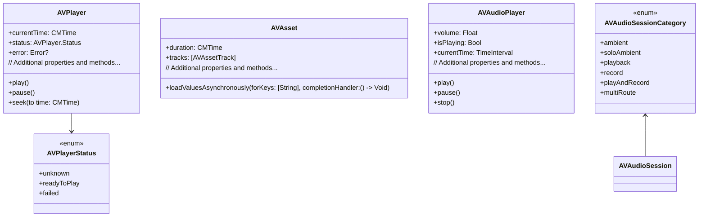

---

## **2. Initializers Overview**

### **a. Initialization Methods Diagram**
- **Purpose**: Break down the various ways to instantiate key AVFoundation classes.
- **Diagram Type**: `flowchart LR`
- **Contents**:
  - **AVPlayer Initializers**: `init(url:)`, `init(playerItem:)`
  - **AVAsset Initializers**: `init(url:)`, `init(asset:mixingWith:)`
  - **AVAudioPlayer Initializers**: `init(contentsOf: URL)`, `init(data: Data)`

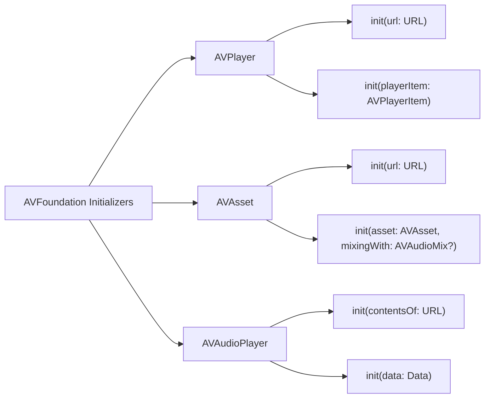

---

## **3. Properties Breakdown**

### **a. Key Properties Diagram**
- **Purpose**: Detail the main properties of key AVFoundation classes.
- **Diagram Type**: `graph LR`
- **Contents**:
  - **AVPlayer Properties**: `currentTime`, `status`, `rate`, `error`
  - **AVAsset Properties**: `duration`, `tracks`, `metadata`
  - **AVAudioPlayer Properties**: `volume`, `isPlaying`, `currentTime`, `delegate`

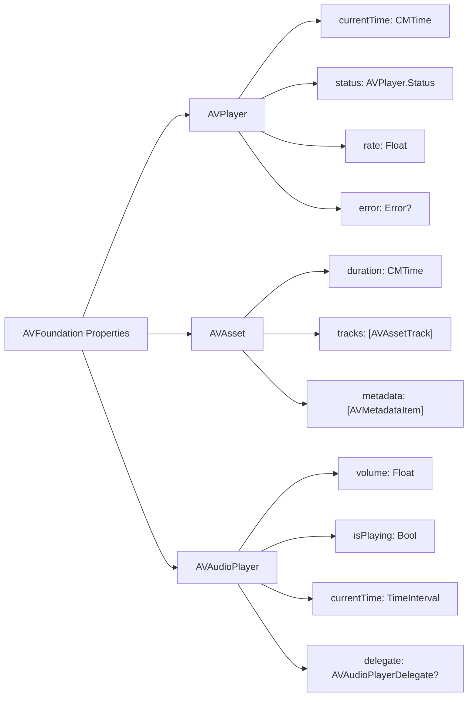


---

## **4. Methods Grouped by Functionality**

### **a. Playback Control Methods**
- **Purpose**: Categorize methods based on their roles in controlling media playback.
- **Diagram Type**: `flowchart TD`
- **Contents**:
  - **AVPlayer Methods**: `play()`, `pause()`, `seek(to:)`
  - **AVAudioPlayer Methods**: `play()`, `pause()`, `stop()`, `prepareToPlay()`
  - **AVAsset Methods**: `loadValuesAsynchronously(forKeys:completionHandler:)`

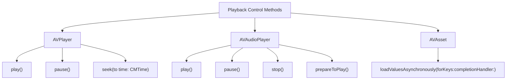

---

## **5. Enumerations and Configurations**

### **a. Enumerations Diagram**
- **Purpose**: Highlight the enums used within AVFoundation and their possible values.
- **Diagram Type**: `classDiagram`
- **Contents**:
  - **AVPlayer.Status**
  - **AVAudioSession.Category**
  - **AVAudioPlayerErrorCode**
  - **AVAsset.TrackID**

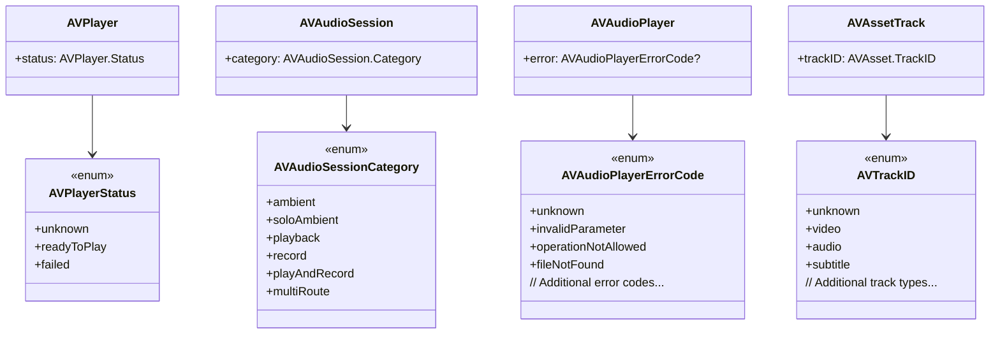

### **b. Configuration Classes Diagram**
- **Purpose**: Show the relationship between AVFoundation classes and their configuration classes.
- **Diagram Type**: `classDiagram`
- **Contents**:
  - **AVAudioSession**
  - **AVPlayerItem**
  - **AVAssetExportSession**

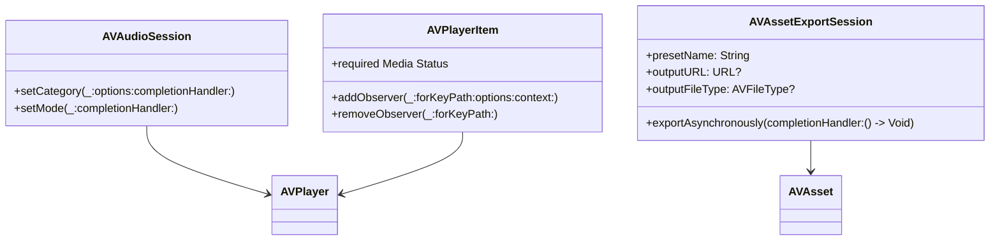

---

## **6. Protocol Conformances**

### **a. Protocols Diagram**
- **Purpose**: Display the protocols that key AVFoundation classes conform to and their impact.
- **Diagram Type**: `classDiagram`
- **Contents**:
  - **AVAudioPlayerDelegate**
  - **AVPlayerItemMetadataOutputPushDelegate**
  - **AVAssetWriterInputDelegate**
  - **AVCaptureFileOutputRecordingDelegate**

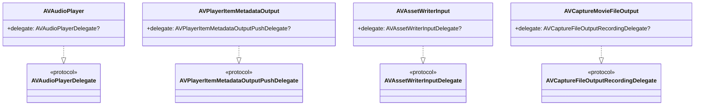

---

## **7. Relationships with Other Classes**

### **a. Related Classes Diagram**
- **Purpose**: Illustrate how AVFoundation interacts with other UIKit classes and frameworks.
- **Diagram Type**: `flowchart TD`
- **Contents**:
  - **UIView & UIViewController**: Displaying video content.
  - **UIImage**: Thumbnail generation from video frames.
  - **CoreMedia**: Handling media data.
  - **CoreAudio**: Audio processing.
  - **AVKit**: High-level video playback UI.
  - **Metal**: Video rendering optimizations.
  - **CoreAnimation**: Animating video layers.

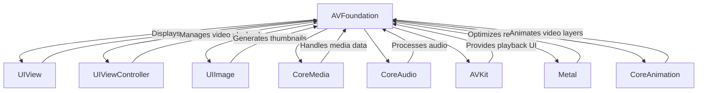

---

## **8. Extensions and Additional Functionalities**

### **a. AVFoundation Extensions Diagram**
- **Purpose**: Showcase the additional functionalities provided through extensions.
- **Diagram Type**: `classDiagram`
- **Contents**:
  - **AVAsset Extensions**
  - **AVPlayer Extensions**
  - **AVAudioPlayer Extensions**
  - **Helper Functions**
  - **Custom Configurations**

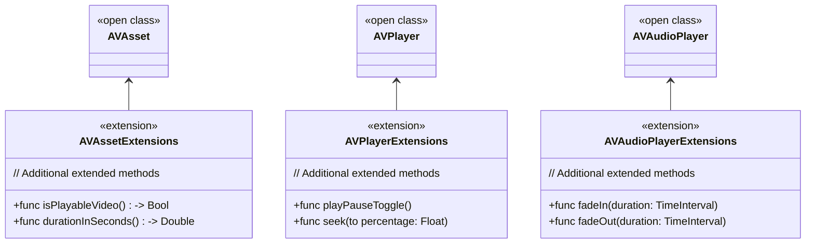

### **b. Extensions Functionalities Flowchart**
- **Purpose**: Detail specific extended methods and their purposes.
- **Diagram Type**: `flowchart LR`
- **Contents**:
  - **Playback Enhancements**
  - **Audio Controls**
  - **Asset Utilities**

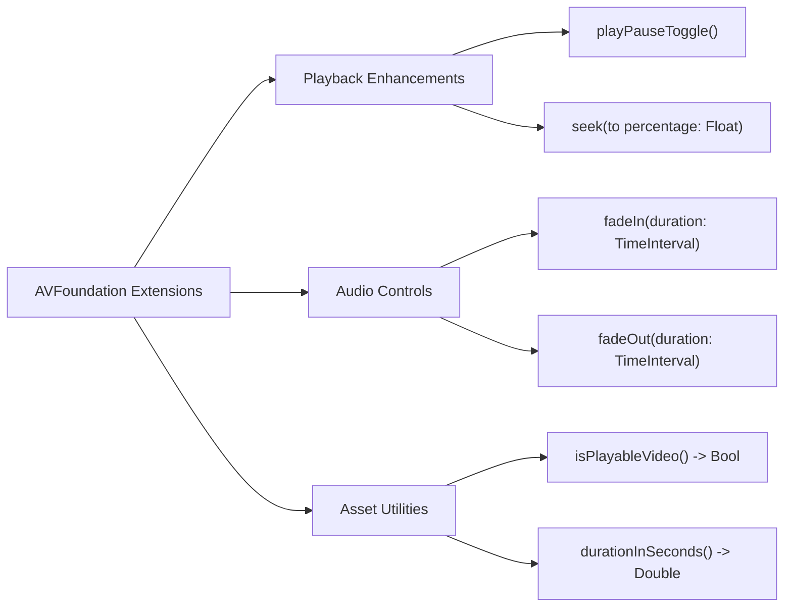

---

## **9. Lifecycle and Use Cases**

### **a. Lifecycle Flowchart**
- **Purpose**: Demonstrate the typical lifecycle of AVFoundation components within an application.
- **Diagram Type**: `flowchart TD`
- **Contents**:
  - **Initialization**
  - **Configuration**
  - **Playback**
  - **Monitoring**
  - **Termination**

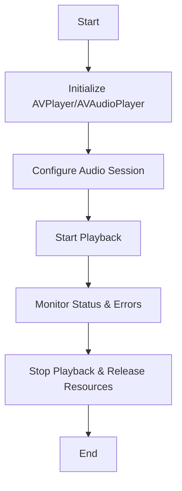

### **b. Common Use Cases Diagram**
- **Purpose**: Outline the typical scenarios where AVFoundation is utilized.
- **Diagram Type**: `flowchart TD`
- **Contents**:
  - **Video Playback**
  - **Audio Playback**
  - **Media Recording**
  - **Live Streaming**
  - **Media Editing**
  - **Thumbnail Generation**
  - **Audio Processing**
  - **Custom Media Pipelines**

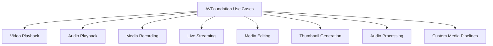

---

## **10. Feature Availability Timeline**

### **a. Feature Availability Gantt Chart**
- **Purpose**: Show when various AVFoundation features were introduced across iOS versions.
- **Diagram Type**: `gantt`
- **Contents**:
  - **iOS Versions**: 4.0, 5.0, 6.0, 7.0, 8.0, 10.0, 11.0, 12.0, 13.0, 14.0, 15.0, 16.0, 17.0
  - **Features Introduced**: AVPlayer enhancements, AVAudioPlayer improvements, Live Streaming support, HDR content, SceneKit integration, etc.

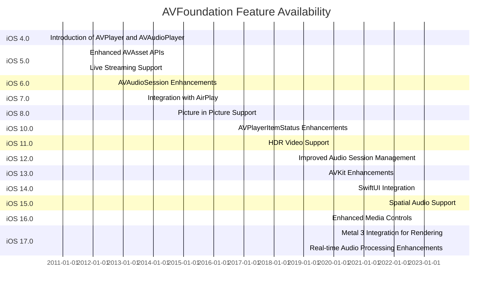

---

## **11. Data Handling and Formats**

### **a. Media Format Handling Diagram**
- **Purpose**: Explain how AVFoundation handles different media data formats.
- **Diagram Type**: `graph LR`
- **Contents**:
  - **Video Formats**: MP4, MOV, HEVC
  - **Audio Formats**: AAC, MP3, WAV
  - **Image Formats**: PNG, JPEG (for thumbnails)
  - **Metadata Formats**: ID3, XMP

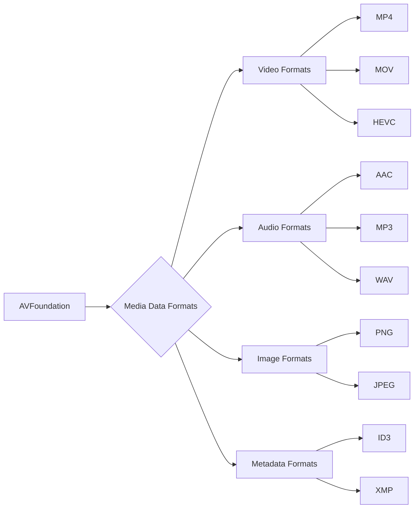

---

## **12. Integration with Drawing Contexts**

### **a. Drawing Methods Usage Diagram**
- **Purpose**: Show how AVFoundation methods are used within drawing contexts.
- **Diagram Type**: `flowchart TD`
- **Contents**:
  - **Rendering Video Frames**
  - **Applying Video Filters**
  - **Custom Animations**
  - **Overlaying Graphics**

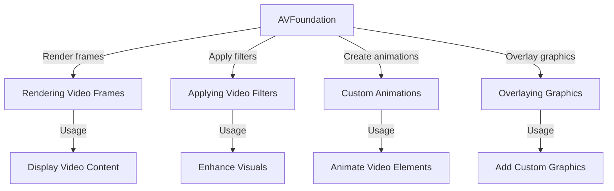

---

## **13. Summary and Best Practices**

### **a. Summary Diagram**
- **Purpose**: Provide a high-level overview of AVFoundation's key characteristics and functionalities.
- **Diagram Type**: `graph LR`
- **Contents**:
  - **Comprehensive Media Handling**
  - **Advanced Playback Controls**
  - **Robust Recording Capabilities**
  - **Seamless Integration with UI Frameworks**
  - **High-Performance Rendering**
  - **Extensive Format Support**

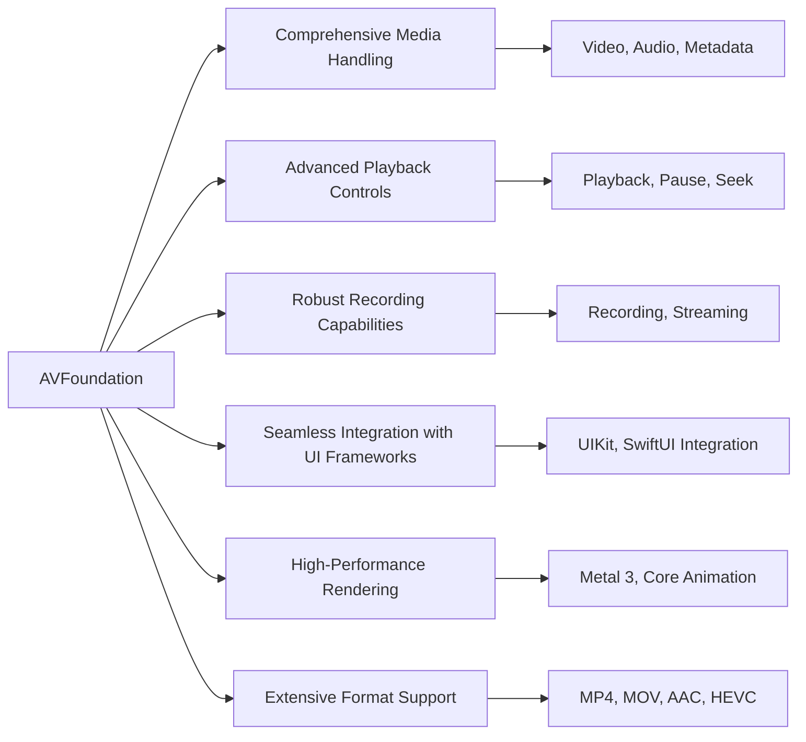

### **b. Best Practices Diagram**
- **Purpose**: Highlight the best practices when using AVFoundation.
- **Diagram Type**: `graph TB`
- **Contents**:
  - **Efficient Resource Management**
  - **Handling Asynchronous Operations**
  - **Robust Error Handling**
  - **Optimizing Performance**
  - **Ensuring Compatibility**
  - **Securing Media Data**

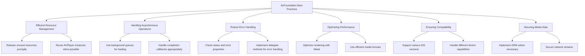

---

## **14. Additional Class Diagrams for AVFoundation**

### **a. AVPlayer and AVPlayerItem Relationship**
- **Purpose**: Illustrate the relationship between `AVPlayer` and `AVPlayerItem`.
- **Diagram Type**: `classDiagram`
- **Contents**:
  - **AVPlayer**
  - **AVPlayerItem**
  - **Properties and Methods**

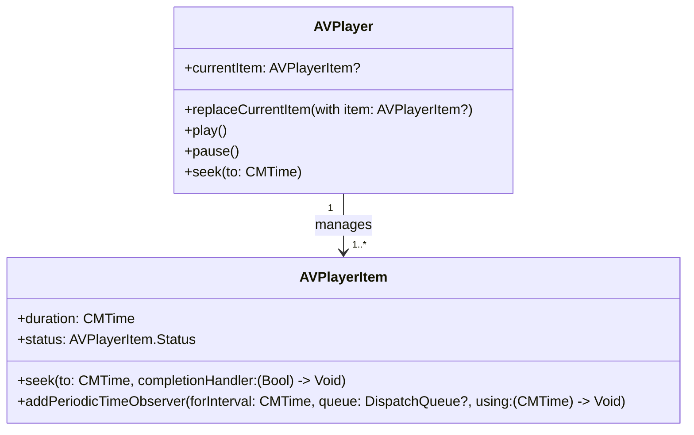

### **b. AVAsset and AVAssetTrack Relationship**
- **Purpose**: Show how `AVAsset` relates to `AVAssetTrack`.
- **Diagram Type**: `classDiagram`
- **Contents**:
  - **AVAsset**
  - **AVAssetTrack**
  - **Properties and Methods**

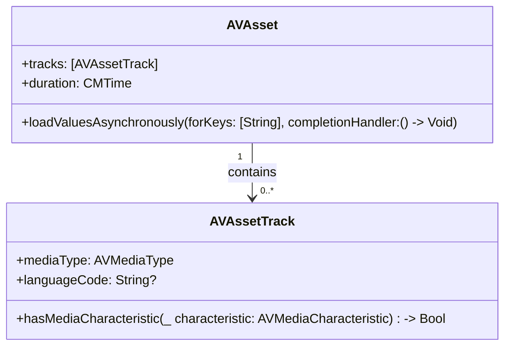

### **c. AVAudioSession Configuration**
- **Purpose**: Detail how `AVAudioSession` is configured for different audio scenarios.
- **Diagram Type**: `classDiagram`
- **Contents**:
  - **AVAudioSession**
  - **Methods for Configuration**
  - **Enumerations**

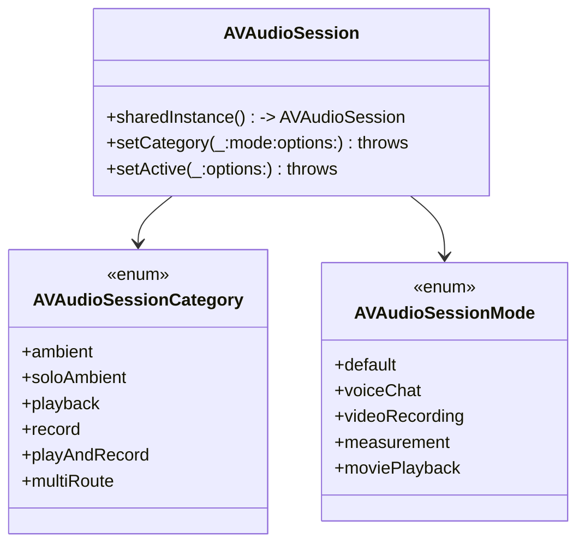

---

## **15. Error Handling in AVFoundation**

### **a. Error Handling Flowchart**
- **Purpose**: Illustrate the workflow for handling errors in AVFoundation.
- **Diagram Type**: `flowchart TD`
- **Contents**:
  - **Detecting Errors**
  - **Responding to Errors**
  - **Recovering from Errors**

```mermaid
flowchart TD
    A[Start] --> B[Perform AVFoundation Operation]
    B --> C{Error Occurred?}
    C -- Yes --> D[Check Error Code]
    C -- No --> E[Continue Operation]

    D --> F{Error Type}
    F -- Playback Error --> G[Handle Playback Error]
    F -- Recording Error --> H[Handle Recording Error]
    F -- Asset Loading Error --> I[Handle Asset Error]
    F -- Other Errors --> J[Handle General Errors]

    G --> K[Notify User & Retry]
    H --> K
    I --> K
    J --> K

    K --> L[End]
    E --> L
```

### **b. Common Error Codes Diagram**
- **Purpose**: List and categorize common error codes in AVFoundation.
- **Diagram Type**: `classDiagram`
- **Contents**:
  - **AVError Codes**
  - **Descriptions**

```mermaid
classDiagram
    class AVError {
        +unknown
        +outOfOrder
        +connectionFailed
        +serverIncorrectlyTerminated
        +deviceAlreadyUsedByAnotherPlayer
        +mediaServicesWereReset
        +formatNotRecognized
        +dataNotReady
        +diskFull
        +decodeFailed
        // Additional error codes...
    }

    class ErrorDescription {
        <<class>>
        +code: AVError
        +message: String
    }

    AVError --> ErrorDescription : has
```

---

## **16. Advanced Features and Integrations**

### **a. Live Streaming Setup Diagram**
- **Purpose**: Outline the components and setup required for live streaming using AVFoundation.
- **Diagram Type**: `flowchart TD`
- **Contents**:
  - **Capture Session**
  - **Video and Audio Inputs**
  - **AVAssetWriter**
  - **Network Stream**

```mermaid
flowchart TD
    A[Live Streaming Setup] --> B[AVCaptureSession]
    B --> C["Video Input (AVCaptureDevice)"]
    B --> D["Audio Input (AVCaptureDevice)"]
    A --> E[AVAssetWriter]
    E --> F["AVAssetWriterInput (Video)"]
    E --> G["AVAssetWriterInput (Audio)"]
    A --> H["Network Stream (RTMP/HTTP)"]
    F --> H
    G --> H
    
```


### **b. Media Editing Workflow Diagram**
- **Purpose**: Display the workflow for editing media using AVFoundation.
- **Diagram Type**: `flowchart TD`
- **Contents**:
  - **Importing Media**
  - **Adding Effects**
  - **Trimming Clips**
  - **Exporting Edited Media**

```mermaid
flowchart TD
    A[Media Editing Workflow] --> B[Importing Media]
    B --> C[Adding Effects]
    C --> D[Trimming Clips]
    D --> E[Exporting Edited Media]

    B -->|Use AVAsset| AVAsset
    C -->|Apply AVVideoComposition| AVVideoComposition
    D -->|Use AVAssetExportSession| AVAssetExportSession
    E -->|Export to Desired Format| OutputFile
```

---

## **17. Integrating AVFoundation with SwiftUI**

### **a. SwiftUI Video Player Integration Diagram**
- **Purpose**: Show how to integrate `AVPlayer` with SwiftUI's `VideoPlayer`.
- **Diagram Type**: `flowchart TD`
- **Contents**:
  - **SwiftUI View**
  - **AVPlayer Setup**
  - **Binding and Controls**

```mermaid
flowchart TD
    A[SwiftUI VideoPlayer Integration] --> B[Create AVPlayer Instance]
    B --> C[Configure AVPlayer with AVPlayerItem]
    C --> D[Embed AVPlayer in SwiftUI VideoPlayer View]
    D --> E[Add Playback Controls]
    E --> F[Handle Player State Changes]

	%% Syntax error so comment out for now %%
    %% B -->|let player = AVPlayer(url: videoURL)| C
    %% D -->|VideoPlayer(player: player)| E
    
```

### **b. SwiftUI Audio Player Integration Diagram**
- **Purpose**: Illustrate how to integrate `AVAudioPlayer` with SwiftUI controls.
- **Diagram Type**: `flowchart TD`
- **Contents**:
  - **SwiftUI View**
  - **AVAudioPlayer Setup**
  - **Binding and Controls**

```mermaid
flowchart TD
    A[SwiftUI AudioPlayer Integration] --> B[Initialize AVAudioPlayer]
    B --> C[Configure Audio Session]
    C --> D[Create SwiftUI View with Controls]
    D --> E[Bind Play/Pause Buttons to AVAudioPlayer Methods]
    E --> F[Update UI Based on Player State]

	%% Syntax error so comment out for now %%
    %%B -->|let audioPlayer = AVAudioPlayer(contentsOf: audioURL)| C
    %%D -->|Buttons bound to audioPlayer.play()/pause()| E
    
```

---

## **18. Security Considerations**

### **a. Securing Media Content Diagram**
- **Purpose**: Outline best practices for securing media content using AVFoundation.
- **Diagram Type**: `flowchart TD`
- **Contents**:
  - **Digital Rights Management (DRM)**
  - **Secure Network Streams**
  - **Encrypted Media Files**
  - **Access Control**

```mermaid
flowchart TD
    A[Securing Media Content] --> B["Digital Rights Management (DRM)"]
    A --> C[Secure Network Streams]
    A --> D[Encrypted Media Files]
    A --> E[Access Control]

    B --> B1[Use FairPlay for DRM]
    C --> C1[Implement HTTPS for Streaming]
    D --> D1[Encrypt Media Files with AES]
    E --> E1[Restrict Access Based on User Authentication]
    
```


### **b. GDPR and Privacy Compliance Diagram**
- **Purpose**: Ensure AVFoundation usage complies with GDPR and privacy regulations.
- **Diagram Type**: `flowchart TD`
- **Contents**:
  - **Data Collection**
  - **User Consent**
  - **Data Encryption**
  - **Data Minimization**

```mermaid
flowchart TD
    A[GDPR & Privacy Compliance] --> B[Data Collection]
    A --> C[User Consent]
    A --> D[Data Encryption]
    A --> E[Data Minimization]

    B --> B1[Limit data to necessary media information]
    C --> C1[Obtain explicit consent for data usage]
    D --> D1[Encrypt sensitive media data]
    E --> E1[Collect only essential user data]
```

---

## **19. Performance Optimization**

### **a. Media Caching Strategy Diagram**
- **Purpose**: Display strategies for caching media to enhance performance.
- **Diagram Type**: `flowchart TD`
- **Contents**:
  - **In-Memory Caching**
  - **Disk Caching**
  - **Using AVAssetCache**
  - **Prefetching Media**

```mermaid
flowchart TD
    A[Media Caching Strategies] --> B[In-Memory Caching]
    A --> C[Disk Caching]
    A --> D[Using AVAssetCache]
    A --> E[Prefetching Media]

    B --> B1[Store frequently accessed media in RAM]
    C --> C1[Save media files to disk for persistent access]
    D --> D1[Utilize AVAssetCache for efficient caching]
    E --> E1[Preload media ahead of playback]
```

### **b. Asynchronous Loading and Processing Diagram**
- **Purpose**: Illustrate the use of asynchronous operations to improve performance.
- **Diagram Type**: `flowchart TD`
- **Contents**:
  - **Loading AVAssets Asynchronously**
  - **Processing Media in Background Threads**
  - **Updating UI on Main Thread**
  - **Handling Completion Handlers**

```mermaid
flowchart TD
    A[Asynchronous Operations] --> B[Load AVAssets Asynchronously]
    A --> C[Process Media in Background Threads]
    A --> D[Update UI on Main Thread]
    A --> E[Handle Completion Handlers]

    B --> B1["AVAsset.loadValuesAsynchronously(forKeys:completionHandler:)"]
    C --> C1["Use DispatchQueue.global() for processing"]
    D --> D1["DispatchQueue.main.async { update UI }"]
    E --> E1["Handle completion with callbacks or closures"]
```

---

## **20. Testing and Debugging**

### **a. Testing AVFoundation Components Diagram**
- **Purpose**: Outline strategies for testing AVFoundation components.
- **Diagram Type**: `flowchart TD`
- **Contents**:
  - **Unit Testing**
  - **Integration Testing**
  - **Mocking AVFoundation Classes**
  - **Automated UI Testing**

```mermaid
flowchart TD
    A[Testing AVFoundation Components] --> B[Unit Testing]
    A --> C[Integration Testing]
    A --> D[Mocking AVFoundation Classes]
    A --> E[Automated UI Testing]

    B --> B1[Test individual methods and properties]
    C --> C1[Test interactions between components]
    D --> D1[Use protocols and dependency injection for mocking]
    E --> E1[Automate playback and recording scenarios]
```

### **b. Debugging AVFoundation Issues Diagram**
- **Purpose**: Provide a workflow for debugging common AVFoundation issues.
- **Diagram Type**: `flowchart TD`
- **Contents**:
  - **Identify Issue**
  - **Check AVFoundation Status and Error Properties**
  - **Use Xcode Debugger**
  - **Inspect Media Files**
  - **Validate Network Connections**

```mermaid
flowchart TD
    A[Start Debugging] --> B[Identify Issue]
    B --> C{Check Status & Error}
    C -- Has Error --> D[Inspect Error Properties]
    C -- No Error --> E[Use Xcode Debugger]

    D --> F[Analyze Error Code]
    F --> G[Refer to Documentation]

    E --> H[Step Through Code]
    H --> I[Inspect Media Files]
    I --> J[Validate Network Connections]

    J --> K[Resolve Issue]
    K --> L[End]
```

---

## **21. Accessibility Integration**

### **a. Making Media Accessible Diagram**
- **Purpose**: Ensure media content is accessible to all users.
- **Diagram Type**: `flowchart TD`
- **Contents**:
  - **Captions and Subtitles**
  - **Audio Descriptions**
  - **VoiceOver Support**
  - **Custom Accessibility Actions**

```mermaid
flowchart TD
    A[Accessibility in AVFoundation] --> B[Captions and Subtitles]
    A --> C[Audio Descriptions]
    A --> D[VoiceOver Support]
    A --> E[Custom Accessibility Actions]

    B --> B1[Add .srt or .vtt files for subtitles]
    C --> C1[Provide audio descriptions for visual content]
    D --> D1[Ensure AVPlayerViewController is accessible]
    E --> E1[Implement custom actions for media controls]
```

### **b. Accessibility Best Practices Diagram**
- **Purpose**: Highlight best practices for integrating accessibility with AVFoundation.
- **Diagram Type**: `flowchart TB`
- **Contents**:
  - **Enable Subtitles**
  - **Provide Audio Descriptions**
  - **Support VoiceOver**
  - **Ensure Keyboard Navigation**
  - **Use Accessible Controls**

```mermaid
flowchart TB
    A[Accessibility Best Practices] --> B[Enable Subtitles]
    A --> C[Provide Audio Descriptions]
    A --> D[Support VoiceOver]
    A --> E[Ensure Keyboard Navigation]
    A --> F[Use Accessible Controls]

    B --> B1[Allow users to toggle subtitles]
    C --> C1[Embed audio descriptions in media]
    D --> D1[Label media controls for VoiceOver]
    E --> E1[Ensure all controls are reachable via keyboard]
    F --> F1[Implement accessible buttons and sliders]
```

---

## **22. Localization and Internationalization**

### **a. Localizing Media Content Diagram**
- **Purpose**: Outline steps to localize media content using AVFoundation.
- **Diagram Type**: `flowchart TD`
- **Contents**:
  - **Localize Subtitles**
  - **Provide Multiple Audio Tracks**
  - **Adapt to Locale-Specific Formats**
  - **Handle Right-to-Left Languages**

```mermaid
flowchart TD
    A[Localizing Media Content] --> B[Localize Subtitles]
    A --> C[Provide Multiple Audio Tracks]
    A --> D[Adapt to Locale-Specific Formats]
    A --> E[Handle Right-to-Left Languages]

    B --> B1[Create subtitle files for each language]
    C --> C1[Embed multiple audio tracks in AVAsset]
    D --> D1[Adjust date and number formats]
    E --> E1[Mirror UI elements for RTL languages]
```

### **b. Internationalization Best Practices Diagram**
- **Purpose**: Highlight best practices for internationalizing media applications.
- **Diagram Type**: `graph TB`
- **Contents**:
  - **Use NSLocalizedString**
  - **Support Multiple Regions**
  - **Handle Time Zones**
  - **Test with Different Locales**

```mermaid
graph TB
    A[Internationalization Best Practices] --> B[Use NSLocalizedString]
    A --> C[Support Multiple Regions]
    A --> D[Handle Time Zones]
    A --> E[Test with Different Locales]

    B --> B1[Localize UI strings related to media]
    C --> C1[Provide media content for various regions]
    D --> D1[Adjust playback times based on time zones]
    E --> E1[Test app functionality with different locale settings]
```

---

## **23. Real-Time Communication**

### **a. Implementing Real-Time Audio/Video Communication Diagram**
- **Purpose**: Outline the components required for real-time communication using AVFoundation.
- **Diagram Type**: `flowchart TD`
- **Contents**:
  - **Capture Audio/Video**
  - **Encode Media Streams**
  - **Transmit Over Network**
  - **Decode and Play Received Streams**

```mermaid
flowchart TD
    A[Real-Time Communication] --> B[Capture Audio/Video]
    B --> C[Encode Media Streams]
    C --> D[Transmit Over Network]
    D --> E[Receive Media Streams]
    E --> F[Decode and Play Streams]

    B -->|Use AVCaptureSession| C
    C -->|Use AVAssetWriter| D
    E -->|Use AVAssetReader| F
```

### **b. Real-Time Communication Best Practices Diagram**
- **Purpose**: Highlight best practices for implementing real-time communication with AVFoundation.
- **Diagram Type**: `flowchart TB`
- **Contents**:
  - **Optimize Latency**
  - **Ensure Stream Stability**
  - **Handle Network Variations**
  - **Secure Communication Channels**
  - **Implement Error Recovery**

```mermaid
flowchart TB
    A[Real-Time Communication Best Practices] --> B[Optimize Latency]
    A --> C[Ensure Stream Stability]
    A --> D[Handle Network Variations]
    A --> E[Secure Communication Channels]
    A --> F[Implement Error Recovery]

    B --> B1[Use efficient encoding settings]
    C --> C1[Maintain consistent frame rates]
    D --> D1[Adapt to bandwidth changes]
    E --> E1[Use encryption protocols like TLS]
    F --> F1[Retry failed transmissions]
```

---
