# AVKit
> This content is dual-licensed under your choice of the following licenses:
> 1.  **MIT License:** For the code implementations in Swift and Mermaid provided in this document.
> 2.  **Creative Commons Attribution 4.0 International License (CC BY 4.0):** For all other content, including the text, explanations, and the Mermaid diagrams and illustrations.

---

Below is a comprehensive and organized set of Mermaid diagrams for the `AVKit` framework. This guide covers various aspects of `AVKit`, including class structures, initializers, properties, methods, enumerations, protocols, relationships, extensions, lifecycle, feature availability, data handling, integration, and best practices.

---

## **1. Class Structure and Hierarchy**

### **a. Core Class Diagram**
- **Purpose**: Illustrate the primary structure of `AVPlayerViewController`, including its properties, methods, and related enumerations.
- **Diagram Type**: `classDiagram`
- **Contents**:
  - **Properties**: Key attributes like `player`, `videoGravity`, `isMuted`, etc.
  - **Methods**: Essential functions like `play()`, `pause()`, `seek(to:)`, etc.
  - **Enumerations**: Nested enums such as `VideoGravity`, `PlaybackControls`.

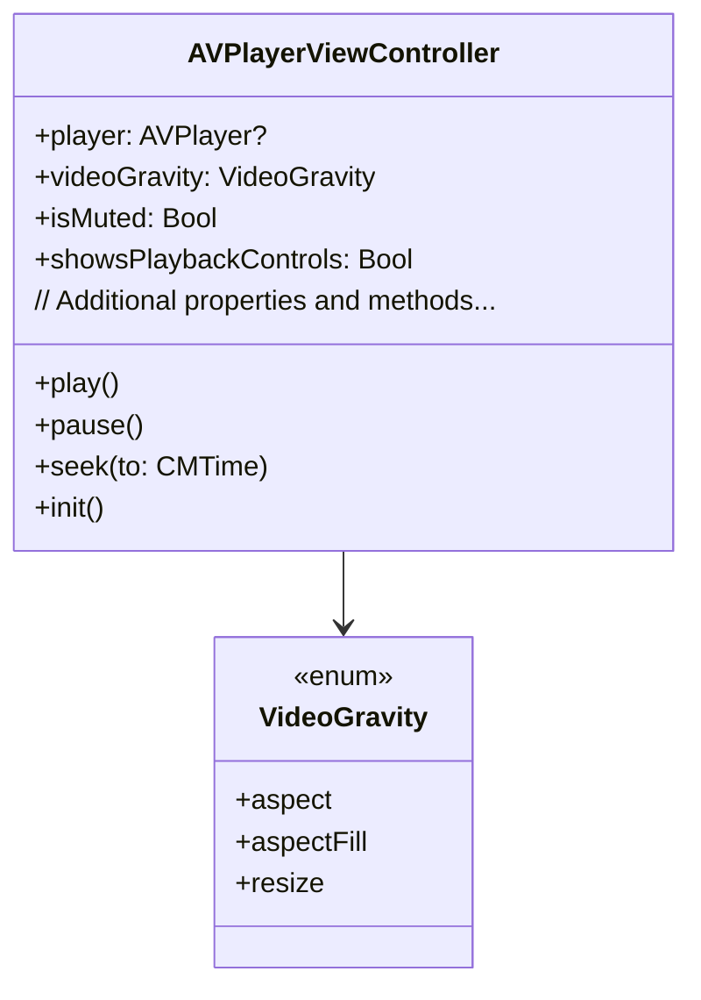

---

## **2. Initializers Overview**

### **a. Initialization Methods Diagram**
- **Purpose**: Break down the various ways to instantiate `AVPlayerViewController` and related classes.
- **Diagram Type**: `flowchart LR`
- - **Contents**:
  - **Default Initializers**: `init()`
  - **Player-Based Initializers**: `init(player:)`
  - **Storyboard Initializers**: `init(coder:)`

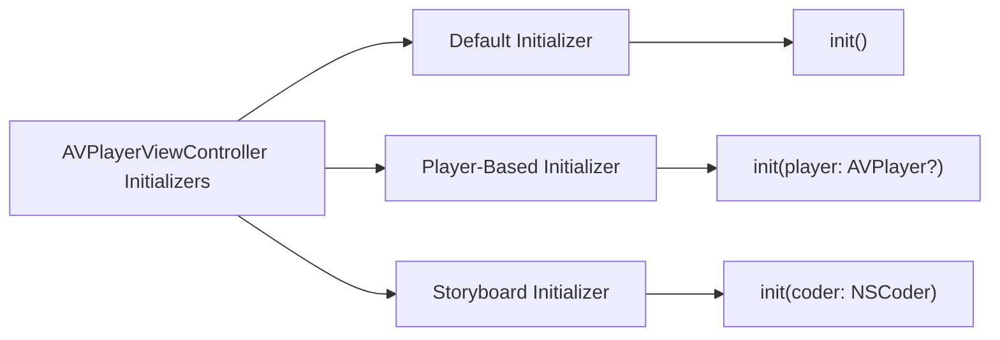

---

## **3. Properties Breakdown**

### **a. Key Properties Diagram**
- **Purpose**: Detail the main properties of `AVPlayerViewController` and related classes.
- **Diagram Type**: `graph LR`
- **Contents**:
  - **Player Management**: `player`, `isMuted`, `isPlaybackLikelyToKeepUp`
  - **Display Attributes**: `videoGravity`, `showsPlaybackControls`, `entersFullScreenWhenPlaybackBegins`
  - **User Interaction**: `allowsPictureInPicturePlayback`, `delegate`

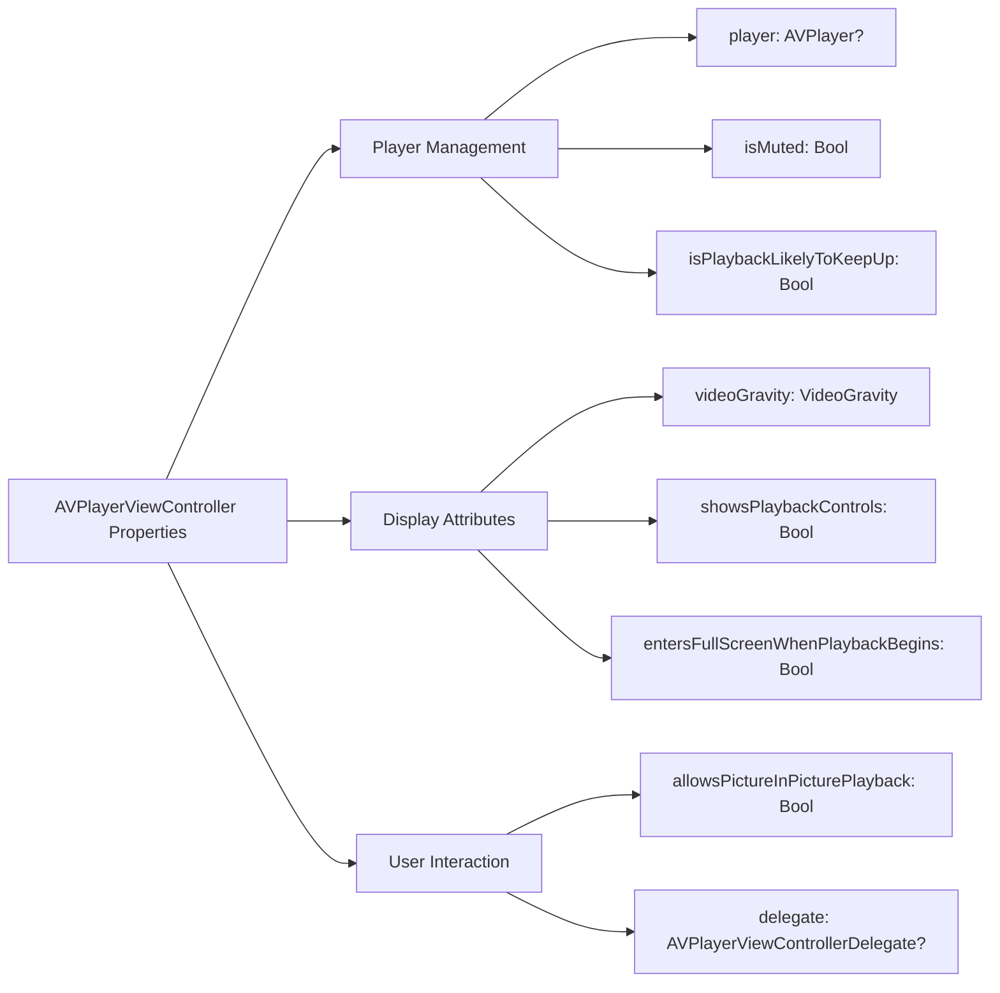

---

## **4. Methods Grouped by Functionality**

### **a. Playback Control Methods**
- **Purpose**: Categorize methods based on their roles in controlling media playback.
- **Diagram Type**: `flowchart TD`
- **Contents**:
  - **Playback Commands**: `play()`, `pause()`, `stop()`
  - **Seek Operations**: `seek(to:)`, `seek(to:completionHandler:)`
  - **Time Control**: `rate`, `currentTime()`

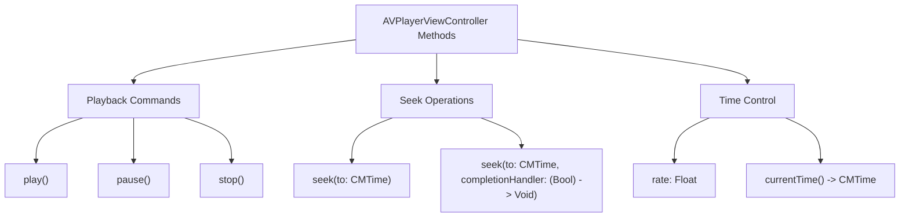

---

## **5. Enumerations and Configurations**

### **a. Enumerations Diagram**
- **Purpose**: Highlight the enums used within `AVKit` and their possible values.
- **Diagram Type**: `classDiagram`
- **Contents**:
  - **VideoGravity**
  - **PlaybackControls**
  - **PictureInPictureStatus**

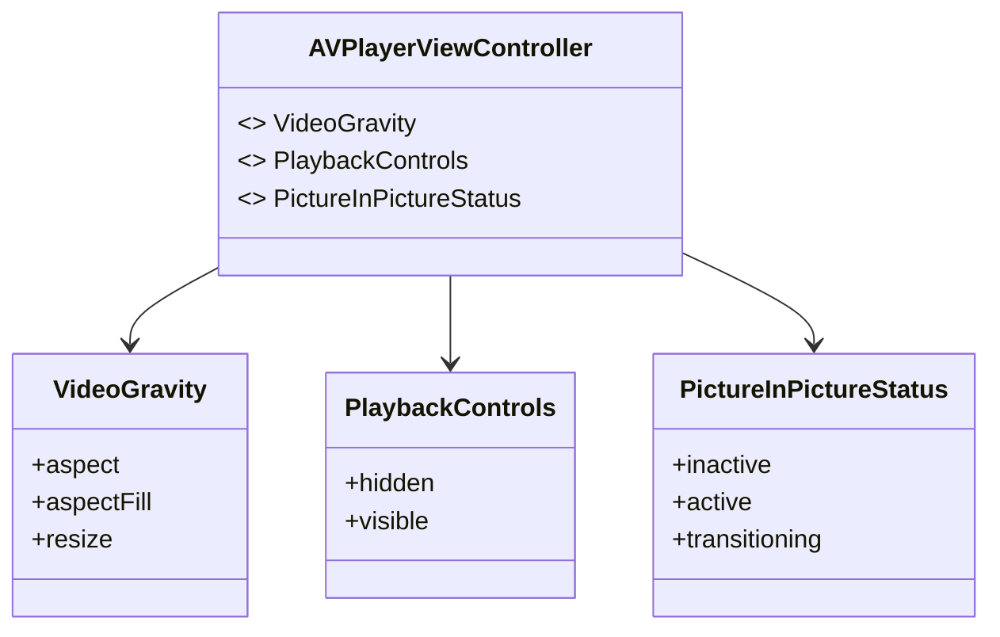

### **b. Configuration Classes Diagram**
- **Purpose**: Show the relationship between `AVPlayerViewController` and its configuration classes.
- **Diagram Type**: `classDiagram`
- **Contents**:
  - **AVPictureInPictureController**
  - **AVPlayerViewControllerDelegate**

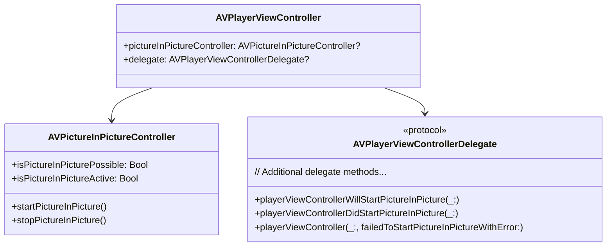

---

## **6. Protocol Conformances**

### **a. Protocols Diagram**
- **Purpose**: Display the protocols that `AVPlayerViewController` conforms to and their impact.
- **Diagram Type**: `classDiagram`
- **Contents**:
  - **AVPictureInPictureControllerDelegate**
  - **UIContentContainer**
  - **UIViewControllerTransitioningDelegate**

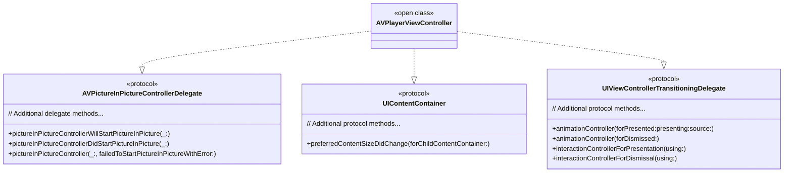

---

## **7. Relationships with Other Classes**

### **a. Related Classes Diagram**
- **Purpose**: Illustrate how `AVPlayerViewController` interacts with other `AVKit` and `UIKit` classes and frameworks.
- **Diagram Type**: `flowchart TD`
- **Contents**:
  - **AVPlayer**: Manages media playback.
  - **AVPlayerItem**: Represents the media to be played.
  - **AVPictureInPictureController**: Manages PiP functionality.
  - **UIViewController**: Base class for view controllers.
  - **NSNotificationCenter**: Observes playback notifications.

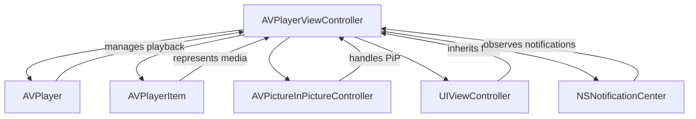

---

## **8. Extensions and Additional Functionalities**

### **a. AVPlayer Extensions Diagram**
- **Purpose**: Showcase the additional functionalities provided through extensions to `AVPlayer` and related classes.
- **Diagram Type**: `classDiagram`
- **Contents**:
  - **AVPlayerLooper**
  - **AVQueuePlayer**
  - **AVPlayerViewController Extensions**

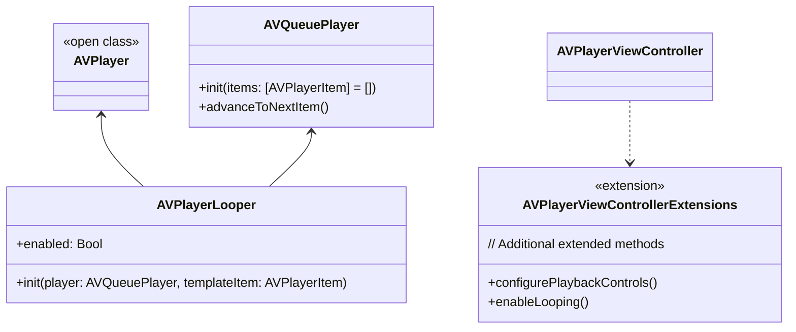

### **b. Extensions Functionalities Flowchart**
- **Purpose**: Detail specific extended methods and their purposes.
- **Diagram Type**: `flowchart LR`
- **Contents**:
  - **Playback Controls Configuration**
  - **Looping Mechanisms**
  - **Queue Management**

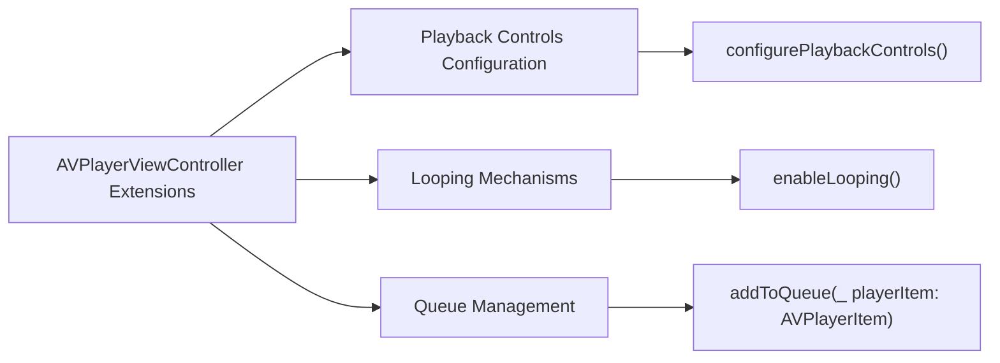

---

## **9. Lifecycle and Use Cases**

### **a. Lifecycle Flowchart**
- **Purpose**: Demonstrate the typical lifecycle of an `AVPlayerViewController` within an application.
- **Diagram Type**: `flowchart TD`
- **Contents**:
  - **Initialization**
  - **Configuration**
  - **Playback**
  - **User Interaction**
  - **Termination**

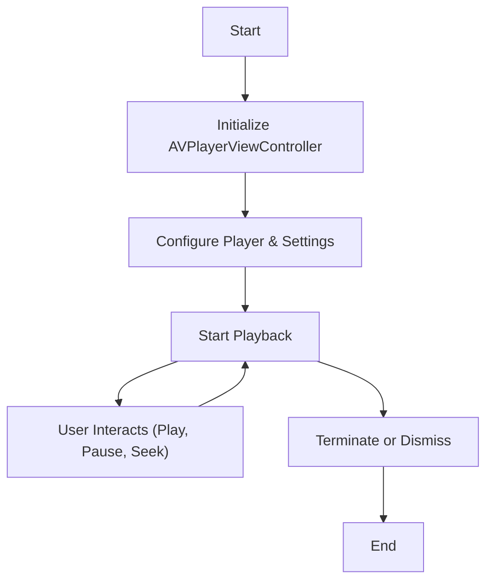

### **b. Common Use Cases Diagram**
- **Purpose**: Outline the typical scenarios where `AVPlayerViewController` is utilized.
- **Diagram Type**: `flowchart TD`
- **Contents**:
  - **Video Streaming**
  - **Local Media Playback**
  - **Picture-in-Picture Mode**
  - **Live Broadcasting**
  - **Interactive Media Experiences**

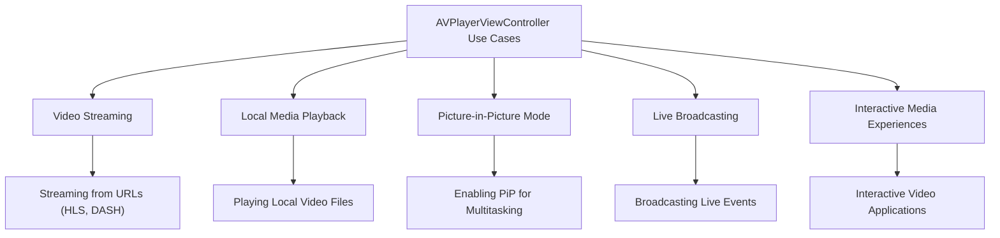

---

## **10. Feature Availability Timeline**

### **a. Feature Availability Gantt Chart**
- **Purpose**: Show when various `AVKit` features were introduced across iOS versions.
- **Diagram Type**: `gantt`
- **Contents**:
  - **iOS Versions**: 4.3, 5.0, 7.0, 9.0, 10.0, 11.0, 12.0, 14.0, 15.0, 16.0, 17.0
  - **Features Introduced**: AVPlayerViewController, Picture-in-Picture, AirPlay 2 Integration, Content Display Enhancements, etc.

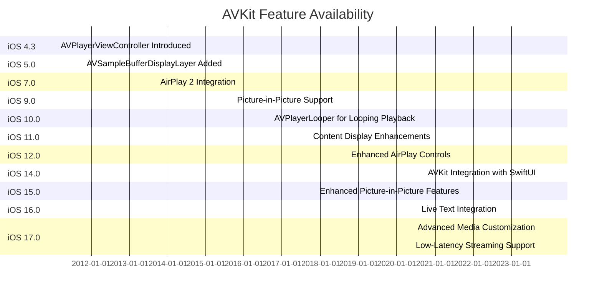

---

## **11. Data Handling and Formats**

### **a. Media Format Handling Diagram**
- **Purpose**: Explain how `AVPlayer` and `AVPlayerViewController` handle different media data formats.
- **Diagram Type**: `graph LR`
- **Contents**:
  - **Video Formats**: H.264, HEVC, ProRes
  - **Audio Formats**: AAC, MP3, ALAC
  - **Streaming Protocols**: HLS, DASH, RTMP
  - **Subtitles & Closed Captions**: SRT, WebVTT

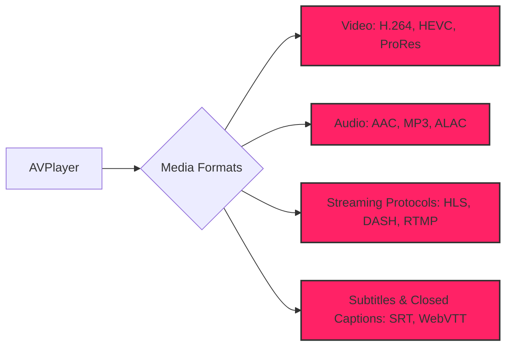

---

## **12. Integration with Drawing Contexts**

### **a. Video Rendering Methods Diagram**
- **Purpose**: Show how `AVPlayerViewController` integrates with rendering contexts for video display.
- **Diagram Type**: `flowchart TD`
- **Contents**:
  - **Layer Integration**: `AVPlayerLayer`
  - **Rendering Options**: `videoGravity`
  - **Custom Rendering**: Using `Core Animation` and `Metal`

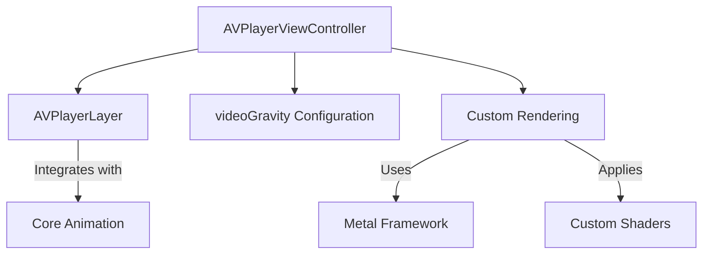

---

## **13. Summary and Best Practices**

### **a. Summary Diagram**
- **Purpose**: Provide a high-level overview of `AVKit`'s key characteristics and functionalities.
- **Diagram Type**: `graph LR`
- **Contents**:
  - **Robust Media Playback**
  - **Seamless Streaming Support**
  - **Advanced User Interactions**
  - **Extensible Architecture**
  - **Performance Optimizations**

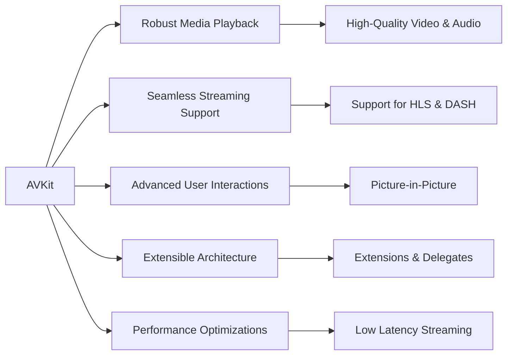

### **b. Best Practices Diagram**
- **Purpose**: Outline best practices when using `AVKit` for optimal performance and user experience.
- **Diagram Type**: `graph TD`
- **Contents**:
  - **Efficient Resource Management**
  - **Responsive UI Design**
  - **Error Handling**
  - **Accessibility Considerations**
  - **Security Measures**

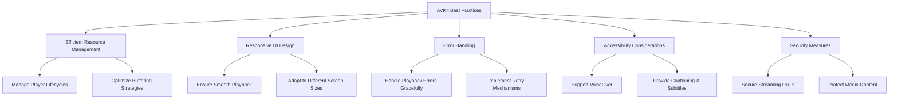

---
