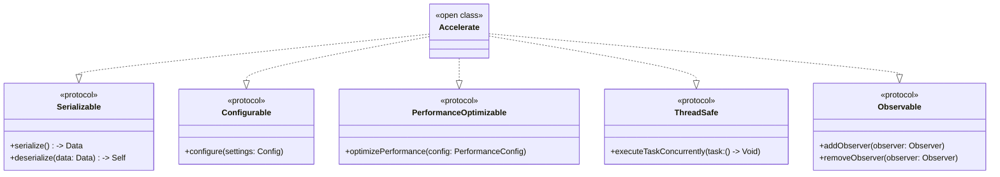

# Accelerate
> This content is dual-licensed under your choice of the following licenses:
> 1.  **MIT License:** For the code implementations in Swift and Mermaid provided in this document.
> 2.  **Creative Commons Attribution 4.0 International License (CC BY 4.0):** For all other content, including the text, explanations, and the Mermaid diagrams and illustrations.

---

## **1. Class Structure and Hierarchy**

### **a. Core Class Diagram**
- **Purpose**: Illustrate the primary structure of `Accelerate`, including its properties, methods, and enumerations.
- **Diagram Type**: `classDiagram`
- **Contents**:
  - **Properties**: Key attributes like `frameworkVersion`, `supportedOperations`, etc.
  - **Methods**: Essential functions like `performFFT()`, `matrixMultiply()`, etc.
  - **Enumerations**: Nested enums such as `OperationType`, `Precision`, `MemoryManagement`.

---

## **2. Initializers Overview**

### **a. Initialization Methods Diagram**
- **Purpose**: Break down the various ways to instantiate `Accelerate`.
- **Diagram Type**: `flowchart`
- **Contents**:
  - **Version-Based Initializers**: `init(version:)`
  - **Precision-Based Initializers**: `init(precision:)`
  - **Combined Initializers**: `init(version:precision:)`
  - **Default Initializers**: `init()`

---

## **3. Properties Breakdown**

### **a. Key Properties Diagram**
- **Purpose**: Detail the main properties of `Accelerate`.
- **Diagram Type**: `graph LR`
- **Contents**:
  - **Framework Information**: `frameworkVersion`, `nativeArchitecture`
  - **Supported Operations**: `supportedOperations`
  - **Precision Settings**: `precision`
  - **Memory Settings**: `memoryManagement`
  - **Performance Metrics**: `lastExecutionTime`, `currentLoad`

---

## **4. Methods Grouped by Functionality**

### **a. Computational Methods**
- **Purpose**: Categorize methods based on their roles in high-performance computations.
- **Diagram Type**: `flowchart TD`
- **Contents**:
  - **Fourier Transforms**: `performFFT()`, `performIFFT()`
  - **Linear Algebra**: `matrixMultiply()`, `vectorAdd()`
  - **Image Processing**: `filterImage()`, `resizeImage()`
  - **Neural Networks**: `trainModel()`, `predict()`
  - **Signal Processing**: `filterSignal()`, `analyzeSpectrum()`

---

## **5. Enumerations and Configurations**

### **a. Enumerations Diagram**
- **Purpose**: Highlight the enums used within `Accelerate` and their possible values.
- **Diagram Type**: `classDiagram`
- **Contents**:
  - **OperationType**
  - **Precision**
  - **MemoryManagement**

### **b. Configuration Classes Diagram**
- **Purpose**: Show the relationship between `Accelerate` and its configuration classes.
- **Diagram Type**: `classDiagram`
- **Contents**:
  - **Config**
  - **PerformanceConfig**

---

## **6. Protocol Conformances**

### **a. Protocols Diagram**
- **Purpose**: Display the protocols that `Accelerate` conforms to and their impact.
- **Diagram Type**: `classDiagram`
- **Contents**:
  - **Serializable**
  - **Configurable**
  - **PerformanceOptimizable**
  - **ThreadSafe**
  - **Observable**

---

## **7. Relationships with Other Classes**

### **a. Related Classes Diagram**
- **Purpose**: Illustrate how `Accelerate` interacts with other classes and frameworks.
- **Diagram Type**: `flowchart TD`
- **Contents**:
  - **Matrix**: Represents mathematical matrices.
  - **Vector**: Represents mathematical vectors.
  - **UIImage**: For image processing.
  - **Model**: Represents machine learning models.
  - **Filter**: Represents image or signal filters.
  - **Spectrum**: Represents frequency spectrum data.
  - **FilterParams**: Parameters for signal filtering.
  - **PerformanceConfig**: Configuration for performance optimization.

---

## **8. Extensions and Additional Functionalities**

### **a. Accelerate Extensions Diagram**
- **Purpose**: Showcase the additional functionalities provided through extensions.
- **Diagram Type**: `classDiagram`
- **Contents**:
  - **FFTExtensions**
  - **MatrixExtensions**
  - **ImageProcessingExtensions**

### **b. Extensions Functionalities Flowchart**
- **Purpose**: Detail specific extended methods and their purposes.
- **Diagram Type**: `flowchart LR`
- **Contents**:
  - **Advanced FFT Methods**
  - **Matrix Utilities**
  - **Image Processing Utilities**

---

## **9. Lifecycle and Use Cases**

### **a. Lifecycle Flowchart**
- **Purpose**: Demonstrate the typical lifecycle of an `Accelerate` instance within an application.
- **Diagram Type**: `flowchart TD`
- **Contents**:
  - **Initialization**
  - **Configuration**
  - **Execution of Operations**
  - **Performance Monitoring**
  - **Optimization**
  - **Termination**

### **b. Common Use Cases Diagram**
- **Purpose**: Outline the typical scenarios where `Accelerate` is utilized.
- **Diagram Type**: `flowchart TD`
- **Contents**:
  - **Signal Processing**
  - **Image Processing**
  - **Machine Learning**
  - **Scientific Computing**
  - **Real-Time Data Analysis**
  - **Audio Processing**
  - **Video Processing**
  - **Financial Calculations**

---

## **10. Feature Availability Timeline**

### **a. Feature Availability Gantt Chart**
- **Purpose**: Show when various `Accelerate` features were introduced across iOS versions.
- **Diagram Type**: `gantt`
- **Contents**:
  - **iOS Versions**: 8.0, 9.0, 10.0, 11.0, 12.0, 13.0, 14.0, 15.0, 16.0, 17.0
  - **Features Introduced**: FFT operations, BLAS enhancements, LAPACK routines, vImage filters, BNNS for neural networks, advanced memory management, GPU acceleration, real-time processing, improved thread safety, machine learning integration.

---

## **11. Data Handling and Formats**

### **a. Data Format Handling Diagram**
- **Purpose**: Explain how `Accelerate` handles different data formats.
- **Diagram Type**: `graph LR`
- **Contents**:
  - **Floating Point**: `Float`, `Double`
  - **Complex Numbers**: `Complex`
  - **Integer Types**: `Int`, `UInt`
  - **Matrix Structures**: `Matrix`
  - **Vector Structures**: `Vector`
  - **Image Data**: `UIImage`
  - **Model Data**: `Model`

---

## **12. Integration with Computational Contexts**

### **a. Computational Methods Usage Diagram**
- **Purpose**: Show how `Accelerate` methods are used within different computational contexts.
- **Diagram Type**: `flowchart TD`
- **Contents**:
  - **Signal Processing**
  - **Image Processing**
  - **Machine Learning**
  - **Scientific Computing**
  - **Real-Time Analysis**

### **b. Integration with Hardware Diagram**
- **Purpose**: Illustrate how `Accelerate` integrates with hardware components for optimized performance.
- **Diagram Type**: `flowchart LR`
- **Contents**:
  - **CPU**
  - **GPU**
  - **Neural Engines**
  - **Memory Controllers**
  - **Cache Systems**

---

## **13. Summary and Best Practices**

### **a. Summary Diagram**
- **Purpose**: Provide a high-level overview of `Accelerate`'s key characteristics and functionalities.
- **Diagram Type**: `graph LR`
- **Contents**:
  - **High-Performance Computing**
  - **Versatile Operations**
  - **Efficient Memory Management**
  - **Seamless Integration with iOS**
  - **Scalable Architecture**
  - **Advanced Optimization Techniques**
  - **Robust Framework Support**

---

## **Best Practices for Using `Accelerate`**

1. **Understand Data Formats**: Ensure that data passed to `Accelerate` methods is in the correct format (e.g., floating-point for FFT operations).
2. **Optimize Memory Usage**: Leverage `Accelerate`'s memory management settings to balance performance and resource consumption.
3. **Utilize GPU Acceleration**: Wherever possible, utilize GPU-accelerated methods to maximize computational throughput.
4. **Thread Safety**: Implement thread-safe practices when performing concurrent operations to prevent data races and ensure consistency.
5. **Profile Performance**: Use profiling tools to monitor the performance impact of `Accelerate` operations and identify bottlenecks.
6. **Stay Updated**: Keep abreast of the latest `Accelerate` framework updates and enhancements introduced in new iOS versions.
7. **Leverage Extensions**: Utilize available extensions to enhance functionality and streamline complex operations.
8. **Error Handling**: Implement robust error handling to gracefully manage and recover from computational errors.
9. **Modular Design**: Structure your code to take advantage of `Accelerate`’s modular architecture for better scalability and maintainability.
10. **Documentation and Community Resources**: Consult Apple's official documentation and community resources for best practices and advanced usage scenarios.

---
