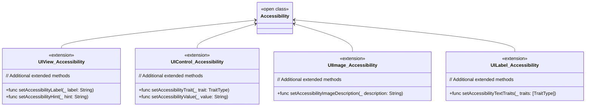

# Accessibility
> This content is dual-licensed under your choice of the following licenses:
> 1.  **MIT License:** For the code implementations in Swift and Mermaid provided in this document.
> 2.  **Creative Commons Attribution 4.0 International License (CC BY 4.0):** For all other content, including the text, explanations, and the Mermaid diagrams and illustrations.

---

## **1. Class Structure and Hierarchy**

### **a. Core Class Diagram**
- **Purpose**: Illustrate the primary structure of `Accessibility`, including its properties, methods, and enumerations.
- **Diagram Type**: `classDiagram`
- **Contents**:
  - **Properties**: Key attributes like `identifier`, `label`, `traits`, etc.
  - **Methods**: Essential functions like initializers, `announce()`, `isElementAccessible()`, etc.
  - **Enumerations**: Nested enums such as `TraitType`, `NotificationType`.

---

## **2. Initializers Overview**

### **a. Initialization Methods Diagram**
- **Purpose**: Break down the various ways to instantiate `Accessibility`.
- **Diagram Type**: `flowchart` or `graph LR`
- **Contents**:
  - **Default Initializers**: `init()`
  - **Custom Initializers**: `init(identifier:label:hint:traits:)`
  - **Convenience Initializers**: `init(element: UIView)`

---

## **3. Properties Breakdown**

### **a. Key Properties Diagram**
- **Purpose**: Detail the main properties of `Accessibility`.
- **Diagram Type**: `graph LR` or `classDiagram`
- **Contents**:
  - **Identification**: `identifier`, `label`, `hint`
  - **Traits**: `traits`
  - **Layout Attributes**: `frame`, `isAccessibilityElement`
  - **State**: `isSelected`, `isEnabled`

---

## **4. Methods Grouped by Functionality**

### **a. Accessibility Notification Methods**
- **Purpose**: Categorize methods based on their roles in accessibility notifications.
- **Diagram Type**: `flowchart TD`
- **Contents**:
  - **Announcement Methods**: `announce(message:)`
  - **Notification Posting**: `post(notification:element:)`
  - **Focus Management**: `setFocus(to:)`

---

## **5. Enumerations and Configurations**

### **a. Enumerations Diagram**
- **Purpose**: Highlight the enums used within `Accessibility` and their possible values.
- **Diagram Type**: `classDiagram`
- **Contents**:
  - **TraitType**
  - **NotificationType**

### **b. Configuration Classes Diagram**
- **Purpose**: Show the relationship between `Accessibility` and its configuration classes.
- **Diagram Type**: `classDiagram`
- **Contents**:
  - **AccessibilityConfiguration**
  - **CustomTrait**

---

## **6. Protocol Conformances**

### **a. Protocols Diagram**
- **Purpose**: Display the protocols that `Accessibility` conforms to and their impact.
- **Diagram Type**: `classDiagram`
- **Contents**:
  - **NSSecureCoding**
  - **UIAccessibilityIdentification**
  - **UIAccessibilityFocus**
  - **UIAccessibilityElementProtocol**
  - **Sendable**

---

## **7. Relationships with Other Classes**

### **a. Related Classes Diagram**
- **Purpose**: Illustrate how `Accessibility` interacts with other UIKit classes and frameworks.
- **Diagram Type**: `flowchart TD`
- **Contents**:
  - **UIView**: Elements with accessibility
  - **UIAccessibilityElement**: Represents accessibility elements
  - **UIAccessibilityContainer**: Groups accessibility elements
  - **UIAccessibilityTraits**: Defines traits for accessibility
  - **UIAccessibilityNotification**: Notifications for accessibility events
  - **UILabel**, **UIButton**, **UIImageView**: Common UI components utilizing accessibility

---

## **8. Extensions and Additional Functionalities**

### **a. Accessibility Extensions Diagram**
- **Purpose**: Showcase the additional functionalities provided through extensions.
- **Diagram Type**: `classDiagram`
- **Contents**:
  - **UIView+Accessibility**
  - **UIControl+Accessibility**
  - **UIImage+Accessibility**
  - **UILabel+Accessibility**

### **b. Extensions Functionalities Flowchart**
- **Purpose**: Detail specific extended methods and their purposes.
- **Diagram Type**: `flowchart LR`
- **Contents**:
  - **Setting Labels and Hints**
  - **Configuring Traits**
  - **Describing Images**
  - **Customizing Text Traits**

---

## **9. Lifecycle and Use Cases**

### **a. Lifecycle Flowchart**
- **Purpose**: Demonstrate the typical lifecycle of an `Accessibility` instance within an application.
- **Diagram Type**: `flowchart TD`
- **Contents**:
  - **Initialization**
  - **Configuration**
  - **Integration with UI Elements**
  - **Notification Posting**
  - **User Interaction**
  - **State Updates**
  - **Deallocation**

### **b. Common Use Cases Diagram**
- **Purpose**: Outline the typical scenarios where `Accessibility` is utilized.
- **Diagram Type**: `flowchart TD`
- **Contents**:
  - **VoiceOver Support**
  - **Dynamic Type Adjustments**
  - **Assistive Touch Enhancements**
  - **Custom Accessibility Elements**
  - **Accessibility Notifications**
  - **Interactive Voice Commands**

---

## **10. Feature Availability Timeline**

### **a. Feature Availability Gantt Chart**
- **Purpose**: Show when various `Accessibility` features were introduced across iOS versions.
- **Diagram Type**: `gantt`
- **Contents**:
  - **iOS Versions**: 5.0, 6.0, 7.0, 8.0, 9.0, 10.0, 11.0, 12.0, 13.0, 14.0, 15.0, 16.0, 17.0
  - **Features Introduced**: VoiceOver enhancements, Dynamic Type, Accessibility APIs for SwiftUI, Custom Traits, Assistive Technologies Support, Improved Notification System, Image Descriptions, Accessibility Inspector tools.

---

## **11. Data Handling and Formats**

### **a. Accessibility Data Formats Diagram**
- **Purpose**: Explain how `Accessibility` handles different data formats and information relevant to accessibility.
- **Diagram Type**: `graph LR`
- **Contents**:
  - **Labels and Hints**: Textual descriptions
  - **Traits**: Enumerations defining element types
  - **Notifications**: Accessibility events
  - **Custom Actions**: User-defined actions

---

## **12. Integration with UI Components**

### **a. Accessibility Integration Diagram**
- **Purpose**: Show how `Accessibility` methods are used within different UI components.
- **Diagram Type**: `flowchart TD`
- **Contents**:
  - **UILabel**
    - `setAccessibilityLabel(_:)`
    - `setAccessibilityHint(_:)`
  - **UIButton**
    - `setAccessibilityLabel(_:)`
    - `setAccessibilityTrait(_:)`
  - **UIImageView**
    - `setAccessibilityImageDescription(_:)`
  - **Custom UIView**
    - `setAccessibilityCustomElements(_:)`

---

## **13. Summary and Best Practices**

### **a. Summary Diagram**
- **Purpose**: Provide a high-level overview of `Accessibility`'s key characteristics and functionalities.
- **Diagram Type**: `graph LR` or `mindmap`
- **Contents**:
  - **Comprehensive Identification**
  - **Rich Trait Definitions**
  - **Seamless UI Integration**
  - **Dynamic Notifications**
  - **Customizable Actions**
  - **Enhanced User Experience**
  

---

## **Best Practices for Implementing Accessibility**

1. **Provide Descriptive Labels and Hints**:
   - Ensure all interactive elements have clear and concise labels.
   - Use hints to offer additional context where necessary.

2. **Use Appropriate Traits**:
   - Assign relevant traits to UI elements to convey their purpose and behavior.
   - Combine multiple traits when applicable (e.g., `button` and `selected`).

3. **Support Dynamic Type and VoiceOver**:
   - Ensure text scales appropriately with Dynamic Type settings.
   - Test with VoiceOver to verify that all elements are navigable and understandable.

4. **Implement Custom Accessibility Elements**:
   - For complex UI components, create custom accessibility elements to provide detailed information.
   
5. **Post Accessibility Notifications Responsibly**:
   - Use notifications like `layoutChanged` or `announcement` to inform users of dynamic changes.

6. **Ensure Sufficient Contrast and Size**:
   - Maintain high contrast between text and background.
   - Ensure touch targets are adequately sized for ease of use.

7. **Test Across Multiple Devices and Settings**:
   - Validate accessibility features on different devices and with various accessibility settings enabled.

8. **Leverage Accessibility Inspector Tools**:
   - Utilize Xcode’s Accessibility Inspector to identify and fix accessibility issues during development.

9. **Maintain Consistency**:
   - Follow platform conventions for accessibility to provide a familiar experience to users.

10. **Stay Updated with iOS Accessibility Enhancements**:
    - Continuously learn about new accessibility features introduced in iOS updates and incorporate them as appropriate.

By adhering to these best practices and utilizing the comprehensive `Accessibility` class structure outlined in the diagrams above, developers can create inclusive and user-friendly applications that cater to a diverse range of users.

---
**Licenses:**

- **MIT License:**   - Full text in [LICENSE](LICENSE) file.
- **Creative Commons Attribution 4.0 International:**  - Legal details in [LICENSE-CC-BY](LICENSE-CC-BY) and at [Creative Commons official site](http://creativecommons.org/licenses/by/4.0/).

---