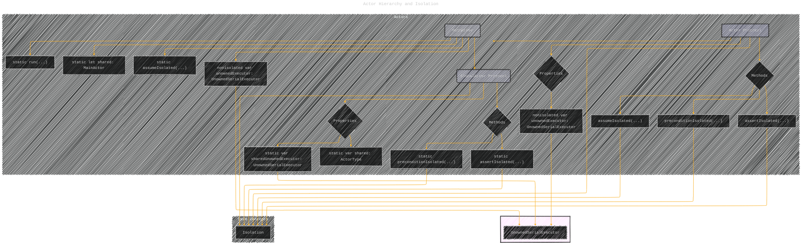

# Actor Hierarchy and Isolation - A Diagrammatic Guide 
> **Disclaimer:**
>
> This document contains my personal notes on the topic,
> compiled from publicly available documentation and various cited sources.
> The materials are intended for educational purposes, personal study, and reference.
> The content is dual-licensed:
> 1. **MIT License:** Applies to all code implementations (Swift, Mermaid, and other programming languages).
> 2. **Creative Commons Attribution 4.0 International License (CC BY 4.0):** Applies to all non-code content, including text, explanations, diagrams, and illustrations.
---

## Actor Hierarchy and Isolation

This diagram shows the relationship TWEEN `Actor`, `GlobalActor`, and the specific `MainActor`. It also highlights the core isolation mechanisms.

**Explanation:**

*   `Actor` is the base protocol.
*   `GlobalActor` builds on `Actor`, defining a shared instance (`shared`) and its associated executor (`sharedUnownedExecutor`).
*   `MainActor` is a specific, concrete `GlobalActor` provided by the system.
*   Actors ensure safety through isolation, checked via `preconditionIsolated`, `assertIsolated`, and `assumeIsolated`.
*   The `unownedExecutor` property links an actor instance to its underlying `SerialExecutor`.

---
**Licenses:**

- **MIT License:**   - Full text in [LICENSE](LICENSE) file.
- **Creative Commons Attribution 4.0 International:**  - Legal details in [LICENSE-CC-BY](LICENSE-CC-BY) and at [Creative Commons official site](http://creativecommons.org/licenses/by/4.0/).

---