---

# Analytics Reports

## **1. Class Structure and Hierarchy**

### **a. Core Class Diagram**
- **Purpose**: Illustrate the primary structure of `AnalyticsReport`, including its properties, methods, and enumerations.
- **Diagram Type**: `classDiagram`
- **Contents**:
  - **Properties**: Key attributes like `reportID`, `startDate`, `endDate`, `events`, etc.
  - **Methods**: Essential functions like initializers, `generateReport()`, `exportAsCSV()`, etc.
  - **Enumerations**: Nested enums such as `ReportType`, `ExportFormat`, `Status`.

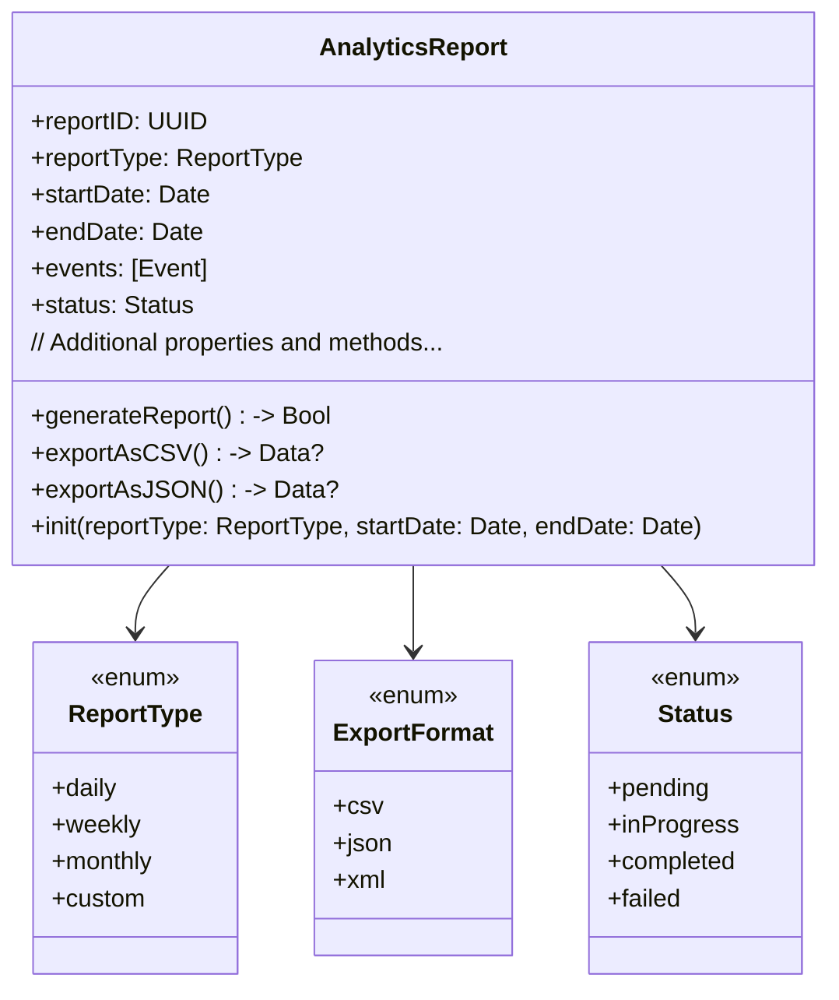

---

## **2. Initializers Overview**

### **a. Initialization Methods Diagram**
- **Purpose**: Break down the various ways to instantiate `AnalyticsReport`.
- **Diagram Type**: `flowchart LR`
- **Contents**:
  - **Default Initializers**: `init(reportType:startDate:endDate:)`
  - **Custom Initializers**: `init(reportID:reportType:startDate:endDate:events:)`
  - **Factory Methods**: `createDailyReport()`, `createWeeklyReport()`
  - **Configuration-Based Initializers**: `init(configuration:)`

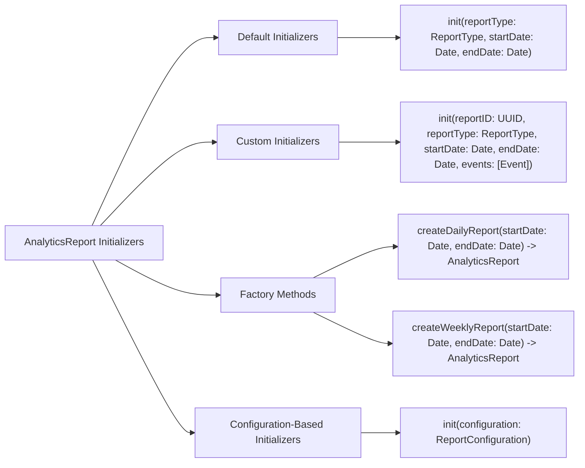

---

## **3. Properties Breakdown**

### **a. Key Properties Diagram**
- **Purpose**: Detail the main properties of `AnalyticsReport`.
- **Diagram Type**: `graph LR`
- **Contents**:
  - **Report Identification**: `reportID`, `reportType`
  - **Time Frame**: `startDate`, `endDate`
  - **Data Content**: `events`, `metrics`
  - **Status Attributes**: `status`, `progress`
  - **Export Details**: `exportFormat`, `exportedData`

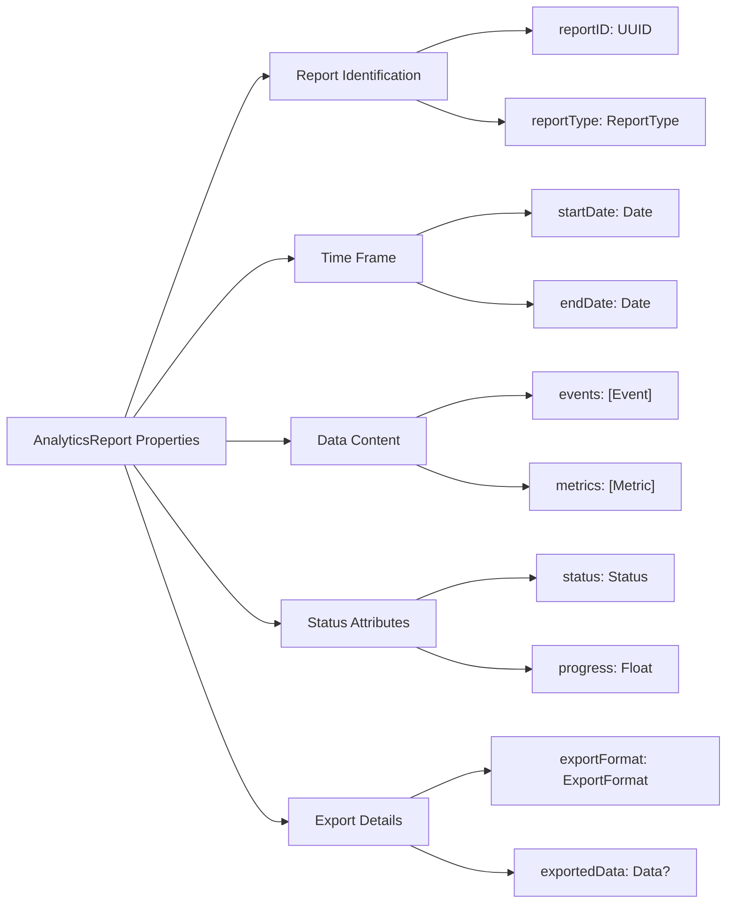

---

## **4. Methods Grouped by Functionality**

### **a. Report Generation Methods**
- **Purpose**: Categorize methods based on their roles in generating analytics reports.
- **Diagram Type**: `flowchart TD`
- **Contents**:
  - **Generation Methods**: `generateReport()`, `refreshReport()`
  - **Export Methods**: `exportAsCSV()`, `exportAsJSON()`, `exportAsXML()`
  - **Data Handling Methods**: `addEvent(_:)`, `removeEvent(_:)`, `filterEvents(criteria:)`
  - **Reporting Methods**: `summarizeMetrics()`, `visualizeData()`

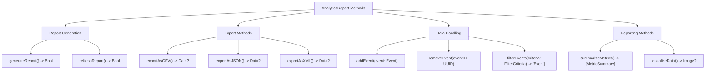

---

## **5. Enumerations and Configurations**

### **a. Enumerations Diagram**
- **Purpose**: Highlight the enums used within `AnalyticsReport` and their possible values.
- **Diagram Type**: `classDiagram`
- **Contents**:
  - **ReportType**
  - **ExportFormat**
  - **Status**

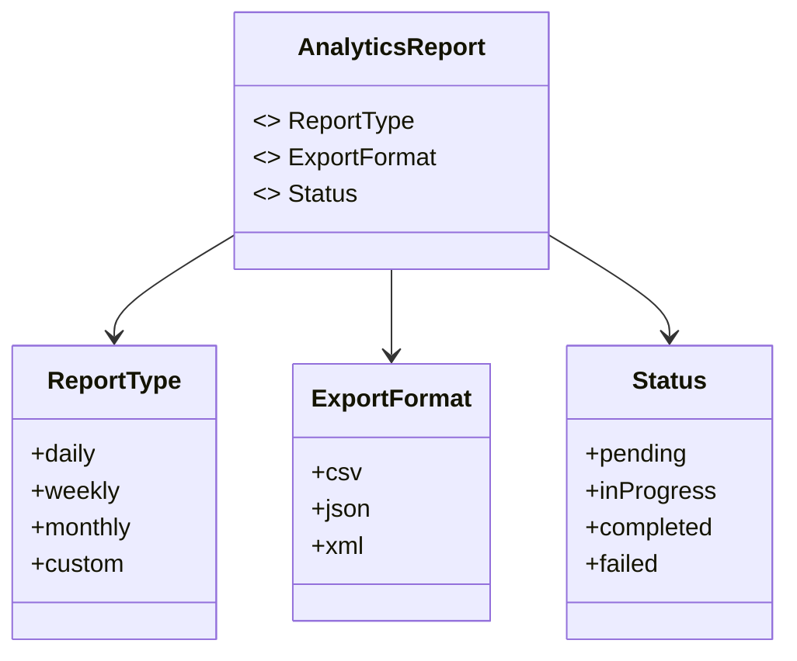

### **b. Configuration Classes Diagram**
- **Purpose**: Show the relationship between `AnalyticsReport` and its configuration classes.
- **Diagram Type**: `classDiagram`
- **Contents**:
  - **ReportConfiguration**
  - **FilterCriteria**

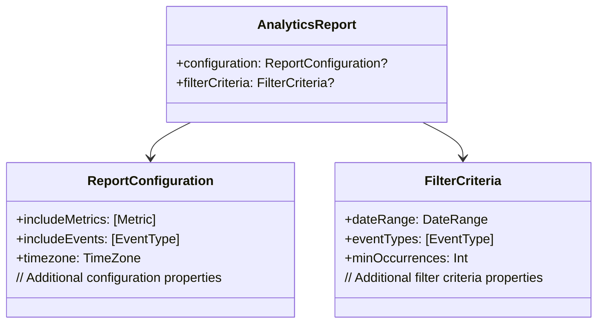

---

## **6. Protocol Conformances**

### **a. Protocols Diagram**
- **Purpose**: Display the protocols that `AnalyticsReport` conforms to and their impact.
- **Diagram Type**: `classDiagram`
- **Contents**:
  - **Codable**
  - **Comparable**
  - **Identifiable**
  - **CustomStringConvertible**
  - **Sendable**

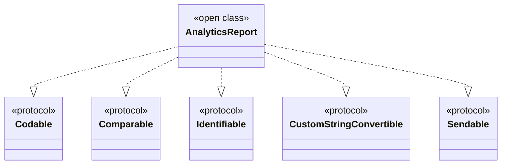

---

## **7. Relationships with Other Classes**

### **a. Related Classes Diagram**
- **Purpose**: Illustrate how `AnalyticsReport` interacts with other classes and frameworks.
- **Diagram Type**: `flowchart TD`
- **Contents**:
  - **Event**
  - **Metric**
  - **DataCollector**
  - **ReportRenderer**
  - **DataExporter**
  - **User**
  - **NotificationCenter**

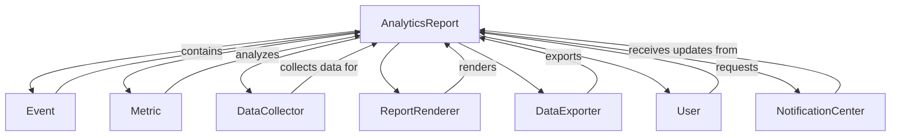

---

## **8. Extensions and Additional Functionalities**

### **a. AnalyticsReport Extensions Diagram**
- **Purpose**: Showcase the additional functionalities provided through extensions.
- **Diagram Type**: `classDiagram`
- **Contents**:
  - **TimestampExtensions**
  - **EventExtensions**
  - **MetricExtensions**

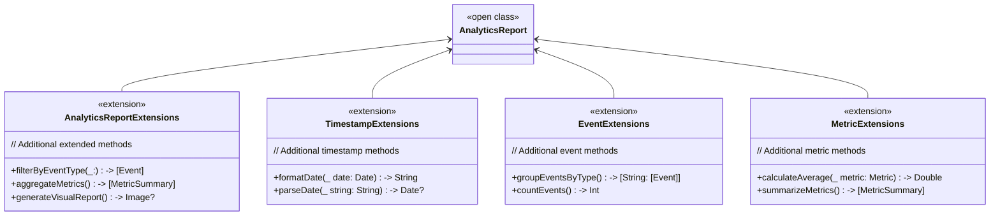

### **b. Extensions Functionalities Flowchart**
- **Purpose**: Detail specific extended methods and their purposes.
- **Diagram Type**: `flowchart LR`
- **Contents**:
  - **Event Filtering**
  - **Metric Aggregation**
  - **Report Visualization**

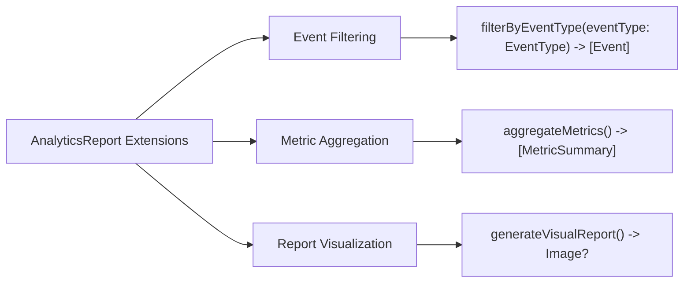

---

## **9. Lifecycle and Use Cases**

### **a. Lifecycle Flowchart**
- **Purpose**: Demonstrate the typical lifecycle of an `AnalyticsReport` within an application.
- **Diagram Type**: `flowchart TD`
- **Contents**:
  - **Initialization**
  - **Data Collection**
  - **Report Generation**
  - **Exporting**
  - **Distribution**
  - **Archiving**

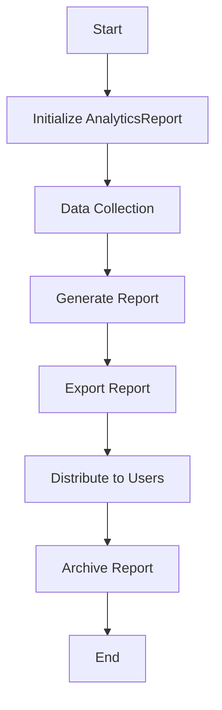

### **b. Common Use Cases Diagram**
- **Purpose**: Outline the typical scenarios where `AnalyticsReport` is utilized.
- **Diagram Type**: `flowchart TD`
- **Contents**:
  - **User Engagement Tracking**
  - **Sales and Revenue Analysis**
  - **Performance Monitoring**
  - **A/B Testing Results**
  - **Error and Crash Reporting**
  - **Custom Reporting for Stakeholders**

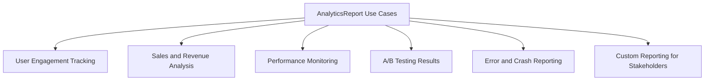

---

## **10. Feature Availability Timeline**

### **a. Feature Availability Gantt Chart**
- **Purpose**: Show when various `AnalyticsReport` features were introduced across iOS versions.
- **Diagram Type**: `gantt`
- **Contents**:
  - **iOS Versions**: 10.0, 12.0, 14.0, 16.0, 17.0
  - **Features Introduced**: Basic Reporting, Event Filtering, Custom Metrics, Data Export Formats, Real-Time Analysis, AI-driven Insights.

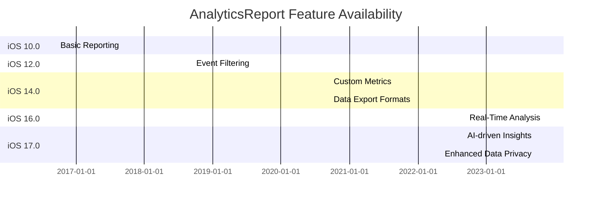

---

## **11. Data Handling and Formats**

### **a. Data Format Handling Diagram**
- **Purpose**: Explain how `AnalyticsReport` handles different data formats.
- **Diagram Type**: `graph LR`
- **Contents**:
  - **CSV**: `exportAsCSV()`
  - **JSON**: `exportAsJSON()`
  - **XML**: `exportAsXML()`
  - **PDF**: `exportAsPDF()`
  - **Image**: `generateVisualReport()`

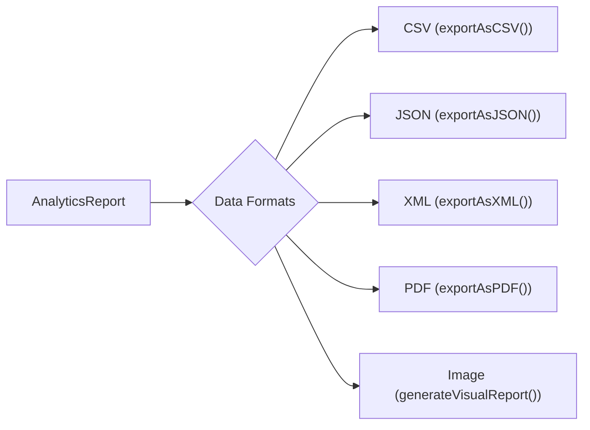

---

## **12. Integration with Other Frameworks**

### **a. Integration Methods Diagram**
- **Purpose**: Show how `AnalyticsReport` integrates with other Apple frameworks and services.
- **Diagram Type**: `flowchart TD`
- **Contents**:
  - **CoreData**: Data persistence for events and metrics.
  - **CloudKit**: Synching reports across devices.
  - **SwiftUI**: Displaying reports in the user interface.
  - **Combine**: Handling asynchronous data streams.
  - **NotificationCenter**: Broadcasting report status updates.
  - **SwiftUI**: Rendering visual reports.

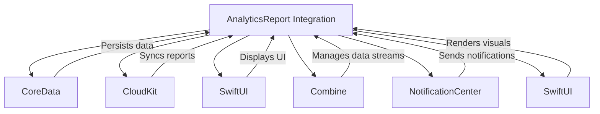

---

## **13. Summary and Best Practices**

### **a. Summary Diagram**
- **Purpose**: Provide a high-level overview of `AnalyticsReport`'s key characteristics and functionalities.
- **Diagram Type**: `graph LR`
- **Contents**:
  - **Comprehensive Data Collection**
  - **Flexible Reporting Options**
  - **Robust Export Capabilities**
  - **Seamless Integration**
  - **Real-Time and AI Insights**
  - **Enhanced Data Privacy**

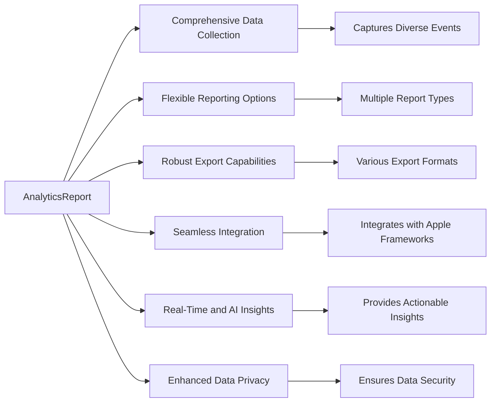

### **b. Best Practices Diagram**
- **Purpose**: Outline best practices for utilizing `AnalyticsReport` effectively.
- **Diagram Type**: `flowchart LR`
- **Contents**:
  - **Data Privacy Compliance**
  - **Efficient Data Collection**
  - **Optimized Report Generation**
  - **Regular Report Refresh**
  - **Comprehensive Metrics Tracking**
  - **Clear Reporting Standards**

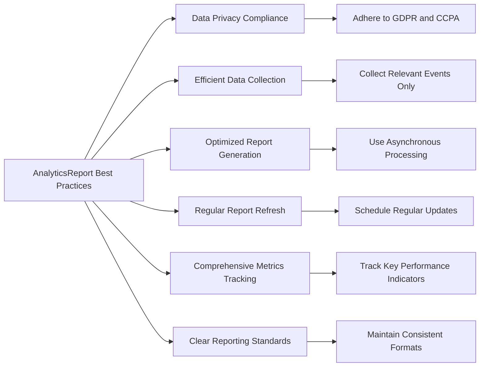

---

## **Additional Diagrams**

### **14. Security and Privacy Considerations**

#### **a. Security Measures Diagram**
- **Purpose**: Highlight the security measures implemented within `AnalyticsReport`.
- **Diagram Type**: `graph LR`
- **Contents**:
  - **Data Encryption**
  - **Access Controls**
  - **Anonymization Techniques**
  - **Secure Data Transmission**
  - **Compliance Audits**

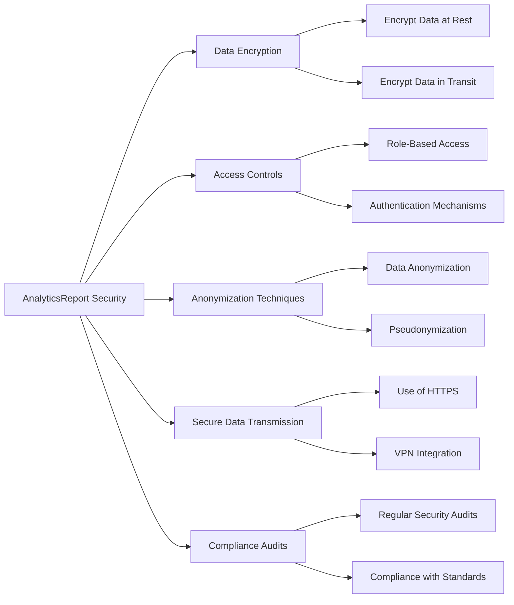

### **15. Performance Optimization Strategies**

#### **a. Optimization Techniques Diagram**
- **Purpose**: Showcase strategies to optimize the performance of `AnalyticsReport`.
- **Diagram Type**: `flowchart TD`
- **Contents**:
  - **Efficient Data Storage**
  - **Asynchronous Processing**
  - **Caching Mechanisms**
  - **Resource Management**
  - **Scalable Architecture**

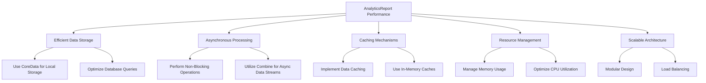

---

## **16. Error Handling and Recovery**

### **a. Error Handling Diagram**
- **Purpose**: Illustrate the error handling mechanisms within `AnalyticsReport`.
- **Diagram Type**: `flowchart LR`
- **Contents**:
  - **Error Detection**
  - **Logging Mechanisms**
  - **User Notifications**
  - **Retry Strategies**
  - **Fallback Procedures**

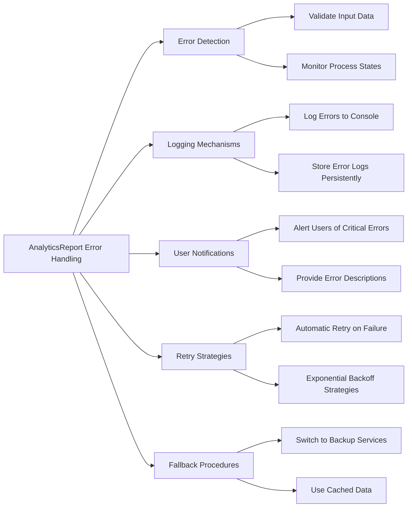

---

## **17. Testing and Quality Assurance**

### **a. Testing Strategies Diagram**
- **Purpose**: Outline the testing strategies to ensure the quality of `AnalyticsReport`.
- **Diagram Type**: `flowchart TD`
- **Contents**:
  - **Unit Testing**
  - **Integration Testing**
  - **Performance Testing**
  - **User Acceptance Testing**
  - **Automated Testing**
  - **Continuous Integration**

```mermaid
flowchart TD
    A[AnalyticsReport Testing Strategies] --> B[Unit Testing]
    A --> C[Integration Testing]
    A --> D[Performance Testing]
    A --> E[User Acceptance Testing]
    A --> F[Automated Testing]
    A --> G[Continuous Integration]

    B --> B1["Test Individual Methods"]
    B --> B2["Mock Dependencies"]
    
    C --> C1["Test Interactions with DataCollector"]
    C --> C2["Validate Data Flow between Components"]
    
    D --> D1["Measure Report Generation Time"]
    D --> D2["Stress Test with Large Data Sets"]
    
    E --> E1["Gather Feedback from End Users"]
    E --> E2["Validate Report Usability"]
    
    F --> F1["Implement Automated Test Cases"]
    F --> F2["Use XCTest Framework"]
    
    G --> G1["Integrate with CI/CD Pipelines"]
    G --> G2["Automate Testing on Code Changes"]
```

---

## **18. Documentation and User Guidance**

### **a. Documentation Structure Diagram**
- **Purpose**: Present the structure of documentation and user guidance for `AnalyticsReport`.
- **Diagram Type**: `graph LR`
- **Contents**:
  - **User Guides**
  - **API References**
  - **Tutorials**
  - **FAQs**
  - **Sample Projects**
  - **Support Resources**

```mermaid
graph LR
    A[AnalyticsReport Documentation] --> B[User Guides]
    A --> C[API References]
    A --> D[Tutorials]
    A --> E[FAQs]
    A --> F[Sample Projects]
    A --> G[Support Resources]

    B --> B1["Getting Started"]
    B --> B2["Advanced Features"]
    
    C --> C1["Class Reference"]
    C --> C2["Method Descriptions"]
    
    D --> D1["Step-by-Step Tutorials"]
    D --> D2["Use Case Demonstrations"]
    
    E --> E1["Common Issues"]
    E --> E2["Troubleshooting Tips"]
    
    F --> F1["Example Implementations"]
    F --> F2["Demo Projects"]
    
    G --> G1["Community Forums"]
    G --> G2["Contact Support"]
```

### **b. User Guidance Flowchart**
- **Purpose**: Detail the user guidance process for effectively utilizing `AnalyticsReport`.
- **Diagram Type**: `flowchart LR`
- **Contents**:
  - **Onboarding Process**
  - **Feature Tutorials**
  - **Best Practice Recommendations**
  - **Feedback Collection**
  - **Continuous Learning**

```mermaid
flowchart LR
    A[User Guidance for AnalyticsReport] --> B[Onboarding Process]
    A --> C[Feature Tutorials]
    A --> D[Best Practice Recommendations]
    A --> E[Feedback Collection]
    A --> F[Continuous Learning]

    B --> B1["Introduction to Features"]
    B --> B2["Initial Setup Instructions"]
    
    C --> C1["Interactive Tutorials"]
    C --> C2["Video Walkthroughs"]
    
    D --> D1["Performance Optimization Tips"]
    D --> D2["Data Privacy Guidelines"]
    
    E --> E1["User Surveys"]
    E --> E2["Feedback Forms"]
    
    F --> F1["Regular Updates"]
    F --> F2["Advanced Training Sessions"]
```

---

## **19. Scalability and Extensibility**

### **a. Scalability Diagram**
- **Purpose**: Highlight the scalability aspects of `AnalyticsReport`.
- **Diagram Type**: `flowchart TD`
- **Contents**:
  - **Modular Design**
  - **Distributed Data Processing**
  - **Cloud Integration**
  - **Microservices Architecture**
  - **Load Balancing**
  - **Horizontal Scaling**

```mermaid
flowchart TD
    A[AnalyticsReport Scalability] --> B[Modular Design]
    A --> C[Distributed Data Processing]
    A --> D[Cloud Integration]
    A --> E[Microservices Architecture]
    A --> F[Load Balancing]
    A --> G[Horizontal Scaling]

    B --> B1["Independent Modules"]
    B --> B2["Reusable Components"]
    
    C --> C1["Parallel Data Handling"]
    C --> C2["Efficient Resource Allocation"]
    
    D --> D1["Utilize Cloud Services"]
    D --> D2["Scalable Storage Solutions"]
    
    E --> E1["Service Separation"]
    E --> E2["Independent Deployment"]
    
    F --> F1["Distribute Traffic"]
    F --> F2["Ensure High Availability"]
    
    G --> G1["Add More Instances"]
    G --> G2["Handle Increased Load"]
```

### **b. Extensibility Diagram**
- **Purpose**: Showcase how `AnalyticsReport` can be extended to accommodate future requirements.
- **Diagram Type**: `flowchart TD`
- **Contents**:
  - **Plugin Architecture**
  - **Custom Metrics**
  - **Third-Party Integrations**
  - **API Extensions**
  - **Modular Components**
  - **Flexible Data Models**

```mermaid
flowchart TD
    A[AnalyticsReport Extensibility] --> B[Plugin Architecture]
    A --> C[Custom Metrics]
    A --> D[Third-Party Integrations]
    A --> E[API Extensions]
    A --> F[Modular Components]
    A --> G[Flexible Data Models]

    B --> B1["Load External Plugins"]
    B --> B2["Extend Core Functionality"]
    
    C --> C1["Define New Metrics"]
    C --> C2["Customize Reporting"]
    
    D --> D1["Integrate with CRM Systems"]
    D --> D2["Connect to Marketing Platforms"]
    
    E --> E1["Expose New Endpoints"]
    E --> E2["Facilitate External Access"]
    
    F --> F1["Replaceable Modules"]
    F --> F2["Independent Features"]
    
    G --> G1["Adaptable Schemas"]
    G --> G2["Dynamic Data Structures"]
```

---

## **20. Localization and Internationalization**

### **a. Localization Diagram**
- **Purpose**: Illustrate how `AnalyticsReport` handles localization and internationalization.
- **Diagram Type**: `flowchart LR`
- **Contents**:
  - **Language Support**
  - **Date and Time Formatting**
  - **Number and Currency Formatting**
  - **Localized Content**
  - **Right-to-Left (RTL) Support**
  - **User Locale Detection**

```mermaid
flowchart LR
    A[AnalyticsReport Localization] --> B[Language Support]
    A --> C[Date and Time Formatting]
    A --> D[Number and Currency Formatting]
    A --> E[Localized Content]
    A --> F[Right-to-Left Support]
    A --> G[User Locale Detection]

    B --> B1["Support Multiple Languages"]
    B --> B2["Dynamic Language Switching"]
    
    C --> C1["Format Dates Based on Locale"]
    C --> C2["Adjust Time Formats"]
    
    D --> D1["Localize Number Formats"]
    D --> D2["Handle Currency Symbols"]
    
    E --> E1["Translate Report Labels"]
    E --> E2["Adapt Content for Local Audiences"]
    
    F --> F1["Support RTL Languages"]
    F --> F2["Adjust Layouts Accordingly"]
    
    G --> G1["Detect User's Locale Settings"]
    G --> G2["Apply Appropriate Localizations"]
```

---

## **21. Accessibility Features**

### **a. Accessibility Diagram**
- **Purpose**: Highlight the accessibility features incorporated within `AnalyticsReport`.
- **Diagram Type**: `flowchart LR`
- **Contents**:
  - **VoiceOver Support**
  - **Dynamic Type**
  - **Color Contrast**
  - **Keyboard Navigation**
  - **Accessible Labels**
  - **Screen Reader Compatibility**

```mermaid
flowchart LR
    A[AnalyticsReport Accessibility] --> B[VoiceOver Support]
    A --> C[Dynamic Type]
    A --> D[Color Contrast]
    A --> E[Keyboard Navigation]
    A --> F[Accessible Labels]
    A --> G[Screen Reader Compatibility]

    B --> B1["Provide Descriptive Elements"]
    B --> B2["Ensure Navigability"]
    
    C --> C1["Support Font Size Adjustments"]
    C --> C2["Ensure Readability"]
    
    D --> D1["Use High Contrast Colors"]
    D --> D2["Maintain Visual Clarity"]
    
    E --> E1["Enable Keyboard Shortcuts"]
    E --> E2["Provide Focus Indicators"]
    
    F --> F1["Label UI Elements Appropriately"]
    F --> F2["Ensure Clear Descriptions"]
    
    G --> G1["Ensure Compatibility with Screen Readers"]
    G --> G2["Implement Accessible Controls"]
```

---

## **22. User Privacy and Consent Management**

### **a. Consent Flow Diagram**
- **Purpose**: Demonstrate how `AnalyticsReport` manages user privacy and consent.
- **Diagram Type**: `flowchart TD`
- **Contents**:
  - **Consent Collection**
  - **Data Minimization**
  - **User Preferences**
  - **Opt-Out Mechanisms**
  - **Data Retention Policies**
  - **Privacy Audits**

```mermaid
flowchart TD
    A[AnalyticsReport Privacy Management] --> B[Consent Collection]
    A --> C[Data Minimization]
    A --> D[User Preferences]
    A --> E[Opt-Out Mechanisms]
    A --> F[Data Retention Policies]
    A --> G[Privacy Audits]

    B --> B1["Obtain Explicit Consent"]
    B --> B2["Provide Clear Information"]
    
    C --> C1["Collect Only Necessary Data"]
    C --> C2["Avoid Excessive Data Collection"]
    
    D --> D1["Allow Users to Set Preferences"]
    D --> D2["Personalize Data Collection"]
    
    E --> E1["Enable Easy Opt-Out"]
    E --> E2["Respect User Choices"]
    
    F --> F1["Define Data Retention Periods"]
    F --> F2["Implement Data Deletion Policies"]
    
    G --> G1["Conduct Regular Privacy Audits"]
    G --> G2["Ensure Compliance with Regulations"]
```

---

## **23. Real-Time Data Processing**

### **a. Real-Time Processing Diagram**
- **Purpose**: Illustrate the mechanisms for real-time data processing within `AnalyticsReport`.
- **Diagram Type**: `flowchart LR`
- **Contents**:
  - **Data Streaming**
  - **Event Handling**
  - **Immediate Reporting**
  - **Live Dashboards**
  - **Alerts and Notifications**
  - **Real-Time Analytics**

```mermaid
flowchart LR
    A[AnalyticsReport Real-Time Processing] --> B[Data Streaming]
    A --> C[Event Handling]
    A --> D[Immediate Reporting]
    A --> E[Live Dashboards]
    A --> F[Alerts and Notifications]
    A --> G[Real-Time Analytics]

    B --> B1["Ingest Data Streams"]
    B --> B2["Process Data On-the-Fly"]
    
    C --> C1["Handle Incoming Events Instantly"]
    C --> C2["Trigger Real-Time Updates"]
    
    D --> D1["Generate Instant Reports"]
    D --> D2["Update Reports Continuously"]
    
    E --> E1["Display Real-Time Data"]
    E --> E2["Interactive Visualization"]
    
    F --> F1["Send Alerts for Specific Metrics"]
    F --> F2["Notify Users of Critical Changes"]
    
    G --> G1["Analyze Data in Real-Time"]
    G --> G2["Provide Immediate Insights"]
```

---

## **24. API Integration and Webhooks**

### **a. API Integration Diagram**
- **Purpose**: Showcase how `AnalyticsReport` integrates with external APIs and utilizes webhooks.
- **Diagram Type**: `flowchart TD`
- **Contents**:
  - **External API Calls**
  - **Webhooks for Event Notifications**
  - **Authentication Mechanisms**
  - **Data Synchronization**
  - **API Rate Limiting**
  - **Error Handling for API Integrations**

```mermaid
flowchart TD
    A[AnalyticsReport API Integration] --> B[External API Calls]
    A --> C[Webhooks for Event Notifications]
    A --> D[Authentication Mechanisms]
    A --> E[Data Synchronization]
    A --> F[API Rate Limiting]
    A --> G[Error Handling for API Integrations]

    B --> B1["Fetch External Data"]
    B --> B2["Send Data to Third-Party Services"]
    
    C --> C1["Receive Event Triggers"]
    C --> C2["Update Reports Based on Webhooks"]
    
    D --> D1["OAuth 2.0 Authentication"]
    D --> D2["API Key Management"]
    
    E --> E1["Sync Data Regularly"]
    E --> E2["Ensure Data Consistency"]
    
    F --> F1["Monitor API Usage"]
    F --> F2["Implement Backoff Strategies"]
    
    G --> G1["Retry Failed Requests"]
    G --> G2["Log API Errors"]
```

---

## **25. Custom Reporting and Dashboards**

### **a. Custom Reporting Diagram**
- **Purpose**: Illustrate how users can create custom reports and dashboards within `AnalyticsReport`.
- **Diagram Type**: `flowchart LR`
- **Contents**:
  - **Report Builder**
  - **Dashboard Widgets**
  - **Custom Metrics Selection**
  - **Visualization Tools**
  - **Sharing and Collaboration**
  - **Template Management**

```mermaid
flowchart LR
    A[AnalyticsReport Custom Reporting] --> B[Report Builder]
    A --> C[Dashboard Widgets]
    A --> D[Custom Metrics Selection]
    A --> E[Visualization Tools]
    A --> F[Sharing and Collaboration]
    A --> G[Template Management]

    B --> B1["Drag-and-Drop Interface"]
    B --> B2["Define Report Parameters"]
    
    C --> C1["Add Charts and Graphs"]
    C --> C2["Customize Widget Layout"]
    
    D --> D1["Select Relevant Metrics"]
    D --> D2["Filter and Sort Data"]
    
    E --> E1["Choose Visualization Types"]
    E --> E2["Customize Visual Elements"]
    
    F --> F1["Share Reports with Team"]
    F --> F2["Collaborate on Dashboards"]
    
    G --> G1["Use Predefined Templates"]
    G --> G2["Create and Save Custom Templates"]
```

---

## **26. Machine Learning and Predictive Analytics**

### **a. ML Integration Diagram**
- **Purpose**: Showcase the integration of machine learning for predictive analytics within `AnalyticsReport`.
- **Diagram Type**: `flowchart TD`
- **Contents**:
  - **Data Preparation**
  - **Model Training**
  - **Prediction Generation**
  - **Insight Extraction**
  - **Model Deployment**
  - **Continuous Learning**

```mermaid
flowchart TD
    A[AnalyticsReport ML Integration] --> B[Data Preparation]
    A --> C[Model Training]
    A --> D[Prediction Generation]
    A --> E[Insight Extraction]
    A --> F[Model Deployment]
    A --> G[Continuous Learning]

    B --> B1["Clean and Normalize Data"]
    B --> B2["Feature Engineering"]
    
    C --> C1["Select ML Algorithms"]
    C --> C2["Train Models on Historical Data"]
    
    D --> D1["Generate Predictions"]
    D --> D2["Apply Models to New Data"]
    
    E --> E1["Extract Actionable Insights"]
    E --> E2["Visualize Predictive Trends"]
    
    F --> F1["Deploy Models to Production"]
    F --> F2["Integrate with Reporting Tools"]
    
    G --> G1["Monitor Model Performance"]
    G --> G2["Retrain Models with New Data"]
```

---

## **27. Compliance and Regulatory Features**

### **a. Compliance Diagram**
- **Purpose**: Illustrate how `AnalyticsReport` ensures compliance with various regulations.
- **Diagram Type**: `flowchart LR`
- **Contents**:
  - **GDPR Compliance**
  - **CCPA Compliance**
  - **HIPAA Compliance**
  - **Data Anonymization**
  - **User Consent Management**
  - **Audit Trails**

```mermaid
flowchart LR
    A[AnalyticsReport Compliance Features] --> B[GDPR Compliance]
    A --> C[CCPA Compliance]
    A --> D[HIPAA Compliance]
    A --> E[Data Anonymization]
    A --> F[User Consent Management]
    A --> G[Audit Trails]

    B --> B1["Data Protection Policies"]
    B --> B2["Right to Access and Delete Data"]
    
    C --> C1["User Data Request Handling"]
    C --> C2["Opt-Out Features"]
    
    D --> D1["Protect Health Information"]
    D --> D2["Ensure Data Integrity"]
    
    E --> E1["Anonymize Sensitive Data"]
    E --> E2["Implement Pseudonymization Techniques"]
    
    F --> F1["Manage User Consents"]
    F --> F2["Provide Consent Revocation Options"]
    
    G --> G1["Maintain Detailed Logs"]
    G --> G2["Enable Audit Access"]
```

---

## **28. User Experience and Interface Design**

### **a. UI Design Diagram**
- **Purpose**: Highlight the user interface design principles for `AnalyticsReport`.
- **Diagram Type**: `graph LR`
- **Contents**:
  - **Intuitive Navigation**
  - **Responsive Design**
  - **Interactive Visualizations**
  - **Customization Options**
  - **Accessibility Features**
  - **Consistent Theming**

```mermaid
graph LR
    A[AnalyticsReport UI Design] --> B[Intuitive Navigation]
    A --> C[Responsive Design]
    A --> D[Interactive Visualizations]
    A --> E[Customization Options]
    A --> F[Accessibility Features]
    A --> G[Consistent Theming]

    B --> B1["Clear Menu Structures"]
    B --> B2["Easy Access to Features"]
    
    C --> C1["Adaptive Layouts"]
    C --> C2["Cross-Device Compatibility"]
    
    D --> D1["Interactive Charts"]
    D --> D2["Dynamic Data Displays"]
    
    E --> E1["Customizable Dashboards"]
    E --> E2["Adjustable Report Settings"]
    
    F --> F1["Support for VoiceOver"]
    F --> F2["High Contrast Modes"]
    
    G --> G1["Consistent Color Schemes"]
    G --> G2["Unified Typography"]
```

---

## **29. Localization and Internationalization**

### **a. Localization Diagram**
- **Purpose**: Illustrate how `AnalyticsReport` handles localization and internationalization.
- **Diagram Type**: `flowchart LR`
- **Contents**:
  - **Language Support**
  - **Date and Time Formatting**
  - **Number and Currency Formatting**
  - **Localized Content**
  - **Right-to-Left (RTL) Support**
  - **User Locale Detection**

```mermaid
flowchart LR
    A[AnalyticsReport Localization] --> B[Language Support]
    A --> C[Date and Time Formatting]
    A --> D[Number and Currency Formatting]
    A --> E[Localized Content]
    A --> F[Right-to-Left Support]
    A --> G[User Locale Detection]

    B --> B1["Support Multiple Languages"]
    B --> B2["Dynamic Language Switching"]
    
    C --> C1["Format Dates Based on Locale"]
    C --> C2["Adjust Time Formats"]
    
    D --> D1["Localize Number Formats"]
    D --> D2["Handle Currency Symbols"]
    
    E --> E1["Translate Report Labels"]
    E --> E2["Adapt Content for Local Audiences"]
    
    F --> F1["Support RTL Languages"]
    F --> F2["Adjust Layouts Accordingly"]
    
    G --> G1["Detect User's Locale Settings"]
    G --> G2["Apply Appropriate Localizations"]
```

---

## **30. Deployment and Distribution**

### **a. Deployment Diagram**
- **Purpose**: Showcase the deployment and distribution process of `AnalyticsReport`.
- **Diagram Type**: `flowchart TD`
- **Contents**:
  - **App Store Distribution**
  - **Enterprise Deployment**
  - **Beta Testing with TestFlight**
  - **Continuous Deployment Pipelines**
  - **Version Control Integration**
  - **Monitoring and Maintenance**

```mermaid
flowchart TD
    A[AnalyticsReport Deployment] --> B[App Store Distribution]
    A --> C[Enterprise Deployment]
    A --> D[Beta Testing with TestFlight]
    A --> E[Continuous Deployment Pipelines]
    A --> F[Version Control Integration]
    A --> G[Monitoring and Maintenance]

    B --> B1["Submit to App Store"]
    B --> B2["Ensure Compliance with Guidelines"]
    
    C --> C1["Distribute within Organization"]
    C --> C2["Use MDM Solutions"]
    
    D --> D1["Invite Testers via TestFlight"]
    D --> D2["Gather Beta Feedback"]
    
    E --> E1["Automate Build and Release"]
    E --> E2["Integrate with CI/CD Tools"]
    
    F --> F1["Use Git for Version Control"]
    F --> F2["Manage Branching Strategies"]
    
    G --> G1["Monitor App Performance"]
    G --> G2["Perform Regular Updates"]
```

---

## **31. Security and Privacy Considerations**

### **a. Security Measures Diagram**
- **Purpose**: Highlight the security measures implemented within `AnalyticsReport`.
- **Diagram Type**: `graph LR`
- **Contents**:
  - **Data Encryption**
  - **Access Controls**
  - **Anonymization Techniques**
  - **Secure Data Transmission**
  - **Compliance Audits**

```mermaid
graph LR
    A[AnalyticsReport Security] --> B[Data Encryption]
    A --> C[Access Controls]
    A --> D[Anonymization Techniques]
    A --> E[Secure Data Transmission]
    A --> F[Compliance Audits]

    B --> B1["Encrypt Data at Rest"]
    B --> B2["Encrypt Data in Transit"]
    
    C --> C1["Role-Based Access"]
    C --> C2["Authentication Mechanisms"]
    
    D --> D1["Data Anonymization"]
    D --> D2["Pseudonymization"]
    
    E --> E1["Use of HTTPS"]
    E --> E2["VPN Integration"]
    
    F --> F1["Regular Security Audits"]
    F --> F2["Compliance with Standards"]
```

---

## **32. Error Handling and Recovery**

### **a. Error Handling Diagram**
- **Purpose**: Illustrate the error handling mechanisms within `AnalyticsReport`.
- **Diagram Type**: `flowchart LR`
- **Contents**:
  - **Error Detection**
  - **Logging Mechanisms**
  - **User Notifications**
  - **Retry Strategies**
  - **Fallback Procedures**

```mermaid
flowchart LR
    A[AnalyticsReport Error Handling] --> B[Error Detection]
    A --> C[Logging Mechanisms]
    A --> D[User Notifications]
    A --> E[Retry Strategies]
    A --> F[Fallback Procedures]

    B --> B1["Validate Input Data"]
    B --> B2["Monitor Process States"]
    
    C --> C1["Log Errors to Console"]
    C --> C2["Store Error Logs Persistently"]
    
    D --> D1["Alert Users of Critical Errors"]
    D --> D2["Provide Error Descriptions"]
    
    E --> E1["Automatic Retry on Failure"]
    E --> E2["Exponential Backoff Strategies"]
    
    F --> F1["Switch to Backup Services"]
    F --> F2["Use Cached Data"]
```

---

## **33. Testing and Quality Assurance**

### **a. Testing Strategies Diagram**
- **Purpose**: Outline the testing strategies to ensure the quality of `AnalyticsReport`.
- **Diagram Type**: `flowchart TD`
- **Contents**:
  - **Unit Testing**
  - **Integration Testing**
  - **Performance Testing**
  - **User Acceptance Testing**
  - **Automated Testing**
  - **Continuous Integration**

```mermaid
flowchart TD
    A[AnalyticsReport Testing Strategies] --> B[Unit Testing]
    A --> C[Integration Testing]
    A --> D[Performance Testing]
    A --> E[User Acceptance Testing]
    A --> F[Automated Testing]
    A --> G[Continuous Integration]

    B --> B1["Test Individual Methods"]
    B --> B2["Mock Dependencies"]
    
    C --> C1["Test Interactions with DataCollector"]
    C --> C2["Validate Data Flow between Components"]
    
    D --> D1["Measure Report Generation Time"]
    D --> D2["Stress Test with Large Data Sets"]
    
    E --> E1["Gather Feedback from End Users"]
    E --> E2["Validate Report Usability"]
    
    F --> F1["Implement Automated Test Cases"]
    F --> F2["Use XCTest Framework"]
    
    G --> G1["Integrate with CI/CD Pipelines"]
    G --> G2["Automate Testing on Code Changes"]
```

---

## **34. Documentation and User Guidance**

### **a. Documentation Structure Diagram**
- **Purpose**: Present the structure of documentation and user guidance for `AnalyticsReport`.
- **Diagram Type**: `graph LR`
- **Contents**:
  - **User Guides**
  - **API References**
  - **Tutorials**
  - **FAQs**
  - **Sample Projects**
  - **Support Resources**

```mermaid
graph LR
    A[AnalyticsReport Documentation] --> B[User Guides]
    A --> C[API References]
    A --> D[Tutorials]
    A --> E[FAQs]
    A --> F[Sample Projects]
    A --> G[Support Resources]

    B --> B1["Getting Started"]
    B --> B2["Advanced Features"]
    
    C --> C1["Class Reference"]
    C --> C2["Method Descriptions"]
    
    D --> D1["Step-by-Step Tutorials"]
    D --> D2["Use Case Demonstrations"]
    
    E --> E1["Common Issues"]
    E --> E2["Troubleshooting Tips"]
    
    F --> F1["Example Implementations"]
    F --> F2["Demo Projects"]
    
    G --> G1["Community Forums"]
    G --> G2["Contact Support"]
```

### **b. User Guidance Flowchart**
- **Purpose**: Detail the user guidance process for effectively utilizing `AnalyticsReport`.
- **Diagram Type**: `flowchart LR`
- **Contents**:
  - **Onboarding Process**
  - **Feature Tutorials**
  - **Best Practice Recommendations**
  - **Feedback Collection**
  - **Continuous Learning**

```mermaid
flowchart LR
    A[User Guidance for AnalyticsReport] --> B[Onboarding Process]
    A --> C[Feature Tutorials]
    A --> D[Best Practice Recommendations]
    A --> E[Feedback Collection]
    A --> F[Continuous Learning]

    B --> B1["Introduction to Features"]
    B --> B2["Initial Setup Instructions"]
    
    C --> C1["Interactive Tutorials"]
    C --> C2["Video Walkthroughs"]
    
    D --> D1["Performance Optimization Tips"]
    D --> D2["Data Privacy Guidelines"]
    
    E --> E1["User Surveys"]
    E --> E2["Feedback Forms"]
    
    F --> F1["Regular Updates"]
    F --> F2["Advanced Training Sessions"]
```

---

## **35. Scalability and Extensibility**

### **a. Scalability Diagram**
- **Purpose**: Highlight the scalability aspects of `AnalyticsReport`.
- **Diagram Type**: `flowchart TD`
- **Contents**:
  - **Modular Design**
  - **Distributed Data Processing**
  - **Cloud Integration**
  - **Microservices Architecture**
  - **Load Balancing**
  - **Horizontal Scaling**

```mermaid
flowchart TD
    A[AnalyticsReport Scalability] --> B[Modular Design]
    A --> C[Distributed Data Processing]
    A --> D[Cloud Integration]
    A --> E[Microservices Architecture]
    A --> F[Load Balancing]
    A --> G[Horizontal Scaling]

    B --> B1["Independent Modules"]
    B --> B2["Reusable Components"]
    
    C --> C1["Parallel Data Handling"]
    C --> C2["Efficient Resource Allocation"]
    
    D --> D1["Utilize Cloud Services"]
    D --> D2["Scalable Storage Solutions"]
    
    E --> E1["Service Separation"]
    E --> E2["Independent Deployment"]
    
    F --> F1["Distribute Traffic"]
    F --> F2["Ensure High Availability"]
    
    G --> G1["Add More Instances"]
    G --> G2["Handle Increased Load"]
```

### **b. Extensibility Diagram**
- **Purpose**: Showcase how `AnalyticsReport` can be extended to accommodate future requirements.
- **Diagram Type**: `flowchart TD`
- **Contents**:
  - **Plugin Architecture**
  - **Custom Metrics**
  - **Third-Party Integrations**
  - **API Extensions**
  - **Modular Components**
  - **Flexible Data Models**

```mermaid
flowchart TD
    A[AnalyticsReport Extensibility] --> B[Plugin Architecture]
    A --> C[Custom Metrics]
    A --> D[Third-Party Integrations]
    A --> E[API Extensions]
    A --> F[Modular Components]
    A --> G[Flexible Data Models]

    B --> B1["Load External Plugins"]
    B --> B2["Extend Core Functionality"]
    
    C --> C1["Define New Metrics"]
    C --> C2["Customize Reporting"]
    
    D --> D1["Integrate with CRM Systems"]
    D --> D2["Connect to Marketing Platforms"]
    
    E --> E1["Expose New Endpoints"]
    E --> E2["Facilitate External Access"]
    
    F --> F1["Replaceable Modules"]
    F --> F2["Independent Features"]
    
    G --> G1["Adaptable Schemas"]
    G --> G2["Dynamic Data Structures"]
```

---

## **36. User Privacy and Consent Management**

### **a. Consent Flow Diagram**
- **Purpose**: Demonstrate how `AnalyticsReport` manages user privacy and consent.
- **Diagram Type**: `flowchart TD`
- **Contents**:
  - **Consent Collection**
  - **Data Minimization**
  - **User Preferences**
  - **Opt-Out Mechanisms**
  - **Data Retention Policies**
  - **Privacy Audits**

```mermaid
flowchart TD
    A[AnalyticsReport Privacy Management] --> B[Consent Collection]
    A --> C[Data Minimization]
    A --> D[User Preferences]
    A --> E[Opt-Out Mechanisms]
    A --> F[Data Retention Policies]
    A --> G[Privacy Audits]

    B --> B1["Obtain Explicit Consent"]
    B --> B2["Provide Clear Information"]
    
    C --> C1["Collect Only Necessary Data"]
    C --> C2["Avoid Excessive Data Collection"]
    
    D --> D1["Allow Users to Set Preferences"]
    D --> D2["Personalize Data Collection"]
    
    E --> E1["Enable Easy Opt-Out"]
    E --> E2["Respect User Choices"]
    
    F --> F1["Define Data Retention Periods"]
    F --> F2["Implement Data Deletion Policies"]
    
    G --> G1["Conduct Regular Privacy Audits"]
    G --> G2["Ensure Compliance with Regulations"]
```

---

## **37. Real-Time Data Processing**

### **a. Real-Time Processing Diagram**
- **Purpose**: Illustrate the mechanisms for real-time data processing within `AnalyticsReport`.
- **Diagram Type**: `flowchart TD`
- **Contents**:
  - **Data Streaming**
  - **Event Handling**
  - **Immediate Reporting**
  - **Live Dashboards**
  - **Alerts and Notifications**
  - **Real-Time Analytics**

```mermaid
flowchart TD
    A[AnalyticsReport Real-Time Processing] --> B[Data Streaming]
    A --> C[Event Handling]
    A --> D[Immediate Reporting]
    A --> E[Live Dashboards]
    A --> F[Alerts and Notifications]
    A --> G[Real-Time Analytics]

    B --> B1["Ingest Data Streams"]
    B --> B2["Process Data On-the-Fly"]
    
    C --> C1["Handle Incoming Events Instantly"]
    C --> C2["Trigger Real-Time Updates"]
    
    D --> D1["Generate Instant Reports"]
    D --> D2["Update Reports Continuously"]
    
    E --> E1["Display Real-Time Data"]
    E --> E2["Interactive Visualization"]
    
    F --> F1["Send Alerts for Specific Metrics"]
    F --> F2["Notify Users of Critical Changes"]
    
    G --> G1["Analyze Data in Real-Time"]
    G --> G2["Provide Immediate Insights"]
```

---

## **38. API Integration and Webhooks**

### **a. API Integration Diagram**
- **Purpose**: Showcase how `AnalyticsReport` integrates with external APIs and utilizes webhooks.
- **Diagram Type**: `flowchart TD`
- **Contents**:
  - **External API Calls**
  - **Webhooks for Event Notifications**
  - **Authentication Mechanisms**
  - **Data Synchronization**
  - **API Rate Limiting**
  - **Error Handling for API Integrations**

```mermaid
flowchart TD
    A[AnalyticsReport API Integration] --> B[External API Calls]
    A --> C[Webhooks for Event Notifications]
    A --> D[Authentication Mechanisms]
    A --> E[Data Synchronization]
    A --> F[API Rate Limiting]
    A --> G[Error Handling for API Integrations]

    B --> B1["Fetch External Data"]
    B --> B2["Send Data to Third-Party Services"]
    
    C --> C1["Receive Event Triggers"]
    C --> C2["Update Reports Based on Webhooks"]
    
    D --> D1["OAuth 2.0 Authentication"]
    D --> D2["API Key Management"]
    
    E --> E1["Sync Data Regularly"]
    E --> E2["Ensure Data Consistency"]
    
    F --> F1["Monitor API Usage"]
    F --> F2["Implement Backoff Strategies"]
    
    G --> G1["Retry Failed Requests"]
    G --> G2["Log API Errors"]
```

---

## **39. Custom Reporting and Dashboards**

### **a. Custom Reporting Diagram**
- **Purpose**: Illustrate how users can create custom reports and dashboards within `AnalyticsReport`.
- **Diagram Type**: `flowchart LR`
- **Contents**:
  - **Report Builder**
  - **Dashboard Widgets**
  - **Custom Metrics Selection**
  - **Visualization Tools**
  - **Sharing and Collaboration**
  - **Template Management**

```mermaid
flowchart LR
    A[AnalyticsReport Custom Reporting] --> B[Report Builder]
    A --> C[Dashboard Widgets]
    A --> D[Custom Metrics Selection]
    A --> E[Visualization Tools]
    A --> F[Sharing and Collaboration]
    A --> G[Template Management]

    B --> B1["Drag-and-Drop Interface"]
    B --> B2["Define Report Parameters"]
    
    C --> C1["Add Charts and Graphs"]
    C --> C2["Customize Widget Layout"]
    
    D --> D1["Select Relevant Metrics"]
    D --> D2["Filter and Sort Data"]
    
    E --> E1["Choose Visualization Types"]
    E --> E2["Customize Visual Elements"]
    
    F --> F1["Share Reports with Team"]
    F --> F2["Collaborate on Dashboards"]
    
    G --> G1["Use Predefined Templates"]
    G --> G2["Create and Save Custom Templates"]
```

---

## **40. Machine Learning and Predictive Analytics**

### **a. ML Integration Diagram**
- **Purpose**: Showcase the integration of machine learning for predictive analytics within `AnalyticsReport`.
- **Diagram Type**: `flowchart TD`
- **Contents**:
  - **Data Preparation**
  - **Model Training**
  - **Prediction Generation**
  - **Insight Extraction**
  - **Model Deployment**
  - **Continuous Learning**

```mermaid
flowchart TD
    A[AnalyticsReport ML Integration] --> B[Data Preparation]
    A --> C[Model Training]
    A --> D[Prediction Generation]
    A --> E[Insight Extraction]
    A --> F[Model Deployment]
    A --> G[Continuous Learning]

    B --> B1["Clean and Normalize Data"]
    B --> B2["Feature Engineering"]
    
    C --> C1["Select ML Algorithms"]
    C --> C2["Train Models on Historical Data"]
    
    D --> D1["Generate Predictions"]
    D --> D2["Apply Models to New Data"]
    
    E --> E1["Extract Actionable Insights"]
    E --> E2["Visualize Predictive Trends"]
    
    F --> F1["Deploy Models to Production"]
    F --> F2["Integrate with Reporting Tools"]
    
    G --> G1["Monitor Model Performance"]
    G --> G2["Retrain Models with New Data"]
```

---
