---

# App Clips

## **1. Class Structure and Hierarchy**

### **a. Core Class Diagram**
- **Purpose**: Illustrate the primary structure of `AppClips`, including its key classes, properties, methods, and enumerations.
- **Diagram Type**: `classDiagram`
- **Contents**:
  - **Classes**: `AppClip`, `AppClipConfiguration`, `AppClipViewController`
  - **Properties**: Key attributes like `identifier`, `url`, `metadata`
  - **Methods**: Essential functions like `load()`, `present()`, `dismiss()`
  - **Enumerations**: Nested enums such as `ActivationMethod`, `AppClipStatus`

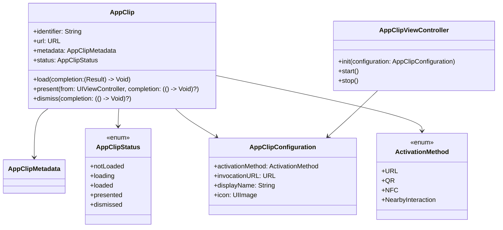

---

## **2. Initializers Overview**

### **a. Initialization Methods Diagram**
- **Purpose**: Break down the various ways to instantiate and configure `AppClip` and related classes.
- **Diagram Type**: `flowchart LR`
- **Contents**:
  - **AppClip Initialization**: `init(configuration:)`
  - **AppClipConfiguration Setup**: Setting activation method, invocation URL, display name, and icon
  - **AppClipViewController Initialization**: `init(configuration:)`

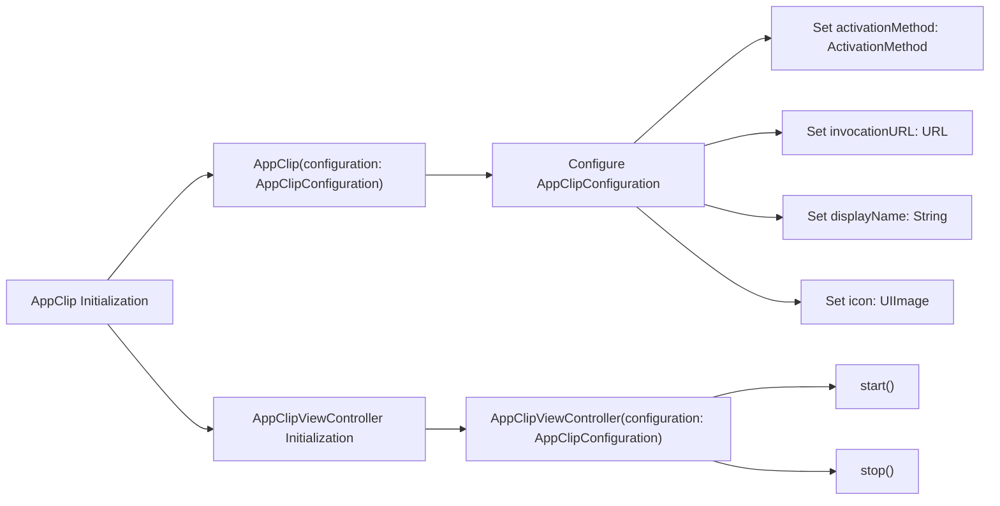

---

## **3. Properties Breakdown**

### **a. Key Properties Diagram**
- **Purpose**: Detail the main properties of `AppClip` and its related classes.
- **Diagram Type**: `graph LR`
- **Contents**:
  - **AppClip Properties**: `identifier`, `url`, `metadata`, `status`
  - **AppClipConfiguration Properties**: `activationMethod`, `invocationURL`, `displayName`, `icon`
  - **AppClipMetadata Properties**: `title`, `description`, `image`

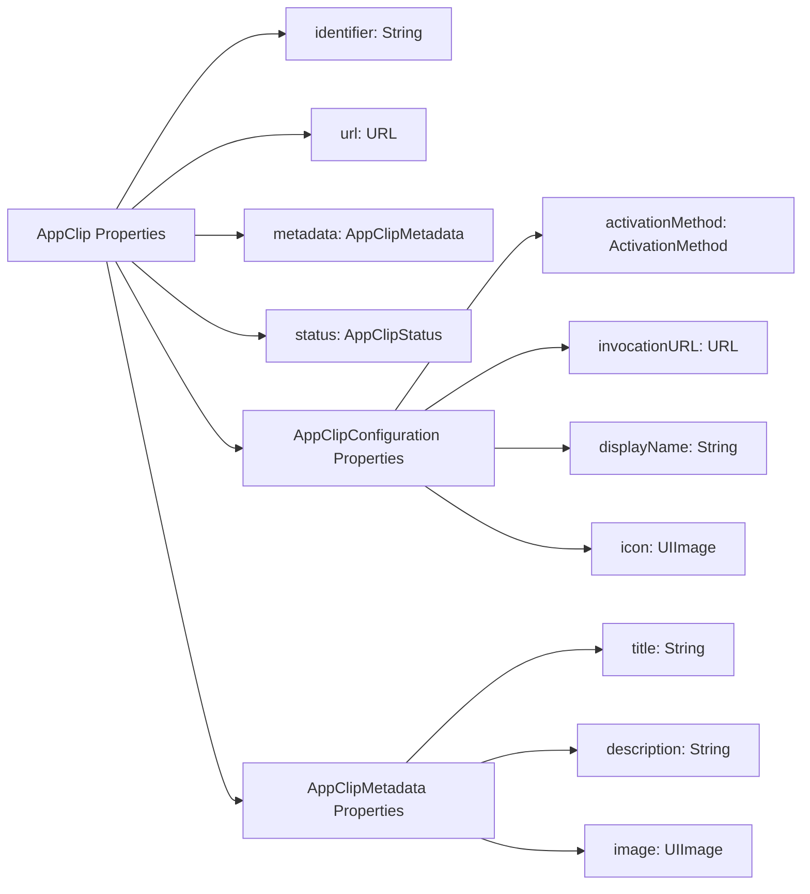

---

## **4. Methods Grouped by Functionality**

### **a. AppClip Management Methods**
- **Purpose**: Categorize methods based on their roles in managing App Clips.
- **Diagram Type**: `flowchart TD`
- **Contents**:
  - **Loading App Clips**: `load(completion:)`
  - **Presenting App Clips**: `present(from:completion:)`
  - **Dismissing App Clips**: `dismiss(completion:)`
  - **AppClipViewController Methods**: `start()`, `stop()`

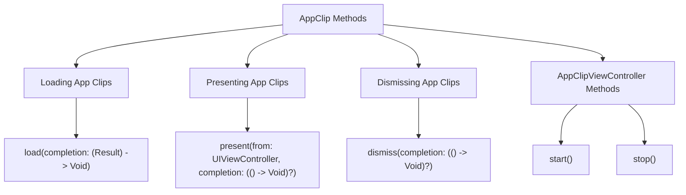

---

## **5. Enumerations and Configurations**

### **a. Enumerations Diagram**
- **Purpose**: Highlight the enums used within `App Clips` and their possible values.
- **Diagram Type**: `classDiagram`
- **Contents**:
  - **ActivationMethod**
  - **AppClipStatus**

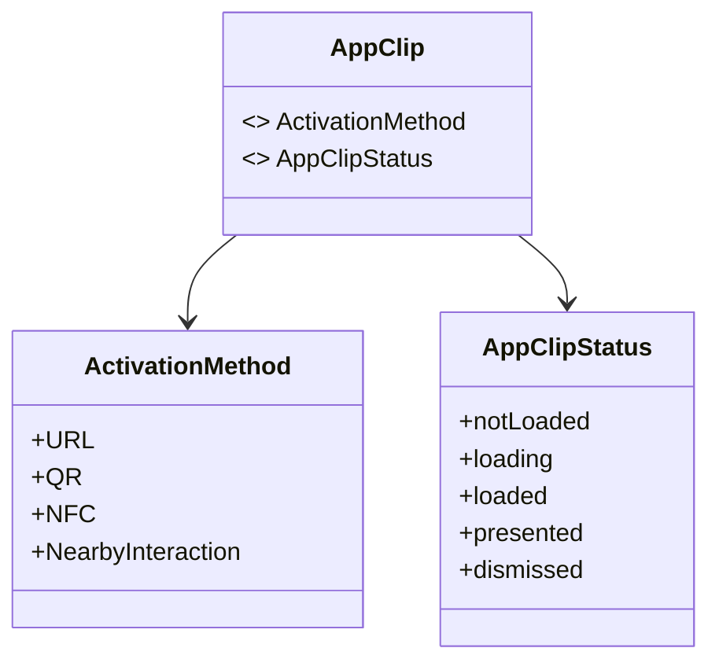

### **b. Configuration Classes Diagram**
- **Purpose**: Show the relationship between `AppClip` and its configuration classes.
- **Diagram Type**: `classDiagram`
- **Contents**:
  - **AppClipConfiguration**
  - **AppClipMetadata**

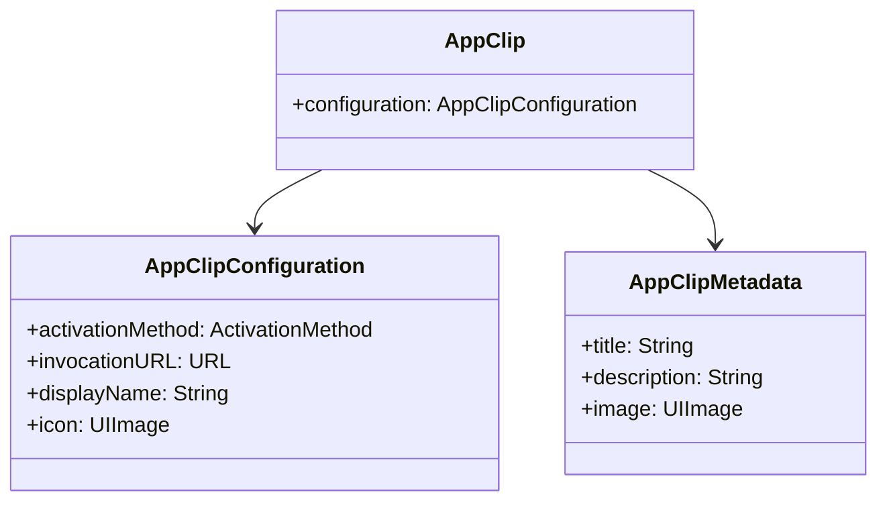

---

## **6. Protocol Conformances**

### **a. Protocols Diagram**
- **Purpose**: Display the protocols that `AppClip` and its related classes conform to and their impact.
- **Diagram Type**: `classDiagram`
- **Contents**:
  - **NSSecureCoding**
  - **UIHosting**
  - **UIResponder**
  - **Sendable**

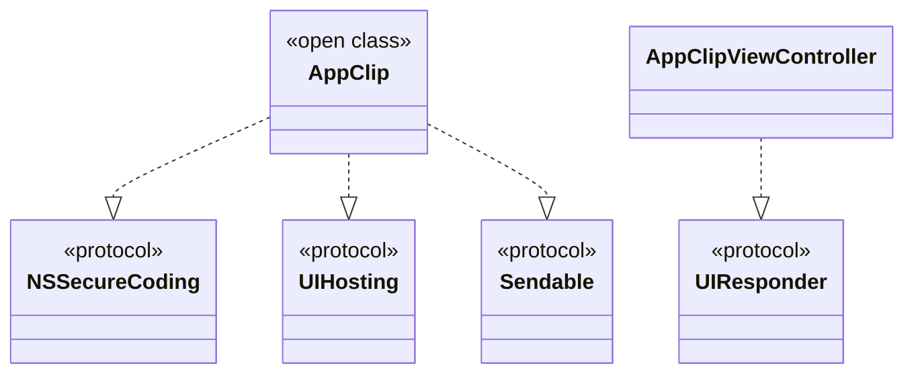

---

## **7. Relationships with Other Classes**

### **a. Related Classes Diagram**
- **Purpose**: Illustrate how `AppClip` interacts with other UIKit classes and frameworks.
- **Diagram Type**: `flowchart TD`
- **Contents**:
  - **UIViewController**: Hosts `AppClipViewController`
  - **UIKit Frameworks**: Integration with `UIKit`, `SwiftUI`
  - **Networking**: Interaction with `URLSession`
  - **Storage**: Use of `UserDefaults` or `Keychain` for storing App Clip data
  - **Display**: Integration with `UIImageView` for displaying icons

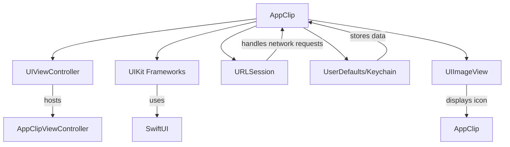

---

## **8. Extensions and Additional Functionalities**

### **a. AppClip Extensions Diagram**
- **Purpose**: Showcase additional functionalities provided through extensions.
- **Diagram Type**: `classDiagram`
- **Contents**:
  - **AppClip+UIExtensions**
  - **AppClip+Networking**
  - **AppClip+Storage**

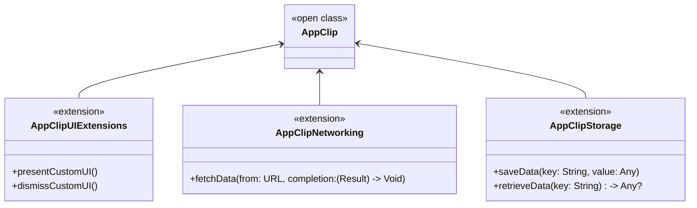

### **b. Extensions Functionalities Flowchart**
- **Purpose**: Detail specific extended methods and their purposes.
- **Diagram Type**: `flowchart LR`
- **Contents**:
  - **UI Extensions**
  - **Networking Extensions**
  - **Storage Extensions**

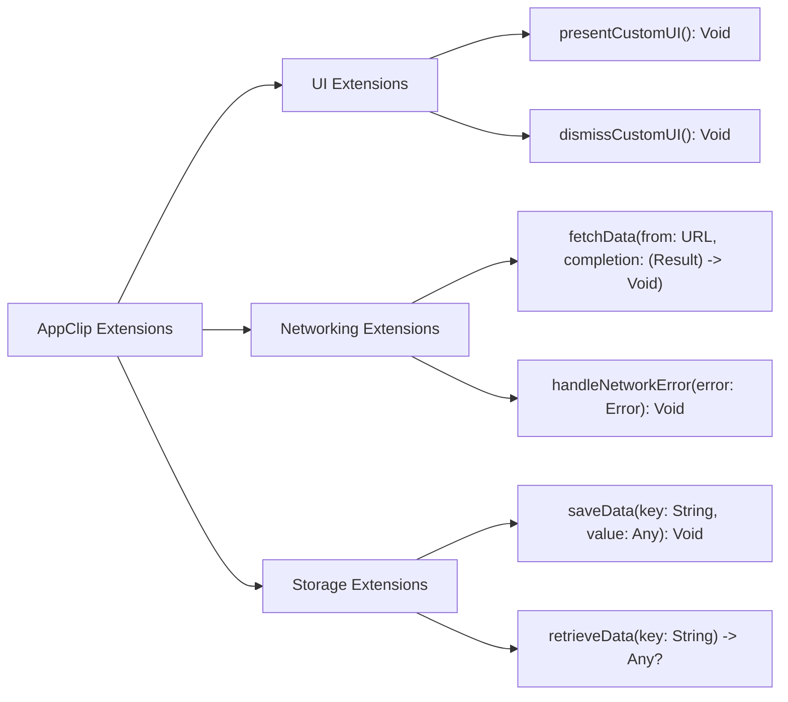

---

## **9. Lifecycle and Use Cases**

### **a. Lifecycle Flowchart**
- **Purpose**: Demonstrate the typical lifecycle of an `AppClip` within an application.
- **Diagram Type**: `flowchart TD`
- **Contents**:
  - **Invocation**
  - **Loading**
  - **Presentation**
  - **User Interaction**
  - **Dismissal**
  - **Caching**

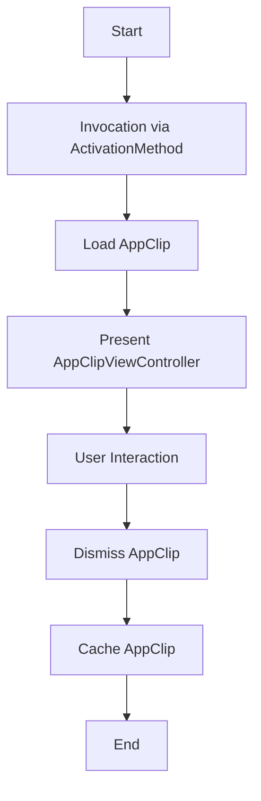

### **b. Common Use Cases Diagram**
- **Purpose**: Outline the typical scenarios where `App Clips` are utilized.
- **Diagram Type**: `flowchart TD`
- **Contents**:
  - **Quick Access Features**
  - **Location-Based Services**
  - **Product Purchases**
  - **Reservations & Bookings**
  - **Service Registrations**
  - **Event Check-ins**

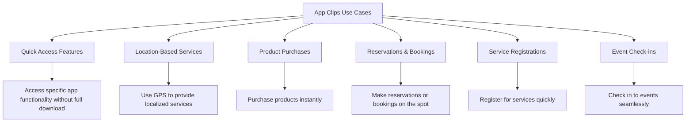

---

## **10. Feature Availability Timeline**

### **a. Feature Availability Gantt Chart**
- **Purpose**: Show when various `App Clips` features were introduced across iOS versions.
- **Diagram Type**: `gantt`
- **Contents**:
  - **iOS Versions**: 14.0, 15.0, 16.0, 17.0
  - **Features Introduced**: Basic App Clips, Advanced Activation Methods, Enhanced Metadata, Performance Optimizations, SwiftUI Integrations, Security Enhancements

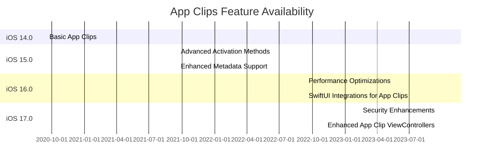

---

## **11. Data Handling and Formats**

### **a. Data Format Handling Diagram**
- **Purpose**: Explain how `App Clips` handle different data formats and resources.
- **Diagram Type**: `graph LR`
- **Contents**:
  - **Metadata Handling**: JSON, Property Lists
  - **Resource Formats**: Images (PNG, JPEG), Icons (SVG)
  - **Network Data**: JSON, XML, Binary Data

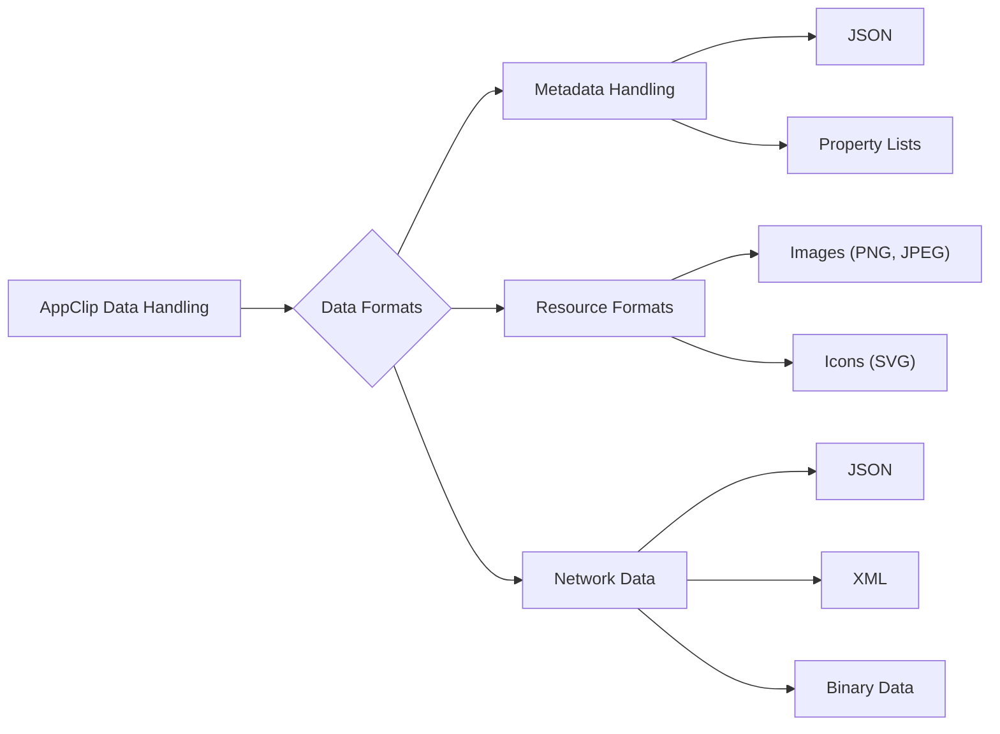

---

## **12. Integration with UIKit and SwiftUI**

### **a. Integration Methods Diagram**
- **Purpose**: Show how `App Clips` integrate with `UIKit` and `SwiftUI`.
- **Diagram Type**: `flowchart TD`
- **Contents**:
  - **UIKit Integration**: `UIViewController`, `UIHostingController`
  - **SwiftUI Integration**: `AppClipView`, `SwiftUI Views`
  - **Navigation & Presentation**: `Presenting AppClipViewController from UIKit`, `Integrating SwiftUI Views within AppClip`

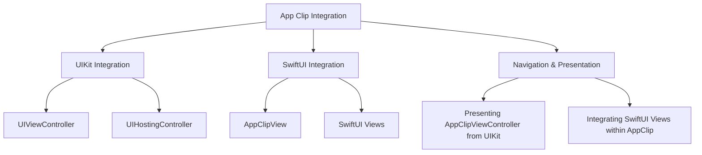

### **b. Example Integration Flowchart**
- **Purpose**: Demonstrate a typical integration flow between `AppClip`, `UIKit`, and `SwiftUI`.
- **Diagram Type**: `flowchart TD`
- **Contents**:
  - **Start from UIKit App**
  - **Invoke AppClip via ActivationMethod**
  - **Load AppClip Configuration**
  - **Present AppClipViewController**
  - **Render SwiftUI Views within AppClip**
  - **Handle User Interaction**
  - **Dismiss AppClip**

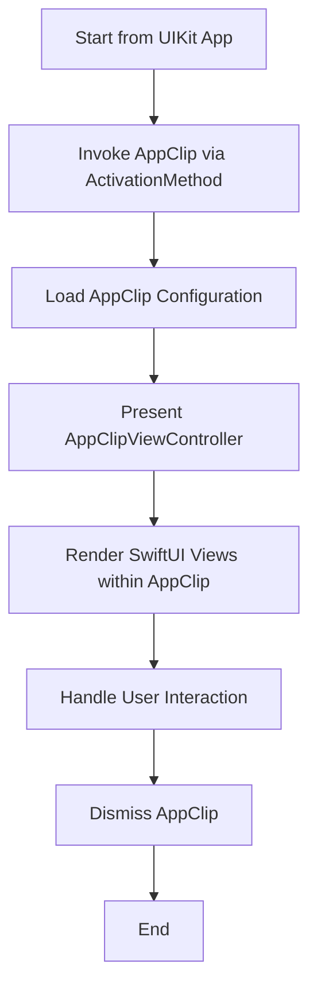

---

## **13. Summary and Best Practices**

### **a. Summary Diagram**
- **Purpose**: Provide a high-level overview of `App Clips` key characteristics and functionalities.
- **Diagram Type**: `graph LR`
- **Contents**:
  - **Lightweight Access**
  - **Seamless Integration**
  - **Quick Invocation**
  - **Secure Interactions**
  - **Optimized Performance**
  - **Enhanced User Experience**

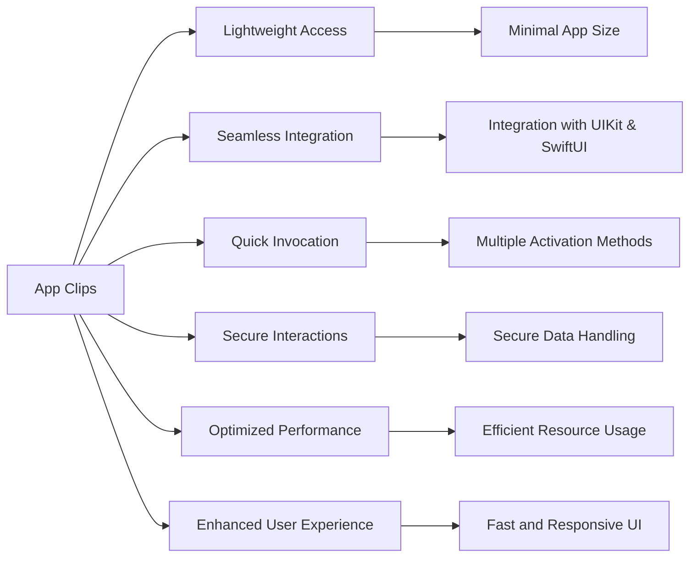

### **b. Best Practices Diagram**
- **Purpose**: Highlight best practices for developing and managing `App Clips`.
- **Diagram Type**: `flowchart LR`
- **Contents**:
  - **Keep It Lightweight**
  - **Optimize Performance**
  - **Ensure Security**
  - **Provide Clear Entry Points**
  - **Enhance User Experience**
  - **Test Thoroughly**
  - **Monitor Usage and Feedback**

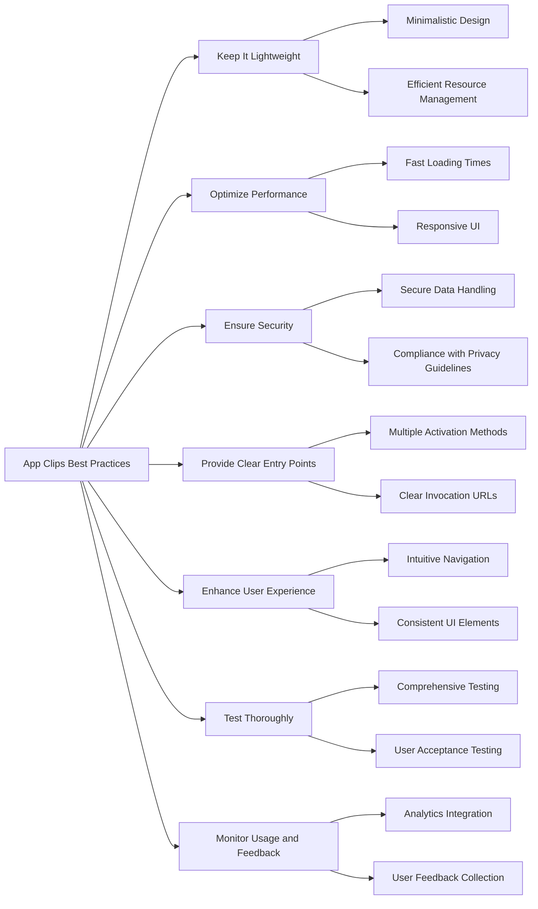

---

## **14. Security Considerations**

### **a. Security Practices Diagram**
- **Purpose**: Outline the security measures and best practices when developing `App Clips`.
- **Diagram Type**: `flowchart LR`
- **Contents**:
  - **Data Encryption**
  - **Authentication & Authorization**
  - **Secure Networking**
  - **Data Privacy Compliance**
  - **Code Signing**
  - **Regular Security Audits**

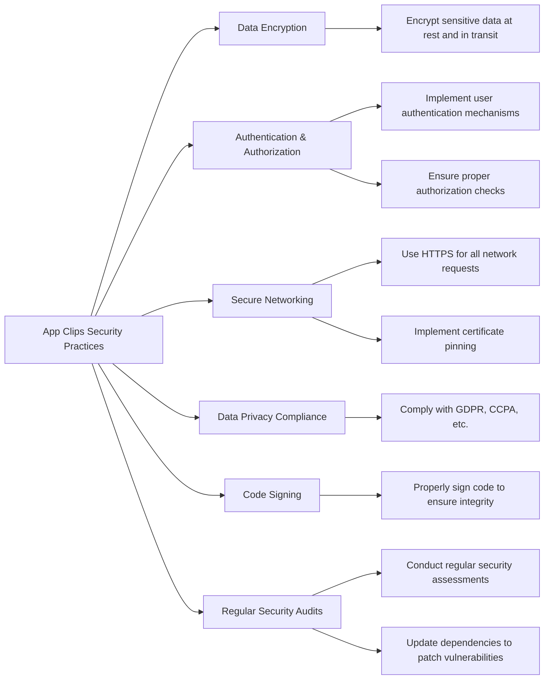

---

## **15. Performance Optimization**

### **a. Performance Strategies Diagram**
- **Purpose**: Highlight strategies to optimize the performance of `App Clips`.
- **Diagram Type**: `flowchart LR`
- **Contents**:
  - **Efficient Resource Loading**
  - **Asynchronous Operations**
  - **Minimize Network Requests**
  - **Optimize UI Rendering**
  - **Memory Management**
  - **Profiling and Monitoring**

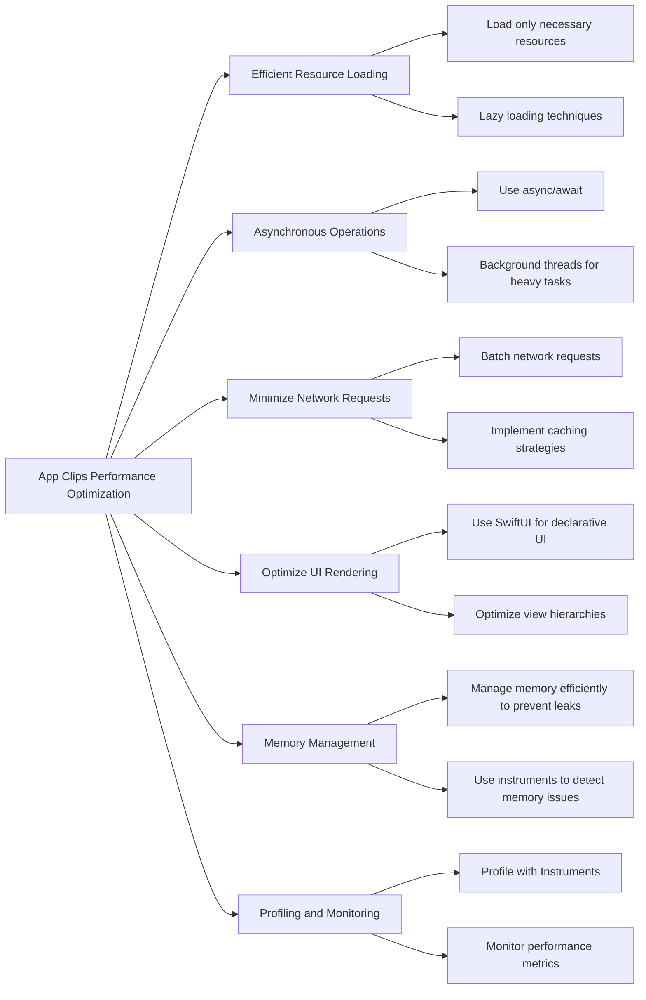

---

## **16. Localization and Internationalization**

### **a. Localization Strategies Diagram**
- **Purpose**: Outline how to implement localization and internationalization in `App Clips`.
- **Diagram Type**: `flowchart LR`
- **Contents**:
  - **Localized Resources**
  - **Dynamic Content Localization**
  - **RTL Language Support**
  - **Locale-Specific Formatting**
  - **Testing Localizations**

```mermaid
flowchart LR
    A[App Clips Localization] --> B[Localized Resources]
    A --> C[Dynamic Content Localization]
    A --> D[RTL Language Support]
    A --> E[Locale-Specific Formatting]
    A --> F[Testing Localizations]
    
    B --> B1[Use .strings files]
    B --> B2[Localize images and assets]
    
    C --> C1[Localize UI text dynamically]
    C --> C2[Support multiple languages]
    
    D --> D1[Implement Right-to-Left layout mirroring]
    
    E --> E1[Format dates, numbers, and currencies based on locale]
    
    F --> F1[Test with different locale settings]
    F --> F2[Use localization testing tools]
```

---

## **17. Analytics and Metrics**

### **a. Analytics Integration Diagram**
- **Purpose**: Show how to integrate analytics to monitor `App Clips` usage and performance.
- **Diagram Type**: `flowchart LR`
- **Contents**:
  - **Event Tracking**
  - **User Interaction Metrics**
  - **Performance Metrics**
  - **Crash Reporting**
  - **User Feedback Collection**
  - **Analytics Tools Integration**

```mermaid
flowchart LR
    A[App Clips Analytics] --> B[Event Tracking]
    A --> C[User Interaction Metrics]
    A --> D[Performance Metrics]
    A --> E[Crash Reporting]
    A --> F[User Feedback Collection]
    A --> G[Analytics Tools Integration]
    
    B --> B1[Track activation methods]
    B --> B2[Monitor feature usage]
    
    C --> C1[Measure engagement]
    C --> C2[Track user flows]
    
    D --> D1[Monitor load times]
    D --> D2[Analyze resource usage]
    
    E --> E1[Implement Crashlytics]
    E --> E2[Set up error logging]
    
    F --> F1[In-app feedback forms]
    F --> F2[Surveys]
    
    G --> G1[Integrate with Firebase Analytics]
    G --> G2[Use Apple Analytics]
```

---

## **18. Accessibility Features**

### **a. Accessibility Implementation Diagram**
- **Purpose**: Highlight how to implement accessibility features in `App Clips`.
- **Diagram Type**: `flowchart LR`
- **Contents**:
  - **VoiceOver Support**
  - **Dynamic Type**
  - **Color Contrast**
  - **Accessible Navigation**
  - **Semantic Labels**
  - **Testing Accessibility**

```mermaid
flowchart LR
    A[App Clips Accessibility] --> B[VoiceOver Support]
    A --> C[Dynamic Type]
    A --> D[Color Contrast]
    A --> E[Accessible Navigation]
    A --> F[Semantic Labels]
    A --> G[Testing Accessibility]
    
    B --> B1[Ensure all UI elements are accessible]
    B --> B2[Provide meaningful VoiceOver descriptions]
    
    C --> C1[Support adjustable font sizes]
    
    D --> D1[Maintain sufficient color contrast ratios]
    
    E --> E1[Implement logical navigation order]
    
    F --> F1[Add accessibility labels and hints]
    
    G --> G1[Use Accessibility Inspector]
    G --> G2[Conduct user testing with assistive technologies]
```

---

## **19. Error Handling and Recovery**

### **a. Error Handling Practices Diagram**
- **Purpose**: Outline best practices for error handling in `App Clips`.
- **Diagram Type**: `flowchart LR`
- **Contents**:
  - **Graceful Degradation**
  - **User-Friendly Error Messages**
  - **Logging and Monitoring**
  - **Retry Mechanisms**
  - **Fallback Strategies**
  - **Testing Error Scenarios**

```mermaid
flowchart LR
    A[App Clips Error Handling] --> B[Graceful Degradation]
    A --> C[User-Friendly Error Messages]
    A --> D[Logging and Monitoring]
    A --> E[Retry Mechanisms]
    A --> F[Fallback Strategies]
    A --> G[Testing Error Scenarios]
    
    B --> B1[Maintain core functionality during failures]
    
    C --> C1[Display clear and actionable error messages]
    
    D --> D1[Implement logging frameworks]
    D --> D2[Monitor errors with analytics tools]
    
    E --> E1[Retry failed network requests]
    
    F --> F1[Provide alternative workflows]
    
    G --> G1[Simulate network failures]
    G --> G2[Test with faulty data inputs]
```

---

## **20. Deployment and Distribution**

### **a. Deployment Workflow Diagram**
- **Purpose**: Illustrate the steps involved in deploying and distributing `App Clips`.
- **Diagram Type**: `flowchart LR`
- **Contents**:
  - **App Store Connect Configuration**
  - **App Clip Codes and URLs**
  - **Testing Before Deployment**
  - **Submitting for Review**
  - **Monitoring Post-Launch**
  - **Iterative Updates**

```mermaid
flowchart LR
    A[App Clips Deployment] --> B[App Store Connect Configuration]
    A --> C[Generate App Clip Codes and URLs]
    A --> D[Testing Before Deployment]
    A --> E[Submit App Clip for Review]
    A --> F[Monitor Post-Launch]
    A --> G[Iterative Updates]
    
    B --> B1[Set up App Clip in App Store Connect]
    B --> B2[Define App Clip Experience]
    
    C --> C1[Create App Clip Codes]
    C --> C2[Generate Invocation URLs]
    
    D --> D1[Conduct thorough testing]
    D --> D2[Use TestFlight for beta testing]
    
    E --> E1[Submit for App Store approval]
    
    F --> F1[Monitor usage analytics]
    F --> F2[Track performance metrics]
    
    G --> G1[Release updates based on feedback]
```

---

## **21. Advanced Features**

### **a. Advanced Features Diagram**
- **Purpose**: Highlight advanced features and capabilities of `App Clips`.
- **Diagram Type**: `flowchart LR`
- **Contents**:
  - **Location-Based Activation**
  - **Smart App Banners Integration**
  - **NFC Tag Activation**
  - **QR Code Scanning**
  - **Nearby Interaction**
  - **Passes and Tickets Integration**

```mermaid
flowchart LR
    A[App Clips Advanced Features] --> B[Location-Based Activation]
    A --> C[Smart App Banners Integration]
    A --> D[NFC Tag Activation]
    A --> E[QR Code Scanning]
    A --> F[Nearby Interaction]
    A --> G[Passes and Tickets Integration]
    
    B --> B1[Trigger App Clip based on user location]
    
    C --> C1[Display Smart App Banners on websites]
    
    D --> D1[Use NFC tags to invoke App Clips]
    
    E --> E1[Scan QR codes to launch App Clips]
    
    F --> F1[Utilize Nearby Interaction framework for seamless experiences]
    
    G --> G1[Integrate with Wallet passes and tickets]
```

---

## **22. Accessibility in App Clips**

### **a. Accessibility Features Diagram**
- **Purpose**: Showcase how to implement accessibility features within `App Clips`.
- **Diagram Type**: `graph LR`
- **Contents**:
  - **VoiceOver Support**
  - **Dynamic Type Compatibility**
  - **Color Contrast Compliance**
  - **Accessible Interactive Elements**
  - **Voice Control Support**
  - **Accessibility Testing**

```mermaid
graph LR
    A[App Clips Accessibility] --> B[VoiceOver Support]
    A --> C[Dynamic Type Compatibility]
    A --> D[Color Contrast Compliance]
    A --> E[Accessible Interactive Elements]
    A --> F[Voice Control Support]
    A --> G[Accessibility Testing]
    
    B --> B1[Provide meaningful labels and hints]
    
    C --> C1[Support scalable fonts]
    
    D --> D1[Ensure sufficient color contrast]
    
    E --> E1[Make buttons and controls easily navigable]
    
    F --> F1[Ensure full functionality via Voice Control]
    
    G --> G1[Use Accessibility Inspector]
    G --> G2[Conduct user testing with assistive technologies]
```

---

## **23. User Privacy Considerations**

### **a. Privacy Practices Diagram**
- **Purpose**: Outline how to handle user privacy in `App Clips`.
- **Diagram Type**: `flowchart LR`
- **Contents**:
  - **Data Minimization**
  - **User Consent**
  - **Transparent Data Usage**
  - **Secure Data Storage**
  - **Compliance with Privacy Laws**
  - **User Data Deletion**

```mermaid
flowchart LR
    A[App Clips Privacy Practices] --> B[Data Minimization]
    A --> C[User Consent]
    A --> D[Transparent Data Usage]
    A --> E[Secure Data Storage]
    A --> F[Compliance with Privacy Laws]
    A --> G[User Data Deletion]
    
    B --> B1[Collect only necessary data]
    
    C --> C1[Obtain explicit user consent]
    
    D --> D1[Provide clear privacy policies]
    
    E --> E1[Encrypt sensitive data]
    E --> E2[Implement secure storage mechanisms]
    
    F --> F1[Comply with GDPR, CCPA, etc.]
    
    G --> G1[Allow users to delete their data]
```

---

## **24. Best Practices for App Clips Development**

### **a. Best Practices Diagram**
- **Purpose**: Highlight best practices for developing and managing `App Clips`.
- **Diagram Type**: `flowchart LR`
- **Contents**:
  - **Optimize for Speed**
  - **Ensure Relevance**
  - **Provide Clear Value**
  - **Maintain Consistent Branding**
  - **Implement Robust Security**
  - **Focus on User Experience**
  - **Regularly Update and Iterate**

```mermaid
flowchart LR
    A[App Clips Development Best Practices] --> B[Optimize for Speed]
    A --> C[Ensure Relevance]
    A --> D[Provide Clear Value]
    A --> E[Maintain Consistent Branding]
    A --> F[Implement Robust Security]
    A --> G[Focus on User Experience]
    A --> H[Regularly Update and Iterate]
    
    B --> B1[Fast loading times]
    B --> B2[Efficient resource usage]
    
    C --> C1[Use contextually appropriate features]
    
    D --> D1[Offer clear and immediate benefits]
    
    E --> E1[Align with main app's branding]
    
    F --> F1[Secure data handling practices]
    
    G --> G1[Intuitive and responsive UI]
    
    H --> H1[Incorporate user feedback]
    H --> H2[Roll out incremental improvements]
```

---

## **25. Error Codes and Handling Strategies**

### **a. Error Codes Diagram**
- **Purpose**: List and describe common error codes within the `App Clips` framework and their handling strategies.
- **Diagram Type**: `classDiagram`
- **Contents**:
  - **AppClipError**
    - `invalidConfiguration`
    - `networkFailure`
    - `authenticationFailure`
    - `resourceUnavailable`
    - `timeout`
    - `unknown`

```mermaid
classDiagram
    class AppClipError {
        <<enum>>
        +invalidConfiguration
        +networkFailure
        +authenticationFailure
        +resourceUnavailable
        +timeout
        +unknown
    }

    AppClipError ..> invalidConfiguration : "Configuration issues"
    AppClipError ..> networkFailure : "Network connectivity problems"
    AppClipError ..> authenticationFailure : "User authentication failed"
    AppClipError ..> resourceUnavailable : "Requested resource not available"
    AppClipError ..> timeout : "Operation timed out"
    AppClipError ..> unknown : "An unknown error occurred"
```

### **b. Error Handling Strategies Diagram**
- **Purpose**: Show strategies to handle different error scenarios in `App Clips`.
- **Diagram Type**: `flowchart LR`
- **Contents**:
  - **Invalid Configuration**
  - **Network Failures**
  - **Authentication Issues**
  - **Resource Unavailability**
  - **Timeouts**
  - **Unknown Errors**

```mermaid
flowchart LR
    A[Error Handling Strategies] --> B[Invalid Configuration]
    A --> C[Network Failures]
    A --> D[Authentication Issues]
    A --> E[Resource Unavailability]
    A --> F[Timeouts]
    A --> G[Unknown Errors]
    
    B --> B1[Validate configuration before loading]
    B --> B2[Provide fallback options]
    
    C --> C1[Retry network requests]
    C --> C2[Inform user and suggest actions]
    
    D --> D1[Prompt user to re-authenticate]
    
    E --> E1[Notify user of unavailability]
    E --> E2[Suggest alternatives]
    
    F --> F1[Increase timeout thresholds]
    F --> F2[Retry the operation]
    
    G --> G1[Log error for further analysis]
    G --> G2[Provide generic error messages]
```

---

## **26. Testing and Quality Assurance**

### **a. Testing Strategies Diagram**
- **Purpose**: Outline the strategies for testing `App Clips` to ensure quality and reliability.
- **Diagram Type**: `flowchart LR`
- **Contents**:
  - **Unit Testing**
  - **UI Testing**
  - **Integration Testing**
  - **Performance Testing**
  - **User Acceptance Testing**
  - **Automated Testing Pipelines**

```mermaid
flowchart LR
    A[App Clips Testing Strategies] --> B[Unit Testing]
    A --> C[UI Testing]
    A --> D[Integration Testing]
    A --> E[Performance Testing]
    A --> F[User Acceptance Testing]
    A --> G[Automated Testing Pipelines]
    
    B --> B1[Test individual components and logic]
    
    C --> C1[Test UI elements and interactions]
    
    D --> D1[Test interactions between modules]
    
    E --> E1[Measure load times and responsiveness]
    
    F --> F1[Gather feedback from real users]
    
    G --> G1[Set up CI/CD workflows]
    G --> G2[Automate test executions]
```

---

## **27. Resource Allocation and Management**

### **a. Resource Management Diagram**
- **Purpose**: Illustrate how to manage and allocate resources efficiently in `App Clips`.
- **Diagram Type**: `flowchart LR`
- **Contents**:
  - **Memory Management**
  - **CPU Usage Optimization**
  - **Disk Space Management**
  - **Network Resource Allocation**
  - **Battery Consumption Optimization**
  - **Resource Monitoring**

```mermaid
flowchart LR
    A[App Clips Resource Management] --> B[Memory Management]
    A --> C[CPU Usage Optimization]
    A --> D[Disk Space Management]
    A --> E[Network Resource Allocation]
    A --> F[Battery Consumption Optimization]
    A --> G[Resource Monitoring]
    
    B --> B1[Efficient memory usage practices]
    B --> B2[Prevent memory leaks]
    
    C --> C1[Optimize algorithms for performance]
    C --> C2[Avoid unnecessary computations]
    
    D --> D1[Store minimal data locally]
    D --> D2[Implement data compression]
    
    E --> E1[Optimize network requests]
    E --> E2[Use efficient data formats]
    
    F --> F1[Minimize background activities]
    F --> F2[Optimize power-intensive tasks]
    
    G --> G1[Use Instruments for profiling]
    G --> G2[Monitor runtime resource usage]
```

---

## **28. Localization and Internationalization in App Clips**

### **a. Localization Workflow Diagram**
- **Purpose**: Detail the workflow for implementing localization in `App Clips`.
- **Diagram Type**: `flowchart LR`
- **Contents**:
  - **Identify Localizable Elements**
  - **Create Localization Files**
  - **Translate Content**
  - **Implement Dynamic Localization**
  - **Test Localizations**
  - **Maintain Localizations**

```mermaid
flowchart LR
    A[Localization Workflow] --> B[Identify Localizable Elements]
    A --> C[Create Localization Files]
    A --> D[Translate Content]
    A --> E[Implement Dynamic Localization]
    A --> F[Test Localizations]
    A --> G[Maintain Localizations]
    
    B --> B1[UI Texts]
    B --> B2[Images with Text]
    
    C --> C1[Create .strings files]
    C --> C2[Set up localized asset catalogs]
    
    D --> D1[Engage professional translators]
    D --> D2[Use localization tools]
    
    E --> E1[Implement NSLocalizedString]
    
    F --> F1[Test with different language settings]
    F --> F2[User feedback on translations]
    
    G --> G1[Update translations with app updates]
    G --> G2[Add support for new languages as needed]
```

---

## **29. Example Use Case: Food Ordering App Clip**

### **a. Use Case Flowchart**
- **Purpose**: Demonstrate a practical example of how an `App Clip` can be used in a food ordering scenario.
- **Diagram Type**: `flowchart TD`
- **Contents**:
  - **User Scans QR Code at Restaurant**
  - **App Clip Launches Food Menu**
  - **User Selects Items**
  - **App Clip Processes Order**
  - **User Receives Confirmation**
  - **Order Integrated with Main App**

```mermaid
flowchart TD
    Start[Start] --> Scan[User Scans QR Code at Restaurant]
    Scan --> Launch[App Clip Launches Food Menu]
    Launch --> Select[User Selects Items]
    Select --> Process[App Clip Processes Order]
    Process --> Confirm[User Receives Confirmation]
    Confirm --> Integrate[Order Integrated with Main App]
    Integrate --> End[End]
```

### **b. Detailed Steps Diagram**
- **Purpose**: Break down each step in the food ordering `App Clip` use case with detailed actions.
- **Diagram Type**: `flowchart LR`
- **Contents**:
  - **Scan QR Code**
  - **Load App Clip**
  - **Display Menu**
  - **Select Items**
  - **Checkout Process**
  - **Order Confirmation**
  - **Sync with Main App**

```mermaid
flowchart LR
    A[Scan QR Code] --> B[Load App Clip]
    B --> C[Display Menu]
    C --> D[Select Items]
    D --> E[Add to Cart]
    E --> F[Proceed to Checkout]
    F --> G[Enter Payment Details]
    G --> H[Process Payment]
    H --> I[Order Confirmation]
    I --> J[Sync Order with Main App]
```

---

## **30. Conclusion**

### **a. Overview Diagram**
- **Purpose**: Summarize the key aspects of `App Clips` and their significance in modern app development.
- **Diagram Type**: `graph LR`
- **Contents**:
  - **User Convenience**
  - **Business Benefits**
  - **Developer Opportunities**
  - **Seamless Integration**
  - **Future Prospects**

```mermaid
graph LR
    A[App Clips Overview] --> B[User Convenience]
    A --> C[Business Benefits]
    A --> D[Developer Opportunities]
    A --> E[Seamless Integration]
    A --> F[Future Prospects]
    
    B --> B1[Instant access to app functionalities]
    
    C --> C1[Increase user engagement]
    C --> C2[Boost in conversions and sales]
    
    D --> D1[Expand reach with minimal friction]
    D --> D2[Leverage multiple activation methods]
    
    E --> E1[Integration with UIKit and SwiftUI]
    E --> E2[Compatibility with existing apps]
    
    F --> F1[Enhanced features in future iOS versions]
    F --> F2[Growing adoption in various industries]
```

---

## **31. Additional Resources**

### **a. Resource Links Diagram**
- **Purpose**: Provide links to official documentation, tutorials, and tools for further learning about `App Clips`.
- **Diagram Type**: `flowchart LR`
- **Contents**:
  - **Official Documentation**
  - **Tutorials & Guides**
  - **Sample Projects**
  - **Developer Forums**
  - **Tools & SDKs**

```mermaid
flowchart LR
    A[App Clips Resources] --> B[Official Documentation]
    A --> C[Tutorials & Guides]
    A --> D[Sample Projects]
    A --> E[Developer Forums]
    A --> F[Tools & SDKs]
    
    B --> B1["Apple Developer App Clips Docs"]
    
    C --> C1["App Clips Tutorial by Apple"]
    C --> C2["Third-Party Tutorials"]
    
    D --> D1["Sample App Clips Projects on GitHub"]
    
    E --> E1["Apple Developer Forums"]
    E --> E2["Stack Overflow"]
    
    F --> F1["Xcode App Clips Templates"]
    F --> F2["Analytics Tools"]
```

---

## **32. Ethical Considerations**

### **a. Ethical Practices Diagram**
- **Purpose**: Outline ethical considerations when developing and deploying `App Clips`.
- **Diagram Type**: `flowchart LR`
- **Contents**:
  - **User Privacy**
  - **Data Security**
  - **Transparent Communication**
  - **Accessibility**
  - **Inclusive Design**
  - **Avoiding Dark Patterns**

```mermaid
flowchart LR
    A[App Clips Ethical Considerations] --> B[User Privacy]
    A --> C[Data Security]
    A --> D[Transparent Communication]
    A --> E[Accessibility]
    A --> F[Inclusive Design]
    A --> G[Avoiding Dark Patterns]
    
    B --> B1[Respect user data]
    
    C --> C1[Implement strong security measures]
    
    D --> D1[Clearly communicate app functionalities]
    
    E --> E1[Ensure accessibility for all users]
    
    F --> F1[Design for diverse user groups]
    
    G --> G1[Avoid manipulative UI/UX elements]
```

---

## **33. Industry Adoption and Case Studies**

### **a. Adoption Examples Diagram**
- **Purpose**: Showcase how various industries are adopting `App Clips` through real-world case studies.
- **Diagram Type**: `flowchart LR`
- **Contents**:
  - **Retail**
  - **Food & Beverage**
  - **Transportation**
  - **Hospitality**
  - **Entertainment**
  - **Healthcare**

```mermaid
flowchart LR
    A[App Clips Industry Adoption] --> B[Retail]
    A --> C[Food & Beverage]
    A --> D[Transportation]
    A --> E[Hospitality]
    A --> F[Entertainment]
    A --> G[Healthcare]
    
    B --> B1[Quick product browsing and purchasing]
    
    C --> C1[Food ordering and pickup]
    
    D --> D1[Ticket purchases and check-ins]
    
    E --> E1[Hotel reservations and services]
    
    F --> F1[Event ticketing and access]
    
    G --> G1[Appointment scheduling and check-ins]
```
---
