# App Intents

## **1. Class Structure and Hierarchy**

### **a. Core Class Diagram**
- **Purpose**: Illustrate the primary structure of `AppIntent`, including its properties, methods, and associated classes.
- **Diagram Type**: `classDiagram`
- **Contents**:
  - **Properties**: Key attributes like `intentDescription`, `parameters`, `responses`, etc.
  - **Methods**: Essential functions like `perform()`, `validate()`, `suggestionsProvider()`, etc.
  - **Associated Classes**: `AppIntentParameter`, `AppIntentResponse`, `AppIntentProvider`.

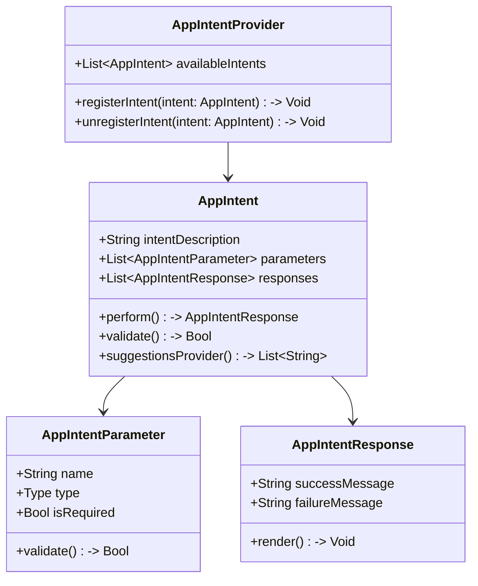

---

## **2. Initializers Overview**

### **a. Initialization Methods Diagram**
- **Purpose**: Break down the various ways to instantiate `AppIntent`.
- **Diagram Type**: `flowchart LR`
- **Contents**:
  - **Default Initializer**: `init()`
  - **Custom Initializers**: `init(description: String, parameters: [AppIntentParameter])`
  - **Factory Methods**: `createIntent()`, `createIntent(withResponse:)`

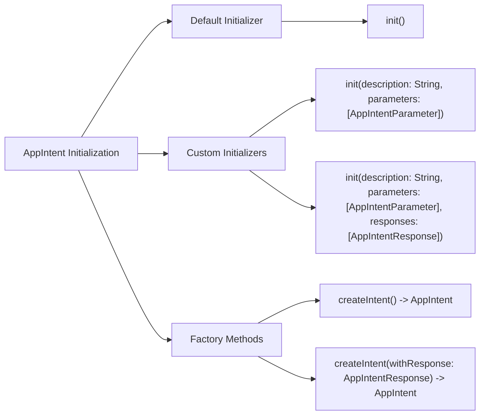

---

## **3. Properties Breakdown**

### **a. Key Properties Diagram**
- **Purpose**: Detail the main properties of `AppIntent`.
- **Diagram Type**: `graph LR`
- **Contents**:
  - **Intent Details**: `intentDescription`, `intentIdentifier`
  - **Parameters**: `parameters`
  - **Responses**: `responses`
  - **Metadata**: `availability`, `priority`

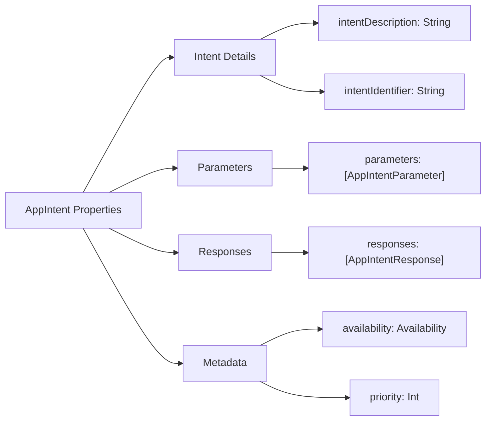

---

## **4. Methods Grouped by Functionality**

### **a. Intent Handling Methods**
- **Purpose**: Categorize methods based on their roles in handling intents.
- **Diagram Type**: `flowchart TD`
- **Contents**:
  - **Execution Methods**: `perform()`, `execute()`
  - **Validation Methods**: `validate()`, `validateParameters()`
  - **Suggestion Methods**: `suggestionsProvider()`, `provideSuggestions()`
  - **Configuration Methods**: `configure()`, `setup()`

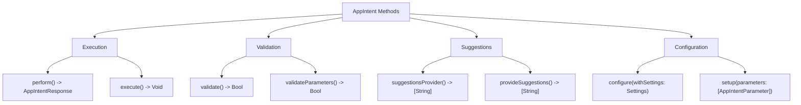

---

## **5. Enumerations and Configurations**

### **a. Enumerations Diagram**
- **Purpose**: Highlight the enums used within `AppIntent` and their possible values.
- **Diagram Type**: `classDiagram`
- **Contents**:
  - **Availability**
  - **PriorityLevel**
  - **IntentStatus**

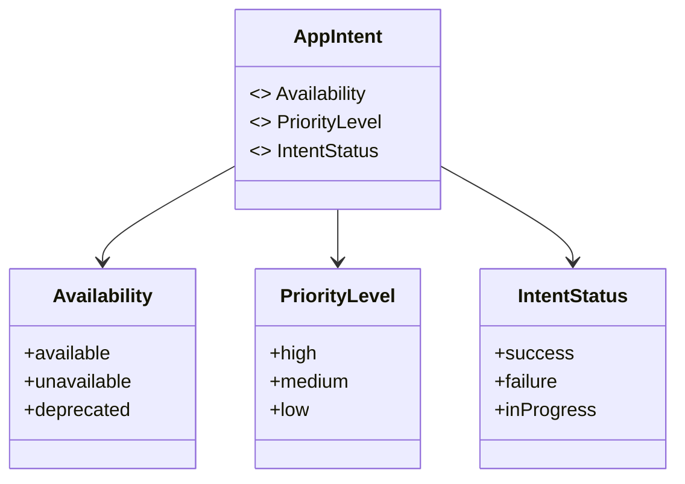

### **b. Configuration Classes Diagram**
- **Purpose**: Show the relationship between `AppIntent` and its configuration classes.
- **Diagram Type**: `classDiagram`
- **Contents**:
  - **AppIntentConfiguration**
  - **AppIntentSettings**

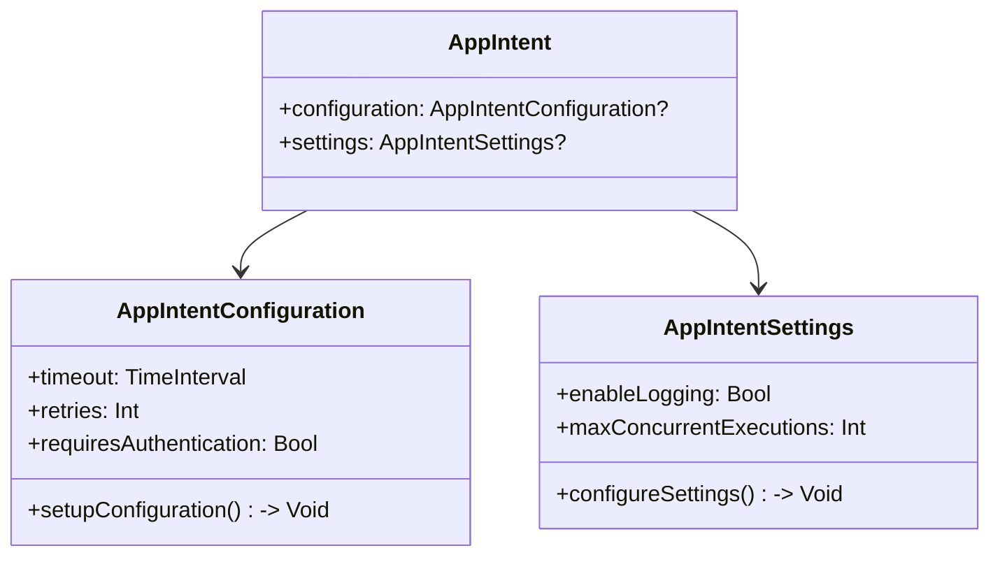

---

## **6. Protocol Conformances**

### **a. Protocols Diagram**
- **Purpose**: Display the protocols that `AppIntent` conforms to and their impact.
- **Diagram Type**: `classDiagram`
- **Contents**:
  - **Codable**
  - **Equatable**
  - **Hashable**
  - **CustomStringConvertible**
  - **Sendable**

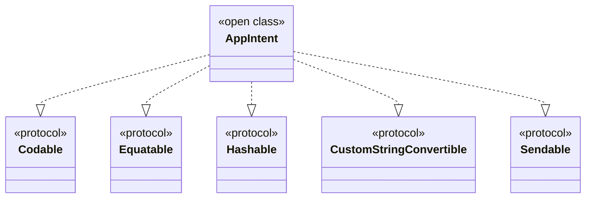

---

## **7. Relationships with Other Classes**

### **a. Related Classes Diagram**
- **Purpose**: Illustrate how `AppIntent` interacts with other classes and frameworks.
- **Diagram Type**: `flowchart TD`
- **Contents**:
  - **SiriKit**: Integration with Siri for voice commands.
  - **Shortcuts**: Interaction with Shortcuts app for automation.
  - **CoreData**: Data persistence for intent-related data.
  - **UserDefaults**: Storing user preferences.
  - **Networking Frameworks**: Handling network requests within intents.

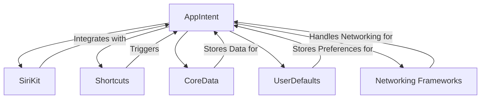

---

## **8. Extensions and Additional Functionalities**

### **a. AppIntent Extensions Diagram**
- **Purpose**: Showcase the additional functionalities provided through extensions.
- **Diagram Type**: `classDiagram`
- **Contents**:
  - **AppIntent+Analytics**
  - **AppIntent+Localization**
  - **AppIntent+Caching**

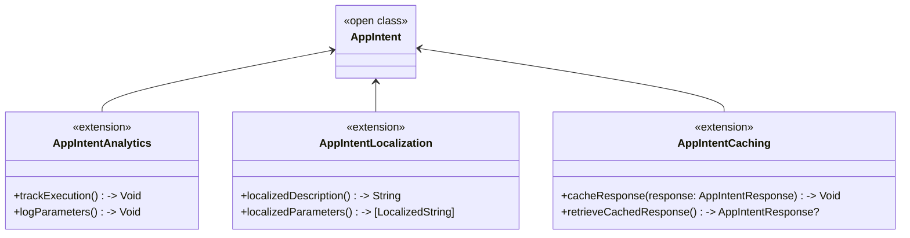

### **b. Extensions Functionalities Flowchart**
- **Purpose**: Detail specific extended methods and their purposes.
- **Diagram Type**: `flowchart LR`
- **Contents**:
  - **Analytics Extension**
  - **Localization Extension**
  - **Caching Extension**

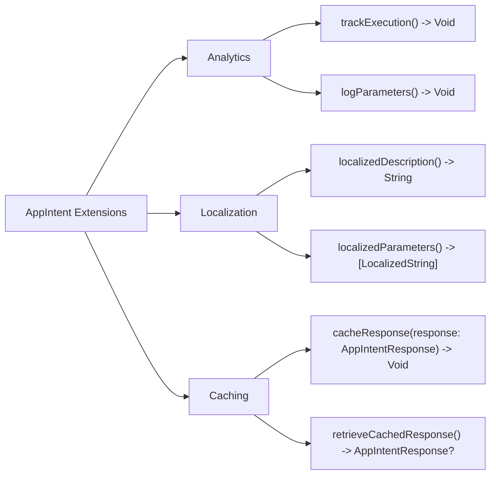

---

## **9. Lifecycle and Use Cases**

### **a. Lifecycle Flowchart**
- **Purpose**: Demonstrate the typical lifecycle of an `AppIntent` within an application.
- **Diagram Type**: `flowchart TD`
- **Contents**:
  - **Registration**
  - **Invocation**
  - **Execution**
  - **Response Handling**
  - **Termination**

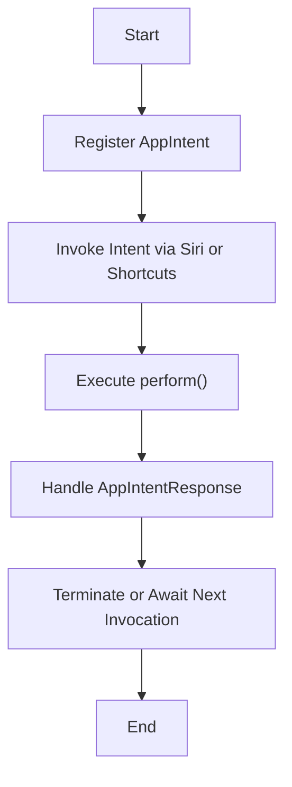

### **b. Common Use Cases Diagram**
- **Purpose**: Outline the typical scenarios where `AppIntent` is utilized.
- **Diagram Type**: `flowchart TD`
- **Contents**:
  - **Voice Commands via Siri**
  - **Automation with Shortcuts**
  - **In-App Intent Execution**
  - **Workflow Triggers**
  - **Data Synchronization**

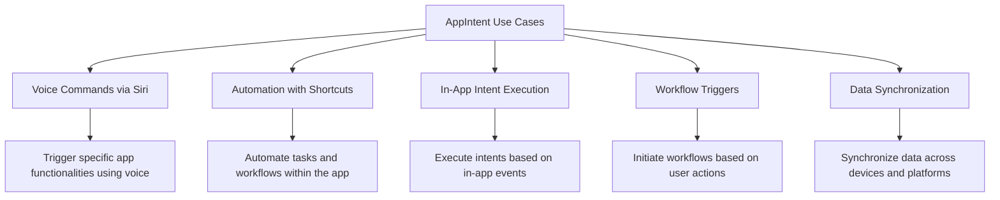

---

## **10. Feature Availability Timeline**

### **a. Feature Availability Gantt Chart**
- **Purpose**: Show when various `AppIntent` features were introduced across iOS versions.
- **Diagram Type**: `gantt`
- **Contents**:
  - **iOS Versions**: 16.0, 16.1, 16.4, 17.0
  - **Features Introduced**: Basic Intent Handling, Enhanced Validation, Shortcuts Integration, Advanced Analytics, Localization Support.

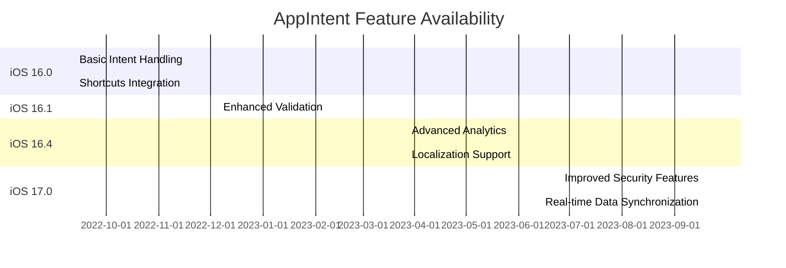

---

## **11. Data Handling and Formats**

### **a. Data Format Handling Diagram**
- **Purpose**: Explain how `AppIntent` handles different data formats.
- **Diagram Type**: `graph LR`
- **Contents**:
  - **JSON**: For intent definitions and responses.
  - **Property List (plist)**: For configuration settings.
  - **Core Data Models**: For persistent storage of intent-related data.
  - **Custom Data Types**: Defined by developers for specific intents.

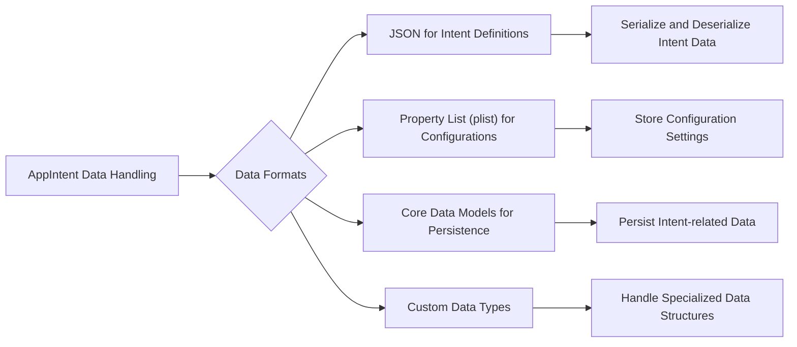

---

## **12. Integration with Other Contexts**

### **a. Integration Diagram**
- **Purpose**: Show how `AppIntent` integrates with other frameworks and services.
- **Diagram Type**: `flowchart TD`
- **Contents**:
  - **SiriKit**: For voice-activated intents.
  - **Shortcuts**: To allow users to create custom automation.
  - **CloudKit**: For cloud-based data synchronization.
  - **CoreML**: To execute machine learning tasks within intents.
  - **UIKit**: For UI-related intents and interactions.

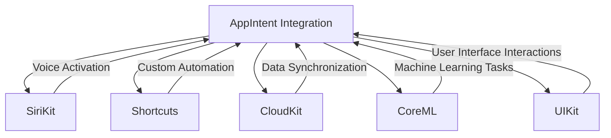

---

## **13. Summary and Best Practices**

### **a. Summary Diagram**
- **Purpose**: Provide a high-level overview of `AppIntent`'s key characteristics and functionalities.
- **Diagram Type**: `graph LR`
- **Contents**:
  - **Versatile Initialization**
  - **Robust Execution Framework**
  - **Seamless Siri and Shortcuts Integration**
  - **Advanced Validation and Error Handling**
  - **Extensible through Extensions**
  - **Efficient Data Handling**

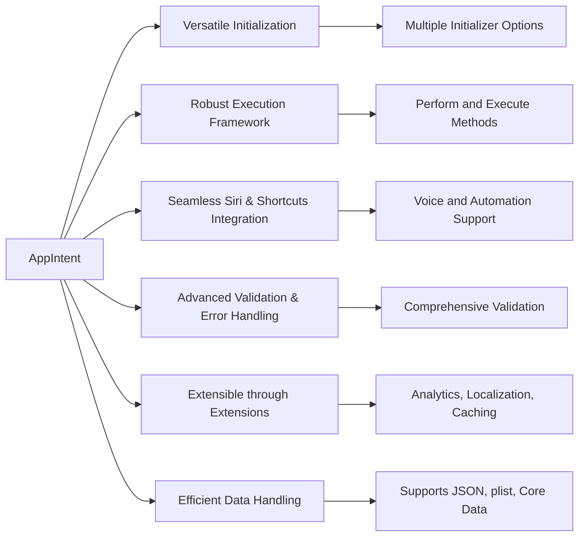

---

## **14. Additional Diagrams**

Given the complexity and depth of the `AppIntents` framework, additional diagrams can be incorporated to cover more nuanced aspects:

### **a. Parameter Validation Flowchart**
- **Purpose**: Illustrate the flow of parameter validation within an intent.
- **Diagram Type**: `flowchart TD`

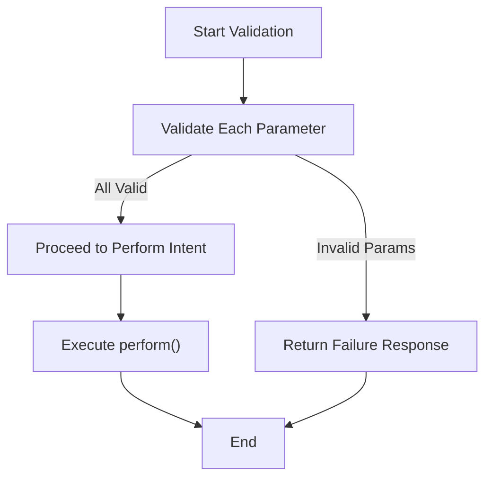

### **b. Error Handling Mechanism**
- **Purpose**: Show how `AppIntent` handles errors during intent execution.
- **Diagram Type**: `flowchart LR`

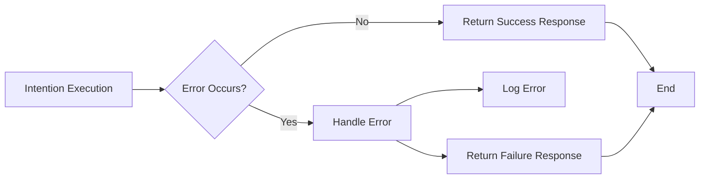

---

## **15. Security Considerations**

### **a. Security Features Diagram**
- **Purpose**: Outline the security mechanisms within `AppIntent`.
- **Diagram Type**: `graph LR`

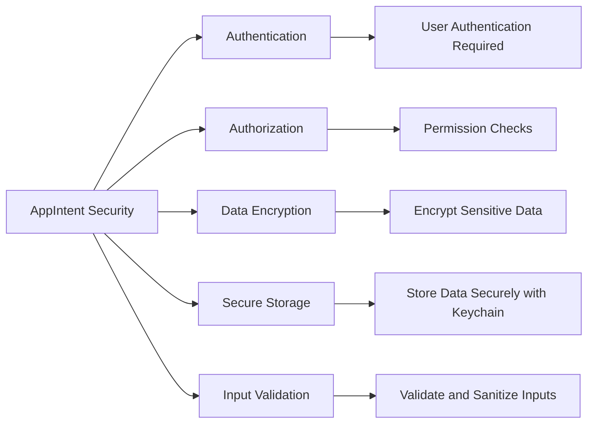

---

## **16. Performance Optimization**

### **a. Performance Tips Diagram**
- **Purpose**: Highlight best practices for optimizing `AppIntent` performance.
- **Diagram Type**: `flowchart TB`

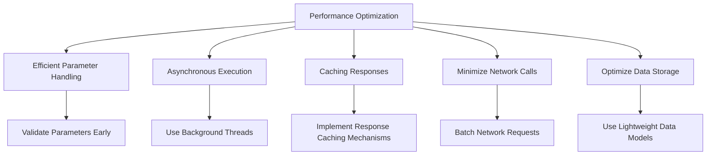

---

## **17. Testing Strategies**

### **a. Testing Frameworks Diagram**
- **Purpose**: Display the testing frameworks and strategies applicable to `AppIntent`.
- **Diagram Type**: `classDiagram`

```mermaid
classDiagram
    class AppIntent {
        <<open class>>
    }

    class XCTest {
        <<framework>>
    }

    class Mockingjay {
        <<framework>>
    }

    class Quick {
        <<framework>>
    }

    class Nimble {
        <<framework>>
    }

    AppIntent --> XCTest : Unit Testing
    AppIntent --> Mockingjay : Mocking Network Calls
    AppIntent --> Quick : Behavior-Driven Testing
    AppIntent --> Nimble : Assertations
```

---

## **18. Deployment Considerations**

### **a. Deployment Pipeline Diagram**
- **Purpose**: Illustrate the deployment pipeline for applications utilizing `AppIntent`.
- **Diagram Type**: `flowchart LR`

```mermaid
flowchart LR
    A[Development] --> B[Local Testing]
    B --> C[Continuous Integration]
    C --> D[Automated Testing]
    D --> E[Build Artifacts]
    E --> F[App Store Submission]
    F --> G[Deployment to Users]
```

---

## **19. Best Practices Checklist**

### **a. Best Practices Diagram**
- **Purpose**: Provide a checklist of best practices for using `AppIntent`.
- **Diagram Type**: `graph TB`

```mermaid
graph TB
    A[AppIntent Best Practices] --> B[Clear Intent Descriptions]
    A --> C[Comprehensive Parameter Validation]
    A --> D[Handle All Possible Responses]
    A --> E[Optimize for Performance]
    A --> F[Ensure Security and Privacy]
    A --> G[Provide Helpful Suggestions]
    A --> H[Thorough Testing]
    A --> I[Maintain Up-to-Date Documentation]

    B --> B1["Use Descriptive Naming Conventions"]
    C --> C1["Validate Inputs and Handle Errors Gracefully"]
    D --> D1["Provide Success, Failure, and In-Progress Responses"]
    E --> E1["Minimize Latency and Resource Usage"]
    F --> F1["Protect User Data and Respect Permissions"]
    G --> G1["Offer Relevant and Contextual Suggestions"]
    H --> H1["Implement Unit and Integration Tests"]
    I --> I1["Document Intent Usage and Parameters"]
```

---

## **20. Future Enhancements and Roadmap**

### **a. Roadmap Timeline Diagram**
- **Purpose**: Outline potential future enhancements for the `AppIntents` framework.
- **Diagram Type**: `gantt`
- **Contents**:
  - **Upcoming Features**: Enhanced AI Integration, Expanded Parameter Types, Improved Analytics, Cross-Platform Support.
  - **Planned iOS Versions**: 18.0, 19.0.

```
gantt
    dateFormat  YYYY-MM-DD
    title AppIntent Future Enhancements Roadmap

    section iOS 18.0
    Enhanced AI Integration           :active, des1, 2024-06-01, 2024-09-30
    Expanded Parameter Types          :done, des2, 2024-02-01, 2024-05-31

    section iOS 19.0
    Improved Analytics                :active, des3, 2025-01-01, 2025-04-30
    Cross-Platform Support            :planned, des4, 2025-05-01, 2025-08-31

```

---
