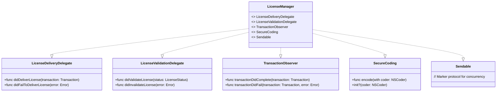

# App License Delivery SDK

## **1. Class Structure and Hierarchy**

### **a. Core Class Diagram**
- **Purpose**: Illustrate the primary structure of the `AppLicenseDeliverySDK`, including its main classes, properties, methods, and enumerations.
- **Diagram Type**: `classDiagram`
- **Contents**:
  - **Classes**: `LicenseManager`, `License`, `User`, `Product`, `Transaction`
  - **Properties**: Key attributes like `licenseID`, `expiryDate`, `userID`, etc.
  - **Methods**: Essential functions like `validateLicense()`, `deliverLicense()`, etc.
  - **Enumerations**: Nested enums such as `LicenseStatus`, `LicenseType`, `DeliveryMethod`


---

## **2. Initializers Overview**

### **a. Initialization Methods Diagram**
- **Purpose**: Break down the various ways to instantiate core components of the `App License Delivery SDK`.
- **Diagram Type**: `flowchart` or `graph LR`
- **Contents**:
  - **Singleton Initializer**: `shared`
  - **User-Based Initializers**: `init(userID:)`
  - **Product-Based Initializers**: `init(productID:)`
  - **License-Based Initializers**: `init(licenseID:)`
  - **Transaction-Based Initializers**: `init(transactionID:)`


---

## **3. Properties Breakdown**

### **a. Key Properties Diagram**
- **Purpose**: Detail the main properties of the core classes in the `App License Delivery SDK`.
- **Diagram Type**: `graph LR` or `classDiagram`
- **Contents**:
  - **License Management**: `licenseID`, `expiryDate`, `status`
  - **User Information**: `userID`, `name`, `email`
  - **Product Details**: `productID`, `name`, `price`
  - **Transaction Data**: `transactionID`, `date`, `method`, `status`


---

## **4. Methods Grouped by Functionality**

### **a. License Management Methods**
- **Purpose**: Categorize methods based on their roles in license management.
- **Diagram Type**: `flowchart TD`
- **Contents**:
  - **Validation Methods**: `validateLicense()`, `checkExpiry()`
  - **Delivery Methods**: `deliverLicense()`, `sendLicenseEmail()`
  - **Renewal Methods**: `renewLicense()`, `extendLicense()`
  - **Revocation Methods**: `revokeLicense()`, `suspendLicense()`


---

## **5. Enumerations and Configurations**

### **a. Enumerations Diagram**
- **Purpose**: Highlight the enums used within the `App License Delivery SDK` and their possible values.
- **Diagram Type**: `classDiagram`
- **Contents**:
  - **LicenseStatus**
  - **LicenseType**
  - **DeliveryMethod**
  - **TransactionStatus**


### **b. Configuration Classes Diagram**
- **Purpose**: Show the relationship between `App License Delivery SDK` and its configuration classes.
- **Diagram Type**: `classDiagram`
- **Contents**:
  - **SDKConfiguration**
  - **DeliveryConfiguration**


---

## **6. Protocol Conformances**

### **a. Protocols Diagram**
- **Purpose**: Display the protocols that the `App License Delivery SDK` conforms to and their impact.
- **Diagram Type**: `classDiagram`
- **Contents**:
  - **LicenseDeliveryDelegate**
  - **LicenseValidationDelegate**
  - **TransactionObserver**
  - **SecureCoding**
  - **Sendable**



---

## **7. Relationships with Other Classes**

### **a. Related Classes Diagram**
- **Purpose**: Illustrate how the `App License Delivery SDK` interacts with other UIKit classes and frameworks.
- **Diagram Type**: `flowchart TD`
- **Contents**:
  - **Networking Layer**: Interacts with `URLSession`
  - **Storage Layer**: Integrates with `CoreData` or `UserDefaults`
  - **UI Components**: Works with `UIAlertController` for license prompts
  - **Authentication**: Integrates with `AuthenticationServices` for user verification
  - **Payment Processing**: Interfaces with `StoreKit` for in-app purchases
  - **Logging**: Uses `OSLog` for logging events


---

## **8. Extensions and Additional Functionalities**

### **a. SDK Extensions Diagram**
- **Purpose**: Showcase the additional functionalities provided through SDK extensions.
- **Diagram Type**: `classDiagram`
- **Contents**:
  - **LicenseManagerExtensions**
  - **UserExtensions**
  - **ProductExtensions**


### **b. Extensions Functionalities Flowchart**
- **Purpose**: Detail specific extended methods and their purposes.
- **Diagram Type**: `flowchart LR`
- **Contents**:
  - **License Fetching**
  - **Validation Enhancements**
  - **Delivery Configuration**


---

## **9. Lifecycle and Use Cases**

### **a. Lifecycle Flowchart**
- **Purpose**: Demonstrate the typical lifecycle of the `App License Delivery SDK` within an application.
- **Diagram Type**: `flowchart TD`
- **Contents**:
  - **Initialization**
  - **Configuration**
  - **License Validation**
  - **License Delivery**
  - **Renewal & Revocation**
  - **Termination**


### **b. Common Use Cases Diagram**
- **Purpose**: Outline the typical scenarios where the `App License Delivery SDK` is utilized.
- **Diagram Type**: `flowchart TD`
- **Contents**:
  - **License Validation**
  - **License Delivery**
  - **Renewal Processes**
  - **Revocation Handling**
  - **User Notifications**
  - **Analytics & Logging**


---

## **10. Feature Availability Timeline**

### **a. Feature Availability Gantt Chart**
- **Purpose**: Show when various `App License Delivery SDK` features were introduced across versions.
- **Diagram Type**: `gantt`
- **Contents**:
  - **SDK Versions**: 1.0, 1.1, 1.2, 2.0, 2.1, 3.0
  - **Features Introduced**: Basic initialization, license validation, delivery methods, renewal mechanisms, revocation handling, analytics integration, security enhancements.


---

## **11. Data Handling and Formats**

### **a. Data Format Handling Diagram**
- **Purpose**: Explain how the `App License Delivery SDK` handles different data formats.
- **Diagram Type**: `graph LR`
- **Contents**:
  - **JSON**: For API communication
  - **Property List (plist)**: For local storage
  - **Core Data**: For complex data relationships
  - **Secure Storage**: Using Keychain for sensitive data


---

## **12. Integration with Drawing Contexts**

### **a. Drawing Methods Usage Diagram**
- **Purpose**: Show how the `App License Delivery SDK` methods are used within drawing contexts (e.g., custom UI components representing licenses).
- **Diagram Type**: `flowchart TD`
- **Contents**:
  - **Rendering License Badges**
  - **Custom License Indicators**
  - **Visual Feedback for License Status**


---

## **13. Summary and Best Practices**

### **a. Summary Diagram**
- **Purpose**: Provide a high-level overview of the `App License Delivery SDK`'s key characteristics and functionalities.
- **Diagram Type**: `graph LR` or `mindmap`
- **Contents**:
  - **Robust License Management**
  - **Secure Data Handling**
  - **Flexible Delivery Methods**
  - **Comprehensive Validation Mechanisms**
  - **Seamless Integration with iOS Ecosystem**
  - **Extensible Architecture**


---

## **Best Practices for Using `App License Delivery SDK`**

1. **Secure Initialization**: Always initialize the `LicenseManager` using the singleton pattern to ensure a consistent state across the application.

```swift
let licenseManager = LicenseManager.shared
```

2. **Proper Configuration**: Configure the SDK before performing any license operations to set API endpoints, timeout intervals, and delivery methods.

```swift
let config = SDKConfiguration(apiEndpoint: "https://api.example.com", timeout: 30, retryCount: 3, enableLogging: true)
licenseManager.configuration = config
```

3. **Handle Delegate Methods**: Implement the `LicenseDeliveryDelegate` and `LicenseValidationDelegate` protocols to handle success and failure scenarios effectively.

```swift
extension YourViewController: LicenseDeliveryDelegate, LicenseValidationDelegate {
    func didDeliverLicense(transaction: Transaction) {
        // Handle successful delivery
    }
        
    func didFailToDeliverLicense(error: Error) {
        // Handle delivery failure
    }
        
    func didValidateLicense(status: LicenseStatus) {
        // Handle validation status
    }
        
    func didInvalidateLicense(error: Error) {
        // Handle validation failure
    }
}
```

4. **Secure Data Storage**: Store sensitive information such as tokens and license IDs in the Keychain to enhance security.

    ```swift
    KeychainHelper.save(key: "licenseID", data: license.licenseID.data(using: .utf8)!)
    ```

5. **Error Handling**: Implement robust error handling to manage different failure scenarios gracefully, ensuring a smooth user experience.

```swift
do {
    let status = try licenseManager.validateLicense(licenseID: "ABC123")
    // Proceed based on status
} catch {
    // Handle error
}
```

6. **Regular Validation**: Regularly validate licenses, especially after network changes or application updates, to maintain licensing integrity.

```swift
licenseManager.validateLicense(licenseID: "ABC123")
```

7. **Optimize Performance**: Utilize asynchronous methods provided by the SDK to avoid blocking the main thread, ensuring the app remains responsive.

```swift
DispatchQueue.global().async {
    let status = licenseManager.validateLicense(licenseID: "ABC123")
    DispatchQueue.main.async {
        // Update UI based on status
    }
}
```

8. **Leverage Extensions**: Use SDK extensions for additional functionalities like fetching active licenses or configuring delivery options to enhance capabilities without modifying core SDK code.

```swift
let activeLicenses = licenseManager.fetchActiveLicenses(forUserID: "USER123")
licenseManager.configureDeliveryOptions(customConfig)
```

9. **Maintain Up-to-Date SDK**: Regularly update the SDK to incorporate the latest features, security patches, and performance improvements.

10. **Comprehensive Testing**: Implement unit tests and UI tests to ensure all licensing functionalities work as expected across different scenarios.

```swift
func testLicenseValidation() {
    let status = licenseManager.validateLicense(licenseID: "TEST123")
    XCTAssertEqual(status, .active)
}
```

---

