---

# Apple Music API

Below is a comprehensive and organized set of Mermaid diagrams for the **Apple Music API** framework. These diagrams cover various aspects of the Apple Music API, including class structures, initialization methods, properties, functionalities, enumerations, protocol conformances, relationships, extensions, lifecycle, feature availability, data handling, integration, and best practices.

---

## **1. Class Structure and Hierarchy**

### **a. Core Class Diagram**
- **Purpose**: Illustrate the primary structure of the Apple Music API framework, including its main classes, their properties, methods, and enumerations.
- **Diagram Type**: `classDiagram`
- **Contents**:
  - **Core Classes**: `AppleMusicAPI`, `MusicPlayer`, `MusicLibrary`, `Catalog`, `Storefront`
  - **Enumerations**: `PlaybackState`, `ContentType`, `StorefrontRegion`
  
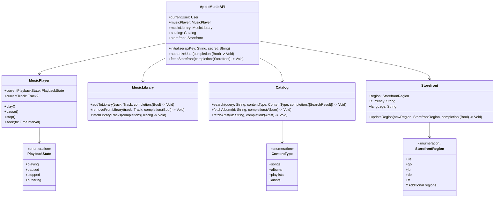

---

## **2. Initialization Overview**

### **a. Initialization Methods Diagram**
- **Purpose**: Break down the various ways to instantiate and set up the Apple Music API.
- **Diagram Type**: `flowchart LR`
- **Contents**:
  - **API Initialization**: `initialize(apiKey:secret:)`
  - **User Authorization**: `authorizeUser(completion:)`
  - **Storefront Configuration**: `fetchStorefront(completion:)`
  - **Music Player Setup**: `musicPlayer` property initialization
  - **Library Access**: `musicLibrary` property initialization

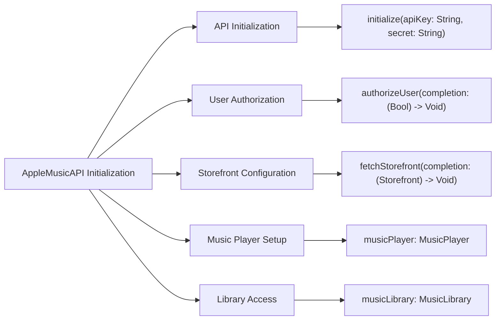

---

## **3. Properties Breakdown**

### **a. Key Properties Diagram**
- **Purpose**: Detail the main properties of the Apple Music API core classes.
- **Diagram Type**: `graph LR`
- **Contents**:
  - **AppleMusicAPI**: `currentUser`, `musicPlayer`, `musicLibrary`, `catalog`, `storefront`
  - **MusicPlayer**: `currentPlaybackState`, `currentTrack`
  - **MusicLibrary**: `ownedTracks`, `ownedAlbums`, `ownedPlaylists`
  - **Catalog**: `availableContentTypes`
  - **Storefront**: `region`, `currency`, `language`

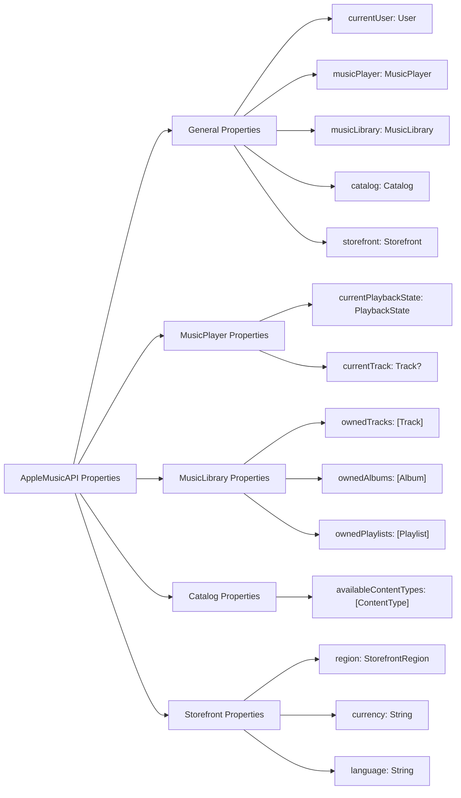


---

## **4. Methods Grouped by Functionality**

### **a. Playback Control Methods**
- **Purpose**: Categorize methods related to controlling music playback.
- **Diagram Type**: `flowchart TD`
- **Contents**:
  - **Playback Operations**: `play()`, `pause()`, `stop()`
  - **Seek Operations**: `seek(to:)`
  - **Track Management**: `currentTrack`, `nextTrack()`, `previousTrack()`
  - **Playback State Management**: Observing `currentPlaybackState`

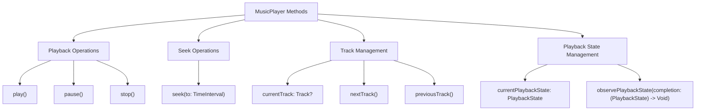

### **b. Catalog Access Methods**
- **Purpose**: Categorize methods related to accessing and searching the music catalog.
- **Diagram Type**: `flowchart TD`
- **Contents**:
  - **Search Methods**: `search(query:contentType:completion:)`
  - **Fetch Methods**: `fetchAlbum(id:completion:)`, `fetchArtist(id:completion:)`, `fetchPlaylist(id:completion:)`
  - **Recommendation Methods**: `getRecommendations(completion:)`

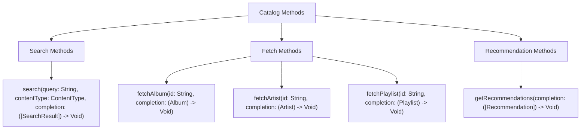

### **c. Library Management Methods**
- **Purpose**: Categorize methods related to managing the user's music library.
- **Diagram Type**: `flowchart TD`
- **Contents**:
  - **Library Operations**: `addToLibrary(track:completion:)`, `removeFromLibrary(track:completion:)`
  - **Fetch Operations**: `fetchLibraryTracks(completion:)`, `fetchLibraryAlbums(completion:)`, `fetchLibraryPlaylists(completion:)`
  - **Sync Operations**: `synchronizeLibrary(completion:)`

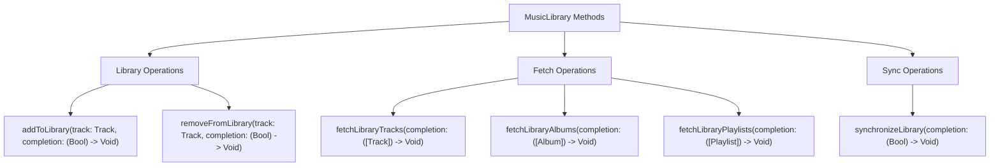

---

## **5. Enumerations and Configurations**

### **a. Enumerations Diagram**
- **Purpose**: Highlight the enums used within the Apple Music API and their possible values.
- **Diagram Type**: `classDiagram`
- **Contents**:
  - **PlaybackState**
  - **ContentType**
  - **StorefrontRegion**
  - **SearchResultType**

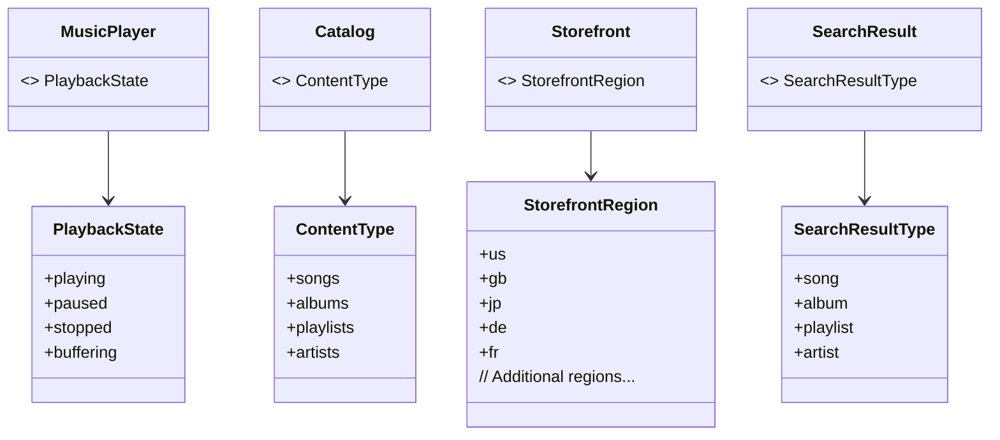

### **b. Configuration Classes Diagram**
- **Purpose**: Show the relationship between core classes and their configuration settings.
- **Diagram Type**: `classDiagram`
- **Contents**:
  - **APIConfiguration**
  - **PlayerConfiguration**
  - **LibraryConfiguration**

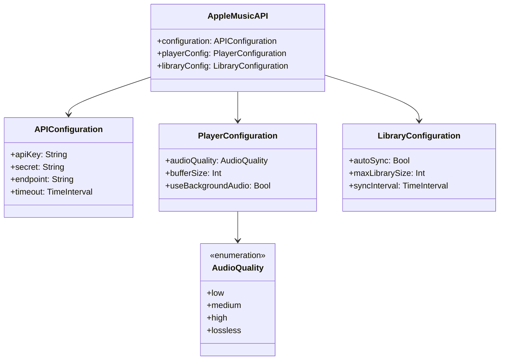

---

## **6. Protocol Conformances**

### **a. Protocols Diagram**
- **Purpose**: Display the protocols that core Apple Music API classes conform to and their impact.
- **Diagram Type**: `classDiagram`
- **Contents**:
  - **Codable**
  - **ObservableObject**
  - **CustomStringConvertible**
  - **Equatable**
  - **Sendable**

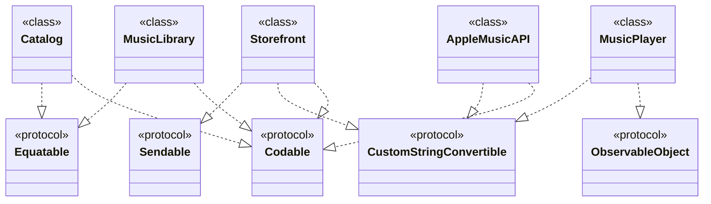

---

## **7. Relationships with Other Classes**

### **a. Related Classes Diagram**
- **Purpose**: Illustrate how the Apple Music API interacts with other iOS frameworks and classes.
- **Diagram Type**: `flowchart TD`
- **Contents**:
  - **StoreKit**: For in-app purchases and subscriptions.
  - **MediaPlayer**: For accessing media playback controls.
  - **CloudKit**: For syncing library data across devices.
  - **Notifications**: For handling playback notifications.
  - **CoreData**: For local storage of library data.
  - **UIKit/UIKit components**: `UIViewController`, `UITableView`, etc.

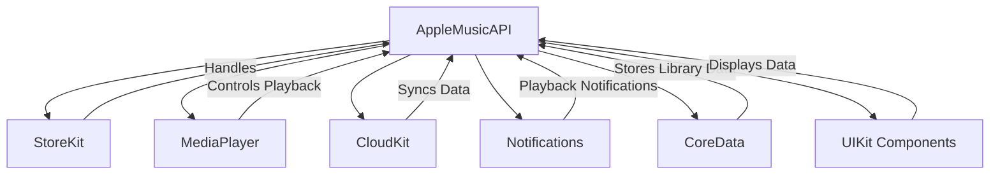

---

## **8. Extensions and Additional Functionalities**

### **a. AppleMusicAPI Extensions Diagram**
- **Purpose**: Showcase the additional functionalities provided through extensions.
- **Diagram Type**: `classDiagram`
- **Contents**:
  - **Networking Extensions**
  - **UI Extensions**
  - **Data Handling Extensions**
  - **Authentication Extensions**

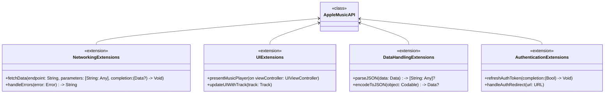

### **b. Extensions Functionalities Flowchart**
- **Purpose**: Detail specific extended methods and their purposes.
- **Diagram Type**: `flowchart LR`
- **Contents**:
  - **Networking Extensions**: `fetchData`, `handleErrors`
  - **UI Extensions**: `presentMusicPlayer`, `updateUIWithTrack`
  - **Data Handling Extensions**: `parseJSON`, `encodeToJSON`
  - **Authentication Extensions**: `refreshAuthToken`, `handleAuthRedirect`

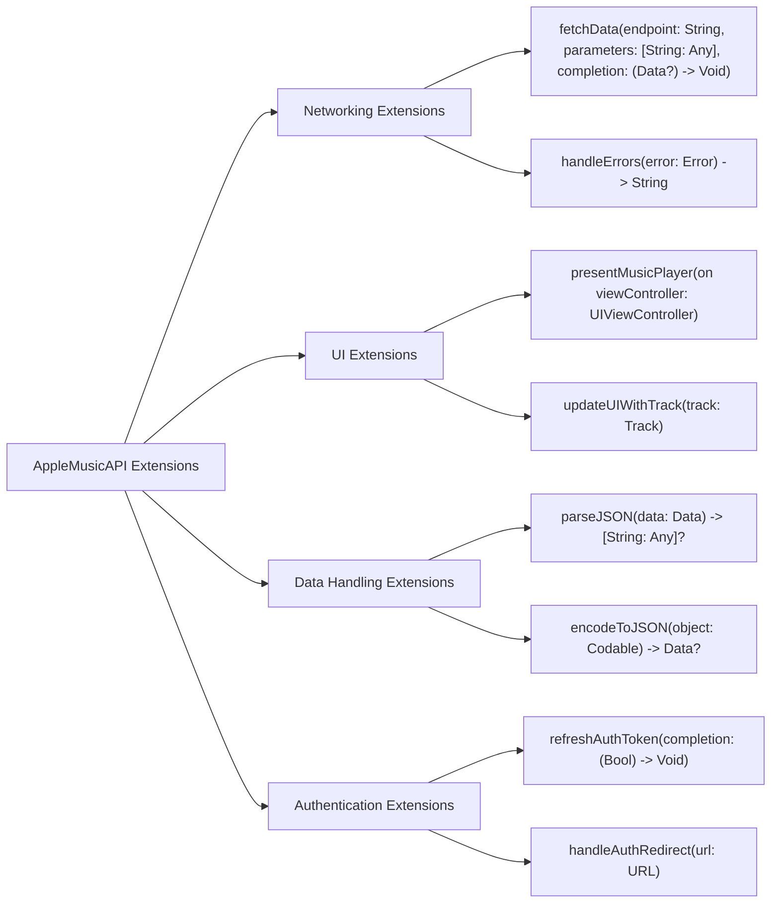

---

## **9. Lifecycle and Use Cases**

### **a. Lifecycle Flowchart**
- **Purpose**: Demonstrate the typical lifecycle of using the Apple Music API within an application.
- **Diagram Type**: `flowchart TD`
- **Contents**:
  - **Initialization**
  - **User Authorization**
  - **Storefront Fetching**
  - **Catalog Access**
  - **Playback Control**
  - **Library Management**
  - **Termination**

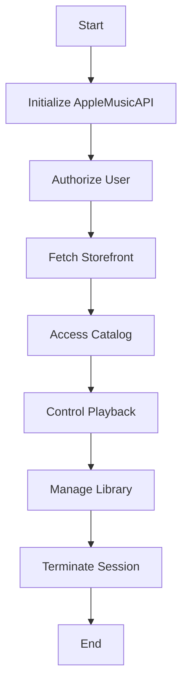

### **b. Common Use Cases Diagram**
- **Purpose**: Outline the typical scenarios where the Apple Music API is utilized.
- **Diagram Type**: `flowchart TD`
- **Contents**:
  - **Music Streaming**
  - **Personal Music Library Management**
  - **Music Discovery & Search**
  - **Playlist Creation & Management**
  - **Social Sharing**
  - **In-App Purchases & Subscriptions**

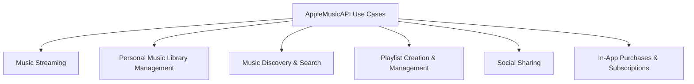

---

## **10. Feature Availability Timeline**

### **a. Feature Availability Gantt Chart**
- **Purpose**: Show when various Apple Music API features were introduced across iOS versions.
- **Diagram Type**: `gantt`
- **Contents**:
  - **iOS Versions**: 8.4, 9.0, 10.0, 11.0, 12.0, 13.0, 15.0, 16.0, 17.0
  - **Features Introduced**: Basic API, User Authorization, Music Library, Catalog Search, Playback Controls, Cloud Sync, In-App Purchases, Enhanced Recommendations, Live Streaming Support

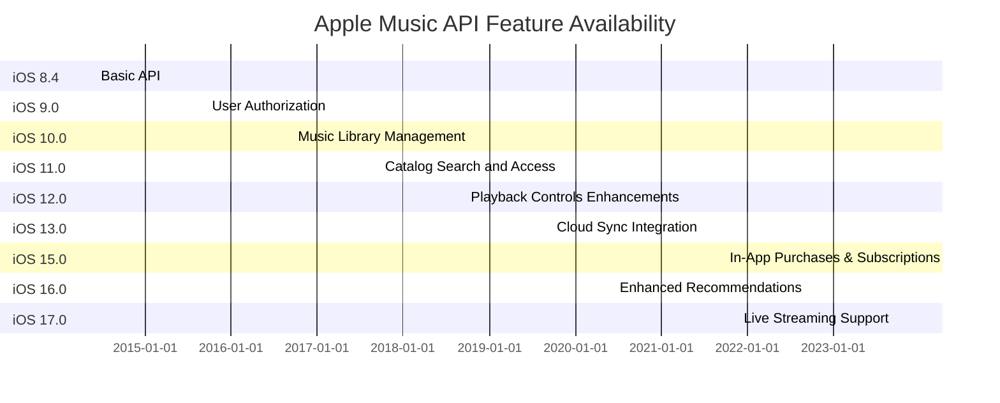

---

## **11. Data Handling and Formats**

### **a. Data Format Handling Diagram**
- **Purpose**: Explain how the Apple Music API handles different data formats.
- **Diagram Type**: `graph LR`
- **Contents**:
  - **JSON Responses**: Parsing and encoding
  - **Audio Formats**: AAC, MP3, ALAC
  - **Image Formats**: JPEG, PNG for album artwork
  - **Metadata Formats**: ID3 tags, EXIF data

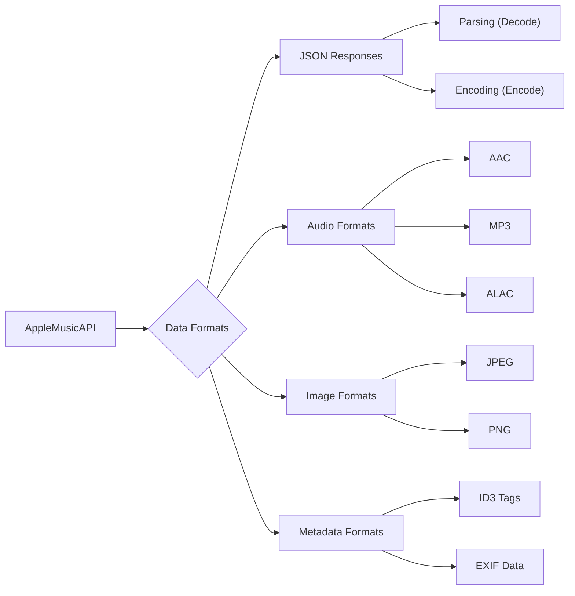

---

## **12. Integration with Other Systems**

### **a. Integration Diagram**
- **Purpose**: Show how the Apple Music API integrates with other iOS frameworks and third-party services.
- **Diagram Type**: `flowchart TD`
- **Contents**:
  - **StoreKit**: For handling purchases and subscriptions
  - **CloudKit**: For syncing user library across devices
  - **MediaPlayer Framework**: For advanced playback controls
  - **CoreData**: For local data storage
  - **Notifications**: For handling playback and library notifications
  - **Third-Party Services**: Analytics, Social Sharing APIs

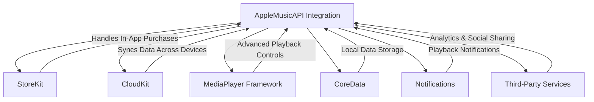

---

## **13. Summary and Best Practices**

### **a. Summary Diagram**
- **Purpose**: Provide a high-level overview of the Apple Music API's key characteristics and functionalities.
- **Diagram Type**: `graph LR`
- **Contents**:
  - **Comprehensive Music Access**
  - **Robust Playback Controls**
  - **Seamless Library Management**
  - **Advanced Search & Recommendations**
  - **Cloud Synchronization**
  - **Secure Authentication**
  - **Extensive Integration Capabilities**
  - **Continuous Feature Enhancements**

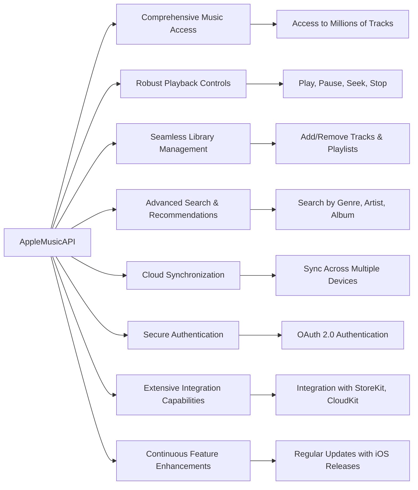

### **b. Best Practices Diagram**
- **Purpose**: Highlight best practices for utilizing the Apple Music API effectively.
- **Diagram Type**: `graph LR`
- **Contents**:
  - **Efficient Data Handling**
  - **Secure Authentication Management**
  - **Optimized Network Requests**
  - **User Privacy Considerations**
  - **Error Handling & Resilience**
  - **Responsive UI Integration**
  - **Regular Updates & Maintenance**
  - **Comprehensive Testing**

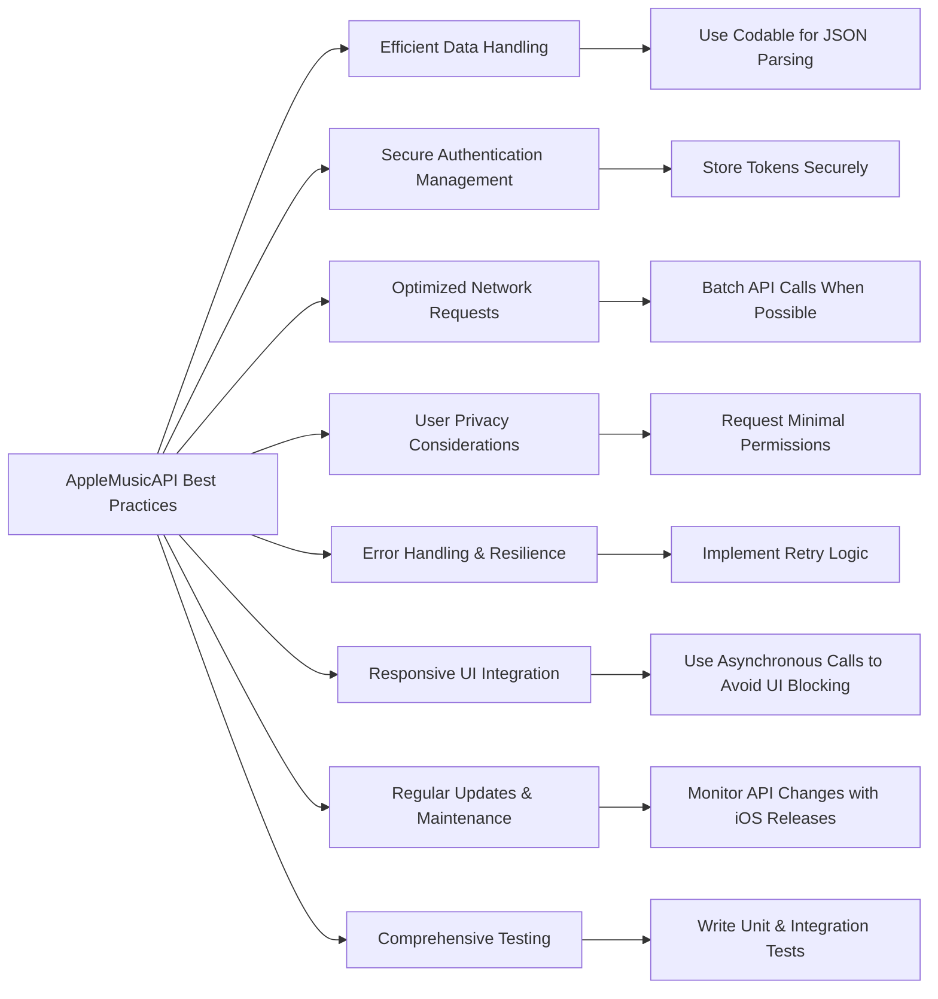

---

## **14. Error Handling and Debugging**

### **a. Error Handling Flowchart**
- **Purpose**: Outline the strategies for managing and debugging errors within the Apple Music API.
- **Diagram Type**: `flowchart TD`
- **Contents**:
  - **Error Detection**: Network errors, Authentication failures, Data parsing errors
  - **Error Logging**: Using logging frameworks
  - **User Notifications**: Informing users about issues
  - **Retry Mechanisms**: Implementing retries for transient errors
  - **Fallback Strategies**: Providing alternative flows when errors occur

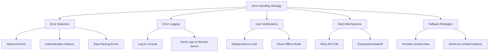

### **b. Debugging Tools Diagram**
- **Purpose**: Highlight the tools and techniques for debugging issues with the Apple Music API.
- **Diagram Type**: `flowchart LR`
- **Contents**:
  - **Xcode Debugger**: Stepping through code, inspecting variables
  - **Console Logs**: Using print statements and logging frameworks
  - **Network Debugging**: Charles Proxy, Wireshark
  - **Crash Reporting**: Firebase Crashlytics, Sentry
  - **Instruments**: Profiling network and performance issues

```mermaid
flowchart LR
    A[Debugging Tools] --> B[Xcode Debugger]
    A --> C[Console Logs]
    A --> D[Network Debugging]
    A --> E[Crash Reporting]
    A --> F[Instruments]

    B --> B1["Step Through Code"]
    B --> B2["Inspect Variables"]

    C --> C1["Print Statements"]
    C --> C2["Logging Frameworks"]

    D --> D1["Charles Proxy"]
    D --> D2["Wireshark"]

    E --> E1["Firebase Crashlytics"]
    E --> E2["Sentry"]

    F --> F1["Network Profiling"]
    F --> F2["Performance Profiling"]
```

---

## **15. Security Considerations**

### **a. Security Best Practices Diagram**
- **Purpose**: Outline the best practices for ensuring security when using the Apple Music API.
- **Diagram Type**: `graph LR`
- **Contents**:
  - **Secure Storage of Credentials**
  - **Use HTTPS for Network Requests**
  - **Implement OAuth 2.0 Correctly**
  - **Validate API Responses**
  - **Handle Sensitive Data Safely**
  - **Regularly Update Dependencies**

```mermaid
graph LR
    A[Security Best Practices] --> B[Secure Storage of Credentials]
    A --> C[Use HTTPS for Network Requests]
    A --> D[Implement OAuth 2.0 Correctly]
    A --> E[Validate API Responses]
    A --> F[Handle Sensitive Data Safely]
    A --> G[Regularly Update Dependencies]

    B --> B1["Use Keychain for Tokens"]
    C --> C1["Ensure All Endpoints Use HTTPS"]
    D --> D1["Follow OAuth 2.0 Standards"]
    E --> E1["Check Response Status Codes"]
    F --> F1["Encrypt Sensitive Data"]
    G --> G1["Monitor for Vulnerabilities"]
```

### **b. Authentication Flowchart**
- **Purpose**: Visualize the authentication flow using OAuth 2.0 within the Apple Music API.
- **Diagram Type**: `flowchart TD`
- **Contents**:
  - **User Login**
  - **Authorization Request**
  - **Authorization Grant**
  - **Access Token Retrieval**
  - **Token Storage**
  - **Access Protected Resources**

```mermaid
flowchart TD
    A[User Login] --> B[Authorization Request]
    B --> C[User Grants Permission]
    C --> D[Authorization Grant]
    D --> E[Access Token Retrieval]
    E --> F[Token Storage]
    F --> G[Access Protected Resources]
    G --> H[Use Access Token in API Calls]
```

---

## **16. Performance Optimization**

### **a. Performance Best Practices Diagram**
- **Purpose**: Highlight strategies for optimizing performance when using the Apple Music API.
- **Diagram Type**: `graph LR`
- **Contents**:
  - **Asynchronous Operations**
  - **Caching Responses**
  - **Efficient Data Parsing**
  - **Optimizing Network Requests**
  - **Lazy Loading of Data**
  - **Minimizing UI Blocking**

```mermaid
graph LR
    A[Performance Optimization] --> B[Asynchronous Operations]
    A --> C[Caching Responses]
    A --> D[Efficient Data Parsing]
    A --> E[Optimizing Network Requests]
    A --> F[Lazy Loading of Data]
    A --> G[Minimizing UI Blocking]

    B --> B1["Use Async/Await"]
    B --> B2["Dispatch Queues"]

    C --> C1["Implement Response Caching"]
    C --> C2["Use Memory/ Disk Cache"]

    D --> D1["Use Codable for Parsing"]
    D --> D2["Avoid Redundant Parsing"]

    E --> E1["Batch API Calls"]
    E --> E2["Use Pagination"]

    F --> F1["Load Data on Demand"]
    F --> F2["Display Placeholders"]

    G --> G1["Perform Heavy Tasks Off Main Thread"]
    G --> G2["Optimize UI Updates"]
```

### **b. Instruments Profiling Diagram**
- **Purpose**: Show how to use Instruments to profile and optimize Apple Music API usage.
- **Diagram Type**: `flowchart LR`
- **Contents**:
  - **Time Profiler**: Identify slow methods
  - **Allocations**: Monitor memory usage
  - **Network**: Analyze network performance
  - **Leaks**: Detect memory leaks
  - **Energy Impact**: Optimize for battery usage

```mermaid
flowchart LR
    A[Instruments Profiling] --> B[Time Profiler]
    A --> C[Allocations]
    A --> D[Network]
    A --> E[Leaks]
    A --> F[Energy Impact]

    B --> B1["Identify Slow Methods"]
    C --> C1["Monitor Memory Usage"]
    D --> D1["Analyze Network Performance"]
    E --> E1["Detect Memory Leaks"]
    F --> F1["Optimize Battery Usage"]
```

---

## **17. Testing Strategies**

### **a. Testing Frameworks Diagram**
- **Purpose**: Outline the frameworks and methodologies for testing the Apple Music API integration.
- **Diagram Type**: `flowchart TD`
- **Contents**:
  - **Unit Testing**: XCTest
  - **Integration Testing**: Combine API calls in test environments
  - **UI Testing**: XCTest UI
  - **Mocking & Stubbing**: Using Mocking frameworks
  - **Continuous Integration**: Integrate with CI/CD pipelines

```mermaid
flowchart TD
    A[Testing Strategies] --> B[Unit Testing]
    A --> C[Integration Testing]
    A --> D[UI Testing]
    A --> E[Mocking & Stubbing]
    A --> F[Continuous Integration]

    B --> B1["Use XCTest"]
    C --> C1["Test API Call Sequences"]
    D --> D1["Use XCTest UI"]
    E --> E1["Use Mocking Frameworks"]
    F --> F1["Integrate with CI/CD Tools"]
```

### **b. Example Test Case Diagram**
- **Purpose**: Provide an example of a test case structure for the Apple Music API.
- **Diagram Type**: `graph TD`
- **Contents**:
  - **Test Setup**
  - **Execution**
  - **Verification**
  - **Teardown**

```mermaid
graph TD
    A[Example Test Case] --> B[Test Setup]
    A --> C[Test Execution]
    A --> D[Test Verification]
    A --> E[Test Teardown]

    B --> B1["Initialize AppleMusicAPI with Mock Data"]
    C --> C1["Call fetchCatalogSearch(query:)"]
    D --> D1["Assert Results Match Expected Output"]
    E --> E1["Clean Up Mock Data"]
```

---

## **18. Internationalization and Localization**

### **a. Localization Best Practices Diagram**
- **Purpose**: Outline strategies for making the Apple Music API integration support multiple languages and regions.
- **Diagram Type**: `graph LR`
- **Contents**:
  - **Localized Content Fetching**
  - **Handling Regional Storefronts**
  - **Date and Currency Formatting**
  - **Right-to-Left Language Support**
  - **Localization of UI Elements**

```mermaid
graph LR
    A[Internationalization & Localization] --> B[Localized Content Fetching]
    A --> C[Handling Regional Storefronts]
    A --> D[Date and Currency Formatting]
    A --> E[Right-to-Left Language Support]
    A --> F[Localization of UI Elements]

    B --> B1["Fetch Content Based on User Language"]
    C --> C1["Update Storefront Region Accordingly"]
    D --> D1["Use Locale-aware Formatting"]
    E --> E1["Ensure UI Support for RTL Languages"]
    F --> F1["Localize Strings and UI Components"]
```

### **b. Storefront Region Handling Diagram**
- **Purpose**: Show how to handle different storefront regions within the Apple Music API.
- **Diagram Type**: `flowchart LR`
- **Contents**:
  - **Identify User Region**
  - **Fetch Storefront Data**
  - **Adjust API Calls Based on Region**
  - **Handle Regional Content Restrictions**

```mermaid
flowchart LR
    A[Storefront Region Handling] --> B[Identify User Region]
    A --> C[Fetch Storefront Data]
    A --> D[Adjust API Calls Based on Region]
    A --> E[Handle Regional Content Restrictions]

    B --> B1["Use Device Locale Settings"]
    C --> C1["Call fetchStorefront(completion:)"]
    D --> D1["Modify Search Queries"]
    E --> E1["Filter Content Based on Restrictions"]
```

---

## **19. Accessibility Features**

### **a. Accessibility Best Practices Diagram**
- **Purpose**: Highlight strategies for making the Apple Music API integration accessible to all users.
- **Diagram Type**: `graph LR`
- **Contents**:
  - **VoiceOver Support**
  - **Dynamic Type**
  - **Accessible Controls**
  - **Color Contrast**
  - **Haptic Feedback Integration**

```mermaid
graph LR
    A[Accessibility Best Practices] --> B[VoiceOver Support]
    A --> C[Dynamic Type]
    A --> D[Accessible Controls]
    A --> E[Color Contrast]
    A --> F[Haptic Feedback Integration]

    B --> B1["Provide Descriptive Labels"]
    C --> C1["Support Font Size Adjustments"]
    D --> D1["Ensure All Controls are Accessible"]
    E --> E1["Maintain High Color Contrast"]
    F --> F1["Use Haptic Feedback for Interactions"]
```

### **b. Accessibility Testing Diagram**
- **Purpose**: Outline the methods for testing accessibility features within the Apple Music API integration.
- **Diagram Type**: `flowchart LR`
- **Contents**:
  - **VoiceOver Testing**
  - **Dynamic Type Testing**
  - **UI Automation for Accessibility**
  - **Color Contrast Analysis**
  - **User Feedback Collection**

```mermaid
flowchart LR
    A[Accessibility Testing] --> B[VoiceOver Testing]
    A --> C[Dynamic Type Testing]
    A --> D[UI Automation for Accessibility]
    A --> E[Color Contrast Analysis]
    A --> F[User Feedback Collection]

    B --> B1["Navigate App Using VoiceOver"]
    C --> C1["Adjust Font Sizes and Verify UI"]
    D --> D1["Automate Accessibility Checks"]
    E --> E1["Use Tools for Color Contrast"]
    F --> F1["Gather Feedback from Users with Disabilities"]
```

---

## **20. Documentation and Developer Guides**

### **a. Documentation Structure Diagram**
- **Purpose**: Outline the structure of comprehensive documentation and developer guides for the Apple Music API.
- **Diagram Type**: `flowchart TD`
- **Contents**:
  - **Getting Started**
  - **API Reference**
  - **Tutorials**
  - **Sample Projects**
  - **FAQ**
  - **Support Resources**

```mermaid
flowchart TD
    A[Documentation Structure] --> B[Getting Started]
    A --> C[API Reference]
    A --> D[Tutorials]
    A --> E[Sample Projects]
    A --> F[FAQ]
    A --> G[Support Resources]

    B --> B1["Setup and Initialization"]
    B --> B2["User Authorization Steps"]

    C --> C1["Class Descriptions"]
    C --> C2["Method Signatures"]

    D --> D1["Implementing Playback"]
    D --> D2["Managing Music Library"]

    E --> E1["Example App Integrations"]

    F --> F1["Common Issues & Solutions"]

    G --> G1["Developer Forums"]
    G --> G2["Contact Support"]
```

### **b. Sample Code Snippets Diagram**
- **Purpose**: Provide examples of how to use the Apple Music API in different scenarios.
- **Diagram Type**: `flowchart LR`
- **Contents**:
  - **Initialization Example**
  - **Playing a Track Example**
  - **Searching the Catalog Example**
  - **Managing the Library Example**
  - **Handling Errors Example**

```mermaid
flowchart LR
    A[Sample Code Snippets] --> B[Initialization Example]
    A --> C[Playing a Track Example]
    A --> D[Searching the Catalog Example]
    A --> E[Managing the Library Example]
    A --> F[Handling Errors Example]

    B --> B1["Initialize AppleMusicAPI with API Key"]
    C --> C1["Play a Selected Track"]
    D --> D1["Search for Songs by Artist"]
    E --> E1["Add a Track to Library"]
    F --> F1["Handle Network Error Responses"]
```

---

## **21. Performance Metrics and Monitoring**

### **a. Performance Metrics Diagram**
- **Purpose**: Identify key performance metrics to monitor when using the Apple Music API.
- **Diagram Type**: `graph LR`
- **Contents**:
  - **API Response Time**
  - **Playback Latency**
  - **Memory Usage**
  - **Network Throughput**
  - **Error Rates**
  - **Battery Consumption**

```mermaid
graph LR
    A[Performance Metrics] --> B[API Response Time]
    A --> C[Playback Latency]
    A --> D[Memory Usage]
    A --> E[Network Throughput]
    A --> F[Error Rates]
    A --> G[Battery Consumption]

    B --> B1["Measure Time for API Calls"]
    C --> C1["Latency Between Command and Playback"]
    D --> D1["Monitor App Memory Footprint"]
    E --> E1["Track Data Transfer Rates"]
    F --> F1["Count of API Errors"]
    G --> G1["Assess Battery Impact of Playback"]
```

### **b. Monitoring Tools Diagram**
- **Purpose**: Highlight the tools and services for monitoring the performance of the Apple Music API integration.
- **Diagram Type**: `flowchart LR`
- **Contents**:
  - **Instruments (Xcode)**
  - **Firebase Performance Monitoring**
  - **New Relic**
  - **Custom Dashboards**
  - **Alerts & Notifications**

```mermaid
flowchart LR
    A[Monitoring Tools] --> B["Instruments (Xcode)"]
    A --> C[Firebase Performance Monitoring]
    A --> D[New Relic]
    A --> E[Custom Dashboards]
    A --> F[Alerts & Notifications]

    B --> B1["Profile Time & Memory"]
    C --> C1["Track API Call Performance"]
    D --> D1["Monitor App Health"]
    E --> E1["Create Custom Metrics"]
    F --> F1["Set Up Performance Alerts"]
    
```

---

## **22. Scalability Considerations**

### **a. Scalability Best Practices Diagram**
- **Purpose**: Outline strategies to ensure the Apple Music API integration scales effectively with user growth.
- **Diagram Type**: `graph LR`
- **Contents**:
  - **Efficient Data Management**
  - **Load Balancing**
  - **Asynchronous Processing**
  - **Caching Strategies**
  - **Optimized Network Usage**
  - **Horizontal Scaling**

```mermaid
graph LR
    A[Scalability Considerations] --> B[Efficient Data Management]
    A --> C[Load Balancing]
    A --> D[Asynchronous Processing]
    A --> E[Caching Strategies]
    A --> F[Optimized Network Usage]
    A --> G[Horizontal Scaling]

    B --> B1["Optimize Data Structures"]
    C --> C1["Distribute API Load"]
    D --> D1["Handle Concurrent Requests"]
    E --> E1["Implement CDN Caching"]
    F --> F1["Minimize API Call Overheads"]
    G --> G1["Scale Servers Horizontally"]
```

### **b. Load Testing Diagram**
- **Purpose**: Show how to perform load testing to ensure the Apple Music API can handle high traffic.
- **Diagram Type**: `flowchart LR`
- **Contents**:
  - **Define Load Scenarios**
  - **Use Load Testing Tools**
  - **Monitor Performance Metrics**
  - **Analyze Bottlenecks**
  - **Optimize and Retest**

```mermaid
flowchart LR
    A[Load Testing Process] --> B[Define Load Scenarios]
    A --> C[Use Load Testing Tools]
    A --> D[Monitor Performance Metrics]
    A --> E[Analyze Bottlenecks]
    A --> F[Optimize and Retest]

    B --> B1["Simulate User Traffic"]
    C --> C1["Use Tools like Apache JMeter"]
    D --> D1["Track Response Times"]
    D --> D2["Monitor Server Health"]
    E --> E1["Identify Slow Points"]
    F --> F1["Implement Optimizations"]
    F --> F2["Repeat Tests"]
```

---

## **23. Versioning and Deprecation**

### **a. Versioning Strategy Diagram**
- **Purpose**: Outline the strategy for managing different versions of the Apple Music API.
- **Diagram Type**: `graph LR`
- **Contents**:
  - **Semantic Versioning**
  - **Backward Compatibility**
  - **Deprecation Policies**
  - **Migration Guides**
  - **Release Notes**

```mermaid
graph LR
    A[Versioning Strategy] --> B[Semantic Versioning]
    A --> C[Backward Compatibility]
    A --> D[Deprecation Policies]
    A --> E[Migration Guides]
    A --> F[Release Notes]

    B --> B1["Major.Minor.Patch"]
    C --> C1["Maintain API Stability"]
    D --> D1["Announce Deprecated Features"]
    E --> E1["Provide Step-by-Step Guides"]
    F --> F1["Document Changes and Enhancements"]
```

### **b. Deprecation Flowchart**
- **Purpose**: Visualize the process for deprecating features within the Apple Music API.
- **Diagram Type**: `flowchart TD`
- **Contents**:
  - **Identify Deprecated Feature**
  - **Announce Deprecation**
  - **Provide Alternatives**
  - **Update Documentation**
  - **Phase Out Support**
  - **Remove Feature**

```mermaid
flowchart TD
    A[Deprecation Process] --> B[Identify Deprecated Feature]
    B --> C[Announce Deprecation]
    C --> D[Provide Alternatives]
    D --> E[Update Documentation]
    E --> F[Phase Out Support]
    F --> G[Remove Feature]

    C --> C1["Notify Developers via Email & Documentation"]
    D --> D1["Suggest Replacement APIs"]
    E --> E1["Detail Deprecation Timeline"]
    F --> F1["End Support & Maintenance"]
```

---

## **24. Localization and Internationalization**

### **a. Localization Workflow Diagram**
- **Purpose**: Outline the workflow for implementing localization and internationalization in the Apple Music API integration.
- **Diagram Type**: `flowchart LR`
- **Contents**:
  - **Language Resource Files**
  - **Dynamic Content Localization**
  - **Region-Based Content Adjustments**
  - **Testing Localized Features**
  - **Continuous Localization Updates**

```mermaid
flowchart LR
    A[Localization Workflow] --> B[Language Resource Files]
    A --> C[Dynamic Content Localization]
    A --> D[Region-Based Content Adjustments]
    A --> E[Testing Localized Features]
    A --> F[Continuous Localization Updates]

    B --> B1["Create .strings Files"]
    B --> B2["Localize UI Elements"]

    C --> C1["Localize API Responses"]
    C --> C2["Adjust Content Display"]

    D --> D1["Handle Regional Variations"]
    D --> D2["Update Storefront Settings"]

    E --> E1["Use Automated Testing"]
    E --> E2["Conduct Manual Testing"]

    F --> F1["Integrate with Localization Platforms"]
    F --> F2["Update Translations Regularly"]
```

### **b. Dynamic Content Localization Diagram**
- **Purpose**: Show how dynamic content fetched from the Apple Music API is localized based on user settings.
- **Diagram Type**: `flowchart LR`
- **Contents**:
  - **Fetch Content**
  - **Determine User Locale**
  - **Localize Content Fields**
  - **Display Localized Content**
  - **Fallback to Default Language**

```mermaid
flowchart LR
    A[Dynamic Content Localization] --> B[Fetch Content]
    B --> C[Determine User Locale]
    C --> D[Localize Content Fields]
    D --> E[Display Localized Content]
    E --> F[Fallback to Default Language]

    F --> F1["If Localization Not Available, Use English"]
```

---

## **25. Advanced Features and Extensions**

### **a. Advanced Playback Features Diagram**
- **Purpose**: Highlight advanced playback features supported by the Apple Music API.
- **Diagram Type**: `flowchart TD`
- **Contents**:
  - **Shuffle and Repeat Modes**
  - **Gapless Playback**
  - **Crossfade Transitions**
  - **Offline Playback**
  - **High-Quality Streaming**

```mermaid
flowchart TD
    A[Advanced Playback Features] --> B[Shuffle and Repeat Modes]
    A --> C[Gapless Playback]
    A --> D[Crossfade Transitions]
    A --> E[Offline Playback]
    A --> F[High-Quality Streaming]

    B --> B1["Enable Shuffle"]
    B --> B2["Set Repeat Mode"]

    C --> C1["Seamless Track Transitions"]

    D --> D1["Smooth Audio Transitions"]

    E --> E1["Save Tracks for Offline Listening"]

    F --> F1["Choose Streaming Quality"]
```

### **b. Live Streaming Integration Diagram**
- **Purpose**: Show how to integrate live streaming features using the Apple Music API.
- **Diagram Type**: `flowchart LR`
- **Contents**:
  - **Initialize Live Stream Session**
  - **Handle Live Audio Data**
  - **Manage Stream Controls**
  - **Display Live Stream Information**
  - **Handle Network Interruptions**

```mermaid
flowchart LR
    A[Live Streaming Integration] --> B[Initialize Live Stream Session]
    A --> C[Handle Live Audio Data]
    A --> D[Manage Stream Controls]
    A --> E[Display Live Stream Information]
    A --> F[Handle Network Interruptions]

    B --> B1["Set Up Stream URL"]
    B --> B2["Configure Streaming Parameters"]

    C --> C1["Process Incoming Audio Data"]
    C --> C2["Buffer Management"]

    D --> D1["Play/Pause Live Stream"]
    D --> D2["Adjust Volume"]

    E --> E1["Display Now Playing Info"]
    E --> E2["Show Stream Status"]

    F --> F1["Implement Retry Logic"]
    F --> F2["Notify Users of Issues"]
```

---

## **26. Analytics and Metrics**

### **a. Analytics Integration Diagram**
- **Purpose**: Outline how to integrate analytics to track usage and performance of the Apple Music API.
- **Diagram Type**: `flowchart TD`
- **Contents**:
  - **User Engagement Metrics**
  - **Playback Statistics**
  - **Library Usage Data**
  - **Revenue Tracking**
  - **Error and Crash Analytics**
  - **Custom Event Tracking**

```mermaid
flowchart TD
    A[Analytics Integration] --> B[User Engagement Metrics]
    A --> C[Playback Statistics]
    A --> D[Library Usage Data]
    A --> E[Revenue Tracking]
    A --> F[Error and Crash Analytics]
    A --> G[Custom Event Tracking]

    B --> B1["Active Users"]
    B --> B2["Session Duration"]

    C --> C1["Tracks Played"]
    C --> C2["Playback Duration"]

    D --> D1["Added Tracks"]
    D --> D2["Created Playlists"]

    E --> E1["In-App Purchases"]
    E --> E2["Subscription Renewals"]

    F --> F1["Crash Reports"]
    F --> F2["Error Logs"]

    G --> G1["Custom User Actions"]
```

### **b. Tracking Important Events Diagram**
- **Purpose**: Identify the key events to track for meaningful analytics.
- **Diagram Type**: `flowchart LR`
- **Contents**:
  - **Track Playback Start**
  - **Track Playback Completion**
  - **Add to Library**
  - **Remove from Library**
  - **Search Queries**
  - **Purchase Actions**
  - **Error Occurrences**

```mermaid
flowchart LR
    A[Important Events to Track] --> B[Track Playback Start]
    A --> C[Track Playback Completion]
    A --> D[Add to Library]
    A --> E[Remove from Library]
    A --> F[Search Queries]
    A --> G[Purchase Actions]
    A --> H[Error Occurrences]

    B --> B1["Log When Track Starts Playing"]
    C --> C1["Log When Track Finishes Playing"]
    D --> D1["Log When User Adds a Track"]
    E --> E1["Log When User Removes a Track"]
    F --> F1["Log User Search Inputs"]
    G --> G1["Log In-App Purchases"]
    H --> H1["Log Errors and Exceptions"]
```

---

## **27. User Interface Design Considerations**

### **a. UI Components Integration Diagram**
- **Purpose**: Show how to integrate Apple Music API functionalities with various UI components.
- **Diagram Type**: `flowchart TD`
- **Contents**:
  - **Music Player UI**: Play, Pause, Next, Previous buttons
  - **Search Bar**: For catalog searches
  - **Library Views**: Displaying user library content
  - **Playlist Management UI**: Creating and editing playlists
  - **Now Playing Screen**: Display current track info and controls

```mermaid
flowchart TD
    A[UI Components Integration] --> B[Music Player UI]
    A --> C[Search Bar]
    A --> D[Library Views]
    A --> E[Playlist Management UI]
    A --> F[Now Playing Screen]

    B --> B1["Play Button"]
    B --> B2["Pause Button"]
    B --> B3["Next/Previous Buttons"]

    C --> C1["Search Input Field"]
    C --> C2["Search Suggestions"]

    D --> D1["Track List"]
    D --> D2["Album Grid"]

    E --> E1["Create Playlist"]
    E --> E2["Edit Playlist"]

    F --> F1["Track Information"]
    F --> F2["Playback Controls"]
    F --> F3["Album Artwork"]
```

### **b. Responsive UI Design Diagram**
- **Purpose**: Highlight strategies for ensuring the UI remains responsive while interacting with the Apple Music API.
- **Diagram Type**: `graph LR`
- **Contents**:
  - **Asynchronous Data Fetching**
  - **Loading Indicators**
  - **Background Processing**
  - **Optimized UI Updates**
  - **Debouncing User Inputs**

```mermaid
graph LR
    A[Responsive UI Design] --> B[Asynchronous Data Fetching]
    A --> C[Loading Indicators]
    A --> D[Background Processing]
    A --> E[Optimized UI Updates]
    A --> F[Debouncing User Inputs]

    B --> B1["Use async/await for API Calls"]
    C --> C1["Show Activity Indicators"]
    D --> D1["Perform Data Parsing in Background"]
    E --> E1["Update UI on Main Thread"]
    F --> F1["Delay Search Queries Until User Stops Typing"]
```

---

## **28. Resource Management**

### **a. Resource Optimization Diagram**
- **Purpose**: Outline strategies for managing and optimizing resources when using the Apple Music API.
- **Diagram Type**: `graph LR`
- **Contents**:
  - **Memory Management**
  - **Network Resource Optimization**
  - **Efficient Storage Usage**
  - **Battery Consumption Management**
  - **Thread Management**

```mermaid
graph LR
    A[Resource Optimization] --> B[Memory Management]
    A --> C[Network Resource Optimization]
    A --> D[Efficient Storage Usage]
    A --> E[Battery Consumption Management]
    A --> F[Thread Management]

    B --> B1["Use Weak References"]
    B --> B2["Avoid Memory Leaks"]

    C --> C1["Compress Data"]
    C --> C2["Minimize API Calls"]

    D --> D1["Use Efficient Data Structures"]
    D --> D2["Implement Data Caching"]

    E --> E1["Optimize Playback Settings"]
    E --> E2["Manage Background Tasks"]

    F --> F1["Use Dispatch Queues Appropriately"]
    F --> F2["Avoid Main Thread Blocking"]
```

### **b. Lazy Loading Resources Diagram**
- **Purpose**: Show how to implement lazy loading for resources fetched via the Apple Music API.
- **Diagram Type**: `flowchart LR`
- **Contents**:
  - **Identify Resources for Lazy Loading**
  - **Implement Lazy Loading Logic**
  - **Cache Loaded Resources**
  - **Handle Resource Availability**
  - **Update UI Upon Resource Load**

```mermaid
flowchart LR
    A[Lazy Loading Implementation] --> B[Identify Resources for Lazy Loading]
    A --> C[Implement Lazy Loading Logic]
    A --> D[Cache Loaded Resources]
    A --> E[Handle Resource Availability]
    A --> F[Update UI Upon Resource Load]

    B --> B1["High-resolution Album Art"]
    B --> B2["Detailed Track Information"]

    C --> C1["Load on Demand"]
    C --> C2["Use Placeholder Content"]

    D --> D1["Implement In-Memory Cache"]
    D --> D2["Use Disk Cache for Persistent Storage"]

    E --> E1["Gracefully Handle Missing Resources"]
    E --> E2["Provide Fallback Options"]

    F --> F1["Refresh UI Components"]
    F --> F2["Notify Users of Loaded Content"]
```

---

## **29. Cross-Platform Compatibility**

### **a. Cross-Platform Integration Diagram**
- **Purpose**: Highlight considerations for integrating the Apple Music API across different Apple platforms (iOS, macOS, watchOS, tvOS).
- **Diagram Type**: `flowchart TD`
- **Contents**:
  - **iOS Integration**
  - **macOS Integration**
  - **watchOS Integration**
  - **tvOS Integration**
  - **Shared Codebase Strategies**
  - **Platform-Specific UI Adjustments**

```mermaid
flowchart TD
    A[Cross-Platform Integration] --> B[iOS Integration]
    A --> C[macOS Integration]
    A --> D[watchOS Integration]
    A --> E[tvOS Integration]
    A --> F[Shared Codebase Strategies]
    A --> G[Platform-Specific UI Adjustments]

    B --> B1["Use UIKit for UI Components"]
    C --> C1["Use AppKit for UI Components"]
    D --> D1["Use WatchKit for UI Components"]
    E --> E1["Use TVUIKit for UI Components"]

    F --> F1["Use SwiftUI for Shared UI Code"]
    F --> F2["Modularize Business Logic"]

    G --> G1["Adjust Layouts for Screen Sizes"]
    G --> G2["Handle Platform-Specific Features"]
```

### **b. SwiftUI Shared Views Diagram**
- **Purpose**: Show how to use SwiftUI to create shared views for different platforms when integrating the Apple Music API.
- **Diagram Type**: `flowchart LR`
- **Contents**:
  - **Shared View Models**
  - **Platform-Specific Modifiers**
  - **Reusable UI Components**
  - **Conditional Rendering**
  - **Adaptive Layouts**

```mermaid
flowchart LR
    A[SwiftUI Shared Views] --> B[Shared View Models]
    A --> C[Platform-Specific Modifiers]
    A --> D[Reusable UI Components]
    A --> E[Conditional Rendering]
    A --> F[Adaptive Layouts]

    B --> B1["ObservableObject for State Management"]

    C --> C1[".padding() Adjustments"]
    C --> C2[".font() Customizations"]

    D --> D1["Custom Buttons"]
    D --> D2["Track List Views"]

    E --> E1["if #available(iOS 14, *) { ... }"]

    F --> F1["Use GeometryReader for Layouts"]
    F --> F2["Responsive Design Techniques"]
```

---

## **30. Future Enhancements and Roadmap**

### **a. Future Features Roadmap Diagram**
- **Purpose**: Outline planned future enhancements and features for the Apple Music API.
- **Diagram Type**: `gantt`
- **Contents**:
  - **Enhanced Recommendations**
  - **Social Sharing Features**
  - **Improved Offline Support**
  - **Integration with AR/VR**
  - **Advanced Analytics**
  - **Expanded Regional Support**

```mermaid
gantt
    dateFormat  YYYY-MM-DD
    title Apple Music API Future Features Roadmap

    section Q1 2024
    Enhanced Recommendations       :active, des1, 2024-01-15, 90d
    Social Sharing Features        :des2, after des1, 60d

    section Q3 2024
    Improved Offline Support       :des3, 2024-07-01, 120d
    Integration with AR/VR         :des4, after des3, 150d

    section Q1 2025
    Advanced Analytics             :des5, 2025-01-01, 90d
    Expanded Regional Support      :des6, after des5, 60d
```

### **b. Feedback and Iteration Diagram**
- **Purpose**: Show the process for collecting feedback and iterating on the Apple Music API features.
- **Diagram Type**: `flowchart TD`
- **Contents**:
  - **Collect User Feedback**
  - **Analyze Feedback**
  - **Plan Feature Updates**
  - **Implement Changes**
  - **Release Updates**
  - **Repeat Process**

```mermaid
flowchart TD
    A[Feedback and Iteration] --> B[Collect User Feedback]
    A --> C[Analyze Feedback]
    A --> D[Plan Feature Updates]
    A --> E[Implement Changes]
    A --> F[Release Updates]
    A --> G[Repeat Process]

    B --> B1["Surveys & Interviews"]
    B --> B2["App Reviews & Ratings"]

    C --> C1["Identify Common Requests"]
    C --> C2["Prioritize Features"]

    D --> D1["Define Feature Specifications"]
    D --> D2["Allocate Resources"]

    E --> E1["Develop Features"]
    E --> E2["Test Implementations"]

    F --> F1["Deploy to App Stores"]
    F --> F2["Update Documentation"]

    G --> G1["Cycle Continues"]
```

---

## **31. Compliance and Legal Considerations**

### **a. Compliance Checklist Diagram**
- **Purpose**: Provide a checklist for ensuring compliance when using the Apple Music API.
- **Diagram Type**: `flowchart LR`
- **Contents**:
  - **App Store Guidelines**
  - **User Privacy Laws (e.g., GDPR)**
  - **Intellectual Property Rights**
  - **Data Protection Measures**
  - **Licensing Agreements**
  - **Accessibility Requirements**

```mermaid
flowchart LR
    A[Compliance Checklist] --> B[App Store Guidelines]
    A --> C["User Privacy Laws (GDPR)"]
    A --> D[Intellectual Property Rights]
    A --> E[Data Protection Measures]
    A --> F[Licensing Agreements]
    A --> G[Accessibility Requirements]

    B --> B1["Follow Apple's Submission Rules"]
    C --> C1["Obtain User Consent"]
    D --> D1["Respect Music Licensing"]
    E --> E1["Encrypt Sensitive Data"]
    F --> F1["Adhere to License Terms"]
    G --> G1["Ensure Accessible UI"]
    
```

### **b. Privacy Policy Diagram**
- **Purpose**: Show the components of a privacy policy tailored for apps using the Apple Music API.
- **Diagram Type**: `flowchart LR`
- **Contents**:
  - **Data Collection**
  - **Data Usage**
  - **Data Sharing**
  - **User Rights**
  - **Security Measures**
  - **Contact Information**

```mermaid
flowchart LR
    A[Privacy Policy] --> B[Data Collection]
    A --> C[Data Usage]
    A --> D[Data Sharing]
    A --> E[User Rights]
    A --> F[Security Measures]
    A --> G[Contact Information]

    B --> B1["Collected Data Types"]
    C --> C1["How Data is Used"]
    D --> D1["Third-Party Data Sharing"]
    E --> E1["Access and Correction Rights"]
    F --> F1["Data Encryption Practices"]
    G --> G1["Support Contact Details"]
```

---

## **32. Accessibility Features**

### **a. VoiceOver Integration Diagram**
- **Purpose**: Show how to integrate VoiceOver support within the Apple Music API-powered application.
- **Diagram Type**: `flowchart LR`
- **Contents**:
  - **Accessible Labels**
  - **Hint Texts**
  - **Trait Modifications**
  - **Testing with VoiceOver**

```mermaid
flowchart LR
    A[VoiceOver Integration] --> B[Accessible Labels]
    A --> C[Hint Texts]
    A --> D[Trait Modifications]
    A --> E[Testing with VoiceOver]

    B --> B1["Provide Descriptive Labels for UI Elements"]
    C --> C1["Add Hints for Interactive Elements"]
    D --> D1["Set Correct Traits (e.g., Button, Image)"]
    E --> E1["Use VoiceOver to Navigate and Test UI"]
```

### **b. Dynamic Type Support Diagram**
- **Purpose**: Outline how to support Dynamic Type in the Apple Music API integration.
- **Diagram Type**: `flowchart LR`
- **Contents**:
  - **Use Scalable Fonts**
  - **Adjust Layouts for Font Size Changes**
  - **Test with Different Font Sizes**
  - **Ensure Readability**

```mermaid
flowchart LR
    A[Dynamic Type Support] --> B[Use Scalable Fonts]
    A --> C[Adjust Layouts for Font Size Changes]
    A --> D[Test with Different Font Sizes]
    A --> E[Ensure Readability]

    B --> B1["Use UIFont.preferredFont"]
    C --> C1["Implement Auto Layout Constraints"]
    D --> D1["Test in Accessibility Inspector"]
    E --> E1["Verify Text is Legible at All Sizes"]
```

---

## **33. Continuous Improvement and Updates**

### **a. Continuous Improvement Diagram**
- **Purpose**: Show the process for continuously improving and updating the Apple Music API integration.
- **Diagram Type**: `flowchart TD`
- **Contents**:
  - **Monitor Usage Metrics**
  - **Collect User Feedback**
  - **Identify Improvement Areas**
  - **Implement Enhancements**
  - **Deploy Updates**
  - **Measure Impact**

```mermaid
flowchart TD
    A[Continuous Improvement Process] --> B[Monitor Usage Metrics]
    A --> C[Collect User Feedback]
    A --> D[Identify Improvement Areas]
    A --> E[Implement Enhancements]
    A --> F[Deploy Updates]
    A --> G[Measure Impact]

    B --> B1["Analyze Playback Statistics"]
    C --> C1["Gather Feedback from Surveys"]
    D --> D1["Prioritize Feature Requests"]
    E --> E1["Develop New Functionalities"]
    F --> F1["Update App on App Store"]
    G --> G1["Assess User Adoption"]
```

### **b. Update Management Flowchart**
- **Purpose**: Visualize the management of updates to the Apple Music API integration.
- **Diagram Type**: `flowchart LR`
- **Contents**:
  - **Version Control**
  - **Feature Branching**
  - **Code Reviews**
  - **Automated Testing**
  - **Staging Deployment**
  - **Production Deployment**

```mermaid
flowchart LR
    A[Update Management] --> B[Version Control]
    A --> C[Feature Branching]
    A --> D[Code Reviews]
    A --> E[Automated Testing]
    A --> F[Staging Deployment]
    A --> G[Production Deployment]

    B --> B1["Use Git for Versioning"]
    C --> C1["Create Feature Branches for New Features"]
    D --> D1["Conduct Peer Reviews"]
    E --> E1["Run Unit and Integration Tests"]
    F --> F1["Deploy to Staging Environment"]
    G --> G1["Release to Production"]
```

---

## **34. Error Logging and Monitoring**

### **a. Error Logging Flowchart**
- **Purpose**: Outline the process for logging and monitoring errors within the Apple Music API integration.
- **Diagram Type**: `flowchart LR`
- **Contents**:
  - **Capture Errors**
  - **Log Errors**
  - **Analyze Error Patterns**
  - **Notify Developers**
  - **Resolve Issues**
  - **Update Documentation**

```mermaid
flowchart LR
    A[Error Logging Process] --> B[Capture Errors]
    A --> C[Log Errors]
    A --> D[Analyze Error Patterns]
    A --> E[Notify Developers]
    A --> F[Resolve Issues]
    A --> G[Update Documentation]

    B --> B1["Use Try-Catch Blocks"]
    B --> B2["Capture API Call Failures"]

    C --> C1["Log to Local Files"]
    C --> C2["Send to Remote Logging Services"]

    D --> D1["Identify Common Errors"]
    D --> D2["Detect Trends Over Time"]

    E --> E1["Automated Alerts via Email/SMS"]
    E --> E2["Dashboards for Real-Time Monitoring"]

    F --> F1["Debug and Fix Code"]

    G --> G1["Document Known Issues and Resolutions"]
```

### **b. Monitoring Tools Configuration Diagram**
- **Purpose**: Show how to configure monitoring tools for the Apple Music API integration.
- **Diagram Type**: `flowchart LR`
- **Contents**:
  - **Set Up Logging Frameworks**
  - **Integrate with Monitoring Services**
  - **Define Alert Thresholds**
  - **Create Dashboards**
  - **Automate Notifications**

```mermaid
flowchart LR
    A[Monitoring Tools Configuration] --> B[Set Up Logging Frameworks]
    A --> C[Integrate with Monitoring Services]
    A --> D[Define Alert Thresholds]
    A --> E[Create Dashboards]
    A --> F[Automate Notifications]

    B --> B1["Configure Log Levels"]
    B --> B2["Implement Structured Logging"]

    C --> C1["Connect to Services like Sentry"]
    C --> C2["Set Up Data Pipelines"]

    D --> D1["Determine Critical Error Levels"]
    D --> D2["Set Up Rate Limits for Alerts"]

    E --> E1["Design Visual Dashboards"]
    E --> E2["Include Key Metrics and KPIs"]

    F --> F1["Set Up Email/SMS Alerts"]
    F --> F2["Integrate with Slack or Other Tools"]
```

---

## **35. Compliance with Music Licensing**

### **a. Licensing Compliance Diagram**
- **Purpose**: Outline the steps to ensure compliance with music licensing when using the Apple Music API.
- **Diagram Type**: `flowchart LR`
- **Contents**:
  - **Understand Licensing Agreements**
  - **Implement Usage Restrictions**
  - **Monitor Content Access**
  - **Automate License Validation**
  - **Handle Licensing Changes**
  - **Provide Licensing Information to Users**

```mermaid
flowchart LR
    A[Licensing Compliance] --> B[Understand Licensing Agreements]
    A --> C[Implement Usage Restrictions]
    A --> D[Monitor Content Access]
    A --> E[Automate License Validation]
    A --> F[Handle Licensing Changes]
    A --> G[Provide Licensing Information to Users]

    B --> B1["Review Apple Music Licensing Terms"]

    C --> C1["Restrict Unauthorized Downloads"]
    C --> C2["Limit Playback Methods"]

    D --> D1["Track Content Usage Statistics"]

    E --> E1["Automate License Checks Before Playback"]

    F --> F1["Update App Based on Licensing Changes"]

    G --> G1["Display Licensing Terms in App"]
```

### **b. Usage Restriction Enforcement Diagram**
- **Purpose**: Show how to enforce usage restrictions based on licensing within the Apple Music API integration.
- **Diagram Type**: `flowchart LR`
- **Contents**:
  - **Restrict Geographic Access**
  - **Limit Playback Duration**
  - **Prevent Unauthorized Sharing**
  - **Enforce Subscription Status**
  - **Handle Content Restrictions**

```mermaid
flowchart LR
    A[Usage Restriction Enforcement] --> B[Restrict Geographic Access]
    A --> C[Limit Playback Duration]
    A --> D[Prevent Unauthorized Sharing]
    A --> E[Enforce Subscription Status]
    A --> F[Handle Content Restrictions]

    B --> B1["Check User Region with Storefront"]
    C --> C1["Implement Playback Timers"]
    D --> D1["Disable Sharing Features"]
    E --> E1["Verify Active Subscription Before Playback"]
    F --> F1["Filter Content Based on Licensing Agreements"]
```

---