# Apple Wallet
> This content is dual-licensed under your choice of the following licenses:
> 1.  **MIT License:** For the code implementations in Swift and Mermaid provided in this document.
> 2.  **Creative Commons Attribution 4.0 International License (CC BY 4.0):** For all other content, including the text, explanations, and the Mermaid diagrams and illustrations.

---

Below is a comprehensive and organized set of Mermaid diagrams for the `Apple Wallet` framework. These diagrams cover various aspects of the framework, including class hierarchies, initializers, properties, methods, enumerations, protocol conformances, relationships with other classes, extensions, lifecycle, use cases, feature timelines, data handling, integration, and best practices.

---

## **1. Class Structure and Hierarchy**

### **a. Core Class Diagram**
- **Purpose**: Illustrate the primary structure of the `Apple Wallet` framework, focusing on key classes, their properties, methods, and enumerations.
- **Diagram Type**: `classDiagram`
- **Contents**:
  - **Properties**: Key attributes of classes like `PKPass`, `PKPaymentPass`, `PKAddPassesViewController`, etc.
  - **Methods**: Essential functions such as initializers, add/remove pass methods, etc.
  - **Enumerations**: Nested enums like `PKPassType`, `PKAddPassesViewControllerError`, etc.


---

## **2. Initializers Overview**

### **a. Initialization Methods Diagram**
- **Purpose**: Break down the various ways to instantiate classes within the `Apple Wallet` framework.
- **Diagram Type**: `flowchart LR`
- **Contents**:
  - **Data-Based Initializers**: `init(data:)`, `init(contentsOfURL:)`
  - **View Controller Initializers**: `init(pass:)`
  - **Library Initializers**: Default initializer for `PKPassLibrary`
  - **Subclass Initializers**: Specific initializers for subclasses like `PKPaymentPass`


---

## **3. Properties Breakdown**

### **a. Key Properties Diagram**
- **Purpose**: Detail the main properties of key classes within the `Apple Wallet` framework.
- **Diagram Type**: `graph LR`
- **Contents**:
  - **PKPass Properties**: `passTypeIdentifier`, `serialNumber`, `expirationDate`, etc.
  - **PKPaymentPass Properties**: `primaryAccountIdentifier`, `isExpired`, etc.
  - **PKAddPassesViewController Properties**: `pass`, `canAddPasses`
  - **PKPassLibrary Properties**: `passes`


---

## **4. Methods Grouped by Functionality**

### **a. Pass Management Methods**
- **Purpose**: Categorize methods based on their roles in managing passes within the Wallet.
- **Diagram Type**: `flowchart TD`
- **Contents**:
  - **Adding Passes**: `addPasses(_:withCompletionHandler:)`
  - **Removing Passes**: `removePass(_:)`
  - **Replacing Passes**: `replacePass(with:withNewPass:)`
  - **Checking Passes**: `containsPass(_:)`
  - **Retrieving Passes**: `passes`


---

## **5. Enumerations and Configurations**

### **a. Enumerations Diagram**
- **Purpose**: Highlight the enums used within the `Apple Wallet` framework and their possible values.
- **Diagram Type**: `classDiagram`
- **Contents**:
  - **PKPassType**
  - **PKAddPassesViewControllerError**


### **b. Configuration Classes Diagram**
- **Purpose**: Show the relationship between `Apple Wallet` classes and their configuration classes.
- **Diagram Type**: `classDiagram`
- **Contents**:
  - **PKPassLibraryConfiguration**


---

## **6. Protocol Conformances**

### **a. Protocols Diagram**
- **Purpose**: Display the protocols that key classes in the `Apple Wallet` framework conform to and their impact.
- **Diagram Type**: `classDiagram`
- **Contents**:
  - **NSSecureCoding**
  - **NSCopying**
  - **Codable**
  - **DisplayPassDelegate**
  - **Sendable**


---

## **7. Relationships with Other Classes**

### **a. Related Classes Diagram**
- **Purpose**: Illustrate how `Apple Wallet` interacts with other UIKit classes and frameworks.
- **Diagram Type**: `flowchart TD`
- **Contents**:
  - **UIViewController**: Hosts `PKAddPassesViewController`.
  - **URL**: Used for pass data sources.
  - **NSNotificationCenter**: Observes pass updates.
  - **Bundle**: Manages pass resources.
  - **Data**: Handles pass data input.
  - **Error Handling**: Manages errors during pass operations.


---

## **8. Extensions and Additional Functionalities**

### **a. UIKit Extensions for Apple Wallet Diagram**
- **Purpose**: Showcase the additional functionalities provided through extensions in UIKit for integrating with `Apple Wallet`.
- **Diagram Type**: `classDiagram`
- **Contents**:
  - **UIViewController Extensions**
  - **UIView Extensions**
  - **Error Handling Extensions**


### **b. Extensions Functionalities Flowchart**
- **Purpose**: Detail specific extended methods and their purposes for integrating `Apple Wallet` functionalities.
- **Diagram Type**: `flowchart LR`
- **Contents**:
  - **Presenting Add Passes Controller**
  - **Adding Pass Button**
  - **Handling Wallet Errors**


---

## **9. Lifecycle and Use Cases**

### **a. Lifecycle Flowchart**
- **Purpose**: Demonstrate the typical lifecycle of a pass within an application using the `Apple Wallet` framework.
- **Diagram Type**: `flowchart TD`
- **Contents**:
  - **Pass Creation**
  - **Adding to Wallet**
  - **Displaying Pass**
  - **Updating Pass**
  - **Removing Pass**


### **b. Common Use Cases Diagram**
- **Purpose**: Outline the typical scenarios where the `Apple Wallet` framework is utilized.
- **Diagram Type**: `flowchart TD`
- **Contents**:
  - **Storing Boarding Passes**
  - **Managing Event Tickets**
  - **Handling Loyalty Cards**
  - **Processing Payment Passes**
  - **Distributing Coupons**
  - **Offering Store Cards**


---

## **10. Feature Availability Timeline**

### **a. Feature Availability Gantt Chart**
- **Purpose**: Show when various `Apple Wallet` features were introduced across iOS versions.
- **Diagram Type**: `gantt`
- **Contents**:
  - **iOS Versions**: 6.0, 7.0, 8.0, 9.0, 10.0, 11.0, 12.0, 13.0, 14.0, 15.0, 16.0, 17.0
  - **Features Introduced**: PassKit enhancements, Wallet-specific APIs, Apple Pay integrations, etc.


---

## **11. Data Handling and Formats**

### **a. Pass Data Structure Diagram**
- **Purpose**: Explain how the `Apple Wallet` framework handles pass data structures.
- **Diagram Type**: `graph LR`
- **Contents**:
  - **Pass JSON**
  - **Images (PNG, JPEG)**
  - **Localization Files**
  - **Security Certificates**
  - **Compression and Encryption**


---

## **12. Integration with Other Frameworks**

### **a. Integration with Apple Pay Diagram**
- **Purpose**: Demonstrate how the `Apple Wallet` framework integrates with Apple Pay for payment processing.
- **Diagram Type**: `flowchart TD`
- **Contents**:
  - **PKPaymentRequest**
  - **PKPaymentAuthorizationViewController**
  - **Payment Processing Workflow**


### **b. Integration with Core Location Diagram**
- **Purpose**: Show how passes can be location-based using Core Location.
- **Diagram Type**: `flowchart LR`
- **Contents**:
  - **Geofencing**
  - **Pass Updates Based on Location**
  - **Triggering Notifications**


---

## **13. Summary and Best Practices**

### **a. Summary Diagram**
- **Purpose**: Provide a high-level overview of `Apple Wallet`'s key characteristics and functionalities.
- **Diagram Type**: `graph LR`
- **Contents**:
  - **Versatile Pass Management**
  - **Secure Payment Processing**
  - **Enhanced User Interaction**
  - **Seamless Integration with iOS**
  - **Robust Data Handling**
  - **Customizable UI Elements**


### **b. Best Practices Diagram**
- **Purpose**: Outline best practices for utilizing the `Apple Wallet` framework effectively.
- **Diagram Type**: `graph TD`
- **Contents**:
  - **Security Considerations**
  - **Optimizing Pass Design**
  - **Efficient Data Management**
  - **User Experience Enhancements**
  - **Compliance with Guidelines**

```mermaid
graph TD
    A[Apple Wallet Best Practices] --> B[Security Considerations]
    A --> C[Optimizing Pass Design]
    A --> D[Efficient Data Management]
    A --> E[User Experience Enhancements]
    A --> F[Compliance with Guidelines]

    B --> B1[Use Secure Certificates]
    B --> B2[Encrypt Sensitive Data]
    
    C --> C1[Design Intuitively]
    C --> C2[Use High-Quality Images]
    
    D --> D1[Manage Data Efficiently]
    D --> D2[Handle Pass Updates Properly]
    
    E --> E1[Provide Relevant Notifications]
    E --> E2[Ensure Responsive UI]
    
    F --> F1[Follow Apple’s Developer Guidelines]
    F --> F2[Ensure Pass Validity and Accuracy]
```



---

## **14. Additional Diagrams (Optional)**

### **a. Error Handling Flowchart**
- **Purpose**: Illustrate the flow of error handling within the `Apple Wallet` framework.
- **Diagram Type**: `flowchart TD`
- **Contents**:
  - **Error Detection**
  - **Handling Specific Errors**
  - **User Feedback**
  - **Retry Mechanisms**


---

## **15. Advanced Features Diagram**

### **a. Real-Time Updates and Notifications Diagram**
- **Purpose**: Showcase how real-time updates and notifications are managed within the `Apple Wallet` framework.
- **Diagram Type**: `flowchart LR`
- **Contents**:
  - **Real-Time Updates**
  - **Push Notifications**
  - **Background Fetch**
  - **User Interaction**


---

## **16. Security Architecture Diagram**

### **a. Security Layers Diagram**
- **Purpose**: Illustrate the security architecture employed by the `Apple Wallet` framework.
- **Diagram Type**: `flowchart LR`
- **Contents**:
  - **Data Encryption**
  - **Authentication Mechanisms**
  - **Secure Storage**
  - **Secure Communication**

```mermaid
flowchart LR
    A[Apple Wallet Security Architecture] --> B[Data Encryption]
    A --> C[Authentication Mechanisms]
    A --> D[Secure Storage]
    A --> E[Secure Communication]

    B --> B1[AES Encryption for Pass Data]
    C --> C1[Biometric Authentication]
    C --> C2[Passcode Protection]
    D --> D1[Keychain Access]
    E --> E1[SSL/TLS Encryption for Data Transfer]
```

---

## **17. Localization and Internationalization Diagram**

### **a. Localization Workflow Diagram**
- **Purpose**: Demonstrate the process of localizing passes within the `Apple Wallet` framework.
- **Diagram Type**: `flowchart TD`
- **Contents**:
  - **Resource Files**
  - **Locale Detection**
  - **Dynamic Content Loading**
  - **User Interface Adjustments**

```mermaid
flowchart TD
    A[Localization Process] --> B[Prepare Localization Files]
    B --> C[en.lproj, fr.lproj, etc.]

    A --> D[Detect User Locale]
    D --> E[Load Appropriate Resources]
    E --> F[Display Localized Pass Content]

    A --> G[Adjust UI Elements]
    G --> H[Ensure Text Fits Layout]
    G --> I[Support Right-to-Left Languages]
```

---

## **18. Testing and Debugging Diagram**

### **a. Testing Workflow Diagram**
- **Purpose**: Outline the workflow for testing and debugging passes within the `Apple Wallet` framework.
- **Diagram Type**: `flowchart TD`
- **Contents**:
  - **Unit Testing**
  - **UI Testing**
  - **Pass Validation**
  - **Debugging Tools Usage**

```mermaid
flowchart TD
    A[Testing Workflow] --> B[Unit Testing]
    A --> C[UI Testing]
    A --> D[Pass Validation]
    A --> E[Debugging Tools]

    B --> B1[Test Pass Initialization]
    B --> B2[Test Pass Updates]

    C --> C1[Test Add Passes UI]
    C --> C2[Test Display Passes]

    D --> D1[Validate Pass Data Structure]
    D --> D2[Ensure Pass Compliance]

    E --> E1[Xcode Debugger]
    E --> E2[Console Logs]
```

---

## **19. Performance Optimization Diagram**

### **a. Performance Enhancements Diagram**
- **Purpose**: Highlight strategies for optimizing performance when using the `Apple Wallet` framework.
- **Diagram Type**: `flowchart TD`
- **Contents**:
  - **Efficient Data Handling**
  - **Lazy Loading Passes**
  - **Optimizing Image Assets**
  - **Minimizing Memory Usage**

```mermaid
flowchart TD
    A[Performance Optimization] --> B[Efficient Data Handling]
    A --> C[Lazy Loading Passes]
    A --> D[Optimizing Image Assets]
    A --> E[Minimizing Memory Usage]

    B --> B1[Use Lightweight Pass Objects]
    B --> B2[Cache Frequently Used Data]

    C --> C1[Load Passes on Demand]
    C --> C2[Implement Pagination for Large Pass Sets]

    D --> D1[Compress Images]
    D --> D2[Use Appropriate Image Formats]

    E --> E1[Release Unused Pass Data]
    E --> E2[Optimize Memory Allocation]
```

---

## **20. Compliance and Guidelines Diagram**

### **a. App Store Compliance Diagram**
- **Purpose**: Ensure that passes and their implementations comply with Apple's App Store guidelines.
- **Diagram Type**: `flowchart LR`
- **Contents**:
  - **Pass Content Compliance**
  - **Data Privacy**
  - **Security Standards**
  - **User Experience Guidelines**

```mermaid
flowchart LR
    A[App Store Compliance] --> B[Pass Content Compliance]
    A --> C[Data Privacy]
    A --> D[Security Standards]
    A --> E[User Experience Guidelines]

    B --> B1[Avoid Restricted Content]
    B --> B2[Ensure Pass Accuracy]

    C --> C1[Handle Personal Data Securely]
    C --> C2[Provide Privacy Policies]

    D --> D1[Implement Strong Encryption]
    D --> D2[Use Secure APIs]

    E --> E1[Ensure Intuitive UI]
    E --> E2[Provide Clear Instructions]
```

---
