# Audio

## **1. Class Structure and Hierarchy**

### **a. Core Class Diagram**
- **Purpose**: Illustrate the primary structure of key classes within the `Audio` framework, including their properties, methods, and enumerations.
- **Diagram Type**: `classDiagram`
- **Contents**:
  - **Classes**: `AVAudioPlayer`, `AVAudioRecorder`, `AVAudioSession`, `AVAudioEngine`
  - **Properties**: Key attributes like `url`, `delegate`, `isPlaying`, etc.
  - **Methods**: Essential functions like `play()`, `pause()`, `record()`, etc.
  - **Enumerations**: Nested enums such as `AVAudioSessionCategory`, `AVAudioSessionMode`, `AVAudioPlayerStatus`

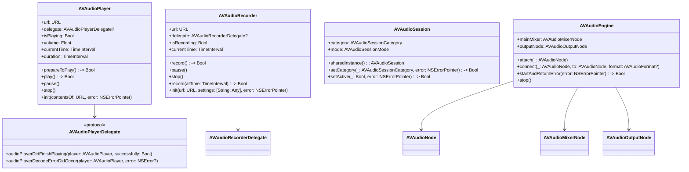

---

## **2. Initializers Overview**

### **a. Initialization Methods Diagram**
- **Purpose**: Break down the various ways to instantiate key classes within the `Audio` framework.
- **Diagram Type**: `flowchart LR`
- **Contents**:
  - **AVAudioPlayer Initializers**: `init(contentsOf: URL)`, `init(data: Data)`
  - **AVAudioRecorder Initializers**: `init(url: URL, settings: [String: Any])`
  - **AVAudioSession Initializers**: `sharedInstance()`
  - **AVAudioEngine Initializers**: `init()`

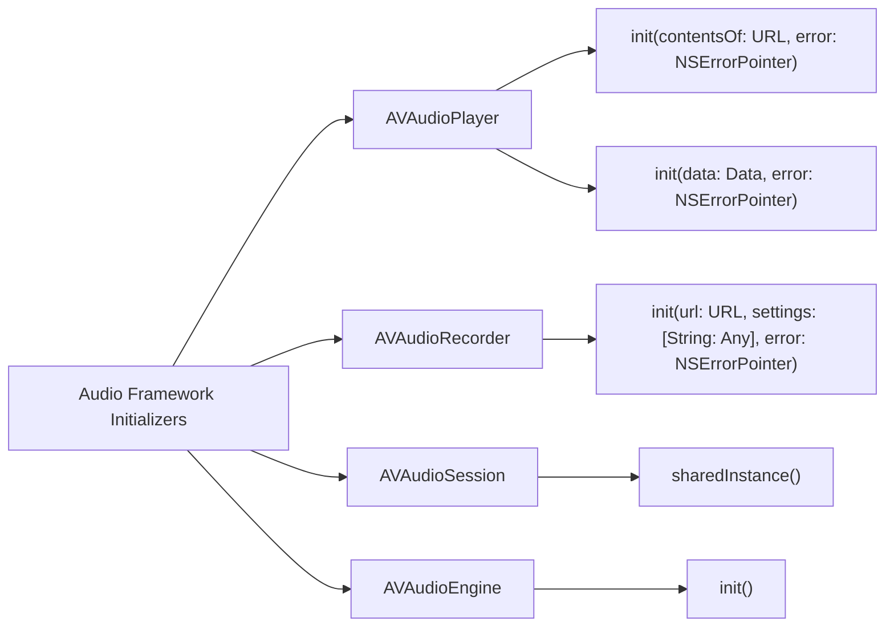

---

## **3. Properties Breakdown**

### **a. Key Properties Diagram**
- **Purpose**: Detail the main properties of key classes within the `Audio` framework.
- **Diagram Type**: `graph LR`
- **Contents**:
  - **AVAudioPlayer Properties**: `url`, `delegate`, `isPlaying`, `volume`, `currentTime`, `duration`
  - **AVAudioRecorder Properties**: `url`, `delegate`, `isRecording`, `currentTime`
  - **AVAudioSession Properties**: `category`, `mode`
  - **AVAudioEngine Properties**: `mainMixer`, `outputNode`

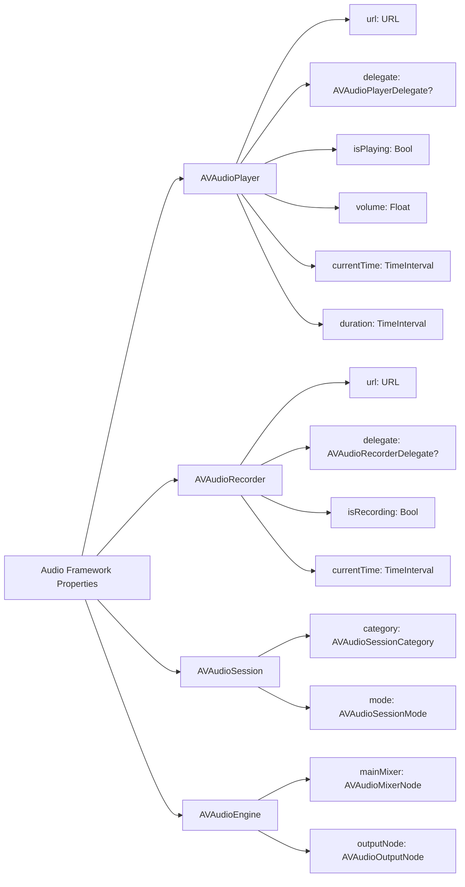

---

## **4. Methods Grouped by Functionality**

### **a. Audio Playback Methods**
- **Purpose**: Categorize methods based on their roles in audio playback.
- **Diagram Type**: `flowchart TD`
- **Contents**:
  - **Playback Control**: `play()`, `pause()`, `stop()`
  - **Playback Information**: `currentTime`, `duration`
  - **Volume Control**: `volume`
  - **Delegation**: `delegate`
  
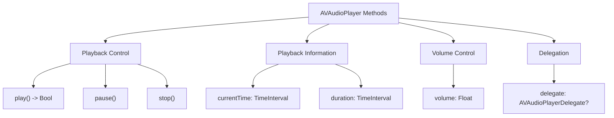

### **b. Audio Recording Methods**
- **Purpose**: Categorize methods based on their roles in audio recording.
- **Diagram Type**: `flowchart TD`
- **Contents**:
  - **Recording Control**: `record()`, `pause()`, `stop()`
  - **Recording Information**: `currentTime`
  - **Settings Management**: `settings`
  - **Delegation**: `delegate`

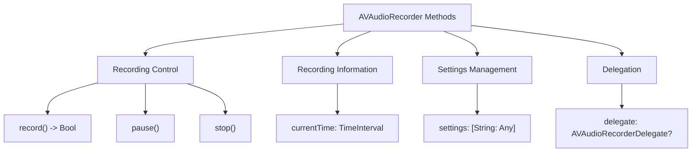

### **c. Audio Session Management Methods**
- **Purpose**: Categorize methods related to managing audio sessions.
- **Diagram Type**: `flowchart TD`
- **Contents**:
  - **Category Management**: `setCategory(_:error:)`
  - **Activation Control**: `setActive(_:error:)`
  - **Mode Management**: `setMode(_:error:)`
  - **Route Management**: `overrideOutputAudioPort(_:error:)`
  
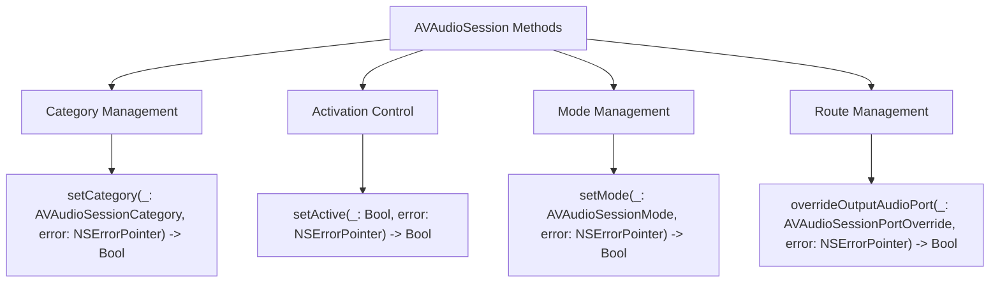

### **d. Audio Engine Control Methods**
- **Purpose**: Categorize methods related to controlling the audio engine.
- **Diagram Type**: `flowchart TD`
- **Contents**:
  - **Engine Control**: `start()`, `stop()`
  - **Node Management**: `attach(_: AVAudioNode)`, `connect(_:to:format:)`
  - **Configuration**: `mainMixer`, `outputNode`
  
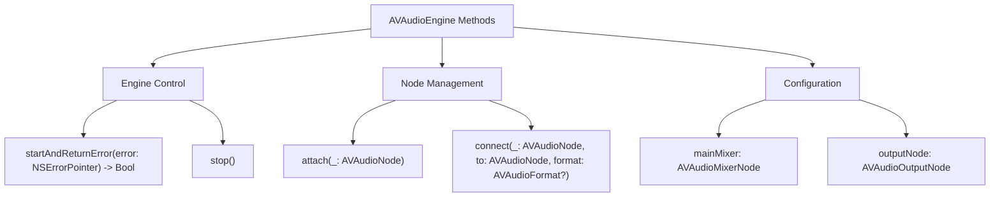

---

## **5. Enumerations and Configurations**

### **a. Enumerations Diagram**
- **Purpose**: Highlight the enums used within the `Audio` framework and their possible values.
- **Diagram Type**: `classDiagram`
- **Contents**:
  - **AVAudioSessionCategory**
  - **AVAudioSessionMode**
  - **AVAudioPlayerStatus**
  - **AVAudioRecorderSetting**

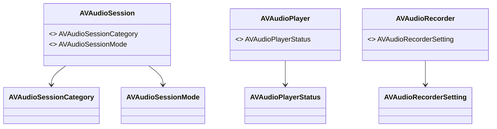

### **b. Configuration Classes Diagram**
- **Purpose**: Show the relationship between key classes and their configuration classes.
- **Diagram Type**: `classDiagram`
- **Contents**:
  - **AVAudioSession Configuration**
  - **AVAudioEngine Configuration**
  
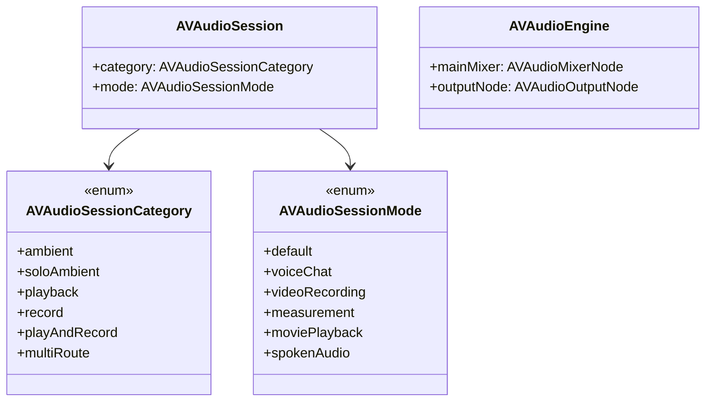

---

## **6. Protocol Conformances**

### **a. Protocols Diagram**
- **Purpose**: Display the protocols that key classes within the `Audio` framework conform to and their impact.
- **Diagram Type**: `classDiagram`
- **Contents**:
  - **AVAudioPlayerDelegate**
  - **AVAudioRecorderDelegate**
  - **AVAudioSessionDelegate** *(Deprecated)*
  - **AVAudioNodeTapProcessor**
  
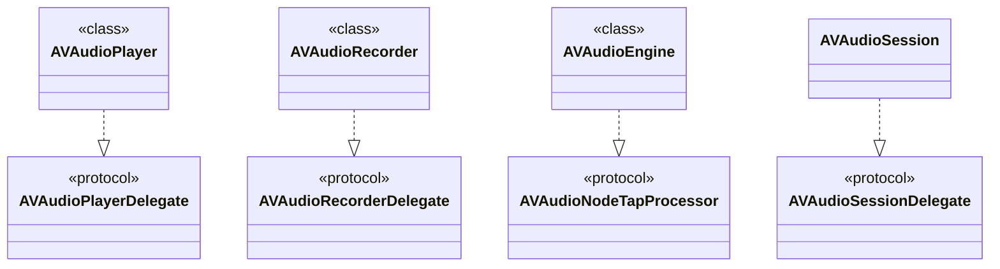

---

## **7. Relationships with Other Classes**

### **a. Related Classes Diagram**
- **Purpose**: Illustrate how key `Audio` framework classes interact with other UIKit and Foundation classes.
- **Diagram Type**: `flowchart TD`
- **Contents**:
  - **URL**: Resource locations for audio files.
  - **NSError**: Error handling.
  - **NSNotificationCenter**: Observing audio session changes.
  - **AVAudioNode**: Nodes within `AVAudioEngine`.
  - **AVAudioMixerNode**: Mixing audio streams.
  - **AVAudioOutputNode**: Outputting audio.
  - **Delegate Protocols**: Handling playback and recording events.
  
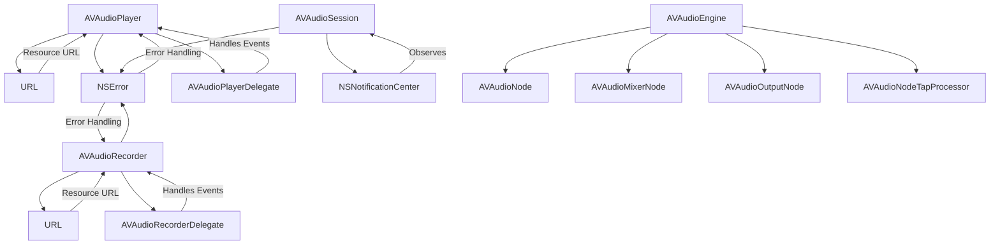

---

## **8. Extensions and Additional Functionalities**

### **a. AVAudioPlayer Extensions Diagram**
- **Purpose**: Showcase the additional functionalities provided through extensions to `AVAudioPlayer`.
- **Diagram Type**: `classDiagram`
- **Contents**:
  - **Playback Enhancements**
  - **Metadata Management**
  
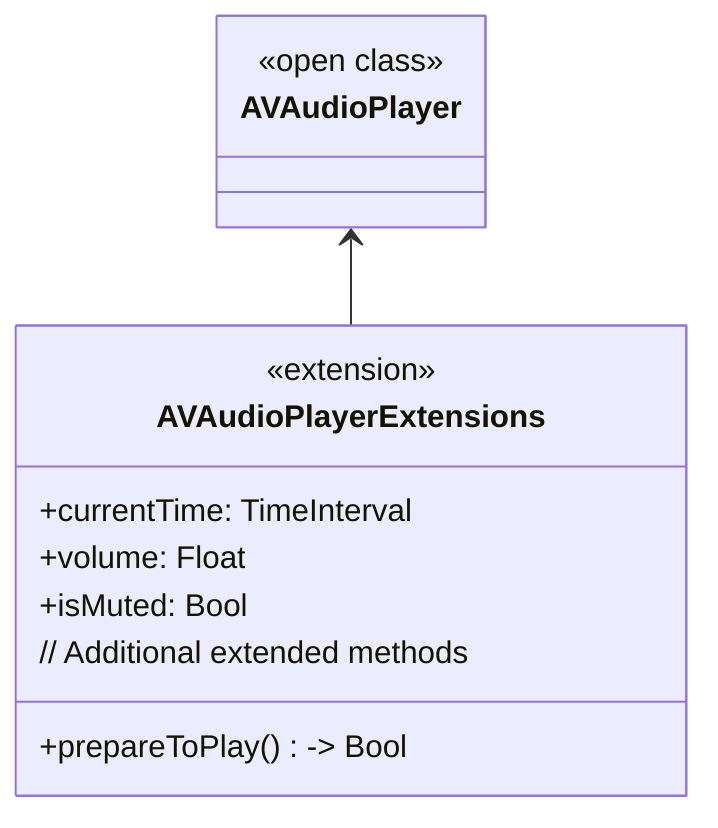

### **b. AVAudioEngine Extensions Functionalities Flowchart**
- **Purpose**: Detail specific extended methods and their purposes in `AVAudioEngine`.
- **Diagram Type**: `flowchart LR`
- **Contents**:
  - **Node Attaching**
  - **Connection Management**
  - **Audio Processing**
  
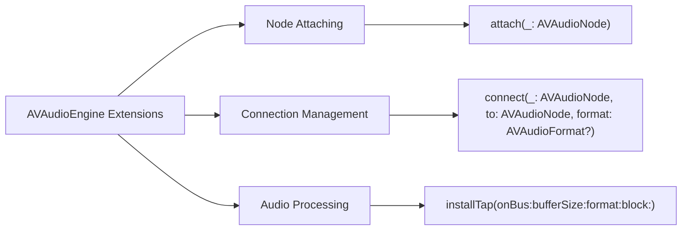

---

## **9. Lifecycle and Use Cases**

### **a. Lifecycle Flowchart**
- **Purpose**: Demonstrate the typical lifecycle of audio playback and recording within an application.
- **Diagram Type**: `flowchart TD`
- **Contents**:
  - **Initialization**
  - **Configuration**
  - **Activation**
  - **Playback/Recording**
  - **Termination**
  
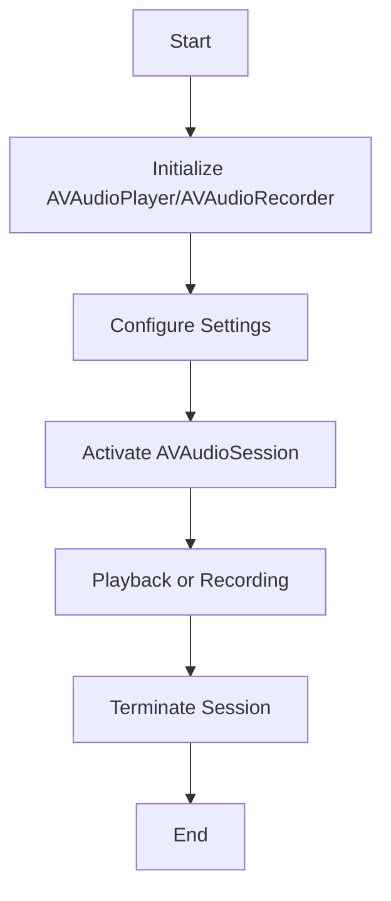

### **b. Common Use Cases Diagram**
- **Purpose**: Outline the typical scenarios where the `Audio` framework is utilized.
- **Diagram Type**: `flowchart TD`
- **Contents**:
  - **Music Playback**
  - **Voice Recording**
  - **Audio Streaming**
  - **Real-Time Audio Processing**
  - **Sound Effects in Games**
  
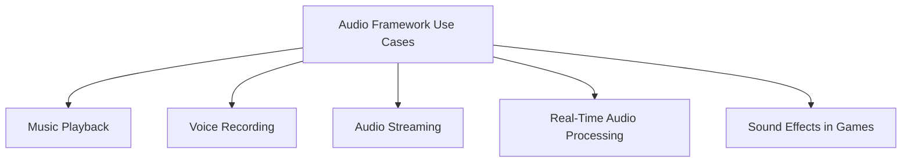

---

## **10. Feature Availability Timeline**

### **a. Feature Availability Gantt Chart**
- **Purpose**: Show when various `Audio` framework features were introduced across iOS versions.
- **Diagram Type**: `gantt`
- **Contents**:
  - **iOS Versions**: 3.0, 4.0, 5.0, 6.0, 7.0, 8.0, 10.0, 11.0, 12.0, 13.0, 14.0, 15.0, 16.0, 17.0
  - **Features Introduced**: AVAudioEngine, AVAudioSessionCategory, AVAudioPlayer enhancements, AVAudioRecorder improvements, AVAudioUnit support, etc.

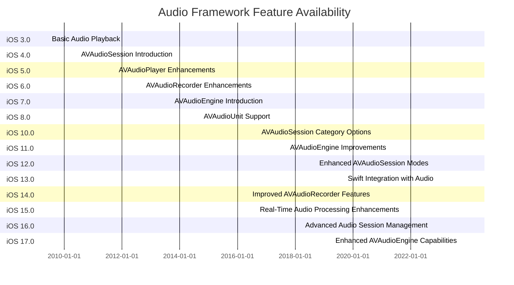

---

## **11. Data Handling and Formats**

### **a. Audio Format Handling Diagram**
- **Purpose**: Explain how key classes within the `Audio` framework handle different audio data formats.
- **Diagram Type**: `graph LR`
- **Contents**:
  - **WAV**: Supported by `AVAudioPlayer` and `AVAudioRecorder`
  - **MP3**: Supported by `AVAudioPlayer`
  - **AAC**: Preferred format for `AVAudioRecorder`
  - **Apple Lossless**: Supported by `AVAudioPlayer`
  
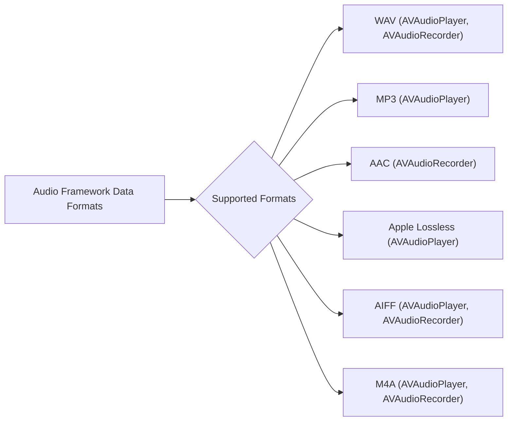

---

## **12. Integration with Processing Contexts**

### **a. Audio Processing Methods Usage Diagram**
- **Purpose**: Show how audio processing methods are used within different contexts.
- **Diagram Type**: `flowchart TD`
- **Contents**:
  - **Audio Playback**
  - **Audio Recording**
  - **Real-Time Processing**
  - **Audio Effects Application**
  
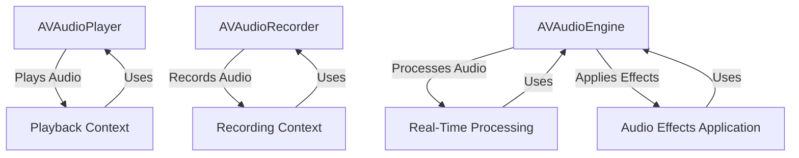

---

## **13. Summary and Best Practices**

### **a. Summary Diagram**
- **Purpose**: Provide a high-level overview of the `Audio` framework's key characteristics and functionalities.
- **Diagram Type**: `graph LR`
- **Contents**:
  - **Versatile Playback and Recording**
  - **Robust Session Management**
  - **Real-Time Audio Processing**
  - **Extensible Audio Engine**
  - **Comprehensive Format Support**

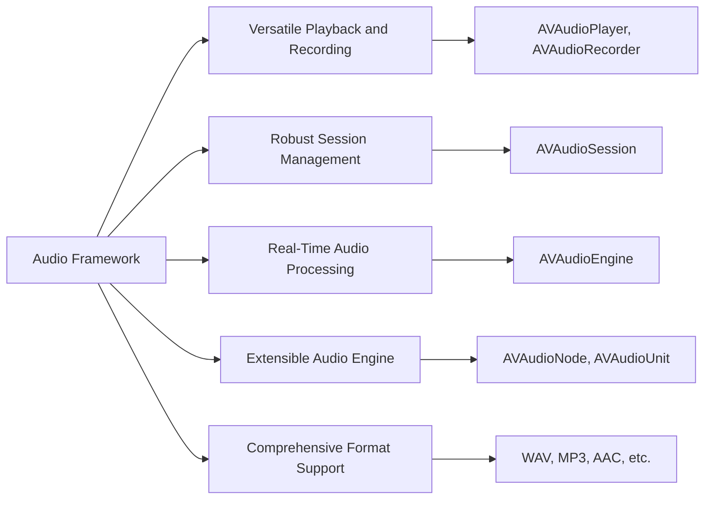

---

## **14. Additional Diagrams for Comprehensive Coverage**

### **a. Audio Node Hierarchy Diagram**
- **Purpose**: Illustrate the hierarchy and relationships between different audio nodes within `AVAudioEngine`.
- **Diagram Type**: `classDiagram`
- **Contents**:
  - **AVAudioEngine**
  - **AVAudioPlayerNode**
  - **AVAudioMixerNode**
  - **AVAudioOutputNode**
  - **AVAudioUnit**
  
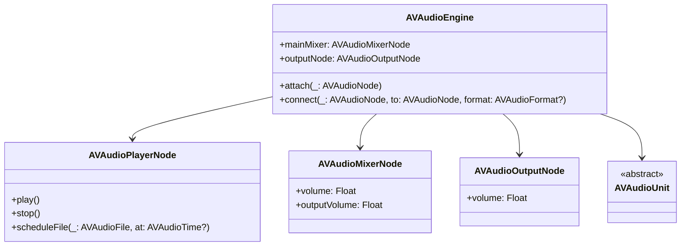

### **b. Audio Session Categories and Modes Diagram**
- **Purpose**: Detail the different categories and modes available in `AVAudioSession`.
- **Diagram Type**: `flowchart TD`
- **Contents**:
  - **Categories**: `Playback`, `Record`, `PlayAndRecord`, `MultiRoute`, etc.
  - **Modes**: `Default`, `VoiceChat`, `VideoRecording`, `Measurement`, etc.
  
```mermaid
flowchart TD
    A[AVAudioSession] --> B[Categories]
    A --> C[Modes]

    B --> B1["Playback"]
    B --> B2["Record"]
    B --> B3["PlayAndRecord"]
    B --> B4["MultiRoute"]
    B --> B5["Ambient"]
    B --> B6["SoloAmbient"]

    C --> C1["Default"]
    C --> C2["VoiceChat"]
    C --> C3["VideoRecording"]
    C --> C4["Measurement"]
    C --> C5["MoviePlayback"]
    C --> C6["SpokenAudio"]
```

---

## **15. Error Handling and Debugging**

### **a. Error Handling Diagram**
- **Purpose**: Outline the common error handling mechanisms within the `Audio` framework.
- **Diagram Type**: `flowchart TD`
- **Contents**:
  - **NSError**
  - **Delegate Callbacks**
  - **Status Checks**
  
```mermaid
flowchart TD
    A[Audio Framework Error Handling] --> B[NSError]
    A --> C[Delegate Callbacks]
    A --> D[Status Checks]

    B --> B1["Check NSError in Initializers"]
    C --> C1["audioPlayerDecodeErrorDidOccur"]
    C --> C2["audioRecorderEncodeErrorDidOccur"]
    D --> D1["Check isPlaying or isRecording"]
```

### **b. Debugging Best Practices Diagram**
- **Purpose**: Provide best practices for debugging audio-related issues.
- **Diagram Type**: `graph LR`
- **Contents**:
  - **Use Logging**
  - **Handle Delegate Methods**
  - **Test Different Audio Sessions**
  - **Monitor Audio Engine Nodes**
  
```mermaid
graph LR
    A[Audio Debugging Best Practices] --> B[Use Logging]
    A --> C[Handle Delegate Methods]
    A --> D[Test Different Audio Sessions]
    A --> E[Monitor Audio Engine Nodes]

    B --> B1["Log AVAudioSession Changes"]
    B --> B2["Log Playback and Recording States"]

    C --> C1["Implement Delegate Callbacks"]
    C --> C2["Handle Errors Gracefully"]

    D --> D1["Switch Between Categories and Modes"]
    D --> D2["Ensure Proper Session Activation"]

    E --> E1["Check Node Connections"]
    E --> E2["Monitor Node States"]
```

---

## **16. Security and Privacy Considerations**

### **a. Privacy Permissions Diagram**
- **Purpose**: Highlight the privacy permissions required when using the `Audio` framework.
- **Diagram Type**: `flowchart TD`
- **Contents**:
  - **Microphone Access**
  - **Media Library Access**
  
```mermaid
flowchart TD
    A[Audio Framework Privacy] --> B[Microphone Access]
    A --> C[Media Library Access]

    B --> B1["Add NSMicrophoneUsageDescription to Info.plist"]
    C --> C1["Add NSAppleMusicUsageDescription to Info.plist"]
```

### **b. Secure Audio Handling Diagram**
- **Purpose**: Illustrate best practices for securely handling audio data.
- **Diagram Type**: `flowchart TD`
- **Contents**:
  - **Secure Storage**
  - **Data Encryption**
  - **Access Control**
  
```mermaid
flowchart TD
    A[Secure Audio Handling] --> B[Secure Storage]
    A --> C[Data Encryption]
    A --> D[Access Control]

    B --> B1["Store Audio Files in Encrypted Containers"]
    C --> C1["Encrypt Audio Data Before Saving"]
    D --> D1["Restrict Access to Audio Resources"]
```

---

## **17. Performance Optimization**

### **a. Audio Processing Optimization Diagram**
- **Purpose**: Detail techniques for optimizing audio processing performance.
- **Diagram Type**: `flowchart TD`
- **Contents**:
  - **Efficient Buffer Management**
  - **Minimize Latency**
  - **Optimize Audio Formats**
  - **Leverage Hardware Acceleration**
  
```mermaid
flowchart TD
    A[Audio Performance Optimization] --> B[Efficient Buffer Management]
    A --> C[Minimize Latency]
    A --> D[Optimize Audio Formats]
    A --> E[Leverage Hardware Acceleration]

    B --> B1["Use Appropriate Buffer Sizes"]
    B --> B2["Reuse Audio Buffers"]

    C --> C1["Configure Audio Session for Low Latency"]
    C --> C2["Optimize Audio Engine Node Graph"]

    D --> D1["Choose Compressed Formats When Suitable"]
    D --> D2["Avoid Unnecessary Format Conversions"]

    E --> E1["Utilize AVAudioUnit Effects"]
    E --> E2["Enable Hardware DSP Features"]
```

### **b. Energy Efficiency Best Practices Diagram**
- **Purpose**: Provide best practices for maintaining energy efficiency when using the `Audio` framework.
- **Diagram Type**: `graph LR`
- **Contents**:
  - **Optimize Audio Sessions**
  - **Manage Audio Engine Lifecycle**
  - **Reduce Processing Overhead**
  
```mermaid
graph LR
    A[Energy Efficiency in Audio] --> B[Optimize Audio Sessions]
    A --> C[Manage Audio Engine Lifecycle]
    A --> D[Reduce Processing Overhead]

    B --> B1["Deactivate Sessions When Not in Use"]
    B --> B2["Use Appropriate Session Categories"]

    C --> C1["Start Engine Only When Needed"]
    C --> C2["Stop Engine to Save Resources"]

    D --> D1["Simplify Audio Node Graph"]
    D --> D2["Avoid Unnecessary Audio Processing"]
```

---

## **18. Integration with Other Frameworks**

### **a. AVFoundation Integration Diagram**
- **Purpose**: Show how the `Audio` framework integrates with other Apple frameworks like `AVFoundation`.
- **Diagram Type**: `flowchart TD`
- **Contents**:
  - **AVPlayer Integration**
  - **Video and Audio Synchronization**
  - **Media Capture**

```mermaid
flowchart TD
    A[Audio Framework Integration] --> B[AVFoundation]
    A --> C[UIKit]
    A --> D[Core Media]

    B --> B1["AVPlayer for Audio-Video Playback"]
    B --> B2["Synchronize Audio with Video Content"]
    B --> B3["Media Capture with AVCaptureSession"]

    C --> C1["Display Audio Visualizations"]
    C --> C2["Handle User Interactions"]

    D --> D1["Audio Sample Buffers Management"]
    D --> D2["Real-Time Audio Processing"]
```

### **b. Core ML Integration Diagram**
- **Purpose**: Illustrate how audio data can be integrated with machine learning models using `Core ML`.
- **Diagram Type**: `flowchart TD`
- **Contents**:
  - **Audio Feature Extraction**
  - **Model Prediction**
  - **Real-Time Analysis**
  
```mermaid
flowchart TD
    A[Audio and Core ML Integration] --> B[Audio Feature Extraction]
    A --> C[Model Prediction]
    A --> D[Real-Time Analysis]

    B --> B1["Extract MFCCs, Spectrograms"]
    B --> B2["Prepare Data for ML Models"]

    C --> C1["Use Core ML Models for Classification"]
    C --> C2["Predict Audio Events"]

    D --> D1["Process Audio Streams in Real-Time"]
    D --> D2["Update Model Predictions Continuously"]
```

---

## **19. Testing and Quality Assurance**

### **a. Unit Testing Diagram**
- **Purpose**: Outline the approach to unit testing within the `Audio` framework.
- **Diagram Type**: `flowchart LR`
- **Contents**:
  - **Mocking Audio Sessions**
  - **Testing Playback and Recording**
  - **Error Handling Tests**
  
```mermaid
flowchart LR
    A[Audio Framework Testing] --> B[Mocking Audio Sessions]
    A --> C[Testing Playback and Recording]
    A --> D[Error Handling Tests]

    B --> B1["Use Mock AVAudioSession"]
    B --> B2["Simulate Session Interruptions"]

    C --> C1["Validate Play/Pause Functionality"]
    C --> C2["Verify Recording Accuracy"]

    D --> D1["Test Error Callbacks"]
    D --> D2["Ensure Proper Error Messages"]
```

### **b. Integration Testing Diagram**
- **Purpose**: Describe integration testing strategies for the `Audio` framework.
- **Diagram Type**: `flowchart LR`
- **Contents**:
  - **End-to-End Playback Recording**
  - **Concurrent Audio Operations**
  - **Interoperability with Other Frameworks**
  
```mermaid
flowchart LR
    A[Integration Testing] --> B[End-to-End Playback Recording]
    A --> C[Concurrent Audio Operations]
    A --> D[Interoperability with Other Frameworks]

    B --> B1["Play and Record Simultaneously"]
    B --> B2["Ensure Audio Integrity"]

    C --> C1["Handle Multiple Audio Streams"]
    C --> C2["Test Resource Management"]

    D --> D1["Integrate with AVFoundation"]
    D --> D2["Interact with Core ML Models"]
```

---

## **20. Documentation and Developer Resources**

### **a. Documentation Structure Diagram**
- **Purpose**: Outline the structure of comprehensive documentation for the `Audio` framework.
- **Diagram Type**: `flowchart TD`
- **Contents**:
  - **Getting Started Guides**
  - **API References**
  - **Sample Projects**
  - **Best Practices**
  
```mermaid
flowchart TD
    A[Audio Framework Documentation] --> B[Getting Started Guides]
    A --> C[API References]
    A --> D[Sample Projects]
    A --> E[Best Practices]

    B --> B1["Setting Up Audio Sessions"]
    B --> B2["Basic Playback and Recording"]

    C --> C1["AVAudioPlayer Classes"]
    C --> C2["AVAudioEngine Classes"]

    D --> D1["Playback Example"]
    D --> D2["Recording Example"]

    E --> E1["Optimizing Performance"]
    E --> E2["Handling Errors Gracefully"]
```

### **b. Developer Resources Flowchart**
- **Purpose**: Highlight available developer resources for mastering the `Audio` framework.
- **Diagram Type**: `flowchart LR`
- **Contents**:
  - **Apple Developer Documentation**
  - **WWDC Videos**
  - **Open Source Projects**
  - **Community Forums**
  
```mermaid
flowchart LR
    A[Developer Resources] --> B[Apple Developer Documentation]
    A --> C[WWDC Videos]
    A --> D[Open Source Projects]
    A --> E[Community Forums]

    B --> B1["Official API Docs"]
    B --> B2["Guides and Tutorials"]

    C --> C1["WWDC Sessions on Audio"]
    C --> C2["Best Practices Presentations"]

    D --> D1["GitHub Audio Projects"]
    D --> D2["Sample Code Repositories"]

    E --> E1["Stack Overflow"]
    E --> E2["Apple Developer Forums"]
```

---

## **21. Advanced Topics**

### **a. Real-Time Audio Processing Diagram**
- **Purpose**: Explore advanced real-time audio processing capabilities within the `Audio` framework.
- **Diagram Type**: `flowchart TD`
- **Contents**:
  - **Audio Taps**
  - **Custom Audio Units**
  - **Audio Buffer Manipulation**
  
```mermaid
flowchart TD
    A[Real-Time Audio Processing] --> B[Audio Taps]
    A --> C[Custom Audio Units]
    A --> D[Audio Buffer Manipulation]

    B --> B1["Install Taps on Audio Nodes"]
    B --> B2["Capture Live Audio Data"]

    C --> C1["Create Custom AVAudioUnit"]
    C --> C2["Implement DSP Algorithms"]

    D --> D1["Modify Audio Buffers In-Place"]
    D --> D2["Apply Effects in Real-Time"]
```

### **b. Spatial Audio and Surround Sound Diagram**
- **Purpose**: Detail how to implement spatial audio and surround sound within the `Audio` framework.
- **Diagram Type**: `flowchart TD`
- **Contents**:
  - **AVAudioEnvironmentNode**
  - **3D Audio Positioning**
  - **Head-Related Transfer Functions (HRTF)**
  
```mermaid
flowchart TD
    A[Spatial Audio Implementation] --> B[AVAudioEnvironmentNode]
    A --> C[3D Audio Positioning]
    A --> D["Head-Related Transfer Functions (HRTF)"]

    B --> B1["Simulate Acoustic Environments"]
    B --> B2["Control Listener Position"]

    C --> C1["Position Audio Sources in 3D Space"]
    C --> C2["Adjust Audio Based on Listener Motion"]

    D --> D1["Enhance Spatial Realism"]
    D --> D2["Apply Directional Audio Effects"]
```

---

## **22. Best Practices and Recommendations**

### **a. Best Practices Diagram**
- **Purpose**: Summarize best practices for using the `Audio` framework effectively.
- **Diagram Type**: `flowchart LR`
- **Contents**:
  - **Efficient Resource Management**
  - **User Privacy Considerations**
  - **Responsive Audio Handling**
  - **Scalable Audio Architectures**
  
```mermaid
flowchart LR
    A[Audio Framework Best Practices] --> B[Efficient Resource Management]
    A --> C[User Privacy Considerations]
    A --> D[Responsive Audio Handling]
    A --> E[Scalable Audio Architectures]

    B --> B1["Release Audio Resources When Not in Use"]
    B --> B2["Optimize Audio Buffer Sizes"]

    C --> C1["Request Permissions Properly"]
    C --> C2["Handle User Denials Gracefully"]

    D --> D1["Ensure Low Latency Audio Processing"]
    D --> D2["Respond to Audio Session Interruptions"]

    E --> E1["Modular Audio Engine Setup"]
    E --> E2["Use Flexible Audio Node Graphs"]
```

### **b. Common Pitfalls Diagram**
- **Purpose**: Highlight common mistakes developers make when using the `Audio` framework and how to avoid them.
- **Diagram Type**: `flowchart LR`
- **Contents**:
  - **Ignoring Audio Session Interruptions**
  - **Improper Error Handling**
  - **Inefficient Audio Processing**
  
```mermaid
flowchart LR
    A[Common Pitfalls] --> B[Ignoring Audio Session Interruptions]
    A --> C[Improper Error Handling]
    A --> D[Inefficient Audio Processing]

    B --> B1["Not Responding to Interruptions Like Phone Calls"]
    B --> B2["Failing to Reactivate Audio Sessions"]

    C --> C1["Neglecting to Check NSError"]
    C --> C2["Not Implementing Delegate Methods Properly"]

    D --> D1["Using Large Audio Buffers"]
    D --> D2["Overloading Audio Engine with Nodes"]
```

---

## **23. Future Directions and Emerging Trends**

### **a. Future Enhancements Diagram**
- **Purpose**: Explore potential future enhancements and trends in the `Audio` framework.
- **Diagram Type**: `graph LR`
- **Contents**:
  - **Integration with AR/VR**
  - **Machine Learning Integration**
  - **Enhanced Spatial Audio Features**
  
```mermaid
graph LR
    A[Future Directions] --> B[Integration with AR/VR]
    A --> C[Machine Learning Integration]
    A --> D[Enhanced Spatial Audio Features]

    B --> B1["Immersive Audio for AR Experiences"]
    B --> B2["Dynamic Audio Adaptation Based on User Environment"]

    C --> C1["Real-Time Audio Classification"]
    C --> C2["Adaptive Audio Effects Using ML Models"]

    D --> D1["Advanced 3D Audio Capabilities"]
    D --> D2["Personalized Audio Experiences"]
```

### **b. Emerging Technologies Diagram**
- **Purpose**: Highlight emerging technologies that may impact the `Audio` framework.
- **Diagram Type**: `graph LR`
- **Contents**:
  - **Spatial Computing**
  - **Voice Assistants**
  - **Enhanced Audio Encryption**
  
```mermaid
graph LR
    A[Emerging Technologies] --> B[Spatial Computing]
    A --> C[Voice Assistants]
    A --> D[Enhanced Audio Encryption]

    B --> B1["More Realistic Spatial Audio"]
    B --> B2["Integration with AR Devices"]

    C --> C1["Improved Voice Recognition"]
    C --> C2["Context-Aware Audio Responses"]

    D --> D1["Stronger Encryption for Audio Data"]
    D --> D2["Secure Transmission of Audio Streams"]
```

---

## **24. Conclusion**

### **a. Comprehensive Overview Diagram**
- **Purpose**: Recap the `Audio` framework's capabilities and strategic importance in app development.
- **Diagram Type**: `graph LR`
- **Contents**:
  - **Playback and Recording**
  - **Session Management**
  - **Real-Time Processing**
  - **Integration with Other Frameworks**
  - **Future Prospects**
  
```mermaid
graph LR
    A[Audio Framework] --> B[Playback and Recording]
    A --> C[Session Management]
    A --> D[Real-Time Processing]
    A --> E[Integration with Other Frameworks]
    A --> F[Future Prospects]

    B --> B1["AVAudioPlayer, AVAudioRecorder"]
    C --> C1["AVAudioSession"]
    D --> D1["AVAudioEngine"]
    E --> E1["AVFoundation, Core ML"]
    F --> F1["AR/VR Integration, ML Enhancements"]
```

---

## **25. References and Further Reading**

### **a. Resources Diagram**
- **Purpose**: Provide a structured list of references and resources for further exploration of the `Audio` framework.
- **Diagram Type**: `flowchart TD`
- **Contents**:
  - **Official Documentation**
  - **Tutorials and Guides**
  - **Community Forums**
  - **Sample Code Repositories**
  
```mermaid
flowchart TD
    A[References and Further Reading] --> B[Official Documentation]
    A --> C[Tutorials and Guides]
    A --> D[Community Forums]
    A --> E[Sample Code Repositories]

    B --> B1["Apple Developer Audio Documentation"]
    B --> B2["AVFoundation Programming Guide"]

    C --> C1["Ray Wenderlich Audio Tutorials"]
    C --> C2["Apple Developer Tutorials"]

    D --> D1["Stack Overflow Audio Tag"]
    D --> D2["Apple Developer Forums"]

    E --> E1["GitHub Audio Samples"]
    E --> E2["Apple Sample Code"]
```

---
