# CGColorSpace

Below is a comprehensive and organized set of Mermaid diagrams for the `CGColorSpace` class. These diagrams cover various aspects of `CGColorSpace`, including its structure, initialization methods, properties, methods, enumerations, relationships with other classes, and best practices.

---

## **1. Class Structure and Hierarchy**

### **a. Core Class Diagram**
- **Purpose**: Illustrate the primary structure of `CGColorSpace`, including its properties, methods, and enumerations.
- **Diagram Type**: `classDiagram`
- **Contents**:
  - **Properties**: Key attributes like `model`, `numberOfComponents`, etc.
  - **Methods**: Essential functions like `createDeviceRGB()`, `createDeviceGray()`, etc.
  - **Enumerations**: Nested enums such as `CGColorSpaceModel`.

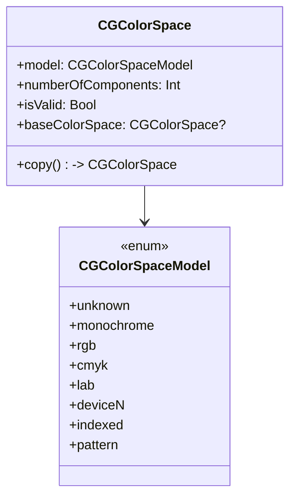

---
## **2. Initializers Overview**

### **a. Initialization Methods Diagram**
- **Purpose**: Break down the various ways to instantiate `CGColorSpace`.
- **Diagram Type**: `flowchart LR`
- **Contents**:
  - **Predefined Color Spaces**: `createDeviceRGB()`, `createDeviceGray()`, `createDeviceCMYK()`
  - **ICC-Based Color Spaces**: `createWithICCProfile()`, `createWithDestinationICCProfile()`
  - **Indexed Color Spaces**: `createIndexed()`
  - **Pattern Color Spaces**: `createPattern()`
  - **Lab and DeviceN Color Spaces**: `createLab()`, `createDeviceN()`

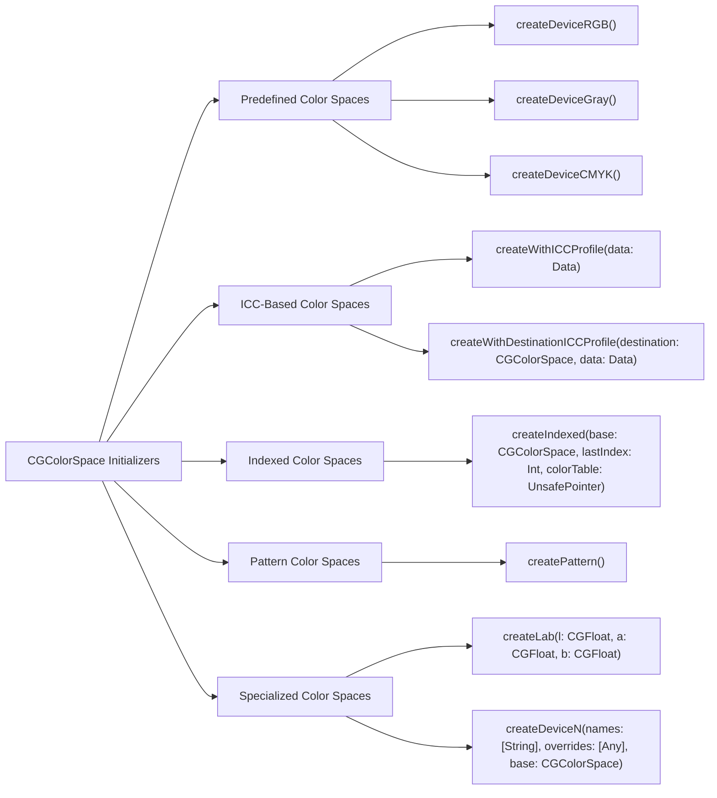

---
## **3. Properties Breakdown**

### **a. Key Properties Diagram**
- **Purpose**: Detail the main properties of `CGColorSpace`.
- **Diagram Type**: `classDiagram`
- **Contents**:
  - **Color Space Attributes**: `model`, `numberOfComponents`, `isValid`
  - **Relationships**: `baseColorSpace`

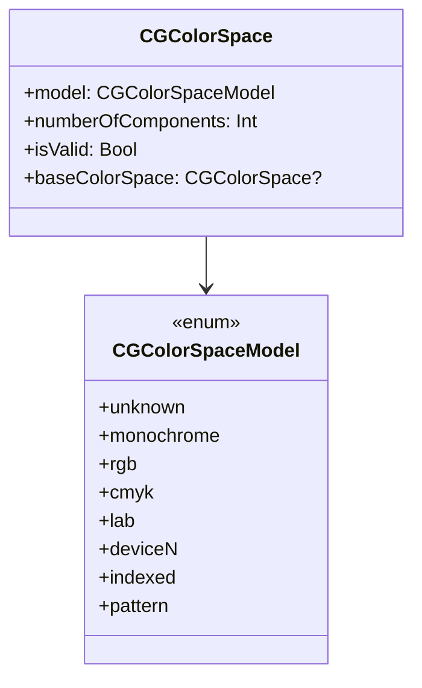

---
## **4. Methods Grouped by Functionality**

### **a. Color Space Creation Methods**
- **Purpose**: Categorize methods based on their roles in creating color spaces.
- **Diagram Type**: `flowchart TD`
- **Contents**:
  - **Predefined Methods**: `createDeviceRGB()`, `createDeviceGray()`
  - **ICC Methods**: `createWithICCProfile()`
  - **Indexed Methods**: `createIndexed()`
  - **Pattern Methods**: `createPattern()`
  - **Specialized Methods**: `createLab()`, `createDeviceN()`

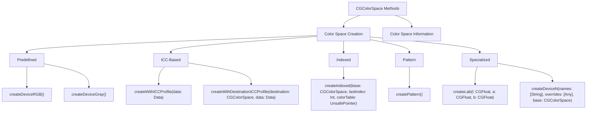

### **b. Color Space Information Methods**
- **Purpose**: Group methods that provide information about the color space.
- **Diagram Type**: `flowchart LR`
- **Contents**:
  - **Property Accessors**: `getModel()`, `copyBaseColorSpace()`
  - **Component Information**: `getNumberOfComponents()`
  - **Validation**: `isValid()`

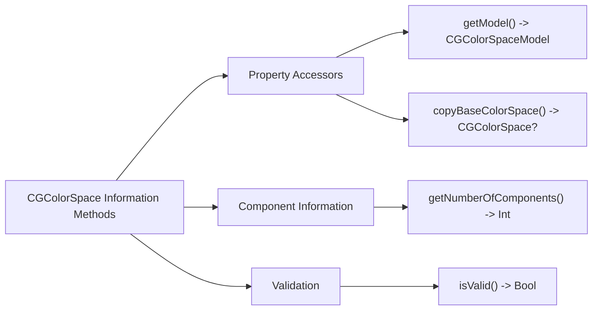

---
## **5. Enumerations and Configurations**

### **a. Enumerations Diagram**
- **Purpose**: Highlight the enums used within `CGColorSpace` and their possible values.
- **Diagram Type**: `classDiagram`
- **Contents**:
  - **CGColorSpaceModel**

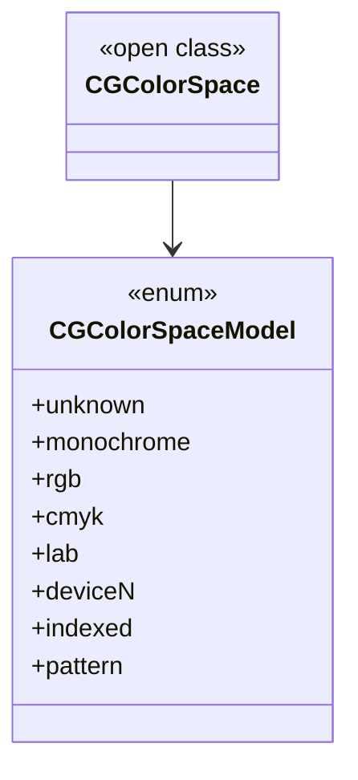

---
## **6. Relationships with Other Classes**

### **a. Related Classes Diagram**
- **Purpose**: Illustrate how `CGColorSpace` interacts with other Core Graphics classes and frameworks.
- **Diagram Type**: `flowchart TD`
- **Contents**:
  - **CGContext**: Uses `CGColorSpace` for drawing operations.
  - **CGImage**: Associates with `CGColorSpace` for image representation.
  - **CIImage**: Uses `CGColorSpace` for Core Image processing.
  - **UIColor**: Bridges color spaces between UIKit and Core Graphics.
  - **CGPDFContext**: Utilizes `CGColorSpace` for PDF generation.
  - **CALayer**: Applies `CGColorSpace` for layer rendering.

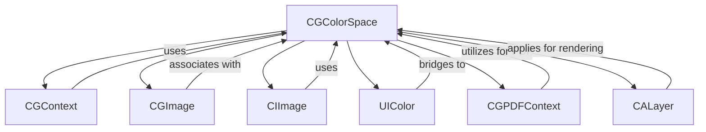

---
## **7. Protocol Conformances**

### **a. Protocols Diagram**
- **Purpose**: Display the protocols that `CGColorSpace` conforms to and their impact.
- **Diagram Type**: `classDiagram`
- **Contents**:
  - **NSCopying**
  - **NSCoding**

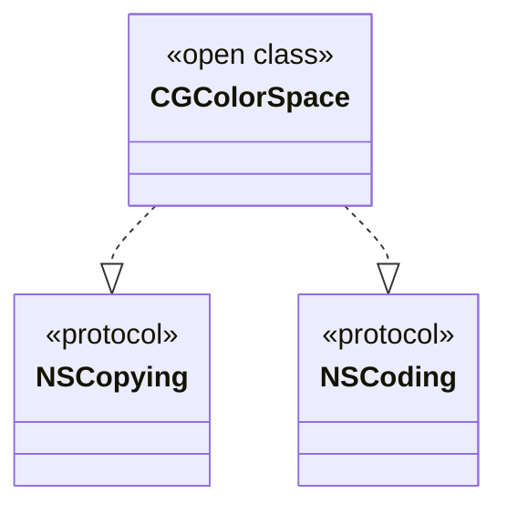

---
## **8. Lifecycle and Use Cases**

### **a. Lifecycle Flowchart**
- **Purpose**: Demonstrate the typical lifecycle of a `CGColorSpace` within an application.
- **Diagram Type**: `flowchart TD`
- **Contents**:
  - **Initialization**
  - **Usage in Drawing Contexts**
  - **Modification/Customization**
  - **Release/Deallocation**

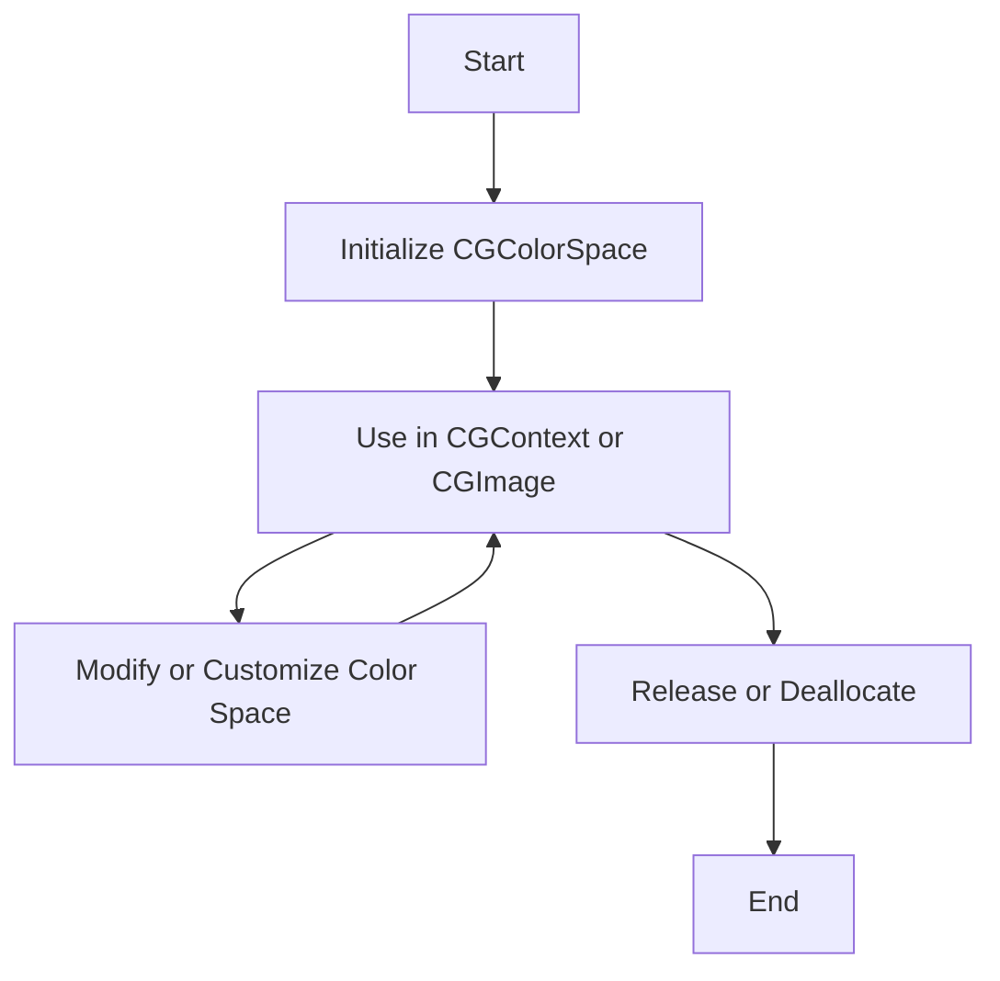

### **b. Common Use Cases Diagram**
- **Purpose**: Outline the typical scenarios where `CGColorSpace` is utilized.
- **Diagram Type**: `flowchart TD`
- **Contents**:
  - **Rendering Graphics**
  - **Image Processing**
  - **PDF Generation**
  - **Color Management**
  - **Layer Rendering**

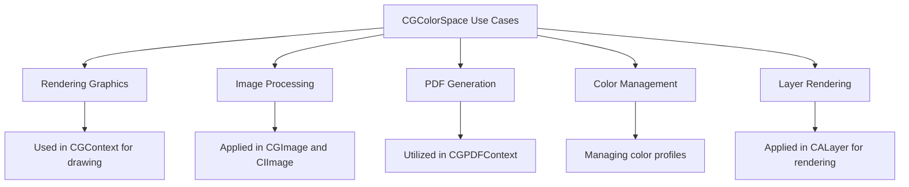

---
## **9. Feature Availability Timeline**

### **a. Feature Availability Gantt Chart**
- **Purpose**: Show when various `CGColorSpace` features were introduced across macOS and iOS versions.
- **Diagram Type**: `gantt`
- **Contents**:
  - **Versions**: macOS 10.0, iOS 2.0, macOS 10.10, iOS 10.0, macOS 11.0, iOS 13.0, iOS 16.0
  - **Features Introduced**: Basic color spaces, ICC-based color spaces, Indexed color spaces, Pattern color spaces, Lab color spaces, DeviceN color spaces.

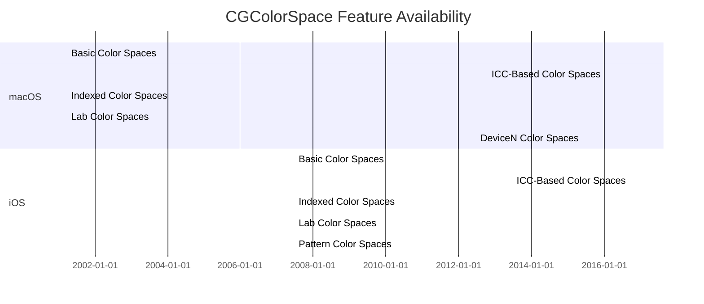

---
## **10. Data Handling and Formats**

### **a. Color Space Handling Diagram**
- **Purpose**: Explain how `CGColorSpace` handles different color space data formats.
- **Diagram Type**: `graph LR`
- **Contents**:
  - **Predefined**: `DeviceRGB`, `DeviceGray`, `DeviceCMYK`
  - **ICC Profiles**: `createWithICCProfile()`
  - **Indexed**: `createIndexed()`
  - **Pattern**: `createPattern()`
  - **Specialized**: `Lab`, `DeviceN`

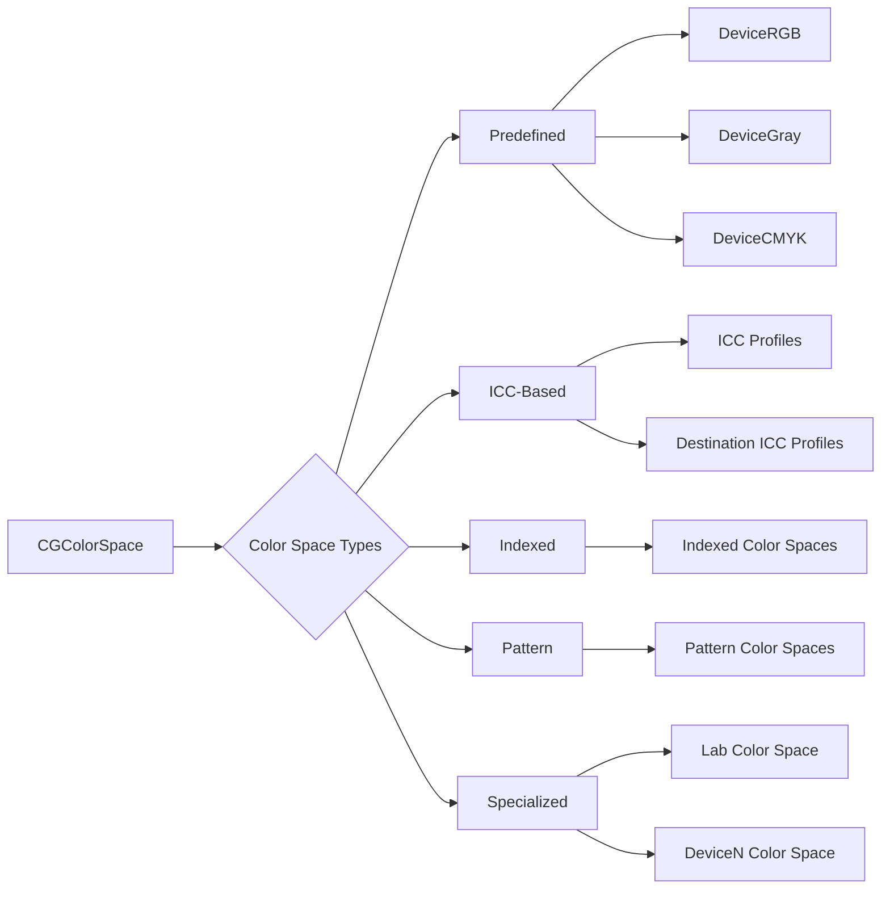

---
## **11. Integration with Drawing Contexts**

### **a. Drawing Methods Usage Diagram**
- **Purpose**: Show how `CGColorSpace` is used within drawing contexts.
- **Diagram Type**: `flowchart TD`
- **Contents**:
  - **CGContext**: Setting the color space for drawing operations.
  - **CGImage**: Associating color spaces with images.
  - **CIImage**: Utilizing color spaces in Core Image processing.
  - **PDF Context**: Defining color spaces for PDF content.

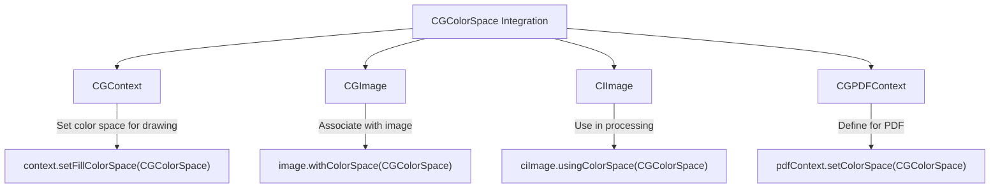

---
## **12. Summary and Best Practices**

### **a. Summary Diagram**
- **Purpose**: Provide a high-level overview of `CGColorSpace`'s key characteristics and functionalities.
- **Diagram Type**: `graph LR`
- **Contents**:
  - **Versatile Initialization**
  - **Comprehensive Color Management**
  - **Integration with Core Graphics Framework**
  - **Support for Multiple Color Models**
  - **Optimized for Performance**

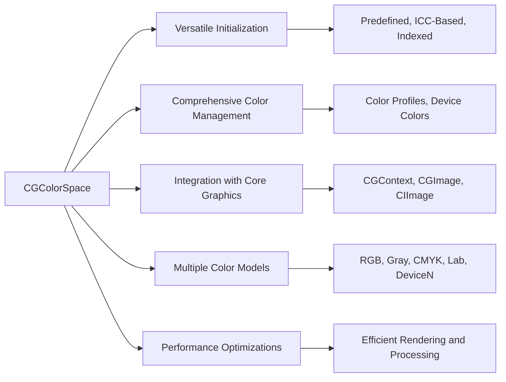

### **b. Best Practices Diagram**
- **Purpose**: Highlight best practices when working with `CGColorSpace`.
- **Diagram Type**: `graph TD`
- **Contents**:
  - **Use Predefined Color Spaces When Possible**
  - **Manage ICC Profiles Carefully**
  - **Optimize for Performance**
  - **Ensure Compatibility Across Devices**
  - **Handle Memory Management Appropriately**

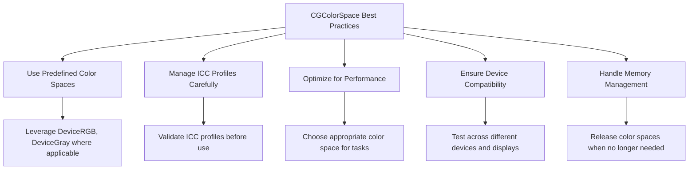

---

## **Additional Diagrams Based on Complexity**

### **13. Advanced Color Space Configurations**

#### **a. Custom ICC Profile Integration Diagram**
- **Purpose**: Illustrate how to integrate custom ICC profiles with `CGColorSpace`.
- **Diagram Type**: `flowchart LR`
- **Contents**:
  - **Load ICC Data**
  - **Create CGColorSpace with ICC**
  - **Apply to CGContext or CGImage**

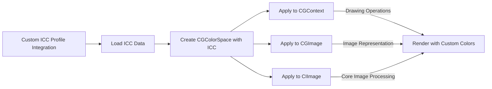

#### **b. Indexed Color Space Usage Diagram**
- **Purpose**: Demonstrate the usage of indexed color spaces in `CGColorSpace`.
- **Diagram Type**: `flowchart TP`
- **Contents**:
  - **Define Base Color Space**
  - **Specify Color Palette**
  - **Create Indexed Color Space**
  - **Associate with Images or Contexts**

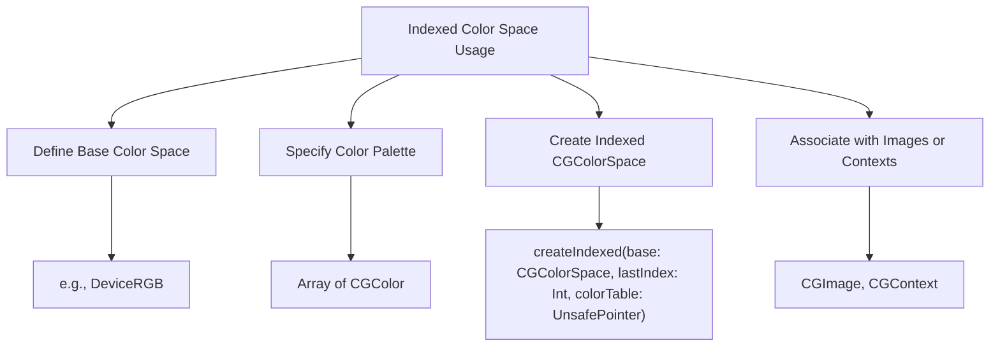

---

## **Conclusion**

The `CGColorSpace` class is a fundamental component within the Core Graphics framework, providing essential functionality for color management and rendering in iOS and macOS applications. By understanding its structure, initialization methods, properties, and integration points, developers can effectively manage color representations and ensure consistent visual output across different devices and contexts.

**Best Practices Recap**:
- Prefer predefined color spaces like `DeviceRGB` for standard tasks.
- Carefully handle ICC profiles to maintain color accuracy.
- Optimize color space usage to enhance performance.
- Ensure compatibility by testing across various devices and display types.
- Manage memory by releasing color spaces when they are no longer needed.

These diagrams serve as a visual guide to help you navigate and utilize the `CGColorSpace` class effectively in your development projects.

---

