# CIImage from Core Image framework

## **1. Class Structure and Hierarchy**

### **a. Core Class Diagram**
- **Purpose**: Illustrate the primary structure of `CIImage`, including its properties, methods, and enumerations.
- **Diagram Type**: `classDiagram`
- **Contents**:
  - **Properties**: Key attributes like `extent`, `properties`, `colorSpace`, etc.
  - **Methods**: Essential functions like initializers, `applyingFilter()`, `cropped(to:)`, etc.
  - **Enumerations**: Nested enums such as `CIFormat`, `CISamplerType`.

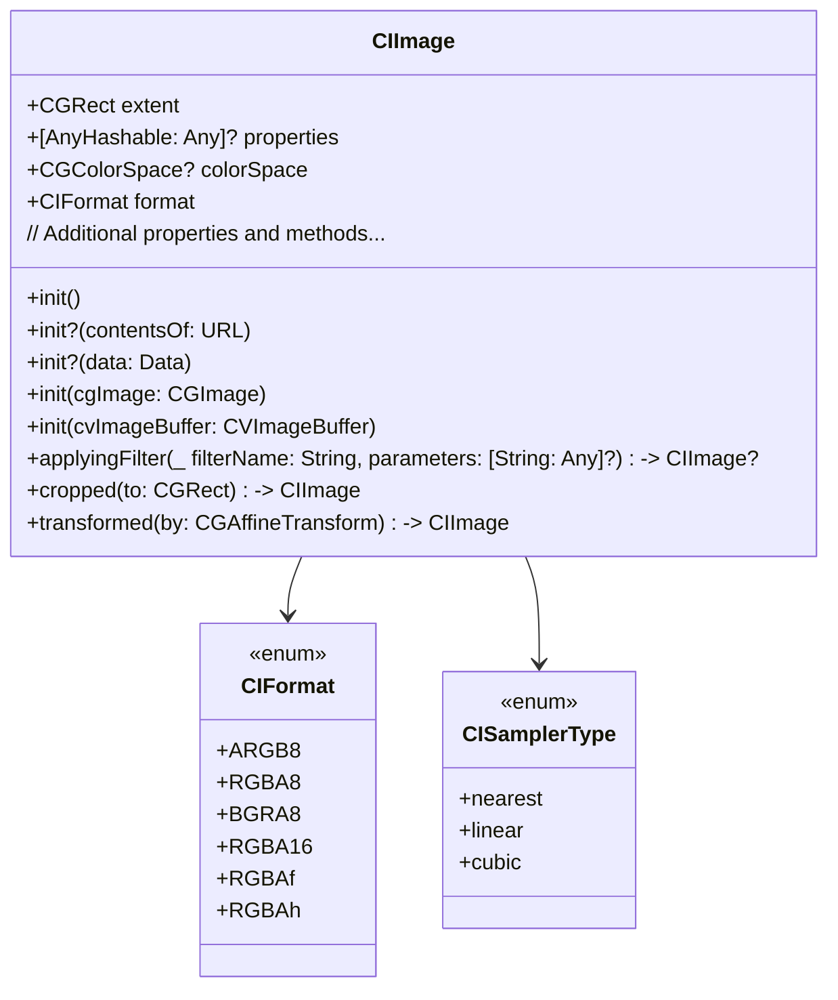
```mermaid
classDiagram
    class CIImage {
        +CGRect extent
        +[AnyHashable: Any]? properties
        +CGColorSpace? colorSpace
        +CIFormat format
        +init()
        +init?(contentsOf: URL)
        +init?(data: Data)
        +init(cgImage: CGImage)
        +init(cvImageBuffer: CVImageBuffer)
        +applyingFilter(_ filterName: String, parameters: [String: Any]?) -> CIImage?
        +cropped(to: CGRect) -> CIImage
        +transformed(by: CGAffineTransform) -> CIImage
        // Additional properties and methods...
    }

    class CIFormat {
        <<enum>>
        +ARGB8
        +RGBA8
        +BGRA8
        +RGBA16
        +RGBAf
        +RGBAh
    }

    class CISamplerType {
        <<enum>>
        +nearest
        +linear
        +cubic
    }

    CIImage --> CIFormat
    CIImage --> CISamplerType
```

---

### CIImage Class Overview

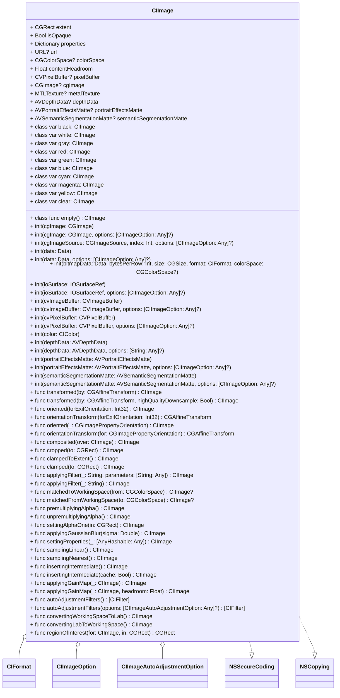
```mermaid
classDiagram
    class CIImage {
        + CGRect extent
        + Bool isOpaque
        + Dictionary<String, Any> properties
        + URL? url
        + CGColorSpace? colorSpace
        + Float contentHeadroom
        + CVPixelBuffer? pixelBuffer
        + CGImage? cgImage
        + MTLTexture? metalTexture
        + AVDepthData? depthData
        + AVPortraitEffectsMatte? portraitEffectsMatte
        + AVSemanticSegmentationMatte? semanticSegmentationMatte

        + class func empty() CIImage
        + class var black: CIImage
        + class var white: CIImage
        + class var gray: CIImage
        + class var red: CIImage
        + class var green: CIImage
        + class var blue: CIImage
        + class var cyan: CIImage
        + class var magenta: CIImage
        + class var yellow: CIImage
        + class var clear: CIImage

        + init(cgImage: CGImage)
        + init(cgImage: CGImage, options: [CIImageOption: Any]?)
        + init(cgImageSource: CGImageSource, index: Int, options: [CIImageOption: Any]?)
        + init(data: Data)
        + init(data: Data, options: [CIImageOption: Any]?)
        + init(bitmapData: Data, bytesPerRow: Int, size: CGSize, format: CIFormat, colorSpace: CGColorSpace?)
        + init(ioSurface: IOSurfaceRef)
        + init(ioSurface: IOSurfaceRef, options: [CIImageOption: Any]?)
        + init(cvImageBuffer: CVImageBuffer)
        + init(cvImageBuffer: CVImageBuffer, options: [CIImageOption: Any]?)
        + init(cvPixelBuffer: CVPixelBuffer)
        + init(cvPixelBuffer: CVPixelBuffer, options: [CIImageOption: Any]?)
        + init(color: CIColor)
        + init(depthData: AVDepthData)
        + init(depthData: AVDepthData, options: [String: Any]?)
        + init(portraitEffectsMatte: AVPortraitEffectsMatte)
        + init(portraitEffectsMatte: AVPortraitEffectsMatte, options: [CIImageOption: Any]?)
        + init(semanticSegmentationMatte: AVSemanticSegmentationMatte)
        + init(semanticSegmentationMatte: AVSemanticSegmentationMatte, options: [CIImageOption: Any]?)

        + func transformed(by: CGAffineTransform) CIImage
        + func transformed(by: CGAffineTransform, highQualityDownsample: Bool) CIImage
        + func oriented(forExifOrientation: Int32) CIImage
        + func orientationTransform(forExifOrientation: Int32) CGAffineTransform
        + func oriented(_: CGImagePropertyOrientation) CIImage
        + func orientationTransform(for: CGImagePropertyOrientation) CGAffineTransform
        + func composited(over: CIImage) CIImage
        + func cropped(to: CGRect) CIImage
        + func clampedToExtent() CIImage
        + func clamped(to: CGRect) CIImage
        + func applyingFilter(_: String, parameters: [String: Any]) CIImage
        + func applyingFilter(_: String) CIImage
        + func matchedToWorkingSpace(from: CGColorSpace) CIImage?
        + func matchedFromWorkingSpace(to: CGColorSpace) CIImage?
        + func premultiplyingAlpha() CIImage
        + func unpremultiplyingAlpha() CIImage
        + func settingAlphaOne(in: CGRect) CIImage
        + func applyingGaussianBlur(sigma: Double) CIImage
        + func settingProperties(_: [AnyHashable: Any]) CIImage
        + func samplingLinear() CIImage
        + func samplingNearest() CIImage
        + func insertingIntermediate() CIImage
        + func insertingIntermediate(cache: Bool) CIImage
        + func applyingGainMap(_: CIImage) CIImage
        + func applyingGainMap(_: CIImage, headroom: Float) CIImage
        + func autoAdjustmentFilters() [CIFilter]
        + func autoAdjustmentFilters(options: [CIImageAutoAdjustmentOption: Any]?) [CIFilter]
        + func convertingWorkingSpaceToLab() CIImage
        + func convertingLabToWorkingSpace() CIImage
        + func regionOfInterest(for: CIImage, in: CGRect) CGRect
    }

    CIImage o-- CIFormat
    CIImage o-- CIImageOption
    CIImage o-- CIImageAutoAdjustmentOption
    CIImage ..|> NSSecureCoding
    CIImage ..|> NSCopying
```

---

### CIFormat Enumeration

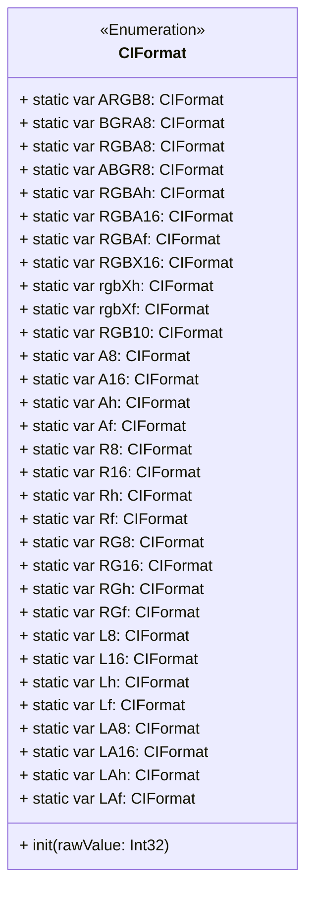
```mermaid
classDiagram
    class CIFormat {
        <<Enumeration>>
        + init(rawValue: Int32)

        + static var ARGB8: CIFormat
        + static var BGRA8: CIFormat
        + static var RGBA8: CIFormat
        + static var ABGR8: CIFormat
        + static var RGBAh: CIFormat
        + static var RGBA16: CIFormat
        + static var RGBAf: CIFormat
        + static var RGBX16: CIFormat
        + static var rgbXh: CIFormat
        + static var rgbXf: CIFormat
        + static var RGB10: CIFormat
        + static var A8: CIFormat
        + static var A16: CIFormat
        + static var Ah: CIFormat
        + static var Af: CIFormat
        + static var R8: CIFormat
        + static var R16: CIFormat
        + static var Rh: CIFormat
        + static var Rf: CIFormat
        + static var RG8: CIFormat
        + static var RG16: CIFormat
        + static var RGh: CIFormat
        + static var RGf: CIFormat
        + static var L8: CIFormat
        + static var L16: CIFormat
        + static var Lh: CIFormat
        + static var Lf: CIFormat
        + static var LA8: CIFormat
        + static var LA16: CIFormat
        + static var LAh: CIFormat
        + static var LAf: CIFormat
    }
```

---

### CIImageOption Enumeration

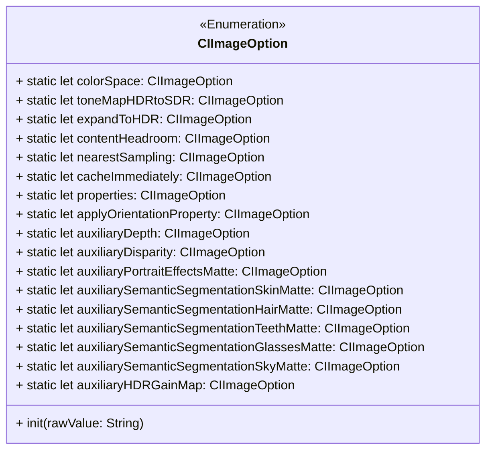
```mermaid
classDiagram
    class CIImageOption {
        <<Enumeration>>
        + init(rawValue: String)

        + static let colorSpace: CIImageOption
        + static let toneMapHDRtoSDR: CIImageOption
        + static let expandToHDR: CIImageOption
        + static let contentHeadroom: CIImageOption
        + static let nearestSampling: CIImageOption
        + static let cacheImmediately: CIImageOption
        + static let properties: CIImageOption
        + static let applyOrientationProperty: CIImageOption
        + static let auxiliaryDepth: CIImageOption
        + static let auxiliaryDisparity: CIImageOption
        + static let auxiliaryPortraitEffectsMatte: CIImageOption
        + static let auxiliarySemanticSegmentationSkinMatte: CIImageOption
        + static let auxiliarySemanticSegmentationHairMatte: CIImageOption
        + static let auxiliarySemanticSegmentationTeethMatte: CIImageOption
        + static let auxiliarySemanticSegmentationGlassesMatte: CIImageOption
        + static let auxiliarySemanticSegmentationSkyMatte: CIImageOption
        + static let auxiliaryHDRGainMap: CIImageOption
    }
```

---

### CIImageAutoAdjustmentOption Enumeration

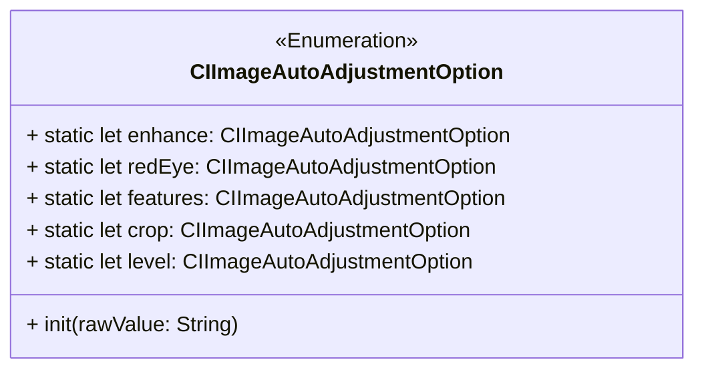
```mermaid
classDiagram
    class CIImageAutoAdjustmentOption {
        <<Enumeration>>
        + init(rawValue: String)

        + static let enhance: CIImageAutoAdjustmentOption
        + static let redEye: CIImageAutoAdjustmentOption
        + static let features: CIImageAutoAdjustmentOption
        + static let crop: CIImageAutoAdjustmentOption
        + static let level: CIImageAutoAdjustmentOption
    }
```

---

## **2. Initializers Overview**

### **a. Initialization Methods Diagram**
- **Purpose**: Break down the various ways to instantiate `CIImage`.
- **Diagram Type**: `flowchart` or `graph LR`
- **Contents**:
  - **URL-Based Initializers**: `init?(contentsOf:)`
  - **Data-Based Initializers**: `init?(data:)`
  - **Core Graphics Initializers**: `init(cgImage:)`
  - **Core Video Initializers**: `init(cvImageBuffer:)`
  - **Empty Image Initializer**: `init()`

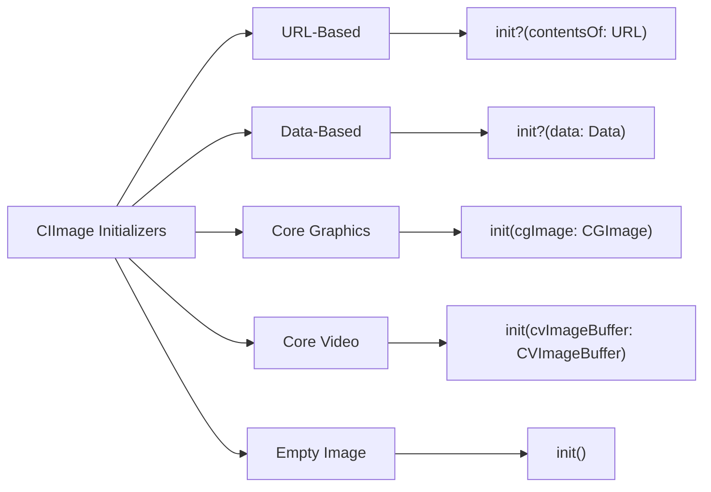
```mermaid
graph LR
    A[CIImage Initializers] --> B[URL-Based]
    A --> C[Data-Based]
    A --> D[Core Graphics]
    A --> E[Core Video]
    A --> F[Empty Image]
    
    B --> B1["init?(contentsOf: URL)"]
    
    C --> C1["init?(data: Data)"]
    
    D --> D1["init(cgImage: CGImage)"]
    
    E --> E1["init(cvImageBuffer: CVImageBuffer)"]
    
    F --> F1["init()"]
```

---

## **3. Properties Breakdown**

### **a. Key Properties Diagram**
- **Purpose**: Detail the main properties of `CIImage`.
- **Diagram Type**: `graph LR` or `classDiagram`
- **Contents**:
  - **Image Attributes**: `extent`, `properties`, `colorSpace`
  - **Format Information**: `format`, `alphaType`
  - **Metadata**: `orientation`, `backingScale`
  - **Rendering Details**: `foundationImage`, `provider`

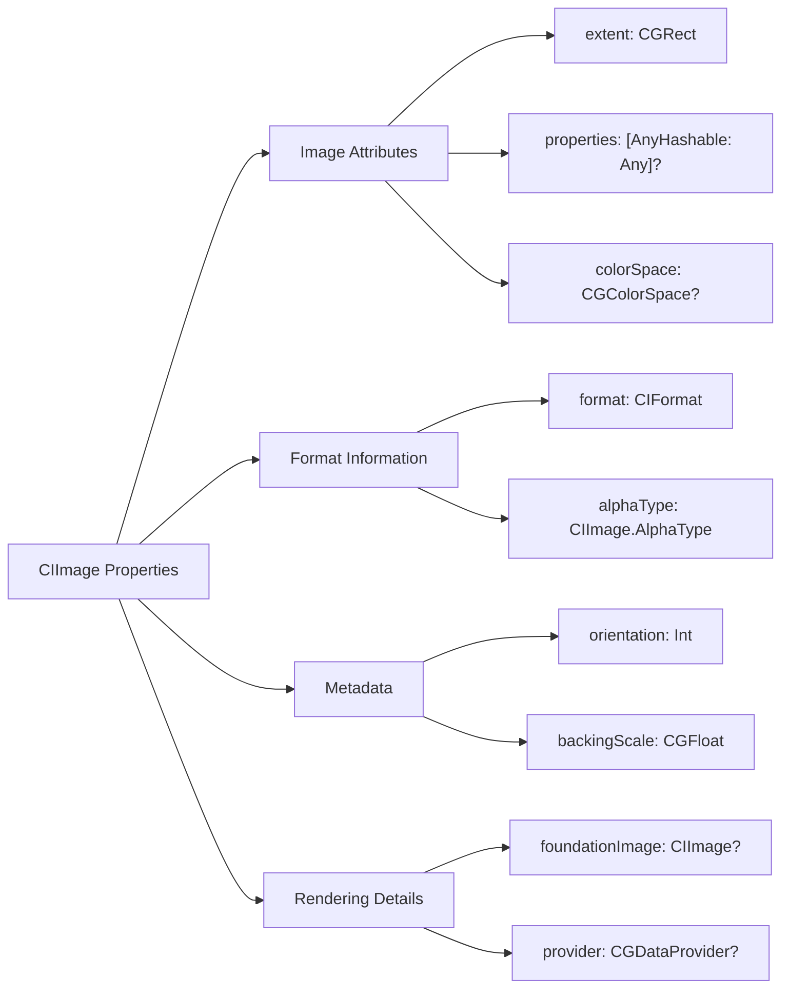
```mermaid
graph LR
    A[CIImage Properties] --> B[Image Attributes]
    A --> C[Format Information]
    A --> D[Metadata]
    A --> E[Rendering Details]
    
    B --> B1[extent: CGRect]
    B --> B2["properties: [AnyHashable: Any]?"]
    B --> B3[colorSpace: CGColorSpace?]
    
    C --> C1[format: CIFormat]
    C --> C2[alphaType: CIImage.AlphaType]
    
    D --> D1[orientation: Int]
    D --> D2[backingScale: CGFloat]
    
    E --> E1[foundationImage: CIImage?]
    E --> E2[provider: CGDataProvider?]
    
```

---

## **4. Methods Grouped by Functionality**

### **a. Image Manipulation Methods**
- **Purpose**: Categorize methods based on their roles in image manipulation.
- **Diagram Type**: `flowchart TD`
- **Contents**:
  - **Filtering Methods**: `applyingFilter(_:parameters:)`, `applyingGaussianBlur(sigma:)`
  - **Transformation Methods**: `cropped(to:)`, `transformed(by:)`, `oriented(_:),`
  - **Compositing Methods**: `composited(over:)`, `applyingBlendMode(_:`
  - **Color Adjustment Methods**: `applyingFilter(_:withInputParameters:)`
  - **Metadata Management**: `applyingOrientation(_:)`, `applyingAlpha(_:)`

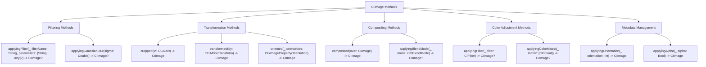
```mermaid
flowchart TD
    A[CIImage Methods] --> B[Filtering Methods]
    A --> C[Transformation Methods]
    A --> D[Compositing Methods]
    A --> E[Color Adjustment Methods]
    A --> F[Metadata Management]

    B --> B1["applyingFilter(_ filterName: String, parameters: [String: Any]?) -> CIImage?"]
    B --> B2["applyingGaussianBlur(sigma: Double) -> CIImage?"]
    
    C --> C1["cropped(to: CGRect) -> CIImage"]
    C --> C2["transformed(by: CGAffineTransform) -> CIImage"]
    C --> C3["oriented(_ orientation: CGImagePropertyOrientation) -> CIImage"]
    
    D --> D1["composited(over: CIImage) -> CIImage"]
    D --> D2["applyingBlendMode(_ mode: CGBlendMode) -> CIImage?"]
    
    E --> E1["applyingFilter(_ filter: CIFilter) -> CIImage?"]
    E --> E2["applyingColorMatrix(_ matrix: [CGFloat]) -> CIImage?"]
    
    F --> F1["applyingOrientation(_ orientation: Int) -> CIImage"]
    F --> F2["applyingAlpha(_ alpha: Bool) -> CIImage"]
```

---

## **5. Enumerations and Configurations**

### **a. Enumerations Diagram**
- **Purpose**: Highlight the enums used within `CIImage` and their possible values.
- **Diagram Type**: `classDiagram`
- **Contents**:
  - **CIFormat**
  - **AlphaType**
  - **InterpolationQuality**

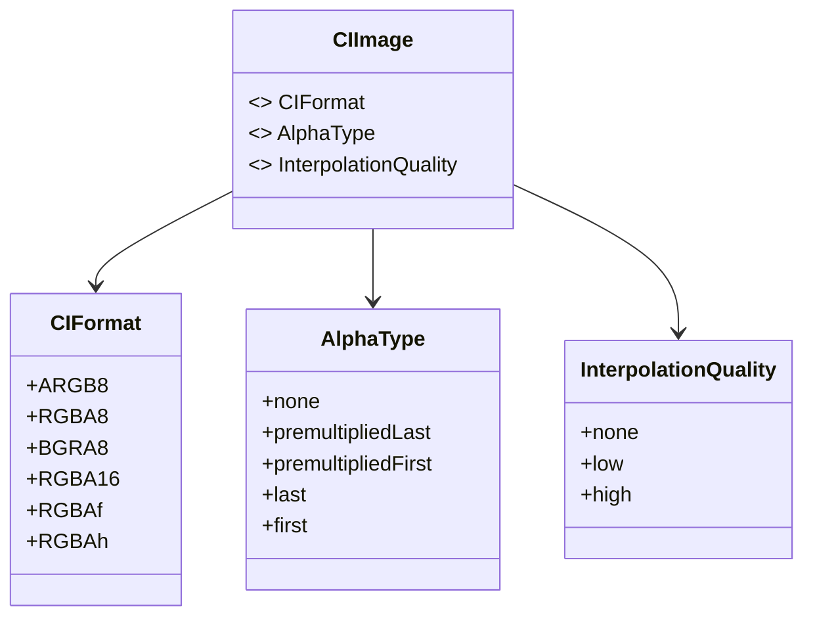
```mermaid
classDiagram
    class CIImage {
        <<enumeration>> CIFormat
        <<enumeration>> AlphaType
        <<enumeration>> InterpolationQuality
    }

    class CIFormat {
        +ARGB8
        +RGBA8
        +BGRA8
        +RGBA16
        +RGBAf
        +RGBAh
    }

    class AlphaType {
        +none
        +premultipliedLast
        +premultipliedFirst
        +last
        +first
    }

    class InterpolationQuality {
        +none
        +low
        +high
    }

    CIImage --> CIFormat
    CIImage --> AlphaType
    CIImage --> InterpolationQuality
```

### **b. Configuration Classes Diagram**
- **Purpose**: Show the relationship between `CIImage` and its configuration classes.
- **Diagram Type**: `classDiagram`
- **Contents**:
  - **CIContext**
  - **CIFilter**

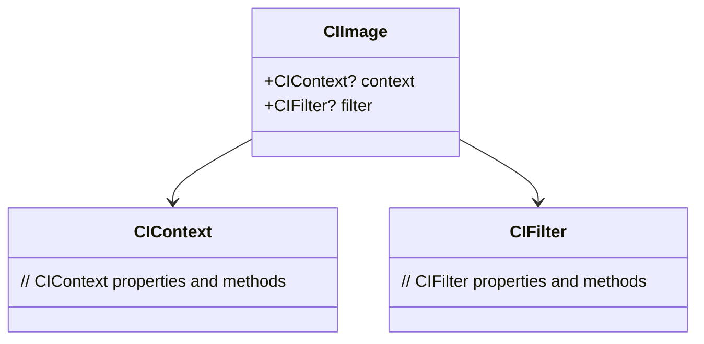
```mermaid
classDiagram
    class CIImage {
        +CIContext? context
        +CIFilter? filter
    }

    class CIContext {
        // CIContext properties and methods
    }

    class CIFilter {
        // CIFilter properties and methods
    }

    CIImage --> CIContext
    CIImage --> CIFilter
```

---

## **6. Protocol Conformances**

### **a. Protocols Diagram**
- **Purpose**: Display the protocols that `CIImage` conforms to and their impact.
- **Diagram Type**: `classDiagram`
- **Contents**:
  - **NSSecureCoding**
  - **NSCopying**
  - **Encodable**
  - **Decodable**
  - **Sendable**

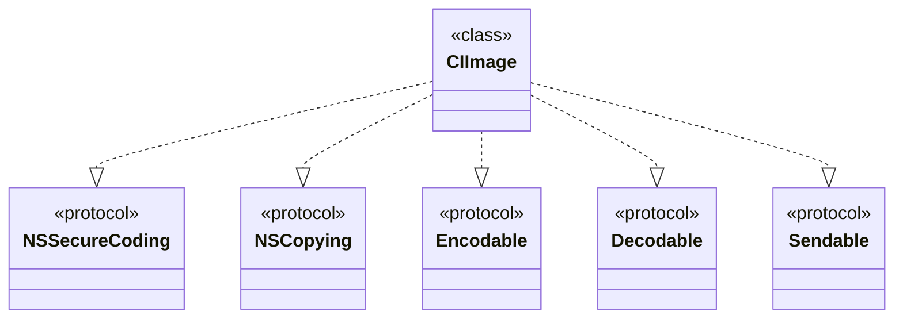
```mermaid
classDiagram
    class CIImage {
        <<class>>
    }

    class NSSecureCoding {
        <<protocol>>
    }

    class NSCopying {
        <<protocol>>
    }

    class Encodable {
        <<protocol>>
    }

    class Decodable {
        <<protocol>>
    }

    class Sendable {
        <<protocol>>
    }

    CIImage ..|> NSSecureCoding
    CIImage ..|> NSCopying
    CIImage ..|> Encodable
    CIImage ..|> Decodable
    CIImage ..|> Sendable
```

---

## **7. Relationships with Other Classes**

### **a. Related Classes Diagram**
- **Purpose**: Illustrate how `CIImage` interacts with other Core Image and system classes.
- **Diagram Type**: `flowchart TD`
- **Contents**:
  - **CIContext**: Renders `CIImage`.
  - **CIFilter**: Applies filters to `CIImage`.
  - **CGImage**: Core Graphics interoperability.
  - **CVPixelBuffer**: Core Video buffer usage.
  - **UIColor**: Color manipulation.
  - **UIImage**: Conversion between `UIImage` and `CIImage`.
  - **CIColorSpace**: Defines color spaces.
  - **CIVector**: Represents vectors for transformations.

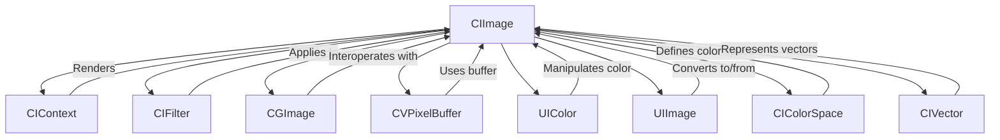
```mermaid
flowchart TD
    A[CIImage] --> B[CIContext]
    A --> C[CIFilter]
    A --> D[CGImage]
    A --> E[CVPixelBuffer]
    A --> F[UIColor]
    A --> G[UIImage]
    A --> H[CIColorSpace]
    A --> I[CIVector]

    B --> |Renders| A
    C --> |Applies to| A
    D --> |Interoperates with| A
    E --> |Uses buffer| A
    F --> |Manipulates color| A
    G --> |Converts to/from| A
    H --> |Defines color space| A
    I --> |Represents vectors| A
```

---

## **8. Extensions and Additional Functionalities**

### **a. CIImage Extensions Diagram**
- **Purpose**: Showcase the additional functionalities provided through extensions.
- **Diagram Type**: `classDiagram`
- **Contents**:
  - **Helper Functions**
  - **Advanced Filtering**
  - **Transformation Utilities**

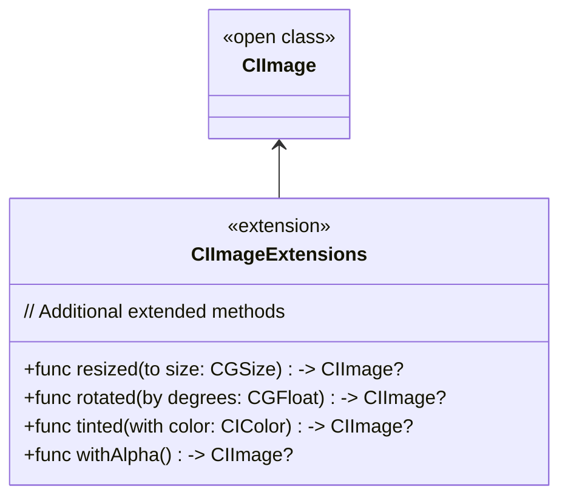
```mermaid
classDiagram
    class CIImage {
        <<open class>>
    }

    class CIImageExtensions {
        <<extension>>
        +func resized(to size: CGSize) -> CIImage?
        +func rotated(by degrees: CGFloat) -> CIImage?
        +func tinted(with color: CIColor) -> CIImage?
        +func withAlpha() -> CIImage?
        // Additional extended methods
    }

    CIImage <-- CIImageExtensions
```

### **b. Extensions Functionalities Flowchart**
- **Purpose**: Detail specific extended methods and their purposes.
- **Diagram Type**: `flowchart LR`
- **Contents**:
  - **Image Resizing**
  - **Image Rotation**
  - **Color Tinting**
  - **Alpha Handling**

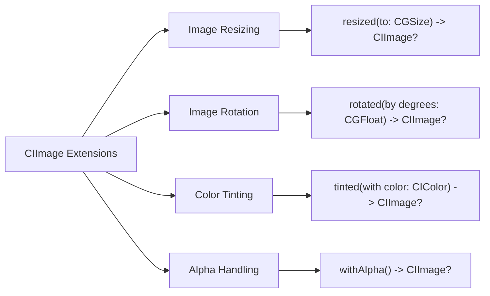
```mermaid
flowchart LR
    A[CIImage Extensions] --> B[Image Resizing]
    A --> C[Image Rotation]
    A --> D[Color Tinting]
    A --> E[Alpha Handling]

    B --> B1["resized(to: CGSize) -> CIImage?"]
    C --> C1["rotated(by degrees: CGFloat) -> CIImage?"]
    D --> D1["tinted(with color: CIColor) -> CIImage?"]
    E --> E1["withAlpha() -> CIImage?"]
```

---

## **9. Lifecycle and Use Cases**

### **a. Lifecycle Flowchart**
- **Purpose**: Demonstrate the typical lifecycle of a `CIImage` within an application.
- **Diagram Type**: `flowchart TD`
- **Contents**:
  - **Initialization**
  - **Filter Application**
  - **Rendering**
  - **Display or Saving**
  - **Caching**
  - **Cleanup**

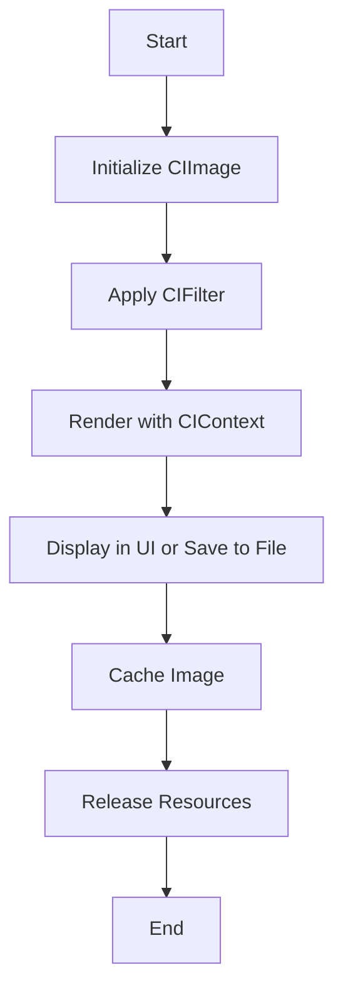
```mermaid
flowchart TD
    Start[Start] --> Init[Initialize CIImage]
    Init --> ApplyFilter[Apply CIFilter]
    ApplyFilter --> Render[Render with CIContext]
    Render --> DisplayOrSave[Display in UI or Save to File]
    DisplayOrSave --> Cache[Cache Image]
    Cache --> Cleanup[Release Resources]
    Cleanup --> End[End]
```

### **b. Common Use Cases Diagram**
- **Purpose**: Outline the typical scenarios where `CIImage` is utilized.
- **Diagram Type**: `flowchart TD`
- **Contents**:
  - **Image Processing**
  - **Applying Filters**
  - **Image Transformation**
  - **Color Adjustments**
  - **Compositing Images**
  - **Generating Thumbnails**
  - **Integrating with UI**

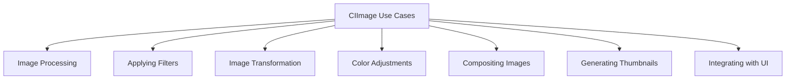
```mermaid
flowchart TD
    A[CIImage Use Cases] --> B[Image Processing]
    A --> C[Applying Filters]
    A --> D[Image Transformation]
    A --> E[Color Adjustments]
    A --> F[Compositing Images]
    A --> G[Generating Thumbnails]
    A --> H[Integrating with UI]
```

---

## **10. Feature Availability Timeline**

### **a. Feature Availability Gantt Chart**
- **Purpose**: Show when various `CIImage` features were introduced across iOS versions.
- **Diagram Type**: `gantt`
- **Contents**:
  - **iOS Versions**: 5.0, 7.0, 8.0, 9.0, 10.0, 11.0, 12.0, 13.0, 14.0, 15.0, 16.0, 17.0
  - **Features Introduced**: Core initializers, advanced filters, GPU acceleration, support for new image formats, optimized transformations, etc.

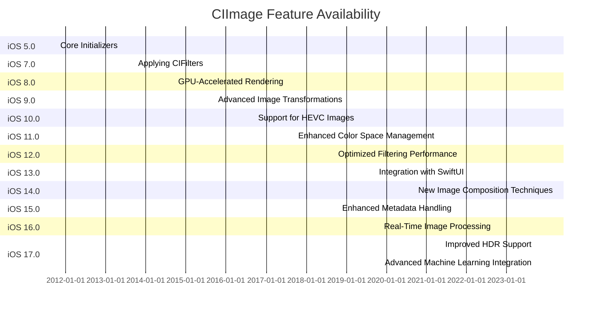
```mermaid
gantt
    dateFormat  YYYY-MM-DD
    title CIImage Feature Availability

    section iOS 5.0
    Core Initializers                  :done, des1, 2011-10-12, 2011-10-12

    section iOS 7.0
    Applying CIFilters                  :done, des2, 2013-09-18, 2013-09-18

    section iOS 8.0
    GPU-Accelerated Rendering           :done, des3, 2014-09-17, 2014-09-17

    section iOS 9.0
    Advanced Image Transformations      :done, des4, 2015-09-16, 2015-09-16

    section iOS 10.0
    Support for HEVC Images             :done, des5, 2016-09-19, 2016-09-19

    section iOS 11.0
    Enhanced Color Space Management     :done, des6, 2017-09-19, 2017-09-19

    section iOS 12.0
    Optimized Filtering Performance     :done, des7, 2018-09-17, 2018-09-17

    section iOS 13.0
    Integration with SwiftUI           :done, des8, 2019-09-19, 2019-09-19

    section iOS 14.0
    New Image Composition Techniques    :done, des9, 2020-09-16, 2020-09-16

    section iOS 15.0
    Enhanced Metadata Handling         :done, des10, 2021-09-20, 2021-09-20

    section iOS 16.0
    Real-Time Image Processing         :done, des11, 2022-09-12, 2022-09-12

    section iOS 17.0
    Improved HDR Support                :done, des12, 2023-09-18, 2023-09-18
    Advanced Machine Learning Integration :done, des13, 2023-09-18, 2023-09-18
```

---

## **11. Data Handling and Formats**

### **a. Image Format Handling Diagram**
- **Purpose**: Explain how `CIImage` handles different image data formats.
- **Diagram Type**: `graph LR`
- - **Contents**:
  - **PNG**
  - **JPEG**
  - **HEIC**
  - **TIFF**
  - **RAW Formats**
  - **Other Supported Formats**

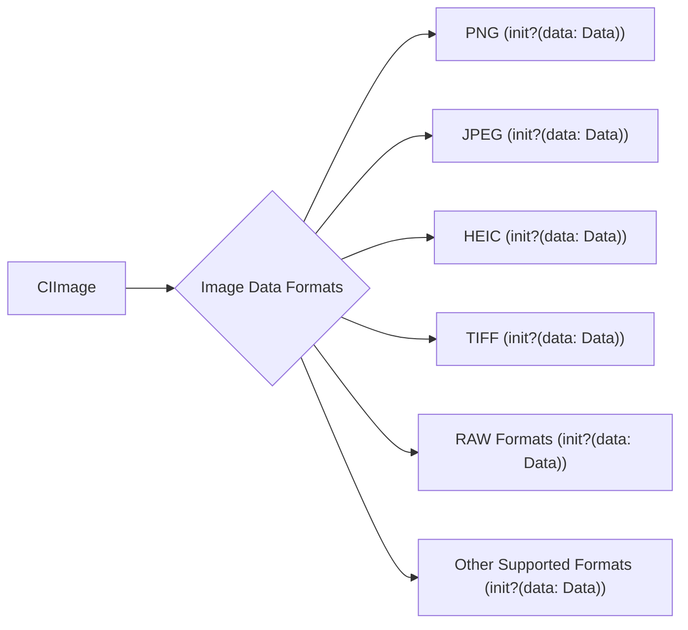
```mermaid
graph LR
    A[CIImage] --> B{Image Data Formats}
    B --> C["PNG (init?(data: Data))"]
    B --> D["JPEG (init?(data: Data))"]
    B --> E["HEIC (init?(data: Data))"]
    B --> F["TIFF (init?(data: Data))"]
    B --> G["RAW Formats (init?(data: Data))"]
    B --> H["Other Supported Formats (init?(data: Data))"]
```

---

## **12. Integration with Drawing Contexts**

### **a. Drawing Methods Usage Diagram**
- **Purpose**: Show how `CIImage` methods are used within drawing contexts.
- **Diagram Type**: `flowchart TD`
- **Contents**:
  - **Rendering to CGContext**
  - **Drawing with Core Graphics**
  - **Compositing with Other Images**
  - **Applying Transformations**

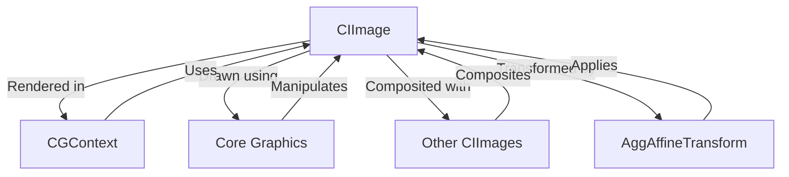
```mermaid
flowchart TD
    CIImage -->|Rendered in| CGContext[CGContext]
    CIImage -->|Drawn using| CoreGraphics[Core Graphics]
    CIImage -->|Composited with| OtherImages[Other CIImages]
    CIImage -->|Transformed by| Transformations[AggAffineTransform]
    
    CGContext --> |Uses| CIImage
    CoreGraphics --> |Manipulates| CIImage
    OtherImages --> |Composites| CIImage
    Transformations --> |Applies| CIImage
```

---

## **13. Summary and Best Practices**

### **a. Summary Diagram**
- **Purpose**: Provide a high-level overview of `CIImage`'s key characteristics and functionalities.
- **Diagram Type**: `graph LR` or `mindmap`
- **Contents**:
  - **Versatile Initialization**
  - **Advanced Image Processing**
  - **Seamless Integration with Core Image**
  - **Performance Optimizations**
  - **Extensible through Extensions**
  - **Robust Data Handling**

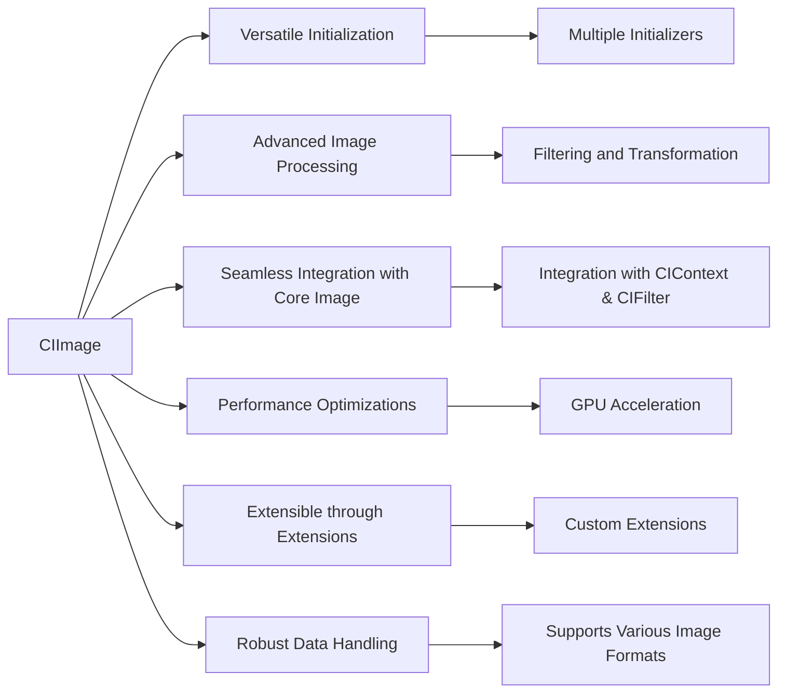
```mermaid
graph LR
    A[CIImage] --> B[Versatile Initialization]
    A --> C[Advanced Image Processing]
    A --> D[Seamless Integration with Core Image]
    A --> E[Performance Optimizations]
    A --> F[Extensible through Extensions]
    A --> G[Robust Data Handling]
    
    B --> B1[Multiple Initializers]
    C --> C1[Filtering and Transformation]
    D --> D1[Integration with CIContext & CIFilter]
    E --> E1[GPU Acceleration]
    F --> F1[Custom Extensions]
    G --> G1[Supports Various Image Formats]
```

---
