# CloudKit
> This content is dual-licensed under your choice of the following licenses:
> 1.  **MIT License:** For the code implementations in Swift and Mermaid provided in this document.
> 2.  **Creative Commons Attribution 4.0 International License (CC BY 4.0):** For all other content, including the text, explanations, and the Mermaid diagrams and illustrations.

---

## **1. Class Structure and Hierarchy**

### **a. Core Class Diagram**
- **Purpose**: Illustrate the primary structure of `CloudKit`, including its major classes, their properties, methods, and enumerations.
- **Diagram Type**: `classDiagram`
- **Contents**:
  - **Classes**: `CKContainer`, `CKDatabase`, `CKRecord`, `CKRecordID`, `CKQuery`, `CKSubscription`
  - **Properties**: Key attributes like `identifier`, `defaultDatabase`, `publicDatabase`, etc.
  - **Methods**: Essential functions like `fetchRecord`, `saveRecord`, `performQuery`, etc.
  - **Enumerations**: Nested enums such as `CKQueryOperation.ResultType`, `CKSubscription.SubscriptionType`, etc.

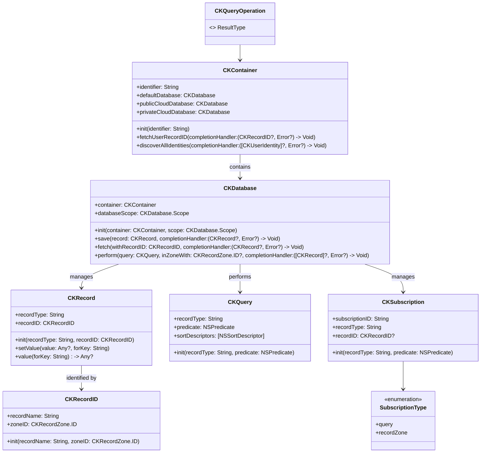

---

## **2. Initializers Overview**

### **a. Initialization Methods Diagram**
- **Purpose**: Break down the various ways to instantiate CloudKit classes.
- **Diagram Type**: `flowchart LR`
- **Contents**:
  - **Container Initialization**: `init(identifier:)`
  - **Database Initialization**: `init(container:scope:)`
  - **Record Initialization**: `init(recordType:recordID:)`
  - **Record ID Initialization**: `init(recordName:zoneID:)`
  - **Query Initialization**: `init(recordType:predicate:)`
  - **Subscription Initialization**: `init(recordType:predicate:)`

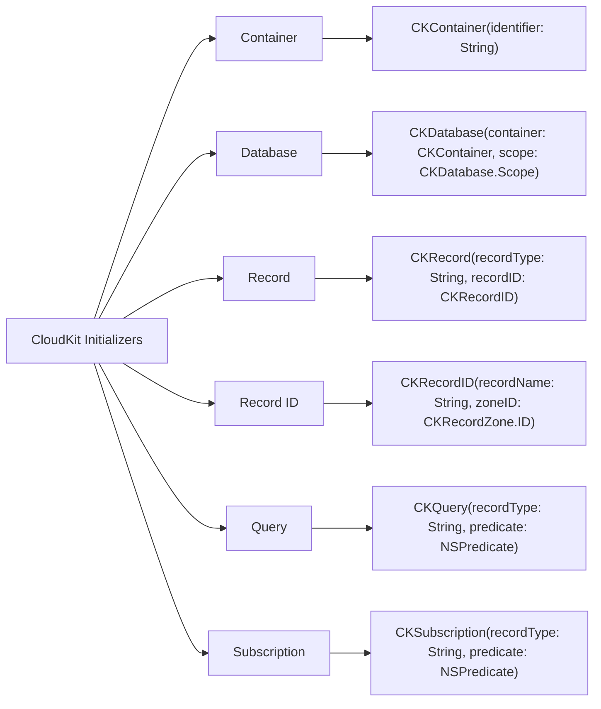

---

## **3. Properties Breakdown**

### **a. Key Properties Diagram**
- **Purpose**: Detail the main properties of key CloudKit classes.
- **Diagram Type**: `graph LR`
- **Contents**:
  - **CKContainer**: `identifier`, `defaultDatabase`, `publicCloudDatabase`, `privateCloudDatabase`
  - **CKDatabase**: `container`, `databaseScope`
  - **CKRecord**: `recordType`, `recordID`, `fields`
  - **CKRecordID**: `recordName`, `zoneID`
  - **CKQuery**: `recordType`, `predicate`, `sortDescriptors`

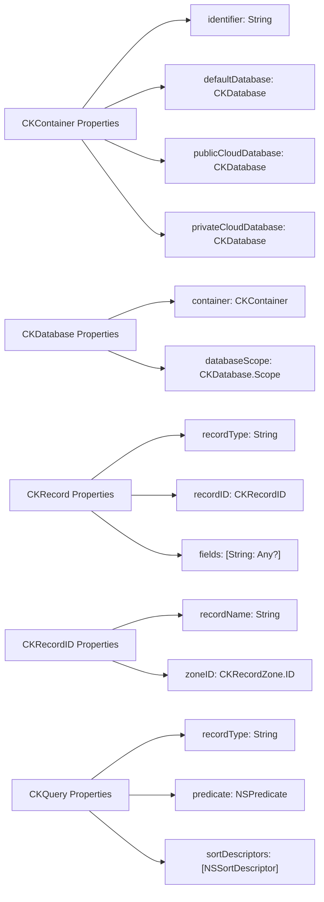

---

## **4. Methods Grouped by Functionality**

### **a. Record Management Methods**
- **Purpose**: Categorize methods based on their roles in managing records within CloudKit.
- **Diagram Type**: `flowchart TD`
- **Contents**:
  - **Saving Records**: `save(_:completionHandler:)`
  - **Fetching Records**: `fetch(withRecordID:completionHandler:)`
  - **Deleting Records**: `delete(withRecordID:completionHandler:)`
  - **Modifying Records**: `modifyRecords(_:savePolicy:completionHandler:)`

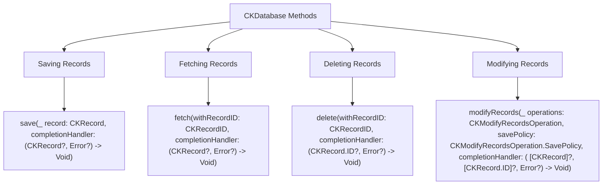

---

## **5. Enumerations and Configurations**

### **a. Enumerations Diagram**
- **Purpose**: Highlight the enums used within CloudKit and their possible values.
- **Diagram Type**: `classDiagram`
- **Contents**:
  - **CKDatabase.Scope**
  - **CKSubscription.SubscriptionType**
  - **CKQueryOperation.ResultType**
  - **CKRecordZone.ID.ZoneName**

## TODO: Fix the diagram syntax
```mermaid
classDiagram
    class CKDatabase {
        <<enumeration>> Scope
    }

    class CKSubscription {
        <<enumeration>> SubscriptionType
    }

    class CKQueryOperation {
        <<enumeration>> ResultType
    }

    class CKRecordZone {
        class ID {
            <<enumeration>> ZoneName
        }
    }

    CKDatabase.Scope : +private
    CKDatabase.Scope : +public
    CKDatabase.Scope : +shared

    CKSubscription.SubscriptionType : +query
    CKSubscription.SubscriptionType : +recordZone

    CKQueryOperation.ResultType : +CKQueryOperationResultTypeCKQueryOperationResultTypePartialResults
    CKQueryOperation.ResultType : +CKQueryOperationResultTypeCKQueryOperationResultTypeResults

    CKRecordZone.ID.ZoneName : +defaultZone
    CKRecordZone.ID.ZoneName : +customZone
    
```


### **b. Configuration Classes Diagram**
- **Purpose**: Show the relationship between CloudKit classes and their configuration classes.
- **Diagram Type**: `classDiagram`
- **Contents**:
  - **CKRecordZone.ID**
  - **CKModifyRecordsOperation**
  - **CKQueryOperation**

## TODO: Fix the diagram syntax
```mermaid
classDiagram
    class CKContainer {
        +configurations: [CKContainerConfiguration]
    }

    class CKRecordZone {
        class ID {
            +zoneName: String
            +ownerName: String
        }
    }

    class CKModifyRecordsOperation {
        +savePolicy: CKModifyRecordsOperation.SavePolicy
    }

    class CKQueryOperation {
        +resultsLimit: Int
        +resultType: CKQueryOperation.ResultType
    }

    CKContainer --> CKRecordZone.ID
    CKModifyRecordsOperation --> CKContainer
    CKQueryOperation --> CKContainer
```

---

## **6. Protocol Conformances**

### **a. Protocols Diagram**
- **Purpose**: Display the protocols that CloudKit classes conform to and their impact.
- **Diagram Type**: `classDiagram`
- **Contents**:
  - **CKRecordValue**
  - **NSSecureCoding**
  - **Encodable**
  - **Decodable**
  - **Sendable**

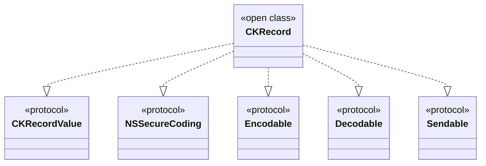

---

## **7. Relationships with Other Classes**

### **a. Related Classes Diagram**
- **Purpose**: Illustrate how CloudKit interacts with other Apple frameworks and classes.
- **Diagram Type**: `flowchart TD`
- **Contents**:
  - **NSPredicate**: Used in queries
  - **NSSortDescriptor**: Sorting query results
  - **NSObject**: Base class for many classes
  - **NSError**: Error handling
  - **UIApplication**: Interaction with app lifecycle
  - **UserNotifications**: Push notifications for subscriptions

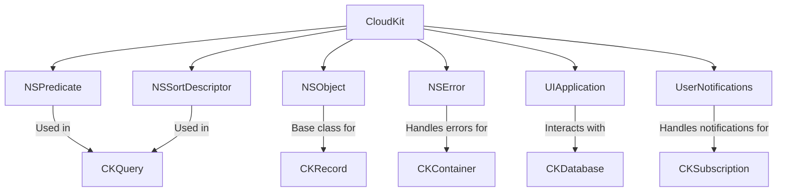

---

## **8. Extensions and Additional Functionalities**

### **a. CloudKit Extensions Diagram**
- **Purpose**: Showcase the additional functionalities provided through extensions in CloudKit.
- **Diagram Type**: `classDiagram`
- **Contents**:
  - **CKRecord Extensions**
  - **CKDatabase Extensions**
  - **CKSubscription Extensions**

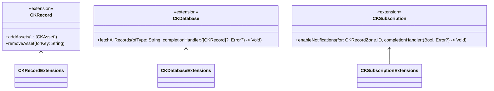

### **b. Extensions Functionalities Flowchart**
- **Purpose**: Detail specific extended methods and their purposes.
- **Diagram Type**: `flowchart LR`
- **Contents**:
  - **Asset Management**
  - **Bulk Fetching**
  - **Notification Handling**

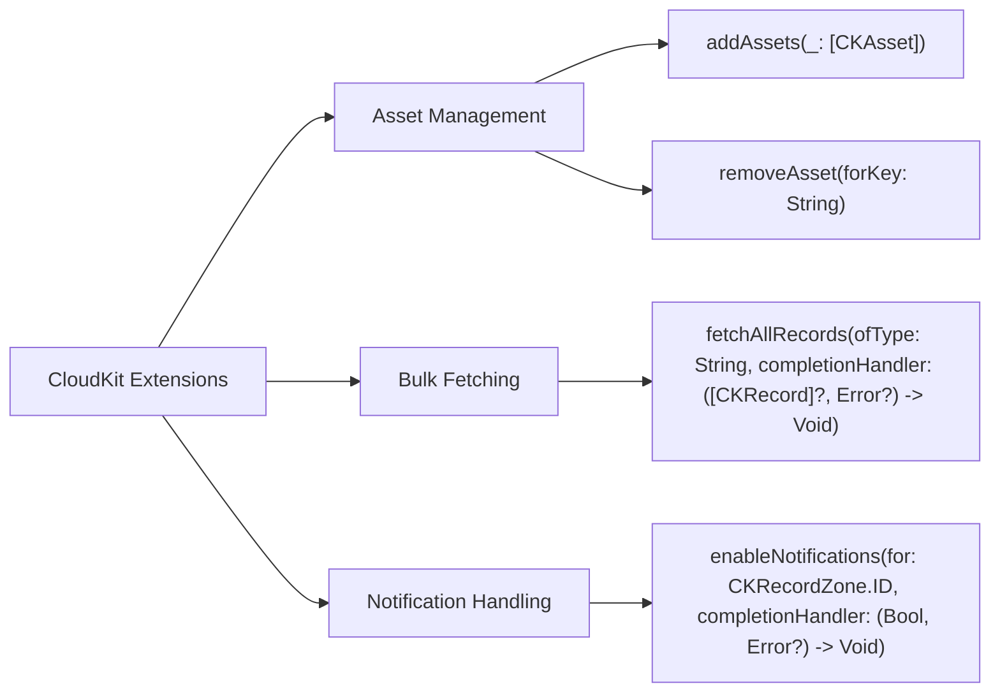

---

## **9. Lifecycle and Use Cases**

### **a. Lifecycle Flowchart**
- **Purpose**: Demonstrate the typical lifecycle of a `CKRecord` within an application.
- **Diagram Type**: `flowchart TD`
- **Contents**:
  - **Creation**
  - **Saving**
  - **Fetching**
  - **Updating**
  - **Deleting**
  - **Caching**
  - **Synchronization**

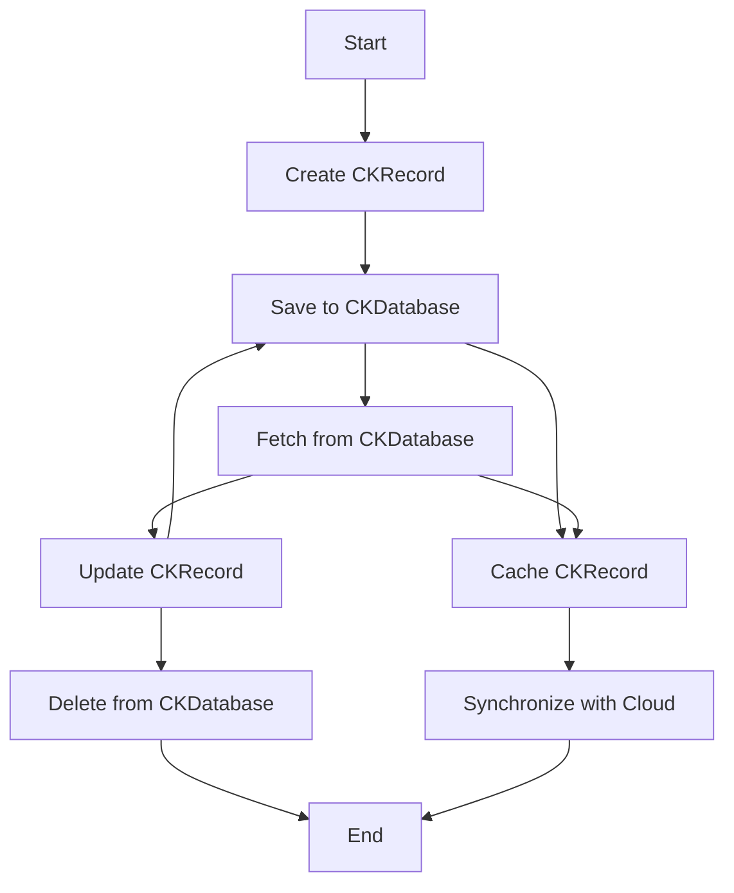

### **b. Common Use Cases Diagram**
- **Purpose**: Outline the typical scenarios where CloudKit is utilized.
- **Diagram Type**: `flowchart TD`
- **Contents**:
  - **User Data Storage**
  - **App Data Synchronization**
  - **Push Notifications**
  - **Asset Management**
  - **Subscription-based Updates**
  - **Public and Private Databases**

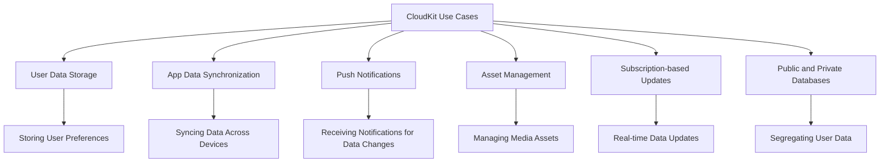

---

## **10. Feature Availability Timeline**

### **a. Feature Availability Gantt Chart**
- **Purpose**: Show when various CloudKit features were introduced across iOS versions.
- **Diagram Type**: `gantt`
- **Contents**:
  - **iOS Versions**: 8.0, 10.0, 11.0, 12.0, 13.0, 14.0, 15.0, 16.0, 17.0
  - **Features Introduced**: Basic container and database, subscriptions, CKQueryOperation enhancements, asset support, CloudKit Dashboard, sharing, user discoverability, CKRecordZone, etc.

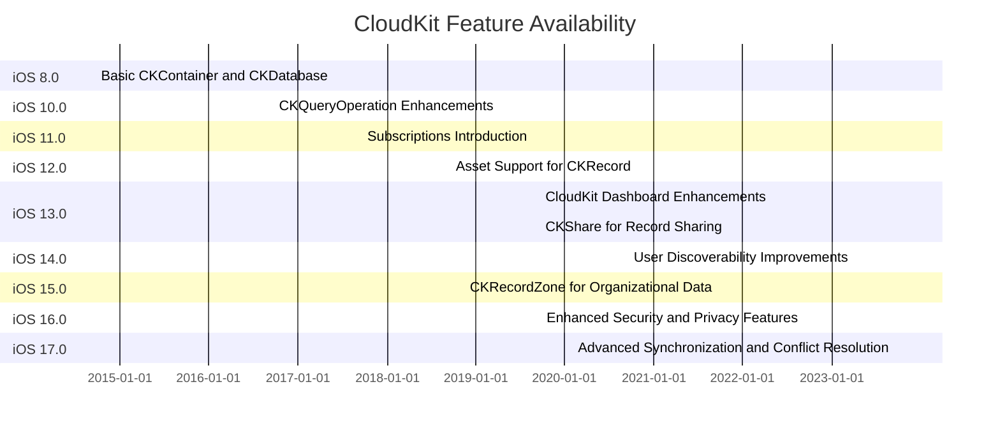

---

## **11. Data Handling and Formats**

### **a. Data Format Handling Diagram**
- **Purpose**: Explain how CloudKit handles different data types and formats.
- **Diagram Type**: `graph LR`
- **Contents**:
  - **Primitive Types**: `String`, `Int`, `Double`, `Bool`, etc.
  - **Asset Handling**: `CKAsset` for files
  - **Dates and Times**: `Date`
  - **References**: `CKReference` for linked records
  - **Locations**: `CLLocation`
  - **Custom Types**: `NSData`, `NSNumber`, etc.

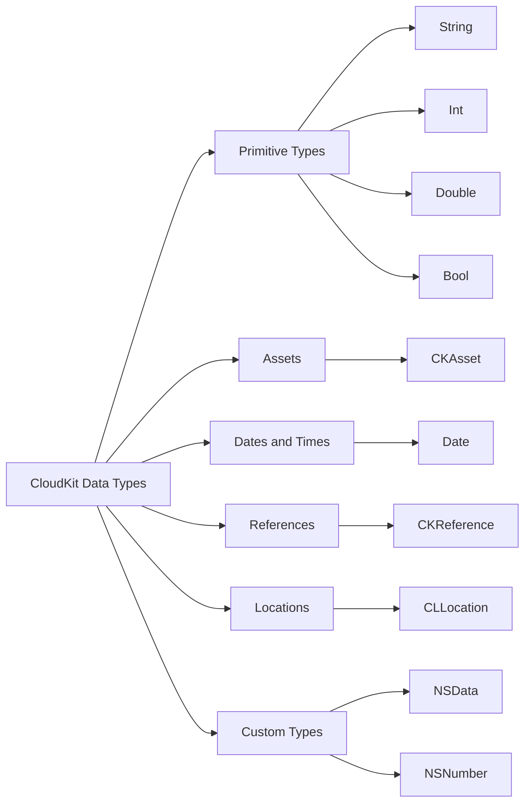

---

## **12. Integration with Other Frameworks**

### **a. Integration Diagram**
- **Purpose**: Show how CloudKit integrates with other Apple frameworks and services.
- **Diagram Type**: `flowchart TD`
- **Contents**:
  - **Core Data**: Syncing local data with CloudKit
  - **UserNotifications**: Handling push notifications for subscriptions
  - **AuthenticationServices**: User authentication for CloudKit access
  - **SwiftUI/UIKit**: Displaying CloudKit data in UI components
  - **Combine**: Reactive programming with CloudKit operations

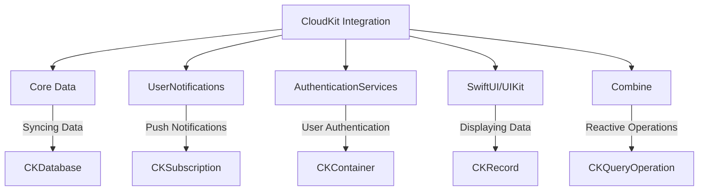

---

## **13. Summary and Best Practices**

### **a. Summary Diagram**
- **Purpose**: Provide a high-level overview of CloudKit's key characteristics and functionalities.
- **Diagram Type**: `graph LR`
- **Contents**:
  - **Seamless Cloud Integration**
  - **Robust Data Management**
  - **Efficient Synchronization**
  - **Scalable Subscriptions**
  - **Enhanced Security**
  - **Comprehensive API Support**

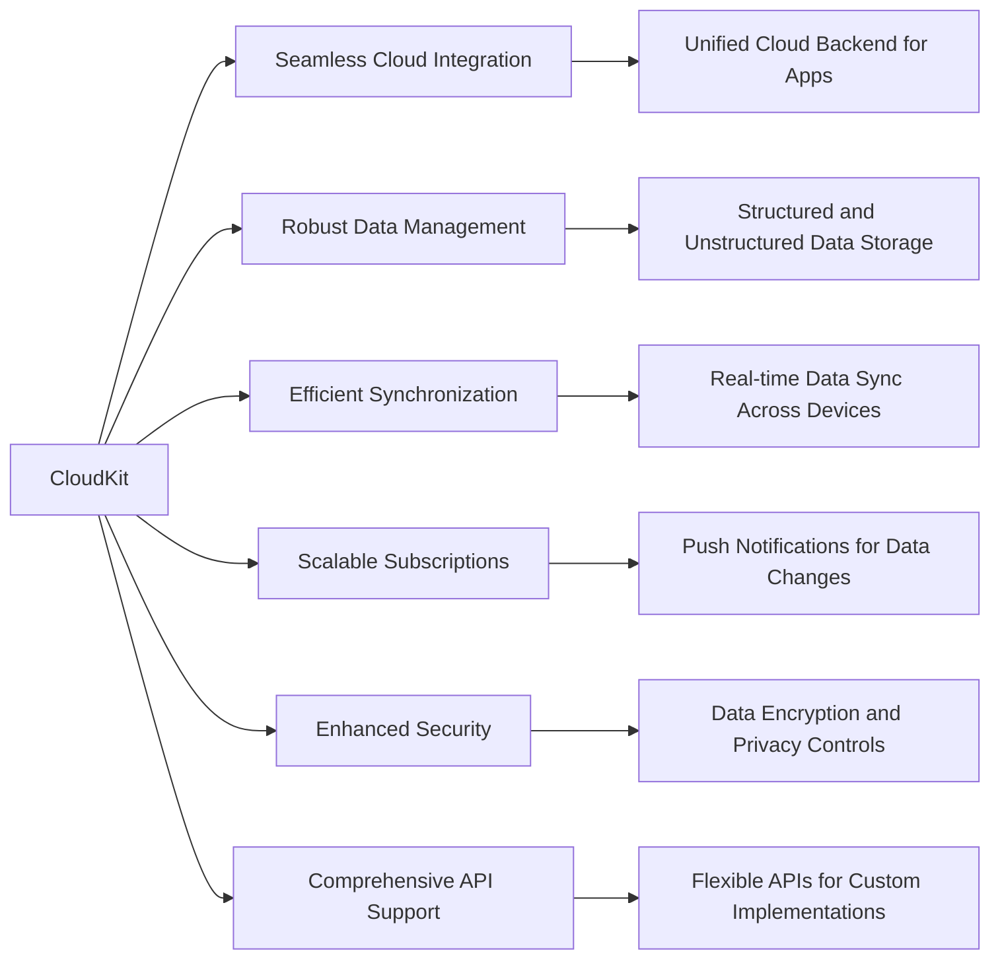

---

## **Best Practices for Using CloudKit**

### **a. Data Modeling**
- **Use Structured Record Types**: Define clear record types with specific fields to ensure data consistency.
- **Optimize Relationships**: Use `CKReference` wisely to link records without creating circular dependencies.
- **Leverage CKRecordZone**: Organize data into zones for better scalability and conflict resolution.

### **b. Performance Optimization**
- **Batch Operations**: Use batch saves and deletes to reduce network overhead.
- **Efficient Queries**: Index frequently queried fields and use predicates effectively.
- **Caching Strategies**: Implement local caching to minimize unnecessary network requests.

### **c. Security and Privacy**
- **Use Appropriate Database Scope**: Choose between public, private, and shared databases based on data sensitivity.
- **Handle Permissions Carefully**: Ensure that users have granted necessary permissions for data access.
- **Encrypt Sensitive Data**: Utilize `CKAsset` for storing large or sensitive files securely.

### **d. Error Handling**
- **Graceful Failures**: Implement robust error handling to manage network issues and data conflicts.
- **Retry Mechanisms**: Automatically retry failed operations where appropriate.
- **User Feedback**: Inform users of issues and provide actionable feedback when errors occur.

### **e. Testing and Debugging**
- **Use CloudKit Dashboard**: Monitor database usage and manage records during development.
- **Simulate Network Conditions**: Test app behavior under various network scenarios.
- **Automate Testing**: Incorporate CloudKit operations into your automated testing suite to ensure reliability.

By adhering to these best practices and leveraging the comprehensive capabilities of CloudKit, developers can create robust, scalable, and secure applications that seamlessly integrate with Apple's cloud infrastructure.

---
