# ColorSync

Below is a comprehensive and organized set of Mermaid diagrams for the `ColorSync` class. These diagrams cover various aspects of the `ColorSync` class, including its structure, initialization methods, properties, methods, enumerations, protocol conformances, relationships with other classes, extensions, lifecycle, feature availability, data handling, integration with drawing contexts, and best practices.

---

## **1. Class Structure and Hierarchy**

### **a. Core Class Diagram**
- **Purpose**: Illustrate the primary structure of `ColorSync`, including its properties, methods, and enumerations.
- **Diagram Type**: `classDiagram`
- **Contents**:
  - **Properties**: Key attributes like `profileName`, `colorSpace`, `gamma`, etc.
  - **Methods**: Essential functions like initializers, `convertColor()`, `validateProfile()`, etc.
  - **Enumerations**: Nested enums such as `ColorSpace`, `ProfileType`, `RenderingIntent`.

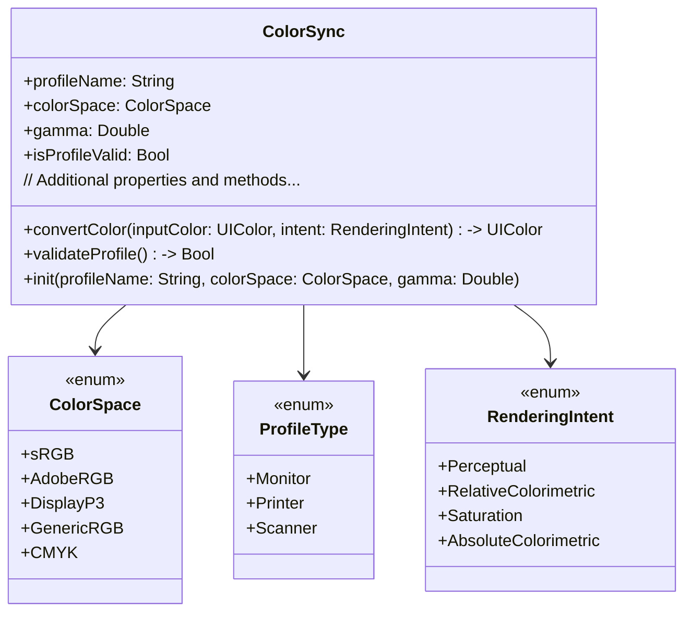

---

## **2. Initializers Overview**

### **a. Initialization Methods Diagram**
- **Purpose**: Break down the various ways to instantiate `ColorSync`.
- **Diagram Type**: `flowchart` or `graph LR`
- **Contents**:
  - **Profile-Based Initializers**: `init(profileName:)`, `init(profileURL:)`
  - **Default Initializers**: `init()`
  - **Copy Initializers**: `init(copying:)`
  - **Custom Initializers**: `init(colorSpace:gamma:)`

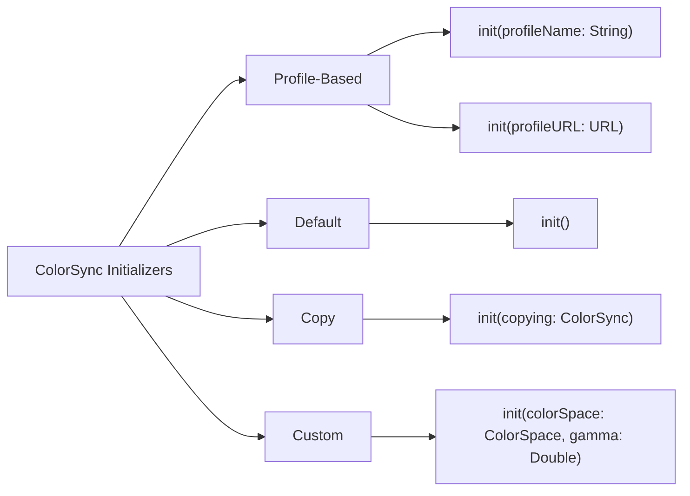

---

## **3. Properties Breakdown**

### **a. Key Properties Diagram**
- **Purpose**: Detail the main properties of `ColorSync`.
- **Diagram Type**: `graph LR` or `classDiagram`
- **Contents**:
  - **Profile Information**: `profileName`, `profileURL`, `isProfileValid`
  - **Color Characteristics**: `colorSpace`, `gamma`, `whitePoint`
  - **Rendering Attributes**: `renderingIntent`, `deviceType`
  - **Advanced Settings**: `profileType`, `vendor`, `version`

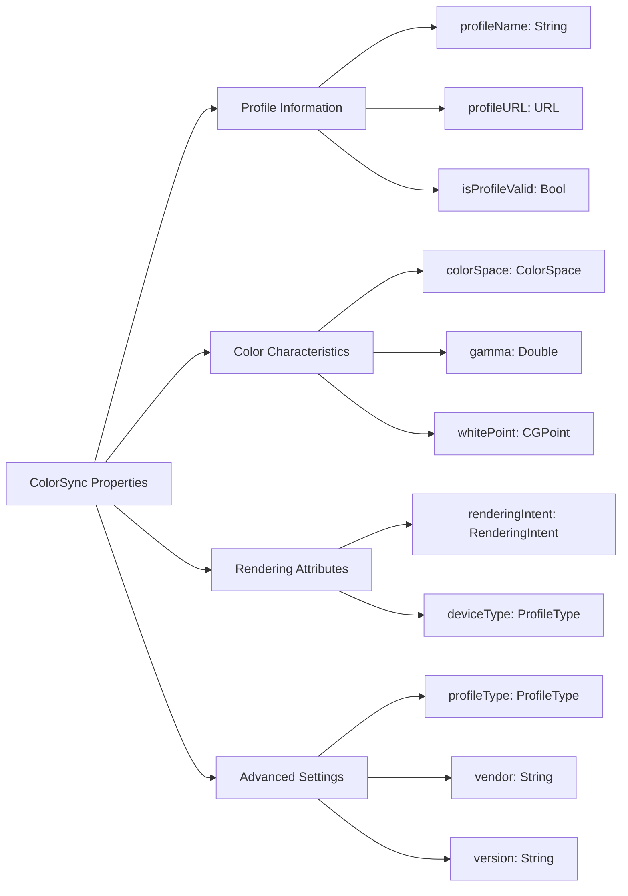

---

## **4. Methods Grouped by Functionality**

### **a. Color Conversion Methods**
- **Purpose**: Categorize methods based on their roles in color conversion and management.
- **Diagram Type**: `flowchart TD`
- **Contents**:
  - **Basic Conversion**: `convertColor()`, `convertColors()`
  - **Profile Validation**: `validateProfile()`
  - **Profile Management**: `loadProfile()`, `saveProfile()`
  - **Advanced Conversion**: `convertColorWithIntent()`, `transformColorData()`

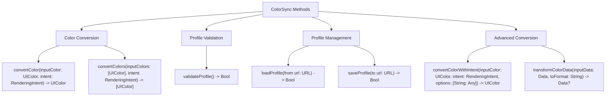

---

## **5. Enumerations and Configurations**

### **a. Enumerations Diagram**
- **Purpose**: Highlight the enums used within `ColorSync` and their possible values.
- **Diagram Type**: `classDiagram`
- **Contents**:
  - **ColorSpace**
  - **ProfileType**
  - **RenderingIntent**

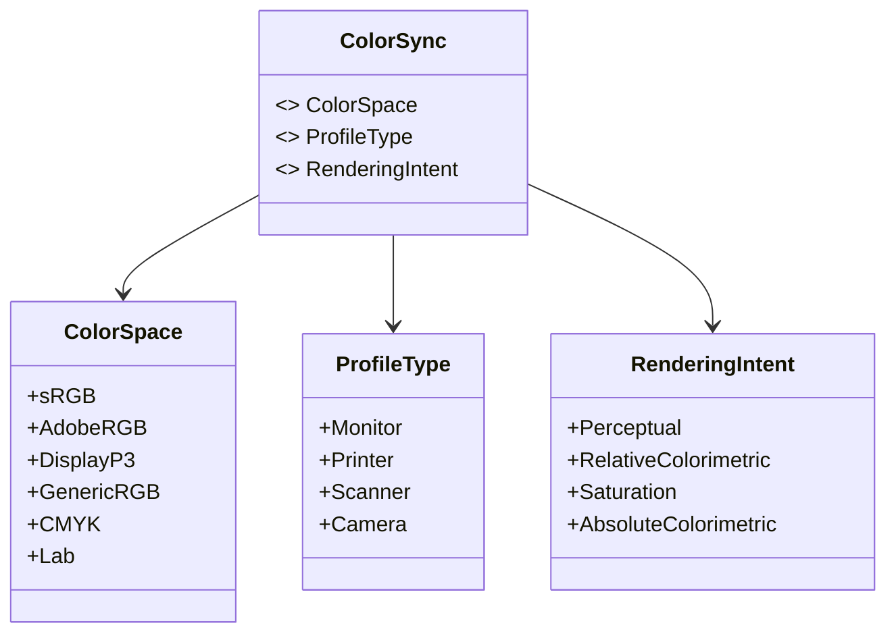

### **b. Configuration Classes Diagram**
- **Purpose**: Show the relationship between `ColorSync` and its configuration classes.
- **Diagram Type**: `classDiagram`
- **Contents**:
  - **ColorSyncConfiguration**
  - **ColorTransformationOptions**

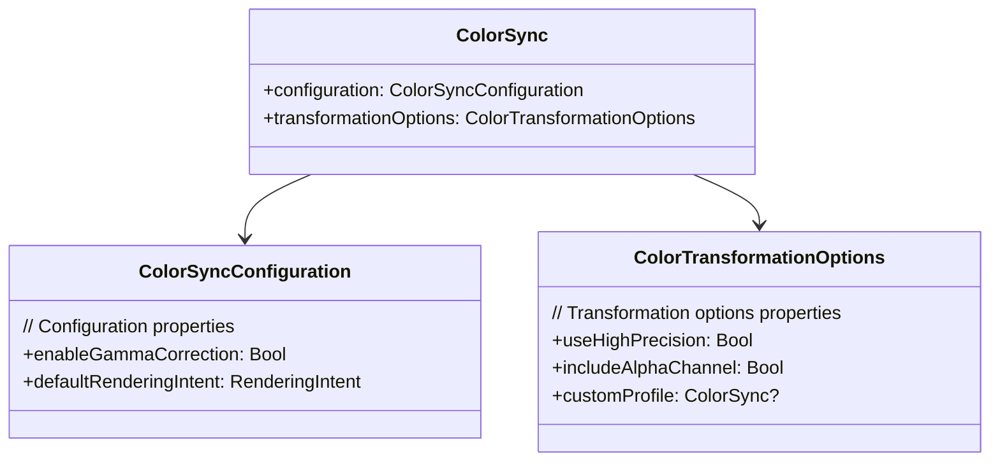

---

## **6. Protocol Conformances**

### **a. Protocols Diagram**
- **Purpose**: Display the protocols that `ColorSync` conforms to and their impact.
- **Diagram Type**: `classDiagram`
- **Contents**:
  - **Codable**
  - **NSCopying**
  - **CustomStringConvertible**

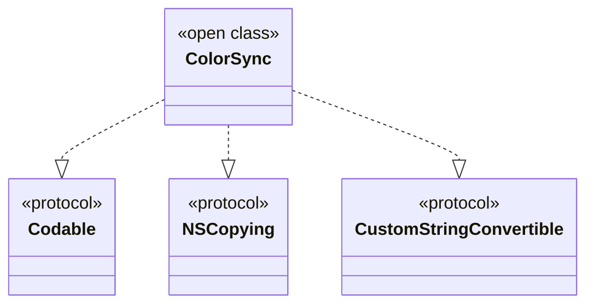

---

## **7. Relationships with Other Classes**

### **a. Related Classes Diagram**
- **Purpose**: Illustrate how `ColorSync` interacts with other UIKit classes and frameworks.
- **Diagram Type**: `flowchart TD`
- **Contents**:
  - **UIColor**: Represents colors to be converted.
  - **UIImage**: Applies color profiles to images.
  - **CGColorSpace**: Core Graphics interoperability.
  - **CIColor**: Core Image interoperability.
  - **AVFoundation**: Applies color profiles to media.
  - **UIGraphicsContext**: Integrates with drawing contexts.
  - **Bundle**: Loads color profiles from resources.

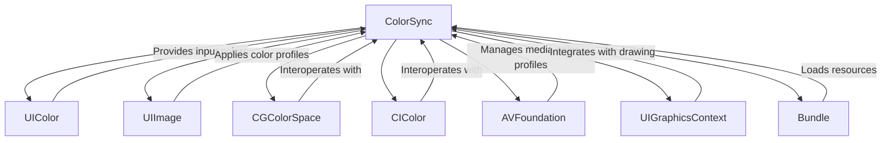

---

## **8. Extensions and Additional Functionalities**

### **a. ColorSync Extensions Diagram**
- **Purpose**: Showcase the additional functionalities provided through extensions.
- **Diagram Type**: `classDiagram`
- **Contents**:
  - **UIColor Extension**
  - **UIImage Extension**
  - **CGColorSpace Extension**

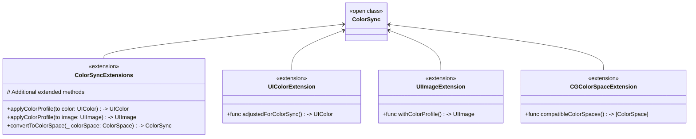

### **b. Extensions Functionalities Flowchart**
- **Purpose**: Detail specific extended methods and their purposes.
- **Diagram Type**: `flowchart LR`
- **Contents**:
  - **Color Profile Applications**
  - **Color Space Conversions**
  - **Advanced Color Adjustments**

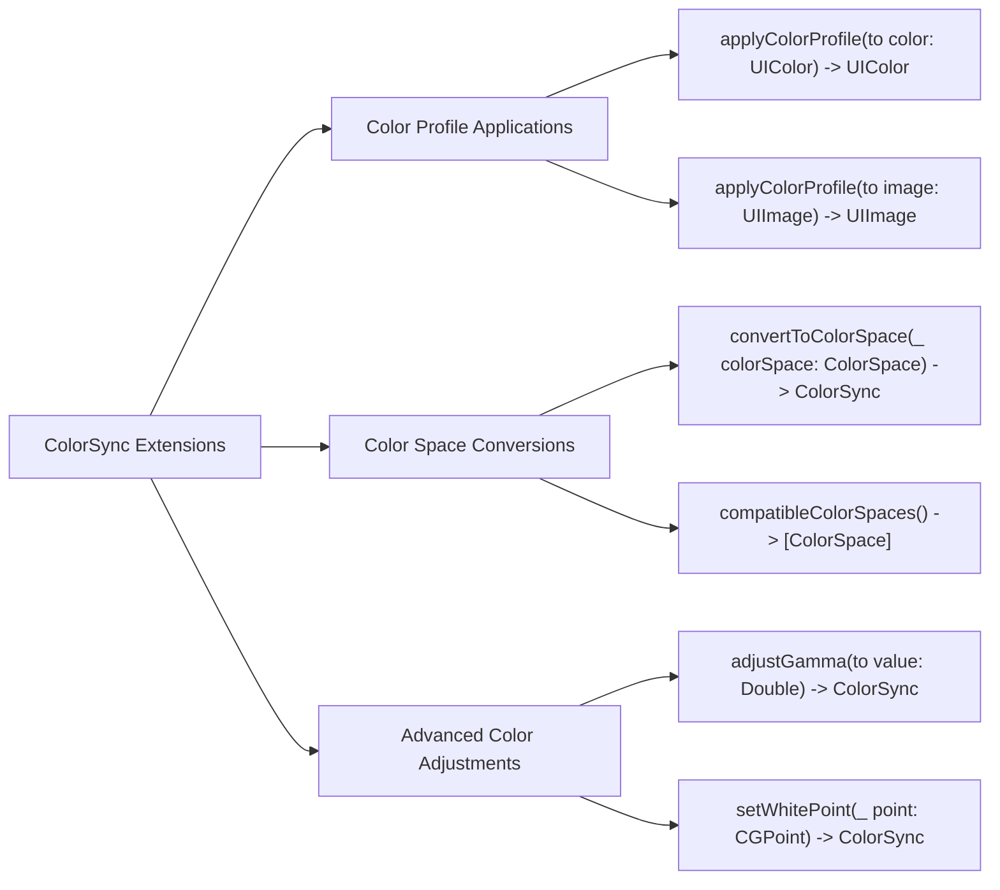

---

## **9. Lifecycle and Use Cases**

### **a. Lifecycle Flowchart**
- **Purpose**: Demonstrate the typical lifecycle of a `ColorSync` instance within an application.
- **Diagram Type**: `flowchart TD`
- **Contents**:
  - **Initialization**
  - **Configuration**
  - **Color Conversion**
  - **Profile Validation**
  - **Resource Management**
  - **Deallocation**

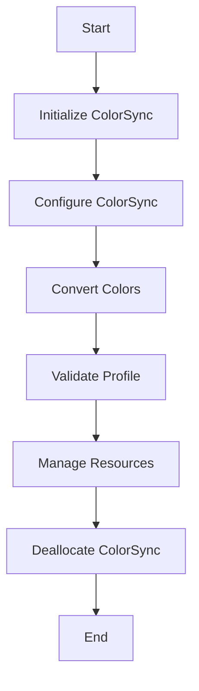

### **b. Common Use Cases Diagram**
- **Purpose**: Outline the typical scenarios where `ColorSync` is utilized.
- **Diagram Type**: `flowchart TD`
- **Contents**:
  - **Color Profile Management**
  - **Color Conversion for UI Elements**
  - **Image Processing with Color Profiles**
  - **Media Color Management**
  - **Rendering Intent Adjustments**
  - **Color Calibration for Displays**

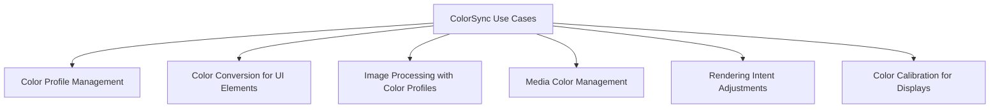

---

## **10. Feature Availability Timeline**

### **a. Feature Availability Gantt Chart**
- **Purpose**: Show when various `ColorSync` features were introduced across iOS versions.
- **Diagram Type**: `gantt`
- **Contents**:
  - **iOS Versions**: 10.0, 11.0, 12.0, 13.0, 14.0, 15.0, 16.0, 17.0
  - **Features Introduced**: Basic profiles, advanced color spaces, rendering intents, profile validation, media color management, high dynamic range support, integration with SwiftUI.

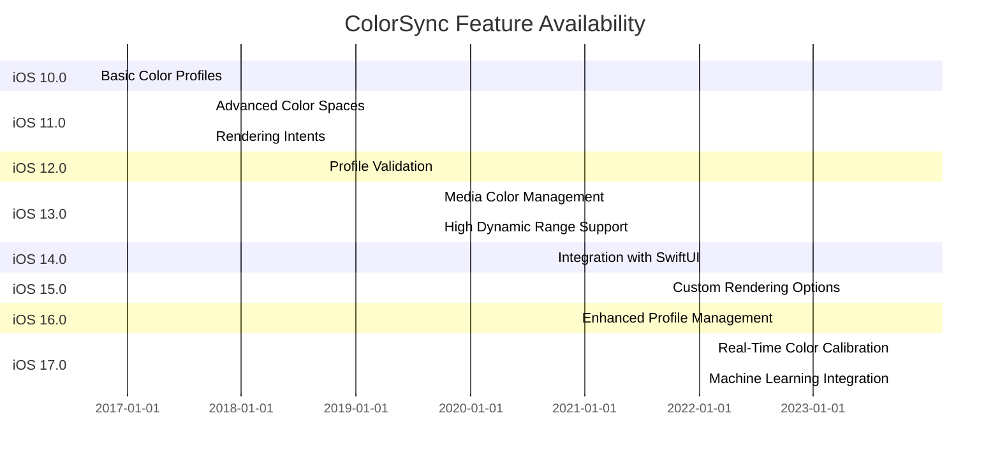

---

## **11. Data Handling and Formats**

### **a. Color Data Format Handling Diagram**
- **Purpose**: Explain how `ColorSync` handles different color data formats.
- **Diagram Type**: `graph LR`
- **Contents**:
  - **RGB**
  - **CMYK**
  - **Lab**
  - **Hexadecimal**
  - **HexaDecimal with Alpha**
  - **HSL/HSV**

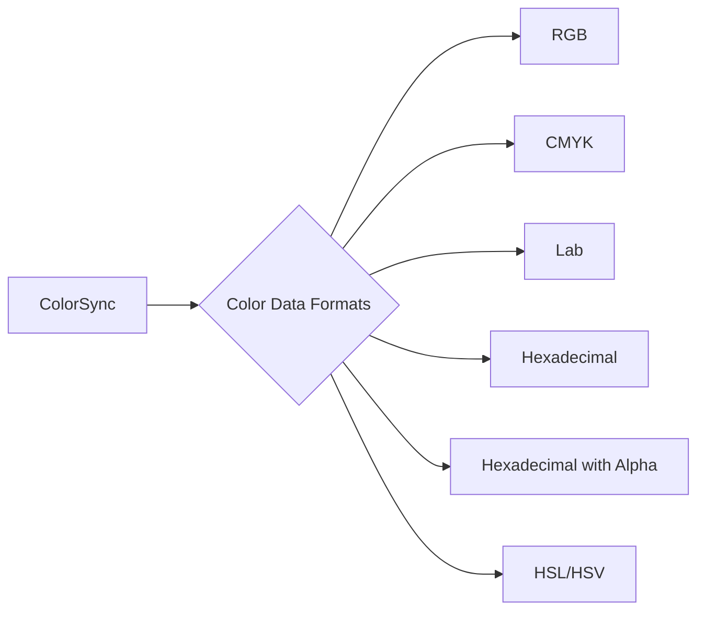

---

## **12. Integration with Drawing Contexts**

### **a. Drawing Methods Usage Diagram**
- **Purpose**: Show how `ColorSync` methods are used within drawing contexts.
- **Diagram Type**: `flowchart TD`
- **Contents**:
  - **Color Adjustment**
  - **Profile Application**
  - **Rendering Intent Selection**
  - **Color Calibration**

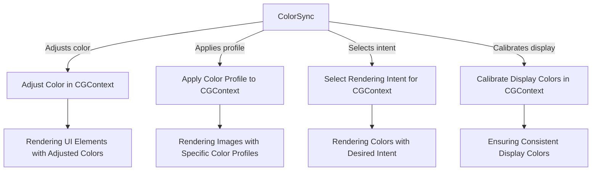

---

## **13. Summary and Best Practices**

### **a. Summary Diagram**
- **Purpose**: Provide a high-level overview of `ColorSync`'s key characteristics and functionalities.
- **Diagram Type**: `graph LR` or `mindmap`
- **Contents**:
  - **Comprehensive Color Management**
  - **Versatile Initialization**
  - **Advanced Rendering Options**
  - **Performance Optimizations**
  - **Seamless Integration**
  - **Future-Proof Features**

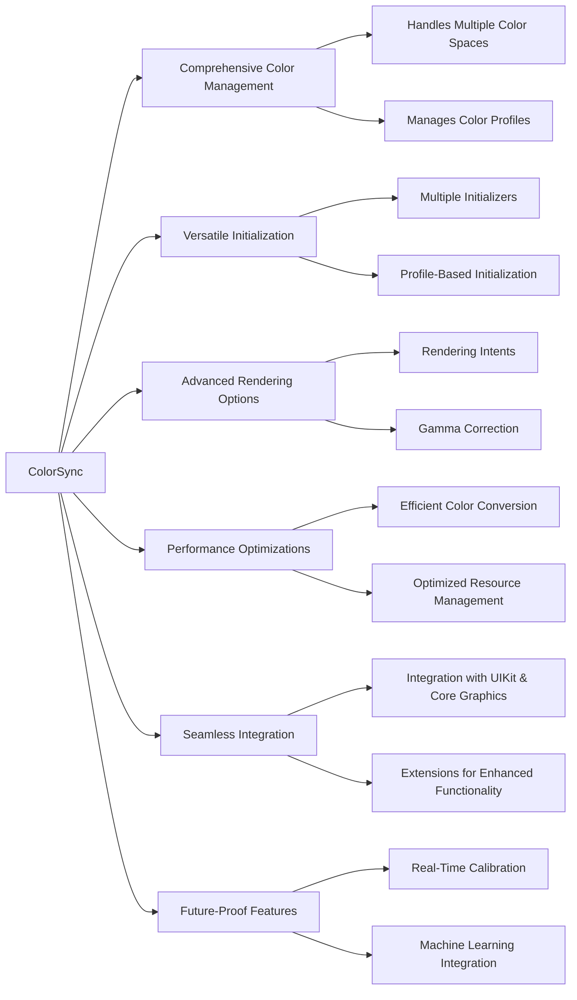

---

## **Best Practices for Using `ColorSync`**

1. **Profile Validation**:
   - Always validate color profiles before applying them to ensure they are compatible and not corrupted.
   
2. **Efficient Resource Management**:
   - Reuse `ColorSync` instances where possible to minimize resource overhead.
   
3. **Rendering Intent Selection**:
   - Choose the appropriate rendering intent (`Perceptual`, `RelativeColorimetric`, etc.) based on the specific use case to achieve the desired color accuracy.
   
4. **Color Space Consistency**:
   - Maintain consistency in color spaces across different media and devices to ensure uniform color representation.
   
5. **Leverage Extensions**:
   - Utilize provided extensions to simplify color conversions and profile applications within your codebase.
   
6. **Integrate with Drawing Contexts**:
   - Apply color adjustments and profiles directly within drawing contexts for real-time rendering optimizations.
   
7. **Stay Updated with Latest Features**:
   - Keep abreast of new `ColorSync` features introduced in latest iOS releases to leverage improved functionalities and performance enhancements.
   
8. **Performance Monitoring**:
   - Use profiling tools to monitor the performance impact of color conversions and make necessary optimizations.
   
9. **Handle Edge Cases**:
   - Implement fallback mechanisms for unsupported color profiles or formats to maintain application stability.
   
10. **Documentation and Code Comments**:
    - Document the usage of different color profiles and rendering intents within your code to aid future maintenance and onboarding of new developers.

---
