# Compression
> This content is dual-licensed under your choice of the following licenses:
> 1.  **MIT License:** For the code implementations in Swift and Mermaid provided in this document.
> 2.  **Creative Commons Attribution 4.0 International License (CC BY 4.0):** For all other content, including the text, explanations, and the Mermaid diagrams and illustrations.

---

Below is a comprehensive set of Mermaid diagrams for the `Compression` framework. These diagrams cover various aspects of the `Compression` framework, including class structures, initializers, properties, methods, enumerations, protocols, relationships, extensions, lifecycle, feature availability, data handling, integration, and best practices.

---

## **1. Class Structure and Hierarchy**

### **a. Core Class Diagram**
- **Purpose**: Illustrate the primary structure of the `Compression` framework, including its types, functions, and enumerations.
- **Diagram Type**: `classDiagram`
- **Contents**:
  - **Structures**: `CompressionStream`
  - **Enumerations**: `CompressionAlgorithm`, `CompressionOptions`
  - **Functions**: `compression_encode_buffer`, `compression_decode_buffer`
  - **Classes**: `CompressionSession`

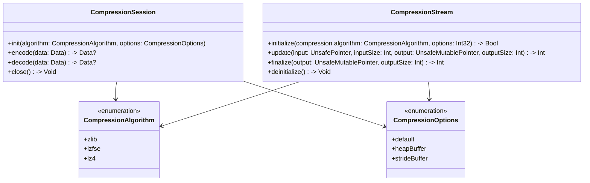

---

## **2. Initializers Overview**

### **a. Initialization Methods Diagram**
- **Purpose**: Break down the various ways to instantiate `Compression` components.
- **Diagram Type**: `flowchart LR`
- **Contents**:
  - **CompressionSession Initializers**
  - **CompressionStream Initializers**
  - **Algorithm Selection**

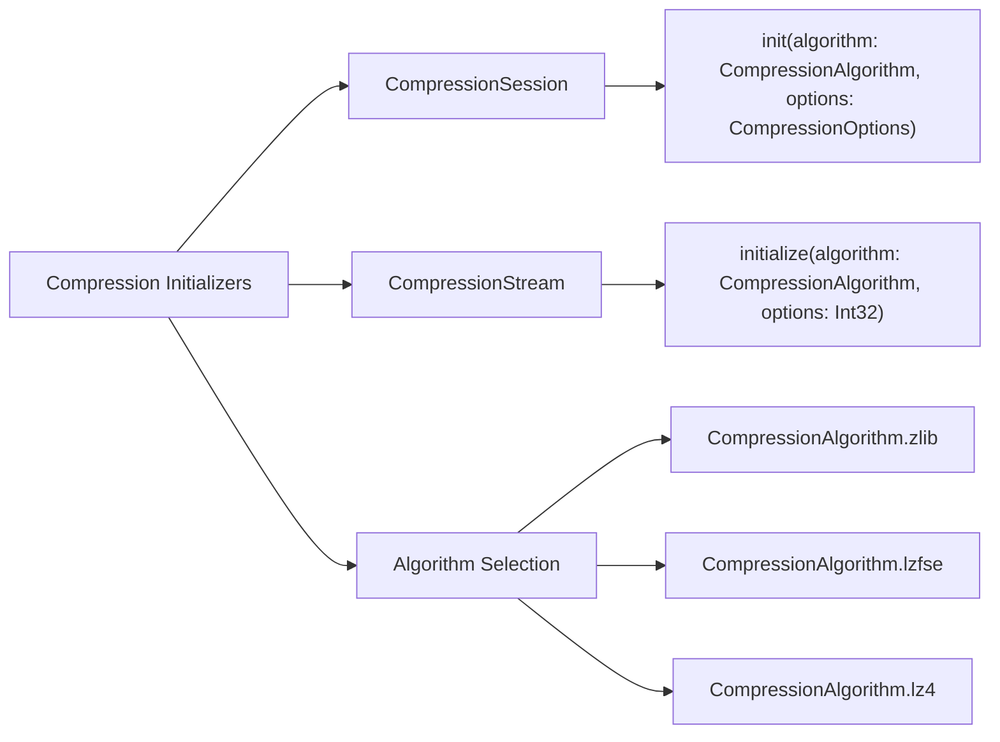

---

## **3. Properties Breakdown**

### **a. Key Properties Diagram**
- **Purpose**: Detail the main properties of the `Compression` framework types.
- **Diagram Type**: `graph LR`
- **Contents**:
  - **CompressionSession Properties**
  - **CompressionStream Properties**
  - **CompressionAlgorithm Attributes**

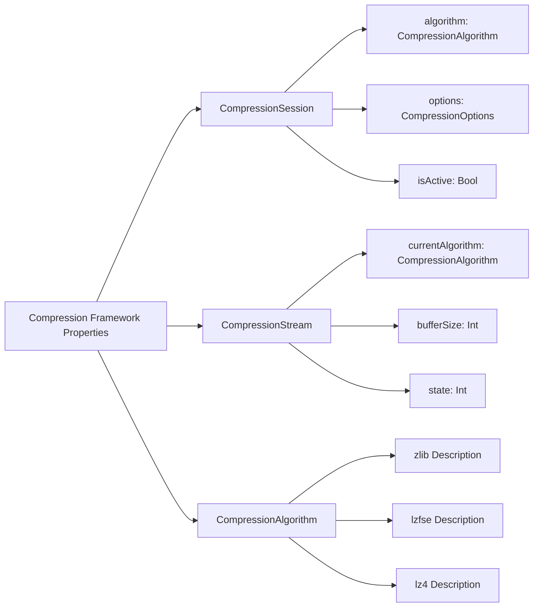

---

## **4. Methods Grouped by Functionality**

### **a. Compression Methods Diagram**
- **Purpose**: Categorize methods based on their roles in data compression and decompression.
- **Diagram Type**: `flowchart TD`
- **Contents**:
  - **Session Management**
  - **Encoding Methods**
  - **Decoding Methods**
  - **Stream Handling**

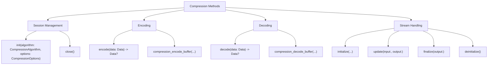

---

## **5. Enumerations and Configurations**

### **a. Enumerations Diagram**
- **Purpose**: Highlight the enums used within the `Compression` framework and their possible values.
- **Diagram Type**: `classDiagram`
- **Contents**:
  - **CompressionAlgorithm**
  - **CompressionOptions**

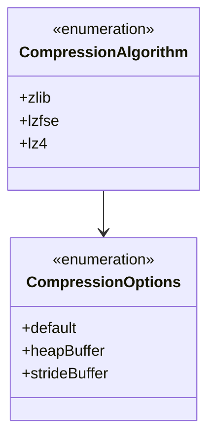

---

## **6. Protocol Conformances**

### **a. Protocols Diagram**
- **Purpose**: Display the protocols that `Compression` framework types conform to and their impact.
- **Diagram Type**: `classDiagram`
- **Contents**:
  - **Codable**
  - **SecureCoding**

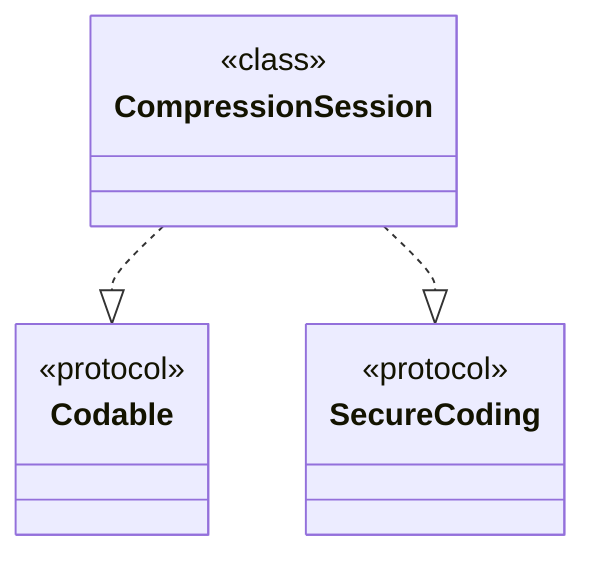

---

## **7. Relationships with Other Classes**

### **a. Related Classes Diagram**
- **Purpose**: Illustrate how `Compression` interacts with other frameworks and classes.
- **Diagram Type**: `flowchart TD`
- **Contents**:
  - **NSData**
  - **NSStream**
  - **URLSession**
  - **FileManager**
  - **Data**
  - **Third-Party Libraries**

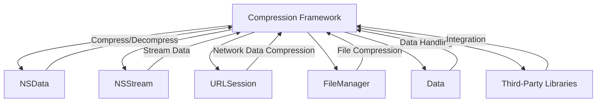

---

## **8. Extensions and Additional Functionalities**

### **a. Compression Extensions Diagram**
- **Purpose**: Showcase the additional functionalities provided through extensions.
- **Diagram Type**: `classDiagram`
- **Contents**:
  - **Data Extensions**
  - **Stream Extensions**
  - **Error Handling Extensions**

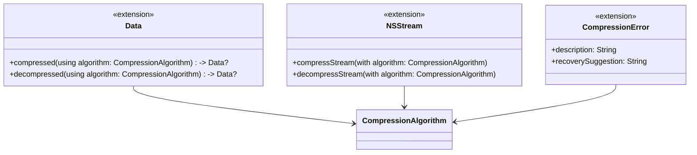

### **b. Extensions Functionalities Flowchart**
- **Purpose**: Detail specific extended methods and their purposes.
- **Diagram Type**: `flowchart LR`
- **Contents**:
  - **Data Compression**
  - **Data Decompression**
  - **Stream Compression**
  - **Stream Decompression**
  - **Error Handling**

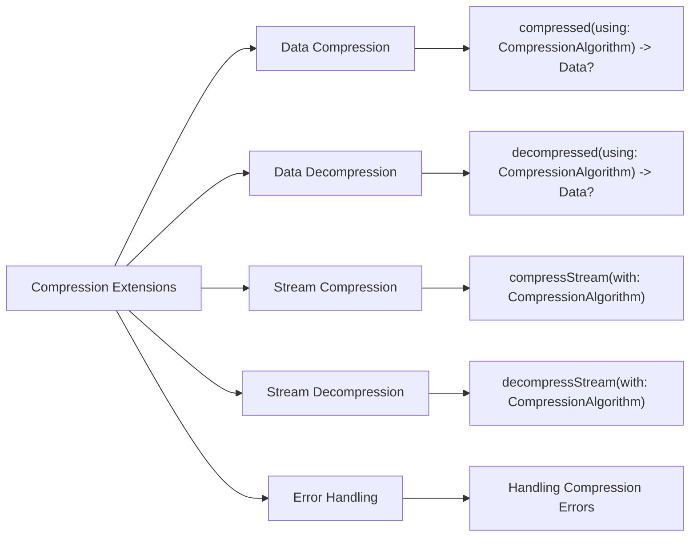

---

## **9. Lifecycle and Use Cases**

### **a. Lifecycle Flowchart**
- **Purpose**: Demonstrate the typical lifecycle of a compression operation within an application.
- **Diagram Type**: `flowchart TD`
- **Contents**:
  - **Initialization**
  - **Compression/Decompression**
  - **Usage**
  - **Finalization**
  - **Error Handling**

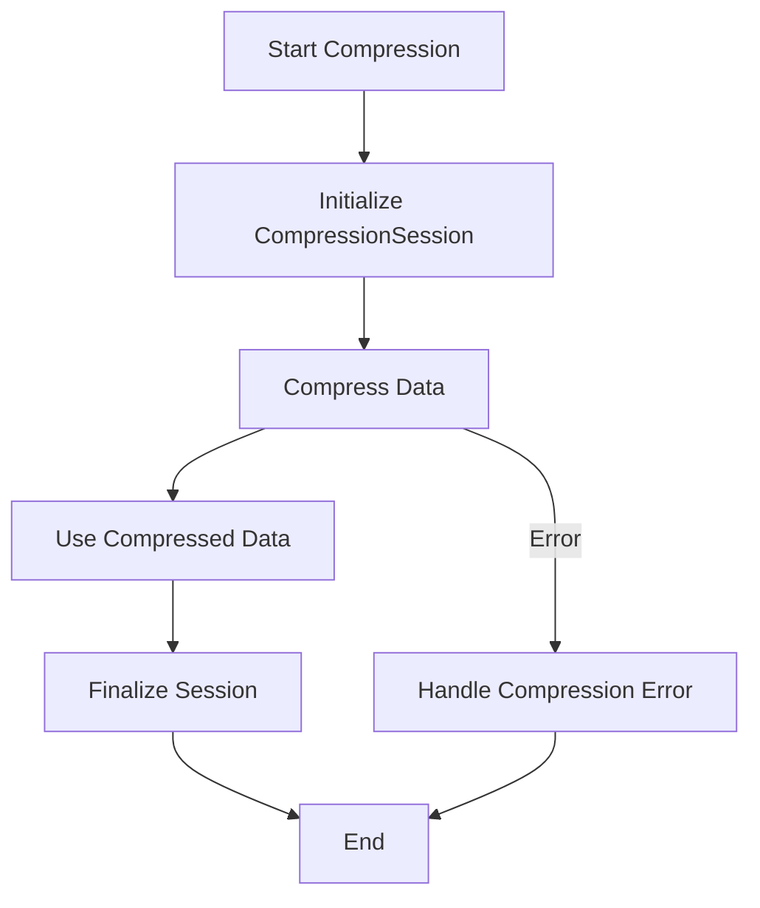

### **b. Common Use Cases Diagram**
- **Purpose**: Outline the typical scenarios where the `Compression` framework is utilized.
- **Diagram Type**: `flowchart TD`
- **Contents**:
  - **File Compression**
  - **Data Transmission**
  - **Caching Mechanisms**
  - **Memory Optimization**
  - **Network Requests**
  - **Third-Party Integrations**

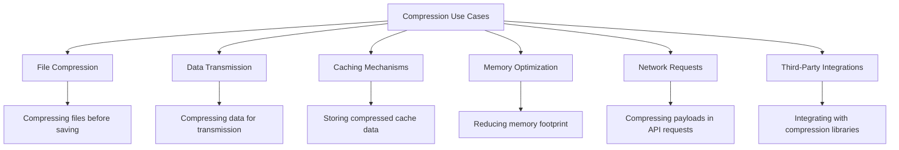

---

## **10. Feature Availability Timeline**

### **a. Feature Availability Gantt Chart**
- **Purpose**: Show when various `Compression` features were introduced across iOS versions.
- **Diagram Type**: `gantt`
- **Contents**:
  - **iOS Versions**: 9.0, 10.0, 11.0, 12.0, 13.0, 14.0, 15.0, 16.0, 17.0
  - **Features Introduced**: Core Compression API, CompressionSession, LZ4 support, LZFSE support, HEVC compression, Adaptive compression algorithms, Stream-based compression, Improved error handling.

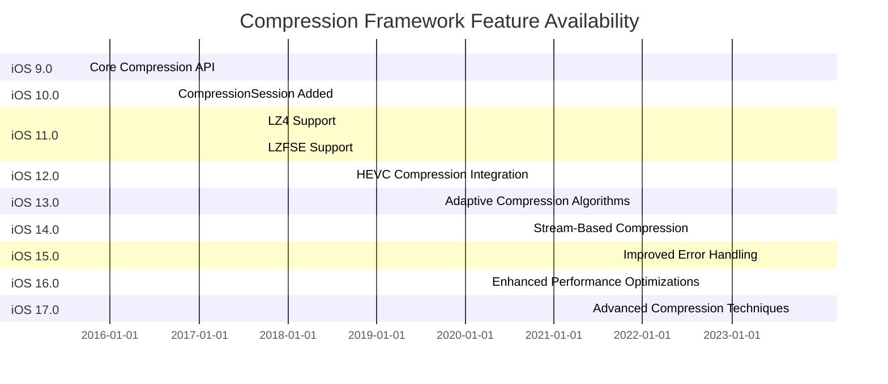

---

## **11. Data Handling and Formats**

### **a. Compression Formats Handling Diagram**
- **Purpose**: Explain how the `Compression` framework handles different compression formats.
- **Diagram Type**: `graph LR`
- **Contents**:
  - **Supported Formats**: zlib, LZFSE, LZ4, HEVC
  - **Operations**: Compress, Decompress
  - **Functions**: `compression_encode_buffer`, `compression_decode_buffer`
  - **Sessions**: `CompressionSession`, `CompressionStream`

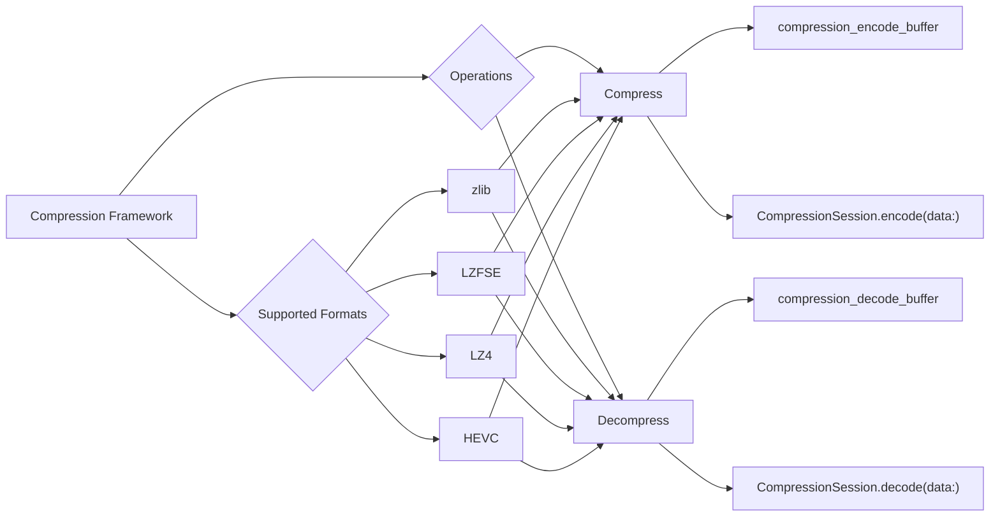

---

## **12. Integration with Data Streams**

### **a. Stream Compression Methods Diagram**
- **Purpose**: Show how `Compression` methods are used within data streams.
- **Diagram Type**: `flowchart TD`
- **Contents**:
  - **Input Streams**
  - **Compression Process**
  - **Output Streams**
  - **Error Handling**

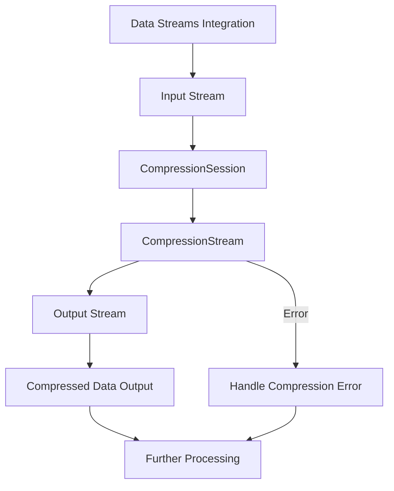

---

## **13. Summary and Best Practices**

### **a. Summary Diagram**
- **Purpose**: Provide a high-level overview of the `Compression` framework's key characteristics and functionalities.
- **Diagram Type**: `graph LR`
- **Contents**:
  - **Efficient Data Handling**
  - **Multiple Compression Algorithms**
  - **Stream-Based Processing**
  - **Robust Error Handling**
  - **Seamless Integration**
  - **Performance Optimizations**

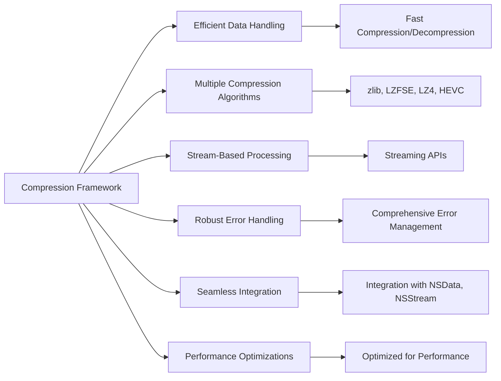

---

## **Best Practices for Using the Compression Framework**

1. **Choose the Right Algorithm**:
   - **zlib**: Suitable for general-purpose compression with a good balance between speed and compression ratio.
   - **LZFSE**: Optimized for Apple platforms with higher compression speeds.
   - **LZ4**: Best for scenarios requiring extremely fast compression/decompression.
   - **HEVC**: Ideal for high-efficiency video compression.

2. **Utilize Stream-Based APIs for Large Data**:
   - For handling large datasets or real-time data streams, prefer `CompressionStream` over buffer-based methods to manage memory efficiently.

3. **Handle Errors Gracefully**:
   - Implement comprehensive error handling to manage scenarios like unsupported algorithms, data corruption, or buffer overflows.

4. **Optimize Buffer Sizes**:
   - Adjust buffer sizes based on the data type and compression algorithm to achieve optimal performance.

5. **Leverage Compression Sessions**:
   - Use `CompressionSession` for managing the lifecycle of compression tasks, ensuring resources are properly allocated and released.

6. **Integrate with Existing Frameworks**:
   - Seamlessly integrate with `NSData`, `NSStream`, and other Apple frameworks to enhance data processing workflows.

7. **Profile and Benchmark**:
   - Regularly profile compression tasks to identify bottlenecks and optimize performance using tools like Instruments.

8. **Stay Updated with iOS Releases**:
   - Keep abreast of updates in the `Compression` framework to leverage new features and improvements introduced in the latest iOS versions.

---
**Licenses:**

- **MIT License:**   - Full text in [LICENSE](LICENSE) file.
- **Creative Commons Attribution 4.0 International:**  - Legal details in [LICENSE-CC-BY](LICENSE-CC-BY) and at [Creative Commons official site](http://creativecommons.org/licenses/by/4.0/).

---