# Contacts
> This content is dual-licensed under your choice of the following licenses:
> 1.  **MIT License:** For the code implementations in Swift and Mermaid provided in this document.
> 2.  **Creative Commons Attribution 4.0 International License (CC BY 4.0):** For all other content, including the text, explanations, and the Mermaid diagrams and illustrations.

---

Below is a comprehensive and organized set of Mermaid diagrams for the `Contacts` framework. These diagrams cover various aspects of the `Contacts` framework, including class structures, initializers, properties, methods, enumerations, protocol conformances, relationships with other classes, extensions, lifecycle, feature availability, data handling, integration, and best practices.

---

## **1. Class Structure and Hierarchy**

### **a. Core Class Diagram**
- **Purpose**: Illustrate the primary structure of the `Contacts` framework, including its key classes, properties, methods, and enumerations.
- **Diagram Type**: `classDiagram`
- **Contents**:
  - **Classes**: `CNContact`, `CNContactStore`, `CNMutableContact`, `CNContactVCardSerialization`, etc.
  - **Properties**: Key attributes like `identifier`, `givenName`, `familyName`, etc.
  - **Methods**: Essential functions like `fetchContacts()`, `saveContact()`, etc.
  - **Enumerations**: Nested enums such as `CNContactSortOrder`, `CNContactStoreErrorCode`.

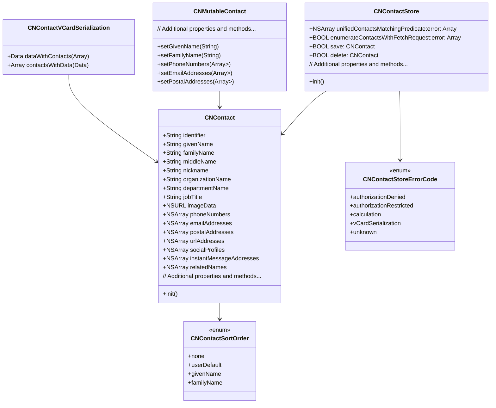

---

## **2. Initializers Overview**

### **a. Initialization Methods Diagram**
- **Purpose**: Break down the various ways to instantiate contacts and related objects.
- **Diagram Type**: `flowchart LR`
- **Contents**:
  - **Contact Initialization**: `CNContact()`, `CNMutableContact()`
  - **Contact Store Initialization**: `CNContactStore()`
  - **Serialization Initialization**: `CNContactVCardSerialization()`
  - **Fetching Contacts**: `CNContactFetchRequest()`

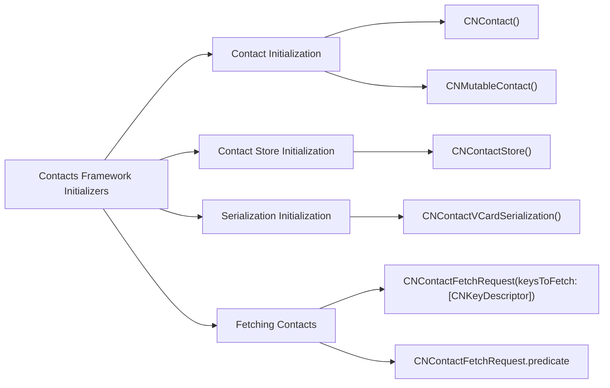

---

## **3. Properties Breakdown**

### **a. Key Properties Diagram**
- **Purpose**: Detail the main properties of key classes within the `Contacts` framework.
- **Diagram Type**: `graph LR`
- **Contents**:
  - **CNContact Properties**: `identifier`, `givenName`, `familyName`, `phoneNumbers`, `emailAddresses`, etc.
  - **CNContactStore Properties**: `defaultContainerIdentifier`, `groupsMatchingPredicate`
  - **CNMutableContact Properties**: Mutable versions of `CNContact` properties.

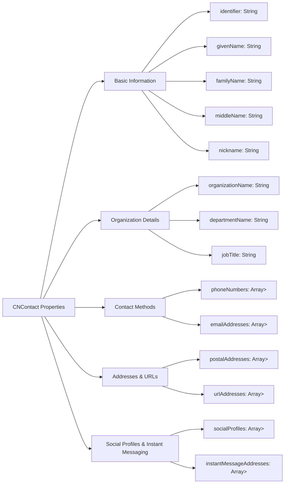

---

## **4. Methods Grouped by Functionality**

### **a. Contact Management Methods**
- **Purpose**: Categorize methods based on their roles in managing contacts.
- **Diagram Type**: `flowchart TD`
- **Contents**:
  - **Fetching Contacts**: `unifiedContactsMatchingPredicate:error:`, `enumerateContactsWithFetchRequest:error:`
  - **Saving Contacts**: `save:error:`, `delete:error:`
  - **Serialization**: `dataWithContacts:`, `contactsWithData:error:`
  - **Requesting Access**: `requestAccessForEntityType:completionHandler:`

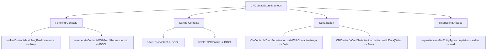

---

## **5. Enumerations and Configurations**

### **a. Enumerations Diagram**
- **Purpose**: Highlight the enums used within the `Contacts` framework and their possible values.
- **Diagram Type**: `classDiagram`
- **Contents**:
  - **CNContactSortOrder**
  - **CNContactStoreErrorCode**
  - **CNSocialProfileService**
  - **CNInstantMessageService**

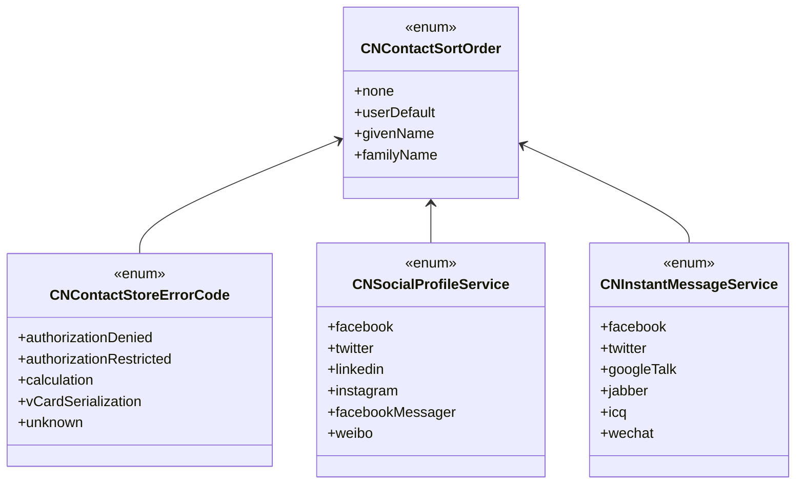

### **b. Configuration Classes Diagram**
- **Purpose**: Show the relationship between core classes and their configuration or related classes.
- **Diagram Type**: `classDiagram`
- **Contents**:
  - **CNLabeledValue**
  - **CNPostalAddress**
  - **CNSocialProfile**
  - **CNInstantMessageAddress**

## TODO: Fix rendering syntax error

```mermaid
classDiagram
    class CNContact {
        +Array<CNLabeledValue<NSString>> emailAddresses
        +Array<CNLabeledValue<CNPhoneNumber>> phoneNumbers
        +Array<CNLabeledValue<CNPostalAddress>> postalAddresses
        +Array<CNLabeledValue<CNSocialProfile>> socialProfiles
        +Array<CNLabeledValue<CNInstantMessageAddress>> instantMessageAddresses
    }

    class CNLabeledValue<T> {
        +String label
        +T value
    }

    class CNPostalAddress {
        +String street
        +String city
        +String state
        +String postalCode
        +String country
        +String isoCountryCode
    }

    class CNSocialProfile {
        +NSString urlString
        +NSString username
        +NSString userIdentifier
        +CNSocialProfileService service
    }

    class CNInstantMessageAddress {
        +NSString username
        +CNInstantMessageService service
    }

    CNContact --> CNLabeledValue
    CNLabeledValue --> CNPostalAddress
    CNLabeledValue --> CNSocialProfile
    CNLabeledValue --> CNInstantMessageAddress
    
```

---

## **6. Protocol Conformances**

### **a. Protocols Diagram**
- **Purpose**: Display the protocols that key classes in the `Contacts` framework conform to and their impact.
- **Diagram Type**: `classDiagram`
- **Contents**:
  - **NSSecureCoding**
  - **NSCopying**
  - **CNKeyDescriptor**
  - **CNFetchRequest**

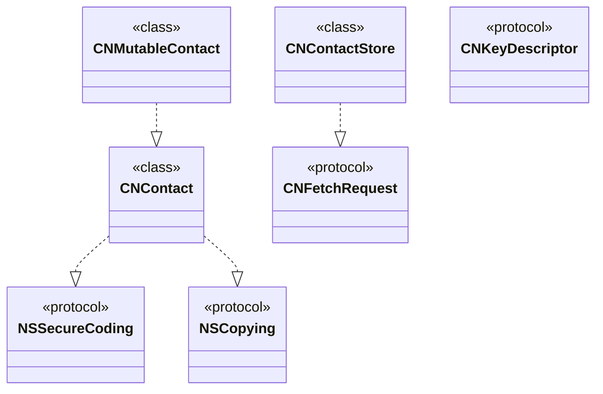

---

## **7. Relationships with Other Classes**

### **a. Related Classes Diagram**
- **Purpose**: Illustrate how the `Contacts` framework interacts with other Apple frameworks and classes.
- **Diagram Type**: `flowchart TD`
- **Contents**:
  - **UIKit Integration**: `CNContactViewController`, `UIImage` for contact images.
  - **Foundation Framework**: `NSData`, `NSURL`, `NSDateComponents`.
  - **Core Data**: Integration for storing custom contact-related data.
  - **MapKit**: Displaying contact addresses on a map.
  - **UIKit.UIImage**: Handling contact images and thumbnails.

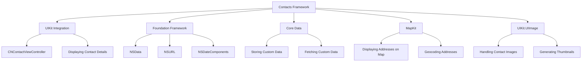

---

## **8. Extensions and Additional Functionalities**

### **a. Contacts Framework Extensions Diagram**
- **Purpose**: Showcase the additional functionalities provided through extensions.
- **Diagram Type**: `classDiagram`
- **Contents**:
  - **CNContact Extensions**
  - **CNContactStore Extensions**
  - **Helper Methods**
  - **Integration with Other Frameworks**

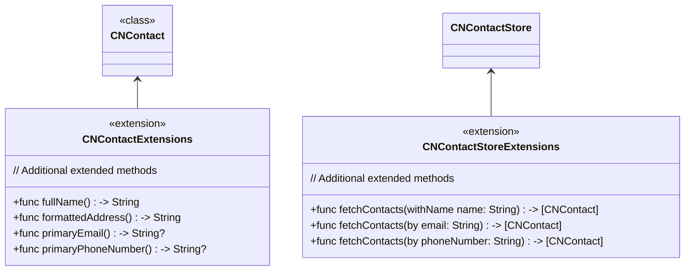

### **b. Extensions Functionalities Flowchart**
- **Purpose**: Detail specific extended methods and their purposes.
- **Diagram Type**: `flowchart LR`
- **Contents**:
  - **Helper Methods for Formatting**
  - **Advanced Fetching Techniques**
  - **Integration with UI Components**

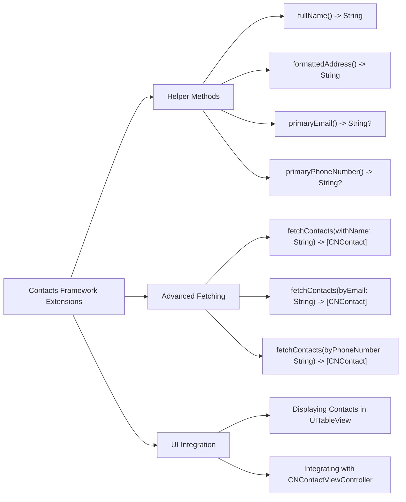

---

## **9. Lifecycle and Use Cases**

### **a. Lifecycle Flowchart**
- **Purpose**: Demonstrate the typical lifecycle of a `CNContact` within an application.
- **Diagram Type**: `flowchart TD`
- **Contents**:
  - **Initialization**
  - **Fetching**
  - **Modification**
  - **Saving**
  - **Deletion**
  - **Serialization**
  - **Displaying**

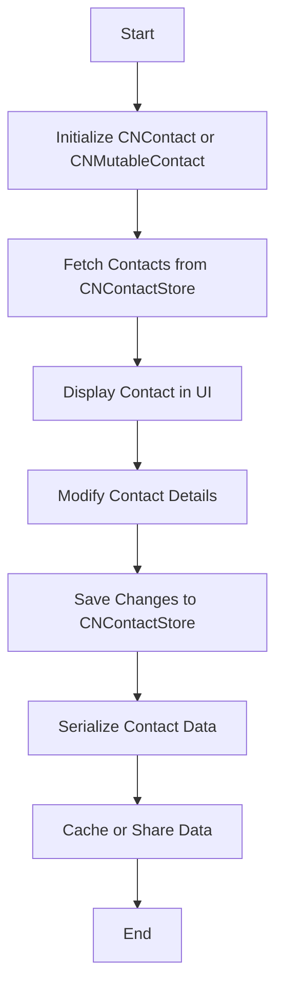

### **b. Common Use Cases Diagram**
- **Purpose**: Outline the typical scenarios where the `Contacts` framework is utilized.
- **Diagram Type**: `flowchart TD`
- **Contents**:
  - **Displaying Contacts in UI**
  - **Editing Contact Information**
  - **Creating New Contacts**
  - **Deleting Contacts**
  - **Synchronizing Contacts with Server**
  - **Exporting Contacts as VCards**
  - **Integrating with Messaging or Email Apps**
  - **Displaying Contact Locations on Maps**

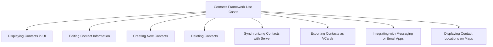

---

## **10. Feature Availability Timeline**

### **a. Feature Availability Gantt Chart**
- **Purpose**: Show when various `Contacts` framework features were introduced across iOS versions.
- **Diagram Type**: `gantt`
- **Contents**:
  - **iOS Versions**: 5.0, 6.0, 9.0, 10.0, 11.0, 12.0, 13.0, 14.0, 15.0, 16.0, 17.0
  - **Features Introduced**: CNContactStore, CNContactVCardSerialization, CNContactViewController, Predicate-Based Fetching, Group Management, etc.

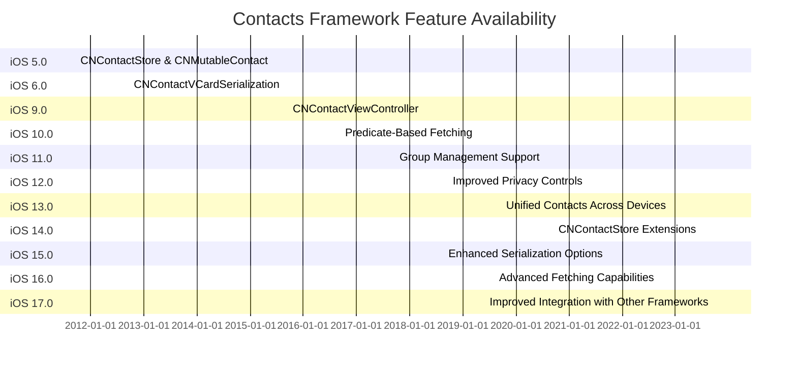

---

## **11. Data Handling and Formats**

### **a. Contact Data Format Handling Diagram**
- **Purpose**: Explain how the `Contacts` framework handles different contact data formats.
- **Diagram Type**: `graph LR`
- **Contents**:
  - **VCard Serialization**: `CNContactVCardSerialization`
  - **Data Encoding**: `NSData` handling for contacts
  - **JSON Integration**: Converting contacts to/from JSON if applicable

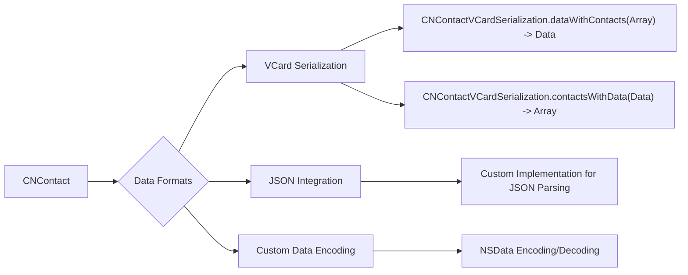

---

## **12. Integration with Other Contexts**

### **a. Integration Methods Diagram**
- **Purpose**: Show how the `Contacts` framework integrates with other application contexts and frameworks.
- **Diagram Type**: `flowchart TD`
- **Contents**:
  - **UI Integration**: `CNContactViewController`, `UITableView`
  - **Networking**: Syncing contacts with remote servers
  - **Persistence**: Saving custom contact-related data with Core Data
  - **Mapping**: Displaying contact addresses using `MapKit`
  - **Third-Party Services**: Integrating with messaging or email services

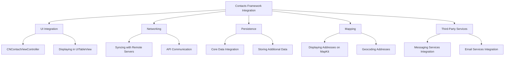

---

## **13. Summary and Best Practices**

### **a. Summary Diagram**
- **Purpose**: Provide a high-level overview of the `Contacts` framework's key characteristics and functionalities.
- **Diagram Type**: `graph LR`
- **Contents**:
  - **Comprehensive Contact Management**
  - **Robust Data Handling**
  - **Seamless UI Integration**
  - **Advanced Fetching and Searching**
  - **Privacy and Security**
  - **Extensibility and Customization**
  - **Integration with Other Frameworks**

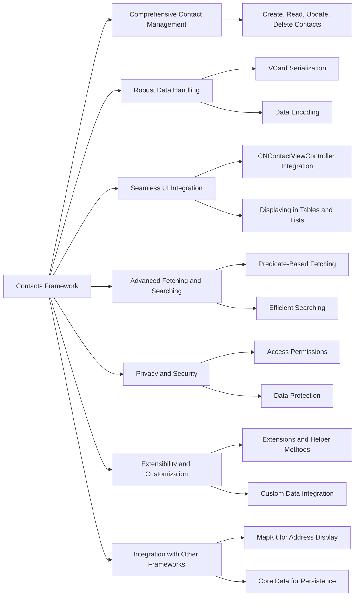

### **b. Best Practices Diagram**
- **Purpose**: Outline best practices when using the `Contacts` framework.
- **Diagram Type**: `mindmap`
- **Contents**:
  - **Efficient Data Fetching**
  - **Respecting User Privacy**
  - **Handling Permissions Gracefully**
  - **Optimizing Performance**
  - **Ensuring Data Consistency**
  - **Error Handling and Recovery**
  - **User-Friendly UI Integration**
  - **Leveraging Extensions for Customization**

## TODO: Fix rendering syntax error

```mermaid
mindmap
  root((Best Practices))

  root --> EfficientDataFetching((Efficient Data Fetching))
  root --> RespectingUserPrivacy((Respecting User Privacy))
  root --> HandlingPermissionsGracefully((Handling Permissions Gracefully))
  root --> OptimizingPerformance((Optimizing Performance))
  root --> EnsuringDataConsistency((Ensuring Data Consistency))
  root --> ErrorHandlingRecovery((Error Handling and Recovery))
  root --> UserFriendlyUIIntegration((User-Friendly UI Integration))
  root --> LeveragingExtensions((Leveraging Extensions for Customization))

  EfficientDataFetching --> OptimizeFetchRequests((Optimize Fetch Requests))
  EfficientDataFetching --> UsePredicates((Use Predicates Effectively))

  RespectingUserPrivacy --> RequestOnlyNeededData((Request Only Needed Data))
  RespectingUserPrivacy --> InformUsers((Inform Users About Data Usage))

  HandlingPermissionsGracefully --> CheckAuthorizationStatus((Check Authorization Status))
  HandlingPermissionsGracefully --> ProvideFallbacks((Provide Fallbacks if Access Denied))

  OptimizingPerformance --> CacheFrequentlyUsedData((Cache Frequently Used Data))
  OptimizingPerformance --> PerformHeavyTasksAsync((Perform Heavy Tasks Asynchronously))

  EnsuringDataConsistency --> ValidateDataBeforeSaving((Validate Data Before Saving))
  EnsuringDataConsistency --> HandleConflicts((Handle Data Conflicts))

  ErrorHandlingRecovery --> ImplementRobustErrorHandling((Implement Robust Error Handling))
  ErrorHandlingRecovery --> ProvideUserFeedback((Provide Meaningful User Feedback))

  UserFriendlyUIIntegration --> UseStandard UI Components((Use Standard UI Components))
  UserFriendlyUIIntegration --> CustomizeWhenNecessary((Customize When Necessary))

  LeveragingExtensions --> CreateHelperMethods((Create Helper Methods))
  LeveragingExtensions --> Extend Functionality((Extend Functionality as Needed))
  
```

---
**Licenses:**

- **MIT License:**  [](LICENSE) - Full text in [LICENSE](LICENSE) file.
- **Creative Commons Attribution 4.0 International:** [](LICENSE-CC-BY) - Legal details in [LICENSE-CC-BY](LICENSE-CC-BY) and at [Creative Commons official site](http://creativecommons.org/licenses/by/4.0/).

---