# Core Animation

## **1. Class Structure and Hierarchy**

### **a. Core Class Diagram**
- **Purpose**: Illustrate the primary structure of the Core Animation framework, including its main classes, properties, methods, and relationships.
- **Diagram Type**: `classDiagram`
- **Contents**:
  - **Classes**: `CALayer`, `CAAnimation`, `CAShapeLayer`, `CATransform3D`, `CATransaction`, etc.
  - **Properties**: Key attributes like `bounds`, `position`, `opacity`, etc.
  - **Methods**: Essential functions like `addAnimation`, `removeAllAnimations`, etc.
  - **Enumerations**: Nested enums such as `CAMediaTimingFunctionName`, `CAFillMode`, `CATransitionType`, etc.

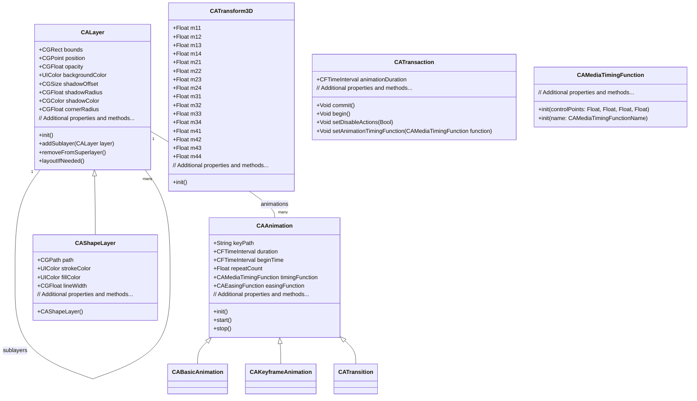

---

## **2. Initializers Overview**

### **a. Initialization Methods Diagram**
- **Purpose**: Break down the various ways to instantiate Core Animation classes.
- **Diagram Type**: `flowchart LR`
- **Contents**:
  - **Layer Initialization**: `init()`, `init(layer:)`
  - **Animation Initialization**: `init()`, `init(keyPath:)`
  - **Transform Initialization**: `CATransform3DMakeRotation`, `CATransform3DScale`, etc.
  - **Timing Function Initialization**: `init(name:)`, `init(controlPoints:)`
  - **Transaction Initialization**: `begin()`, `commit()`

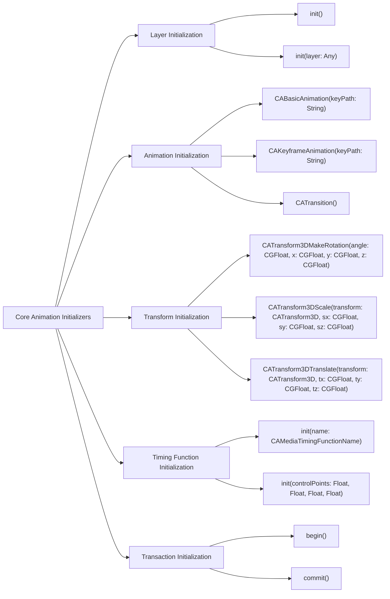

---

## **3. Properties Breakdown**

### **a. Key Properties Diagram**
- **Purpose**: Detail the main properties of Core Animation classes, focusing on `CALayer` and `CAAnimation`.
- **Diagram Type**: `graph LR`
- **Contents**:
  - **CALayer Properties**:
    - **Appearance**: `backgroundColor`, `cornerRadius`, `borderWidth`, `borderColor`
    - **Geometry**: `bounds`, `position`, `anchorPoint`, `transform`
    - **Shadow**: `shadowOpacity`, `shadowOffset`, `shadowRadius`, `shadowColor`
    - **Content**: `contents`, `contentsGravity`, `contentsScale`
  - **CAAnimation Properties**:
    - **Timing**: `duration`, `beginTime`, `timingFunction`, `fillMode`
    - **Behavior**: `repeatCount`, `autoreverses`, `isRemovedOnCompletion`
    - **KeyPath**: `keyPath`

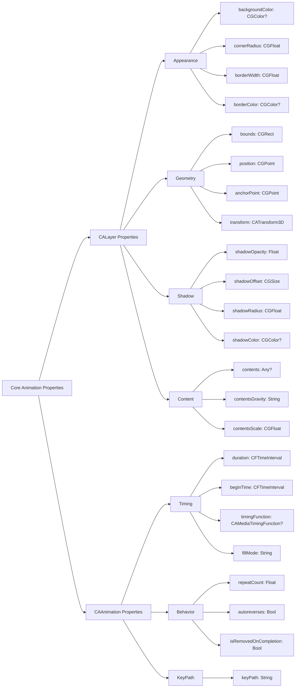

---

## **4. Methods Grouped by Functionality**

### **a. Animation Management Methods**
- **Purpose**: Categorize methods based on their roles in managing animations within Core Animation.
- **Diagram Type**: `flowchart TD`
- **Contents**:
  - **Adding Animations**: `add(_ animation: CAAnimation, forKey key: String?)`
  - **Removing Animations**: `removeAnimation(forKey key: String)`, `removeAllAnimations()`
  - **Animation Configuration**: `beginTransaction()`, `commitTransaction()`, `setValue(_:forKey:)`
  - **Timing Adjustments**: `convertTime(_:from:)`, `convertTime(_:to:)`

```mermaid
flowchart TD
    A[Core Animation Methods] --> B[Animation Management]
    A --> C[Layer Manipulation]
    A --> D[Transform Manipulation]
    A --> E[Shadow and Appearance]
    A --> F[Content Management]

    B --> B1["add(_ animation: CAAnimation, forKey key: String?)"]
    B --> B2["removeAnimation(forKey key: String)"]
    B --> B3["removeAllAnimations()"]
    B --> B4["beginTransaction()"]
    B --> B5["commitTransaction()"]
    B --> B6["setValue(_: Any?, forKey: String)"]

    C --> C1["addSublayer(_ layer: CALayer)"]
    C --> C2["removeFromSuperlayer()"]

    D --> D1["setTransform(_ transform: CATransform3D)"]
    D --> D2["getTransform() -> CATransform3D"]

    E --> E1["setShadowOpacity(_ opacity: Float)"]
    E --> E2["setShadowOffset(_ offset: CGSize)"]
    E --> E3["setShadowRadius(_ radius: CGFloat)"]
    E --> E4["setShadowColor(_ color: CGColor)"]

    F --> F1["setContents(_ contents: Any?)"]
    F --> F2["getContents() -> Any?"]
```

---

## **5. Enumerations and Configurations**

### **a. Enumerations Diagram**
- **Purpose**: Highlight the enums used within Core Animation and their possible values.
- **Diagram Type**: `classDiagram`
- **Contents**:
  - **CAMediaTimingFunctionName**
  - **CAFillMode**
  - **CATransitionType**
  - **CATransitionSubtype**
  - **CABasicAnimationKey**

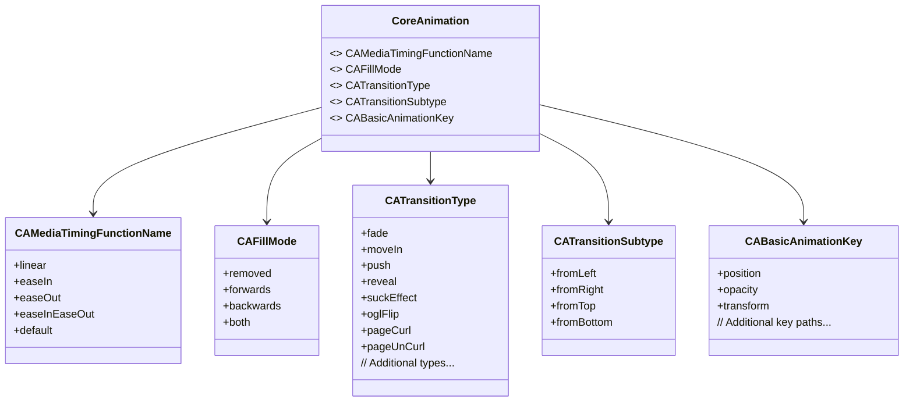

### **b. Configuration Classes Diagram**
- **Purpose**: Show the relationship between Core Animation classes and their configuration classes.
- **Diagram Type**: `classDiagram`
- **Contents**:
  - **CAMediaTimingFunction**
  - **CAAnimation**
  - **CATransform3D**
  - **CATransaction**

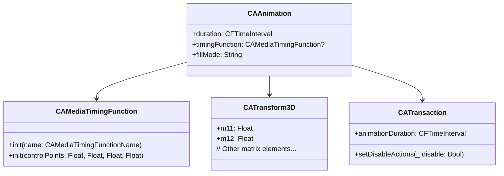

---

## **6. Protocol Conformances**

### **a. Protocols Diagram**
- **Purpose**: Display the protocols that Core Animation classes conform to and their impact.
- **Diagram Type**: `classDiagram`
- **Contents**:
  - **CAAnimationDelegate**
  - **NSCopying**
  - **NSObject**
  - **CAAction**
  - **CALayoutManager**

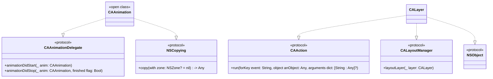

---

## **7. Relationships with Other Classes**

### **a. Related Classes Diagram**
- **Purpose**: Illustrate how Core Animation interacts with other UIKit classes and frameworks.
- **Diagram Type**: `flowchart TD`
- **Contents**:
  - **UIView**: Hosts `CALayer` as its backing layer.
  - **UIKit Classes**: `UIButton`, `UILabel`, `UIImageView` utilizing Core Animation for animations.
  - **QuartzCore Framework**: Provides Core Animation classes.
  - **CADisplayLink**: Synchronizes drawing with the display’s refresh rate.
  - **CAEmitterLayer**: For particle effects.
  - **Core Graphics**: Interoperability with graphics contexts.
  - **Metal**: Advanced rendering and performance optimizations.

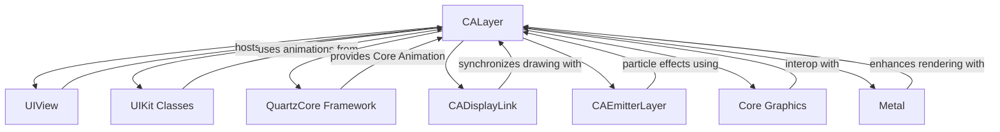

---

## **8. Extensions and Additional Functionalities**

### **a. Core Animation Extensions Diagram**
- **Purpose**: Showcase the additional functionalities provided through extensions in Core Animation.
- **Diagram Type**: `classDiagram`
- **Contents**:
  - **CALayer Extensions**
  - **CAAnimation Helpers**
  - **Animation Blocks**

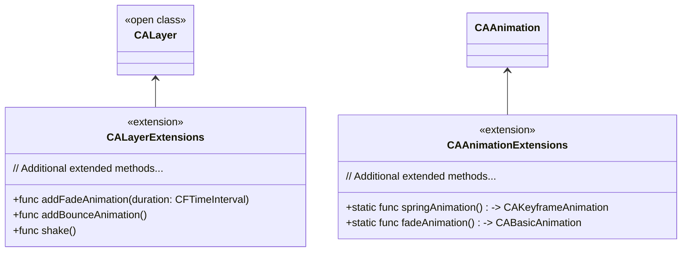

### **b. Extensions Functionalities Flowchart**
- **Purpose**: Detail specific extended methods and their purposes.
- **Diagram Type**: `flowchart LR`
- **Contents**:
  - **Layer Animations**
  - **Custom Animation Sequences**
  - **Convenience Methods**

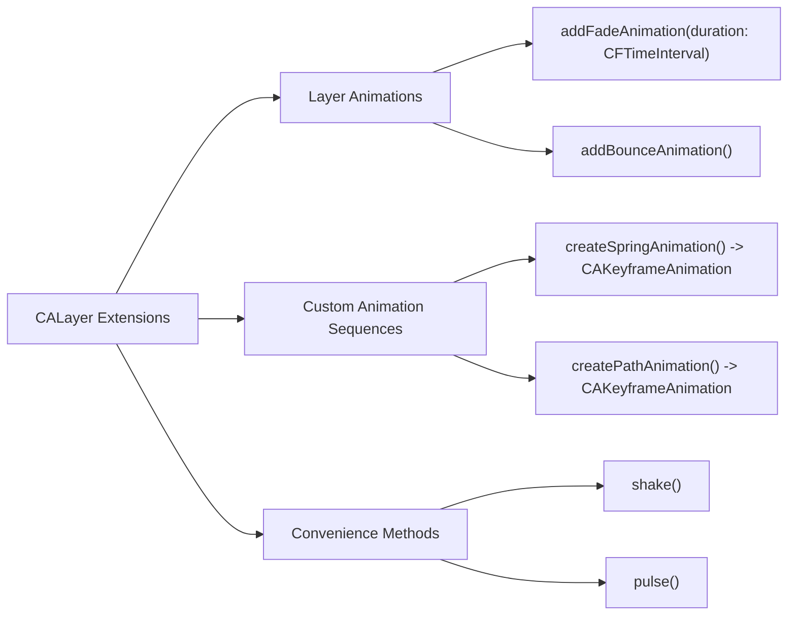

---

## **9. Lifecycle and Use Cases**

### **a. Lifecycle Flowchart**
- **Purpose**: Demonstrate the typical lifecycle of Core Animation objects within an application.
- **Diagram Type**: `flowchart TD`
- **Contents**:
  - **Initialization**
  - **Configuration**
  - **Adding to Layer**
  - **Running Animation**
  - **Completion Handling**
  - **Cleanup**

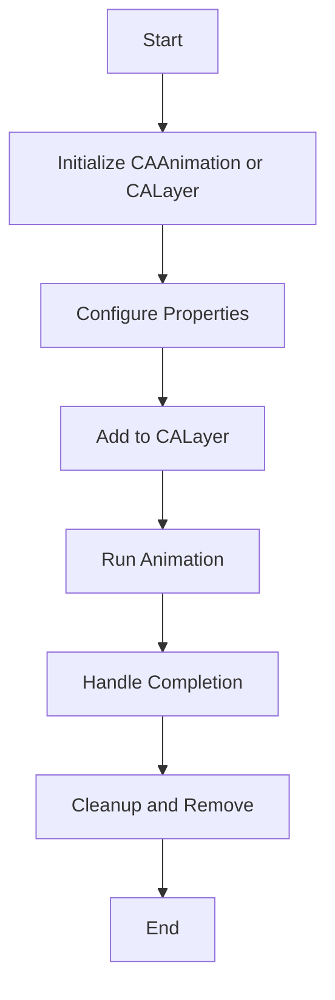

### **b. Common Use Cases Diagram**
- **Purpose**: Outline the typical scenarios where Core Animation is utilized.
- **Diagram Type**: `flowchart TD`
- **Contents**:
  - **View Animations**: Fading, scaling, rotating views.
  - **Layer Manipulations**: Changing layer properties like bounds, position.
  - **Complex Animations**: Keyframe animations, spring animations.
  - **Transitions**: Transitioning between views or states.
  - **Particle Effects**: Using CAEmitterLayer for particle systems.
  - **3D Transformations**: Applying 3D transforms to layers.
  - **Performance Optimizations**: Leveraging implicit animations for smooth UI.

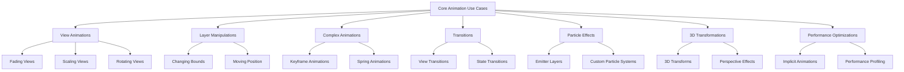

---

## **10. Feature Availability Timeline**

### **a. Feature Availability Gantt Chart**
- **Purpose**: Show when various Core Animation features were introduced across iOS versions.
- **Diagram Type**: `gantt`
- **Contents**:
  - **iOS Versions**: 2.0, 4.0, 5.0, 6.0, 7.0, 8.0, 10.0, 11.0, 12.0, 13.0, 14.0, 15.0, 16.0, 17.0
  - **Features Introduced**: Keyframe animations, 3D transforms, implicit animations, CAEmitterLayer, CATransition types, etc.

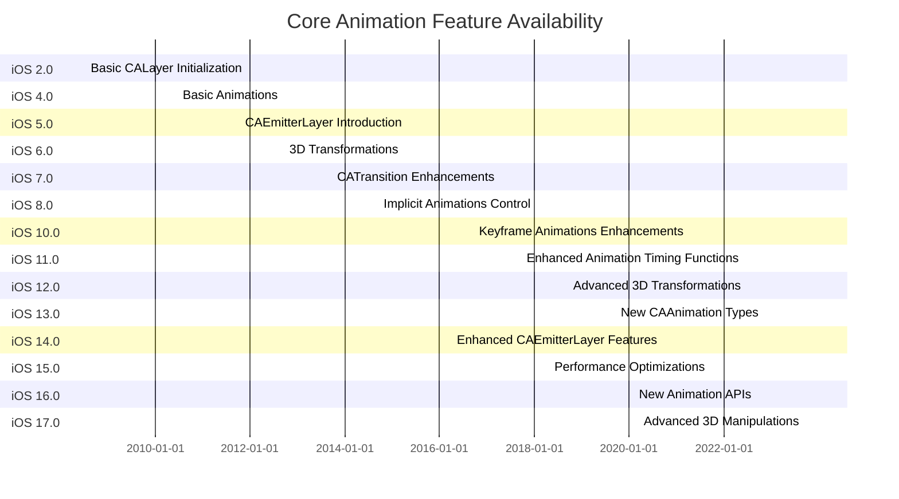

---

## **11. Data Handling and Formats**

### **a. Animation Data Handling Diagram**
- **Purpose**: Explain how Core Animation handles different animation data formats and configurations.
- **Diagram Type**: `graph LR`
- **Contents**:
  - **CAAnimation Types**: `CABasicAnimation`, `CAKeyframeAnimation`, `CATransition`, `CAAnimationGroup`
  - **Data Formats**: JSON-based animation descriptions, programmatic animations
  - **Export & Import**: Archiving animations, using CAAnimation in Storyboards

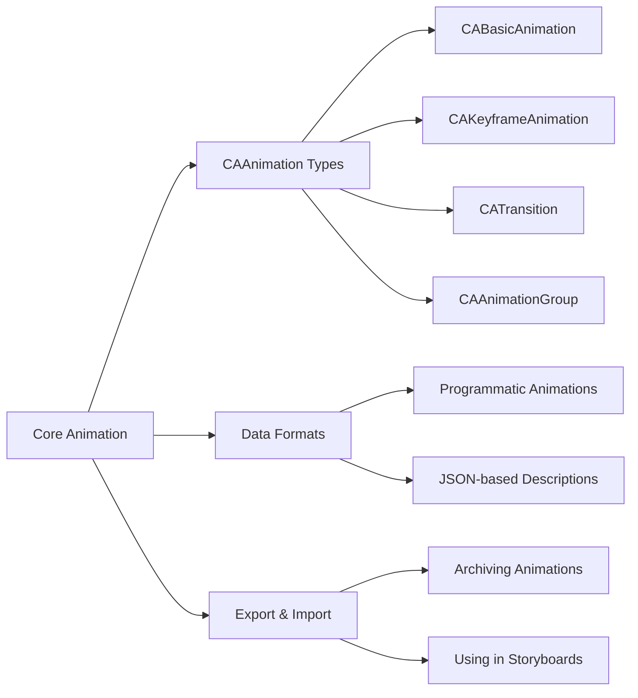

---

## **12. Integration with Drawing Contexts**

### **a. Drawing Methods Usage Diagram**
- **Purpose**: Show how Core Animation methods are used within drawing contexts.
- **Diagram Type**: `flowchart TD`
- **Contents**:
  - **Layer Customization**: Setting properties like `bounds`, `position`
  - **Adding Sublayers**: `addSublayer(_:)`
  - **Drawing Paths**: Using `CAShapeLayer` for custom shapes
  - **Applying Transforms**: `setTransform(_:)`
  - **Animating Properties**: Adding `CAAnimation` to layers

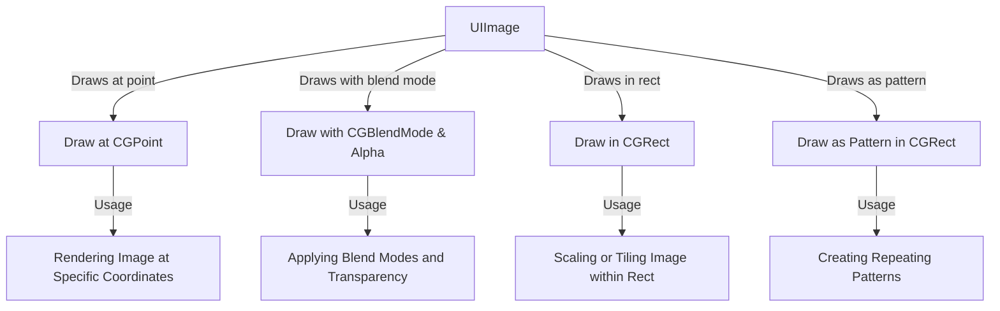

---

## **13. Summary and Best Practices**

### **a. Summary Diagram**
- **Purpose**: Provide a high-level overview of Core Animation's key characteristics and functionalities.
- **Diagram Type**: `graph LR`
- **Contents**:
  - **Versatile Animations**: Basic, keyframe, transitions
  - **Layer Management**: Hierarchical layers, sublayers
  - **3D Transformations**: Advanced 3D effects
  - **Performance Optimizations**: Implicit animations, efficient layering
  - **Seamless Integration**: With UIKit, Core Graphics, Metal

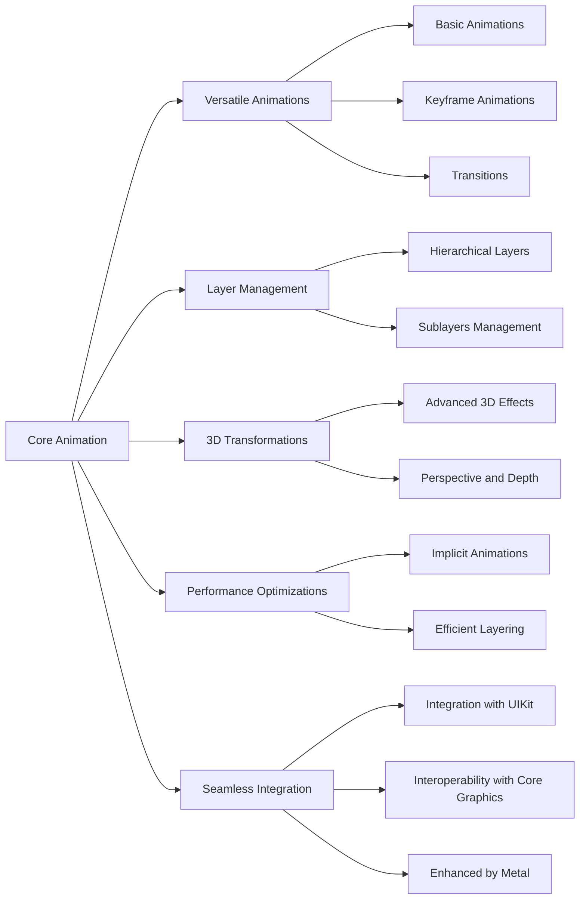

---

## **Best Practices**

1. **Utilize Implicit Animations**: Leverage implicit animations for smoother and more efficient UI updates without excessive code.

2. **Layer Hierarchy Management**: Maintain a clear and efficient layer hierarchy to optimize rendering performance and memory usage.

3. **Use CAEmitterLayer for Particle Effects**: Implement particle systems using `CAEmitterLayer` for visually appealing and performant effects.

4. **Optimize 3D Transforms**: Apply 3D transformations judiciously, understanding their impact on performance and visual complexity.

5. **Leverage CAAnimation Groups**: Combine multiple animations using `CAAnimationGroup` to synchronize and manage complex animation sequences.

6. **Control Animation Lifecycles**: Appropriately begin and commit `CATransaction` blocks to manage animation properties and timing effectively.

7. **Adopt Modern Animation Techniques**: Stay updated with the latest Core Animation features introduced in recent iOS versions to enhance app interactivity and responsiveness.

8. **Profile and Optimize**: Regularly use profiling tools like Instruments to identify and address performance bottlenecks related to animations and layer rendering.

By adhering to these best practices and leveraging the detailed structure provided in the diagrams, developers can effectively implement and manage Core Animation within their iOS applications, ensuring both aesthetic appeal and optimal performance.

