# Core Audio
> This content is dual-licensed under your choice of the following licenses:
> 1.  **MIT License:** For the code implementations in Swift and Mermaid provided in this document.
> 2.  **Creative Commons Attribution 4.0 International License (CC BY 4.0):** For all other content, including the text, explanations, and the Mermaid diagrams and illustrations.

---

## **1. Framework Structure and Hierarchy**

### **a. Core Audio Framework Diagram**
- **Purpose**: Illustrate the primary components of the Core Audio framework, including its main services and subsystems.
- **Diagram Type**: `classDiagram`
- **Contents**:
  - **Main Components**: Audio Units, Audio Queues, Audio File Services, Audio Format Services, Audio Processing Units.
  - **Subcomponents**: Remote IO, MIDI Services, etc.

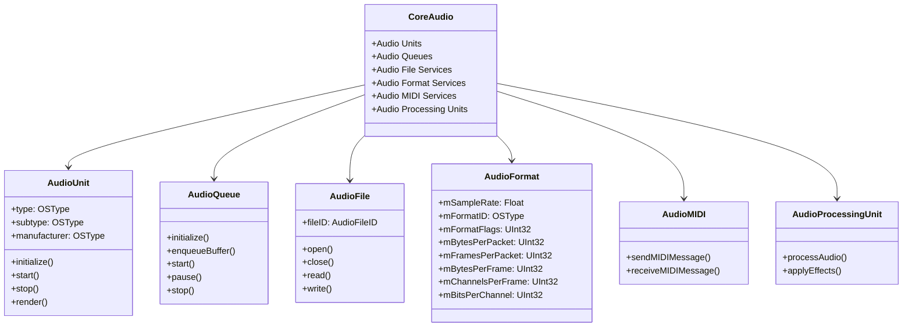

---

## **2. Initialization Overview**

### **a. Core Audio Initialization Flowchart**
- **Purpose**: Outline the various initialization pathways within the Core Audio framework.
- **Diagram Type**: `flowchart TD`
- **Contents**:
  - **Initialization of Audio Units**
  - **Initialization of Audio Queues**
  - **Initialization of Audio Files**
  - **Initialization of Audio Sessions**

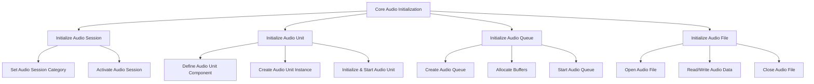

---

## **3. Structures and Data Types Breakdown**

### **a. Core Audio Key Structures Diagram**
- **Purpose**: Detail the main structures used within Core Audio for handling audio data and configurations.
- **Diagram Type**: `classDiagram`
- **Contents**:
  - **AudioStreamBasicDescription**
  - **AudioBufferList**
  - **AudioTimeStamp**
  - **MIDIEvent**
  - **AudioBuffer**

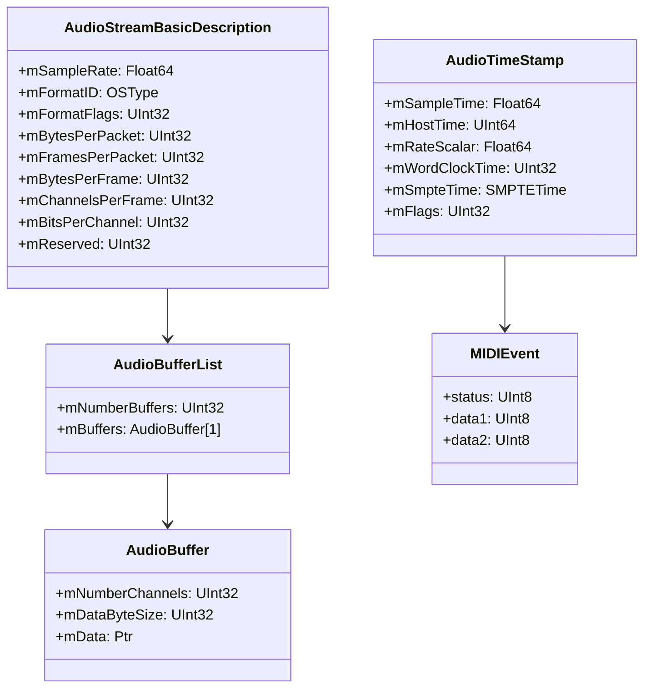

---

## **4. Functions and Methodologies Grouped by Functionality**

### **a. Audio Processing Functions Diagram**
- **Purpose**: Categorize Core Audio functions based on their roles in audio processing.
- **Diagram Type**: `flowchart TD`
- **Contents**:
  - **Audio Session Management**
  - **Audio Buffer Management**
  - **Audio Rendering and Playback**
  - **MIDI Event Handling**
  - **Audio File Operations**

```mermaid
flowchart TD
    A[Core Audio Functions] --> B[Audio Session Management]
    A --> C[Audio Buffer Management]
    A --> D[Audio Rendering & Playback]
    A --> E[MIDI Event Handling]
    A --> F[Audio File Operations]

    B --> B1["AudioSessionInitialize()"]
    B --> B2["AudioSessionSetActive()"]
    B --> B3["AudioSessionSetProperty()"]

    C --> C1["AudioBufferListAllocate()"]
    C --> C2["AudioBufferListDeallocate()"]
    C --> C3["AudioQueueAllocateBuffer()"]

    D --> D1["AudioUnitRender()"]
    D --> D2["AudioQueueStart()"]
    D --> D3["AudioQueueStop()"]

    E --> E1["MIDISend()"]
    E --> E2["MIDIReceived()"]
    E --> E3["MIDIClientCreate()"]

    F --> F1["AudioFileOpenURL()"]
    F --> F2["AudioFileReadPackets()"]
    F --> F3["AudioFileWritePackets()"]
```

---

## **5. Enumerations and Configurations**

### **a. Core Audio Enumerations Diagram**
- **Purpose**: Highlight the enums used within Core Audio and their possible values.
- **Diagram Type**: `classDiagram`
- **Contents**:
  - **AudioFormatFlags**
  - **AudioSessionCategory**
  - **AudioUnitParameterScope**
  - **MIDIMessageType**

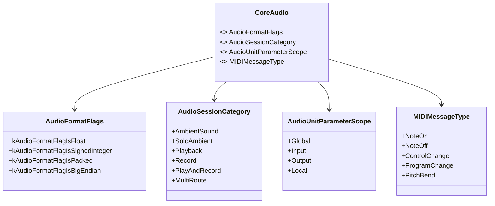

### **b. Configuration Classes Diagram**
- **Purpose**: Show the relationship between Core Audio and its configuration structures.
- **Diagram Type**: `classDiagram`
- **Contents**:
  - **AudioStreamBasicDescription**
  - **AudioBufferList**
  - **AudioSessionSettings**

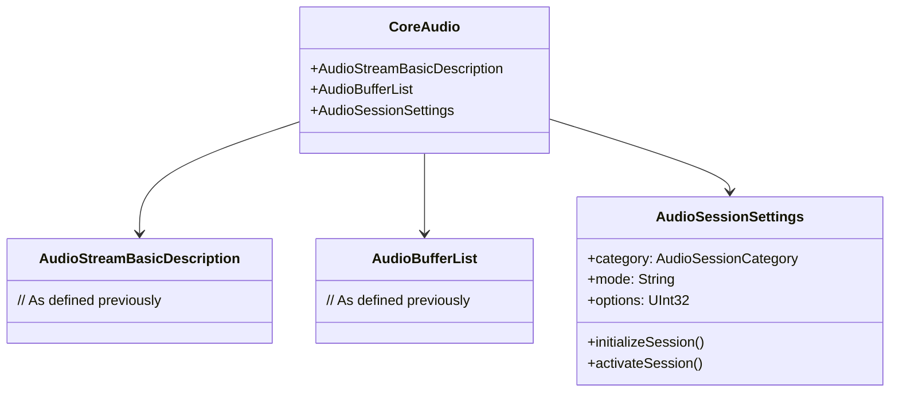

---

## **6. Protocol Conformances**

### **a. Core Audio Protocols Diagram**
- **Purpose**: Display the protocols that Core Audio components conform to and their impact.
- **Diagram Type**: `classDiagram`
- **Contents**:
  - **AudioUnit**
  - **AudioQueue**
  - **MIDIProtocol**
  - **AudioFileProtocol**

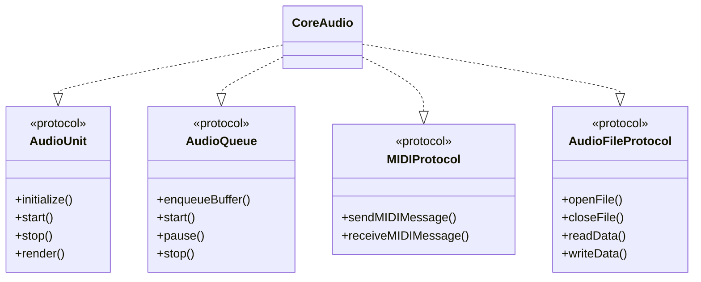

---

## **7. Relationships with Other Frameworks and Classes**

### **a. Core Audio Integration Diagram**
- **Purpose**: Illustrate how Core Audio interacts with other Apple frameworks and key classes.
- **Diagram Type**: `flowchart TD`
- **Contents**:
  - **AVFoundation**
  - **MediaPlayer**
  - **AudioToolbox**
  - **UIKit**
  - **Metal**
  - **CoreMIDI**

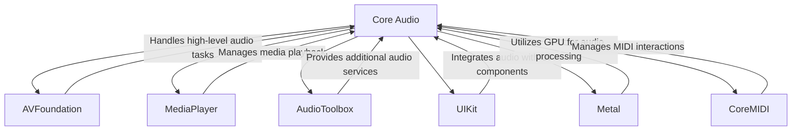

---

## **8. Extensions and Additional Functionalities**

### **a. Core Audio Extensions Diagram**
- **Purpose**: Showcase additional functionalities provided through extensions and helper libraries.
- **Diagram Type**: `classDiagram`
- **Contents**:
  - **AudioFileExtensions**
  - **AudioUnitExtensions**
  - **MIDIExtensions**
  - **AudioSessionExtensions**

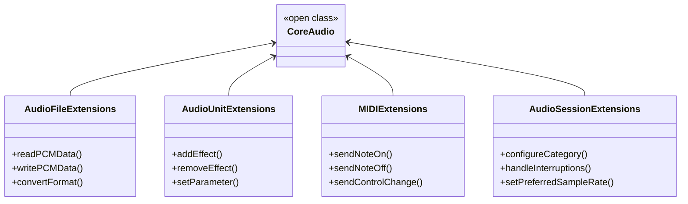

### **b. Extensions Functionalities Flowchart**
- **Purpose**: Detail specific extended methods and their purposes.
- **Diagram Type**: `flowchart LR`
- **Contents**:
  - **Audio File Operations**
  - **Audio Unit Manipulations**
  - **MIDI Messaging**
  - **Audio Session Management**

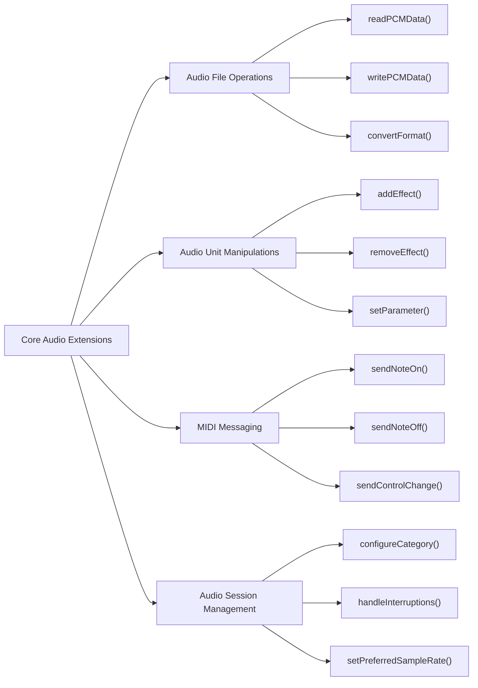

---

## **9. Lifecycle and Use Cases**

### **a. Core Audio Lifecycle Flowchart**
- **Purpose**: Demonstrate the typical lifecycle of Core Audio components within an application.
- **Diagram Type**: `flowchart TD`
- **Contents**:
  - **Initialization**
  - **Configuration**
  - **Execution**
  - **Termination**
  - **Error Handling**

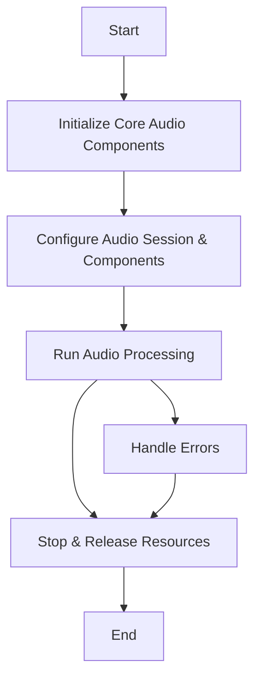

### **b. Common Use Cases Diagram**
- **Purpose**: Outline the typical scenarios where Core Audio is utilized.
- **Diagram Type**: `flowchart TD`
- **Contents**:
  - **Audio Playback**
  - **Audio Recording**
  - **Real-Time Audio Processing**
  - **MIDI Communication**
  - **Audio Streaming**
  - **Audio Effects Implementation**

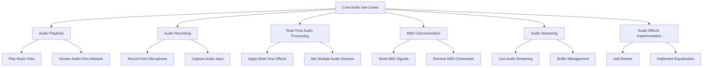

---

## **10. Feature Availability Timeline**

### **a. Core Audio Feature Availability Gantt Chart**
- **Purpose**: Show when various Core Audio features were introduced across iOS and macOS versions.
- **Diagram Type**: `gantt`
- **Contents**:
  - **macOS Versions**: 10.0, 10.5, 10.7, 10.10, 11.0, 12.0, 13.0
  - **iOS Versions**: 2.0, 4.0, 5.0, 6.0, 7.0, 8.0, 10.0, 12.0, 14.0
  - **Features Introduced**: Audio Session Enhancements, Audio Queue Upgrades, Audio Unit v3, MIDI Enhancements, etc.

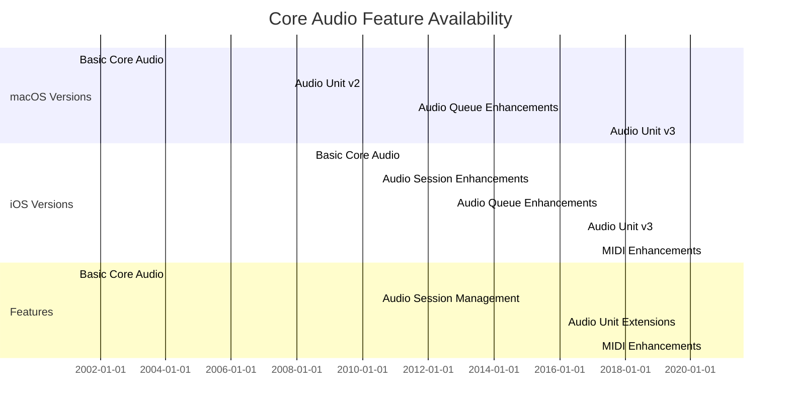

---

## **11. Data Handling and Formats**

### **a. Audio Format Handling Diagram**
- **Purpose**: Explain how Core Audio handles different audio data formats.
- **Diagram Type**: `graph LR`
- **Contents**:
  - **PCM**
  - **AAC**
  - **ALAC**
  - **MP3**
  - **AIFF**
  - **WAV**
  - **CAF**

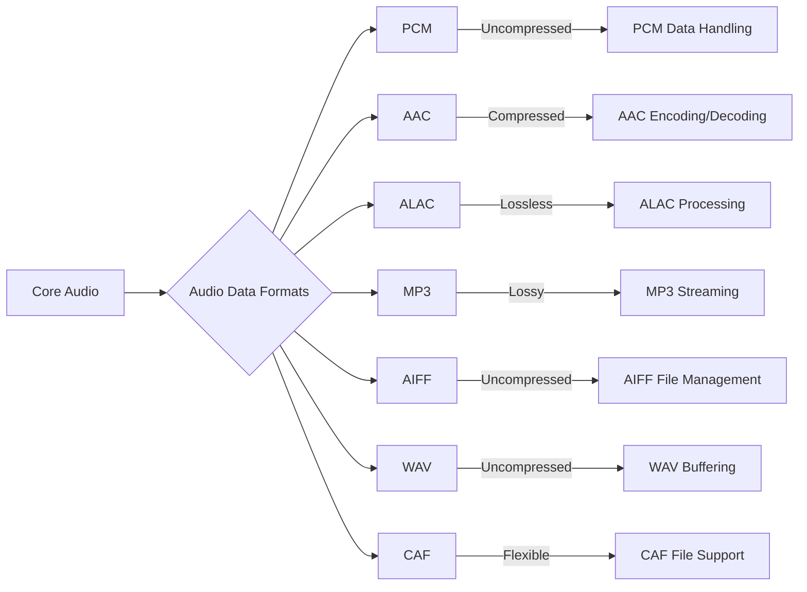

---

## **12. Integration with Other Services**

### **a. Core Audio Integration with Drawing Contexts Diagram**
- **Purpose**: Show how Core Audio integrates with graphics and rendering contexts for visualizations.
- **Diagram Type**: `flowchart TD`
- **Contents**:
  - **Metal**
  - **Core Graphics**
  - **UIKit**
  - **SwiftUI**

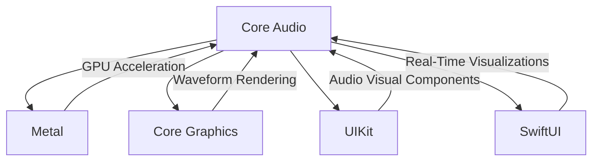

---

## **13. Summary and Best Practices**

### **a. Core Audio Summary Diagram**
- **Purpose**: Provide a high-level overview of Core Audio's key characteristics and functionalities.
- **Diagram Type**: `graph LR`
- **Contents**:
  - **Versatile Initialization**
  - **Advanced Audio Processing**
  - **Performance Optimizations**
  - **MIDI Support**
  - **Seamless Integration**
  - **Robust Data Handling**

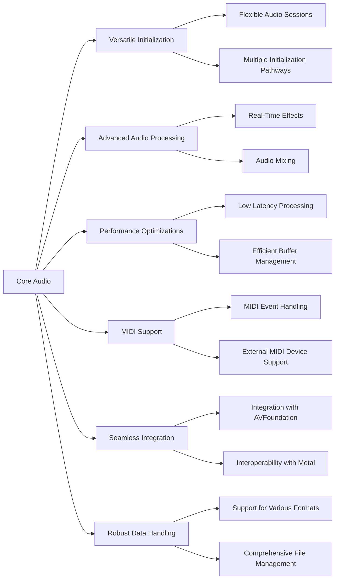

---

## **Best Practices for Using Core Audio**

1. **Efficient Buffer Management**:
   - Utilize appropriate buffer sizes to minimize latency and prevent buffer underruns.
   - Reuse audio buffers when possible to reduce memory allocation overhead.

2. **Optimize Audio Session Settings**:
   - Configure audio sessions based on the app’s requirements, such as playback, recording, or both.
   - Handle audio interruptions gracefully to maintain a smooth user experience.

3. **Leverage Audio Units Effectively**:
   - Use built-in Audio Units for common audio processing tasks to save development time.
   - Customize Audio Units for specialized audio processing needs.

4. **Implement Robust Error Handling**:
   - Always check return codes of Core Audio functions and handle errors appropriately.
   - Provide fallback mechanisms in case of failures in audio processing pathways.

5. **Maintain Low Latency**:
   - Optimize audio processing chains to reduce latency, crucial for real-time audio applications.
   - Prefer synchronous processing where necessary to ensure timely audio feedback.

6. **Ensure Thread Safety**:
   - Core Audio callbacks may occur on real-time threads; avoid blocking operations within these callbacks.
   - Use thread-safe data structures and synchronization mechanisms when sharing data across threads.

7. **Utilize MIDI Responsibly**:
   - Manage MIDI connections efficiently to prevent unnecessary resource usage.
   - Implement appropriate MIDI message parsing and handling to ensure accurate communication.

8. **Integrate Seamlessly with Other Frameworks**:
   - Combine Core Audio with AVFoundation, Metal, or UIKit to create rich multimedia experiences.
   - Use Core Audio’s data outputs effectively within graphical or interactive contexts.

9. **Stay Updated with Framework Enhancements**:
   - Monitor Apple’s updates to Core Audio to leverage new features and improvements.
   - Refactor and optimize existing audio components to align with the latest best practices and APIs.

10. **Profile and Optimize Performance**:
    - Use profiling tools like Instruments to identify and address performance bottlenecks in audio processing.
    - Optimize CPU and memory usage to ensure smooth and efficient audio handling.

---
**Licenses:**

- **MIT License:**   - Full text in [LICENSE](LICENSE) file.
- **Creative Commons Attribution 4.0 International:**  - Legal details in [LICENSE-CC-BY](LICENSE-CC-BY) and at [Creative Commons official site](http://creativecommons.org/licenses/by/4.0/).

---