# Core Bluetooth

Below is a comprehensive and organized set of Mermaid diagrams for the **Core Bluetooth** framework. These diagrams cover various facets of the Core Bluetooth framework, including class structures, initializers, properties, methods, enumerations, protocol conformances, relationships, extensions, lifecycle, feature availability, data handling, integration, and best practices.

---

## **1. Class Structure and Hierarchy**

### **a. Core Class Diagram**
- **Purpose**: Illustrate the primary structure of Core Bluetooth's main classes, including their properties, methods, and enumerations.
- **Diagram Type**: `classDiagram`
- **Contents**:
  - **Classes**: `CBCentralManager`, `CBPeripheral`, `CBService`, `CBCharacteristic`, `CBDescriptor`
  - **Enumerations**: `CBManagerState`, `CBPeripheralState`, `CBCharacteristicProperties`, `CBAttributePermissions`

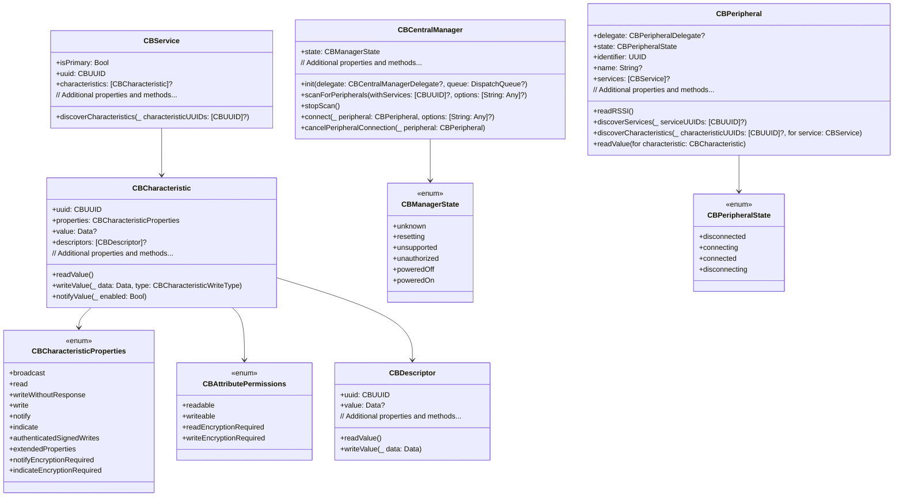

---

## **2. Initializers Overview**

### **a. Initialization Methods Diagram**
- **Purpose**: Break down the various ways to instantiate Core Bluetooth's main classes.
- **Diagram Type**: `flowchart LR`
- **Contents**:
  - **CBCentralManager**: `init(delegate:queue:)`
  - **CBPeripheral**: Typically instantiated by Core Bluetooth
  - **CBService**: Provided by Core Bluetooth
  - **CBCharacteristic**: Provided by Core Bluetooth
  - **CBDescriptor**: Provided by Core Bluetooth

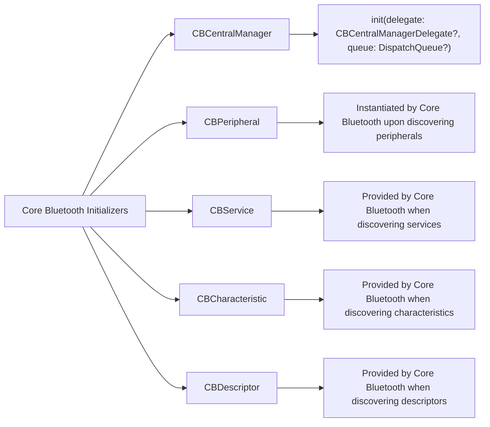

---

## **3. Properties Breakdown**

### **a. Key Properties Diagram**
- **Purpose**: Detail the main properties of Core Bluetooth's primary classes.
- **Diagram Type**: `graph LR`
- **Contents**:
  - **CBCentralManager**: `state`, `delegate`, `retrievedPeripherals`
  - **CBPeripheral**: `state`, `identifier`, `name`, `services`
  - **CBService**: `uuid`, `isPrimary`, `characteristics`
  - **CBCharacteristic**: `uuid`, `properties`, `value`, `descriptors`
  - **CBDescriptor**: `uuid`, `value`

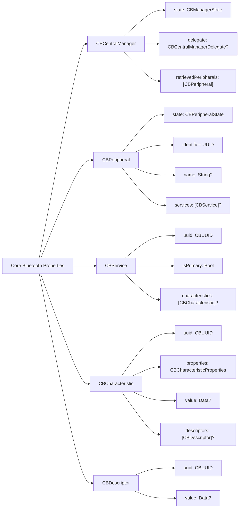


---

## **4. Methods Grouped by Functionality**

### **a. Connectivity Methods**
- **Purpose**: Categorize methods based on their roles in managing Bluetooth connections.
- **Diagram Type**: `flowchart TD`
- **Contents**:
  - **Scanning for Peripherals**: `scanForPeripherals(withServices:options:)`, `stopScan()`
  - **Connecting to Peripherals**: `connect(_:options:)`, `cancelPeripheralConnection(_:)`
  - **Retrieving Peripherals**: `retrievePeripherals(withIdentifiers:)`, `retrieveConnectedPeripherals(withServices:)`
  - **Handling Connections**: Delegate methods for connection events

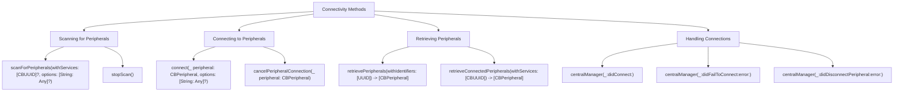

---

## **5. Enumerations and Configurations**

### **a. Enumerations Diagram**
- **Purpose**: Highlight the enums used within Core Bluetooth and their possible values.
- **Diagram Type**: `classDiagram`
- **Contents**:
  - **CBManagerState**
  - **CBPeripheralState**
  - **CBCharacteristicProperties**
  - **CBAttributePermissions**
  - **CBCharacteristicWriteType**

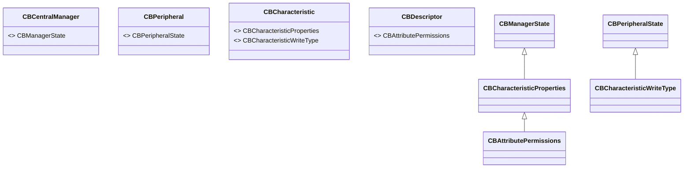

### **b. Configuration Classes Diagram**
- **Purpose**: Show the relationship between Core Bluetooth classes and their configuration classes.
- **Diagram Type**: `classDiagram`
- **Contents**:
  - **CBCentralManager**
  - **CBPeripheral**
  - **CBService**
  - **CBCharacteristic**

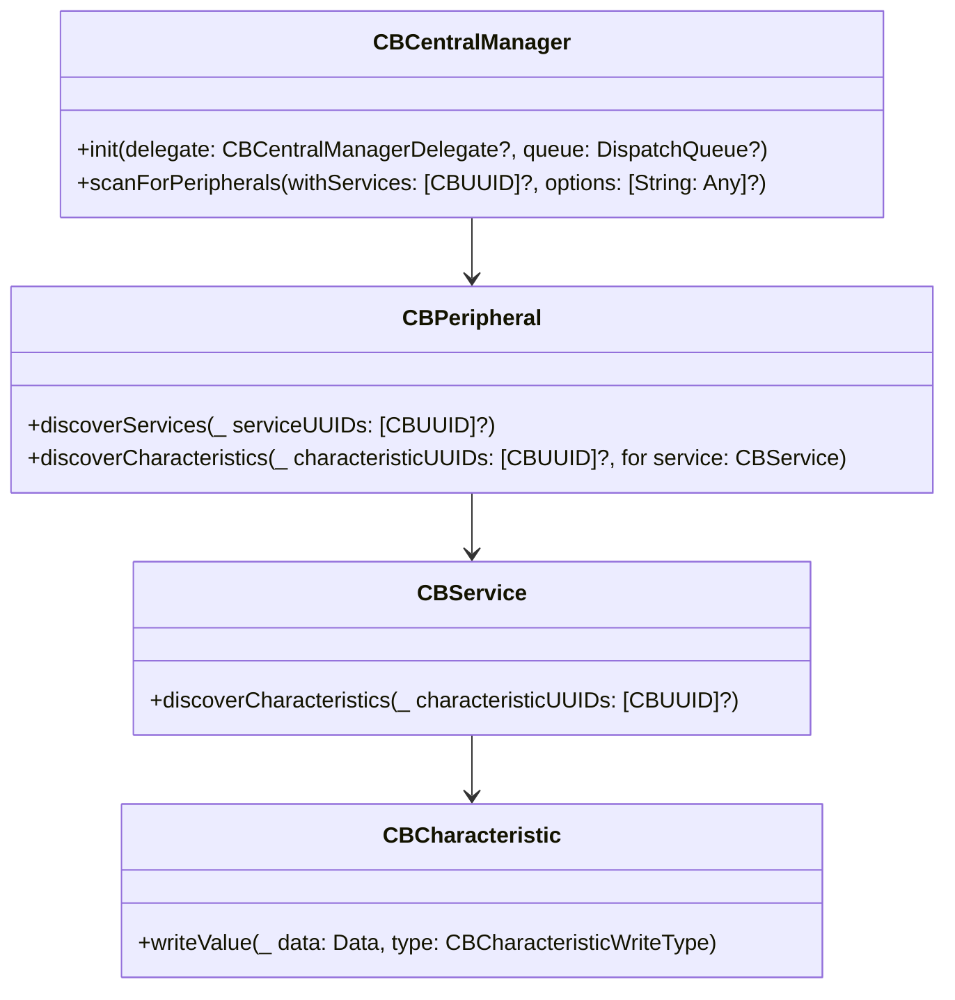

---

## **6. Protocol Conformances**

### **a. Protocols Diagram**
- **Purpose**: Display the protocols that Core Bluetooth classes conform to and their impact.
- **Diagram Type**: `classDiagram`
- **Contents**:
  - **CBCentralManagerDelegate**
  - **CBPeripheralDelegate**
  - **CBPeripheralManagerDelegate**
  - **CBService**
  - **CBCharacteristic**
  - **CBDescriptor**

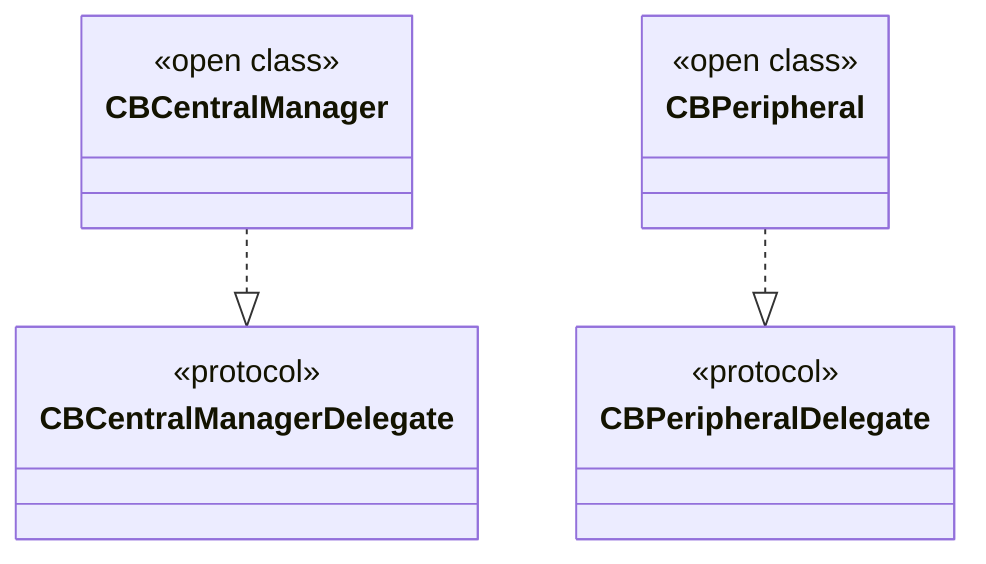

---

## **7. Relationships with Other Classes**

### **a. Related Classes Diagram**
- **Purpose**: Illustrate how Core Bluetooth's main classes interact with each other and other frameworks.
- **Diagram Type**: `flowchart TD`
- **Contents**:
  - **CBCentralManager**: Manages multiple `CBPeripheral` instances
  - **CBPeripheral**: Contains multiple `CBService` instances
  - **CBService**: Contains multiple `CBCharacteristic` instances
  - **CBCharacteristic**: Contains multiple `CBDescriptor` instances
  - **Foundation**: Uses `UUID`, `Data`, etc.
  - **Dispatch**: Utilizes `DispatchQueue` for concurrency

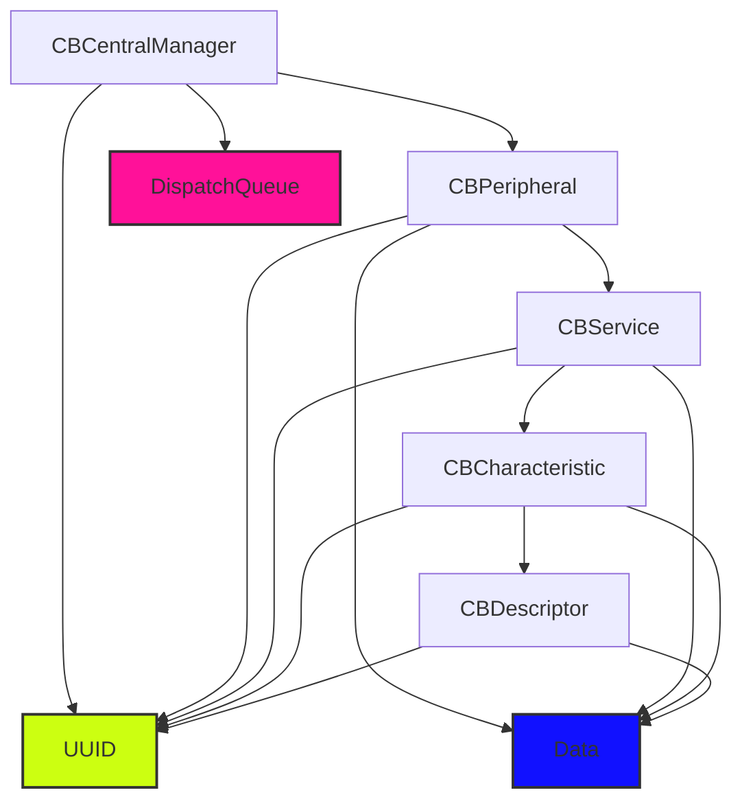

---

## **8. Extensions and Additional Functionalities**

### **a. Core Bluetooth Extensions Diagram**
- **Purpose**: Showcase additional functionalities provided through extensions.
- **Diagram Type**: `classDiagram`
- **Contents**:
  - **CBCentralManager Extensions**
  - **CBPeripheral Extensions**

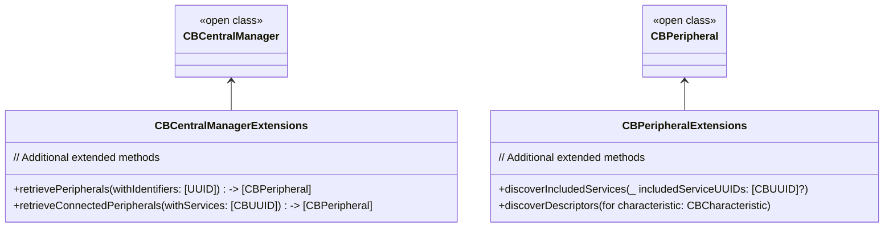

### **b. Extensions Functionalities Flowchart**
- **Purpose**: Detail specific extended methods and their purposes.
- **Diagram Type**: `flowchart LR`
- **Contents**:
  - **Retrieving Peripherals**
  - **Discovering Included Services**
  - **Discovering Descriptors**

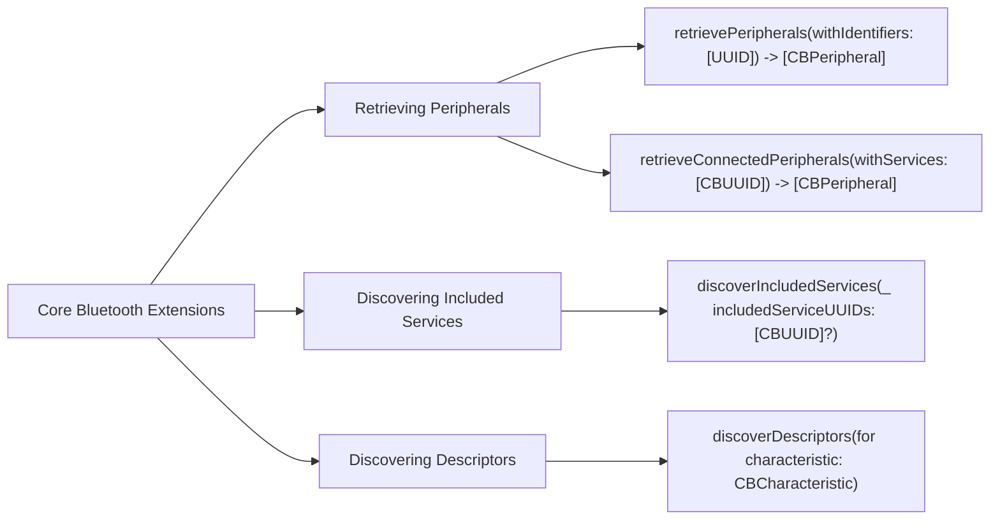

---

## **9. Lifecycle and Use Cases**

### **a. Lifecycle Flowchart**
- **Purpose**: Demonstrate the typical lifecycle of a Core Bluetooth interaction within an application.
- **Diagram Type**: `flowchart TD`
- **Contents**:
  - **Initialization**
  - **Scanning for Peripherals**
  - **Connecting to Peripheral**
  - **Discovering Services**
  - **Discovering Characteristics**
  - **Interacting with Characteristics**
  - **Disconnecting**

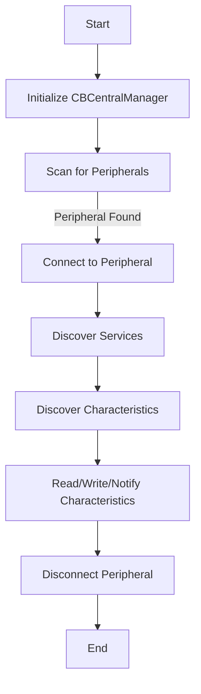

### **b. Common Use Cases Diagram**
- **Purpose**: Outline the typical scenarios where Core Bluetooth is utilized.
- **Diagram Type**: `flowchart TD`
- **Contents**:
  - **Health Monitoring**
  - **Home Automation**
  - **Peripheral Control**
  - **Data Transfer**
  - **Beacons and Proximity Detection**
  - **Gaming Controllers**
  - **IoT Devices**

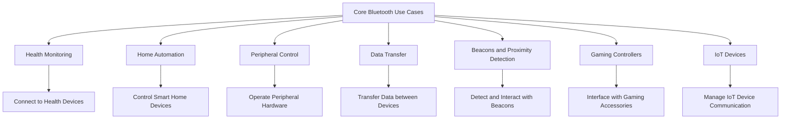

---

## **10. Feature Availability Timeline**

### **a. Feature Availability Gantt Chart**
- **Purpose**: Show when various Core Bluetooth features were introduced across iOS versions.
- **Diagram Type**: `gantt`
- **Contents**:
  - **iOS Versions**: 5.0, 6.0, 7.0, 8.0, 10.0, 11.0, 13.0, 14.0, 16.0, 17.0
  - **Features Introduced**: Central and Peripheral roles, State Restoration, Background Modes, Bluetooth Low Energy improvements, Dictionary for Peripheral Discovery, Mesh Networking, Enhanced Security, Multiple Connections, Broadcast Channels, Extended Data Length

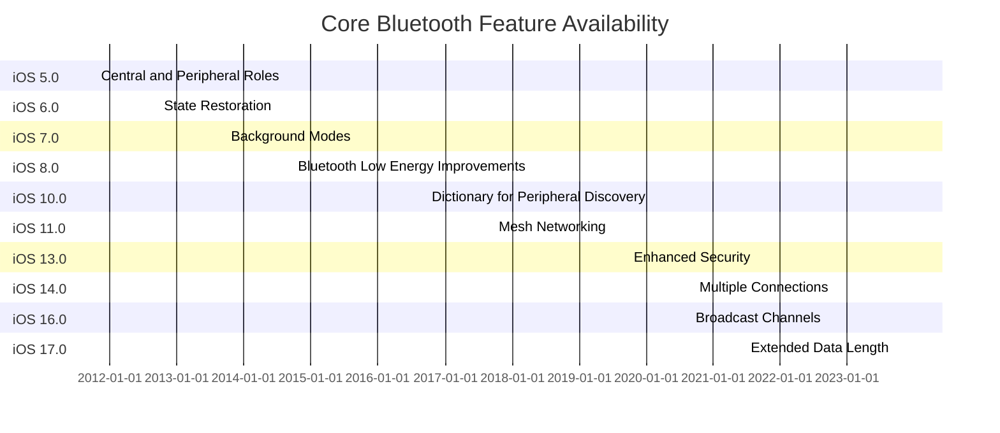

---

## **11. Data Handling and Formats**

### **a. Data Format Handling Diagram**
- **Purpose**: Explain how Core Bluetooth handles different data formats during communication.
- **Diagram Type**: `graph LR`
- **Contents**:
  - **Data Transmission**: `NSData`, `String`, `Custom Objects`
  - **Encoding/Decoding**: `JSON`, `XML`, `Binary`
  - **Data Integrity**: `Checksums`, `Error Detection`
  - **Security**: `Encryption`, `Authentication`

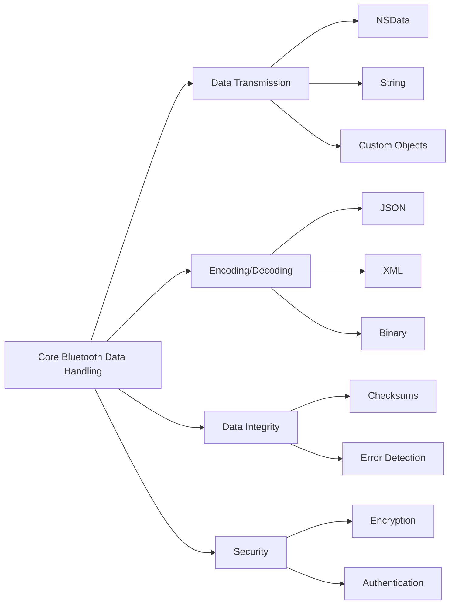

---

## **12. Integration with Other Frameworks**

### **a. Integration Methods Diagram**
- **Purpose**: Show how Core Bluetooth integrates with other iOS frameworks.
- **Diagram Type**: `flowchart TD`
- **Contents**:
  - **Foundation**: `UUID`, `Data`, `DispatchQueue`
  - **UIKit**: User Interfaces for Bluetooth interactions
  - **CoreLocation**: Combining Bluetooth with Location Services
  - **HealthKit**: Integrating with Health Devices
  - **Background Modes**: Enabling background Bluetooth operations

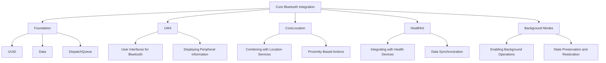

---

## **13. Summary and Best Practices**

### **a. Summary Diagram**
- **Purpose**: Provide a high-level overview of Core Bluetooth's key characteristics and functionalities.
- **Diagram Type**: `graph LR`
- **Contents**:
  - **Versatile Roles**
  - **Robust Data Handling**
  - **Enhanced Security**
  - **Seamless Integration**
  - **Scalable Connectivity**

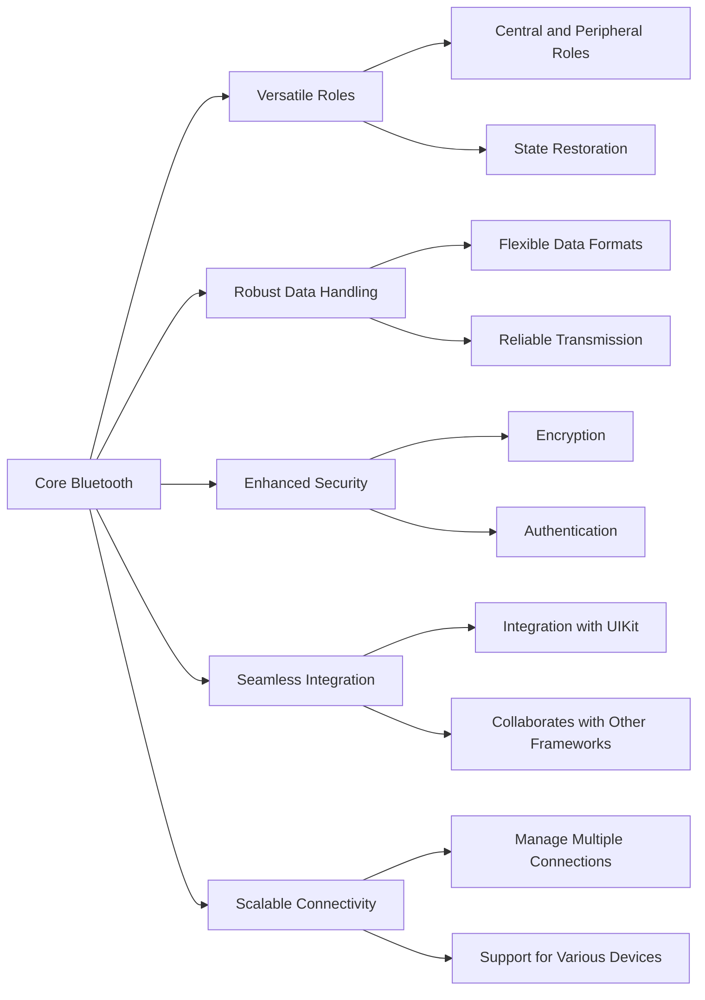

### **b. Best Practices Flowchart**
- **Purpose**: Outline best practices when using Core Bluetooth in applications.
- **Diagram Type**: `flowchart TD`
- **Contents**:
  - **Efficient Scanning**
  - **Proper Resource Management**
  - **Handling State Changes**
  - **Ensuring Security**
  - **Optimizing Performance**
  - **User Permissions and Privacy**
  - **Robust Error Handling**

```mermaid
flowchart TD
    A[Core Bluetooth Best Practices] --> B[Efficient Scanning]
    A --> C[Proper Resource Management]
    A --> D[Handling State Changes]
    A --> E[Ensuring Security]
    A --> F[Optimizing Performance]
    A --> G[User Permissions and Privacy]
    A --> H[Robust Error Handling]

    B --> B1["Scan for Specific Services"]
    B --> B2["Limit Scan Duration"]

    C --> C1["Manage Connections Properly"]
    C --> C2["Release Resources When Not Needed"]

    D --> D1["Respond to State Updates"]
    D --> D2["Handle Peripheral States"]

    E --> E1["Use Encryption"]
    E --> E2["Authenticate Devices"]

    F --> F1["Optimize Data Transmission"]
    F --> F2["Minimize Battery Consumption"]

    G --> G1["Request Necessary Permissions"]
    G --> G2["Respect User Privacy"]

    H --> H1["Implement Comprehensive Error Handling"]
    H --> H2["Provide User Feedback on Errors"]
```

---

## **14. Advanced Features and Extensions**

### **a. Mesh Networking Diagram**
- **Purpose**: Detail the mesh networking capabilities within Core Bluetooth.
- **Diagram Type**: `classDiagram`
- **Contents**:
  - **Mesh Provisioner**
  - **Mesh Node**
  - **Mesh Message**
  - **Mesh Manager**

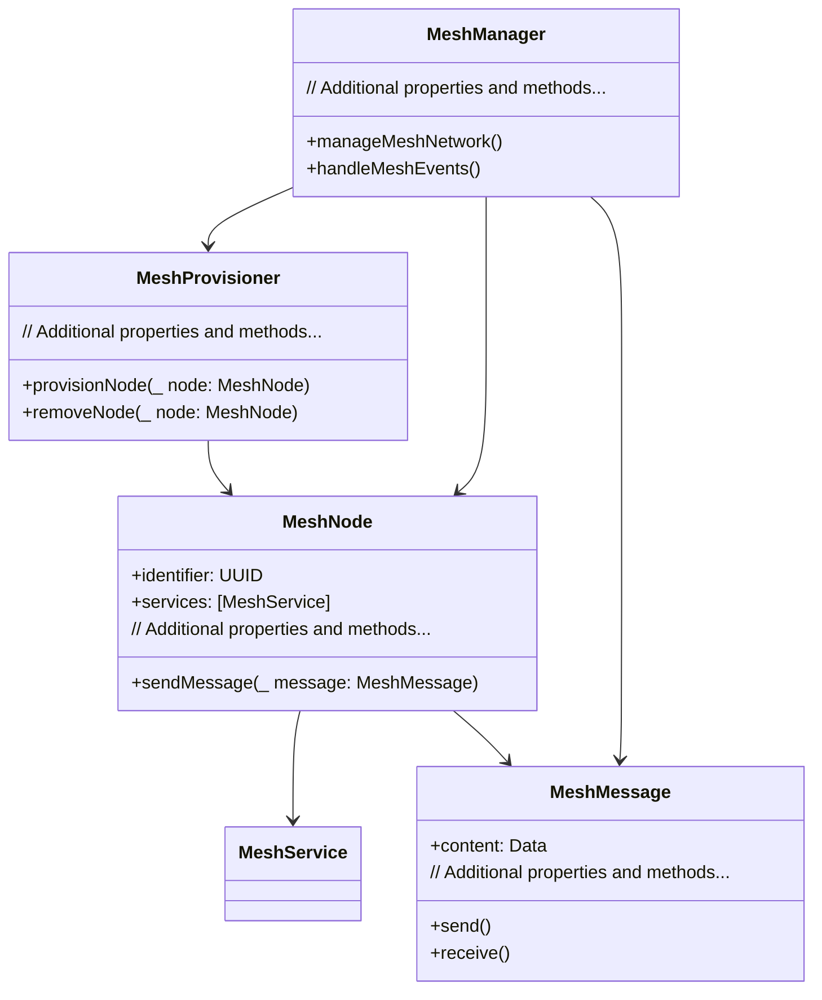

### **b. Low Energy (LE) Enhancements Diagram**
- **Purpose**: Highlight enhancements in Bluetooth Low Energy within Core Bluetooth.
- **Diagram Type**: `flowchart LR`
- **Contents**:
  - **Improved Advertising**
  - **Extended Scanning**
  - **Higher Data Throughput**
  - **Energy Efficiency**
  - **Enhanced Pairing Mechanisms**

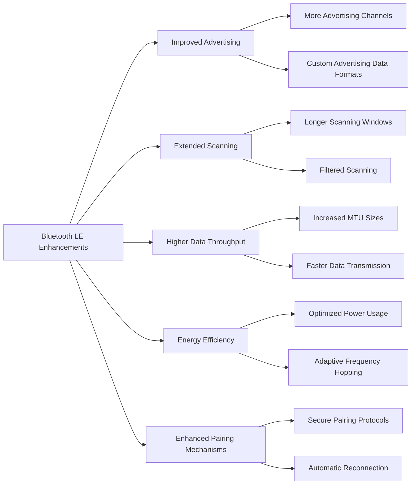

---

## **15. Testing and Debugging**

### **a. Testing Strategies Diagram**
- **Purpose**: Outline strategies for testing Core Bluetooth implementations.
- **Diagram Type**: `flowchart TD`
- **Contents**:
  - **Unit Testing**
  - **Integration Testing**
  - **Simulation Tools**
  - **Mocking Peripherals**
  - **Automated Testing**

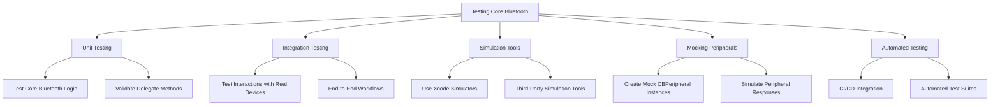

### **b. Debugging Techniques Diagram**
- **Purpose**: Highlight techniques for debugging Core Bluetooth applications.
- **Diagram Type**: `flowchart LR`
- **Contents**:
  - **Logging and Breakpoints**
  - **Core Bluetooth Logs**
  - **Bluetooth Debugging Tools**
  - **Real Device Testing**
  - **Performance Profiling**

```mermaid
flowchart LR
    A[Debugging Core Bluetooth] --> B[Logging and Breakpoints]
    A --> C[Core Bluetooth Logs]
    A --> D[Bluetooth Debugging Tools]
    A --> E[Real Device Testing]
    A --> F[Performance Profiling]

    B --> B1["Use NSLog and print statements"]
    B --> B2["Set breakpoints in delegate methods"]

    C --> C1["Enable Bluetooth logging in Xcode"]
    C --> C2["Monitor Console for Bluetooth Events"]

    D --> D1["Use Bluetooth Explorer"]
    D --> D2["Leverage Packet Sniffers"]

    E --> E1["Test on Various Devices"]
    E --> E2["Check Signal Strength and Range"]

    F --> F1["Use Instruments for Performance"]
    F --> F2["Analyze Energy Usage"]
```

---

## **16. Security Considerations**

### **a. Security Best Practices Diagram**
- **Purpose**: Outline best practices for ensuring security in Core Bluetooth applications.
- **Diagram Type**: `flowchart TD`
- **Contents**:
  - **Data Encryption**
  - **Authentication**
  - **Secure Pairing**
  - **Access Control**
  - **Regular Updates**
  - **Privacy Compliance**

```mermaid
flowchart TD
    A[Core Bluetooth Security Best Practices] --> B[Data Encryption]
    A --> C[Authentication]
    A --> D[Secure Pairing]
    A --> E[Access Control]
    A --> F[Regular Updates]
    A --> G[Privacy Compliance]

    B --> B1["Encrypt Data Transmission"]
    B --> B2["Use Secure Protocols"]

    C --> C1["Authenticate Devices Before Communication"]
    C --> C2["Verify Peripheral Identity"]

    D --> D1["Implement Secure Pairing Methods"]
    D --> D2["Use Passkeys or Just Works"]

    E --> E1["Restrict Data Access"]
    E --> E2["Use Permissions Effectively"]

    F --> F1["Update Bluetooth Firmware"]
    F --> F2["Patch Security Vulnerabilities"]

    G --> G1["Comply with GDPR, HIPAA"]
    G --> G2["Handle User Data Responsibly"]
```

### **b. Threat Modeling Diagram**
- **Purpose**: Illustrate potential threats and mitigation strategies in Core Bluetooth applications.
- **Diagram Type**: `flowchart LR`
- **Contents**:
  - **Eavesdropping**
  - **Man-in-the-Middle Attacks**
  - **Device Spoofing**
  - **Data Tampering**
  - **Denial of Service**
  - **Mitigation Strategies**

```mermaid
flowchart LR
    A[Core Bluetooth Threats] --> B[Eavesdropping]
    A --> C[Man-in-the-Middle Attacks]
    A --> D[Device Spoofing]
    A --> E[Data Tampering]
    A --> F[Denial of Service]
    A --> G[Mitigation Strategies]

    B --> B1["Use Encryption"]
    B --> B2["Limit Data Exposure"]

    C --> C1["Implement Authentication"]
    C --> C2["Use Secure Pairing"]

    D --> D1["Verify Device Identity"]
    D --> D2["Use Trusted Devices Lists"]

    E --> E1["Validate Data Integrity"]
    E --> E2["Use Digital Signatures"]

    F --> F1["Implement Rate Limiting"]
    F --> F2["Monitor for Unusual Activity"]

    G --> B & C & D & E & F
```

---

## **17. Performance Optimization**

### **a. Optimization Techniques Diagram**
- **Purpose**: Outline strategies for optimizing performance in Core Bluetooth applications.
- **Diagram Type**: `flowchart TD`
- **Contents**:
  - **Efficient Data Handling**
  - **Optimized Scanning**
  - **Connection Management**
  - **Battery Consumption**
  - **Resource Management**

```mermaid
flowchart TD
    A[Performance Optimization] --> B[Efficient Data Handling]
    A --> C[Optimized Scanning]
    A --> D[Connection Management]
    A --> E[Battery Consumption]
    A --> F[Resource Management]

    B --> B1["Minimize Data Transmission Size"]
    B --> B2["Use Appropriate Data Formats"]

    C --> C1["Scan for Specific Services"]
    C --> C2["Limit Scan Duration"]

    D --> D1["Manage Active Connections"]
    D --> D2["Disconnect When Idle"]

    E --> E1["Optimize Transmission Intervals"]
    E --> E2["Avoid Unnecessary Scanning"]

    F --> F1["Release Unused Resources"]
    F --> F2["Monitor Resource Usage"]
```

### **b. Profiling Tools Diagram**
- **Purpose**: Highlight tools and techniques for profiling Core Bluetooth applications.
- **Diagram Type**: `flowchart LR`
- **Contents**:
  - **Instruments**
  - **Xcode Debugger**
  - **Activity Monitor**
  - **Third-Party Tools**

```mermaid
flowchart LR
    A[Profiling Tools] --> B[Instruments]
    A --> C[Xcode Debugger]
    A --> D[Activity Monitor]
    A --> E[Third-Party Tools]

    B --> B1["Time Profiler"]
    B --> B2["Energy Usage"]
    B --> B3["Networking"]

    C --> C1["Set Breakpoints"]
    C --> C2["Inspect Variables"]

    D --> D1["Monitor CPU Usage"]
    D --> D2["Track Memory Consumption"]

    E --> E1["Bluetooth Explorer"]
    E --> E2["Profiling Frameworks"]
```

---

## **18. Localization and Internationalization**

### **a. Localization Strategies Diagram**
- **Purpose**: Outline strategies for localizing Core Bluetooth applications.
- **Diagram Type**: `flowchart TD`
- **Contents**:
  - **Localized User Interfaces**
  - **Localized Device Names**
  - **Region-Specific Services**
  - **Unicode Support**

```mermaid
flowchart TD
    A[Localization Strategies] --> B[Localized User Interfaces]
    A --> C[Localized Device Names]
    A --> D[Region-Specific Services]
    A --> E[Unicode Support]

    B --> B1["Translate UI Text"]
    B --> B2["Adapt Layouts for Languages"]

    C --> C1["Display Device Names Appropriately"]

    D --> D1["Handle Services Specific to Regions"]

    E --> E1["Support Unicode Characters in Data"]
```

### **b. Internationalization Considerations Diagram**
- **Purpose**: Highlight considerations for internationalizing Core Bluetooth applications.
- **Diagram Type**: `flowchart LR`
- **Contents**:
  - **Date and Time Formats**
  - **Number Formats**
  - **Localization of Notifications**
  - **Handling Right-to-Left Languages**
  - **Cultural Sensitivities**

```mermaid
flowchart LR
    A[Internationalization Considerations] --> B[Date and Time Formats]
    A --> C[Number Formats]
    A --> D[Localization of Notifications]
    A --> E[Handling Right-to-Left Languages]
    A --> F[Cultural Sensitivities]

    B --> B1["Use Locale-Aware Formats"]

    C --> C1["Adapt to Local Numbering Systems"]

    D --> D1["Translate Notification Messages"]

    E --> E1["Support RTL Layouts"]

    F --> F1["Respect Cultural Norms in Design"]
```

---

## **19. Accessibility Support**

### **a. Accessibility Features Diagram**
- **Purpose**: Outline how Core Bluetooth applications can support accessibility.
- **Diagram Type**: `flowchart TD`
- **Contents**:
  - **VoiceOver Support**
  - **Dynamic Type**
  - **Accessible Controls**
  - **Descriptive Labels**
  - **Haptic Feedback**

```mermaid
flowchart TD
    A[Accessibility Features] --> B[VoiceOver Support]
    A --> C[Dynamic Type]
    A --> D[Accessible Controls]
    A --> E[Descriptive Labels]
    A --> F[Haptic Feedback]

    B --> B1["Compatible UI Elements"]
    B --> B2["Properly Annotated Labels"]

    C --> C1["Support Adjustable Text Sizes"]

    D --> D1["Ensure Controls are Accessible"]

    E --> E1["Provide Meaningful Descriptions"]

    F --> F1["Use Haptics for Feedback"]
```

### **b. Accessibility Best Practices Diagram**
- **Purpose**: Highlight best practices for ensuring accessibility in Core Bluetooth applications.
- **Diagram Type**: `flowchart LR`
- **Contents**:
  - **Semantic UI Elements**
  - **Avoiding Color-Only Indicators**
  - **Ensuring Sufficient Contrast**
  - **Providing Alternative Input Methods**
  - **Testing with Assistive Technologies**

```mermaid
flowchart LR
    A[Accessibility Best Practices] --> B[Semantic UI Elements]
    A --> C[Avoiding Color-Only Indicators]
    A --> D[Ensuring Sufficient Contrast]
    A --> E[Providing Alternative Input Methods]
    A --> F[Testing with Assistive Technologies]

    B --> B1["Use Standard UI Components"]
    B --> B2["Label UI Elements Appropriately"]

    C --> C1["Use Icons and Text Together"]

    D --> D1["Maintain High Contrast Ratios"]

    E --> E1["Support Voice Commands"]

    F --> F1["Conduct Accessibility Testing"]
```

---

## **20. Error Handling and Recovery**

### **a. Error Handling Strategies Diagram**
- **Purpose**: Outline strategies for handling errors in Core Bluetooth applications.
- **Diagram Type**: `flowchart TD`
- **Contents**:
  - **Delegate Methods for Errors**
  - **Retry Mechanisms**
  - **User Notifications**
  - **Logging and Monitoring**
  - **Graceful Degradation**

```mermaid
flowchart TD
    A[Error Handling Strategies] --> B[Delegate Methods for Errors]
    A --> C[Retry Mechanisms]
    A --> D[User Notifications]
    A --> E[Logging and Monitoring]
    A --> F[Graceful Degradation]

    B --> B1["Implement centralManager(_:didFailToConnect:error:)"]
    B --> B2["Handle peripheral(_:didUpdateNotificationStateFor:error:)"]

    C --> C1["Retry Connection Attempts"]
    C --> C2["Re-initiate Service Discoveries"]

    D --> D1["Inform Users of Issues"]
    D --> D2["Provide Actionable Steps"]

    E --> E1["Log Errors for Analysis"]
    E --> E2["Monitor Application Health"]

    F --> F1["Fallback to Limited Features"]
    F --> F2["Maintain Core Functionality"]
```

### **b. Recovery Techniques Diagram**
- **Purpose**: Highlight techniques for recovering from errors in Core Bluetooth applications.
- **Diagram Type**: `flowchart LR`
- **Contents**:
  - **Automatic Reconnection**
  - **Fallback Services**
  - **User Intervention**
  - **State Restoration**
  - **Data Integrity Checks**

```mermaid
flowchart LR
    A[Recovery Techniques] --> B[Automatic Reconnection]
    A --> C[Fallback Services]
    A --> D[User Intervention]
    A --> E[State Restoration]
    A --> F[Data Integrity Checks]

    B --> B1["Attempt Reconnection on Failure"]
    B --> B2["Use Exponential Backoff"]

    C --> C1["Switch to Alternative Services"]

    D --> D1["Prompt Users to Retry Actions"]

    E --> E1["Restore Previous State on Launch"]

    F --> F1["Validate Data Consistency"]
```

---

## **21. Documentation and Resources**

### **a. Documentation Structure Diagram**
- **Purpose**: Outline the structure of documentation resources for Core Bluetooth.
- **Diagram Type**: `flowchart TD`
- **Contents**:
  - **Official Documentation**
  - **API Reference**
  - **Tutorials and Guides**
  - **Sample Code**
  - **Community Forums**
  - **Third-Party Libraries**

```mermaid
flowchart TD
    A[Documentation and Resources] --> B[Official Documentation]
    A --> C[API Reference]
    A --> D[Tutorials and Guides]
    A --> E[Sample Code]
    A --> F[Community Forums]
    A --> G[Third-Party Libraries]

    B --> B1["Apple Developer Documentation"]

    C --> C1["Core Bluetooth API Reference"]

    D --> D1["Step-by-Step Tutorials"]
    D --> D2["Best Practice Guides"]

    E --> E1["Code Samples from Apple"]
    E --> E2["Open Source Examples"]

    F --> F1["Apple Developer Forums"]
    F --> F2["Stack Overflow"]

    G --> G1["CocoaPods for Bluetooth Libraries"]
    G --> G2["Swift Packages for Bluetooth Extensions"]
```

### **b. Learning Path Diagram**
- **Purpose**: Provide a learning path for developers to master Core Bluetooth.
- **Diagram Type**: `flowchart LR`
- **Contents**:
  - **Introduction to Bluetooth LE**
  - **Understanding Core Bluetooth Basics**
  - **Implementing Central and Peripheral Roles**
  - **Managing Connections and Data Transfer**
  - **Advanced Features and Optimization**
  - **Testing and Debugging**
  - **Security and Best Practices**

```mermaid
flowchart LR
    A[Learning Path] --> B[Introduction to Bluetooth LE]
    A --> C[Understanding Core Bluetooth Basics]
    A --> D[Implementing Central and Peripheral Roles]
    A --> E[Managing Connections and Data Transfer]
    A --> F[Advanced Features and Optimization]
    A --> G[Testing and Debugging]
    A --> H[Security and Best Practices]

    B --> B1["Bluetooth LE Concepts"]
    B --> B2["Bluetooth Terminology"]

    C --> C1["Core Bluetooth Architecture"]
    C --> C2["Key Classes and Protocols"]

    D --> D1["Setting Up CBCentralManager"]
    D --> D2["Configuring CBPeripheral"]

    E --> E1["Scanning and Connecting"]
    E --> E2["Discovering Services and Characteristics"]

    F --> F1["Mesh Networking"]
    F --> F2["Low Energy Enhancements"]

    G --> G1["Unit and Integration Testing"]
    G --> G2["Using Profiling Tools"]

    H --> H1["Implementing Security Measures"]
    H --> H2["Following Best Coding Practices"]
```

---

## **22. Deployment and Distribution**

### **a. Deployment Strategies Diagram**
- **Purpose**: Outline strategies for deploying Core Bluetooth applications.
- **Diagram Type**: `flowchart TD`
- **Contents**:
  - **App Store Submissions**
  - **Enterprise Distribution**
  - **Beta Testing**
  - **Over-The-Air Updates**
  - **Continuous Integration/Continuous Deployment (CI/CD)**

```mermaid
flowchart TD
    A[Deployment Strategies] --> B[App Store Submissions]
    A --> C[Enterprise Distribution]
    A --> D[Beta Testing]
    A --> E[Over-The-Air Updates]
    A --> F[CI/CD]

    B --> B1["Follow App Store Guidelines"]
    B --> B2["Submit for Review"]

    C --> C1["Use Apple Developer Enterprise Program"]
    C --> C2["Distribute Internally"]

    D --> D1["Use TestFlight for Beta Testing"]
    D --> D2["Gather Feedback from Testers"]

    E --> E1["Implement OTA Update Mechanisms"]
    E --> E2["Ensure Seamless User Experience"]

    F --> F1["Automate Build Processes"]
    F --> F2["Integrate Automated Testing"]
```

---

## **23. Monitoring and Analytics**

### **a. Monitoring Tools Diagram**
- **Purpose**: Highlight tools and techniques for monitoring Core Bluetooth applications.
- **Diagram Type**: `flowchart LR`
- **Contents**:
  - **Analytics Services**
  - **Crash Reporting**
  - **Usage Metrics**
  - **Custom Logging**
  - **Real-Time Monitoring**

```mermaid
flowchart LR
    A[Monitoring Tools] --> B[Analytics Services]
    A --> C[Crash Reporting]
    A --> D[Usage Metrics]
    A --> E[Custom Logging]
    A --> F[Real-Time Monitoring]

    B --> B1["Firebase Analytics"]
    B --> B2["Mixpanel"]

    C --> C1["Crashlytics"]
    C --> C2["Sentry"]

    D --> D1["Track Peripheral Connections"]
    D --> D2["Monitor Data Transfer Volumes"]

    E --> E1["Implement Custom Logs for Bluetooth Events"]

    F --> F1["Use Dashboards for Real-Time Data"]
    F --> F2["Monitor Application Health"]
```

### **b. Analytics Integration Diagram**
- **Purpose**: Show how to integrate analytics into Core Bluetooth applications.
- **Diagram Type**: `flowchart TD`
- **Contents**:
  - **Event Tracking**
  - **User Behavior Analysis**
  - **Performance Metrics**
  - **Custom Events**
  - **Data Visualization**

```mermaid
flowchart TD
    A[Analytics Integration] --> B[Event Tracking]
    A --> C[User Behavior Analysis]
    A --> D[Performance Metrics]
    A --> E[Custom Events]
    A --> F[Data Visualization]

    B --> B1["Track Peripheral Connections"]
    B --> B2["Log Data Transfer Events"]

    C --> C1["Analyze Usage Patterns"]
    C --> C2["Identify Popular Features"]

    D --> D1["Monitor Connection Durations"]
    D --> D2["Track Data Throughput Rates"]

    E --> E1["Define Custom Events for Specific Actions"]
    E --> E2["Capture User Interactions"]

    F --> F1["Use Dashboards to Visualize Data"]
    F --> F2["Generate Reports for Insights"]
```

---

## **24. Compatibility and Deprecations**

### **a. Compatibility Matrix Diagram**
- **Purpose**: Show compatibility of Core Bluetooth features across different iOS versions.
- **Diagram Type**: `classDiagram`
- **Contents**:
  - **iOS Versions**: 5.0, 6.0, 7.0, 8.0, 10.0, 11.0, 13.0, 14.0, 16.0, 17.0
  - **Features**: Central Manager State Restoration, Background Modes, Mesh Networking, Enhanced Security, etc.

```mermaid
classDiagram
    class iOS5 {
        +Central and Peripheral Roles
    }

    class iOS6 {
        +State Restoration
    }

    class iOS7 {
        +Background Modes
    }

    class iOS8 {
        +Bluetooth LE Improvements
    }

    class iOS10 {
        +Peripheral Discovery Dictionary
    }

    class iOS11 {
        +Mesh Networking
    }

    class iOS13 {
        +Enhanced Security
    }

    class iOS14 {
        +Multiple Connections
    }

    class iOS16 {
        +Broadcast Channels
    }

    class iOS17 {
        +Extended Data Length
    }

    iOS5 <|-- iOS6
    iOS6 <|-- iOS7
    iOS7 <|-- iOS8
    iOS8 <|-- iOS10
    iOS10 <|-- iOS11
    iOS11 <|-- iOS13
    iOS13 <|-- iOS14
    iOS14 <|-- iOS16
    iOS16 <|-- iOS17
```

### **b. Deprecations and Removals Diagram**
- **Purpose**: Highlight deprecated and removed features in Core Bluetooth across iOS versions.
- **Diagram Type**: `flowchart TD`
- **Contents**:
  - **Deprecated Methods**
  - **Removed APIs**
  - **Migration Paths**
  - **Alternative Solutions**

```mermaid
flowchart TD
    A[Deprecations and Removals] --> B[Deprecated Methods]
    A --> C[Removed APIs]
    A --> D[Migration Paths]
    A --> E[Alternative Solutions]

    B --> B1["Deprecated scanForPeripherals(withServices:options:) in iOS18"]
    B --> B2["Deprecated connect(_:, options:) in favor of connect(_:options:timeout:)"]

    C --> C1["Removed old delegate methods deprecated in iOS17"]
    C --> C2["Eliminated legacy Bluetooth APIs"]

    D --> D --> D1["Use new scanning APIs"]
    D --> D --> D2["Adopt updated connection methods"]

    E --> E --> E1["Refer to updated Core Bluetooth documentation"]
    E --> E --> E2["Utilize modern Bluetooth libraries"]
```

---
