---

# CoreData

Below is a comprehensive and organized set of Mermaid diagrams for the `CoreData` framework. These diagrams cover various aspects of Core Data, including class structures, initializers, properties, methods, enumerations, protocol conformances, relationships, extensions, lifecycle, feature availability, data handling, integrations, and best practices.

---

## **1. Class Structure and Hierarchy**

### **a. Core Data Class Diagram**
- **Purpose**: Illustrate the primary structure of Core Data, including its main classes, properties, methods, and their relationships.
- **Diagram Type**: `classDiagram`
- **Contents**:
  - **Core Classes**: `NSManagedObject`, `NSManagedObjectContext`, `NSPersistentStoreCoordinator`, `NSPersistentContainer`, `NSFetchRequest`, `NSManagedObjectModel`, `NSManagedObjectID`
  - **Supporting Classes**: `NSEntityDescription`, `NSAttributeDescription`, `NSRelationshipDescription`

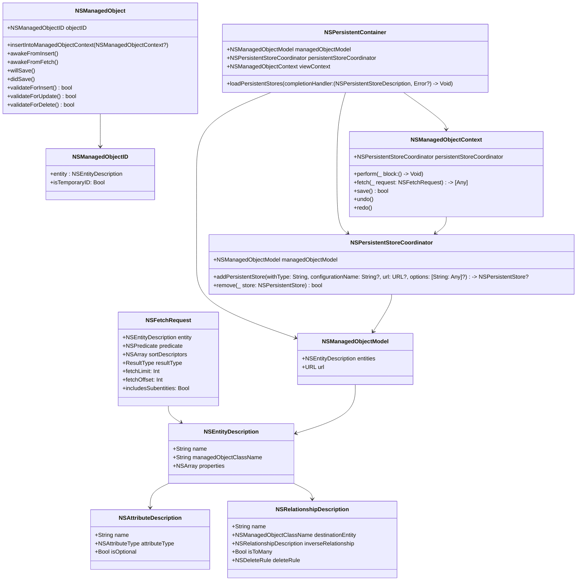

---

## **2. Initialization Overview**

### **a. Core Data Stack Initialization Diagram**
- **Purpose**: Break down the various components involved in initializing the Core Data stack.
- **Diagram Type**: `flowchart LR`
- **Contents**:
  - **Managed Object Model**: `NSManagedObjectModel`
  - **Persistent Store Coordinator**: `NSPersistentStoreCoordinator`
  - **Managed Object Context**: `NSManagedObjectContext`
  - **Persistent Container**: `NSPersistentContainer`

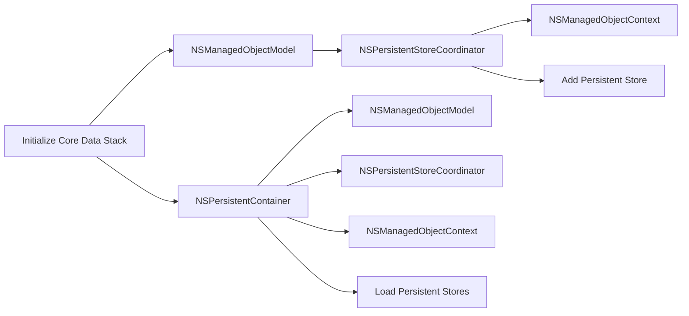

---

## **3. Properties Breakdown**

### **a. Key Properties Diagram**
- **Purpose**: Detail the main properties of Core Data's primary classes.
- **Diagram Type**: `graph LR`
- **Contents**:
  - **NSManagedObjectContext**: `persistentStoreCoordinator`, `undoManager`, `hasChanges`
  - **NSPersistentStoreCoordinator**: `managedObjectModel`, `persistentStores`
  - **NSManagedObjectModel**: `entities`, `versionIdentifiers`
  - **NSFetchRequest**: `entity`, `predicate`, `sortDescriptors`, `fetchLimit`

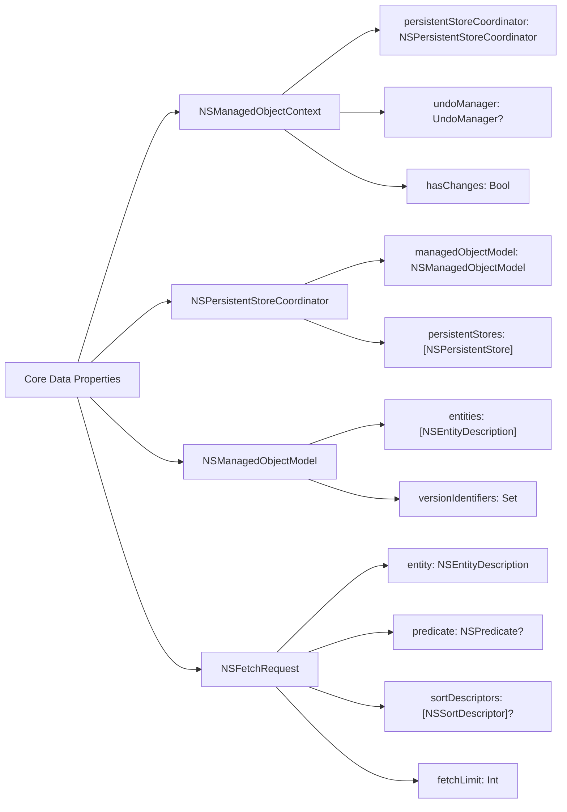

---

## **4. Methods Grouped by Functionality**

### **a. Core Data Operations Methods**
- **Purpose**: Categorize methods based on their roles in Core Data operations.
- **Diagram Type**: `flowchart TD`
- **Contents**:
  - **Creating Objects**: `insertNewObject(forEntityName:)`, `init(entity:insertInto:)`
  - **Fetching Objects**: `fetch(_:)`, `execute(_:)`
  - **Saving Context**: `save()`, `rollback()`
  - **Deleting Objects**: `delete(_:)`
  - **Managing Undo/Redo**: `undo()`, `redo()`, `registerUndo(withTarget:handler:)`

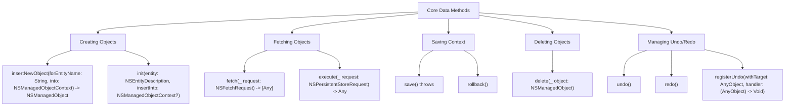

---

## **5. Enumerations and Configurations**

### **a. Core Data Enumerations Diagram**
- **Purpose**: Highlight the enums used within Core Data and their possible values.
- **Diagram Type**: `classDiagram`
- **Contents**:
  - **NSFetchRequestResultType**
  - **NSMergePolicyType**
  - **NSFetchedResultsChangeType**

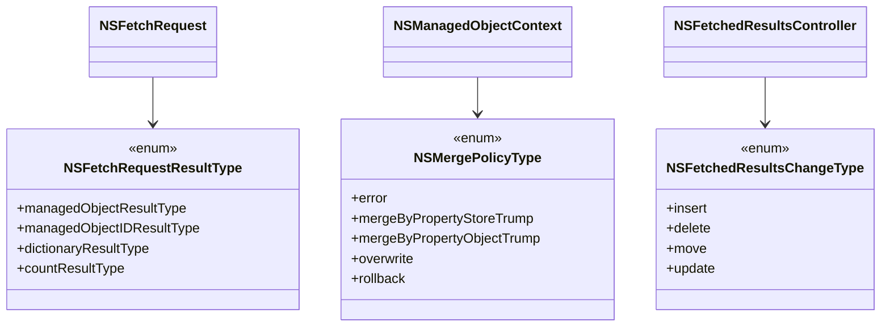

### **b. Configuration Classes Diagram**
- **Purpose**: Show the relationship between Core Data classes and their configuration settings.
- **Diagram Type**: `classDiagram`
- **Contents**:
  - **NSPersistentStoreDescription**
  - **NSEntityMapping**
  - **NSAttributeDescription**

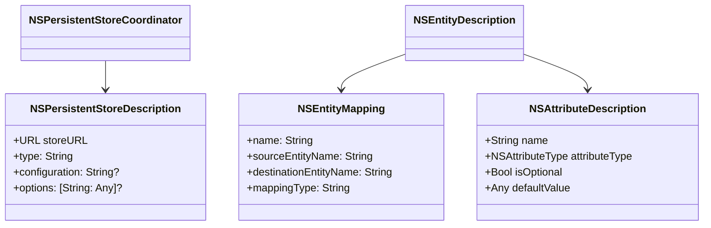

---

## **6. Protocol Conformances**

### **a. Protocols Diagram**
- **Purpose**: Display the protocols that Core Data classes conform to and their impact.
- **Diagram Type**: `classDiagram`
- **Contents**:
  - **NSFetchRequestResult**
  - **NSSecureCoding**
  - **NSCopying**
  - **NSCoding**

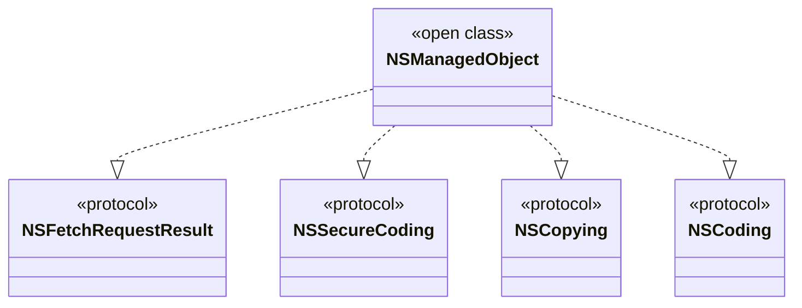

---

## **7. Relationships with Other Classes**

### **a. Related Classes Diagram**
- **Purpose**: Illustrate how Core Data interacts with other iOS frameworks and classes.
- **Diagram Type**: `flowchart TD`
- **Contents**:
  - **UIKit**: Integration with `UIViewController` for data-driven interfaces.
  - **Foundation**: Utilizes `NSPredicate`, `NSSortDescriptor`, and other Foundation classes.
  - **SwiftUI**: Integration with `@FetchRequest` for reactive data fetching.
  - **Combine**: Using publishers for data changes.
  - **CloudKit**: Synchronization with iCloud via `NSPersistentCloudKitContainer`.

```mermaid
flowchart TD
    A[Core Data] --> B[UIKit]
    A --> C[Foundation]
    A --> D[SwiftUI]
    A --> E[Combine]
    A --> F[CloudKit]

    B --> |Data-driven UI| VC[UIViewController]
    C --> |Querying| Predicate[NSPredicate]
    C --> |Sorting| SortDescriptor[NSSortDescriptor]
    D --> |Reactive Fetching| FetchRequest[@FetchRequest]
    E --> |Data Publishers| Publisher[Core Data Publishers]
    F --> |iCloud Sync| CloudKit[NSPersistentCloudKitContainer]
```

---

## **8. Extensions and Additional Functionalities**

### **a. Core Data Extensions Diagram**
- **Purpose**: Showcase the additional functionalities provided through extensions.
- **Diagram Type**: `classDiagram`
- **Contents**:
  - **NSManagedObject Extensions**
  - **NSFetchRequest Extensions**
  - **NSManagedObjectContext Extensions**

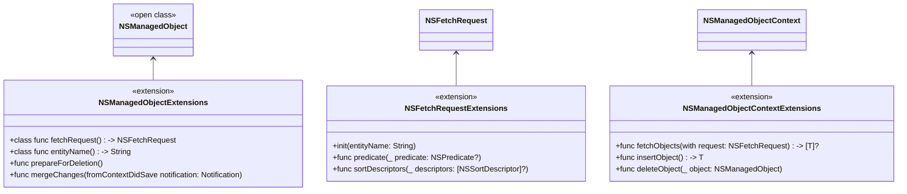

### **b. Extensions Functionalities Flowchart**
- **Purpose**: Detail specific extended methods and their purposes.
- **Diagram Type**: `flowchart LR`
- **Contents**:
  - **Fetch Request Helpers**
  - **Managed Object Helpers**
  - **Context Helpers**

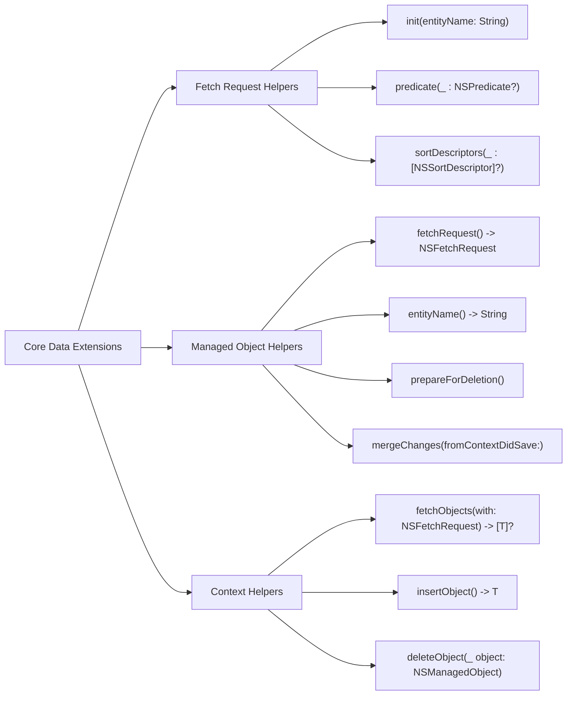

---

## **9. Lifecycle and Use Cases**

### **a. Core Data Lifecycle Flowchart**
- **Purpose**: Demonstrate the typical lifecycle of Core Data objects within an application.
- **Diagram Type**: `flowchart TD`
- **Contents**:
  - **Initialization**
  - **Insertion**
  - **Fetching**
  - **Updating**
  - **Deletion**
  - **Saving Context**
  - **Undo/Redo Operations**

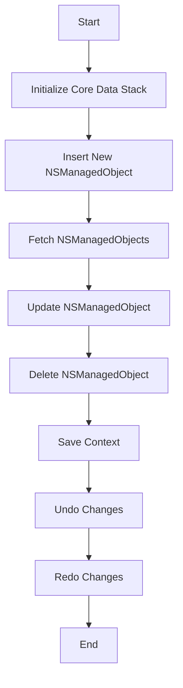

### **b. Common Use Cases Diagram**
- **Purpose**: Outline the typical scenarios where Core Data is utilized.
- **Diagram Type**: `flowchart TD`
- **Contents**:
  - **Persistent Storage**
  - **Data Modeling**
  - **Relationship Management**
  - **Data Validation**
  - **Undo/Redo Functionality**
  - **iCloud Synchronization**
  - **Batch Processing**
  - **Performance Optimization**

```mermaid
flowchart TD
    A[Core Data Use Cases] --> B[Persistent Storage]
    A --> C[Data Modeling]
    A --> D[Relationship Management]
    A --> E[Data Validation]
    A --> F[Undo/Redo Functionality]
    A --> G[iCloud Synchronization]
    A --> H[Batch Processing]
    A --> I[Performance Optimization]

    B --> B1[Storing User Data]
    B --> B2[Offline Data Access]

    C --> C1[Entity Definitions]
    C --> C2[Attribute Specifications]

    D --> D1[One-to-One Relationships]
    D --> D2[One-to-Many Relationships]
    D --> D3[Many-to-Many Relationships]

    E --> E1[Validation Rules]
    E --> E2[Custom Validation Logic]

    F --> F1[Undo Manager Integration]

    G --> G1[NSPersistentCloudKitContainer]

    H --> H1[Batch Inserts]
    H --> H2[Batch Updates]
    H --> H3[Batch Deletes]

    I --> I1[Lazy Loading]
    I --> I2[Faulting]
    I --> I3[Indexing]
```

---

## **10. Feature Availability Timeline**

### **a. Core Data Feature Availability Gantt Chart**
- **Purpose**: Show when various Core Data features were introduced across iOS versions.
- **Diagram Type**: `gantt`
- **Contents**:
  - **iOS Versions**: 3.0, 4.0, 5.0, 6.0, 7.0, 10.0, 12.0, 13.0, 14.0, 15.0, 16.0, 17.0
  - **Features Introduced**: Basic Core Data, Lightweight Migration, NSPersistentContainer, Fetch Request Improvements, NSFetchedResultsController enhancements, Combine Integration, SwiftUI Integration, etc.

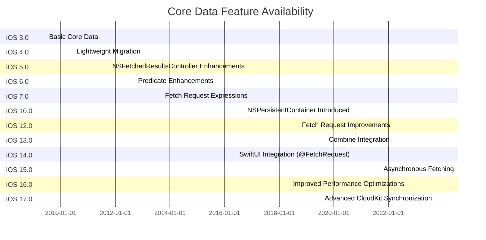

---

## **11. Data Handling and Formats**

### **a. Core Data Data Models Diagram**
- **Purpose**: Explain how Core Data handles different data models and formats.
- **Diagram Type**: `graph LR`
- **Contents**:
  - **Entities**: `NSEntityDescription`
  - **Attributes**: `NSAttributeDescription`
  - **Relationships**: `NSRelationshipDescription`
  - **Data Types**: `String`, `Int`, `Float`, `Double`, `Date`, `Binary Data`, `Transformable`

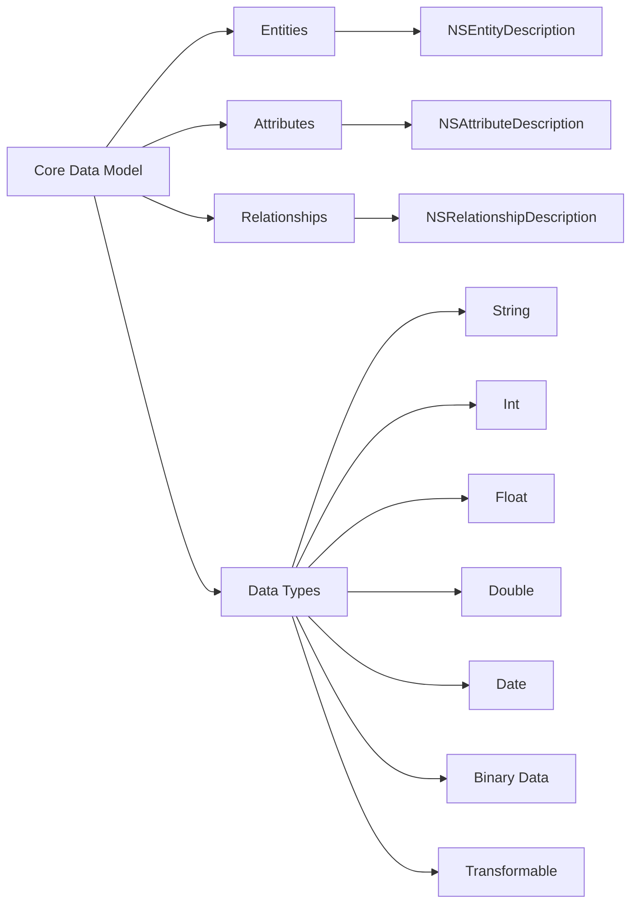

---

## **12. Integration with Other Frameworks**

### **a. Core Data and SwiftUI Integration Diagram**
- **Purpose**: Show how Core Data integrates seamlessly with SwiftUI for reactive data handling.
- **Diagram Type**: `flowchart TD`
- **Contents**:
  - **@FetchRequest**
  - **@Environment(\.managedObjectContext)**
  - **NSFetchedResultsController**
  - **Combine Publishers**

```mermaid
flowchart TD
    A[SwiftUI View] --> B[@FetchRequest]
    A --> C["@Environment(\.managedObjectContext)"]
    B --> D[NSFetchRequest]
    C --> E[NSManagedObjectContext]
    D --> F[NSFetchedResultsController]
    E --> F
    F --> G[Combine Publisher]
    G --> A
```

### **b. Core Data and Combine Integration Diagram**
- **Purpose**: Illustrate how Core Data leverages Combine for reactive programming.
- **Diagram Type**: `classDiagram`
- **Contents**:
  - **NSManagedObjectContext**: `publisher(for:)`
  - **NSFetchedResultsController**: `publisher`
  - **Combine Subscribers**

## TODO: Fix rendering syntax error

```mermaid
classDiagram
    class NSManagedObjectContext {
        +publisher(for changes: NSManagedObjectContextObjectsDidChangeNotification) -> Publisher
    }

    class NSFetchedResultsController {
        +publisher: AnyPublisher<NSFetchedResultsChangeType, Never>
    }

    class CombinePublisher {
        <<protocol>>
    }

    NSManagedObjectContext --> "CombinePublisher" : publisher(for:)
    NSFetchedResultsController --> "CombinePublisher" : publisher
    CombinePublisher ..> SwiftUIView : subscribes
    
```

---

## **13. Summary and Best Practices**

### **a. Core Data Summary Diagram**
- **Purpose**: Provide a high-level overview of Core Data's key characteristics and functionalities.
- **Diagram Type**: `graph LR` 
- **Contents**:
  - **Data Persistence**
  - **Data Modeling**
  - **Object Lifecycle Management**
  - **Performance Optimization**
  - **Seamless Integration**
  - **Reactive Data Handling**
  - **Cloud Synchronization**

```mermaid
graph LR
    A[Core Data] --> B[Data Persistence]
    A --> C[Data Modeling]
    A --> D[Object Lifecycle Management]
    A --> E[Performance Optimization]
    A --> F[Seamless Integration]
    A --> G[Reactive Data Handling]
    A --> H[Cloud Synchronization]

    B --> B1[Persistent Storage of Objects]
    B --> B2[Offline Data Access]

    C --> C1[Entity and Attribute Definitions]
    C --> C2[Relationship Mapping]

    D --> D1[Managed Object Contexts]
    D --> D2[Undo/Redo Support]

    E --> E1[Faulting and Lazy Loading]
    E --> E2[Indexing Attributes]
    E --> E3[Batch Operations]

    F --> F1[SwiftUI Integration]
    F --> F2[UIKit Compatibility]

    G --> G1[Combine Integration]
    G --> G2[@FetchRequest in SwiftUI]

    H --> H1[NSPersistentCloudKitContainer]
    H --> H2[iCloud Sync Support]
```

### **b. Best Practices Diagram**
- **Purpose**: Outline best practices for using Core Data effectively.
- **Diagram Type**: `graph LR`
- **Contents**:
  - **Model Design**
  - **Context Management**
  - **Performance Tips**
  - **Error Handling**
  - **Testing Strategies**
  - **Migration Strategies**

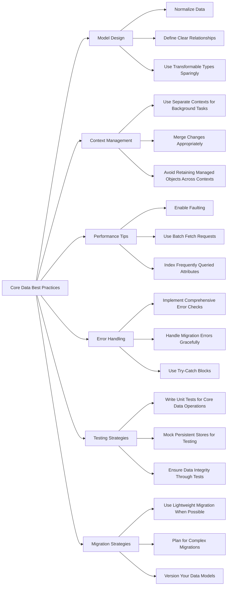

---

## **14. Advanced Features and Extensions**

### **a. Advanced Core Data Features Diagram**
- **Purpose**: Highlight advanced features and extensions within Core Data.
- **Diagram Type**: `graph LR`
- **Contents**:
  - **Fetched Properties**
  - **Transient Attributes**
  - **Versioning and Migration**
  - **Core Data with CloudKit**
  - **Fetched Results Controller Delegation**
  - **Batch Operations**

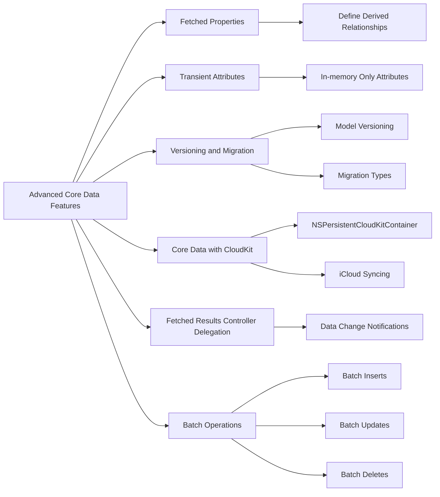

### **b. Core Data Extensions Functionalities Diagram**
- **Purpose**: Detail specific advanced extended methods and their purposes.
- **Diagram Type**: `flowchart LR`
- **Contents**:
  - **Fetched Properties**
  - **Transient Attributes**
  - **Custom Migrations**
  - **Cloud Synchronization Methods**

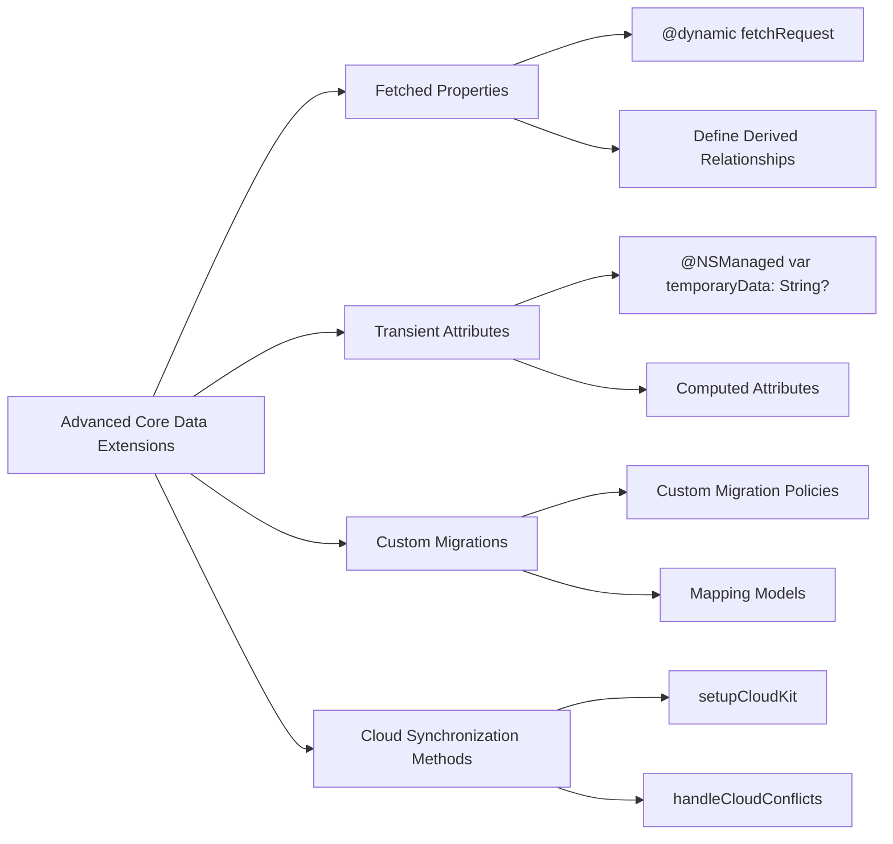

---

## **15. Security and Privacy**

### **a. Core Data Security Practices Diagram**
- **Purpose**: Outline best practices for ensuring data security and privacy within Core Data.
- **Diagram Type**: `graph LR`
- **Contents**:
  - **Data Encryption**
  - **Secure Storage Options**
  - **Access Controls**
  - **Privacy Compliance**
  - **Secure Coding Practices**

```mermaid
graph LR
    A[Core Data Security Practices] --> B[Data Encryption]
    A --> C[Secure Storage Options]
    A --> D[Access Controls]
    A --> E[Privacy Compliance]
    A --> F[Secure Coding Practices]

    B --> B1[Encrypt Persistent Stores]
    B --> B2[Use Encrypted Attributes]

    C --> C1[Keychain Integration]
    C --> C2[File Protection Levels]

    D --> D1[Set Appropriate Access Permissions]
    D --> D2[Use Encrypted Networking for Syncing]

    E --> E1[Comply with GDPR]
    E --> E2[User Consent for Data Storage]

    F --> F1[Validate Inputs]
    F --> F2[Avoid Storing Sensitive Data Unnecessarily]
```

---

## **16. Troubleshooting and Debugging**

### **a. Core Data Debugging Techniques Diagram**
- **Purpose**: Provide strategies for troubleshooting and debugging Core Data issues.
- **Diagram Type**: `flowchart TD`
- **Contents**:
  - **Debugging Migrations**
  - **Monitoring Context Changes**
  - **Performance Profiling**
  - **Logging Errors**
  - **Using Instruments**

```mermaid
flowchart TD
    A[Core Data Debugging Techniques] --> B[Debugging Migrations]
    A --> C[Monitoring Context Changes]
    A --> D[Performance Profiling]
    A --> E[Logging Errors]
    A --> F[Using Instruments]

    B --> B1[Enable Lightweight Migration Logging]
    B --> B2[Check Mapping Models]

    C --> C1[Context Save Notifications]
    C --> C2[Observe NSManagedObjectContextDidSave]

    D --> D1[Profile Fetch Requests]
    D --> D2[Analyze Memory Usage]

    E --> E1[Custom Error Handling]
    E --> E2[Verbose Logging]

    F --> F1[Core Data Template in Instruments]
    F --> F2[Track Persistent Store Operations]
```

---

## **17. Migration Strategies**

### **a. Core Data Migration Strategies Diagram**
- **Purpose**: Explain different strategies for migrating Core Data models.
- **Diagram Type**: `graph LR`
- **Contents**:
  - **Lightweight Migration**
  - **Heavyweight Migration**
  - **Manual Migration**
  - **Data Mapping Models**
  - **Versioning Models**

```mermaid
graph LR
    A[Core Data Migration Strategies] --> B[Lightweight Migration]
    A --> C[Heavyweight Migration]
    A --> D[Manual Migration]
    A --> E[Data Mapping Models]
    A --> F[Versioning Models]

    B --> B1[Automatic Inference]
    B --> B2[Simple Model Changes]

    C --> C1[Custom Migration Policies]
    C --> C2[Complex Model Changes]

    D --> D1[Handle Migration in Code]
    D --> D2[Custom Mapping Models]

    E --> E1[Entity Map Changes]
    E --> E2[Attribute Mapping]

    F --> F1[Model Versioning]
    F --> F2[Associating Versions with Models]
```

---

## **18. Concurrency Management**

### **a. Core Data Concurrency Diagram**
- **Purpose**: Illustrate how Core Data manages concurrency across different contexts.
- **Diagram Type**: `flowchart LR`
- **Contents**:
  - **Concurrency Types**: `NSMainQueueConcurrencyType`, `NSPrivateQueueConcurrencyType`
  - **Context Hierarchy**: Parent-Child Contexts
  - **Perform and PerformAndWait Methods**
  - **Thread Safety Practices**

```mermaid
flowchart LR
    A[Core Data Concurrency] --> B[Concurrency Types]
    A --> C[Context Hierarchy]
    A --> D[Perform Methods]
    A --> E[Thread Safety Practices]

    B --> B1[NSMainQueueConcurrencyType]
    B --> B2[NSPrivateQueueConcurrencyType]

    C --> C1[Parent Context]
    C --> C2[Child Context]
    C --> C3[Sibling Contexts]

    D --> D1["perform { }"]
    D --> D2["performAndWait { }"]

    E --> E1[Avoid Accessing Context from Multiple Threads]
    E --> E2[Use Notifications for Context Changes]
```

---

## **19. Testing Strategies**

### **a. Core Data Testing Diagram**
- **Purpose**: Outline strategies for effectively testing Core Data components.
- **Diagram Type**: `graph LR`
- **Contents**:
  - **Unit Testing**
  - **Integration Testing**
  - **Mock Persistent Stores**
  - **Automated Testing**
  - **Data Integrity Checks**

```mermaid
graph LR
    A[Core Data Testing Strategies] --> B[Unit Testing]
    A --> C[Integration Testing]
    A --> D[Mock Persistent Stores]
    A --> E[Automated Testing]
    A --> F[Data Integrity Checks]

    B --> B1[Test Managed Object Classes]
    B --> B2[Test Core Data Stack Initialization]

    C --> C1[Test Context Interactions]
    C --> C2[Test Data Flow Between Components]

    D --> D1[In-Memory Store Configuration]
    D --> D2[Mock Data Responses]

    E --> E1[Continuous Integration Pipelines]
    E --> E2[Automated Test Scripts]

    F --> F1[Validate Relationships]
    F --> F2[Ensure Data Consistency]
```

---

## **20. Performance Optimization**

### **a. Core Data Performance Tips Diagram**
- **Purpose**: Provide best practices for optimizing Core Data performance.
- **Diagram Type**: `graph LR`
- **Contents**:
  - **Efficient Fetching**
  - **Batch Operations**
  - **Faulting and Lazy Loading**
  - **Indexing Attributes**
  - **Asynchronous Operations**
  - **Memory Management**

```mermaid
graph LR
    A[Core Data Performance Optimization] --> B[Efficient Fetching]
    A --> C[Batch Operations]
    A --> D[Faulting and Lazy Loading]
    A --> E[Indexing Attributes]
    A --> F[Asynchronous Operations]
    A --> G[Memory Management]

    B --> B1[Use Fetch Limits]
    B --> B2[Predicate Optimization]

    C --> C1[Batch Inserts]
    C --> C2[Batch Updates]
    C --> C3[Batch Deletes]

    D --> D1[Enable Faulting]
    D --> D2[Use Lightweight Fetch Requests]

    E --> E1[Index Frequently Queried Attributes]

    F --> F1[Perform Background Fetches]
    F --> F2[Use NSPrivateQueueConcurrencyType]

    G --> G1[Avoid Retaining Managed Objects]
    G --> G2[Release Unused Objects]
```

---

# Summary

The above Mermaid diagrams provide a comprehensive overview of the Core Data framework, covering its class structures, initialization processes, properties, methods, enumerations, protocol conformances, interactions with other classes, extensions, lifecycle, feature availability, data handling, integrations, best practices, advanced features, security, troubleshooting, migration strategies, concurrency management, testing strategies, and performance optimization.

---

