# Core ML
> This content is dual-licensed under your choice of the following licenses:
> 1.  **MIT License:** For the code implementations in Swift and Mermaid provided in this document.
> 2.  **Creative Commons Attribution 4.0 International License (CC BY 4.0):** For all other content, including the text, explanations, and the Mermaid diagrams and illustrations.

---

## **1. Class Structure and Hierarchy**

### **a. Core Class Diagram**
- **Purpose**: Illustrate the primary structure of `MLModel`, including its properties, methods, and enumerations.
- **Diagram Type**: `classDiagram`
- **Contents**:
  - **Properties**: Key attributes like `modelDescription`, `computeUnits`, `modelParameters`, etc.
  - **Methods**: Essential functions like initializers, `prediction()`, `modelDescription`, etc.
  - **Enumerations**: Nested enums such as `ComputeUnits`, `Error`, etc.

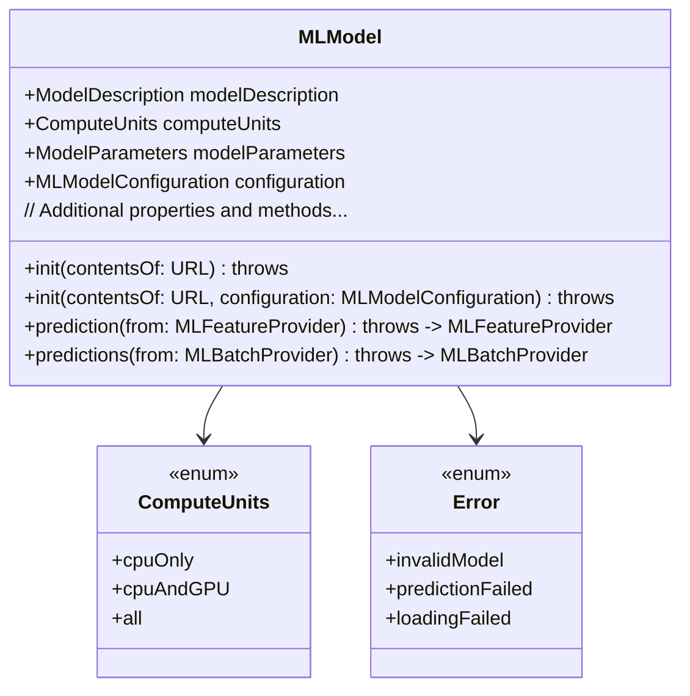

---

## **2. Initializers Overview**

### **a. Initialization Methods Diagram**
- **Purpose**: Break down the various ways to instantiate `MLModel`.
- **Diagram Type**: `flowchart` or `graph LR`
- **Contents**:
  - **URL-Based Initializers**: `init(contentsOf:)`, `init(contentsOf:configuration:)`
  - **Bundle-Based Initializers**: `init(modelName:)`, `init(modelName:configuration:)`
  - **Data-Based Initializers**: `init(data:)`, `init(data:configuration:)`
  - **Serialization & Deserialization**: `init(serializedModel:configuration:)`

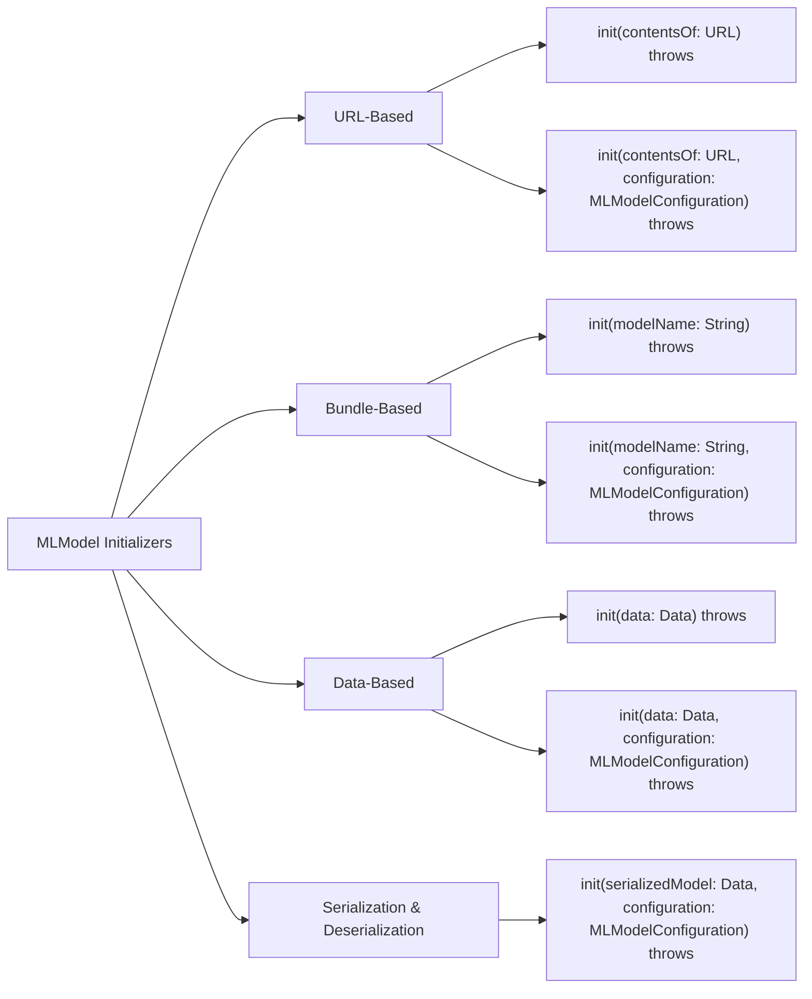

---

## **3. Properties Breakdown**

### **a. Key Properties Diagram**
- **Purpose**: Detail the main properties of `MLModel`.
- **Diagram Type**: `graph LR` or `classDiagram`
- **Contents**:
  - **Model Information**: `modelDescription`, `modelParameters`
  - **Configuration**: `computeUnits`, `configuration`
  - **State**: `isLoaded`, `isRunning`
  - **Metadata**: `metadata`

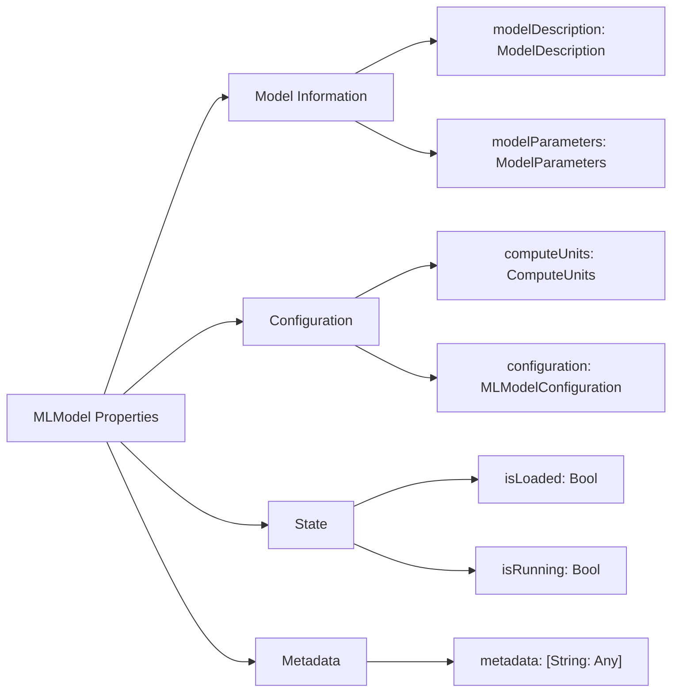

---

## **4. Methods Grouped by Functionality**

### **a. Prediction Methods**
- **Purpose**: Categorize methods based on their roles in making predictions.
- **Diagram Type**: `flowchart TD`
- **Contents**:
  - **Single Prediction**: `prediction(from:)`, `prediction(input:)`
  - **Batch Predictions**: `predictions(from:)`, `predictions(inputs:)`
  - **Asynchronous Predictions**: `prediction(from:completionHandler:)`, `predictions(from:completionHandler:)`
  - **Custom Predictions**: `prediction(input:options:)`, `predictions(inputs:options:)`

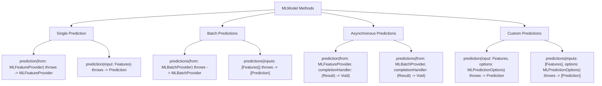

---

## **5. Enumerations and Configurations**

### **a. Enumerations Diagram**
- **Purpose**: Highlight the enums used within `MLModel` and their possible values.
- **Diagram Type**: `classDiagram`
- **Contents**:
  - **ComputeUnits**
  - **Error**
  - **ModelConfigurationOptions**

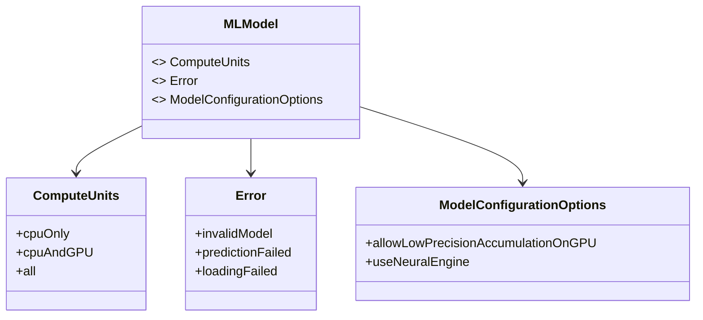

### **b. Configuration Classes Diagram**
- **Purpose**: Show the relationship between `MLModel` and its configuration classes.
- **Diagram Type**: `classDiagram`
- **Contents**:
  - **MLModelConfiguration**
  - **MLBatchProvider**
  - **MLFeatureProvider**

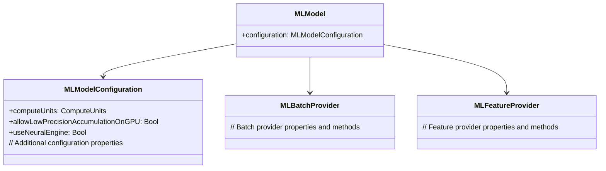

---

## **6. Protocol Conformances**

### **a. Protocols Diagram**
- **Purpose**: Display the protocols that `MLModel` conforms to and their impact.
- **Diagram Type**: `classDiagram`
- **Contents**:
  - **NSCoding**
  - **NSSecureCoding**
  - **NSCopying**
  - **Sendable**

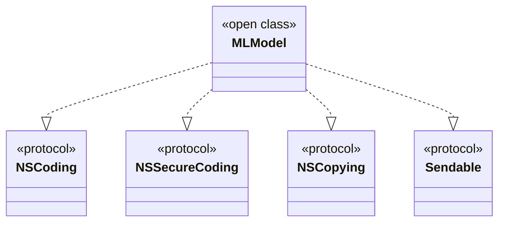

---

## **7. Relationships with Other Classes**

### **a. Related Classes Diagram**
- **Purpose**: Illustrate how `MLModel` interacts with other Core ML classes and frameworks.
- **Diagram Type**: `flowchart TD`
- **Contents**:
  - **MLFeatureProvider**: Supplies input features for predictions.
  - **MLBatchProvider**: Supplies batches of input features.
  - **MLPredictionOptions**: Configures prediction behavior.
  - **MLModelConfiguration**: Configures model parameters.
  - **ModelDescription**: Describes the model's input and output.
  - **ModelParameters**: Contains the parameters of the model.
  - **ResultsHandler**: Handles asynchronous prediction results.
  - **MLComputeUnits**: Specifies computation resources.

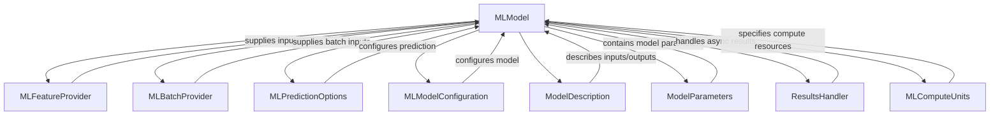

---

## **8. Extensions and Additional Functionalities**

### **a. MLModel Extensions Diagram**
- **Purpose**: Showcase the additional functionalities provided through extensions.
- **Diagram Type**: `classDiagram`
- **Contents**:
  - **Model Loading Extensions**
  - **Prediction Extensions**
  - **Serialization Extensions**

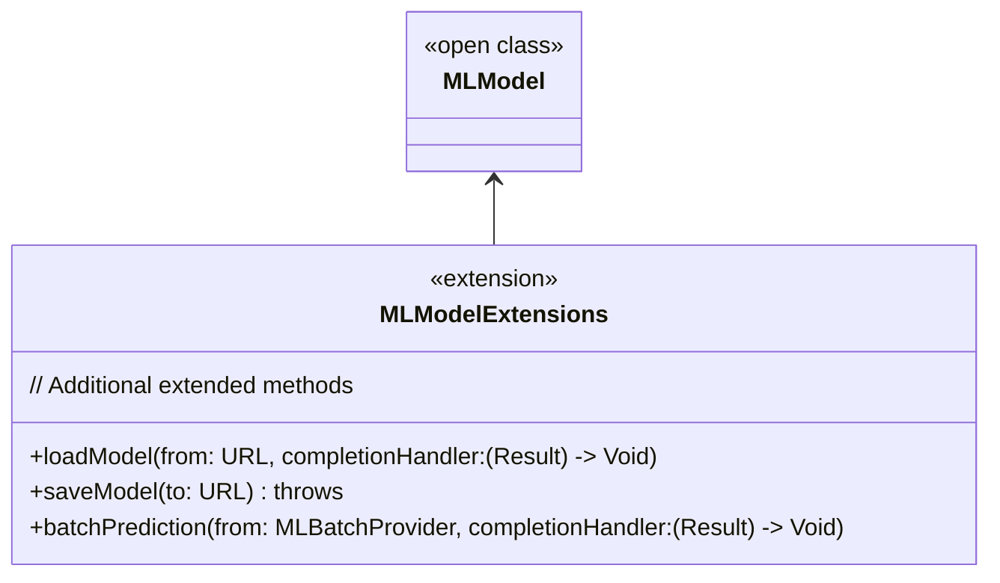

### **b. Extensions Functionalities Flowchart**
- **Purpose**: Detail specific extended methods and their purposes.
- **Diagram Type**: `flowchart LR`
- **Contents**:
  - **Model Loading**
  - **Batch Predictions**
  - **Model Serialization**

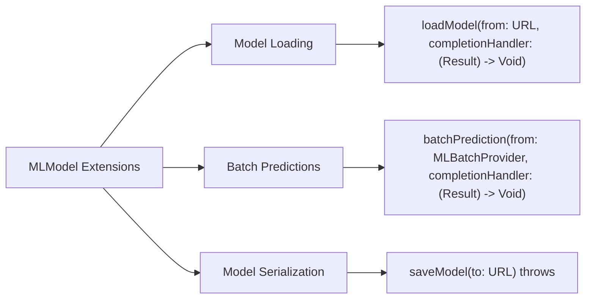

---

## **9. Lifecycle and Use Cases**

### **a. Lifecycle Flowchart**
- **Purpose**: Demonstrate the typical lifecycle of an `MLModel` within an application.
- **Diagram Type**: `flowchart TD`
- **Contents**:
  - **Initialization**
  - **Configuration**
  - **Loading**
  - **Predictions**
  - **Updating**
  - **Caching**
  - **Termination**

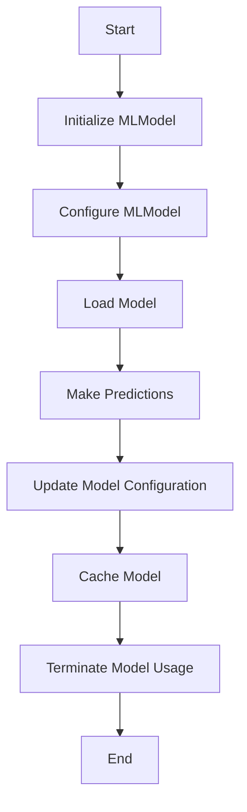

### **b. Common Use Cases Diagram**
- **Purpose**: Outline the typical scenarios where `MLModel` is utilized.
- **Diagram Type**: `flowchart TD`
- **Contents**:
  - **Image Classification**
  - **Natural Language Processing**
  - **Recommendation Systems**
  - **Anomaly Detection**
  - **Speech Recognition**
  - **Time Series Forecasting**
  - **Custom Model Integration**

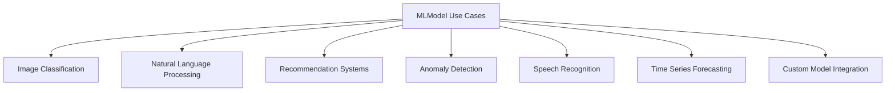

---

## **10. Feature Availability Timeline**

### **a. Feature Availability Gantt Chart**
- **Purpose**: Show when various `MLModel` features were introduced across iOS versions.
- **Diagram Type**: `gantt`
- **Contents**:
  - **iOS Versions**: 11.0, 12.0, 13.0, 14.0, 15.0, 16.0, 17.0
  - **Features Introduced**: Core ML integration, Swift support, Batch predictions, Asynchronous predictions, Custom compute units, Model quantization, On-device training.

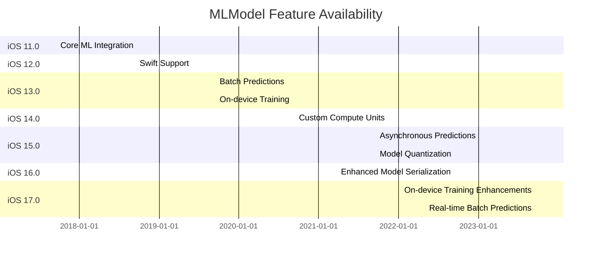

---

## **11. Data Handling and Formats**

### **a. Data Format Handling Diagram**
- **Purpose**: Explain how `MLModel` handles different model data formats.
- **Diagram Type**: `graph LR`
- **Contents**:
  - **Core ML Models**: `.mlmodel`, `.mlmodelc`
  - **ONNX Models**: `.onnx`
  - **TensorFlow Models**: `.pb`, `.tflite`
  - **Custom Models**: `.custom`

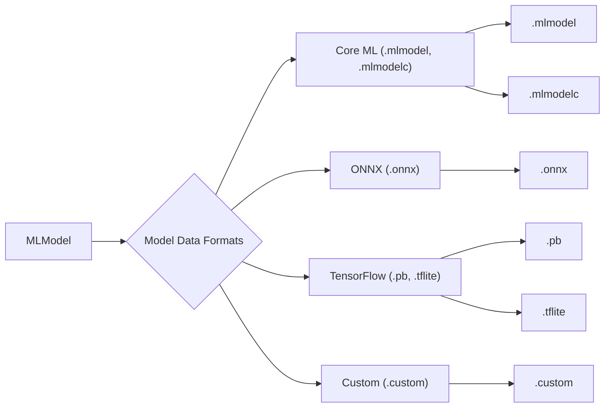

---

## **12. Integration with Other Frameworks**

### **a. Integration Methods Diagram**
- **Purpose**: Show how `MLModel` integrates with other Apple frameworks and services.
- **Diagram Type**: `flowchart TD`
- **Contents**:
  - **Vision Framework**: Image analysis, object detection.
  - **Natural Language Framework**: Text processing, sentiment analysis.
  - **Create ML**: Model training and creation.
  - **Core Graphics**: Rendering model outputs.
  - **UIKit**: Displaying prediction results in UI.
  - **SwiftUI**: Binding predictions to UI components.

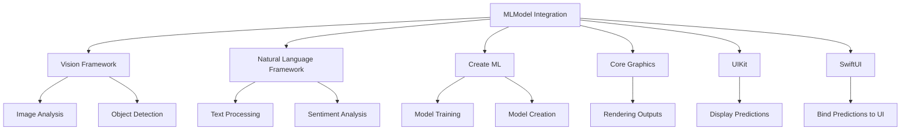

---

## **13. Summary and Best Practices**

### **a. Summary Diagram**
- **Purpose**: Provide a high-level overview of `MLModel`'s key characteristics and functionalities.
- **Diagram Type**: `graph LR` or `mindmap`
- **Contents**:
  - **Versatile Initialization**
  - **Advanced Prediction Options**
  - **Performance Optimizations**
  - **Data Format Flexibility**
  - **Seamless Integration**
  - **Robust Error Handling**

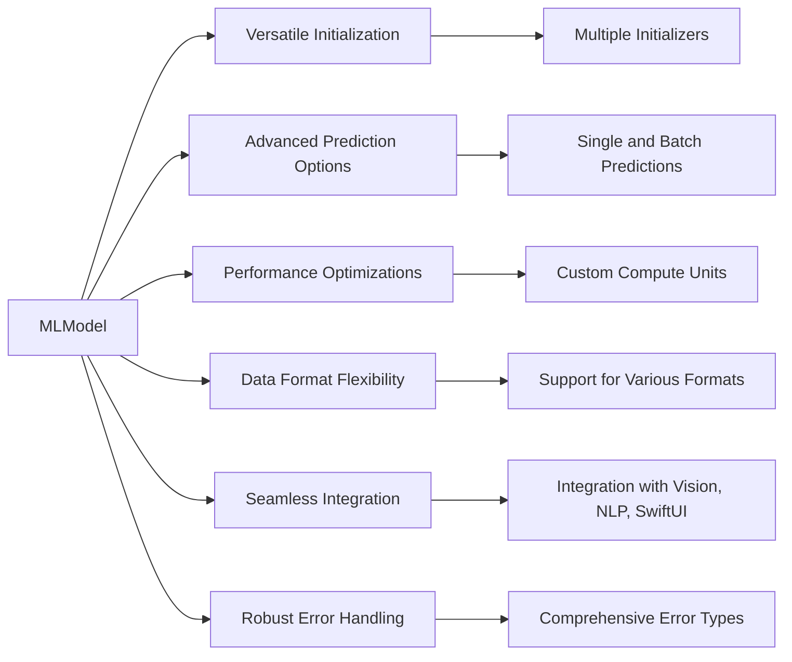

---