# CryptoKit by Apple
> This content is dual-licensed under your choice of the following licenses:
> 1.  **MIT License:** For the code implementations in Swift and Mermaid provided in this document.
> 2.  **Creative Commons Attribution 4.0 International License (CC BY 4.0):** For all other content, including the text, explanations, and the Mermaid diagrams and illustrations.

---

Below is a comprehensive and organized set of Mermaid diagrams for the `Apple CryptoKit` framework. These diagrams cover various aspects of CryptoKit, including class structures, initializers, properties, methods, protocols, relationships, and best practices.

---

## **1. Class Structure and Hierarchy**

### **a. Core Class Diagram**
- **Purpose**: Illustrate the primary structure of `CryptoKit`, including its key classes, properties, methods, and enumerations.
- **Diagram Type**: `classDiagram`
- **Contents**:
  - **Classes**: `SymmetricKey`, `SecureEnclave`, `PrivateKey`, `PublicKey`, `Curve25519.Signing.PrivateKey`, `Curve25519.Signing.PublicKey`, etc.
  - **Enumerations**: `Signature`, `AuthenticationContext`.
  - **Protocols**: `HashFunction`.

## TODO: Fix diagram syntax error

```mermaid
classDiagram
    class CryptoKit {
        <<framework>>
    }

    class SymmetricKey {
            +var bitCount: Int
            +init(size: SymmetricKeySize)
            +static func generate(size: SymmetricKeySize) -> SymmetricKey
            +withUnsafeBytes<ResultType>(_: (UnsafeRawBufferPointer) throws -> ResultType) rethrows -> ResultType
    }

    class SecureEnclave {
            +static func singleton() -> SecureEnclave
            +generateKeyPair() throws -> (privateKey: SecureEnclave.P256.Signing.PrivateKey, publicKey: SecureEnclave.P256.Signing.PublicKey)
    }

    class P256.Signing.PrivateKey {
            +var publicKey: P256.Signing.PublicKey { get }
            +func signature(for: Data) throws -> P256.Signing.ECDSASignature
    }

    class P256.Signing.PublicKey {
            +func isValidSignature(_ signature: P256.Signing.ECDSASignature, for: Data) -> Bool
    }

    CryptoKit --> SymmetricKey
    CryptoKit --> SecureEnclave
    CryptoKit --> P256.Signing.PrivateKey
    CryptoKit --> P256.Signing.PublicKey
    
```

---

## **2. Initializers Overview**

### **a. Initialization Methods Diagram**
- **Purpose**: Break down the various ways to instantiate key components in `CryptoKit`.
- **Diagram Type**: `flowchart LR`
- **Contents**:
  - **Symmetric Keys**: `SymmetricKey(size:)`, `SymmetricKey(data:)`
  - **Asymmetric Keys**: `Curve25519.KeyAgreement.PrivateKey()`, `Curve25519.Signing.PrivateKey()`, etc.
  - **Secure Enclave Keys**: `SecureEnclave.P256.Signing.PrivateKey()`

## TODO: Fix diagram syntax error

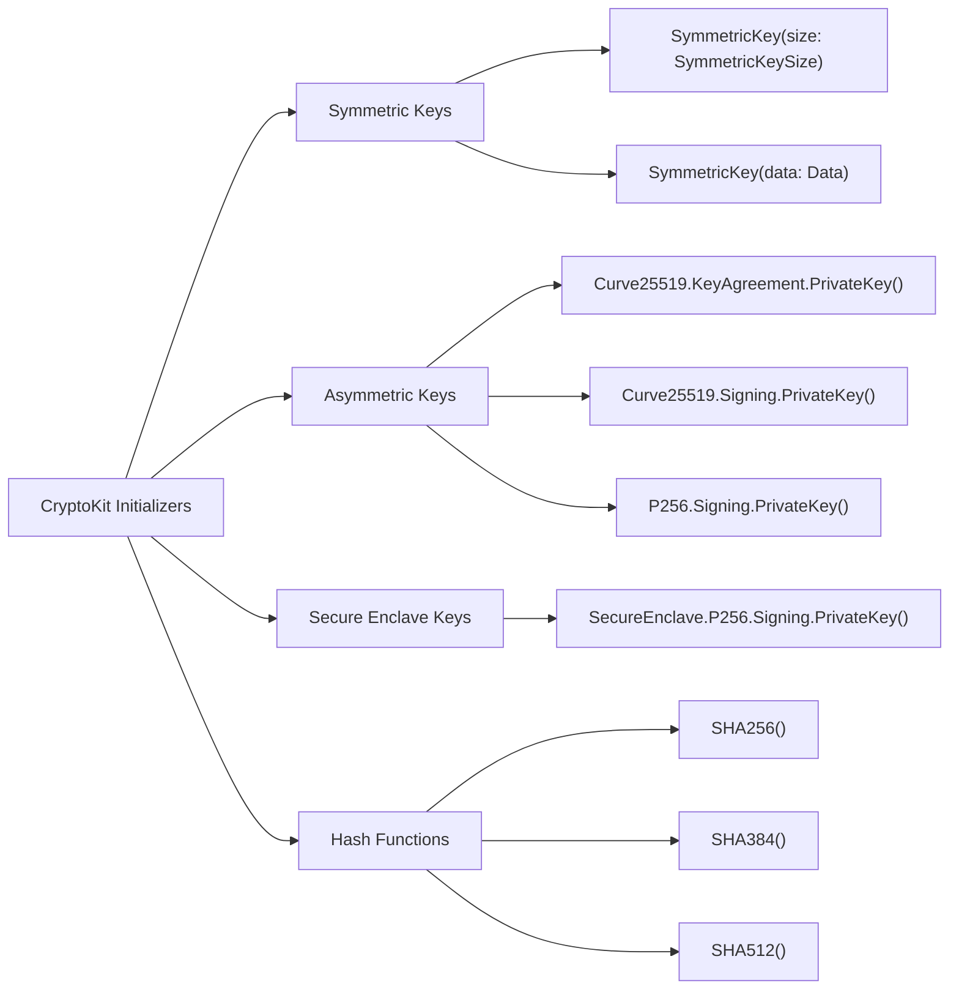

---

## **3. Properties Breakdown**

### **a. Key Properties Diagram**
- **Purpose**: Detail the main properties of CryptoKit's primary classes.
- **Diagram Type**: `classDiagram`
- **Contents**:
  - **SymmetricKey**: `bitCount`, `count`
  - **PrivateKey**: `publicKey`
  - **PublicKey**: `isValid`, `keyData`
  - **SecureEnclave**: `singleton()`

```mermaid
classDiagram
    class SymmetricKey {
        +var bitCount: Int
        +var count: Int { get }
        +data: Data { get }
    }

    class Curve25519.KeyAgreement.PrivateKey {
        +var publicKey: Curve25519.KeyAgreement.PublicKey { get }
    }

    class Curve25519.KeyAgreement.PublicKey {
        +var rawRepresentation: Data { get }
    }

    class SecureEnclave.P256.Signing.PrivateKey {
        +var publicKey: SecureEnclave.P256.Signing.PublicKey { get }
    }

    class SecureEnclave.P256.Signing.PublicKey {
        +var rawRepresentation: Data { get }
    }

    SymmetricKey --> "1" Curve25519.KeyAgreement.PublicKey
    Curve25519.KeyAgreement.PrivateKey --> Curve25519.KeyAgreement.PublicKey
    SecureEnclave.P256.Signing.PrivateKey --> SecureEnclave.P256.Signing.PublicKey
```


---

## **4. Methods Grouped by Functionality**

### **a. Key Management Methods**
- **Purpose**: Categorize methods based on their roles in key management.
- **Diagram Type**: `flowchart TD`
- **Contents**:
  - **Key Generation**: `generateKey()`
  - **Key Agreement**: `sharedSecretFromKeyAgreement()`
  - **Key Signing**: `signature(for:)`
  - **Key Verification**: `isValidSignature(_:for:)`
  - **Key Import/Export**: `rawRepresentation()`

```mermaid
flowchart TD
    A[CryptoKit Methods] --> B[Key Management]
    A --> C[Encryption & Decryption]
    A --> D[Hashing]
    A --> E[Signing & Verification]
    
    B --> B1["SymmetricKey.generate(size:)"]
    B --> B2["Curve25519.KeyAgreement.PrivateKey()"]
    B --> B3["SecureEnclave.generateKeyPair()"]
    
    C --> C1["AES.GCM.seal(_:with:)"]
    C --> C2["AES.GCM.open(_:using:)"]
    
    D --> D1["SHA256.hash(data:)"]
    D --> D2["SHA384.hash(data:)"]
    D --> D3["SHA512.hash(data:)"]
    
    E --> E1["P256.Signing.PrivateKey.signature(for:)"]
    E --> E2["P256.Signing.PublicKey.isValidSignature(_:for:)"]
    E --> E3["Curve25519.Signing.PrivateKey.signature(for:)"]
    E --> E4["Curve25519.Signing.PublicKey.isValidSignature(_:for:)"]
```

---

## **5. Enumerations and Configurations**

### **a. Enumerations Diagram**
- **Purpose**: Highlight the enums used within `CryptoKit` and their possible values.
- **Diagram Type**: `classDiagram`
- **Contents**:
  - **SymmetricKeySize**
  - **AES.GCM.Tag**
  - **Curve25519.KeyAgreement.Curve**
  - **SignatureAlgorithm**

## TODO: Fix diagram syntax error

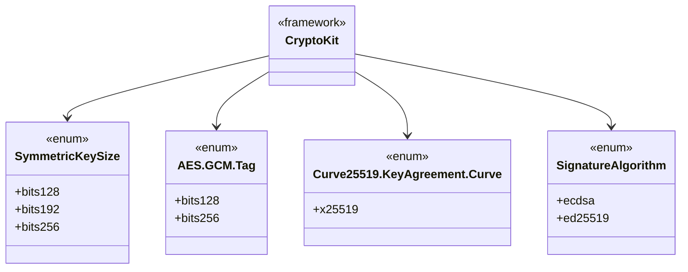


---

### **b. Configuration Classes Diagram**
- **Purpose**: Show the relationship between `CryptoKit` and its configuration classes.
- **Diagram Type**: `classDiagram`
- **Contents**:
  - **AES.GCM.SealedBox**
  - **Curve25519.KeyAgreement.SharedSecret**
  - **P256.Signing.ECDSASignature**

```mermaid
classDiagram
    class AES.GCM {
        +struct SealedBox {
            +var nonce: AES.GCM.Nonce
            +var ciphertext: Data
            +var tag: Data
        }
    }

    class Curve25519.KeyAgreement {
        +struct SharedSecret {
            +var withUnsafeBytes: (UnsafeRawBufferPointer) -> ResultType
        }
    }

    class P256.Signing {
        +struct ECDSASignature {
            +var rawRepresentation: Data
        }
    }

    AES.GCM --> SealedBox
    Curve25519.KeyAgreement --> SharedSecret
    P256.Signing --> ECDSASignature
```

---

## **6. Protocol Conformances**

### **a. Protocols Diagram**
- **Purpose**: Display the protocols that CryptoKit classes conform to and their impact.
- **Diagram Type**: `classDiagram`
- **Contents**:
  - **HashFunction**
  - **SecureEnclaveKey**
  - **KeyAgreement**
  - **DigitalSignature**

## TODO: Fix diagram syntax error


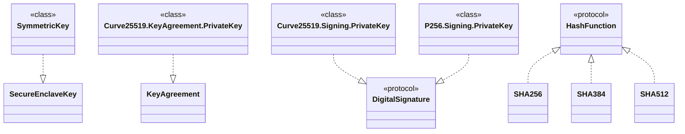


---

## **7. Relationships with Other Classes**

### **a. Related Classes Diagram**
- **Purpose**: Illustrate how `CryptoKit` interacts with other Apple frameworks and classes.
- **Diagram Type**: `flowchart TD`
- **Contents**:
  - **Foundation**: `Data`, `SecureCoding`
  - **Combine**: Reactive streams for asynchronous cryptographic operations
  - **Keychain**: Secure storage integration
  - **Network**: Secure communication protocols
  - **SwiftUI/UIKit**: Integration for secure UI elements

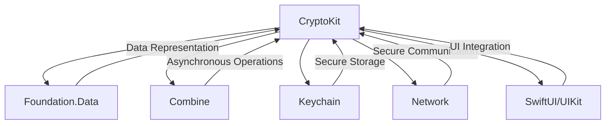

---

## **8. Extensions and Additional Functionalities**

### **a. CryptoKit Extensions Diagram**
- **Purpose**: Showcase the additional functionalities provided through extensions.
- **Diagram Type**: `classDiagram`
- **Contents**:
  - **Data Extensions**: `sha256()`, `sha384()`, `sha512()`
  - **String Extensions**: `data(using:)`
  - **SymmetricKey Extensions**: `withUnsafeBytes()`

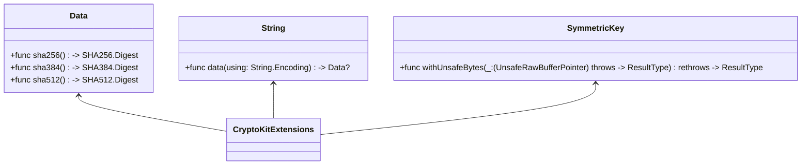

### **b. Extensions Functionalities Flowchart**
- **Purpose**: Detail specific extended methods and their purposes.
- **Diagram Type**: `flowchart LR`
- **Contents**:
  - **Hashing Extensions**
  - **Data Conversion**
  - **Key Byte Access**

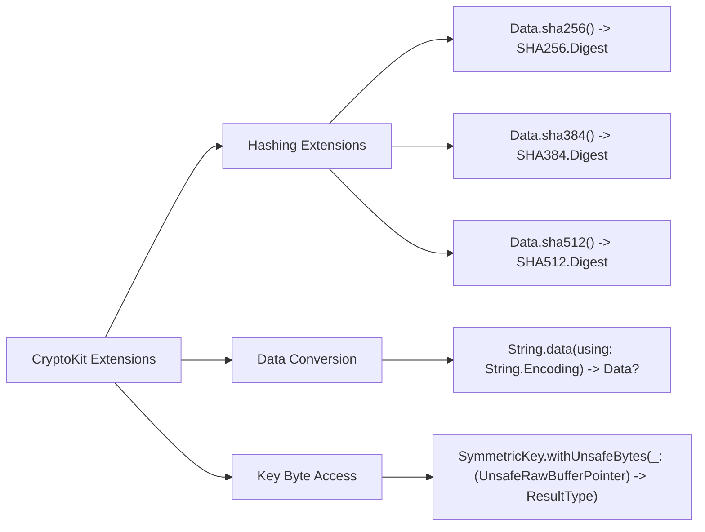

---

## **9. Lifecycle and Use Cases**

### **a. Lifecycle Flowchart**
- **Purpose**: Demonstrate the typical lifecycle of cryptographic operations within an application using CryptoKit.
- **Diagram Type**: `flowchart TD`
- **Contents**:
  - **Key Generation**
  - **Encryption**
  - **Decryption**
  - **Signing**
  - **Verification**
  - **Key Storage**
  - **Key Retrieval**

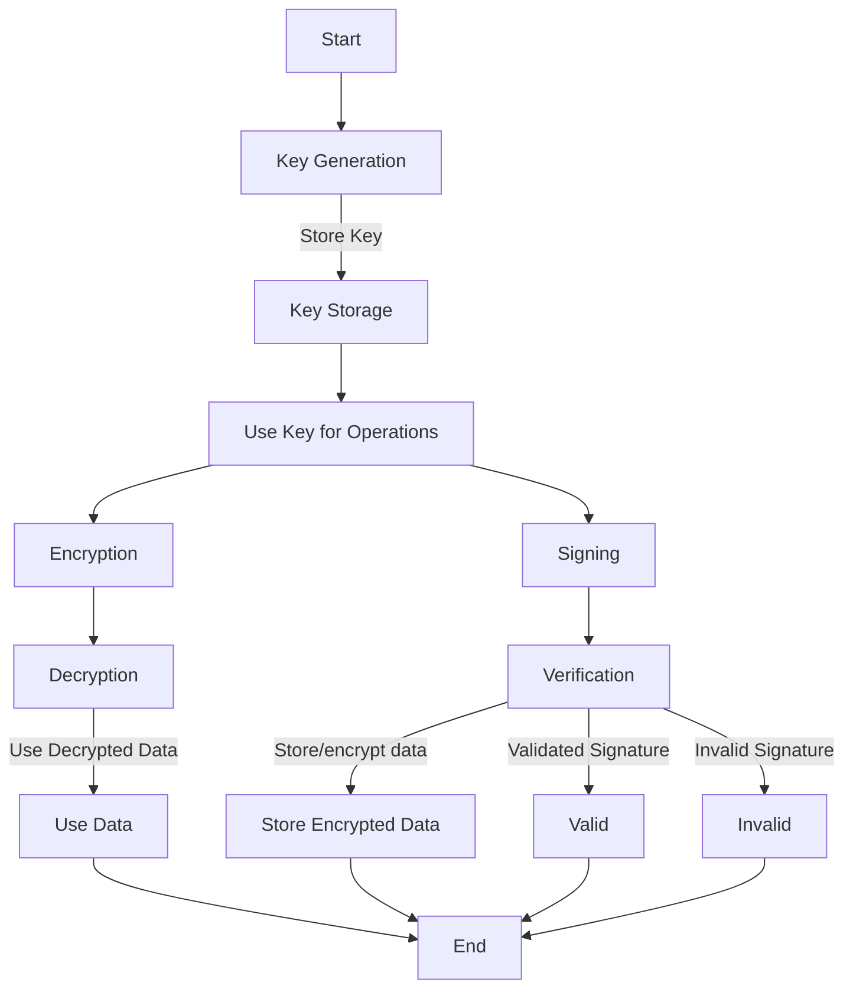

### **b. Common Use Cases Diagram**
- **Purpose**: Outline the typical scenarios where `CryptoKit` is utilized.
- **Diagram Type**: `flowchart TD`
- **Contents**:
  - **Secure Data Storage**
  - **Data Transmission Security**
  - **User Authentication**
  - **Digital Signatures**
  - **Integrity Verification**
  - **Key Exchange**

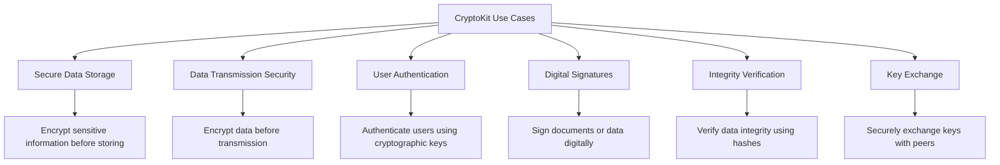

---

## **10. Feature Availability Timeline**

### **a. Feature Availability Gantt Chart**
- **Purpose**: Show when various `CryptoKit` features were introduced across iOS versions.
- **Diagram Type**: `gantt`
- **Contents**:
  - **iOS Versions**: 13.0, 14.0, 15.0, 16.0, 17.0
  - **Features Introduced**: Basic hashing, AES-GCM encryption, Curve25519 support, Secure Enclave integration, post-quantum algorithms.

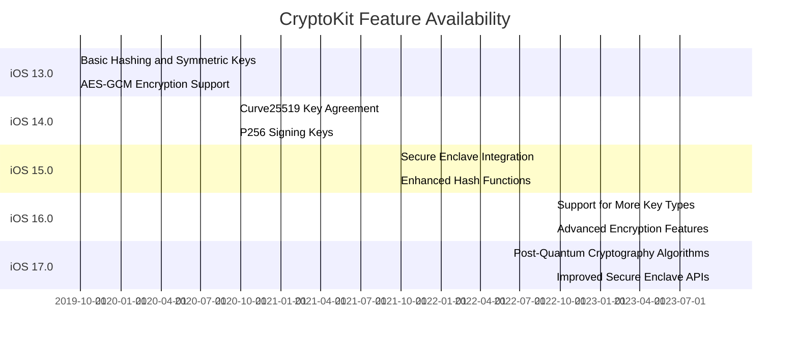

---

## **11. Data Handling and Formats**

### **a. Data Format Handling Diagram**
- **Purpose**: Explain how `CryptoKit` handles different cryptographic data formats.
- **Diagram Type**: `graph LR`
- **Contents**:
  - **Symmetric Keys**: Raw bytes, Data objects
  - **Asymmetric Keys**: PEM, DER formats
  - **Signatures**: ECDSA signatures, raw signatures
  - **Hashes**: SHA256, SHA384, SHA512 digests

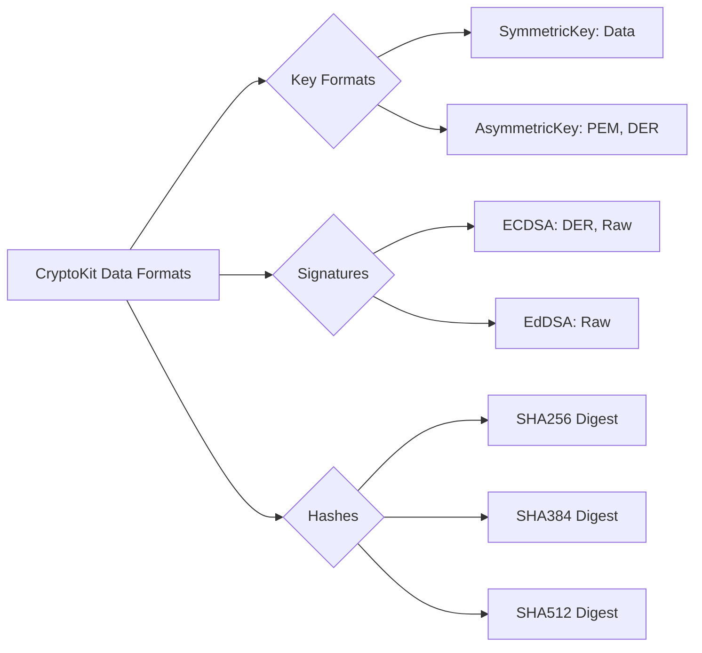

---

## **12. Integration with System Components**

### **a. Secure Storage Integration Diagram**
- **Purpose**: Show how CryptoKit integrates with Keychain for secure key storage.
- **Diagram Type**: `flowchart TD`
- **Contents**:
  - **Key Generation**
  - **Key Storage in Keychain**
  - **Key Retrieval**
  - **Key Usage for Cryptographic Operations**

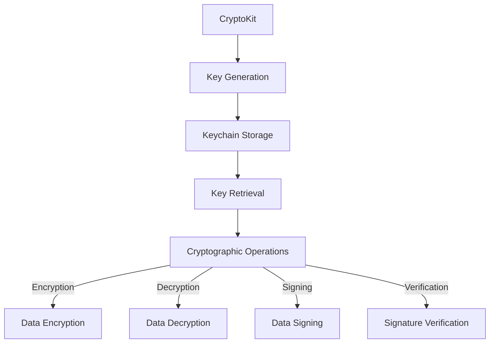

### **b. Network Security Integration Diagram**
- **Purpose**: Illustrate how CryptoKit can be used to secure network communications.
- **Diagram Type**: `flowchart LR`
- **Contents**:
  - **Key Agreement with Curve25519**
  - **Shared Secret Generation**
  - **AES-GCM Encryption**
  - **Secure Data Transmission**
  - **Data Reception and Decryption**

```mermaid
flowchart LR
    A[Client] --> B[Curve25519.KeyAgreement.PrivateKey()]
    A --> C[Send Public Key to Server]
    
    Server --> D[Curve25519.KeyAgreement.PrivateKey()]
    Server --> E[Send Public Key to Client]
    
    B --> F[Generate Shared Secret]
    D --> F[Generate Shared Secret]
    
    F --> G[AES.GCM.seal(Data, using: Shared Secret)]
    G --> H[Transmit Encrypted Data]
    
    H --> I[AES.GCM.open(Encrypted Data, using: Shared Secret)]
    I --> J[Decrypt Data]
```

---

## **13. Summary and Best Practices**

### **a. Summary Diagram**
- **Purpose**: Provide a high-level overview of `CryptoKit`'s key characteristics and functionalities.
- **Diagram Type**: `graph LR`
- **Contents**:
  - **Secure Key Management**
  - **Robust Cryptographic Algorithms**
  - **Seamless Integration**
  - **High Performance**
  - **Ease of Use**
  - **Future-Proofing with Emerging Standards**

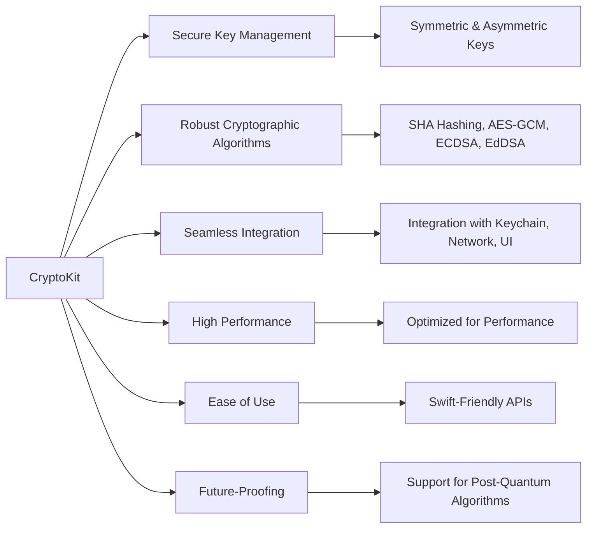

### **b. Best Practices Diagram**
- **Purpose**: Highlight best practices when using CryptoKit to ensure security and efficiency.
- **Diagram Type**: `flowchart LR`
- **Contents**:
  - **Key Management**
  - **Secure Coding**
  - **Performance Optimization**
  - **Regular Updates**
  - **Error Handling**
  - **User Privacy**

```mermaid
flowchart LR
    A[Best Practices for CryptoKit] --> B[Key Management]
    A --> C[Secure Coding]
    A --> D[Performance Optimization]
    A --> E[Regular Updates]
    A --> F[Error Handling]
    A --> G[User Privacy]
    
    B --> B1[Use Secure Enclave for Key Storage]
    B --> B2[Regularly Rotate Keys]
    
    C --> C1[Minimize Key Exposure in Memory]
    C --> C2[Validate All Inputs]
    
    D --> D1[Use Efficient Algorithms]
    D --> D2[Leverage Hardware Acceleration]
    
    E --> E1[Stay Updated with Latest Crypto Standards]
    E --> E2[Monitor Apple Updates for CryptoKit]
    
    F --> F1[Handle Exceptions Gracefully]
    F --> F2[Log Security Events Appropriately]
    
    G --> G1[Respect User Data Privacy]
    G --> G2[Comply with Regulations (e.g., GDPR)]
```

---

## **14. Security Considerations**

### **a. Security Features Diagram**
- **Purpose**: Outline the security features provided by CryptoKit.
- **Diagram Type**: `graph TD`
- **Contents**:
  - **Secure Key Storage**
  - **Strong Cryptographic Algorithms**
  - **Authentication**
  - **Data Integrity**
  - **Confidentiality**
  - **Resistance to Attacks**

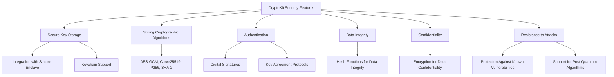

---

## **15. Troubleshooting and Common Issues**

### **a. Common Issues Flowchart**
- **Purpose**: Identify and address common issues encountered when using CryptoKit.
- **Diagram Type**: `flowchart LR`
- **Contents**:
  - **Key Generation Failures**
  - **Encryption/Decryption Errors**
  - **Signature Verification Failures**
  - **Performance Bottlenecks**
  - **Integration Issues with Keychain**
  - **Compatibility Problems**

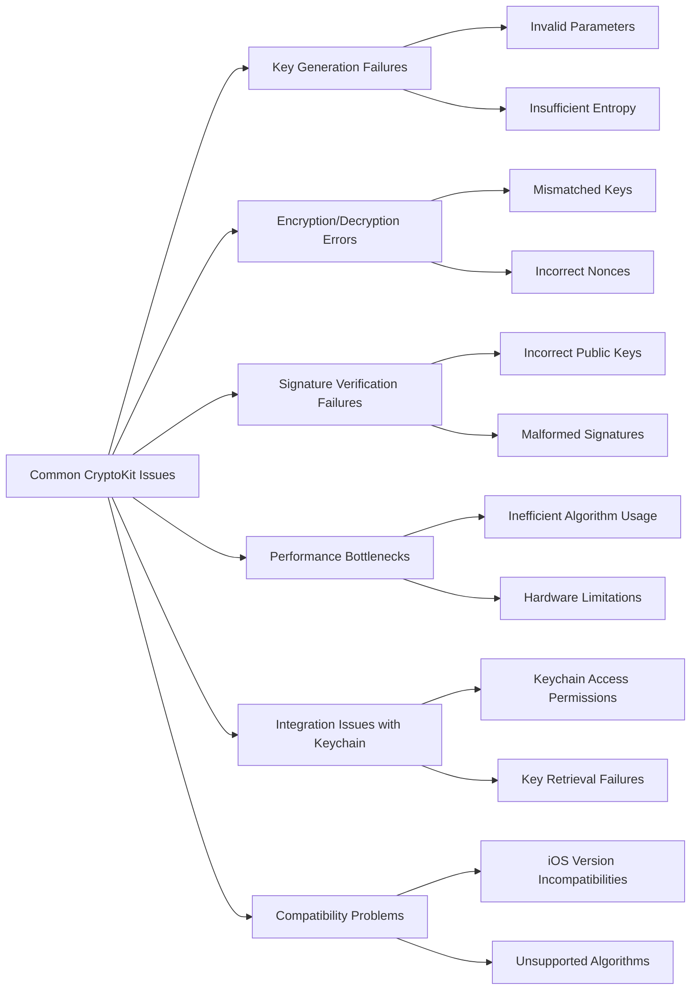

### **b. Troubleshooting Steps Diagram**
- **Purpose**: Provide a step-by-step approach to troubleshoot CryptoKit issues.
- **Diagram Type**: `flowchart TD`
- **Contents**:
  - **Identify the Issue**
  - **Check Parameters and Inputs**
  - **Verify Key Integrity**
  - **Ensure Proper Key Storage**
  - **Optimize Performance**
  - **Consult Documentation and Resources**

```mermaid
flowchart TD
    Start[Start Troubleshooting] --> A[Identify the Issue]
    A --> B[Check Parameters and Inputs]
    B --> C[Verify Key Integrity]
    C --> D[Ensure Proper Key Storage]
    D --> E[Optimize Performance]
    E --> F[Consult Documentation and Resources]
    F --> End[End Troubleshooting]
```

---

## **16. Advanced Topics**

### **a. Post-Quantum Cryptography Diagram**
- **Purpose**: Explore CryptoKit's support for emerging post-quantum cryptographic algorithms.
- **Diagram Type**: `flowchart LR`
- **Contents**:
  - **Algorithm Research**
  - **Implementation Support**
  - **Migration Strategies**
  - **Security Enhancements**

```mermaid
flowchart LR
    A[Post-Quantum Cryptography] --> B[Algorithm Research]
    A --> C[Implementation Support]
    A --> D[Migration Strategies]
    A --> E[Security Enhancements]
    
    B --> B1[NIST PQC Standards]
    C --> C1[Integration with CryptoKit]
    D --> D1[Hybrid Cryptographic Systems]
    D --> D2[Key Rotation Policies]
    
    E --> E1[Enhanced Resistance to Quantum Attacks]
    E --> E2[Future-Proof Security Measures]
```

### **b. Cross-Platform Considerations Diagram**
- **Purpose**: Discuss considerations when using CryptoKit in cross-platform applications.
- **Diagram Type**: `flowchart TD`
- **Contents**:
  - **Swift Compatibility**
  - **Interoperability with Other Languages**
  - **Consistent Cryptographic Standards**
  - **Data Serialization Formats**

```mermaid
flowchart TD
    A[Cross-Platform Considerations] --> B[Swift Compatibility]
    A --> C[Interoperability with Other Languages]
    A --> D[Consistent Cryptographic Standards]
    A --> E[Data Serialization Formats]
    
    B --> B1[Use of Swift's Codable]
    B --> B2[Swift Package Manager Support]
    
    C --> C1[Bridging with C/C++]
    C --> C2[Compatibility with Java/Kotlin]
    
    D --> D1[Adherence to RFCs and Standards]
    D --> D2[Uniform Algorithm Implementations]
    
    E --> E1[JSON, CBOR Formats]
    E --> E2[Binary Data Handling]
```

---

## **17. Performance Optimization Techniques**

### **a. Optimization Strategies Diagram**
- **Purpose**: Highlight strategies to optimize cryptographic operations using CryptoKit.
- **Diagram Type**: `flowchart LR`
- **Contents**:
  - **Efficient Key Management**
  - **Batch Processing**
  - **Leveraging Hardware Acceleration**
  - **Minimizing Data Copies**
  - **Asynchronous Operations**

```mermaid
flowchart LR
    A[Performance Optimization] --> B[Efficient Key Management]
    A --> C[Batch Processing]
    A --> D[Leveraging Hardware Acceleration]
    A --> E[Minimizing Data Copies]
    A --> F[Asynchronous Operations]
    
    B --> B1[Reuse Keys When Safe]
    B --> B2[Store Keys Securely]
    
    C --> C1[Process Multiple Data Blocks Together]
    
    D --> D1[Use Apple's Hardware Crypto Acceleration]
    
    E --> E1[Use In-Place Operations]
    E --> E2[Avoid Unnecessary Data Transformations]
    
    F --> F1[Utilize Combine or Async/Await]
    F --> F2[Offload Heavy Operations to Background Threads]
```

### **b. Profiling and Benchmarking Diagram**
- **Purpose**: Outline steps to profile and benchmark cryptographic operations.
- **Diagram Type**: `flowchart TD`
- **Contents**:
  - **Identify Performance Bottlenecks**
  - **Use Instruments for Profiling**
  - **Benchmark Different Algorithms**
  - **Analyze Memory Usage**
  - **Optimize Code Based on Insights**

```mermaid
flowchart TD
    Start[Start Profiling] --> A[Identify Performance Bottlenecks]
    A --> B[Use Instruments for Profiling]
    B --> C[Benchmark Different Algorithms]
    C --> D[Analyze Memory Usage]
    D --> E[Optimize Code Based on Insights]
    E --> End[End Profiling]
```

---

## **18. Compliance and Regulatory Considerations**

### **a. Compliance Requirements Diagram**
- **Purpose**: Highlight the compliance and regulatory aspects when using CryptoKit.
- **Diagram Type**: `graph LR`
- **Contents**:
  - **GDPR**
  - **HIPAA**
  - **PCI-DSS**
  - **FIPS Standards**
  - **User Consent**

```mermaid
graph LR
    A[Compliance Requirements] --> B[GDPR]
    A --> C[HIPAA]
    A --> D[PCI-DSS]
    A --> E[FIPS Standards]
    A --> F[User Consent]
    
    B --> B1[Data Protection and Privacy]
    C --> C1[Protected Health Information Security]
    D --> D1[Payment Data Security]
    E --> E1[FIPS 140-2 Compliance]
    F --> F1[Obtain Explicit User Consent for Data Usage]
```

### **b. Regulatory Compliance Flowchart**
- **Purpose**: Provide a step-by-step approach to ensure regulatory compliance when implementing CryptoKit.
- **Diagram Type**: `flowchart LR`
- **Contents**:
  - **Understand Applicable Regulations**
  - **Implement Required Security Measures**
  - **Document Cryptographic Processes**
  - **Conduct Regular Audits**
  - **Ensure User Consent and Transparency**

```mermaid
flowchart LR
    Start[Start Compliance] --> A[Understand Applicable Regulations]
    A --> B[Implement Required Security Measures]
    B --> C[Document Cryptographic Processes]
    C --> D[Conduct Regular Audits]
    D --> E[Ensure User Consent and Transparency]
    E --> End[End Compliance]
```

---

## **19. Migrating to CryptoKit**

### **a. Migration Steps Diagram**
- **Purpose**: Outline the steps to migrate from legacy cryptographic libraries to CryptoKit.
- **Diagram Type**: `flowchart TD`
- **Contents**:
  - **Assessment of Current Cryptography**
  - **Identify CryptoKit Equivalents**
  - **Plan Migration Strategy**
  - **Implement Incrementally**
  - **Test Thoroughly**
  - **Deprecate Legacy Code**

```mermaid
flowchart TD
    Start[Start Migration] --> A[Assessment of Current Cryptography]
    A --> B[Identify CryptoKit Equivalents]
    B --> C[Plan Migration Strategy]
    C --> D[Implement Incrementally]
    D --> E[Test Thoroughly]
    E --> F[Deprecate Legacy Code]
    F --> End[End Migration]
```

### **b. Migration Considerations Diagram**
- **Purpose**: Highlight key considerations during migration to CryptoKit.
- **Diagram Type**: `graph TB`
- **Contents**:
  - **Compatibility**
  - **Data Migration**
  - **Security Enhancements**
  - **Performance Implications**
  - **User Impact**

```mermaid
graph TB
    A[Migration Considerations] --> B[Compatibility]
    A --> C[Data Migration]
    A --> D[Security Enhancements]
    A --> E[Performance Implications]
    A --> F[User Impact]
    
    B --> B1[Ensure CryptoKit is Supported on Target iOS Versions]
    
    C --> C1[Securely Transfer Existing Keys and Data]
    
    D --> D1[Implement Stronger Cryptographic Algorithms]
    
    E --> E1[Assess Any Performance Changes]
    
    F --> F1[Minimize User Disruptions During Migration]
```

---

## **20. Resources and Further Reading**

### **a. Documentation and Tutorials Diagram**
- **Purpose**: Provide links and references for further learning about CryptoKit.
- **Diagram Type**: `flowchart LR`
- **Contents**:
  - **Apple Developer Documentation**
  - **WWDC Sessions**
  - **Official CryptoKit Samples**
  - **Community Tutorials**
  - **Books and Articles**

```mermaid
flowchart LR
    A[CryptoKit Resources] --> B[Apple Developer Documentation]
    A --> C[WWDC Sessions]
    A --> D[Official CryptoKit Samples]
    A --> E[Community Tutorials]
    A --> F[Books and Articles]
    
    B --> B1["https://developer.apple.com/documentation/cryptokit"]
    C --> C1["WWDC Videos on CryptoKit"]
    D --> D1["CryptoKit Sample Code on GitHub"]
    E --> E1["Ray Wenderlich CryptoKit Tutorials"]
    F --> F1["Books on Swift and Crypto"]
```

### **b. Community and Support Diagram**
- **Purpose**: Highlight community support and forums for CryptoKit.
- **Diagram Type**: `graph LR`
- **Contents**:
  - **Stack Overflow**
  - **Apple Developer Forums**
  - **GitHub Repositories**
  - **Swift Forums**
  - **iOS Development Communities**

```mermaid
graph LR
    A[CryptoKit Support] --> B[Stack Overflow]
    A --> C[Apple Developer Forums]
    A --> D[GitHub Repositories]
    A --> E[Swift Forums]
    A --> F[iOS Development Communities]
    
    B --> B1["https://stackoverflow.com/questions/tagged/cryptokit"]
    C --> C1["https://developer.apple.com/forums/tags/cryptokit"]
    D --> D1["CryptoKit on GitHub"]
    E --> E1["https://forums.swift.org/c/cryptography"]
    F --> F1["Reddit r/iOSProgramming"]
    F --> F2["Ray Wenderlich Forums"]
```

---

## **21. Security Best Practices**

### **a. Best Practices Diagram**
- **Purpose**: Provide guidelines to ensure secure usage of CryptoKit.
- **Diagram Type**: `flowchart LR`
- **Contents**:
  - **Use Strong Key Sizes**
  - **Protect Private Keys**
  - **Implement Proper Error Handling**
  - **Regularly Update Cryptographic Libraries**
  - **Avoid Hardcoding Secrets**
  - **Use Secure Random Number Generators**

```mermaid
flowchart LR
    A[CryptoKit Security Best Practices] --> B[Use Strong Key Sizes]
    A --> C[Protect Private Keys]
    A --> D[Implement Proper Error Handling]
    A --> E[Regularly Update Cryptographic Libraries]
    A --> F[Avoid Hardcoding Secrets]
    A --> G[Use Secure Random Number Generators]
    
    B --> B1["Use 256-bit keys for symmetric encryption"]
    C --> C1["Store keys in Secure Enclave or Keychain"]
    D --> D1["Handle and log errors securely without exposing sensitive info"]
    E --> E1["Keep CryptoKit and dependencies up to date"]
    F --> F1["Never hardcode cryptographic keys or sensitive data"]
    G --> G1["Use CryptoKit's secure random functions"]
```

---

## **22. Compliance with Cryptographic Standards**

### **a. Standards Mapping Diagram**
- **Purpose**: Map CryptoKit's features to recognized cryptographic standards.
- **Diagram Type**: `graph TB`
- **Contents**:
  - **AES-GCM**: NIST SP 800-38D
  - **Curve25519**: RFC 7748
  - **P-256**: NIST FIPS 186-4
  - **SHA-2**: FIPS PUB 180-4
  - **ECDSA**: FIPS PUB 186-4

```mermaid
graph TB
    A[CryptoKit Features] --> B[AES-GCM]
    A --> C[Curve25519]
    A --> D[P-256]
    A --> E[SHA-2]
    A --> F[ECDSA]
    
    B --> B1["NIST SP 800-38D"]
    C --> C1["RFC 7748"]
    D --> D1["NIST FIPS 186-4"]
    E --> E1["FIPS PUB 180-4"]
    F --> F1["NIST FIPS 186-4"]
```

---

## **23. Real-World Applications and Use Cases**

### **a. Application Scenarios Diagram**
- **Purpose**: Showcase real-world applications of CryptoKit in various domains.
- **Diagram Type**: `flowchart LR`
- **Contents**:
  - **Secure Messaging**
  - **Encrypted Storage Solutions**
  - **Digital Signature Services**
  - **Authentication Systems**
  - **Secure File Transfer**
  - **Blockchain Integrations**

```mermaid
flowchart LR
    A[Real-World Applications] --> B[Secure Messaging]
    A --> C[Encrypted Storage Solutions]
    A --> D[Digital Signature Services]
    A --> E[Authentication Systems]
    A --> F[Secure File Transfer]
    A --> G[Blockchain Integrations]
    
    B --> B1["End-to-End Encrypted Chat Apps"]
    C --> C1["Secure Document Storage"]
    D --> D1["E-Signature Platforms"]
    E --> E1["Two-Factor Authentication"]
    F --> F1["Encrypted File Sharing Services"]
    G --> G1["Cryptographic Operations in Blockchain Nodes"]
```

---

## **24. Testing and Validation**

### **a. Testing Strategies Diagram**
- **Purpose**: Outline strategies to effectively test CryptoKit implementations.
- **Diagram Type**: `flowchart TD`
- **Contents**:
  - **Unit Testing**
  - **Integration Testing**
  - **Security Audits**
  - **Performance Testing**
  - **Fuzz Testing**

```mermaid
flowchart TD
    A[Testing CryptoKit] --> B[Unit Testing]
    A --> C[Integration Testing]
    A --> D[Security Audits]
    A --> E[Performance Testing]
    A --> F[Fuzz Testing]
    
    B --> B1["Test individual cryptographic functions"]
    C --> C1["Test cryptographic operations within app workflows"]
    D --> D1["Conduct code reviews and security assessments"]
    E --> E1["Benchmark cryptographic operations"]
    F --> F1["Test robustness against malformed inputs"]
```

### **b. Validation Checklist Diagram**
- **Purpose**: Provide a checklist to ensure CryptoKit implementations are correct and secure.
- **Diagram Type**: `graph LR`
- **Contents**:
  - **Key Generation Validity**
  - **Encryption/Decryption Accuracy**
  - **Signature Generation and Verification**
  - **Hash Function Correctness**
  - **Error Handling Mechanisms**
  - **Secure Key Storage Validation**

```mermaid
graph LR
    A[Validation Checklist] --> B[Key Generation Validity]
    A --> C[Encryption/Decryption Accuracy]
    A --> D[Signature Generation and Verification]
    A --> E[Hash Function Correctness]
    A --> F[Error Handling Mechanisms]
    A --> G[Secure Key Storage Validation]
    
    B --> B1["Ensure keys meet required strength"]
    C --> C1["Encrypt then decrypt and compare data"]
    D --> D1["Sign data then verify signature"]
    E --> E1["Compare hash outputs with known values"]
    F --> F1["Handle errors without exposing sensitive info"]
    G --> G1["Verify keys are stored in Secure Enclave/Keychain"]
```

---

## **25. Future Developments and Roadmap**

### **a. Future Features Diagram**
- **Purpose**: Explore potential future developments and features in CryptoKit.
- **Diagram Type**: `flowchart LR`
- **Contents**:
  - **Post-Quantum Algorithms**
  - **Enhanced SecureEnclave APIs**
  - **Support for New Cryptographic Standards**
  - **Improved Integration with SwiftUI**
  - **Advanced Key Management Features**
  - **Cross-Platform Support Enhancements**

```mermaid
flowchart LR
    A[Future Developments] --> B[Post-Quantum Algorithms]
    A --> C[Enhanced SecureEnclave APIs]
    A --> D[Support for New Cryptographic Standards]
    A --> E[Improved Integration with SwiftUI]
    A --> F[Advanced Key Management Features]
    A --> G[Cross-Platform Support Enhancements]
    
    B --> B1["Implementing NIST PQC Algorithms"]
    
    C --> C1["More flexible key operations"]
    
    D --> D1["Support for Emerging Standards like XMSS"]
    
    E --> E1["Seamless UI Integration for Security Features"]
    
    F --> F1["Automated Key Rotation"]
    F --> F2["Centralized Key Management"]
    
    G --> G1["Enhanced Interoperability with Other Platforms"]
```

### **b. Research and Innovation Diagram**
- **Purpose**: Highlight areas of active research and innovation within cryptography that may influence future CryptoKit features.
- **Diagram Type**: `graph TB`
- **Contents**:
  - **Homomorphic Encryption**
  - **Zero-Knowledge Proofs**
  - **Quantum-Resistant Algorithms**
  - **Lightweight Cryptography**
  - **Distributed Ledger Technologies**

```mermaid
graph TB
    A[Research and Innovation] --> B[Homomorphic Encryption]
    A --> C[Zero-Knowledge Proofs]
    A --> D[Quantum-Resistant Algorithms]
    A --> E[Lightweight Cryptography]
    A --> F[Distributed Ledger Technologies]
    
    B --> B1["Enabling computations on encrypted data"]
    
    C --> C1["Proving knowledge without revealing data"]
    
    D --> D1["Developing algorithms resilient to quantum attacks"]
    
    E --> E1["Creating cryptographic methods for constrained environments"]
    
    F --> F1["Integrating cryptography with blockchain technologies"]
```

---

## **26. Error Handling and Security**

### **a. Error Handling Diagram**
- **Purpose**: Outline strategies for robust error handling in CryptoKit implementations.
- **Diagram Type**: `flowchart LR`
- **Contents**:
  - **Graceful Degradation**
  - **Secure Error Messages**
  - **Exception Handling**
  - **Logging Practices**
  - **User Feedback**

```mermaid
flowchart LR
    A[Error Handling in CryptoKit] --> B[Graceful Degradation]
    A --> C[Secure Error Messages]
    A --> D[Exception Handling]
    A --> E[Logging Practices]
    A --> F[User Feedback]
    
    B --> B1["Fallback to less secure methods if necessary"]
    
    C --> C1["Avoid exposing sensitive information in error messages"]
    
    D --> D1["Use do-try-catch blocks appropriately"]
    
    E --> E1["Log errors securely without leaking data"]
    
    F --> F1["Provide meaningful feedback without compromising security"]
```

### **b. Security Incident Response Diagram**
- **Purpose**: Define steps to respond to security incidents involving CryptoKit.
- **Diagram Type**: `flowchart TD`
- **Contents**:
  - **Incident Detection**
  - **Containment**
  - **Eradication**
  - **Recovery**
  - **Post-Incident Analysis**

```mermaid
flowchart TD
    Start[Security Incident] --> A[Incident Detection]
    A --> B[Containment]
    B --> C[Eradication]
    C --> D[Recovery]
    D --> E[Post-Incident Analysis]
    E --> End[Improve Security Measures]
```

---

## **27. Compliance with Data Privacy Laws**

### **a. Data Privacy Integration Diagram**
- **Purpose**: Illustrate how CryptoKit can be used to comply with data privacy laws.
- **Diagram Type**: `flowchart LR`
- **Contents**:
  - **Data Encryption**
  - **Access Controls**
  - **Data Minimization**
  - **Audit Trails**
  - **User Consent Management**

```mermaid
flowchart LR
    A[Data Privacy Compliance] --> B[Data Encryption]
    A --> C[Access Controls]
    A --> D[Data Minimization]
    A --> E[Audit Trails]
    A --> F[User Consent Management]
    
    B --> B1["Encrypt data at rest and in transit"]
    
    C --> C1["Restrict key access to authorized entities"]
    
    D --> D1["Only collect necessary data"]
    
    E --> E1["Log cryptographic operations securely"]
    
    F --> F1["Obtain and manage user consents for data processing"]
```

---

## **28. Integration with Authentication Systems**

### **a. Authentication Flow Diagram**
- **Purpose**: Show how CryptoKit integrates with authentication systems.
- **Diagram Type**: `flowchart TD`
- **Contents**:
  - **User Registration**
  - **Key Pair Generation**
  - **Secure Authentication Requests**
  - **Signature Verification**
  - **Access Granting**

```mermaid
flowchart TD
    A[Authentication System] --> B[User Registration]
    B --> C[Generate Key Pair using CryptoKit]
    C --> D[Store Public Key on Server]
    D --> E[User Login]
    E --> F[Create Authentication Request]
    F --> G[Sign Request with Private Key]
    G --> H[Send Signed Request to Server]
    H --> I[Verify Signature using Public Key]
    I --> J[Grant Access if Valid]
```

### **b. Multi-Factor Authentication Diagram**
- **Purpose**: Describe the role of CryptoKit in implementing multi-factor authentication.
- **Diagram Type**: `flowchart LR`
- **Contents**:
  - **Password-Based Authentication**
  - **Cryptographic Verification**
  - **One-Time Passwords (OTP)**
  - **Biometric Data Protection**

```mermaid
flowchart LR
    A[Multi-Factor Authentication] --> B[Password-Based Authentication]
    A --> C[Cryptographic Verification]
    A --> D[One-Time Passwords (OTP)]
    A --> E[Biometric Data Protection]
    
    B --> B1["User provides password"]
    
    C --> C1["Use CryptoKit to sign authentication tokens"]
    
    D --> D1["Generate and verify OTP using CryptoKit"]
    
    E --> E1["Encrypt and store biometric data securely"]
```

---

## **29. Access Control and Permissions**

### **a. Access Control Diagram**
- **Purpose**: Illustrate how CryptoKit facilitates access control and permissions.
- **Diagram Type**: `flowchart TD`
- **Contents**:
  - **Role-Based Access Control (RBAC)**
  - **Attribute-Based Access Control (ABAC)**
  - **Token Generation**
  - **Secure Key Distribution**

```mermaid
flowchart TD
    A[Access Control with CryptoKit] --> B[Role-Based Access Control (RBAC)]
    A --> C[Attribute-Based Access Control (ABAC)]
    A --> D[Token Generation]
    A --> E[Secure Key Distribution]
    
    B --> B1["Assign roles to users"]
    C --> C1["Define attributes for access"]
    D --> D1["Generate cryptographically secure tokens"]
    E --> E1["Distribute keys securely using CryptoKit"]
```

### **b. Permissions Management Diagram**
- **Purpose**: Detail the management of permissions in applications using CryptoKit.
- **Diagram Type**: `flowchart LR`
- **Contents**:
  - **Requesting Permissions**
  - **Validating Permissions**
  - **Revoking Permissions**
  - **Auditing Permissions Usage**

```mermaid
flowchart LR
    A[Permissions Management] --> B[Requesting Permissions]
    A --> C[Validating Permissions]
    A --> D[Revoking Permissions]
    A --> E[Auditing Permissions Usage]
    
    B --> B1["Prompt user for necessary permissions"]
    
    C --> C1["Use CryptoKit to verify permission tokens"]
    
    D --> D1["Revoke access tokens securely"]
    
    E --> E1["Log permission grants and revocations"]
```

---

## **30. Case Studies and Examples**

### **a. Case Study: Secure Messaging App Diagram**
- **Purpose**: Demonstrate how CryptoKit can be used in a secure messaging application.
- **Diagram Type**: `flowchart TD`
- **Contents**:
  - **End-to-End Encryption**
  - **Key Exchange Mechanism**
  - **Message Signing**
  - **Signature Verification**
  - **Secure Storage of Messages**

```mermaid
flowchart TD
    A[Secure Messaging App] --> B[End-to-End Encryption]
    A --> C[Key Exchange Mechanism]
    A --> D[Message Signing]
    A --> E[Signature Verification]
    A --> F[Secure Storage of Messages]
    
    B --> B1["Encrypt messages using AES-GCM with CryptoKit"]
    
    C --> C1["Use Curve25519 for secure key exchange"]
    
    D --> D1["Sign messages with P256.ECDSA keys"]
    
    E --> E1["Verify signatures on received messages"]
    
    F --> F1["Store encrypted messages in database"]
```

### **b. Code Example Diagram**
- **Purpose**: Provide a visual representation of a CryptoKit code example.
- **Diagram Type**: `flowchart LR`
- **Contents**:
  - **Key Generation**
  - **Data Encryption**
  - **Data Decryption**
  - **Verification**

```mermaid
flowchart LR
    A[Swift Code Example] --> B[Generate Symmetric Key]
    B --> C[Encrypt Data]
    C --> D[Decrypt Data]
    D --> E[Verify Integrity]
    
    B[Generate Symmetric Key]
        -->|SymmetricKey.generate(size:)| B1[let key = SymmetricKey(size: .bits256)]
    
    C[Encrypt Data]
        -->|AES.GCM.seal(data, using: key)| C1[let sealedBox = try AES.GCM.seal(data, using: key)]
    
    D[Decrypt Data]
        -->|AES.GCM.open(sealedBox, using: key)| D1[let decryptedData = try AES.GCM.open(sealedBox, using: key)]
    
    E[Verify Integrity]
        -->|Compare decryptedData with original data| E1[assert(decryptedData == data)]
```

---

## **31. Security Audits and Compliance Checks**

### **a. Audit Process Diagram**
- **Purpose**: Outline the process for conducting security audits on CryptoKit implementations.
- **Diagram Type**: `flowchart TD`
- **Contents**:
  - **Preparation**
  - **Review Cryptographic Implementations**
  - **Identify Vulnerabilities**
  - **Mitigate Risks**
  - **Report Findings**
  - **Implement Recommendations**

```mermaid
flowchart TD
    Start[Start Security Audit] --> A[Preparation]
    A --> B[Review Cryptographic Implementations]
    B --> C[Identify Vulnerabilities]
    C --> D[Mitigate Risks]
    D --> E[Report Findings]
    E --> F[Implement Recommendations]
    F --> End[End Audit]
```

### **b. Compliance Verification Diagram**
- **Purpose**: Show steps to verify compliance with security standards using CryptoKit.
- **Diagram Type**: `flowchart LR`
- **Contents**:
  - **Define Compliance Standards**
  - **Map CryptoKit Features to Standards**
  - **Conduct Code Reviews**
  - **Perform Security Testing**
  - **Document Compliance Status**

```mermaid
flowchart LR
    A[Compliance Verification] --> B[Define Compliance Standards]
    A --> C[Map CryptoKit Features to Standards]
    A --> D[Conduct Code Reviews]
    A --> E[Perform Security Testing]
    A --> F[Document Compliance Status]
    
    B --> B1["Identify relevant standards (e.g., FIPS, GDPR)"]
    
    C --> C1["Align CryptoKit features with compliance requirements"]
    
    D --> D1["Review code for adherence to security practices"]
    
    E --> E1["Conduct penetration testing and vulnerability assessments"]
    
    F --> F1["Prepare compliance reports and documentation"]
```

---

## **32. Additional Resources and Tools**

### **a. Tools Integration Diagram**
- **Purpose**: Highlight tools that can be used alongside CryptoKit for enhanced security and development.
- **Diagram Type**: `flowchart TB`
- **Contents**:
  - **Xcode Instruments**
  - **Keychain Access**
  - **OpenSSL**
  - **Postman for API Testing**
  - **Custom Scripts**

```mermaid
flowchart TB
    A[Additional Tools] --> B[Xcode Instruments]
    A --> C[Keychain Access]
    A --> D[OpenSSL]
    A --> E[Postman for API Testing]
    A --> F[Custom Scripts]
    
    B --> B1["Profile cryptographic performance"]
    C --> C1["Manage Keychain entries"]
    D --> D1["Generate and manage keys externally"]
    E --> E1["Test encrypted API endpoints"]
    F --> F1["Automate cryptographic tasks"]
```

### **b. Learning Path Diagram**
- **Purpose**: Provide a structured learning path for mastering CryptoKit.
- **Diagram Type**: `flowchart LR`
- **Contents**:
  - **Fundamentals of Cryptography**
  - **Swift Programming Proficiency**
  - **CryptoKit Basics**
  - **Advanced CryptoKit Features**
  - **Hands-On Projects**
  - **Continuous Learning**

```mermaid
flowchart LR
    A[Learning Path for CryptoKit] --> B[Fundamentals of Cryptography]
    B --> C[Swift Programming Proficiency]
    C --> D[CryptoKit Basics]
    D --> E[Advanced CryptoKit Features]
    E --> F[Hands-On Projects]
    F --> G[Continuous Learning]
    
    B --> B1["Study cryptographic principles and algorithms"]
    
    C --> C1["Master Swift programming and security features"]
    
    D --> D1["Understand CryptoKit's core functionalities"]
    
    E --> E1["Explore advanced cryptographic operations"]
    
    F --> F1["Build secure applications using CryptoKit"]
    
    G --> G1["Stay updated with latest CryptoKit developments"]
```

---

## **33. Conclusion**

### **a. Final Overview Diagram**
- **Purpose**: Summarize the key takeaways and the importance of CryptoKit in modern iOS development.
- **Diagram Type**: `graph LR`
- **Contents**:
  - **Enhanced Security**
  - **Ease of Integration**
  - **Future-Ready Cryptography**
  - **Comprehensive Framework**
  - **Developer-Friendly APIs**

```mermaid
graph LR
    A[CryptoKit Conclusion] --> B[Enhanced Security]
    A --> C[Ease of Integration]
    A --> D[Future-Ready Cryptography]
    A --> E[Comprehensive Framework]
    A --> F[Developer-Friendly APIs]
    
    B --> B1["Robust cryptographic algorithms and key management"]
    C --> C1["Seamless integration with iOS frameworks"]
    D --> D1["Support for emerging cryptographic standards"]
    E --> E1["Wide range of cryptographic functionalities"]
    F --> F1["Swift-native APIs for ease of use"]
```

---

## **34. Additional Considerations**

### **a. Scalability Diagram**
- **Purpose**: Discuss scalability aspects when using CryptoKit in large applications.
- **Diagram Type**: `flowchart TB`
- **Contents**:
  - **Modular Key Management**
  - **Distributed Systems Support**
  - **Efficient Resource Utilization**
  - **Load Balancing Cryptographic Operations**
  - **Monitoring and Maintenance**

```mermaid
flowchart TB
    A[Scalability Considerations] --> B[Modular Key Management]
    A --> C[Distributed Systems Support]
    A --> D[Efficient Resource Utilization]
    A --> E[Load Balancing Cryptographic Operations]
    A --> F[Monitoring and Maintenance]
    
    B --> B1["Segment key management by application module"]
    
    C --> C1["Ensure cryptographic operations can scale horizontally"]
    
    D --> D1["Optimize cryptographic operations for performance"]
    
    E --> E1["Distribute operations across multiple servers"]
    
    F --> F1["Monitor cryptographic system health and performance"]
```

### **b. Ethical Considerations Diagram**
- **Purpose**: Address ethical implications of implementing cryptography in applications.
- **Diagram Type**: `graph TD`
- **Contents**:
  - **User Privacy**
  - **Data Protection**
  - **Responsible Encryption Use**
  - **Transparency with Users**
  - **Compliance with Laws**

```mermaid
graph TD
    A[Ethical Considerations] --> B[User Privacy]
    A --> C[Data Protection]
    A --> D[Responsible Encryption Use]
    A --> E[Transparency with Users]
    A --> F[Compliance with Laws]
    
    B --> B1["Protect user data from unauthorized access"]
    C --> C1["Ensure data integrity and confidentiality"]
    D --> D1["Avoid misuse of cryptographic tools"]
    E --> E1["Inform users about data encryption practices"]
    F --> F1["Adhere to legal requirements for data protection"]
```

---

## **35. Glossary of Terms**

### **a. Glossary Diagram**
- **Purpose**: Define key terms and concepts related to CryptoKit.
- **Diagram Type**: `flowchart LR`
- **Contents**:
  - **AES-GCM**
  - **Curve25519**
  - **ECDSA**
  - **SHA-2**
  - **Secure Enclave**
  - **Symmetric Key**
  - **Asymmetric Key**

```mermaid
flowchart LR
    A[CryptoKit Glossary] --> B[AES-GCM]
    A --> C[Curve25519]
    A --> D[ECDSA]
    A --> E[SHA-2]
    A --> F[Secure Enclave]
    A --> G[Symmetric Key]
    A --> H[Asymmetric Key]
    
    B --> B1["Advanced Encryption Standard - Galois/Counter Mode, a symmetric encryption algorithm"]
    
    C --> C1["A key agreement scheme using elliptic curve Diffie-Hellman"]
    
    D --> D1["Elliptic Curve Digital Signature Algorithm, used for digital signatures"]
    
    E --> E1["Secure Hash Algorithms, a family of cryptographic hash functions"]
    
    F --> F1["Hardware-based key manager integrated into Apple devices"]
    
    G --> G1["Encryption keys using the same key for encryption and decryption"]
    
    H --> H1["Encryption keys using a pair of public and private keys"]
```

---

## **36. Frequently Asked Questions (FAQ)**

### **a. FAQ Diagram**
- **Purpose**: Present common questions and answers about CryptoKit.
- **Diagram Type**: `classDiagram`
- **Contents**:
  - **What is CryptoKit?**
  - **How to generate keys?**
  - **How to perform encryption?**
  - **Is CryptoKit secure?**
  - **How to integrate with Keychain?**
  - **What algorithms are supported?**

```mermaid
classDiagram
    class CryptoKitFAQ {
        <<class>>
    }

    class WhatIsCryptoKit {
        +description: String
    }

    class HowToGenerateKeys {
        +steps: String
    }

    class HowToPerformEncryption {
        +steps: String
    }

    class IsCryptoKitSecure {
        +reply: String
    }

    class IntegrationWithKeychain {
        +steps: String
    }

    class SupportedAlgorithms {
        +algorithms: String
    }

    CryptoKitFAQ --> WhatIsCryptoKit
    CryptoKitFAQ --> HowToGenerateKeys
    CryptoKitFAQ --> HowToPerformEncryption
    CryptoKitFAQ --> IsCryptoKitSecure
    CryptoKitFAQ --> IntegrationWithKeychain
    CryptoKitFAQ --> SupportedAlgorithms
```

---

