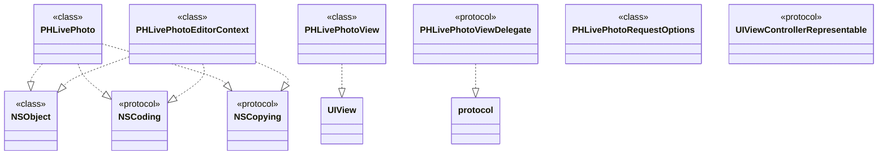

# Live Photos

Below is a comprehensive and organized set of Mermaid diagrams for the **Live Photos** framework. These diagrams cover various aspects of the Live Photos framework, including class structures, initializers, properties, methods, enumerations, protocol conformances, relationships with other classes, extensions, lifecycle, feature availability, data handling, integration points, and best practices.

---

## **1. Class Structure and Hierarchy**

### **a. Core Class Diagram**
- **Purpose**: Illustrate the primary structure of the Live Photos framework, including its core classes, properties, methods, and enumerations.
- **Diagram Type**: `classDiagram`
- **Contents**:
  - **Properties**: Key attributes like `photo`, `videoURL`, `duration`, etc.
  - **Methods**: Essential functions like initializers, `fetchLivePhotos()`, `play()`, etc.
  - **Enumerations**: Nested enums such as `PHLivePhotoViewPlaybackStyle`, `PHLivePhotoRequestOptionsDeliveryMode`, etc.


---

## **2. Initializers Overview**

### **a. Initialization Methods Diagram**
- **Purpose**: Break down the various ways to instantiate Live Photos classes.
- **Diagram Type**: `flowchart LR`
- **Contents**:
  - **PHLivePhoto Initializers**: `init?(photo: UIImage, videoURL: URL)`
  - **PHLivePhotoView Initializers**: `init(frame: CGRect)`, `init?(coder: NSCoder)`
  - **PHLivePhotoEditingContext Initializers**: `init(livePhoto: PHLivePhoto)`
  - **PHLivePhotoRequestOptions Initializers**: `init()`


---

## **3. Properties Breakdown**

### **a. Key Properties Diagram**
- **Purpose**: Detail the main properties of Live Photos classes.
- **Diagram Type**: `graph LR`
- **Contents**:
  - **PHLivePhoto Properties**: `photo`, `videoURL`, `duration`
  - **PHLivePhotoView Properties**: `livePhoto`, `delegate`, `playbackStyle`
  - **PHLivePhotoEditingContext Properties**: `livePhoto`, `videoURL`, `editingLivePhoto`
  - **PHLivePhotoRequestOptions Properties**: `deliveryMode`, `isNetworkAccessAllowed`


---

## **4. Methods Grouped by Functionality**

### **a. Live Photo Management Methods**
- **Purpose**: Categorize methods based on their roles in managing Live Photos.
- **Diagram Type**: `flowchart TD`
- **Contents**:
  - **Loading Methods**: `loadPhoto(completion:)`, `loadVideo(completion:)`
  - **Playback Methods**: `startPlayback(with:)`, `stopPlayback()`
  - **Editing Methods**: `startEditing()`, `commitEditing(completion:)`, `cancelEditing()`
  - **Request Methods**: `requestLivePhoto(for:targetSize:contentMode:options:resultHandler:)`


---

## **5. Enumerations and Configurations**

### **a. Enumerations Diagram**
- **Purpose**: Highlight the enums used within the Live Photos framework and their possible values.
- **Diagram Type**: `classDiagram`
- **Contents**:
  - **PHLivePhotoViewPlaybackStyle**
  - **PHLivePhotoRequestOptionsDeliveryMode**


### **b. Configuration Classes Diagram**
- **Purpose**: Show the relationship between `PHLivePhoto` and its configuration classes.
- **Diagram Type**: `classDiagram`
- **Contents**:
  - **PHLivePhotoViewPlaybackStyle**
  - **PHLivePhotoRequestOptionsDeliveryMode**


---

## **6. Protocol Conformances**

### **a. Protocols Diagram**
- **Purpose**: Display the protocols that Live Photos classes conform to and their impact.
- **Diagram Type**: `classDiagram`
- **Contents**:
  - **NSObject**
  - **NSCoding**
  - **NSCopying**
  - **PHLivePhotoViewDelegate**
  - **UIViewControllerRepresentable** (for SwiftUI integration)



---

## **7. Relationships with Other Classes**

### **a. Related Classes Diagram**
- **Purpose**: Illustrate how Live Photos classes interact with other UIKit and Photos framework classes.
- **Diagram Type**: `flowchart TD`
- **Contents**:
  - **PHAsset**: Represents the photo and video assets.
  - **UIImageView**: Displays static images related to Live Photos.
  - **AVFoundation Classes**: `AVAsset`, `AVPlayerItem` for video handling.
  - **PhotosUI Classes**: `PHLivePhotoView`, `PHLivePhotoEditingContext`.
  - **UIKit Classes**: `UIView`, `UIImage`.


---

## **8. Extensions and Additional Functionalities**

### **a. Live Photos Extensions Diagram**
- **Purpose**: Showcase additional functionalities provided through extensions in the Live Photos framework.
- **Diagram Type**: `classDiagram`
- **Contents**:
  - **PHLivePhoto Extensions**: Utility methods for processing Live Photos.
  - **PHLivePhotoView Extensions**: Enhanced playback controls.
  - **PHLivePhotoEditingContext Extensions**: Advanced editing capabilities.


### **b. Extensions Functionalities Flowchart**
- **Purpose**: Detail specific extended methods and their purposes.
- **Diagram Type**: `flowchart LR`
- **Contents**:
  - **GIF Conversion**
  - **Filter Applications**
  - **Playback Speed Adjustment**
  - **Looping Controls**
  - **Custom Edits**


---

## **9. Lifecycle and Use Cases**

### **a. Lifecycle Flowchart**
- **Purpose**: Demonstrate the typical lifecycle of a `PHLivePhoto` within an application.
- **Diagram Type**: `flowchart TD`
- **Contents**:
  - **Initialization**
  - **Fetching from Assets**
  - **Displaying in PHLivePhotoView**
  - **Playback Control**
  - **Editing**
  - **Saving or Exporting**
  - **Caching**


### **b. Common Use Cases Diagram**
- **Purpose**: Outline the typical scenarios where Live Photos are utilized.
- **Diagram Type**: `flowchart TD`
- **Contents**:
  - **Capturing Live Photos**
  - **Displaying Live Photos in Views**
  - **Editing Live Photos**
  - **Sharing Live Photos**
  - **Converting Live Photos to GIFs or Videos**
  - **Integrating with SwiftUI**


---

## **10. Feature Availability Timeline**

### **a. Feature Availability Gantt Chart**
- **Purpose**: Show when various Live Photos features were introduced across iOS versions.
- **Diagram Type**: `gantt`
- **Contents**:
  - **iOS Versions**: 9.1, 10.0, 11.0, 12.0, 13.0, 14.0, 15.0, 16.0, 17.0
  - **Features Introduced**: Basic Live Photos, PHLivePhotoView, Live Photo Editing, GIF Conversion, SwiftUI Integration, Enhanced Playback Controls, HDR Support, ProRAW Support, Advanced Editing Tools.


---

## **11. Data Handling and Formats**

### **a. Image and Video Format Handling Diagram**
- **Purpose**: Explain how Live Photos handle different data formats.
- **Diagram Type**: `graph LR`
- **Contents**:
  - **Image Formats**: JPEG, HEIF
  - **Video Formats**: MOV, MP4
  - **Conversion Methods**: `convertToGIF()`, `exportAsVideo()`
  - **Data Storage**: In-memory, File System, Cloud Storage


---

## **12. Integration with Drawing Contexts**

### **a. Live Photos Rendering Diagram**
- **Purpose**: Show how Live Photos integrate with drawing and rendering contexts within an application.
- **Diagram Type**: `flowchart TD`
- **Contents**:
  - **Rendering in Views**: `PHLivePhotoView`, `UIImageView`
  - **Video Playback**: `AVPlayer`, `AVPlayerItem`
  - **Customization**: Layer modifications, Gesture Recognizers


---

## **13. Summary and Best Practices**

### **a. Summary Diagram**
- **Purpose**: Provide a high-level overview of Live Photos' key characteristics and functionalities.
- **Diagram Type**: `graph LR`
- **Contents**:
  - **Versatile Initialization**
  - **Advanced Playback Options**
  - **Editing Capabilities**
  - **Performance Optimizations**
  - **Seamless Integration**
  - **Data Format Handling**


### **b. Best Practices Diagram**
- **Purpose**: Highlight best practices when working with Live Photos.
- **Diagram Type**: `graph TB`
- **Contents**:
  - **Efficient Loading**
  - **Proper Resource Management**
  - **User Experience Enhancements**
  - **Optimized Editing**
  - **Fallback Handling**
  - **Performance Monitoring**


---

## **14. Additional Diagrams**

### **a. Live Photo Editing Workflow Diagram**
- **Purpose**: Outline the workflow for editing Live Photos.
- **Diagram Type**: `flowchart TD`
- **Contents**:
  - **Start Editing**
  - **Apply Edits**
  - **Preview Changes**
  - **Commit or Cancel**
  - **Save or Discard**


### **b. Live Photo Sharing Flowchart**
- **Purpose**: Illustrate the process of sharing Live Photos.
- **Diagram Type**: `flowchart LR`
- **Contents**:
  - **Select Live Photo**
  - **Choose Sharing Method**
  - **Prepare Data**
  - **Execute Share**
  - **Handle Completion**


---

## **15. Performance Optimization Strategies**

### **a. Optimization Techniques Diagram**
- **Purpose**: Highlight strategies to optimize the performance when working with Live Photos.
- **Diagram Type**: `graph LR`
- **Contents**:
  - **Asynchronous Loading**
  - **Efficient Caching**
  - **Optimized Memory Usage**
  - **Lazy Loading of Assets**
  - **Minimize Disk I/O**
  - **Use of Core Animation**


---

## **16. Error Handling and Troubleshooting**

### **a. Error Handling Flowchart**
- **Purpose**: Demonstrate how to handle errors when working with Live Photos.
- **Diagram Type**: `flowchart TD`
- **Contents**:
  - **Identify Error Source**
  - **Determine Error Type**
  - **Handle Known Errors**
  - **Fallback Mechanisms**
  - **User Notifications**
  - **Logging and Reporting**

```mermaid
flowchart TD
    Start[Error Occurs] --> Identify[Identify Error Source]
    Identify --> Determine[Determine Error Type]
    Determine --> Known[Handle Known Errors]
    Determine --> Unknown[Handle Unknown Errors]

    Known --> Fallback[Execute Fallback Mechanism]
    Known --> Notify[Notify User]

    Unknown --> Notify
    Unknown --> Log[Log Error Details]

    Notify --> End[End]
    Log --> End
```

### **b. Common Issues and Solutions Diagram**
- **Purpose**: Outline common issues encountered when working with Live Photos and their solutions.
- **Diagram Type**: `flowchart LR`
- **Contents**:
  - **Playback Issues**
  - **Editing Failures**
  - **Loading Delays**
  - **Format Compatibility**
  - **Resource Management Problems**

```mermaid
flowchart LR
    A[Common Live Photos Issues] --> B[Playback Issues]
    A --> C[Editing Failures]
    A --> D[Loading Delays]
    A --> E[Format Compatibility]
    A --> F[Resource Management Problems]

    B --> B1[Solution: Check playback style and controls]
    C --> C1[Solution: Ensure proper editing context usage]
    D --> D1[Solution: Implement asynchronous loading]
    E --> E1[Solution: Validate supported formats]
    F --> F1[Solution: Optimize memory and resource handling]
```

---

## **17. Security and Privacy Considerations**

### **a. Security Practices Diagram**
- **Purpose**: Highlight security best practices when handling Live Photos.
- **Diagram Type**: `graph TB`
- **Contents**:
  - **Data Protection**
  - **User Privacy**
  - **Secure Storage**
  - **Authentication**
  - **Encryption**

```mermaid
graph TB
    A[Security Best Practices] --> B[Data Protection]
    A --> C[User Privacy]
    A --> D[Secure Storage]
    A --> E[Authentication]
    A --> F[Encryption]

    B --> B1[Ensure secure transmission of data]
    C --> C1[Request user permissions appropriately]
    D --> D1[Store Live Photos securely in app sandbox]
    E --> E1[Authenticate users before accessing Live Photos]
    F --> F1[Encrypt sensitive Live Photo data]
```

### **b. Privacy Compliance Flowchart**
- **Purpose**: Ensure compliance with privacy regulations when using Live Photos.
- **Diagram Type**: `flowchart TD`
- **Contents**:
  - **Request Permissions**
  - **Handle User Consent**
  - **Data Minimization**
  - **Transparent Policies**
  - **User Data Management**

```mermaid
flowchart TD
    Start[Using Live Photos] --> Request[Request Permissions]
    Request --> Consent[Handle User Consent]
    Consent --> Minimize[Data Minimization]
    Minimize --> Policies[Transparent Privacy Policies]
    Policies --> Manage[User Data Management]
    Manage --> End[End Process]
```

---

## **18. SwiftUI Integration**

### **a. SwiftUI Live Photo View Diagram**
- **Purpose**: Illustrate how to integrate `PHLivePhotoView` within SwiftUI.
- **Diagram Type**: `flowchart LR`
- **Contents**:
  - **UIViewRepresentable Protocol**
  - **Coordinator for Delegation**
  - **Binding Live Photo Data**
  - **Customization in SwiftUI Views**

```mermaid
flowchart LR
    A[SwiftUI Integration] --> B[UIViewRepresentable]
    A --> C[Coordinator]
    A --> D[Binding Live Photo Data]
    A --> E[Customization in SwiftUI Views]

    B --> B1["Implement makeUIView(context:)"]
    B --> B2["Implement updateUIView(_:context:)"]

    C --> C1[Handle PHLivePhotoViewDelegate methods]

    D --> D1[Pass PHLivePhoto to Representable]

    E --> E1[Styling and Layout within SwiftUI]
    
```


### **b. SwiftUI Code Flow Diagram**
- **Purpose**: Show the flow of data and interactions when using Live Photos in SwiftUI.
- **Diagram Type**: `flowchart TD`
- **Contents**:
  - **LivePhotoView**: Custom SwiftUI view wrapping `PHLivePhotoView`
  - **State Management**: Handle Live Photo data
  - **User Interactions**: Playback controls
  - **Data Binding**: Synchronize Live Photo updates

```mermaid
flowchart TD
    A[SwiftUI Live Photo Flow] --> B[LivePhotoView]
    B --> C[State Management]
    B --> D[User Interactions]
    B --> E[Data Binding]

    C --> C1[Store PHLivePhoto in @State]
    D --> D1["Playback Controls (Play/Stop)"]
    E --> E1[Update PHLivePhoto based on state changes]
    
```


---

## **19. Advanced Features and Customizations**

### **a. Custom Playback Controls Diagram**
- **Purpose**: Showcase advanced customization of Live Photos playback controls.
- **Diagram Type**: `flowchart LR`
- **Contents**:
  - **Custom UI Elements**
  - **Gesture Recognizers**
  - **Playback Speed Adjustments**
  - **Looping Options**
  - **Integration with Animations**

```mermaid
flowchart LR
    A[Custom Playback Controls] --> B[Custom UI Elements]
    A --> C[Gesture Recognizers]
    A --> D[Playback Speed Adjustments]
    A --> E[Looping Options]
    A --> F[Integration with Animations]

    B --> B1[Custom Play/Pause Buttons]
    B --> B2[Seek Bars]

    C --> C1[Tap to Play/Pause]
    C --> C2[Swipe for Navigation]

    D --> D1[Adjust Playback Speed Dynamically]

    E --> E1[Enable/Disable Looping]

    F --> F1[Synchronize Animations with Playback]
```

### **b. Real-time Processing Diagram**
- **Purpose**: Illustrate real-time processing techniques for Live Photos.
- **Diagram Type**: `flowchart TD`
- **Contents**:
  - **Frame Extraction**
  - **Live Filters**
  - **Real-time Adjustments**
  - **Performance Considerations**

```mermaid
flowchart TD
    A[Real-time Processing] --> B[Frame Extraction]
    A --> C[Live Filters]
    A --> D[Real-time Adjustments]
    A --> E[Performance Considerations]

    B --> B1[Extract frames from video portion]
    C --> C1[Apply filters like sepia, grayscale]
    D --> D1[Adjust brightness, contrast on the fly]
    E --> E1[Optimize processing to prevent lag]
    E --> E2[Use hardware acceleration where possible]
```

---

## **20. Testing and Quality Assurance**

### **a. Testing Strategies Diagram**
- **Purpose**: Outline strategies for testing Live Photos functionalities.
- **Diagram Type**: `flowchart LR`
- **Contents**:
  - **Unit Testing**
  - **UI Testing**
  - **Performance Testing**
  - **Integration Testing**
  - **User Acceptance Testing**

```mermaid
flowchart LR
    A[Testing Live Photos] --> B[Unit Testing]
    A --> C[UI Testing]
    A --> D[Performance Testing]
    A --> E[Integration Testing]
    A --> F[User Acceptance Testing]

    B --> B1[Test PHLivePhoto Initializers and Methods]
    C --> C1[Test PHLivePhotoView Interactions]
    D --> D1[Test Playback Performance]
    E --> E1[Test Integration with UIKit and Photos Framework]
    F --> F1[Collect User Feedback on Experience]
```

### **b. Automated Testing Flowchart**
- **Purpose**: Demonstrate automated testing workflows for Live Photos.
- **Diagram Type**: `flowchart TD`
- **Contents**:
  - **Setup Test Environment**
  - **Implement Test Cases**
  - **Run Automated Tests**
  - **Analyze Results**
  - **Continuous Integration**

```mermaid
flowchart TD
    Start[Start Automated Testing] --> Setup[Setup Test Environment]
    Setup --> Implement[Implement Test Cases]
    Implement --> Run[Run Automated Tests]
    Run --> Analyze[Analyze Results]
    Analyze --> CI[Continuous Integration]
    CI --> End[End Process]
```

---

## **21. Documentation and Resources**

### **a. Documentation Structure Diagram**
- **Purpose**: Organize documentation resources for Live Photos framework.
- **Diagram Type**: `graph LR`
- **Contents**:
  - **Official Apple Documentation**
  - **Tutorials and Guides**
  - **Community Resources**
  - **Sample Code**
  - **API References**

```mermaid
graph LR
    A[Live Photos Documentation] --> B[Official Apple Documentation]
    A --> C[Tutorials and Guides]
    A --> D[Community Resources]
    A --> E[Sample Code]
    A --> F[API References]

    B --> B1[Developer.apple.com]
    C --> C1[RayWenderlich Tutorials]
    C --> C2[Medium Articles]
    D --> D1[Stack Overflow]
    D --> D2[GitHub Repositories]
    E --> E1[Apple Sample Apps]
    F --> F1[API Reference Docs]
```

---

## **22. Future Directions and Trends**

### **a. Future Features Roadmap Diagram**
- **Purpose**: Predict and outline potential future enhancements in the Live Photos framework.
- **Diagram Type**: `graph LR`
- **Contents**:
  - **Enhanced Editing Tools**
  - **AI-driven Features**
  - **Integration with Augmented Reality**
  - **Improved Performance**
  - **Cross-Platform Support**

```mermaid
graph LR
    A[Future Directions] --> B[Enhanced Editing Tools]
    A --> C[AI-driven Features]
    A --> D[Integration with Augmented Reality]
    A --> E[Improved Performance]
    A --> F[Cross-Platform Support]

    B --> B1[Advanced Filters]
    B --> B2[Non-destructive Editing]

    C --> C1[Automatic Scene Recognition]
    C --> C2[Intelligent Playback Controls]

    D --> D1[ARKit Integration]
    D --> D2[Interactive Live Photos]

    E --> E1[Optimized Loading Times]
    E --> E2[Resource Efficiency]

    F --> F1[SwiftUI Enhancements]
    F --> F2[Support for Other Apple Platforms]
```

---

## **23. Additional Considerations**

### **a. Accessibility Features Diagram**
- **Purpose**: Ensure Live Photos are accessible to all users.
- **Diagram Type**: `flowchart TD`
- **Contents**:
  - **VoiceOver Support**
  - **Dynamic Type Compatibility**
  - **Color Contrast**
  - **Gesture Alternatives**
  - **Descriptive Labels**

```mermaid
flowchart TD
    A[Accessibility Features] --> B[VoiceOver Support]
    A --> C[Dynamic Type Compatibility]
    A --> D[Color Contrast]
    A --> E[Gesture Alternatives]
    A --> F[Descriptive Labels]

    B --> B1[Provide descriptive labels for PHLivePhotoView]
    C --> C1[Support dynamic text sizes in UI]
    D --> D1[Ensure adequate color contrast for playback controls]
    E --> E1[Offer alternative gestures for users with motor impairments]
    F --> F1[Use accessibility identifiers and labels]
```

### **b. Localization and Internationalization Diagram**
- **Purpose**: Adapt Live Photos functionalities for different languages and regions.
- **Diagram Type**: `flowchart LR`
- **Contents**:
  - **Localized Content**
  - **Right-to-Left Language Support**
  - **Date and Time Formats**
  - **Currency and Measurements**
  - **Cultural Sensitivity**

```mermaid
flowchart LR
    A[Localization & Internationalization] --> B[Localized Content]
    A --> C[Right-to-Left Language Support]
    A --> D[Date and Time Formats]
    A --> E[Currency and Measurements]
    A --> F[Cultural Sensitivity]

    B --> B1[Translate UI Elements]
    C --> C1[Mirror PHLivePhotoView layout]
    D --> D1[Use locale-specific date/time representations]
    E --> E1[Display measurements and currencies appropriately]
    F --> F1[Avoid culturally insensitive content in Live Photos]
```

---

## **24. Deployment and Distribution**

### **a. Deployment Workflow Diagram**
- **Purpose**: Outline the steps for deploying an app utilizing Live Photos.
- **Diagram Type**: `flowchart TD`
- **Contents**:
  - **Development**
  - **Testing**
  - **App Store Submission**
  - **Monitoring**
  - **Updates and Maintenance**

```mermaid
flowchart TD
    Start[Live Photos App Development] --> Dev[Development Phase]
    Dev --> Test[Testing Phase]
    Test --> Submit[App Store Submission]
    Submit --> Monitor[Monitoring Phase]
    Monitor --> Update[Updates and Maintenance]
    Update --> End[End Process]
```

### **b. Distribution Channels Diagram**
- **Purpose**: Show various channels for distributing Live Photos-enabled apps.
- **Diagram Type**: `flowchart LR`
- **Contents**:
  - **App Store**
  - **TestFlight**
  - **Enterprise Distribution**
  - **Ad-Hoc Distribution**
  - **Custom B2B Solutions**

```mermaid
flowchart LR
    A[App Distribution Channels] --> B[App Store]
    A --> C[TestFlight]
    A --> D[Enterprise Distribution]
    A --> E[Ad-Hoc Distribution]
    A --> F[Custom B2B Solutions]

    B --> B1[Public Release]
    C --> C1[Beta Testing]
    D --> D1[Internal App Distribution]
    E --> E1[Limited Device Testing]
    F --> F1[Custom Deployment for Businesses]
```

---

## **25. Conclusion**

For further details and updates, always refer to the [official Apple Developer Documentation for Live Photos](https://developer.apple.com/documentation/photos/phlivephoto).

---

