# MTLCommandQueue
> This content is dual-licensed under your choice of the following licenses:
> 1.  **MIT License:** For the code implementations in Swift and Mermaid provided in this document.
> 2.  **Creative Commons Attribution 4.0 International License (CC BY 4.0):** For all other content, including the text, explanations, and the Mermaid diagrams and illustrations.

---

Below is a comprehensive and organized set of Mermaid diagrams for the `MTLCommandQueue` class. Each section includes a brief explanation followed by the corresponding Mermaid diagram.

---

## **1. Class Structure and Hierarchy**

### **a. Core Class Diagram**
- **Purpose**: Illustrate the primary structure of `MTLCommandQueue`, including its properties, methods, and any related enumerations.
- **Diagram Type**: `classDiagram`
- **Contents**:
  - **Properties**: Key attributes like `device`, `label`, `commandBufferCount`, etc.
  - **Methods**: Essential functions like `commandBuffer()`, `submit()`, `insertDebugCaptureBoundary()`, etc.
  - **Relationships**: Associations with other Metal classes like `MTLDevice`, `MTLCommandBuffer`.

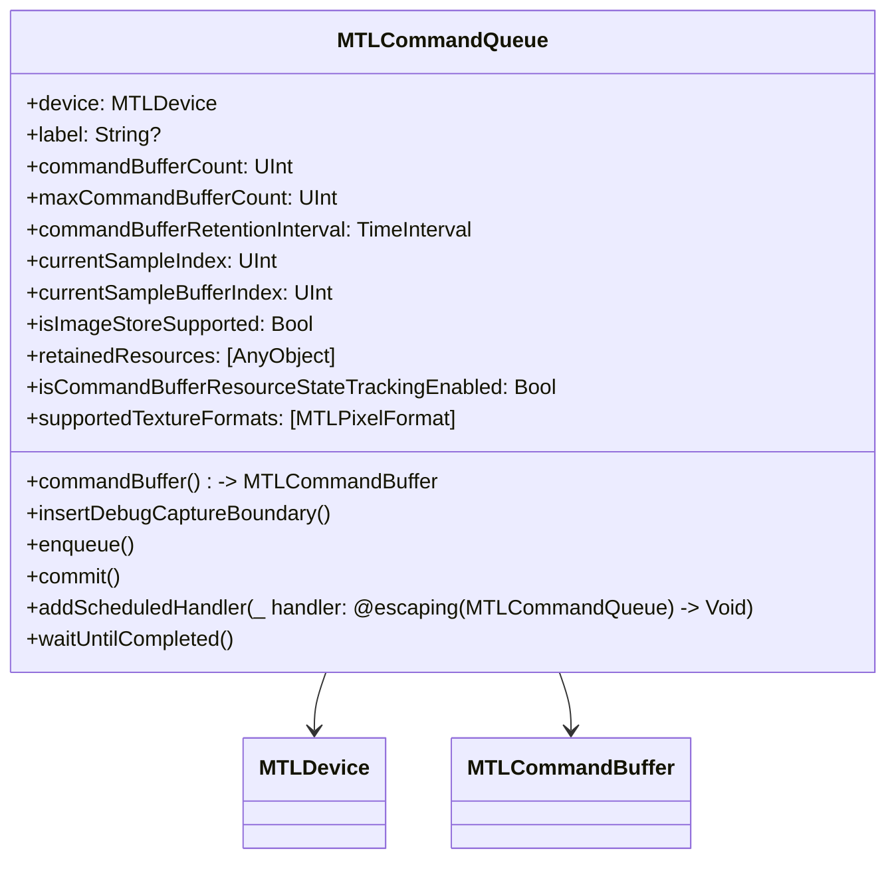

---

## **2. Initializers Overview**

### **a. Initialization Methods Diagram**
- **Purpose**: Break down the various ways to instantiate `MTLCommandQueue`.
- **Diagram Type**: `flowchart LR`
- **Contents**:
  - **Device-Based Initializers**: Typically instantiated via `MTLDevice`.
  - **Configuration Options**: Setting labels and other configurations post-initialization.

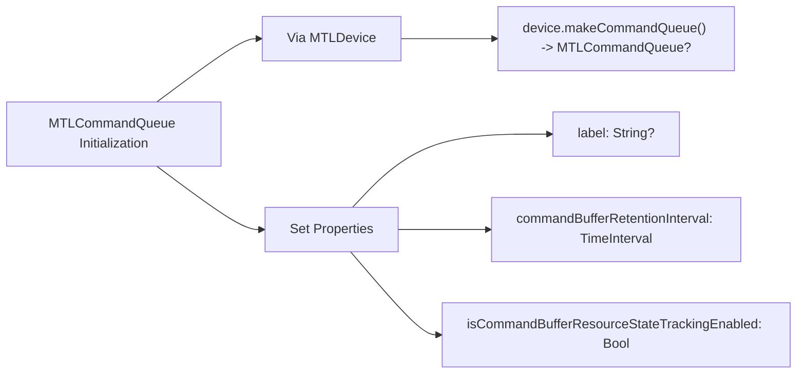

---

## **3. Properties Breakdown**

### **a. Key Properties Diagram**
- **Purpose**: Detail the main properties of `MTLCommandQueue`.
- **Diagram Type**: `graph LR`
- **Contents**:
  - **Device Association**
  - **Labeling and Identification**
  - **Command Buffer Management**
  - **Resource Tracking**
  - **Supported Formats**

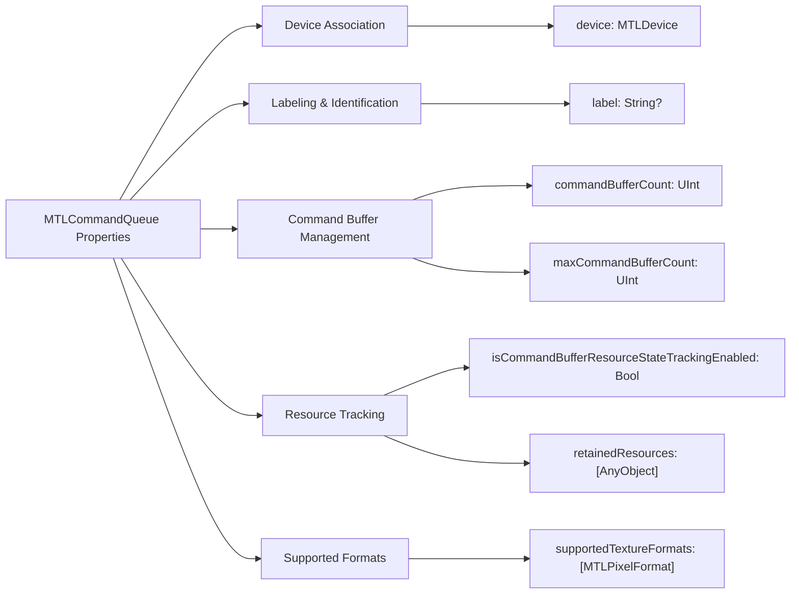

---

## **4. Methods Grouped by Functionality**

### **a. Command Buffer Management Methods**
- **Purpose**: Group methods related to creating and managing command buffers.
- **Diagram Type**: `flowchart TD`
- **Contents**:
  - **Creation**: `commandBuffer()`
  - **Boundary Insertion**: `insertDebugCaptureBoundary()`
  - **Enqueuing & Committing**: `enqueue()`, `commit()`
  - **Completion Handling**: `waitUntilCompleted()`

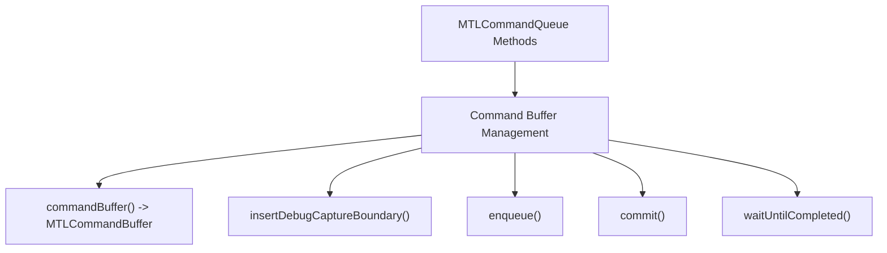

### **b. Scheduling & Handlers**
- **Purpose**: Categorize methods related to scheduling and handling command queue events.
- **Diagram Type**: `flowchart TD`
- **Contents**:
  - **Handlers**: `addScheduledHandler(_:)`

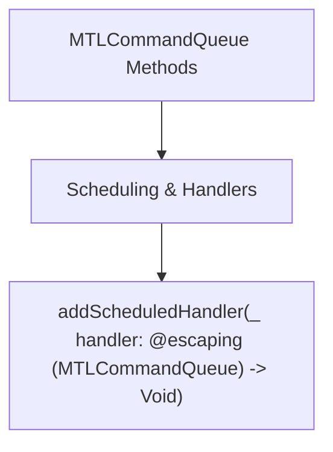

### **c. Profiling & Debugging**
- **Purpose**: Highlight methods used for profiling and debugging command queues.
- **Diagram Type**: `flowchart TD`
- **Contents**:
  - **Debug Boundaries**: `insertDebugCaptureBoundary()`

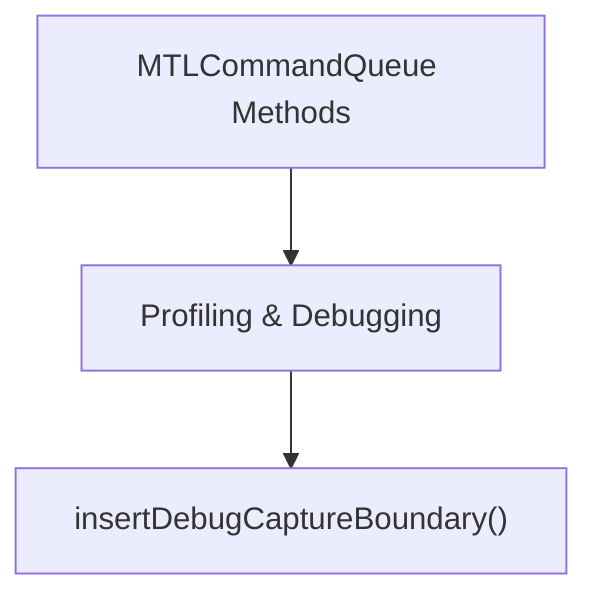

---

## **5. Enumerations and Configurations**

### **a. Enumerations Diagram**
- **Purpose**: Highlight any enums associated with `MTLCommandQueue` and their possible values.
- **Diagram Type**: `classDiagram`
- **Contents**:
  - **No specific enums**: `MTLCommandQueue` does not define its own enumerations but may use enums from related Metal classes.

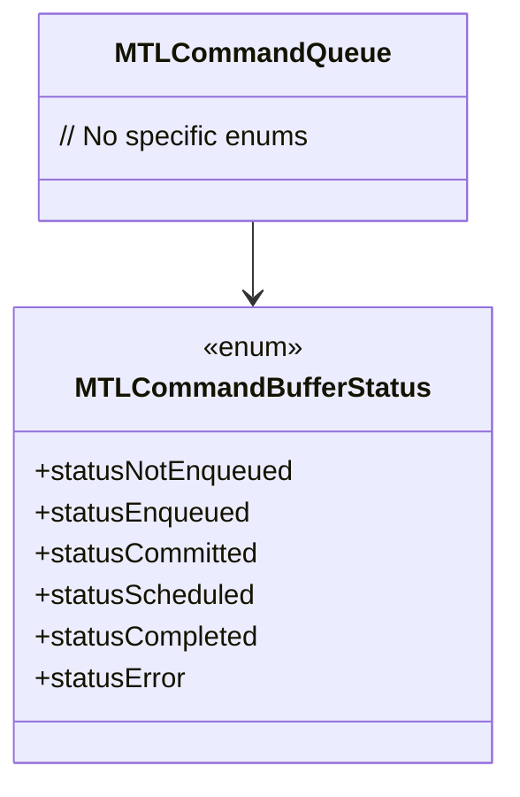

### **b. Configuration Classes Diagram**
- **Purpose**: Show the relationship between `MTLCommandQueue` and its configuration classes if any.
- **Diagram Type**: `classDiagram`
- **Contents**:
  - **No direct configuration classes**: Configuration is typically handled through properties and related Metal objects.

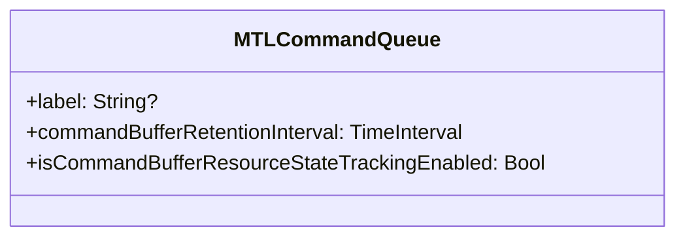

---

## **6. Protocol Conformances**

### **a. Protocols Diagram**
- **Purpose**: Display the protocols that `MTLCommandQueue` conforms to and their impact.
- **Diagram Type**: `classDiagram`
- **Contents**:
  - **NSObject**
  - **NSCopying**
  - **MTLResourceStateCommand**

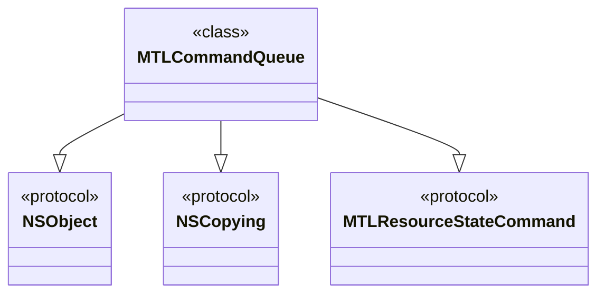

---

## **7. Relationships with Other Classes**

### **a. Related Classes Diagram**
- **Purpose**: Illustrate how `MTLCommandQueue` interacts with other Metal classes and frameworks.
- **Diagram Type**: `flowchart TD`
- **Contents**:
  - **MTLDevice**: The device associated with the command queue.
  - **MTLCommandBuffer**: Command buffers created from the queue.
  - **MTLCommandEncoder**: Encoders used within command buffers.
  - **MTLFence**: Synchronization fences.
  - **Metal Framework Components**: Interaction with shaders and pipelines.

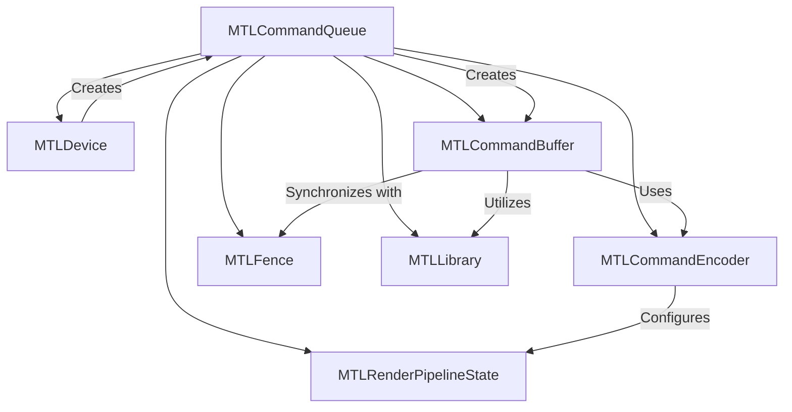

---

## **8. Extensions and Additional Functionalities**

### **a. MTLCommandQueue Extensions Diagram**
- **Purpose**: Showcase the additional functionalities provided through extensions.
- **Diagram Type**: `classDiagram`
- **Contents**:
  - **Debugging Extensions**
  - **Synchronization Extensions**

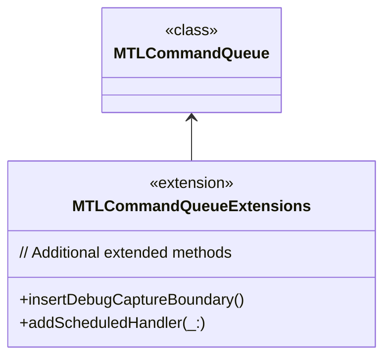

### **b. Extensions Functionalities Flowchart**
- **Purpose**: Detail specific extended methods and their purposes.
- **Diagram Type**: `flowchart LR`
- **Contents**:
  - **Debug Capture Boundaries**
  - **Scheduled Handlers**
  
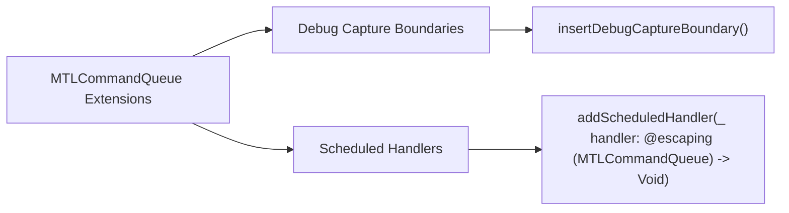

---

## **9. Lifecycle and Use Cases**

### **a. Lifecycle Flowchart**
- **Purpose**: Demonstrate the typical lifecycle of a `MTLCommandQueue` within an application.
- **Diagram Type**: `flowchart TD`
- **Contents**:
  - **Initialization**
  - **Command Buffer Creation**
  - **Encoding Commands**
  - **Submission**
  - **Execution**
  - **Completion**

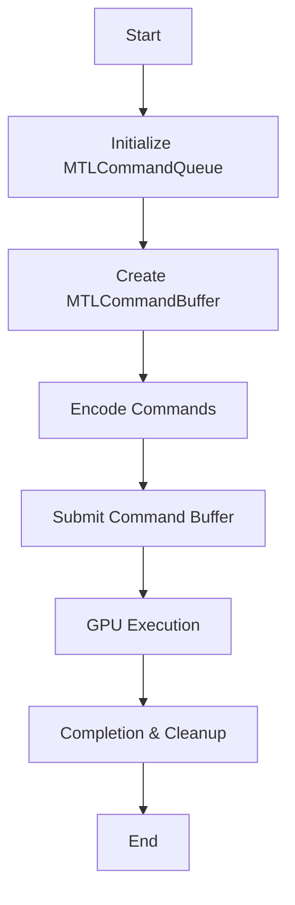

### **b. Common Use Cases Diagram**
- **Purpose**: Outline the typical scenarios where `MTLCommandQueue` is utilized.
- **Diagram Type**: `flowchart TD`
- **Contents**:
  - **Rendering Frames**
  - **Compute Operations**
  - **Resource Synchronization**
  - **Debugging GPU Commands**
  - **Profiling Performance**
  
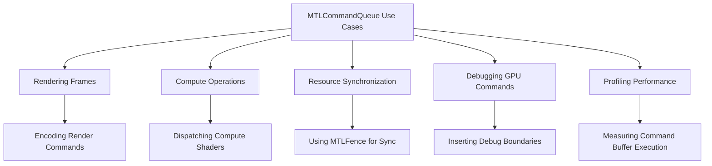

---

## **10. Feature Availability Timeline**

### **a. Feature Availability Gantt Chart**
- **Purpose**: Show when various `MTLCommandQueue` features were introduced across Metal versions and corresponding Apple platforms.
- **Diagram Type**: `gantt`
- **Contents**:
  - **Metal Versions**: Metal 1.0, Metal 2.0, Metal 3.0, etc.
  - **Features Introduced**: Command buffer retention, debug capture boundaries, scheduled handlers, etc.

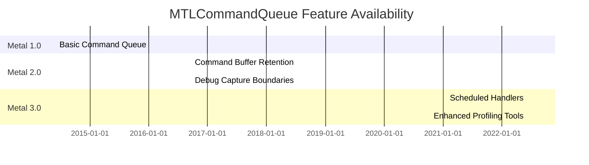

---

## **11. Data Handling and Formats**

### **a. Command Buffer Handling Diagram**
- **Purpose**: Explain how `MTLCommandQueue` manages different command buffer types and their formats.
- **Diagram Type**: `graph LR`
- **Contents**:
  - **Standard Command Buffers**
  - **Concurrent Command Buffers**
  - **Resource State Tracking**
  - **GPU-Driven Rendering**

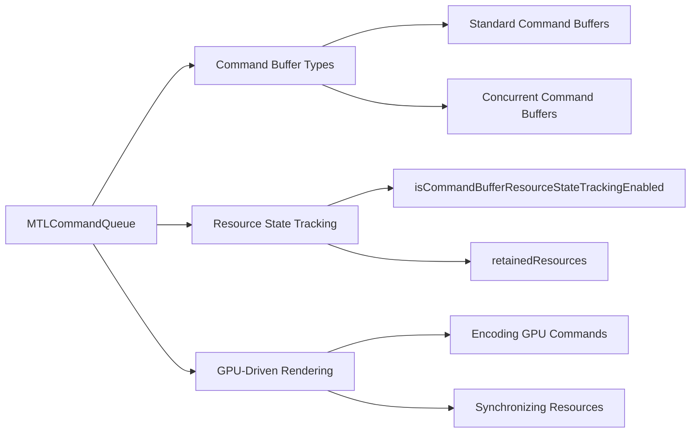

---

## **12. Integration with Rendering Pipelines**

### **a. Rendering Pipeline Integration Diagram**
- **Purpose**: Show how `MTLCommandQueue` integrates within the Metal rendering pipeline.
- **Diagram Type**: `flowchart TD`
- **Contents**:
  - **MTLDevice**
  - **MTLCommandQueue**
  - **MTLCommandBuffer**
  - **MTLRenderCommandEncoder**
  - **GPU Execution**

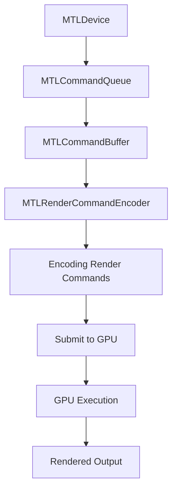

---

## **13. Summary and Best Practices**

### **a. Summary Diagram**
- **Purpose**: Provide a high-level overview of `MTLCommandQueue`'s key characteristics and functionalities.
- **Diagram Type**: `graph LR`
- **Contents**:
  - **Efficient Command Management**
  - **Robust Debugging Tools**
  - **Enhanced Performance Profiling**
  - **Seamless Integration with Metal Pipeline**
  - **Scalability and Flexibility**

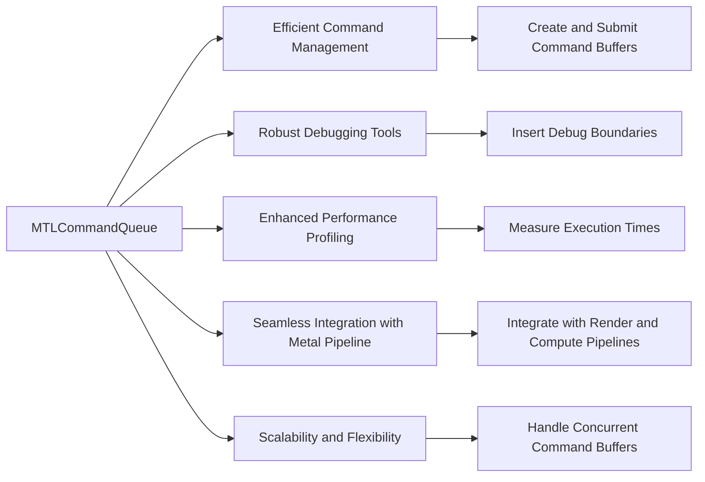

### **b. Best Practices Diagram**
- **Purpose**: Highlight best practices when using `MTLCommandQueue`.
- **Diagram Type**: `graph LR`
- **Contents**:
  - **Optimize Command Buffer Usage**
  - **Utilize Debugging Tools**
  - **Leverage Resource State Tracking**
  - **Profile and Monitor Performance**
  - **Manage Synchronization Efficiently**

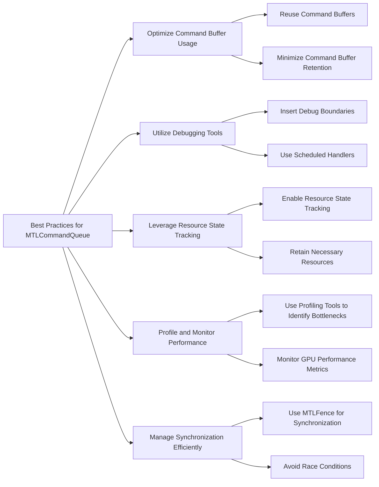

---

## **Conclusion**

The `MTLCommandQueue` is a pivotal class within the Metal framework, responsible for managing command buffers that encapsulate GPU commands. Proper understanding and utilization of its properties, methods, and integrations ensure efficient GPU operations, robust debugging, and optimal performance in graphics and compute-intensive applications.

**Best Practices Summary**:
- **Efficient Command Management**: Reuse command buffers and manage their retention wisely to optimize memory usage.
- **Robust Debugging**: Utilize debug capture boundaries and scheduled handlers to trace and debug GPU commands effectively.
- **Performance Profiling**: Regularly profile command queues to identify and mitigate performance bottlenecks.
- **Synchronization**: Implement synchronization mechanisms like `MTLFence` to ensure data consistency and prevent race conditions.
- **Resource Tracking**: Enable and leverage resource state tracking to manage resource dependencies and lifecycles efficiently.

By adhering to these practices and fully leveraging the capabilities of `MTLCommandQueue`, developers can harness the full power of Metal to create high-performance, GPU-accelerated applications.

---

Explore detailed information on complex processes and pipelines that integrate `MTLCommandQueue` in the documentation page section below: 

`Complexed-processes-in-Mermaid-diagrams/MTLCommandQueue_IntegrationWithMetalRenderingPipeline.md`