# MTLDevice
# 
Below is a set of Mermaid diagrams for the `MTLDevice` class. These diagrams encompass various aspects of the `MTLDevice` class, including its structure, methods, properties, protocol conformances, and relationships with other classes within the Metal framework.

---

## **1. Class Structure and Hierarchy**

### **a. Core Class Diagram**
- **Purpose**: Illustrate the primary structure of `MTLDevice`, including its properties, methods, and associated enumerations.
- **Diagram Type**: `classDiagram`
- **Contents**:
  - **Properties**: Key attributes like `name`, `registryID`, `lowPower`, etc.
  - **Methods**: Essential functions for resource creation, feature queries, etc.
  - **Enumerations**: Nested enums such as `FeatureSet`, `TriangleFillMode`, etc.

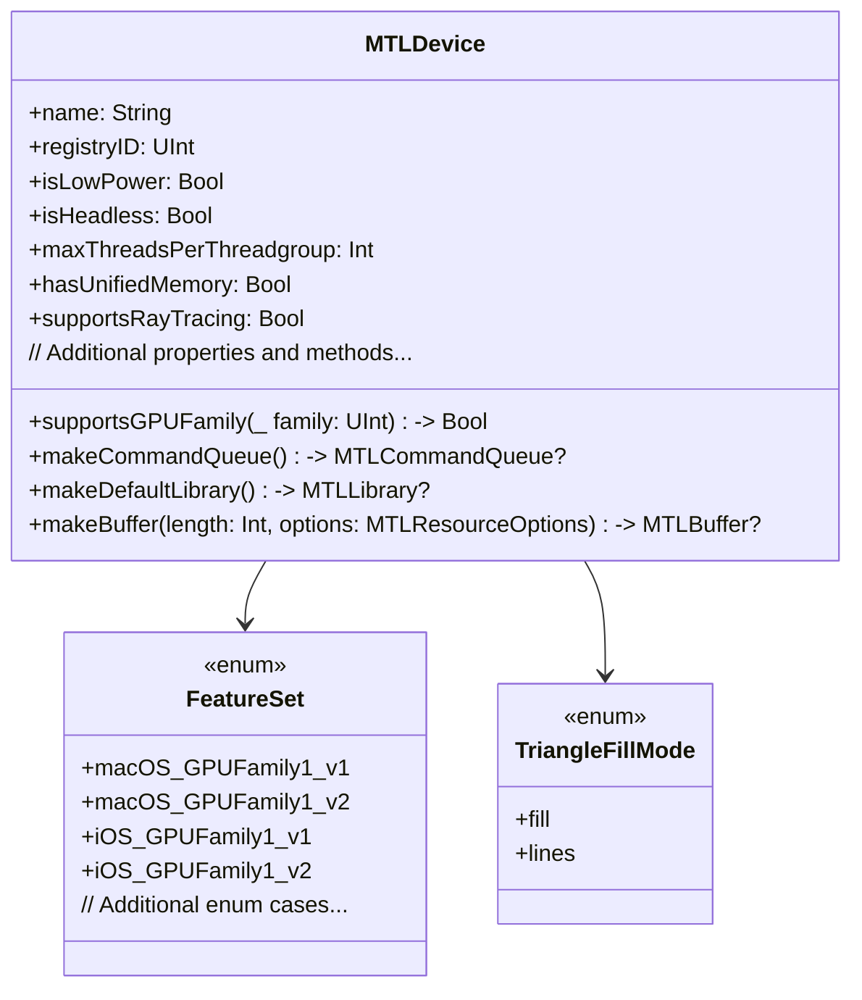

---

## **2. Initializers Overview**

### **a. Initialization Methods Diagram**
- **Purpose**: Break down the various ways to instantiate or obtain an `MTLDevice`.
- **Diagram Type**: `flowchart LR`
- **Contents**:
  - **Default Device**: `MTLCreateSystemDefaultDevice()`
  - **System Extensions**: `MTLDeviceSystemExtension`
  - **Headless Devices**: Devices without display attached
  - **Custom Device Creation**: Using private or specialized APIs

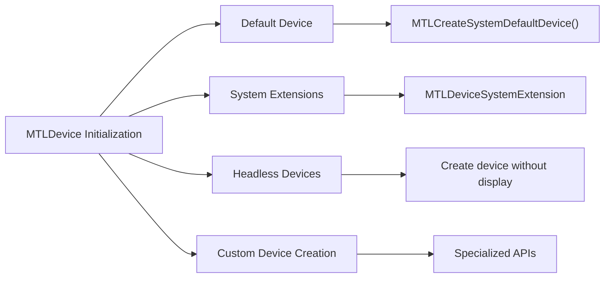

---

## **3. Properties Breakdown**

### **a. Key Properties Diagram**
- **Purpose**: Detail the main properties of `MTLDevice`.
- **Diagram Type**: `graph LR`
- **Contents**:
  - **Device Information**: `name`, `registryID`, `deviceType`
  - **Capabilities**: `isLowPower`, `isHeadless`, `supportsRayTracing`
  - **Memory & Performance**: `hasUnifiedMemory`, `maxThreadsPerThreadgroup`
  - **Feature Sets**: `preferredFeatureSet`

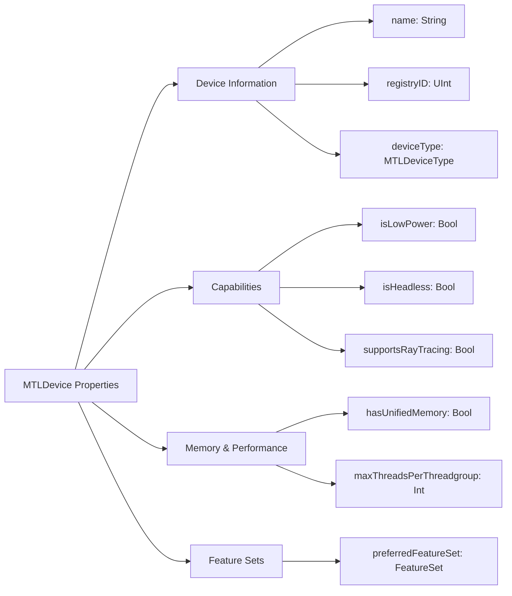

---

## **4. Methods Grouped by Functionality**

### **a. Resource Creation Methods**
- **Purpose**: Categorize methods based on their roles in creating Metal resources.
- **Diagram Type**: `flowchart TD`
- **Contents**:
  - **Command Queue Creation**: `makeCommandQueue()`
  - **Library Creation**: `makeDefaultLibrary()`, `makeLibrary(source:options:)`
  - **Buffer Creation**: `makeBuffer(length:options:)`, `makeBuffer(bytes:length:options:)`
  - **Texture Creation**: `makeTexture(descriptor:)`
  - **Sampler Creation**: `makeSamplerState(descriptor:)`
  - **Pipeline State Creation**: `makeRenderPipelineState(descriptor:)`

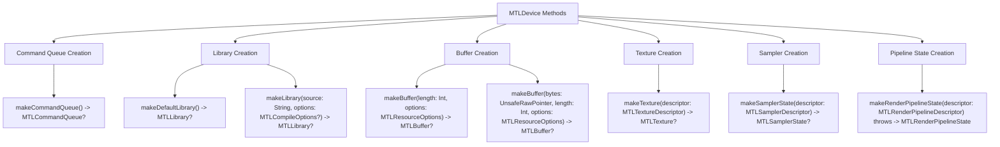

---

## **5. Enumerations and Configurations**

### **a. Enumerations Diagram**
- **Purpose**: Highlight the enums used within `MTLDevice` and their possible values.
- **Diagram Type**: `classDiagram`
- **Contents**:
  - **FeatureSet**
  - **TriangleFillMode**
  - **DeviceType**
  - **ResourceOptions**

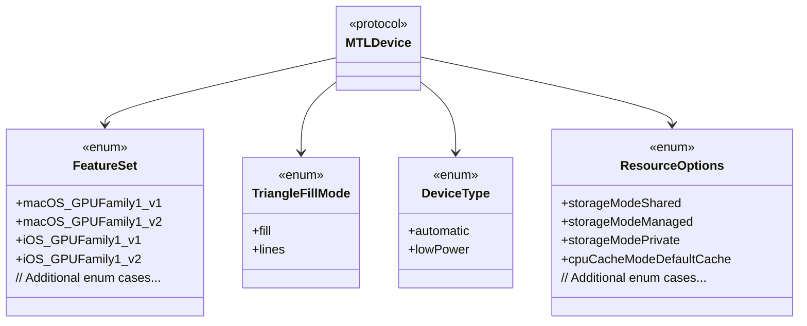

### **b. Configuration Classes Diagram**
- **Purpose**: Show the relationship between `MTLDevice` and its configuration classes.
- **Diagram Type**: `classDiagram`
- **Contents**:
  - **MTLCompileOptions**
  - **MTLRenderPipelineDescriptor**
  - **MTLTextureDescriptor**

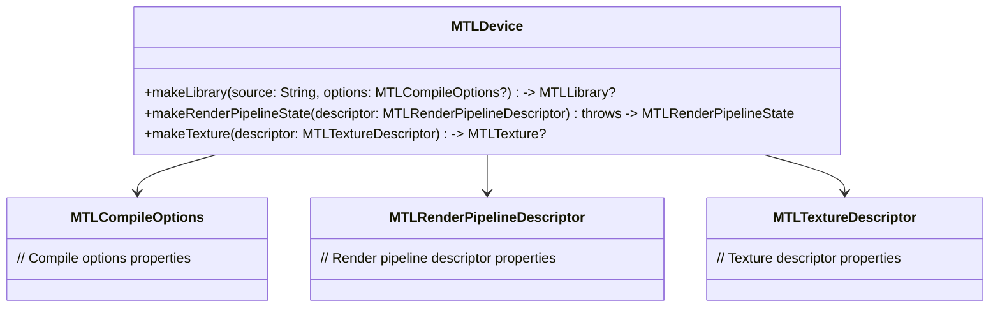

---

## **6. Protocol Conformances**

### **a. Protocols Diagram**
- **Purpose**: Display the protocols that `MTLDevice` conforms to and their impact.
- **Diagram Type**: `classDiagram`
- **Contents**:
  - **NSObject**
  - **NSCopying**
  - **MTLDevice**
  
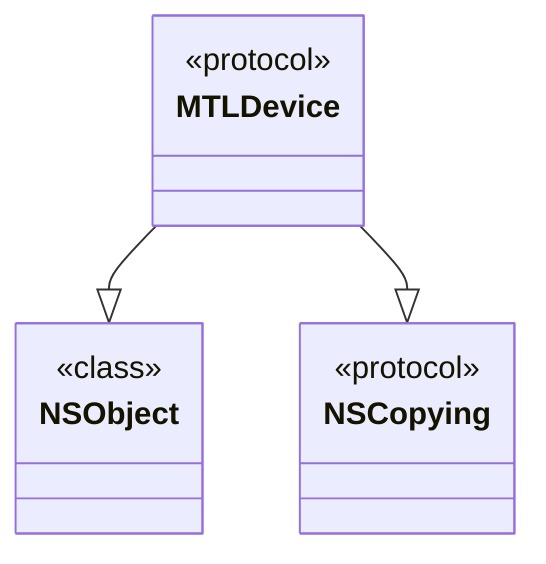

*Note: `MTLDevice` is primarily a protocol in the Metal framework. Concrete implementations like `MTLDeviceDefault` conform to these protocols.*

---

## **7. Relationships with Other Classes**

### **a. Related Classes Diagram**
- **Purpose**: Illustrate how `MTLDevice` interacts with other Metal classes and frameworks.
- **Diagram Type**: `flowchart TD`
- **Contents**:
  - **MTLCommandQueue**: Manages command buffers for execution.
  - **MTLLibrary**: Contains compiled shader functions.
  - **MTLBuffer**: Represents a memory buffer.
  - **MTLTexture**: Represents texture resources.
  - **MTLSamplerState**: Defines sampling behavior.
  - **MTLRenderPipelineState**: Configures the rendering pipeline.
  - **MTLCommandBuffer**: Encapsulates encoded GPU commands.
  - **MTLComputePipelineState**: Configures the compute pipeline.

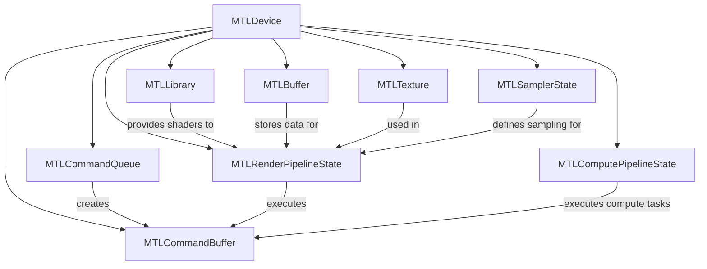

---

## **8. Extensions and Additional Functionalities**

### **a. MTLDevice Extensions Diagram**
- **Purpose**: Showcase the additional functionalities provided through extensions.
- **Diagram Type**: `classDiagram`
- **Contents**:
  - **Performance Enhancements**
  - **Debugging Tools**
  - **Resource Management**

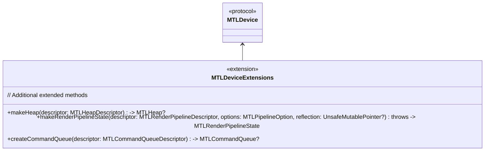

### **b. Extensions Functionalities Flowchart**
- **Purpose**: Detail specific extended methods and their purposes.
- **Diagram Type**: `flowchart LR`
- **Contents**:
  - **Heap Creation**
  - **Advanced Pipeline State**
  - **Custom Command Queues**

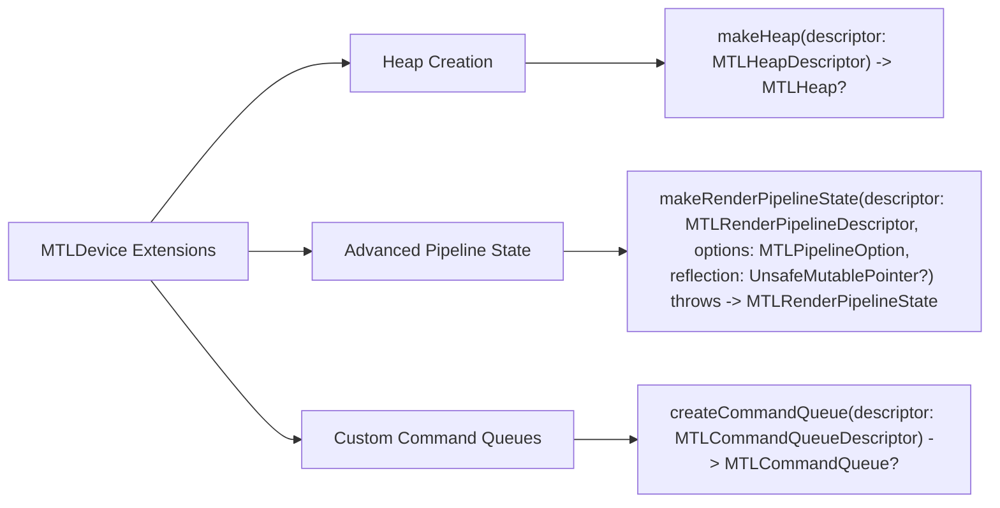

---

## **9. Lifecycle and Use Cases**

### **a. Lifecycle Flowchart**
- **Purpose**: Demonstrate the typical lifecycle of an `MTLDevice` within an application.
- **Diagram Type**: `flowchart TD`
- **Contents**:
  - **Device Initialization**
  - **Resource Creation**
  - **Command Encoding**
  - **Execution**
  - **Resource Management**
  - **Device Termination**

```mermaid
flowchart TD
    Start[Start] --> Init[Initialize MTLDevice]
    Init --> ResourceCreation[Create Resources (Buffers, Textures, etc.)]
    ResourceCreation --> CommandEncoding[Encode Commands into CommandBuffer]
    CommandEncoding --> Execution[Submit CommandBuffer to CommandQueue]
    Execution --> ResourceManagement[Manage Resources (Update, Delete)]
    ResourceManagement --> End[End]
```

### **b. Common Use Cases Diagram**
- **Purpose**: Outline the typical scenarios where `MTLDevice` is utilized.
- **Diagram Type**: `flowchart TD`
- **Contents**:
  - **Rendering Graphics**
  - **Performing Compute Tasks**
  - **Resource Management**
  - **Shader Compilation**
  - **Performance Profiling**
  - **Ray Tracing Operations**

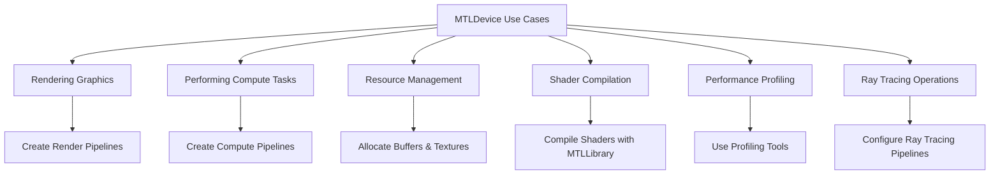

---

## **10. Feature Availability Timeline**

### **a. Feature Availability Gantt Chart**
- **Purpose**: Show when various `MTLDevice` features were introduced across Metal and iOS/macOS versions.
- **Diagram Type**: `gantt`
- **Contents**:
  - **Metal Versions**: Metal 1.0, 2.0, 3.0
  - **Features Introduced**: Basic device properties, compute pipelines, ray tracing support, etc.

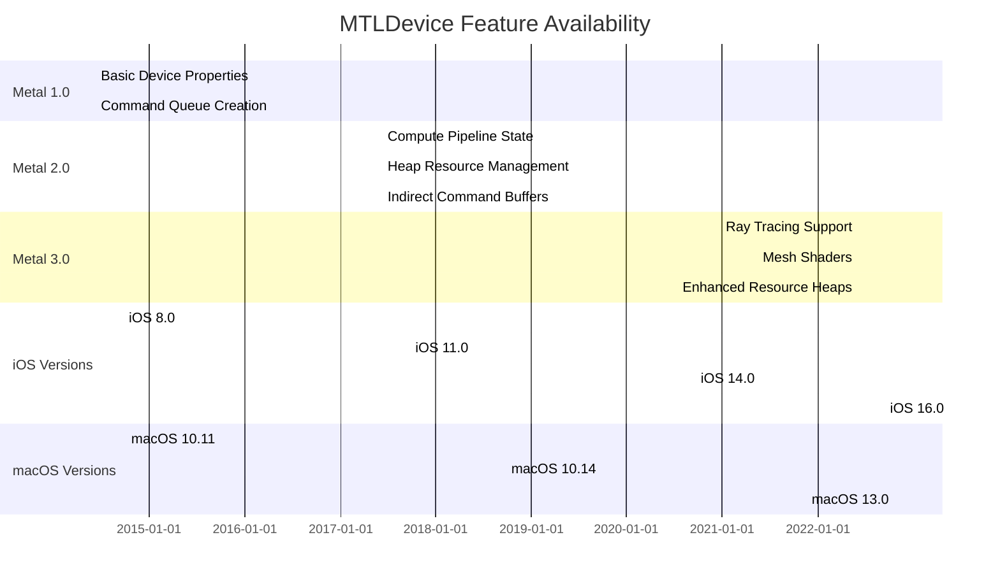

---

## **11. Data Handling and Formats**

### **a. Resource Data Formats Diagram**
- **Purpose**: Explain how `MTLDevice` handles different resource data formats.
- **Diagram Type**: `graph LR`
- **Contents**:
  - **Buffers**: `MTLBuffer` for vertex, index, and uniform data
  - **Textures**: `MTLTexture` with various pixel formats
  - **Samplers**: `MTLSamplerState` for texture sampling
  - **Render Pipelines**: `MTLRenderPipelineState` configurations

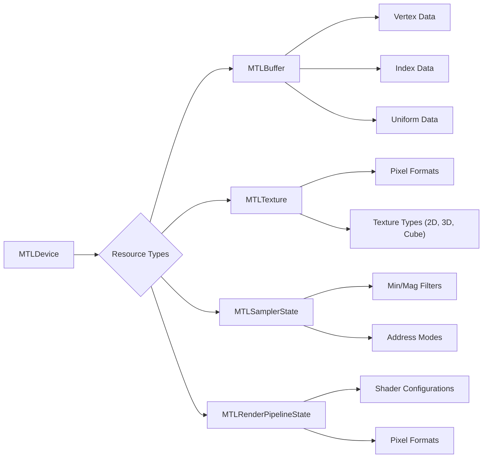

---

## **12. Integration with Rendering Pipelines**

### **a. Rendering Pipeline Methods Diagram**
- **Purpose**: Show how `MTLDevice` integrates with rendering pipelines.
- **Diagram Type**: `flowchart TD`
- **Contents**:
  - **Render Pipeline Creation**
  - **Shader Compilation**
  - **Pipeline State Management**
  - **Resource Binding**

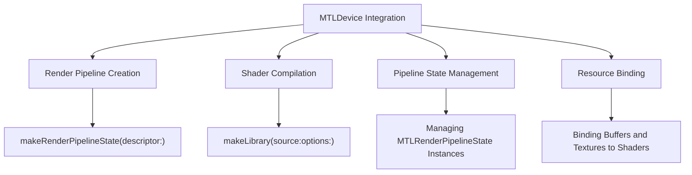

---

## **13. Summary and Best Practices**

### **a. Summary Diagram**
- **Purpose**: Provide a high-level overview of `MTLDevice`'s key characteristics and functionalities.
- **Diagram Type**: `graph LR`
- **Contents**:
  - **Versatile Resource Creation**
  - **Advanced Rendering Capabilities**
  - **Performance Optimizations**
  - **Ray Tracing Support**
  - **Seamless Integration with Metal Framework**

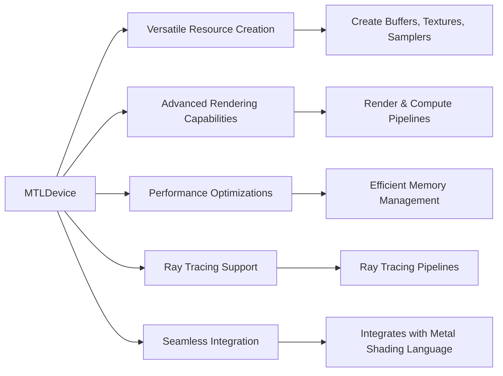

### **b. Best Practices Diagram**
- **Purpose**: Highlight best practices when using `MTLDevice`.
- **Diagram Type**: `graph TD`
- **Contents**:
  - **Efficient Resource Management**
  - **Optimize Pipeline State Creation**
  - **Leverage Feature Sets Appropriately**
  - **Utilize Profiling Tools**
  - **Stay Updated with Metal Versions**

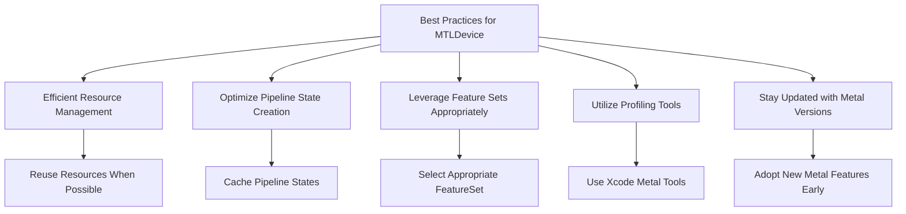

---

## **14. Protocols and Extensions**

### **a. Protocols Diagram**
- **Purpose**: Display additional protocols that `MTLDevice` interacts with.
- **Diagram Type**: `classDiagram`
- **Contents**:
  - **MTLResource**
  - **MTLSamplerState**
  - **MTLCommandQueue**

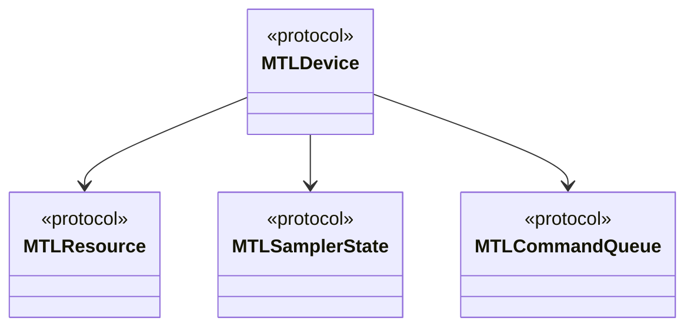

### **b. Extensions and Protocols Flowchart**
- **Purpose**: Illustrate how `MTLDevice` interacts with various protocols and their extensions.
- **Diagram Type**: `flowchart LR`
- **Contents**:
  - **Resource Creation Protocols**
  - **Shader Compilation Extensions**
  - **Debugging Protocols**

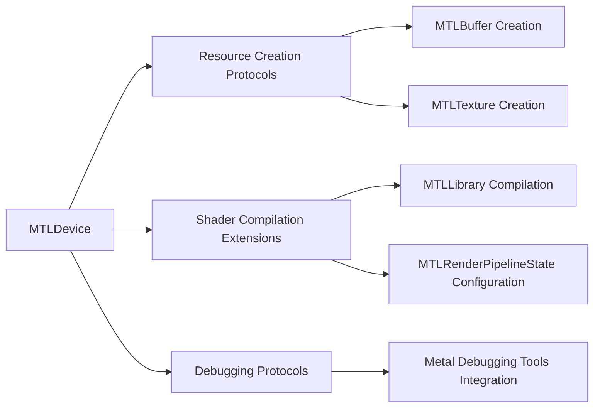

---

## **15. Error Handling and Debugging**

### **a. Error Handling Diagram**
- **Purpose**: Explain how `MTLDevice` methods handle errors.
- **Diagram Type**: `flowchart TD`
- **Contents**:
  - **Return Optional Objects**
  - **Throws Errors**
  - **Error Codes**
  - **Debugging Practices**

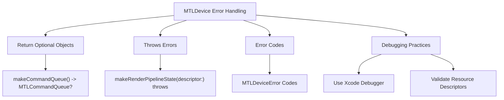

### **b. Debugging Practices Flowchart**
- **Purpose**: Outline best practices for debugging issues related to `MTLDevice`.
- **Diagram Type**: `flowchart LR`
- **Contents**:
  - **Use Xcode Metal Debugger**
  - **Validate Resource Creation Parameters**
  - **Check Feature Set Compatibility**
  - **Profile with Instruments**

```mermaid
flowchart LR
    A[Debugging MTLDevice Issues] --> B[Use Xcode Metal Debugger]
    A --> C[Validate Resource Creation Parameters]
    A --> D[Check Feature Set Compatibility]
    A --> E[Profile with Instruments]

    B --> B1["Inspect Command Queues"]
    B --> B2["Analyze Pipeline States"]

    C --> C1["Ensure Correct Descriptors"]
    C --> C2["Verify Resource Formats"]

    D --> D1["Match with Device FeatureSet"]
    D --> D2["Handle Unsupported Features Gracefully"]

    E --> E1["Identify Performance Bottlenecks"]
    E --> E2["Detect Memory Leaks"]
```

---

## **16. Advanced Features and Extensions**

### **a. Ray Tracing Integration Diagram**
- **Purpose**: Showcase how `MTLDevice` integrates with Metal's ray tracing capabilities.
- **Diagram Type**: `flowchart TD`
- **Contents**:
  - **Ray Tracing Pipelines**
  - **Acceleration Structures**
  - **Shader Libraries for Ray Tracing**
  - **Resource Binding for Ray Tracing**

```mermaid
flowchart TD
    A[MTLDevice Ray Tracing Integration] --> B[Ray Tracing Pipelines]
    A --> C[Acceleration Structures]
    A --> D[Shader Libraries for Ray Tracing]
    A --> E[Resource Binding for Ray Tracing]

    B --> B1["Create MTLRenderPipelineState for Ray Tracing"]
    C --> C1["Build and Manage Acceleration Structures"]
    D --> D1["Compile Ray Tracing Shaders with MTLLibrary"]
    E --> E1["Bind Buffers and Textures to Ray Tracing Shaders"]
```

### **b. Machine Learning Support Diagram**
- **Purpose**: Illustrate how `MTLDevice` supports Metal Performance Shaders and machine learning tasks.
- **Diagram Type**: `flowchart LR`
- **Contents**:
  - **Metal Performance Shaders (MPS)**
  - **Neural Network Framework Integration**
  - **Resource Allocation for ML Tasks**
  - **Performance Optimization for ML**

```mermaid
flowchart LR
    A[MTLDevice ML Support] --> B["Metal Performance Shaders (MPS)"]
    A --> C[Neural Network Framework Integration]
    A --> D[Resource Allocation for ML Tasks]
    A --> E[Performance Optimization for ML]

    B --> B1["Use MPS for Accelerated Operations"]
    C --> C1["Integrate with Core ML"]
    D --> D1["Allocate Buffers for Model Weights"]
    E --> E1["Optimize Memory and Compute Usage"]
```

---

## **17. Security and Privacy Considerations**

### **a. Security Best Practices Diagram**
- **Purpose**: Highlight security considerations when using `MTLDevice`.
- **Diagram Type**: `graph TD`
- **Contents**:
  - **Resource Validation**
  - **Access Permissions**
  - **Data Protection**
  - **Secure Shader Compilation**

```mermaid
graph TD
    A[MTLDevice Security Practices] --> B[Resource Validation]
    A --> C[Access Permissions]
    A --> D[Data Protection]
    A --> E[Secure Shader Compilation]

    B --> B1["Validate Descriptor Parameters"]
    C --> C1["Restrict Access to Secure Resources"]
    D --> D1["Encrypt Sensitive Data Buffers"]
    E --> E1["Compile Shaders in Secure Environment"]
```

### **b. Privacy Considerations Flowchart**
- **Purpose**: Outline privacy considerations related to GPU resource usage.
- **Diagram Type**: `flowchart LR`
- **Contents**:
  - **User Data Handling**
  - **Consent for Data Processing**
  - **Secure Data Transmission**
  - **Compliance with Privacy Laws**

```mermaid
flowchart LR
    A[MTLDevice Privacy Considerations] --> B[User Data Handling]
    A --> C[Consent for Data Processing]
    A --> D[Secure Data Transmission]
    A --> E[Compliance with Privacy Laws]

    B --> B1["Handle User-Generated Data Securely"]
    C --> C1["Obtain Explicit Consent for Processing"]
    D --> D1["Encrypt Data During Transmission"]
    E --> E1["Adhere to GDPR, CCPA, etc."]
```

---

## **18. Cross-Platform Considerations**

### **a. macOS and iOS Integration Diagram**
- **Purpose**: Illustrate how `MTLDevice` operates across different Apple platforms.
- **Diagram Type**: `flowchart TD`
- **Contents**:
  - **Platform-Specific Features**
  - **Unified Resource Management**
  - **Shader Compatibility**
  - **Performance Optimization per Platform**

```mermaid
flowchart TD
    A[MTLDevice Cross-Platform Integration] --> B[Platform-Specific Features]
    A --> C[Unified Resource Management]
    A --> D[Shader Compatibility]
    A --> E[Performance Optimization per Platform]

    B --> B1["macOS: Advanced GPU Features"]
    B --> B2["iOS: Mobile GPU Constraints"]

    C --> C1["Shared Resource Creation Methods"]
    C --> C2["Consistent Shader Interfaces"]

    D --> D1["Cross-Platform Shaders"]
    D --> D2["Adaptation to GPU Differences"]

    E --> E1["Optimize for Desktop Performance"]
    E --> E2["Optimize for Mobile Efficiency"]
```

---

## **19. Versioning and Deprecations**

### **a. Versioning Diagram**
- **Purpose**: Track changes and deprecations in the `MTLDevice` class across Metal versions.
- **Diagram Type**: `gantt`
- **Contents**:
  - **Metal 1.0**: Initial `MTLDevice` features
  - **Metal 2.0**: Introduction of Compute Pipelines
  - **Metal 3.0**: Ray Tracing and Mesh Shaders
  - **Deprecations**: Deprecated methods and properties

```mermaid
gantt
    dateFormat  YYYY-MM-DD
    title MTLDevice Versioning and Deprecations

    section Metal 1.0
    Initial MTLDevice Features            :done, des1, 2014-06-05, 2014-06-05

    section Metal 2.0
    Compute Pipelines Introduction        :done, des2, 2017-06-05, 2017-06-05
    Heap Resource Management Added        :done, des3, 2017-06-05, 2017-06-05

    section Metal 3.0
    Ray Tracing Support Introduced        :done, des4, 2022-06-05, 2022-06-05
    Mesh Shaders Added                    :done, des5, 2022-06-05, 2022-06-05

    section Deprecations
    Deprecated makeDefaultLibrary()        :des6, 2023-01-01, 2023-12-31
    Deprecated someOldMethod()             :des7, 2023-01-01, 2023-12-31
```

---

## **20. Performance Optimization Techniques**

### **a. Optimization Techniques Diagram**
- **Purpose**: Highlight techniques to optimize GPU performance using `MTLDevice`.
- **Diagram Type**: `graph TD`
- **Contents**:
  - **Efficient Memory Usage**
  - **Pipeline State Caching**
  - **Asynchronous Resource Loading**
  - **Minimize State Changes**
  - **Leverage GPU Profiling Tools**

```mermaid
graph TD
    A[Performance Optimization] --> B[Efficient Memory Usage]
    A --> C[Pipeline State Caching]
    A --> D[Asynchronous Resource Loading]
    A --> E[Minimize State Changes]
    A --> F[Leverage GPU Profiling Tools]

    B --> B1["Use Shared Memory Appropriately"]
    C --> C1["Cache MTLRenderPipelineState Instances"]
    D --> D1["Load Resources on Background Threads"]
    E --> E1["Batch Draw Calls"]
    F --> F1["Use Xcode Instruments for Profiling"]
```

### **b. Memory Management Flowchart**
- **Purpose**: Illustrate best practices for managing memory with `MTLDevice`.
- **Diagram Type**: `flowchart LR`
- **Contents**:
  - **Allocate Adequate Buffers**
  - **Avoid Memory Leaks**
  - **Use Resource Heaps Efficiently**
  - **Optimize Texture Memory**

```mermaid
flowchart LR
    A[Memory Management with MTLDevice] --> B[Allocate Adequate Buffers]
    A --> C[Avoid Memory Leaks]
    A --> D[Use Resource Heaps Efficiently]
    A --> E[Optimize Texture Memory]

    B --> B1["Determine Buffer Sizes Accurately"]
    C --> C1["Release Unused Resources"]
    D --> D1["Reuse Resource Heaps for Multiple Resources"]
    E --> E1["Use Compressed Texture Formats"]
```

---

## **21. Testing and Validation**

### **a. Testing Strategies Diagram**
- **Purpose**: Outline strategies for testing `MTLDevice` related functionalities.
- **Diagram Type**: `flowchart TD`
- **Contents**:
  - **Unit Testing Resource Creation**
  - **Integration Testing Pipelines**
  - **Performance Benchmarking**
  - **Automated Shader Testing**

```mermaid
flowchart TD
    A[Testing Strategies for MTLDevice] --> B[Unit Testing Resource Creation]
    A --> C[Integration Testing Pipelines]
    A --> D[Performance Benchmarking]
    A --> E[Automated Shader Testing]

    B --> B1["Test Buffer and Texture Creation Methods"]
    C --> C1["Validate Render and Compute Pipelines"]
    D --> D1["Benchmark Resource Allocation and Rendering Speed"]
    E --> E1["Automate Shader Compilation and Execution Tests"]
```

### **b. Validation Flowchart**
- **Purpose**: Detail steps to validate Metal resources and pipelines.
- **Diagram Type**: `flowchart LR`
- **Contents**:
  - **Descriptor Validation**
  - **Shader Validation**
  - **Pipeline State Validation**
  - **Runtime Checks**

```mermaid
flowchart LR
    A[Validation Steps] --> B[Descriptor Validation]
    A --> C[Shader Validation]
    A --> D[Pipeline State Validation]
    A --> E[Runtime Checks]

    B --> B1["Ensure Correct Descriptor Parameters"]
    C --> C1["Compile and Validate Shaders"]
    D --> D1["Validate Render/Compute Pipeline States"]
    E --> E1["Monitor Resource Usage at Runtime"]
```

---

## **22. Documentation and Learning Resources**

### **a. Documentation Flowchart**
- **Purpose**: Provide a roadmap for learning and referencing `MTLDevice` functionalities.
- **Diagram Type**: `flowchart LR`
- **Contents**:
  - **Apple Developer Documentation**
  - **Metal Programming Guide**
  - **WWDC Sessions**
  - **Community Tutorials and Blogs**
  - **Sample Projects**

```mermaid
flowchart LR
    A[Learning Resources for MTLDevice] --> B[Apple Developer Documentation]
    A --> C[Metal Programming Guide]
    A --> D[WWDC Sessions]
    A --> E[Community Tutorials and Blogs]
    A --> F[Sample Projects]

    B --> B1["Official MTLDevice API Reference"]
    C --> C1["Comprehensive Metal Programming Guide"]
    D --> D1["WWDC Talks on Metal advancements"]
    E --> E1["Tutorials on ray tracing, compute shaders"]
    F --> F1["Apple Sample Metal Projects"]
```

### **b. Documentation Links Diagram**
- **Purpose**: Provide direct references to essential `MTLDevice` documentation.
- **Diagram Type**: `flowchart TB`
- **Contents**:
  - **Apple Official Docs**
  - **Metal Shading Language Guide**
  - **WWDC Metal Sessions**
  - **Third-Party Tutorials**

```mermaid
flowchart TB
    A[MTLDevice Documentation Links] --> B[Apple Official Docs]
    A --> C[Metal Shading Language Guide]
    A --> D[WWDC Metal Sessions]
    A --> E[Third-Party Tutorials]

    B --> B1["https://developer.apple.com/documentation/metal/mtldevice"]
    C --> C1["https://developer.apple.com/metal/shading-language-guide"]
    D --> D1["https://developer.apple.com/videos/play/wwdc2023/"]
    E --> E1["https://www.raywenderlich.com/metal"]
```

---

## **23. Conclusion**

The `MTLDevice` class serves as the cornerstone of the Metal framework, providing the necessary interfaces to interact with the GPU for high-performance graphics rendering and compute tasks. By understanding its structure, methods, properties, and best practices, developers can leverage Metal's full potential to create advanced and efficient applications across Apple's platforms.

---

## **24. Additional Resources**

### **a. Sample Code Diagram**
- **Purpose**: Showcase how `MTLDevice` is utilized in a simple Metal application.
- **Diagram Type**: `flowchart LR`
- **Contents**:
  - **Device Initialization**
  - **Command Queue Creation**
  - **Buffer Creation**
  - **Render Pipeline Setup**

```mermaid
flowchart LR
    A[Sample Metal Application] --> B[Initialize MTLDevice]
    A --> C[Create MTLCommandQueue]
    A --> D[Create MTLBuffer]
    A --> E[Setup MTLRenderPipelineState]

    B --> B1["let device = MTLCreateSystemDefaultDevice()"]
    C --> C1["let commandQueue = device.makeCommandQueue()"]
    D --> D1["let buffer = device.makeBuffer(length: 1024, options: [])"]
    E --> E1["Configure MTLRenderPipelineDescriptor"]
    E --> E2["let pipelineState = try device.makeRenderPipelineState(descriptor: descriptor)"]
```

### **b. Error Handling Code Diagram**
- **Purpose**: Illustrate how to handle errors during pipeline state creation.
- **Diagram Type**: `flowchart TD`
- **Contents**:
  - **Attempt Pipeline State Creation**
  - **Catch and Handle Errors**
  - **Log Error Details**

```mermaid
flowchart TD
    A[Attempt Pipeline State Creation] --> B{Try to Create Pipeline}
    B --> C[Success: Use pipelineState]
    B --> D[Failure: Catch Error]
    D --> E[Handle Error]
    E --> F[Log Error Details]

    C --> G[Render Graphics]
    F --> G
```

---

By utilizing these Mermaid diagrams, you can gain a comprehensive understanding of the `MTLDevice` class, facilitating better design, implementation, and optimization of Metal-based applications.


----
