# Maps by Apple

Below is a comprehensive and organized set of Mermaid diagrams for the `Apple Maps` framework. These diagrams cover various aspects of the Apple Maps framework, including class structures, initializers, properties, methods, enumerations, protocol conformances, relationships with other classes, extensions, lifecycle, feature timeline, data handling, integration with drawing contexts, and best practices.

---

## **1. Class Structure and Hierarchy**

### **a. Core Class Diagram**
- **Purpose**: Illustrate the primary structure of `MKMapView`, including its properties, methods, and enumerations.
- **Diagram Type**: `classDiagram`
- **Contents**:
  - **Properties**: Key attributes like `delegate`, `region`, `zoomLevel`, etc.
  - **Methods**: Essential functions like `setRegion()`, `addAnnotation()`, `removeOverlay()`, etc.
  - **Enumerations**: Nested enums such as `MapType`, `CameraMode`, `UserTrackingMode`.

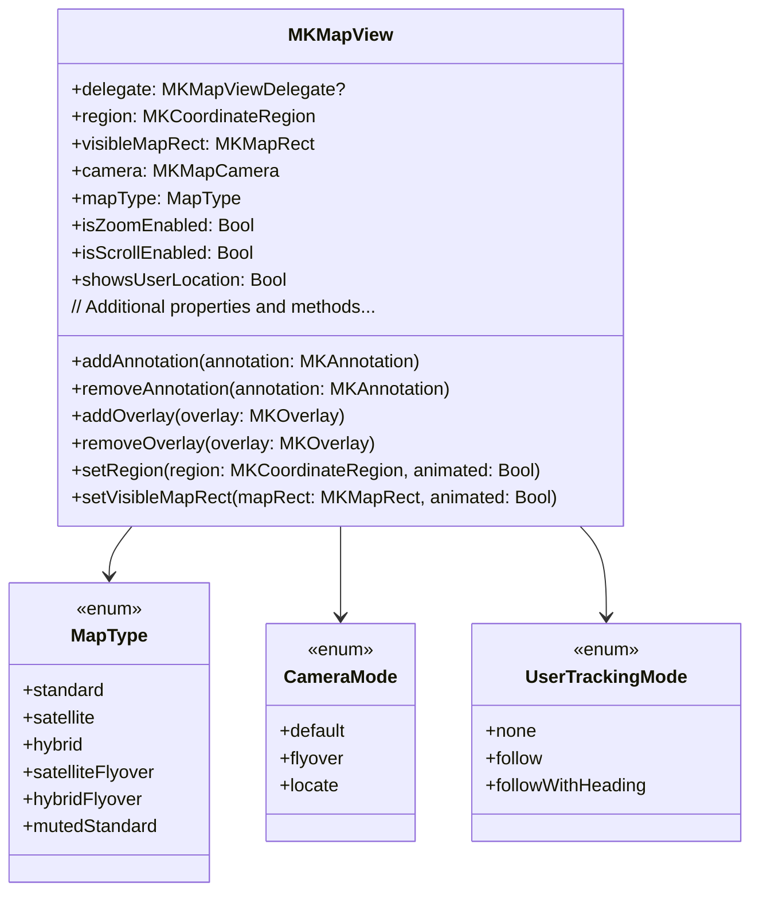

---

## **2. Initializers Overview**

### **a. Initialization Methods Diagram**
- **Purpose**: Break down the various ways to instantiate `MKMapView`.
- **Diagram Type**: `flowchart LR`
- **Contents**:
  - **Programmatic Initializers**: `init(frame:)`, `init(coder:)`
  - **Storyboard/XIB Initializers**: `init?(coder:)`
  - **Custom Configuration Initializers**: Setting initial region, camera, map type.

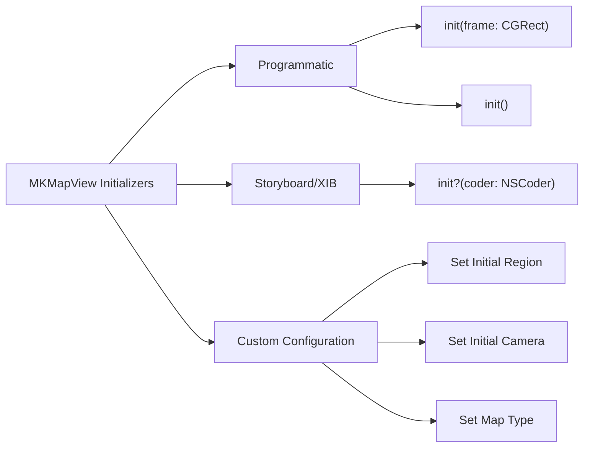

---

## **3. Properties Breakdown**

### **a. Key Properties Diagram**
- **Purpose**: Detail the main properties of `MKMapView`.
- **Diagram Type**: `graph LR`
- **Contents**:
  - **Map Configuration**: `mapType`, `region`, `visibleMapRect`, `camera`
  - **User Interaction**: `isZoomEnabled`, `isScrollEnabled`, `isRotateEnabled`, `showsUserLocation`, `userTrackingMode`
  - **Appearance**: `tintColor`, `pointOfInterestFilter`
  - **Overlays & Annotations**: `annotations`, `overlays`
  - **Delegate & Data Sources**: `delegate`

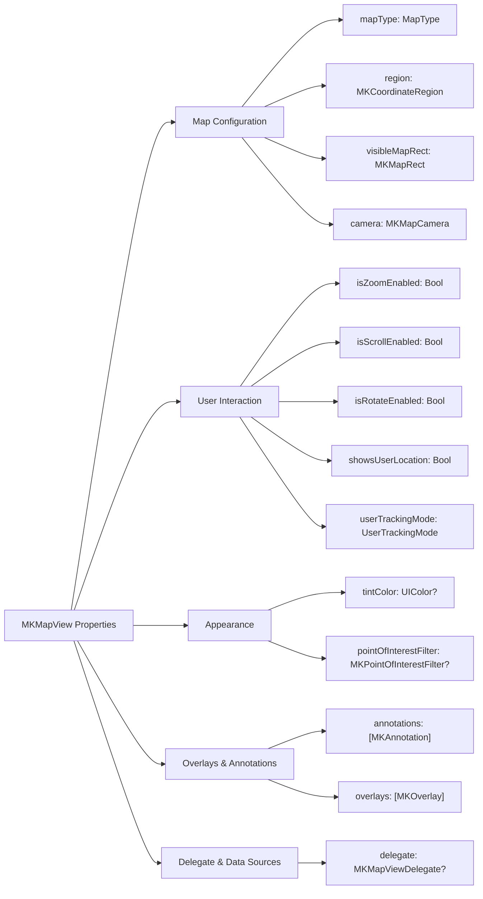


---

## **4. Methods Grouped by Functionality**

### **a. Map Display Methods**
- **Purpose**: Categorize methods based on their roles in map display and configuration.
- **Diagram Type**: `flowchart TD`
- **Contents**:
  - **Region Management**: `setRegion()`, `setVisibleMapRect()`
  - **Camera Management**: `setCamera()`, `animate(to:)`
  - **Annotation Management**: `addAnnotation()`, `removeAnnotation()`, `selectAnnotation()`
  - **Overlay Management**: `addOverlay()`, `removeOverlay()`, `renderer(for:)`
  - **User Tracking**: `setUserTrackingMode()`

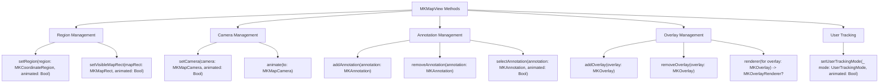

---

## **5. Enumerations and Configurations**

### **a. Enumerations Diagram**
- **Purpose**: Highlight the enums used within `MKMapView` and their possible values.
- **Diagram Type**: `classDiagram`
- **Contents**:
  - **MapType**
  - **UserTrackingMode**
  - **CameraMode**

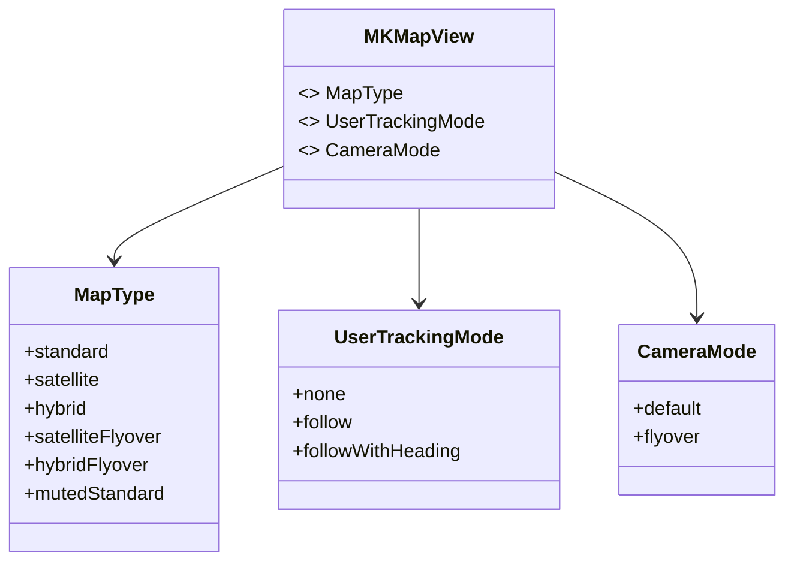

### **b. Configuration Classes Diagram**
- **Purpose**: Show the relationship between `MKMapView` and its configuration classes.
- **Diagram Type**: `classDiagram`
- **Contents**:
  - **MKMapCamera**
  - **MKCoordinateRegion**
  - **MKPointOfInterestFilter**

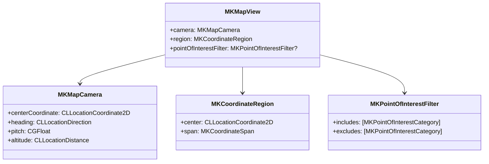

---

## **6. Protocol Conformances**

### **a. Protocols Diagram**
- **Purpose**: Display the protocols that `MKMapView` conforms to and their impact.
- **Diagram Type**: `classDiagram`
- **Contents**:
  - **MKOverlay**
  - **MKAnnotation**
  - **NSSecureCoding**
  - **MKMapViewDelegate**

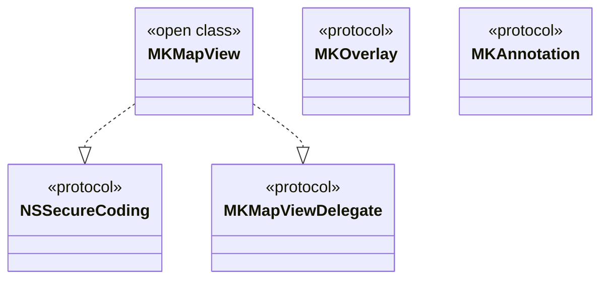

---

## **7. Relationships with Other Classes**

### **a. Related Classes Diagram**
- **Purpose**: Illustrate how `MKMapView` interacts with other UIKit classes and frameworks.
- **Diagram Type**: `flowchart TD`
- **Contents**:
  - **MKAnnotationView**: Represents annotations on the map.
  - **MKOverlayRenderer**: Renders overlays on the map.
  - **CLLocationManager**: Manages location-related events.
  - **UIViewController**: Hosts `MKMapView`.
  - **UISearchController**: Integrates search functionalities.
  - **MKLocalSearch**: Handles local search queries.
  - **MKDirections**: Provides routing and directions.

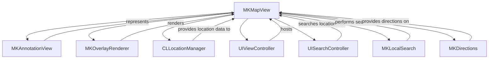

---

## **8. Extensions and Additional Functionalities**

### **a. MKMapView Extensions Diagram**
- **Purpose**: Showcase the additional functionalities provided through extensions.
- **Diagram Type**: `classDiagram`
- **Contents**:
  - **Gesture Recognizers**
  - **Custom Annotation Views**
  - **Map Snapshotting**

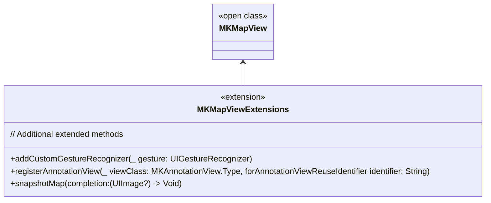

### **b. Extensions Functionalities Flowchart**
- **Purpose**: Detail specific extended methods and their purposes.
- **Diagram Type**: `flowchart LR`
- **Contents**:
  - **Gesture Recognizers**
  - **Custom Annotation Views**
  - **Map Snapshotting**

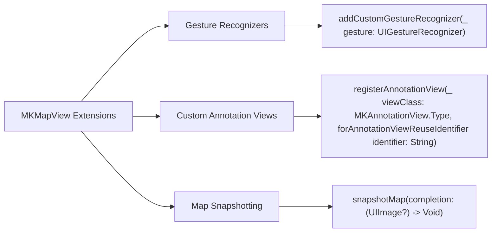

---

## **9. Lifecycle and Use Cases**

### **a. Lifecycle Flowchart**
- **Purpose**: Demonstrate the typical lifecycle of an `MKMapView` within an application.
- **Diagram Type**: `flowchart TD`
- **Contents**:
  - **Initialization**
  - **Configuration**
  - **Display**
  - **User Interaction**
  - **Updating Content**
  - **Cleanup**

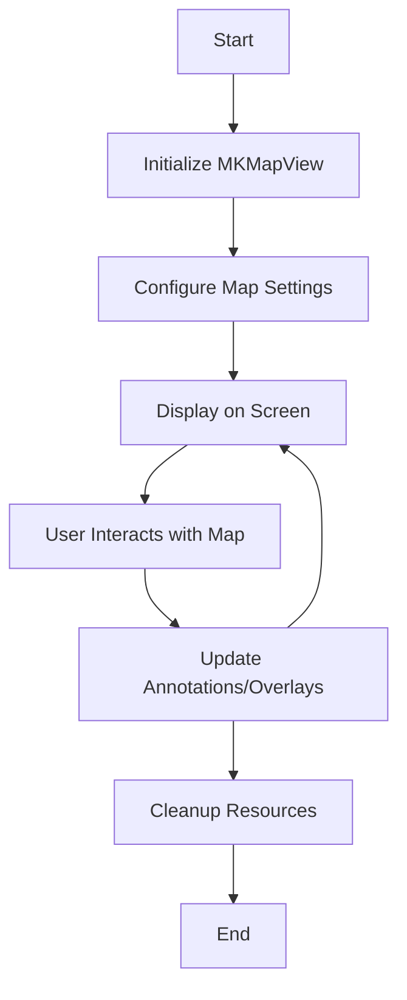

### **b. Common Use Cases Diagram**
- **Purpose**: Outline the typical scenarios where `MKMapView` is utilized.
- **Diagram Type**: `flowchart TD`
- **Contents**:
  - **Displaying Locations**
  - **Providing Directions**
  - **Annotating Points of Interest**
  - **Overlaying Custom Graphics**
  - **Tracking User Location**
  - **Performing Local Searches**
  - **Snapshotting Maps**

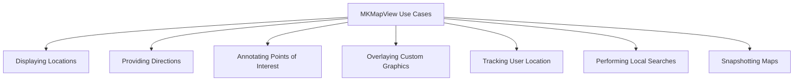

---

## **10. Feature Availability Timeline**

### **a. Feature Availability Gantt Chart**
- **Purpose**: Show when various `MKMapView` features were introduced across iOS versions.
- **Diagram Type**: `gantt`
- **Contents**:
  - **iOS Versions**: 3.0, 4.0, 5.0, 6.0, 7.0, 8.0, 10.0, 11.0, 12.0, 13.0, 14.0, 15.0, 16.0, 17.0
  - **Features Introduced**: Basic map display, user tracking, 3D Flyover, Custom Overlays, Clustering, Map Snapshotting, Enhanced Search, etc.

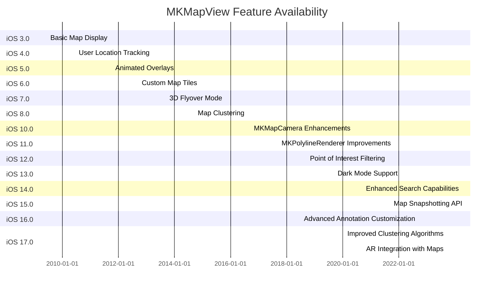

---

## **11. Data Handling and Formats**

### **a. Map Data Types Handling Diagram**
- **Purpose**: Explain how `MKMapView` handles different map data types and formats.
- **Diagram Type**: `graph LR`
- **Contents**:
  - **Annotations**: `MKAnnotation`
  - **Overlays**: `MKOverlay`
  - **Polylines & Polygons**: `MKPolyline`, `MKPolygon`
  - **Renderers**: `MKOverlayRenderer`, `MKAnnotationView`
  - **Map Snapshots**: `UIImage`

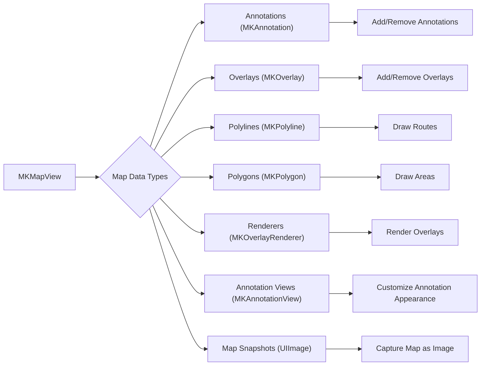

---

## **12. Integration with Drawing Contexts**

### **a. Drawing Methods Usage Diagram**
- **Purpose**: Show how `MKMapView` methods are used within various drawing and rendering contexts.
- **Diagram Type**: `flowchart TD`
- **Contents**:
  - **Custom Overlays Rendering**
  - **Annotation Views Customization**
  - **Map Snapshotting**
  - **Dynamic Map Styling**

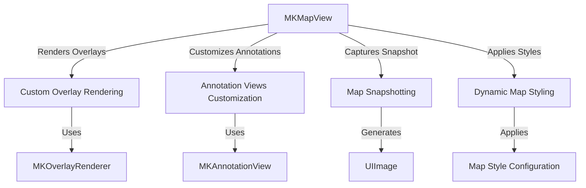

---

## **13. Summary and Best Practices**

### **a. Summary Diagram**
- **Purpose**: Provide a high-level overview of `MKMapView`'s key characteristics and functionalities.
- **Diagram Type**: `graph LR`
- **Contents**:
  - **Comprehensive Mapping Features**
  - **Customization and Extensibility**
  - **Performance Optimizations**
  - **User Interaction Handling**
  - **Seamless Integration**
  - **Advanced Rendering Options**

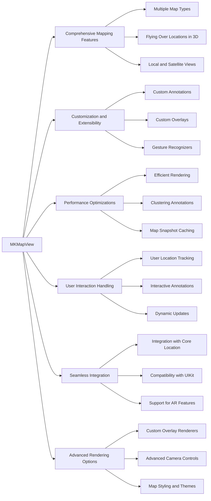

### **b. Best Practices Diagram**
- **Purpose**: Highlight best practices when using `MKMapView`.
- **Diagram Type**: `graph LR`
- **Contents**:
  - **Efficient Data Handling**
  - **Optimized Rendering**
  - **User Experience Enhancements**
  - **Accessibility Considerations**
  - **Security and Privacy**
  - **Performance Monitoring**

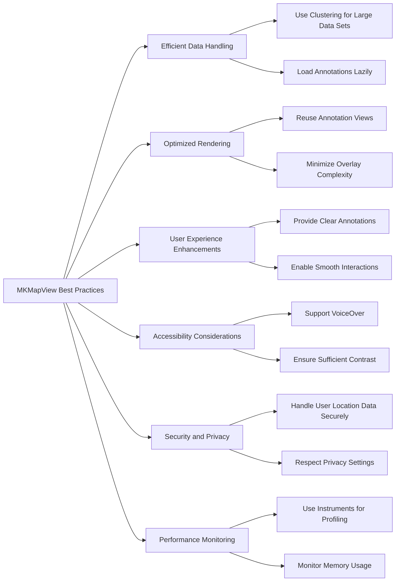

---

## **14. Additional Diagrams Specific to Apple Maps Framework**

### **a. MKAnnotation Protocol Diagram**
- **Purpose**: Showcase the `MKAnnotation` protocol and its requirements.
- **Diagram Type**: `classDiagram`
- **Contents**:
  - **MKAnnotation Protocol**
  - **Required Properties**: `coordinate`
  - **Optional Properties**: `title`, `subtitle`

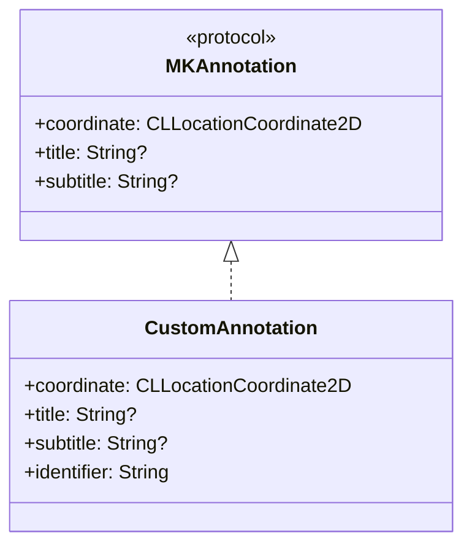

### **b. MKOverlay Protocol Diagram**
- **Purpose**: Illustrate the `MKOverlay` protocol and its components.
- **Diagram Type**: `classDiagram`
- **Contents**:
  - **MKOverlay Protocol**
  - **Required Properties**: `coordinate`, `boundingMapRect`
  - **Optional Properties**: `intersectsMapRect(_:)`

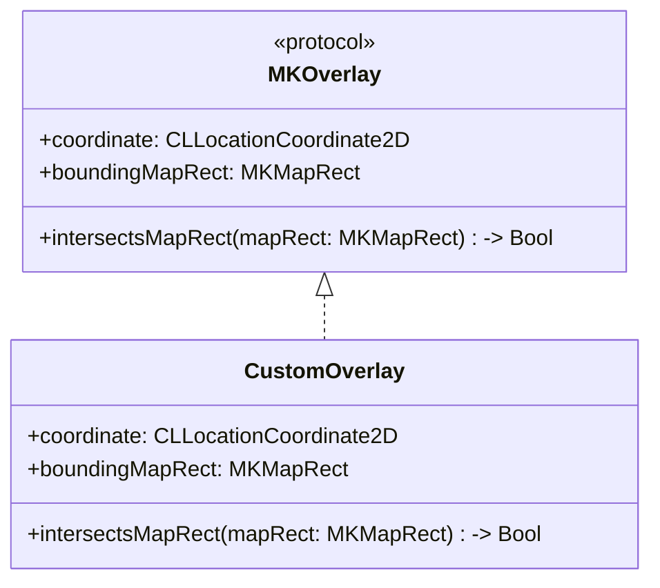

---

## **15. Advanced Features and Integrations**

### **a. AR Integration with Apple Maps Diagram**
- **Purpose**: Explain how `MKMapView` integrates with AR features for enhanced user experiences.
- **Diagram Type**: `flowchart TD`
- **Contents**:
  - **ARKit Integration**
  - **Anchor Placement**
  - **Real-Time Data Overlay**
  - **Interactive AR Elements**

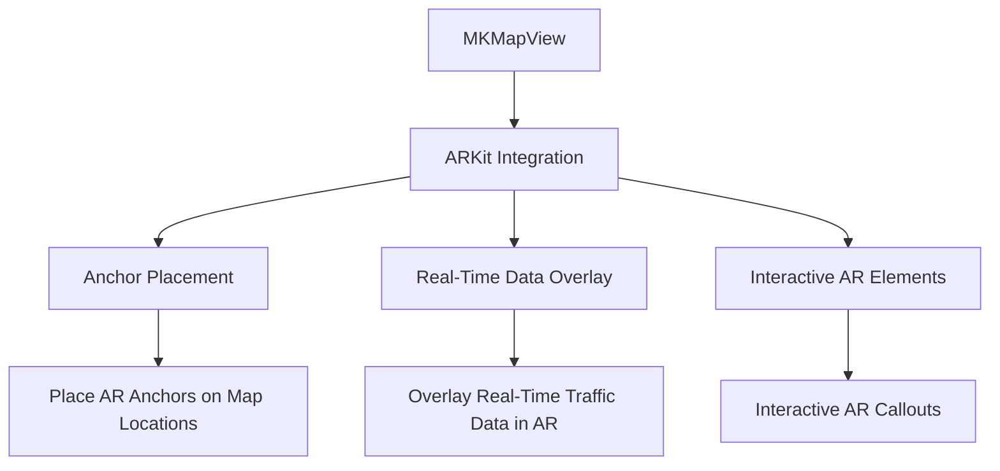

### **b. Routing and Directions Diagram**
- **Purpose**: Detail how routing and directions are handled within `MKMapView`.
- **Diagram Type**: `flowchart LR`
- **Contents**:
  - **MKDirectionsRequest**
  - **MKDirections**
  - **Route Calculation**
  - **Rendering Routes on Map**

```mermaid
flowchart LR
    A[User Requests Directions] --> B[Create MKDirectionsRequest]
    B --> C[Instantiate MKDirections]
    C --> D[Calculate Route]
    D --> E[Receive MKDirectionsResponse]
    E --> F[Render Route on MKMapView]
    
    F --> |Displays| G[MKPolyline]
    G --> H[MKPolylineRenderer]
```

---

## **16. Error Handling and Debugging**

### **a. Error Handling Flowchart**
- **Purpose**: Illustrate common error handling scenarios within `MKMapView`.
- **Diagram Type**: `flowchart TD`
- **Contents**:
  - **Delegate Methods for Errors**
  - **Handling Location Permissions**
  - **Overlay Rendering Errors**
  - **Network Failures in Local Searches**

```mermaid
flowchart TD
    A[MKMapView Error Handling] --> B[Delegate Methods]
    A --> C[Handling Location Permissions]
    A --> D[Overlay Rendering Errors]
    A --> E[Network Failures in Local Searches]
    
    B --> B1["mapView(_:didFailToLocateUserWithError:)"]
    B --> B2["mapView(_:rendererFor:)"]
    
    C --> C1["Check Permissions Status"]
    C --> C2["Request Permissions if Needed"]
    
    D --> D1["Handle Renderer Failures"]
    
    E --> E1["Retry Searches"]
    E --> E2["Notify User of Network Issues"]
```

### **b. Debugging Tools and Techniques Diagram**
- **Purpose**: Outline the tools and techniques for debugging issues related to `MKMapView`.
- **Diagram Type**: `flowchart LR`
- **Contents**:
  - **Xcode Debugger**
  - **Logging and Assertions**
  - **Instruments for Profiling**
  - **Map Debugging Options**

```mermaid
flowchart LR
    A[MKMapView Debugging] --> B[Xcode Debugger]
    A --> C[Logging and Assertions]
    A --> D[Instruments for Profiling]
    A --> E[Map Debugging Options]
    
    B --> B1["Breakpoints in Delegate Methods"]
    C --> C1["Log Annotation Additions"]
    D --> D1["Profile Memory Usage"]
    E --> E1["Enable Map Debug Overlays"]
```

---

## **17. Localization and Internationalization**

### **a. Localization Flowchart**
- **Purpose**: Describe the localization process for map-related content.
- **Diagram Type**: `flowchart TD`
- **Contents**:
  - **Localized Annotations**
  - **Localized Directions**
  - **Support for Multiple Languages**
  - **Handling Locale-Specific Map Data**

```mermaid
flowchart TD
    A[Localization for MKMapView] --> B[Localized Annotations]
    A --> C[Localized Directions]
    A --> D[Support for Multiple Languages]
    A --> E[Locale-Specific Map Data]
    
    B --> B1["Provide Localized Titles and Subtitles"]
    C --> C1["Localize Route Instructions"]
    D --> D1["Support Dynamic Language Switching"]
    E --> E1["Display Local POIs and Landmarks"]
```

### **b. Internationalization Best Practices Diagram**
- **Purpose**: Highlight best practices for internationalizing map features.
- **Diagram Type**: `graph LR`
- **Contents**:
  - **Use of Locale-Aware Data**
  - **Support for Right-to-Left Languages**
  - **Dynamic Map Styling**
  - **Handling Different Measurement Units**

```mermaid
graph LR
    A[Internationalization Best Practices] --> B[Use Locale-Aware Data]
    A --> C[Support Right-to-Left Languages]
    A --> D[Dynamic Map Styling]
    A --> E[Handle Different Measurement Units]
    
    B --> B1["Load Local POI Names"]
    C --> C1["Adjust Annotation Layouts"]
    D --> D1["Adapt Map Labels Based on Locale"]
    E --> E1["Convert Distances Appropriately"]
```

---

## **18. Testing and Quality Assurance**

### **a. Testing Strategies Diagram**
- **Purpose**: Outline strategies for testing `MKMapView` functionalities.
- **Diagram Type**: `flowchart TD`
- **Contents**:
  - **Unit Testing Annotations**
  - **UI Testing Map Interactions**
  - **Integration Testing with Location Services**
  - **Performance Testing for Map Rendering**

```mermaid
flowchart TD
    A[MKMapView Testing Strategies] --> B[Unit Testing Annotations]
    A --> C[UI Testing Map Interactions]
    A --> D[Integration Testing with Location Services]
    A --> E[Performance Testing for Map Rendering]
    
    B --> B1["Verify Annotation Data Integrity"]
    C --> C1["Simulate User Gestures on Map"]
    D --> D1["Mock Location Data"]
    E --> E1["Measure Rendering Times"]
```

### **b. Automated Testing Tools Diagram**
- **Purpose**: Highlight tools that aid in automated testing of `MKMapView`.
- **Diagram Type**: `graph LR`
- **Contents**:
  - **Xcode XCTest**
  - **UI Testing with XCTest**
  - **Third-Party Testing Frameworks**
  - **Continuous Integration Integration**

```mermaid
graph LR
    A[Automated Testing Tools] --> B[Xcode XCTest]
    A --> C[UI Testing with XCTest]
    A --> D[Third-Party Testing Frameworks]
    A --> E[Continuous Integration Integration]
    
    B --> B1["Write Unit Tests for Annotations"]
    C --> C1["Automate Map Interaction Tests"]
    D --> D1["Use Quick/Nimble for Behavior Testing"]
    E --> E1["Integrate Tests with CI Pipelines"]
```

---

## **19. Accessibility Features and Considerations**

### **a. Accessibility Diagram**
- **Purpose**: Explain how to implement accessibility features within `MKMapView`.
- **Diagram Type**: `flowchart TD`
- **Contents**:
  - **VoiceOver Support**
  - **Accessible Annotations**
  - **Dynamic Type Adjustments**
  - **Color Contrast Enhancements**

```mermaid
flowchart TD
    A[MKMapView Accessibility] --> B[VoiceOver Support]
    A --> C[Accessible Annotations]
    A --> D[Dynamic Type Adjustments]
    A --> E[Color Contrast Enhancements]
    
    B --> B1["Provide Descriptive Labels for Annotations"]
    C --> C1["Ensure Annotations are Navigable via VoiceOver"]
    D --> D1["Adjust Text Sizes Based on User Preferences"]
    E --> E1["Use High Contrast Colors for Map Elements"]
```

### **b. Accessibility Best Practices Diagram**
- **Purpose**: Highlight best practices for making `MKMapView` accessible.
- **Diagram Type**: `graph LR`
- **Contents**:
  - **Descriptive Annotations**
  - **Accessible Controls**
  - **Keyboard Navigation Support**
  - **Accessible Map Overlays**

```mermaid
graph LR
    A[Accessibility Best Practices] --> B[Descriptive Annotations]
    A --> C[Accessible Controls]
    A --> D[Keyboard Navigation Support]
    A --> E[Accessible Map Overlays]
    
    B --> B1["Provide Clear Titles and Descriptions"]
    C --> C1["Ensure Map Controls are Reachable via VoiceOver"]
    D --> D1["Support Keyboard Shortcuts for Map Actions"]
    E --> E1["Make Overlays Accessible and Navigable"]
```

---

## **20. Security and Privacy Considerations**

### **a. Privacy Flowchart**
- **Purpose**: Outline privacy considerations when using `MKMapView`.
- **Diagram Type**: `flowchart TD`
- **Contents**:
  - **User Location Permissions**
  - **Handling Sensitive Data**
  - **Secure Data Transmission**
  - **Compliance with Privacy Laws**

```mermaid
flowchart TD
    A[MKMapView Privacy Considerations] --> B[User Location Permissions]
    A --> C[Handling Sensitive Data]
    A --> D[Secure Data Transmission]
    A --> E[Compliance with Privacy Laws]
    
    B --> B1["Request Permission Before Accessing Location"]
    B --> B2["Provide Clear Description for Usage"]
    
    C --> C1["Encrypt Sensitive Data"]
    
    D --> D1["Use HTTPS for Data Requests"]
    
    E --> E1["Adhere to GDPR, CCPA, etc."]
```

### **b. Security Best Practices Diagram**
- **Purpose**: Highlight best practices for ensuring security when using `MKMapView`.
- **Diagram Type**: `graph LR`
- **Contents**:
  - **Secure API Usage**
  - **Data Encryption**
  - **User Consent Management**
  - **Regular Security Audits**

```mermaid
graph LR
    A[Security Best Practices] --> B[Secure API Usage]
    A --> C[Data Encryption]
    A --> D[User Consent Management]
    A --> E[Regular Security Audits]
    
    B --> B1["Use Authorized APIs Only"]
    C --> C1["Encrypt Data at Rest and in Transit"]
    D --> D1["Obtain Explicit User Consent for Location Access"]
    E --> E1["Conduct Regular Vulnerability Assessments"]
```

---

## **21. Deployment Considerations**

### **a. Deployment Flowchart**
- **Purpose**: Describe considerations for deploying applications using `MKMapView`.
- **Diagram Type**: `flowchart TD`
- **Contents**:
  - **API Key Management**
  - **Handling Map Data Restrictions**
  - **Optimizing App Size**
  - **Testing Across Devices and iOS Versions**

```mermaid
flowchart TD
    A[Deployment Considerations] --> B[API Key Management]
    A --> C[Handling Map Data Restrictions]
    A --> D[Optimizing App Size]
    A --> E[Testing Across Devices and iOS Versions]
    
    B --> B1["Secure Storage of API Keys"]
    B --> B2["Restrict API Key Usage to App"]
    
    C --> C1["Respect Geographical Restrictions on Map Data"]
    
    D --> D1["Optimize Map Data Loading"]
    
    E --> E1["Ensure Compatibility with Target iOS Versions"]
```

### **b. Deployment Best Practices Diagram**
- **Purpose**: Highlight best practices for deploying apps that utilize `MKMapView`.
- **Diagram Type**: `graph LR`
- **Contents**:
  - **Efficient Resource Management**
  - **Localization Support**
  - **Compliance with App Store Guidelines**
  - **Performance Optimization**

```mermaid
graph LR
    A[Deployment Best Practices] --> B[Efficient Resource Management]
    A --> C[Localization Support]
    A --> D[Compliance with App Store Guidelines]
    A --> E[Performance Optimization]
    
    B --> B1["Lazy Load Map Resources"]
    B --> B2["Manage Memory Usage Effectively"]
    
    C --> C1["Provide Localized Map Content"]
    
    D --> D1["Adhere to Apple’s Map Usage Policies"]
    
    E --> E1["Optimize Map Rendering Performance"]
```

---

## **22. Future Enhancements and Roadmap**

### **a. Future Enhancements Diagram**
- **Purpose**: Outline potential future enhancements for `MKMapView` based on industry trends.
- **Diagram Type**: `flowchart TD`
- **Contents**:
  - **Enhanced AR Features**
  - **Real-Time Data Integration**
  - **Machine Learning for Map Analytics**
  - **Improved Offline Capabilities**

```mermaid
flowchart TD
    A[Future Enhancements for MKMapView] --> B[Enhanced AR Features]
    A --> C[Real-Time Data Integration]
    A --> D[Machine Learning for Map Analytics]
    A --> E[Improved Offline Capabilities]
    
    B --> B1["Interactive AR Annotations"]
    B --> B2["AR-Based Navigation"]
    
    C --> C1["Live Traffic Updates"]
    C --> C2["Real-Time POI Information"]
    
    D --> D1["Predictive Location Suggestions"]
    D --> D2["Smart Route Optimization"]
    
    E --> E1["Downloadable Map Regions"]
    E --> E2["Offline Routing and Directions"]
```

### **b. Roadmap Diagram**
- **Purpose**: Visualize the roadmap for upcoming features and improvements.
- **Diagram Type**: `gantt`
- **Contents**:
  - **Q1 2024**: Enhanced AR Features
  - **Q2 2024**: Real-Time Data Integration
  - **Q3 2024**: Machine Learning Analytics
  - **Q4 2024**: Improved Offline Capabilities

## TODO: Fix diagram syntax error

```mermaid
gantt
    dateFormat  YYYY-MM-DD
    title MKMapView Future Roadmap

    section 2024
    Q1 2024 :active, des1, 2024-01-01, 90d
    Q2 2024 :des2, after des1, 90d
    Q3 2024 :des3, after des2, 90d
    Q4 2024 :des4, after des3, 90d

    des1[Enhanced AR Features] 
    des2[Real-Time Data Integration] 
    des3[Machine Learning for Map Analytics]
    des4[Improved Offline Capabilities]
```

---

## **23. Comprehensive Class Diagram**

### **a. Comprehensive Class Diagram**
- **Purpose**: Provide a holistic view of the `MKMapView` class in relation to other key classes and protocols within the Apple Maps framework.
- **Diagram Type**: `classDiagram`
- **Contents**:
  - **MKMapView**
  - **MKAnnotation**
  - **MKOverlay**
  - **MKMapViewDelegate**
  - **MKAnnotationView**
  - **MKOverlayRenderer**
  - **CLLocationManager**
  - **MKDirections**

```mermaid
classDiagram
    class MKMapView {
        +delegate: MKMapViewDelegate?
        +region: MKCoordinateRegion
        +mapType: MapType
        +isZoomEnabled: Bool
        +isScrollEnabled: Bool
        +showsUserLocation: Bool
        +addAnnotation(annotation: MKAnnotation)
        +addOverlay(overlay: MKOverlay)
    }

    class MKAnnotation {
        <<protocol>>
        +coordinate: CLLocationCoordinate2D
        +title: String?
        +subtitle: String?
    }

    class MKOverlay {
        <<protocol>>
        +coordinate: CLLocationCoordinate2D
        +boundingMapRect: MKMapRect
    }

    class MKMapViewDelegate {
        <<protocol>>
        +mapView(_:viewFor:)
        +mapView(_:rendererFor:)
        +mapView(_:didSelect:)
        +mapView(_:didDeselect:)
    }

    class MKAnnotationView {
        +annotation: MKAnnotation?
        +canShowCallout: Bool
        +image: UIImage?
        +setSelected(_: Bool, animated: Bool)
    }

    class MKOverlayRenderer {
        +overlay: MKOverlay
        +draw(_: MKMapRect, zoomScale: MKZoomScale, in CGContext: CGContext)
    }

    class CLLocationManager {
        +delegate: CLLocationManagerDelegate?
        +startUpdatingLocation()
        +stopUpdatingLocation()
    }

    class MKDirections {
        +calculate(completionHandler: (MKDirectionsResponse?, Error?) -> Void)
    }

    MKMapView ..|> MKMapViewDelegate
    MKMapView --> MKAnnotation
    MKMapView --> MKOverlay
    MKMapView --> MKAnnotationView
    MKMapView --> MKOverlayRenderer
    MKMapView --> CLLocationManager
    MKMapView --> MKDirections
```

---

## **24. Integration with Other Frameworks**

### **a. Integration Diagram**
- **Purpose**: Show how `MKMapView` integrates with other Apple frameworks.
- **Diagram Type**: `flowchart TD`
- **Contents**:
  - **Core Location**
  - **ARKit**
  - **CloudKit**
  - **HealthKit**
  - **Core Data**

```mermaid
flowchart TD
    MKMapView --> CoreLocation[Core Location]
    MKMapView --> ARKit[ARKit]
    MKMapView --> CloudKit[CloudKit]
    MKMapView --> HealthKit[HealthKit]
    MKMapView --> CoreData[Core Data]
    
    CoreLocation --> |Provides| UserLocation[User Location Data]
    ARKit --> |Enhances| ARFeatures[Augmented Reality Features]
    CloudKit --> |Stores/Retrieves| MapData[Map Data]
    HealthKit --> |Tracks| FitnessRoutes[Fitness Tracking Routes]
    CoreData --> |Manages| PersistentData[Persistent Map Data]
```

---

## **25. Example Use Case Implementation**

### **a. Example Use Case Diagram**
- **Purpose**: Demonstrate a practical implementation scenario using `MKMapView`.
- **Diagram Type**: `flowchart LR`
- **Contents**:
  - **User Requests Directions**
  - **App Requests Location Permissions**
  - **App Configures MKMapView**
  - **App Displays Route**
  - **User Interacts with Map**

```mermaid
flowchart LR
    A[User Opens App] --> B[Request Location Permissions]
    B --> C[User Grants Permissions]
    C --> D[Configure MKMapView]
    D --> E[Display User Location]
    E --> F[User Inputs Destination]
    F --> G[Create MKDirectionsRequest]
    G --> H[Calculate Route]
    H --> I[Render Route on MKMapView]
    I --> J[User Navigates Using Map]
```

---