---

# Marketplace Kit

## **1. Class Structure and Hierarchy**

### **a. Core Class Diagram**
- **Purpose**: Illustrate the primary structure of `MarketplaceKit`, including its core classes, properties, methods, and enumerations.
- **Diagram Type**: `classDiagram`
- **Contents**:
  - **Core Classes**: `Marketplace`, `Product`, `User`, `Transaction`, `Review`
  - **Properties**: Key attributes like `id`, `name`, `price`, `description`, etc.
  - **Methods**: Essential functions like `addProduct()`, `removeProduct()`, `processPayment()`, etc.
  - **Enumerations**: Nested enums such as `TransactionStatus`, `PaymentMethod`, `UserRole`

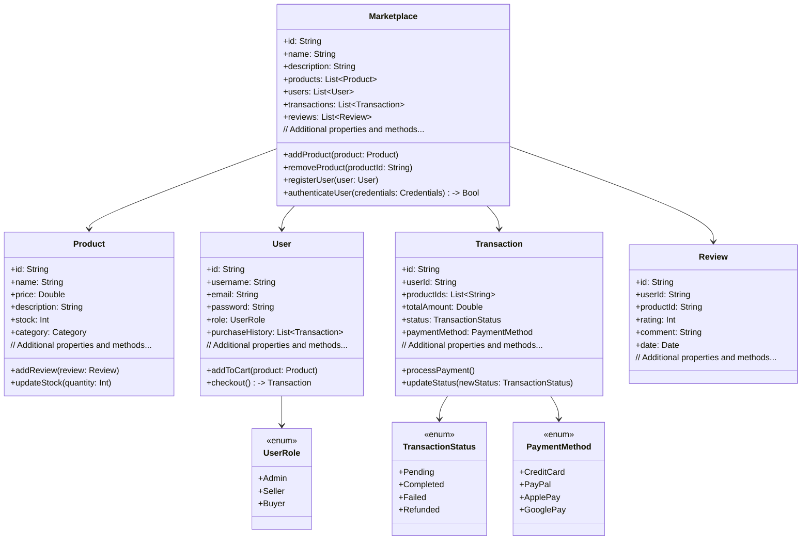

---

## **2. Initializers Overview**

### **a. Initialization Methods Diagram**
- **Purpose**: Break down the various ways to instantiate core classes within `MarketplaceKit`.
- **Diagram Type**: `flowchart LR`
- **Contents**:
  - **Marketplace Initialization**
  - **Product Initialization**
  - **User Initialization**
  - **Transaction Initialization**
  - **Review Initialization**

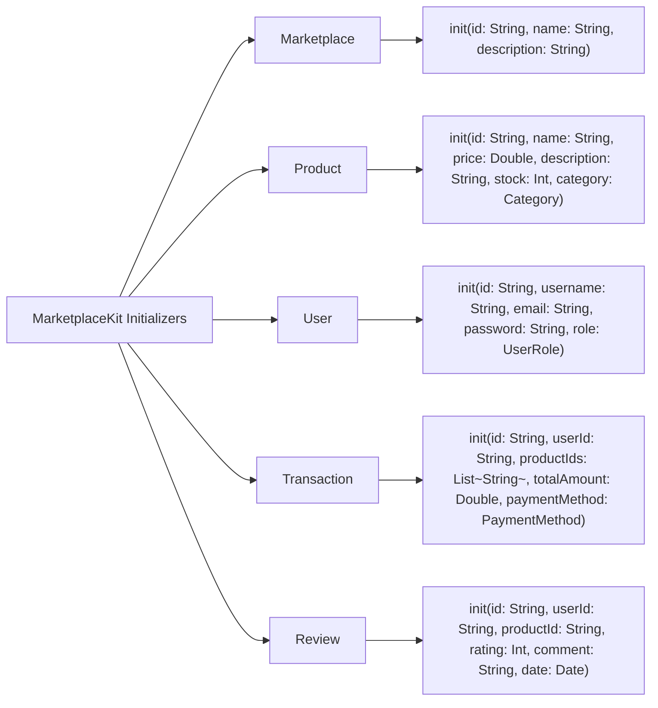

---

## **3. Properties Breakdown**

### **a. Key Properties Diagram**
- **Purpose**: Detail the main properties of core classes within `MarketplaceKit`.
- **Diagram Type**: `graph LR`
- **Contents**:
  - **Marketplace Properties**
  - **Product Properties**
  - **User Properties**
  - **Transaction Properties**
  - **Review Properties**

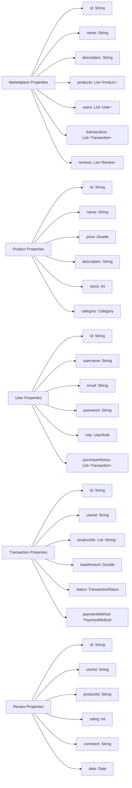

---

## **4. Methods Grouped by Functionality**

### **a. Product Management Methods**
- **Purpose**: Categorize methods related to product management within `MarketplaceKit`.
- **Diagram Type**: `flowchart TD`
- **Contents**:
  - **Adding & Removing Products**
  - **Updating Product Details**
  - **Managing Stock**
  - **Handling Reviews**

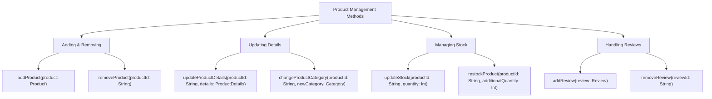

---

## **5. Enumerations and Configurations**

### **a. Enumerations Diagram**
- **Purpose**: Highlight the enums used within `MarketplaceKit` and their possible values.
- **Diagram Type**: `classDiagram`
- **Contents**:
  - **TransactionStatus**
  - **PaymentMethod**
  - **UserRole**
  - **Category**

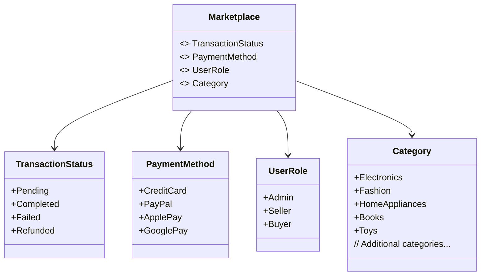

### **b. Configuration Classes Diagram**
- **Purpose**: Show the relationship between core classes and their configuration classes.
- **Diagram Type**: `classDiagram`
- **Contents**:
  - **PaymentConfiguration**
  - **NotificationConfiguration**

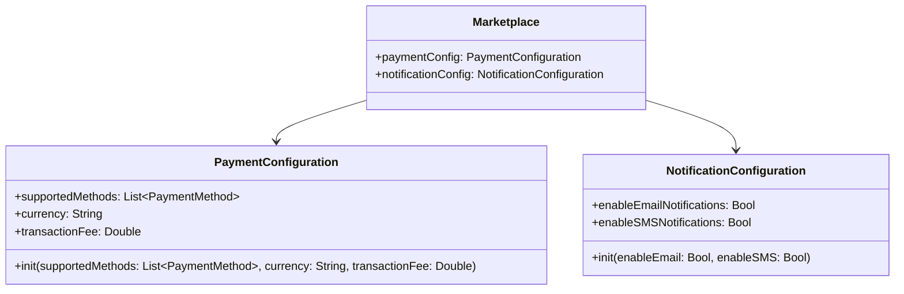

---

## **6. Protocol Conformances**

### **a. Protocols Diagram**
- **Purpose**: Display the protocols that core classes in `MarketplaceKit` conform to and their impact.
- **Diagram Type**: `classDiagram`
- **Contents**:
  - **Codable**
  - **Equatable**
  - **Identifiable**
  - **CustomStringConvertible**

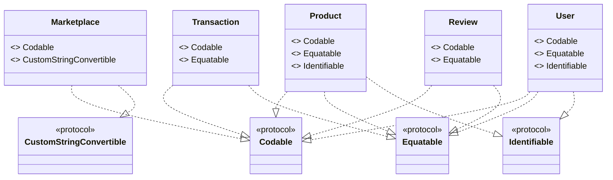

---

## **7. Relationships with Other Classes**

### **a. Related Classes Diagram**
- **Purpose**: Illustrate how core classes in `MarketplaceKit` interact with each other and with external frameworks.
- **Diagram Type**: `flowchart TD`
- **Contents**:
  - **User Interactions**: `User` with `Marketplace`
  - **Product Management**: `Marketplace` manages `Product`
  - **Transactions**: `Transaction` linked to `User` and `Product`
  - **Reviews**: `Review` associated with `User` and `Product`
  - **External Integrations**: `PaymentGateway`, `NotificationService`, `Database`

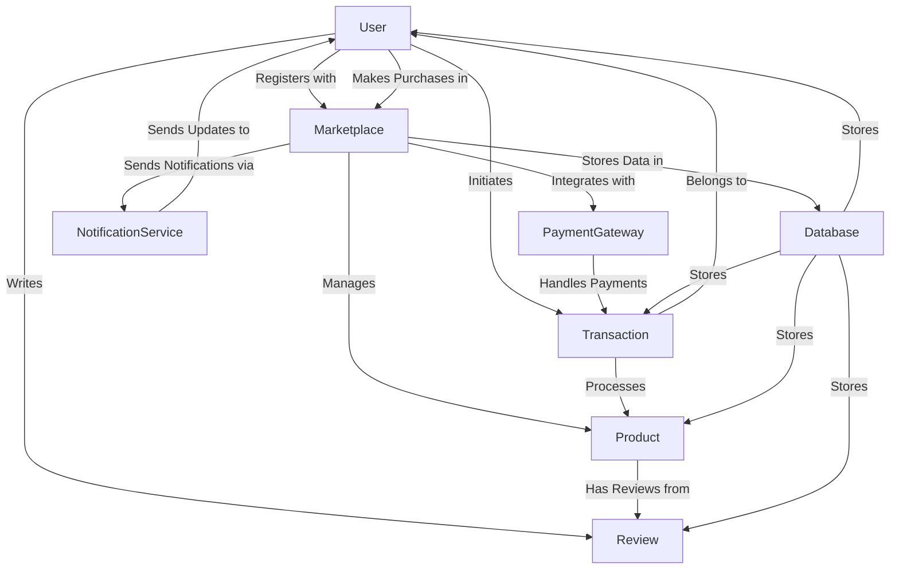

---

## **8. Extensions and Additional Functionalities**

### **a. MarketplaceKit Extensions Diagram**
- **Purpose**: Showcase the additional functionalities provided through extensions.
- **Diagram Type**: `classDiagram`
- **Contents**:
  - **Analytics Extensions**
  - **Reporting Extensions**
  - **Customization Extensions**

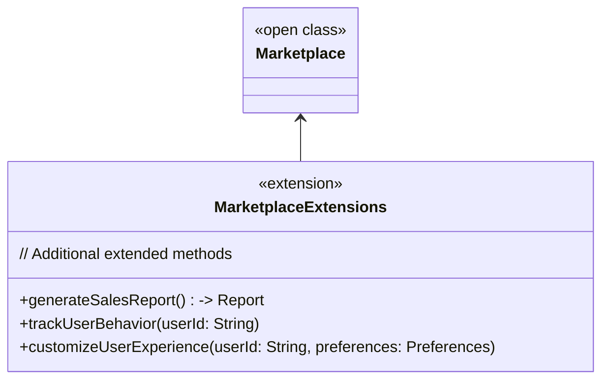

### **b. Extensions Functionalities Flowchart**
- **Purpose**: Detail specific extended methods and their purposes.
- **Diagram Type**: `flowchart LR`
- **Contents**:
  - **Analytics**
  - **Reporting**
  - **Customization**

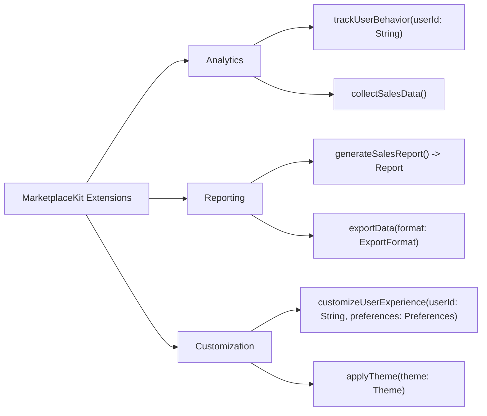

---

## **9. Lifecycle and Use Cases**

### **a. Lifecycle Flowchart**
- **Purpose**: Demonstrate the typical lifecycle of `MarketplaceKit` components within an application.
- **Diagram Type**: `flowchart TD`
- **Contents**:
  - **Initialization**
  - **User Registration & Authentication**
  - **Product Management**
  - **Transaction Processing**
  - **Review Handling**
  - **Reporting & Analytics**

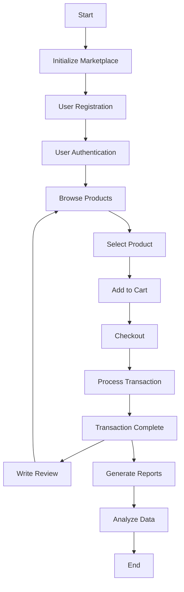

### **b. Common Use Cases Diagram**
- **Purpose**: Outline the typical scenarios where `MarketplaceKit` is utilized.
- **Diagram Type**: `flowchart TD`
- **Contents**:
  - **User Registration & Login**
  - **Product Listing & Management**
  - **Shopping Cart Handling**
  - **Payment Processing**
  - **Order Tracking**
  - **Review and Rating System**
  - **Sales Reporting**

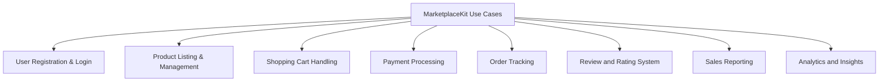

---

## **10. Feature Availability Timeline**

### **a. Feature Availability Gantt Chart**
- **Purpose**: Show when various `MarketplaceKit` features were introduced across different versions.
- **Diagram Type**: `gantt`
- **Contents**:
  - **Version Releases**: 1.0, 1.1, 2.0, 2.1, 3.0
  - **Features Introduced**: Basic marketplace setup, user authentication, product management, transaction processing, reviews system, payment integration, analytics, reporting.

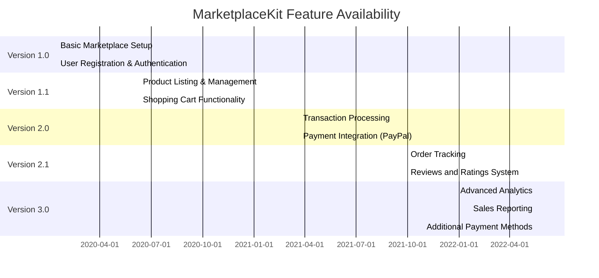

---

## **11. Data Handling and Formats**

### **a. Data Format Handling Diagram**
- **Purpose**: Explain how `MarketplaceKit` handles different data formats for various functionalities.
- **Diagram Type**: `graph LR`
- **Contents**:
  - **User Data**: JSON, Codable
  - **Product Data**: JSON, Codable
  - **Transaction Data**: JSON, Codable
  - **Review Data**: JSON, Codable
  - **Reports**: PDF, CSV

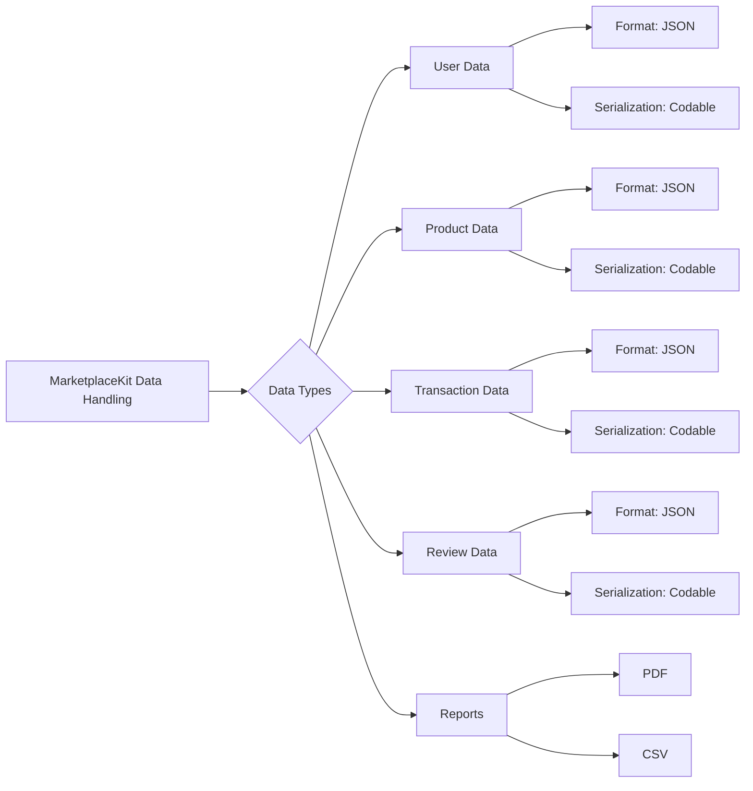

---

## **12. Integration with External Services**

### **a. External Services Integration Diagram**
- **Purpose**: Show how `MarketplaceKit` integrates with external services for enhanced functionalities.
- **Diagram Type**: `flowchart TD`
- **Contents**:
  - **Payment Gateways**: PayPal, Stripe
  - **Notification Services**: Firebase, Twilio
  - **Analytics Platforms**: Google Analytics, Mixpanel
  - **Database Services**: Firebase Firestore, AWS DynamoDB

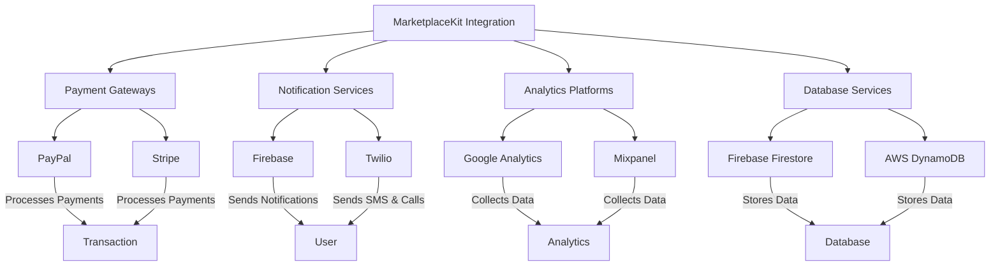

---

## **13. Summary and Best Practices**

### **a. Summary Diagram**
- **Purpose**: Provide a high-level overview of `MarketplaceKit`'s key characteristics and functionalities.
- **Diagram Type**: `graph LR`
- **Contents**:
  - **Comprehensive Initialization**
  - **Robust Product Management**
  - **Secure User Authentication**
  - **Efficient Transaction Processing**
  - **User Reviews and Ratings**
  - **Advanced Analytics and Reporting**
  - **Seamless External Integrations**

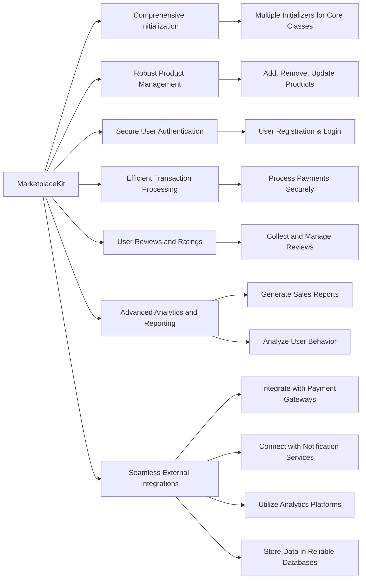

---

## **Best Practices for Using MarketplaceKit**

1. **Maintain Security**:
   - Always handle user credentials securely.
   - Use HTTPS for all network communications.
   - Implement proper validation and sanitization for user inputs.

2. **Optimize Performance**:
   - Utilize asynchronous operations for network requests.
   - Cache frequently accessed data to reduce load times.
   - Optimize database queries for faster data retrieval.

3. **Ensure Scalability**:
   - Design your application to handle increasing amounts of data and users.
   - Use modular components to facilitate easier updates and maintenance.

4. **Implement Comprehensive Testing**:
   - Write unit tests for core functionalities.
   - Conduct integration testing with external services.
   - Perform load testing to ensure the system can handle high traffic.

5. **Provide User-Friendly Interfaces**:
   - Design intuitive UI/UX for seamless user interactions.
   - Ensure accessibility features are integrated for all users.

6. **Monitor and Analyze**:
   - Use analytics to track user behavior and application performance.
   - Regularly review reports to identify areas for improvement.

7. **Stay Updated with External Services**:
   - Keep integrations with payment gateways and notification services up to date.
   - Monitor changes in external APIs to adapt your application accordingly.

8. **Document Thoroughly**:
   - Maintain clear and comprehensive documentation for all components.
   - Provide guidelines for extending and customizing `MarketplaceKit`.

---

By following this comprehensive set of diagrams and best practices, you can effectively utilize `MarketplaceKit` to build robust and scalable marketplace applications. If you have any specific areas you'd like to delve deeper into or need further assistance with `MarketplaceKit`, feel free to ask!

---

