# Metal
> This content is dual-licensed under your choice of the following licenses:
> 1.  **MIT License:** For the code implementations in Swift and Mermaid provided in this document.
> 2.  **Creative Commons Attribution 4.0 International License (CC BY 4.0):** For all other content, including the text, explanations, and the Mermaid diagrams and illustrations.

---

## **1. Class Structure and Hierarchy**

### **a. Core Class Diagram**
- **Purpose**: Illustrate the primary structure of the `Metal` framework, including its key classes, properties, methods, and enumerations.
- **Diagram Type**: `classDiagram`
- **Contents**:
  - **Core Classes**: `MTLDevice`, `MTLCommandQueue`, `MTLRenderPipelineState`, `MTLBuffer`, `MTLTexture`, etc.
  - **Protocols**: `MTLCommandEncoder`, `MTLRenderCommandEncoder`, `MTLComputeCommandEncoder`, etc.
  - **Enumerations**: `MTLBool`, `MTLCPUCacheMode`, `MTLTextureType`, etc.

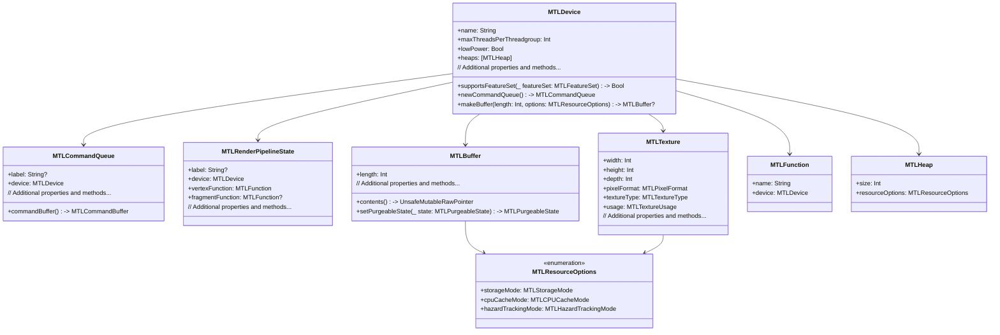

---

## **2. Initializers Overview**

### **a. Initialization Methods Diagram**
- **Purpose**: Break down the various ways to instantiate key `Metal` classes.
- **Diagram Type**: `flowchart LR`
- **Contents**:
  - **Device Initialization**: `MTLCreateSystemDefaultDevice()`
  - **Command Queue Initialization**: `newCommandQueue()`
  - **Buffer Creation**: `makeBuffer(length:options:)`
  - **Texture Creation**: `makeTexture(descriptor:)`

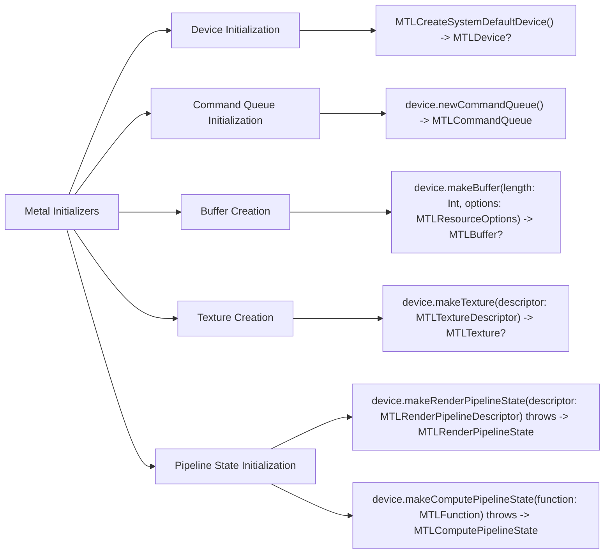

---

## **3. Properties Breakdown**

### **a. Key Properties Diagram**
- **Purpose**: Detail the main properties of essential `Metal` classes.
- **Diagram Type**: `classDiagram`
- **Contents**:
  - **MTLDevice Properties**: `name`, `maxThreadsPerThreadgroup`, `lowPower`
  - **MTLRenderPipelineState Properties**: `vertexFunction`, `fragmentFunction`
  - **MTLTexture Properties**: `width`, `height`, `pixelFormat`

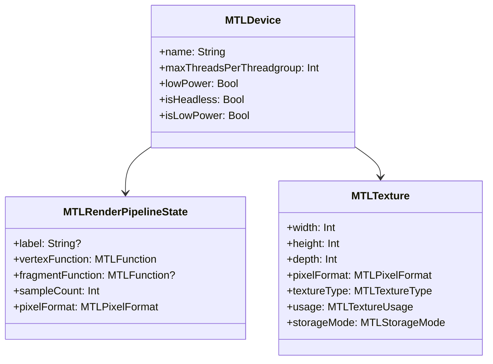

---

## **4. Methods Grouped by Functionality**

### **a. Rendering Pipeline Methods**
- **Purpose**: Categorize methods based on their roles in setting up and managing the rendering pipeline.
- **Diagram Type**: `flowchart TD`
- **Contents**:
  - **Pipeline Configuration**: `makeRenderPipelineState(descriptor:)`, `makeComputePipelineState(function:)`
  - **Command Buffer Management**: `commandBuffer()`, `commit()`, `waitUntilCompleted()`
  - **Resource Management**: `makeBuffer()`, `makeTexture()`

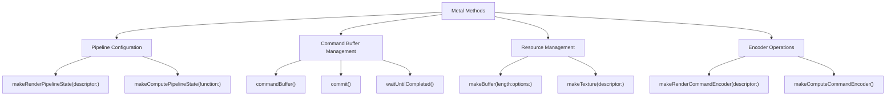

---

## **5. Enumerations and Configurations**

### **a. Enumerations Diagram**
- **Purpose**: Highlight the enums used within the `Metal` framework and their possible values.
- **Diagram Type**: `classDiagram`
- **Contents**:
  - **MTLPixelFormat**
  - **MTLTextureType**
  - **MTLResourceOptions**
  - **MTLRenderPipelineColorAttachmentDescriptor**

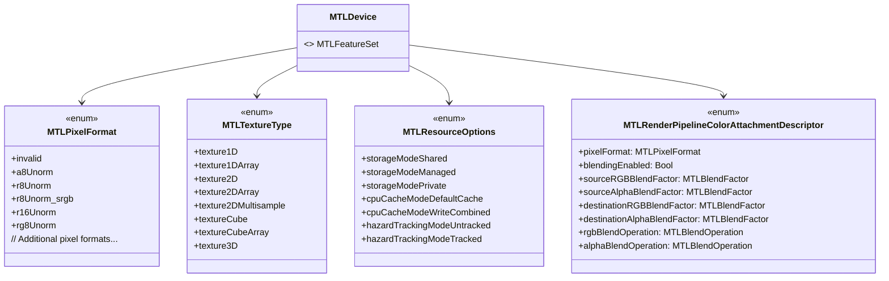

### **b. Configuration Classes Diagram**
- **Purpose**: Show the relationship between `Metal` classes and their configuration classes.
- **Diagram Type**: `classDiagram`
- **Contents**:
  - **MTLRenderPipelineDescriptor**
  - **MTLTextureDescriptor**
  - **MTLBufferDescriptor**

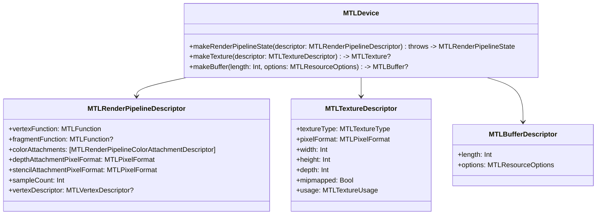

---

## **6. Protocol Conformances**

### **a. Protocols Diagram**
- **Purpose**: Display the protocols that key `Metal` classes conform to and their impact.
- **Diagram Type**: `classDiagram`
- **Contents**:
  - **MTLCommandEncoder**
  - **MTLRenderCommandEncoder**
  - **MTLComputeCommandEncoder**
  - **MTLDrawable**
  - **MTLTextureProvider**
  - **Sendable**

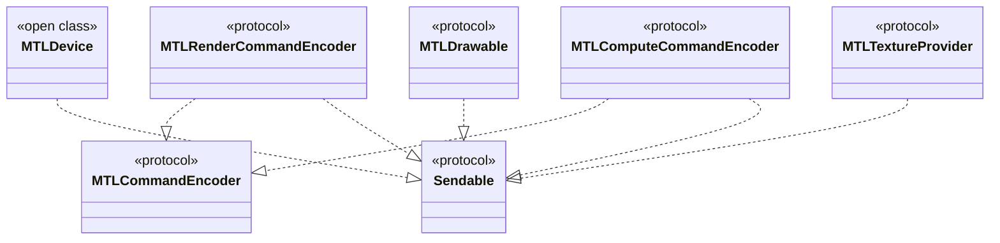

---

## **7. Relationships with Other Classes**

### **a. Related Classes Diagram**
- **Purpose**: Illustrate how `Metal` interacts with other Apple frameworks and classes.
- **Diagram Type**: `flowchart TD`
- **Contents**:
  - **CAMetalLayer**: Provides drawable textures for rendering.
  - **MTKView**: Metal-enabled view for rendering content.
  - **Core Animation**: Integration with `Metal` for animations.
  - **Core Graphics**: Interoperability for 2D drawing.
  - **SceneKit**: Utilizes `Metal` for rendering 3D content.
  - **SwiftUI**: Embeds Metal views within SwiftUI interfaces.

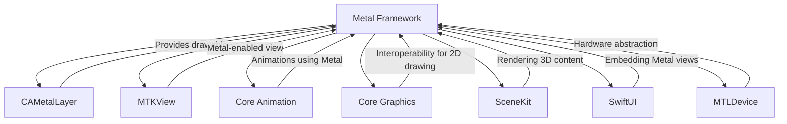

---

## **8. Extensions and Additional Functionalities**

### **a. Metal Extensions Diagram**
- **Purpose**: Showcase the additional functionalities provided through `Metal` extensions and utility classes.
- **Diagram Type**: `classDiagram`
- **Contents**:
  - **MTLTextureExtensions**
  - **MTLBufferExtensions**
  - **MTLCommandQueueExtensions**

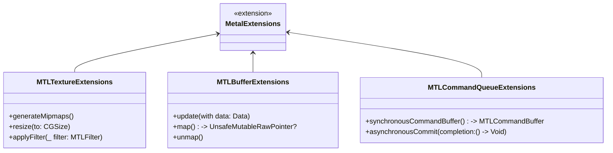

### **b. Extensions Functionalities Flowchart**
- **Purpose**: Detail specific extended methods and their purposes.
- **Diagram Type**: `flowchart LR`
- **Contents**:
  - **Texture Manipulation**
  - **Buffer Management**
  - **Command Queue Enhancements**

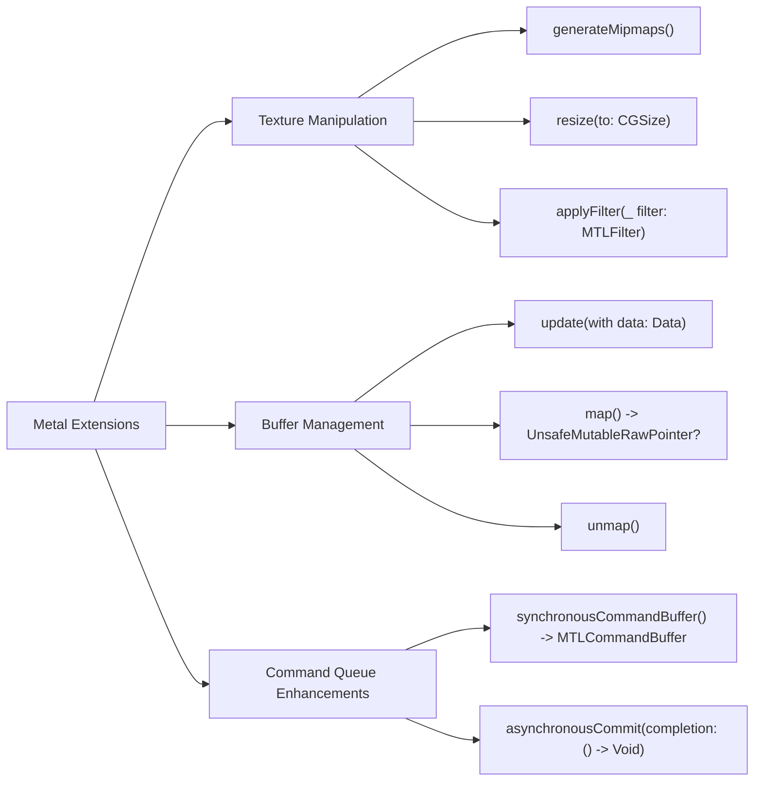

---

## **9. Lifecycle and Use Cases**

### **a. Lifecycle Flowchart**
- **Purpose**: Demonstrate the typical lifecycle of a `Metal` rendering process within an application.
- **Diagram Type**: `flowchart TD`
- **Contents**:
  - **Initialization**
  - **Resource Creation**
  - **Command Encoding**
  - **Command Submission**
  - **Rendering & Display**
  - **Cleanup**

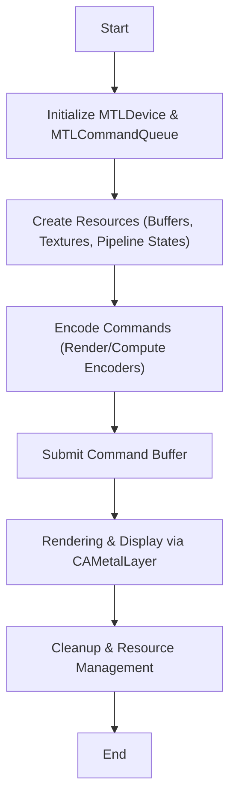

### **b. Common Use Cases Diagram**
- **Purpose**: Outline the typical scenarios where `Metal` is utilized.
- **Diagram Type**: `flowchart TD`
- **Contents**:
  - **High-Performance Graphics Rendering**
  - **Compute Shaders for Data Parallelism**
  - **Game Development**
  - **Augmented Reality (AR) Applications**
  - **Image and Video Processing**
  - **Machine Learning Acceleration**
  - **Scientific Simulations**

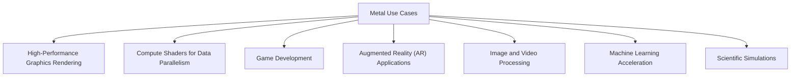

---

## **10. Feature Availability Timeline**

### **a. Feature Availability Gantt Chart**
- **Purpose**: Show when various `Metal` features were introduced across iOS and macOS versions.
- **Diagram Type**: `gantt`
- **Contents**:
  - **OS Versions**: macOS 10.11, iOS 8.0, macOS 10.14, iOS 12.0, macOS 11.0, iOS 14.0, macOS 12.0, iOS 16.0, macOS 13.0, iOS 17.0
  - **Features Introduced**: Basic rendering, tessellation shaders, Metal Performance Shaders, compute pipelines, support for ray tracing, MetalFX, etc.

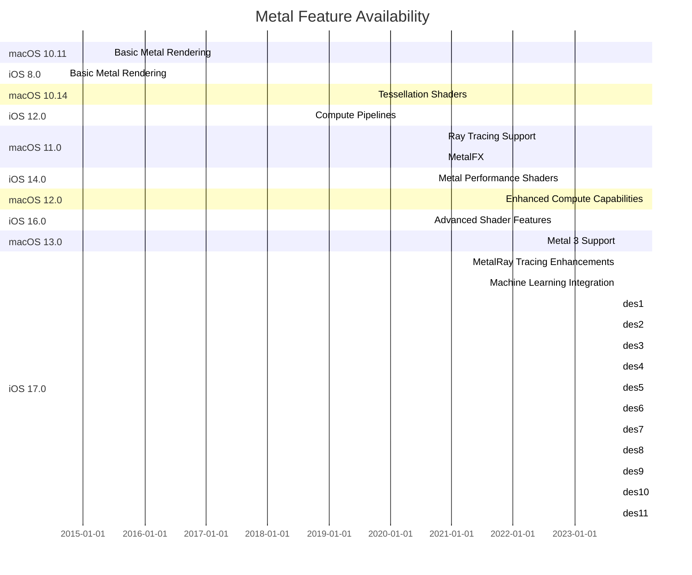

---

## **11. Data Handling and Formats**

### **a. Shader and Resource Format Handling Diagram**
- **Purpose**: Explain how `Metal` handles different shader languages and resource formats.
- **Diagram Type**: `graph LR`
- **Contents**:
  - **Shader Languages**: Metal Shading Language (MSL)
  - **Resource Formats**: Textures (MTLPixelFormat), Buffers, Render Targets
  - **Compilation & Optimization**: `xcrun -sdk macosx metal`, `GPUCommandBuffer`

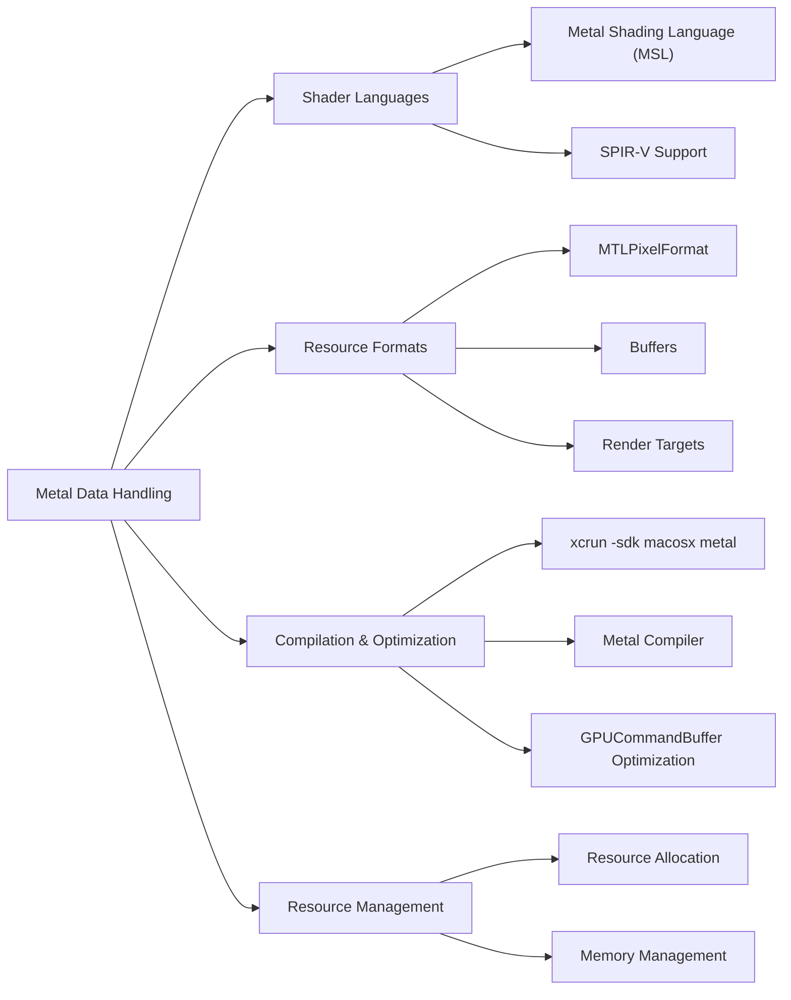

---

## **12. Integration with Drawing Contexts**

### **a. Rendering Pipeline Integration Diagram**
- **Purpose**: Show how `Metal` integrates with rendering contexts and other graphics frameworks.
- **Diagram Type**: `flowchart TD`
- **Contents**:
  - **CAMetalLayer**: Interface for drawable textures.
  - **MTKView**: High-level view for rendering.
  - **Core Animation**: Integration for animations.
  - **SwiftUI**: Embedding Metal into SwiftUI views.

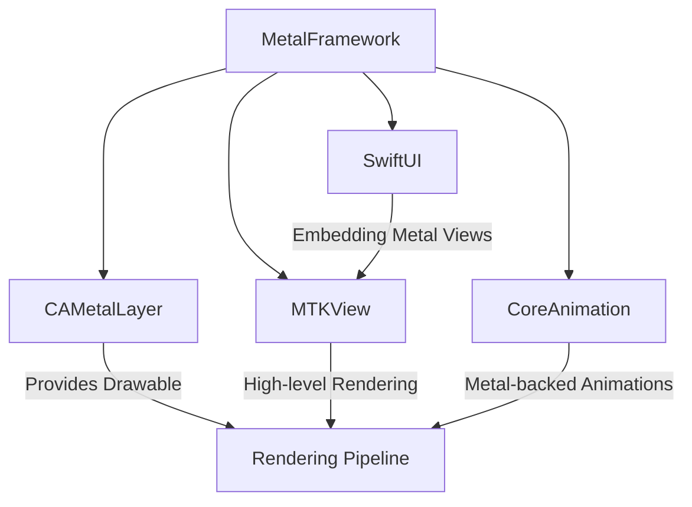

---

## **13. Summary and Best Practices**

### **a. Summary Diagram**
- **Purpose**: Provide a high-level overview of `Metal`'s key characteristics and functionalities.
- **Diagram Type**: `graph LR`
- **Contents**:
  - **High-Performance Graphics**
  - **Compute Capabilities**
  - **Extensive Shader Support**
  - **Seamless Integration**
  - **Advanced Optimization Techniques**
  - **Future-Proof Architecture**

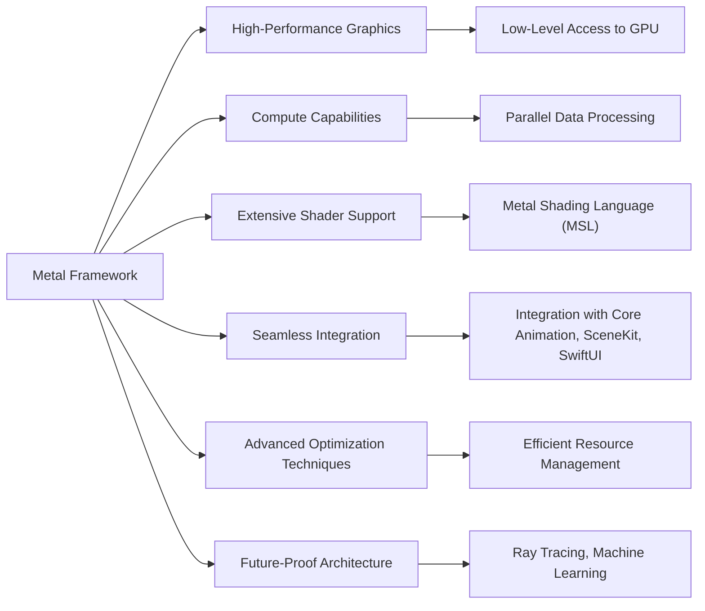

### **b. Best Practices Diagram**
- **Purpose**: Highlight best practices for using the `Metal` framework effectively.
- **Diagram Type**: `flowchart LR`
- **Contents**:
  - **Efficient Resource Management**: Reusing buffers and textures.
  - **Optimize Shaders**: Minimize complexity and memory access.
  - **Leverage Multithreading**: Utilize command queues and parallel encoding.
  - **Profile and Optimize**: Use Instruments for performance tuning.
  - **Stay Updated**: Keep up with Metal updates and new features.

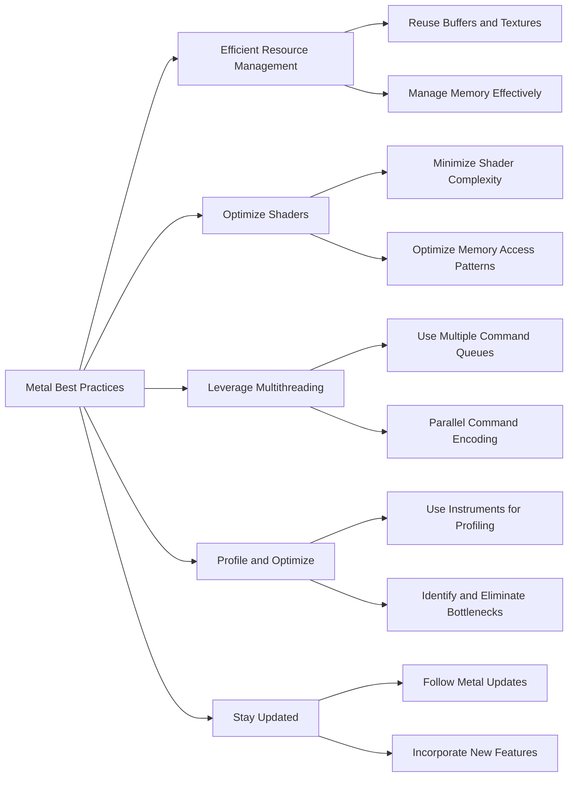

---

## **14. Advanced Topics**

### **a. Ray Tracing Integration Diagram**
- **Purpose**: Illustrate how `Metal` supports and integrates ray tracing capabilities.
- **Diagram Type**: `flowchart TD`
- **Contents**:
  - **MTLDeviceRayTracing**
  - **Acceleration Structures**
  - **Ray Generation Shaders**
  - **Intersection Shaders**

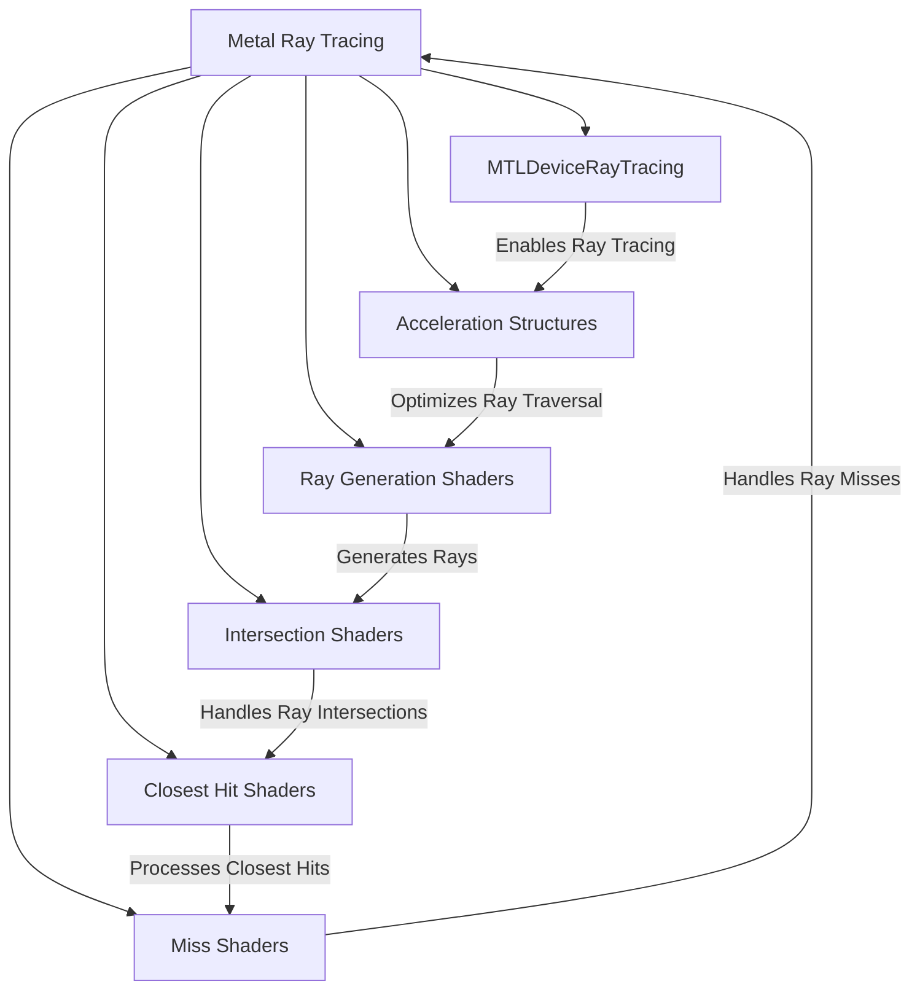

### **b. Machine Learning Acceleration Diagram**
- **Purpose**: Show how `Metal` accelerates machine learning workloads.
- **Diagram Type**: `flowchart LR`
- **Contents**:
  - **Metal Performance Shaders (MPS)**
  - **Neural Network Integration**
  - **GPU-Accelerated Computations**
  - **On-Device Training**

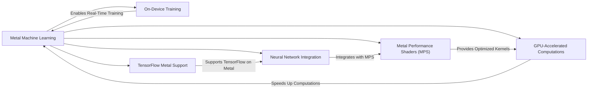

---

## **15. Error Handling and Debugging**

### **a. Error Handling Diagram**
- **Purpose**: Outline the strategies for handling errors within the `Metal` framework.
- **Diagram Type**: `flowchart TD`
- **Contents**:
  - **Check Function Returns**
  - **Use Try-Catch for Pipeline State Creation**
  - **Validate Resource Allocation**
  - **Monitor GPU Performance**

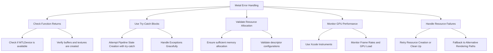

### **b. Debugging Techniques Diagram**
- **Purpose**: Detail the specific debugging techniques and tools for `Metal`.
- **Diagram Type**: `flowchart LR`
- **Contents**:
  - **Xcode GPU Frame Capture**
  - **Metal Validation Layer**
  - **Shader Debugging Tools**
  - **Performance Profiling with Instruments**

```mermaid
flowchart LR
    A[Metal Debugging Techniques] --> B[Xcode GPU Frame Capture]
    A --> C[Metal Validation Layer]
    A --> D[Shader Debugging Tools]
    A --> E[Performance Profiling with Instruments]

    B --> |Capture and Analyze Frames| F[Xcode Debugging Interface]

    C --> |Enable Validation Errors| G[Runtime Error Detection]

    D --> |Inspect Shader Code| H[Debug Shaders]

    E --> |Profile GPU Usage| I[Identify Performance Bottlenecks]
```

---

## **16. Security and Privacy**

### **a. Security Best Practices Diagram**
- **Purpose**: Highlight security best practices when using the `Metal` framework.
- **Diagram Type**: `flowchart LR`
- **Contents**:
  - **Secure Resource Management**
  - **Handle Sensitive Data Carefully**
  - **Validate Inputs for Shaders**
  - **Use Encryption for Stored Data**

```mermaid
flowchart LR
    A[Metal Security Best Practices] --> B[Secure Resource Management]
    A --> C[Handle Sensitive Data Carefully]
    A --> D[Validate Inputs for Shaders]
    A --> E[Use Encryption for Stored Data]
    A --> F[Regularly Update Framework]

    B --> B1["Protect Buffers and Textures"]
    B --> B2["Ensure Proper Memory Handling"]

    C --> C1["Avoid Exposing Sensitive Data"]
    C --> C2["Handle Data Encoding Securely"]

    D --> D1["Sanitize Shader Inputs"]
    D --> D2["Prevent Shader Injection Attacks"]

    E --> E1["Encrypt Textures and Buffers"]
    E --> E2["Securely Store Pipeline States"]

    F --> F1["Apply Latest Security Patches"]
    F --> F2["Stay Informed About Vulnerabilities"]
```

### **b. Privacy Considerations Diagram**
- **Purpose**: Outline privacy considerations when using `Metal` in applications.
- **Diagram Type**: `flowchart TD`
- **Contents**:
  - **Data Collection Policies**
  - **User Consent for Data Usage**
  - **Anonymize Sensitive Data**
  - **Compliance with Regulations**

```mermaid
flowchart TD
    A[Metal Privacy Considerations] --> B[Data Collection Policies]
    A --> C[User Consent for Data Usage]
    A --> D[Anonymize Sensitive Data]
    A --> E[Compliance with Regulations]
    A --> F[Transparent Data Practices]

    B --> B1["Define What Data is Collected"]
    B --> B2["Limit Data to Necessary Usage"]

    C --> C1["Obtain Explicit User Consent"]
    C --> C2["Provide Opt-Out Options"]

    D --> D1["Remove Identifiers from Data"]
    D --> D2["Use Aggregated Data for Processing"]

    E --> E1["Comply with GDPR, CCPA"]
    E --> E2["Follow Platform Privacy Guidelines"]

    F --> F1["Inform Users About Data Usage"]
    F --> F2["Maintain Transparency in Data Practices"]
```

---

## **17. Community and Resources**

### **a. Community Resources Diagram**
- **Purpose**: Provide an overview of community resources available for learning and troubleshooting `Metal`.
- **Diagram Type**: `flowchart LR`
- **Contents**:
  - **Official Documentation**
  - **WWDC Sessions**
  - **Open-Source Projects**
  - **Forums and Discussion Boards**
  - **Tutorials and Guides**
  - **Books and Publications**

```mermaid
flowchart LR
    A[Metal Community Resources] --> B[Official Documentation]
    A --> C[WWDC Sessions]
    A --> D[Open-Source Projects]
    A --> E[Forums and Discussion Boards]
    A --> F[Tutorials and Guides]
    A --> G[Books and Publications]

    B --> |Comprehensive Guides| H[Apple Developer Documentation]

    C --> |In-Depth Sessions| I[WWDC Videos]

    D --> |Example Projects| J[GitHub Repositories]

    E --> |Community Support| K[Stack Overflow, Apple Developer Forums]

    F --> |Hands-On Learning| L[Ray Wenderlich, TutorialsPoint]

    G --> |Books| M["Metal Programming Guide, Metal by Tutorials"]
```

---

## **18. Performance Optimization Techniques**

### **a. Optimization Strategies Diagram**
- **Purpose**: Highlight strategies for optimizing performance when using `Metal`.
- **Diagram Type**: `flowchart LR`
- **Contents**:
  - **Efficient Resource Utilization**
  - **Minimize State Changes**
  - **Optimize Shader Code**
  - **Use Batching for Draw Calls**
  - **Leverage Metal Performance Shaders (MPS)**

```mermaid
flowchart LR
    A[Metal Performance Optimization] --> B[Efficient Resource Utilization]
    A --> C[Minimize State Changes]
    A --> D[Optimize Shader Code]
    A --> E[Use Batching for Draw Calls]
    A --> F["Leverage Metal Performance Shaders (MPS)"]
    A --> G[Use Asynchronous Data Transfers]

    B --> B1["Reuse Buffers and Textures"]
    B --> B2["Optimize Memory Layout"]

    C --> C1["Reduce Pipeline State Switches"]
    C --> C2["Group Similar Draw Calls"]

    D --> D1["Simplify Shader Logic"]
    D --> D2["Optimize Memory Access Patterns"]

    E --> E1["Batch Rendering Commands"]
    E --> E2["Reduce Overdraw"]

    F --> F1["Use MPS for High-Performance Compute"]
    F --> F2["Utilize Pre-Optimized MPS Kernels"]

    G --> G1["Asynchronous Buffer Updates"]
    G --> G2["Concurrent Command Buffer Encoding"]
    
```

---

## **19. Cross-Platform Considerations**

### **a. Cross-Platform Integration Diagram**
- **Purpose**: Show how `Metal` integrates across different Apple platforms.
- **Diagram Type**: `flowchart TD`
- **Contents**:
  - **iOS**
  - **macOS**
  - **tvOS**
  - **watchOS**
  - **Integration Techniques**: Universal Shaders, Shared Resources

```mermaid
flowchart TD
    A[Metal Cross-Platform Integration] --> B[iOS]
    A --> C[macOS]
    A --> D[tvOS]
    A --> E[watchOS]
    A --> F[Integration Techniques]

    F --> F1["Universal Shaders"]
    F --> F2["Shared Resource Management"]
    F --> F3["Platform-Specific Optimizations"]

    B --> |Rendering on iPhones/iPads| F
    C --> |Rendering on Macs| F
    D --> |Rendering on Apple TVs| F
    E --> |Rendering on Apple Watches| F
```

---

## **20. Future Directions and Roadmap**

### **a. Future Features Diagram**
- **Purpose**: Outline upcoming features and directions for the `Metal` framework.
- **Diagram Type**: `flowchart TD`
- **Contents**:
  - **Enhanced Ray Tracing**
  - **Machine Learning Integration**
  - **Real-Time Global Illumination**
  - **Improved Debugging Tools**
  - **Expanded MetalFX Capabilities**
  - **Support for New Hardware Features**

```mermaid
flowchart TD
    A[Metal Future Directions] --> B[Enhanced Ray Tracing]
    A --> C[Machine Learning Integration]
    A --> D[Real-Time Global Illumination]
    A --> E[Improved Debugging Tools]
    A --> F[Expanded MetalFX Capabilities]
    A --> G[Support for New Hardware Features]

    B --> |More Realistic Lighting| A
    C --> |On-Device ML Acceleration| A
    D --> |Advanced Lighting Models| A
    E --> |Better Profiling Support| A
    F --> |Advanced FX Rendering| A
    G --> |Leverage Latest GPU Features| A
```

---

## **Conclusion**

The above set of Mermaid diagrams provides a detailed and structured overview of the `Metal` framework, encompassing its core classes, initialization methods, properties, methods, enumerations, protocol conformances, relationships with other classes, extensions, lifecycle, feature availability, data handling, integration with drawing contexts, best practices, advanced topics, error handling, security, community resources, performance optimization, cross-platform considerations, and future directions. These diagrams serve as a comprehensive guide to understanding and effectively utilizing the `Metal` framework in your projects.

---
**Licenses:**

- **MIT License:**  [](LICENSE) - Full text in [LICENSE](LICENSE) file.
- **Creative Commons Attribution 4.0 International:** [](LICENSE-CC-BY) - Legal details in [LICENSE-CC-BY](LICENSE-CC-BY) and at [Creative Commons official site](http://creativecommons.org/licenses/by/4.0/).

---