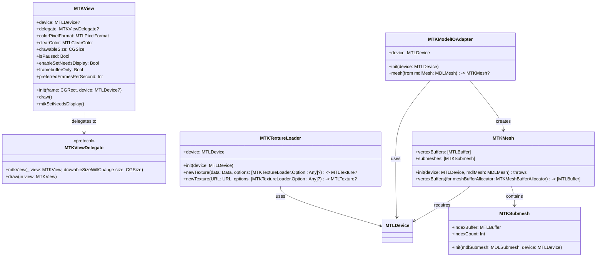

# MetalKit

---


## **1. Class Structure and Hierarchy**

### **a. Core Class Diagram**
- **Purpose**: Illustrate the primary structure of MetalKit, including its key classes, properties, methods, and relationships.
- **Diagram Type**: `classDiagram`
- **Contents**:
  - **Key Classes**: `MTKView`, `MTKTextureLoader`, `MTKMesh`, `MTKModelIOAdapter`, etc.
  - **Properties**: Essential attributes unique to each class.
  - **Methods**: Core functionalities provided by each class.
  - **Relationships**: Inheritance and association between classes.



---

## **2. Initializers Overview**

### **a. Initialization Methods Diagram**
- **Purpose**: Break down the various ways to instantiate key MetalKit classes.
- **Diagram Type**: `flowchart LR`
- **Contents**:
  - **MTKView Initializers**: `init(frame:device:)`, `init(coder:)`
  - **MTKTextureLoader Initializers**: `init(device:)`
  - **MTKMesh Initializers**: `init(device:mdlMesh:)`
  - **MTKModelIOAdapter Initializers**: `init(device:)`


---

## **3. Properties Breakdown**

### **a. Key Properties Diagram**
- **Purpose**: Detail the main properties of MetalKit's core classes.
- **Diagram Type**: `graph LR`
- **Contents**:
  - **MTKView Properties**: `device`, `delegate`, `colorPixelFormat`, `clearColor`, `drawableSize`, `isPaused`, `enableSetNeedsDisplay`, `framebufferOnly`, `preferredFramesPerSecond`
  - **MTKTextureLoader Properties**: `device`
  - **MTKMesh Properties**: `vertexBuffers`, `submeshes`
  - **MTKModelIOAdapter Properties**: `device`


---

## **4. Methods Grouped by Functionality**

### **a. Rendering Methods**
- **Purpose**: Categorize methods based on their roles in rendering and display.
- **Diagram Type**: `flowchart TD`
- **Contents**:
  - **Drawing Methods**: `draw()`, `mtkSetNeedsDisplay()`
  - **Delegate Methods**: `mtkView(_:drawableSizeWillChange:)`, `draw(in:)`
  - **Texture Loading Methods**: `newTexture(data:options:)`, `newTexture(URL:options:)`
  - **Mesh Handling Methods**: `vertexBuffers(for:)`
  - **Model Conversion Methods**: `mesh(from:)`


---

## **5. Enumerations and Configurations**

### **a. Enumerations Diagram**
- **Purpose**: Highlight the enums used within MetalKit and their possible values.
- **Diagram Type**: `classDiagram`
- **Contents**:
  - **MTLPixelFormat**
  - **MTLLoadAction**
  - **MTLStoreAction**
  - **MTLPrimitiveType**
  - **MTLCullMode**
  - **MTLVertexFormat**


### **b. Configuration Classes Diagram**
- **Purpose**: Show the relationship between MetalKit classes and their configuration enums.
- **Diagram Type**: `classDiagram`
- **Contents**:
  - **MTLPixelFormat**
  - **MTLDepthStencilDescriptor**
  - **MTLRenderPipelineDescriptor**
  - **MTLVertexDescriptor**


---

## **6. Protocol Conformances**

### **a. Protocols Diagram**
- **Purpose**: Display the protocols that MetalKit classes conform to and their impact.
- **Diagram Type**: `classDiagram`
- **Contents**:
  - **MTKViewDelegate**
  - **MTKResource**
  - **MTKSubmesh**
  - **MTKBufferAllocator**


---

## **7. Relationships with Other Classes**

### **a. Related Classes Diagram**
- **Purpose**: Illustrate how MetalKit interacts with other Apple frameworks and classes.
- **Diagram Type**: `flowchart TD`
- **Contents**:
  - **MTLDevice**: Core Metal device interface.
  - **CAMetalLayer**: Layer that displays Metal-rendered content.
  - **SceneKit**: Integration for 3D scenes.
  - **ModelIO**: Mesh and asset handling.
  - **CoreAnimation**: Animation and rendering integration.
  - **UIKit**: Interface elements integration.
  - **GPUImage**: Third-party image processing.


---

## **8. Extensions and Additional Functionalities**

### **a. MetalKit Extensions Diagram**
- **Purpose**: Showcase the additional functionalities provided through extensions in MetalKit.
- **Diagram Type**: `classDiagram`
- **Contents**:
  - **MTKView Extensions**
  - **MTKTextureLoader Extensions**
  - **MTKMesh Extensions**
  - **Helper Functions**


### **b. Extensions Functionalities Flowchart**
- **Purpose**: Detail specific extended methods and their purposes within MetalKit.
- **Diagram Type**: `flowchart LR`
- **Contents**:
  - **Stereo Rendering**: Methods to enable or disable stereo rendering.
  - **Asynchronous Texture Loading**: Methods for loading textures asynchronously.
  - **Frame Rate Control**: Methods to set preferred frames per second.


---

## **9. Lifecycle and Use Cases**

### **a. Lifecycle Flowchart**
- **Purpose**: Demonstrate the typical lifecycle of MetalKit components within an application.
- **Diagram Type**: `flowchart TD`
- **Contents**:
  - **Initialization**
  - **Configuration**
  - **Rendering Loop**
  - **Resource Management**
  - **Cleanup**


### **b. Common Use Cases Diagram**
- **Purpose**: Outline the typical scenarios where MetalKit is utilized.
- **Diagram Type**: `flowchart TD`
- **Contents**:
  - **Real-Time Rendering**
  - **3D Graphics Applications**
  - **Game Development**
  - **Image Processing**
  - **Machine Learning Accelerated Tasks**
  - **Virtual Reality (VR) and Augmented Reality (AR)**
  - **Custom Shader Implementations**


---

## **10. Feature Availability Timeline**

### **a. Feature Availability Gantt Chart**
- **Purpose**: Show when various MetalKit features were introduced across iOS and macOS versions.
- **Diagram Type**: `gantt`
- **Contents**:
  - **Operating Systems**: iOS, macOS versions.
  - **Features Introduced**: MTKView enhancements, MTKTextureLoader improvements, MTKMesh additions, support for new Metal features like ray tracing, etc.


---

## **11. Data Handling and Formats**

### **a. Texture Format Handling Diagram**
- **Purpose**: Explain how MetalKit handles different texture data formats.
- **Diagram Type**: `graph LR`
- **Contents**:
  - **RGBA8 Unorm**: Standard color format.
  - **BGRA8 Unorm**: Alternative color format.
  - **Depth Formats**: `Depth32Float`, `Depth24Unorm_Stencil8`
  - **Stencil Formats**: `Stencil8`
  - **Compressed Formats**: `BC1`, `BC2`, `BC3`, etc.
  - **HDR Formats**: `RGBA16Float`, `RGBA32Float`


---

## **12. Integration with Drawing Contexts**

### **a. Rendering Pipeline Integration Diagram**
- **Purpose**: Show how MetalKit integrates with the Metal rendering pipeline within drawing contexts.
- **Diagram Type**: `flowchart TD`
- **Contents**:
  - **MTKView Setup**: Device and delegate assignment.
  - **Render Loop**: Drawing commands submission.
  - **Render Pass Descriptor**: Configuring render targets.
  - **Command Buffer & Encoder**: Encoding rendering commands.
  - **Drawable Presentation**: Presenting the rendered drawable.


---

## **13. Summary and Best Practices**

### **a. Summary Diagram**
- **Purpose**: Provide a high-level overview of MetalKit's key characteristics and functionalities.
- **Diagram Type**: `graph LR`
- **Contents**:
  - **Efficient Rendering Pipeline**
  - **Seamless Metal Integration**
  - **Advanced Texture and Mesh Handling**
  - **High Performance Graphics**
  - **Extensibility through Extensions**
  - **Cross-Platform Support**


### **b. Best Practices Diagram**
- **Purpose**: Highlight best practices for using MetalKit effectively.
- **Diagram Type**: `graph LR`
- **Contents**:
  - **Resource Management**: Efficient use of buffers and textures.
  - **Performance Optimization**: Minimizing draw calls, optimizing shaders.
  - **Memory Management**: Proper allocation and deallocation of GPU resources.
  - **Concurrency Handling**: Utilizing multiple command queues.
  - **Error Handling**: Robust error checking and handling mechanisms.
  - **Extensibility**: Leveraging extensions and custom shaders.


---


---


## **14. Additional Diagrams**

Given the complexity and depth of the MetalKit framework, additional diagrams can be included to cover more specialized areas such as shader pipelines, resource synchronization, and advanced rendering techniques. These diagrams aim to provide deeper insights and facilitate a more thorough understanding of MetalKit for advanced use cases


---

### **14.a. Shader Pipeline Architecture**

#### **a.1. Overview of the Shader Pipeline**

- **Purpose**: Illustrate the stages of the Metal shader pipeline and how data flows through each stage.
- **Diagram Type**: `flowchart TD`
- **Contents**:
  - **Vertex Shader**
  - **Fragment Shader**
  - **Compute Shader**
  - **Pipeline Stages**
  - **Data Flow**


#### **a.2. Vertex and Fragment Shader Interaction**

- **Purpose**: Detail the interaction between vertex and fragment shaders within the rendering pipeline.
- **Diagram Type**: `sequenceDiagram`
- **Contents**:
  - **Application Setup**
  - **Data Passing**
  - **Shader Execution**
  - **Output Generation**


---

### **14.b. Resource Synchronization and Management**

#### **b.1. Resource Lifecycle Management**

- **Purpose**: Showcase the lifecycle of GPU resources and how MetalKit manages them to ensure synchronization and optimal performance.
- **Diagram Type**: `graph LR`
- **Contents**:
  - **Resource Allocation**
  - **Resource Usage**
  - **Synchronization Mechanisms**
  - **Resource Deallocation**


#### **b.2. Handling Multi-Threaded Resource Access**

- **Purpose**: Explain how MetalKit handles resource access across multiple threads to prevent data races and ensure thread safety.
- **Diagram Type**: `flowchart LR`
- **Contents**:
  - **Main Thread Operations**
  - **Background Thread Operations**
  - **Synchronization Points**
  - **Thread Safe Resource Access**

```mermaid
flowchart LR
    A[Main Thread] --> B[Encode Render Commands]
    A --> C[Update Resource Data]
    D[Background Thread] --> E[Load Textures]
    D --> F[Compute Operations]
    B --> G[Command Buffer Submission]
    E --> G
    F --> G
    G --> H[Synchronize Resource Access]
    H --> I[Thread Safe Operations]
    
```

---

### **14.c. Advanced Rendering Techniques**

#### **c.1. Instanced Rendering**

- **Purpose**: Illustrate how instanced rendering is implemented in MetalKit to efficiently draw multiple instances of geometry with a single draw call.
- **Diagram Type**: `sequenceDiagram`
- **Contents**:
  - **Instance Data Preparation**
  - **Vertex Shader Processing**
  - **Rendering Multiple Instances**

```mermaid
sequenceDiagram
    participant App as Application
    participant Encoder as MTLRenderCommandEncoder
    participant Pipeline as Pipeline State
    participant Vertex as Vertex Shader
    participant Fragment as Fragment Shader
    participant Render as Render Target

    App->>App: Prepare Instance Data
    App->>Encoder: Encode Draw Instanced Command
    Encoder->>Pipeline: Use Instanced Pipeline State
    Pipeline->>Vertex: Execute Vertex Shader with Instance Data
    Vertex-->>Fragment: Transformed Instances
    Fragment-->>Render: Render Pixels for Each Instance
    
```

#### **c.2. Tessellation Techniques**

- **Purpose**: Depict the tessellation process in MetalKit, showcasing how control and evaluation shaders subdivide geometry for detailed rendering.
- **Diagram Type**: `flowchart TD`
- **Contents**:
  - **Control Shader Stage**
  - **Tessellation Level Determination**
  - **Evaluation Shader Stage**
  - **Detailed Geometry Generation**

```mermaid
flowchart TD
    A[Control Shader] --> B[Determine Tessellation Levels]
    B --> C[Tessellate Primitives]
    C --> D[Evaluation Shader]
    D --> E[Generate Detailed Geometry]
    E --> F[Rasterization and Fragment Processing]
```

#### **c.3. Deferred Rendering Pipeline**

- **Purpose**: Explain the deferred rendering pipeline and its implementation in MetalKit, emphasizing the separation of geometry processing and lighting calculations.
- **Diagram Type**: `flowchart LR`
- **Contents**:
  - **Geometry Pass**
  - **G-Buffer Creation**
  - **Lighting Pass**
  - **Final Composition**

```mermaid
flowchart LR
    A[Geometry Pass] --> B[Generate G-Buffer]
    B --> C[Store Depth, Normals, Albedo]
    C --> D[Lighting Pass]
    D --> E[Apply Lighting Calculations]
    E --> F[Final Composition]
    F --> G[Render Final Image]
    
```

---

### **14.d. Shader Resource Binding and Texture Sampling**

#### **d.1. Resource Binding Workflow**

- **Purpose**: Detail the workflow of binding resources such as textures and buffers to shaders in MetalKit.
- **Diagram Type**: `flowchart TD`
- **Contents**:
  - **Resource Creation**
  - **Descriptor Setup**
  - **Binding to Shader Stages**
  - **Shader Access**

```mermaid
flowchart TD
    A[Create MTLTexture/MTLBuffer] --> B[Define MTLRenderPipelineDescriptor]
    B --> C[Set Texture/Buffer in Descriptor]
    C --> D[Create Pipeline State]
    D --> E[Encode Resource Binding]
    E --> F[Shader Access Resources]
```

#### **d.2. Texture Sampling Process**

- **Purpose**: Illustrate the process of texture sampling within a shader, from texture binding to pixel fetching.
- **Diagram Type**: `sequenceDiagram`
- **Contents**:
  - **Application Loads Texture**
  - **Texture Bound to Shader**
  - **Fragment Shader Samples Texture**
  - **Color Output**

```mermaid
sequenceDiagram
    participant App as Application
    participant Encoder as MTLRenderCommandEncoder
    participant Pipeline as Pipeline State
    participant Fragment as Fragment Shader
    participant Texture as MTLTexture
    participant Render as Render Target

    App->>App: Load Texture Data
    App->>Encoder: Bind Texture to Shader
    Encoder->>Pipeline: Use Pipeline State with Texture
    Pipeline->>Fragment: Execute Fragment Shader
    Fragment->>Fragment: Sample Texture at UV Coordinates
    Fragment-->>Render: Output Sampled Color
    
```

---

### **14.e. Multisampling and Anti-Aliasing Techniques**

#### **e.1. Multisample Anti-Aliasing (MSAA) Pipeline**

- **Purpose**: Depict the implementation of MSAA in MetalKit to enhance image quality by reducing aliasing artifacts.
- **Diagram Type**: `flowchart TD`
- **Contents**:
  - **Sample Buffer Configuration**
  - **Rendering with Multiple Samples**
  - **Resolve Pass**
  - **Final Image Output**

```mermaid
flowchart TD
    A[Configure MTLRenderPipelineState with MSAA] --> B[Render Geometry with Multiple Samples]
    B --> C[Store Samples in MSAA Framebuffer]
    C --> D[Resolve Multi-Sample Buffer]
    D --> E[Generate Final Anti-Aliased Image]
    E --> F[Present Rendered Image]
```

#### **e.2. Temporal Anti-Aliasing (TAA) Workflow**

- **Purpose**: Explain the workflow of Temporal Anti-Aliasing in MetalKit, emphasizing the use of temporal data to smooth out edges.
- **Diagram Type**: `sequenceDiagram`
- **Contents**:
  - **Frame Rendering**
  - **Previous Frame Data Retrieval**
  - **Blend Current and Previous Frames**
  - **Output Anti-Aliased Frame**

```mermaid
sequenceDiagram
    participant App as Application
    participant Encoder as MTLRenderCommandEncoder
    participant Pipeline as Pipeline State
    participant Shader as Fragment Shader
    participant Buffer as Temporal Buffer
    participant Render as Render Target

    App->>Encoder: Encode Frame Render Commands
    Encoder->>Pipeline: Use TAA Pipeline State
    Pipeline->>Shader: Execute Fragment Shader with Current Frame Data
    Shader->>Shader: Blend with Previous Frame Data from Temporal Buffer
    Shader-->>Render: Output Anti-Aliased Pixel
    App->>Buffer: Store Current Frame Data for Next Frame
    
```

---

### **14.f. Advanced Lighting Models and Shadow Mapping**

#### **f.1. Physically Based Rendering (PBR) Pipeline**

- **Purpose**: Outline the stages involved in a PBR pipeline within MetalKit to achieve realistic lighting and materials.
- **Diagram Type**: `flowchart LR`
- **Contents**:
  - **Albedo Calculation**
  - **Normal Mapping**
  - **Metallic/Roughness Factors**
  - **Lighting Calculations**
  - **Final Color Composition**

```mermaid
flowchart LR
    A[PBR Pipeline] --> B[Albedo Calculation]
    B --> C[Normal Mapping]
    C --> D[Metallic/Roughness Factors]
    D --> E[Lighting Calculations]
    E --> F[Final Color Composition]
    F --> G[Render to Framebuffer]
    
```

#### **f.2. Shadow Mapping Technique**

- **Purpose**: Demonstrate the steps involved in implementing shadow mapping in MetalKit to create realistic shadows.
- **Diagram Type**: `flowchart TD`
- **Contents**:
  - **Shadow Pass (Depth Map Generation)**
  - **Render Pass (Scene Rendering with Shadows)**
  - **Shadow Coordinate Transformation**
  - **Final Shadow Application**

```mermaid
flowchart TD
    A[Shadow Mapping] --> B[Shadow Pass]
    B --> C[Render Scene from Light's Perspective]
    C --> D[Generate Depth Map]
    D --> E[Render Pass]
    E --> F[Transform Coordinates to Light Space]
    F --> G[Apply Shadows Using Depth Map]
    G --> H[Final Rendered Scene with Shadows]
```

---

### **14.g. Compute Shaders for GPU Parallelism**

#### **g.1. Parallel Data Processing with Compute Shaders**

- **Purpose**: Illustrate how compute shaders are utilized in MetalKit to perform parallel data processing tasks.
- **Diagram Type**: `sequenceDiagram`
- **Contents**:
  - **Data Preparation**
  - **Compute Shader Dispatch**
  - **Parallel Execution**
  - **Result Retrieval**

```mermaid
sequenceDiagram
    participant App as Application
    participant Encoder as MTLComputeCommandEncoder
    participant Pipeline as Compute Pipeline State
    participant Shader as Compute Shader
    participant Buffer as MTLBuffer
    participant Result as Application

    App->>App: Prepare Data in MTLBuffer
    App->>Encoder: Encode Compute Shader Commands
    Encoder->>Pipeline: Use Compute Pipeline State
    Pipeline->>Shader: Execute Compute Shader
    Shader->>Shader: Perform Parallel Data Processing
    Shader-->>Buffer: Write Results
    App->>Result: Retrieve Processed Data from Buffer
    
```

#### **g.2. Image Processing with Compute Shaders**

- **Purpose**: Detail the workflow of using compute shaders in MetalKit for advanced image processing tasks such as convolution or filtering.
- **Diagram Type**: `flowchart LR`
- **Contents**:
  - **Input Image Loading**
  - **Compute Shader Configuration**
  - **Kernel Operations**
  - **Output Image Generation**

```mermaid
flowchart LR
    A[Load Input Image] --> B[Create MTLTexture]
    B --> C[Configure Compute Shader with Kernel]
    C --> D[Execute Compute Shader]
    D --> E[Apply Convolution/Filtering]
    E --> F[Generate Output Image]
    F --> G[Render or Save Processed Image]
```

---

### **14.h. Advanced Memory Management Techniques**

#### **h.1. Efficient Buffer Usage and Reuse**

- **Purpose**: Illustrate strategies for efficient buffer management in MetalKit to optimize memory usage and performance.
- **Diagram Type**: `flowchart TD`
- **Contents**:
  - **Buffer Allocation**
  - **Buffer Pooling**
  - **Dynamic Buffer Updates**
  - **Buffer Reuse Across Frames**

```mermaid
flowchart TD
    A[Buffer Allocation] --> B[Create MTLBuffer]
    B --> C[Buffer Pooling]
    C --> D[Reuse Buffers Across Frames]
    D --> E[Dynamic Buffer Updates]
    E --> F[Efficient Memory Utilization]
```

#### **h.2. Memory Mapping and Shared Resources**

- **Purpose**: Explain the process of memory mapping and sharing resources between CPU and GPU in MetalKit for high-performance applications.
- **Diagram Type**: `sequenceDiagram`
- **Contents**:
  - **Resource Creation with Shared Storage Mode**
  - **Memory Mapping**
  - **Direct CPU and GPU Access**
  - **Synchronization of Shared Resources**

```mermaid
sequenceDiagram
    participant App as Application
    participant Device as MTLDevice
    participant Buffer as MTLBuffer
    participant CPU as CPU
    participant GPU as GPU

    App->>Device: Create MTLBuffer with Shared Storage Mode
    Device->>Buffer: Allocate Buffer Memory
    App->>CPU: Map Buffer Memory for CPU Access
    CPU->>Buffer: Read/Write Data Directly
    App->>GPU: Encode Commands Using Buffer
    GPU->>Buffer: Access Data Directly from GPU
    App->>App: Synchronize Access Between CPU and GPU
```

---

### **14.i. Optimization Strategies for High-Performance Rendering**

#### **i.1. Minimizing Draw Calls**

- **Purpose**: Highlight techniques to reduce the number of draw calls in MetalKit, thereby enhancing rendering performance.
- **Diagram Type**: `flowchart LR`
- **Contents**:
  - **Batch Rendering**
  - **Instanced Drawing**
  - **Texture Atlasing**
  - **State Change Minimization**

```mermaid
flowchart LR
    A[Minimize Draw Calls] --> B[Batch Rendering]
    A --> C[Instanced Drawing]
    A --> D[Texture Atlasing]
    A --> E[Reduce State Changes]
```

#### **i.2. Shader Optimization Techniques**

- **Purpose**: Display methods for optimizing shader code in MetalKit to achieve better performance and lower GPU load.
- **Diagram Type**: `graph TD`
- **Contents**:
  - **Loop Unrolling**
  - **Avoiding Divergent Branches**
  - **Using Efficient Data Structures**
  - **Minimizing Texture Lookups**

```mermaid
graph TD
    A[Shader Optimization] --> B[Loop Unrolling]
    A --> C[Avoid Divergent Branches]
    A --> D[Use Efficient Data Structures]
    A --> E[Minimize Texture Lookups]
```

---

### **14.j. Real-Time Physics Integration**

#### **j.1. Integrating Physics Engines with MetalKit**

- **Purpose**: Describe how to integrate real-time physics engines (e.g., Bullet, PhysX) with MetalKit for dynamic simulations.
- **Diagram Type**: `flowchart LR`
- **Contents**:
  - **Physics Engine Setup**
  - **Data Synchronization with MetalKit**
  - **Rendering Physics-Based Simulations**
  - **Collision Handling**

```mermaid
flowchart LR
    A[Initialize Physics Engine] --> B[Create Physics Bodies]
    B --> C[Simulate Physics]
    C --> D[Update MetalKit Buffers with Physics Data]
    D --> E[Render Updated Scene]
    E --> F[Handle Collisions and Interactions]
```

#### **j.2. GPU-Accelerated Physics Calculations**

- **Purpose**: Illustrate how GPU acceleration is leveraged for physics calculations in MetalKit, enhancing simulation performance.
- **Diagram Type**: `sequenceDiagram`
- **Contents**:
  - **Data Preparation for GPU**
  - **Compute Shader Execution for Physics**
  - **Result Integration into Rendering Pipeline**
  - **Real-Time Physics Feedback**

```mermaid
sequenceDiagram
    participant App as Application
    participant Encoder as MTLComputeCommandEncoder
    participant Pipeline as Compute Pipeline State
    participant PhysicsShader as Physics Compute Shader
    participant Buffer as MTLBuffer
    participant Render as Render Target

    App->>App: Prepare Physics Data in Buffer
    App->>Encoder: Encode Compute Physics Commands
    Encoder->>Pipeline: Use Physics Compute Pipeline
    Pipeline->>PhysicsShader: Execute Physics Shader
    PhysicsShader->>Buffer: Update Physics Simulation Data
    PhysicsShader-->>App: Provide Real-Time Feedback
    App->>Render: Render Updated Physics State
```

---
