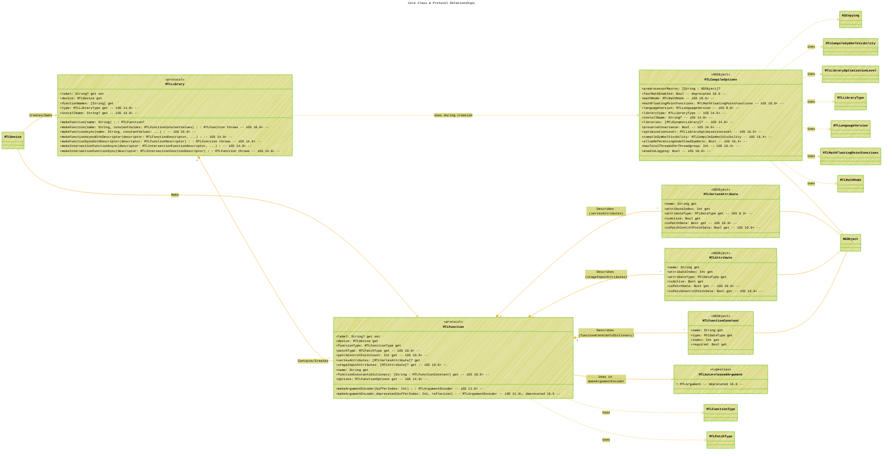
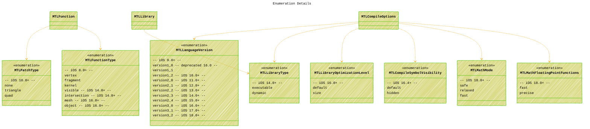

# Metal Function Library
> **Disclaimer:**
>
> This document contains my personal notes on the topic,
> compiled from publicly available documentation and various cited sources.
> The materials are intended for educational purposes, personal study, and reference.
> The content is dual-licensed:
> 1. **MIT License:** Applies to all code implementations (Swift, Mermaid, and other programming languages).
> 2. **Creative Commons Attribution 4.0 International License (CC BY 4.0):** Applies to all non-code content, including text, explanations, diagrams, and illustrations.
---

## Core Class & Protocol Relationships

This diagram shows the main protocols (`MTLFunction`, `MTLLibrary`) and the primary configuration class (`MTLCompileOptions`), along with their key properties and connections to supporting types.

**Explanation:**

*   This diagram focuses on the main types and their direct relationships.
*   `MTLLibrary` and `MTLFunction` are central protocols.
*   `MTLCompileOptions` holds configuration settings used when creating an `MTLLibrary`.
*   Auxiliary classes (`MTLVertexAttribute`, `MTLAttribute`, `MTLFunctionConstant`) provide metadata for `MTLFunction`.
*   Arrows indicate dependencies or creation/ownership relationships (e.g., `MTLLibrary` creates `MTLFunction`).
*   Dotted lines (`..>`) often indicate usage or association. Solid lines with composition (`*--`) show parts of a whole. Inheritance (`--|>`) and protocol conformance (`..>`) are also shown where base types are included.
*   Availability and deprecation are noted with `-- comments --`.

---

## Core Types, Protocols, and Relationships

This diagram shows the main protocols, classes, enumerations, and their interconnections, including properties, methods, and conformances. Availability and deprecation information are included as comments or notes where feasible.

**Explanation of Changes and Consolidation:**

1.  **Single Diagram Focus:** Merged the core types, enumerations, and error structure into one comprehensive class diagram. This makes relationships clearer.
2.  **Type Representation:** Used `<<protocol>>`, `<<open class>>`, `<<enumeration>>`, `<<struct>>`, `<<typealias>>` stereotypes for better type identification.
3.  **Full Signatures:** Included more complete method signatures in `MTLLibrary` and `MTLFunction`, showing parameters (`name`, `constantValues`, `descriptor`, `completionHandler`), return types (`-> (any MTLFunction)?`, `throws -> any MTLFunction`), and asynchronous variations (`async`, completion handlers).
4.  **Property Details:** Added ` { get }` or ` { get set }` to properties where specified in the code or implied by `open class` declarations.
5.  **Conformances:** Explicitly showed conformances like `NSObjectProtocol`, `NSCopying`, `Error`, `CustomNSError`, `Hashable`, and `@unchecked Sendable` (represented via stereotype or note).
6.  **Availability/Deprecations:** Incorporated availability (`%% iOS X.Y+ %%`) and deprecation comments (`%% Deprecated X.Y, msg: '...' %%`) directly within the type/member definitions where possible for conciseness. Added notes for more complex messages like the `MTLAutoreleasedArgument` deprecation.
7.  **External Types:** Added placeholders for types referenced but not defined in the snippet (e.g., `MTLDevice`, `MTLArgumentEncoder`, `MTLDataType`, `MTLDynamicLibrary`, `MTLFunctionConstantValues`, etc.) to show connections.
8.  **Relationship Clarity:** Refined relationship arrows (`-->` dependency/usage, `*-->` composition/creation, `o--` aggregation, `--|>` inheritance, `..>` conformance/realization) to better reflect the code's structure. For instance, `MTLLibrary` *creates/contains* `MTLFunction`, while `MTLCompileOptions` *uses* various enums.
9.  **Error Structure Integration:** Modeled `MTLLibraryError` as a struct conforming to relevant protocols and containing the `Code` enum. Referenced the standard `Error` and `CustomNSError` protocols.
10. **Theme and Layout:** Adjusted theme (`default` with variables) and layout (`direction LR`) for readability.

----

## Enumeration Details

This section lists the key enumerations and their possible values. Representing each as a small separate diagram can be verbose, so a combination of listing within the main diagram and a summary table is effective.

**Summary Table of Enumerations:**

| Enumeration                   | Purpose                                        | Key Cases (Examples)                               | Availability |
| :---------------------------- | :--------------------------------------------- | :------------------------------------------------- | :----------- |
| `MTLPatchType`                | Type of patch for tessellation                 | `none`, `triangle`, `quad`                         | iOS 10.0+    |
| `MTLFunctionType`             | Role of the shader function                    | `vertex`, `fragment`, `kernel`, `mesh`, `object` | iOS 8.0+     |
| `MTLLanguageVersion`          | MSL version standard                           | `version1_x`, `version2_x`, `version3_x`           | iOS 9.0+     |
| `MTLLibraryType`              | Type of compiled library                       | `executable`, `dynamic`                            | iOS 14.0+    |
| `MTLLibraryOptimizationLevel` | Compiler optimization goal                      | `default`, `size`                                  | iOS 16.0+    |
| `MTLCompileSymbolVisibility`  | Default visibility for symbols                 | `default`, `hidden`                                | iOS 16.4+    |
| `MTLMathMode`                 | Floating-point optimization strictness         | `safe`, `relaxed`, `fast`                          | iOS 18.0+    |
| `MTLMathFloatingPointFunctions` | Default single-precision math function library | `fast`, `precise`                                  | iOS 18.0+    |

---

## Typical Metal Shader Workflow

This flowchart shows the typical sequence of steps from writing shader code to using it in a pipeline.

**Explanation:** Shows the sequential steps, inputs at different stages, the central role of the `MTLDevice`, and potential error points.

---

## Asynchronous Function Creation

This sequence diagram illustrates the difference between synchronous and asynchronous function creation, highlighting the non-blocking nature of the latter.

**Explanation:** Contrasts the blocking nature of synchronous calls with the immediate return and background processing + callback mechanism of asynchronous calls.

---

## Evolution of Metal Features (Simplified Timeline)

This Gantt chart provides a simplified view of when major feature categories discussed (related to the code snippet) were introduced across iOS versions.

**Explanation:** Visually maps features to the approximate time (iOS major version release) they became available, emphasizing the framework's growth. *Note: Exact dates are approximate based on typical WWDC release cycles.*

---

## Compile-Time vs. Runtime Configuration/Specialization

This diagram contrasts the two main points of configuring shader behavior discussed.

**Explanation:** Clearly separates the two phases: `MTLCompileOptions` are applied when the *library* is created from source, influencing the compiled code globally. `MTLFunctionConstantValues` are applied later when retrieving a *specific function* from the library, allowing runtime-defined specialization of that function instance.

---

## Dynamic Library Concept

This diagram illustrates the creation and usage of Metal dynamic libraries.

**Explanation:** Breaks down the process into phases: creating the dynamic library with an `installName`, creating an executable library that *links* against the dynamic one (referencing it in compile options), and finally using a function from the executable library, triggering the runtime link to the dynamic library.

---

## Error Handling Context (Simplified)

This highlights where `MTLLibraryError` typically occurs within the workflow.

**Explanation:** A focused view showing the creation steps (`makeLibrary`, `makeFunction`) as the primary points where `MTLLibraryError` can be thrown, indicating potential failure modes.

---
## Error Handling Structure

This diagram shows the `MTLLibraryError` structure and its associated error codes.

**Explanation:**

*   Shows that methods in `MTLLibrary` can result in an `MTLLibraryError`.
*   The error object contains a `Code` enum specifying the type of error.
*   Lists the specific error codes defined.
*   References the `MTLLibraryErrorDomain` constant used to identify this error type within the `NSError` ecosystem.

---
**Licenses:**

- **MIT License:**   - Full text in [LICENSE](LICENSE) file.
- **Creative Commons Attribution 4.0 International:**  - Legal details in [LICENSE-CC-BY](LICENSE-CC-BY) and at [Creative Commons official site](http://creativecommons.org/licenses/by/4.0/).

---