---

# NSImage - AppKit
> This content is dual-licensed under your choice of the following licenses:
> 1.  **MIT License:** For the code implementations in Swift and Mermaid provided in this document.
> 2.  **Creative Commons Attribution 4.0 International License (CC BY 4.0):** For all other content, including the text, explanations, and the Mermaid diagrams and illustrations.

---

## **1. Class Structure and Hierarchy**

### **a. Core Class Diagram**
- **Purpose**: Illustrate the primary structure of `NSImage`, including its properties, methods, and enumerations.
- **Diagram Type**: `classDiagram`
- **Contents**:
  - **Properties**: Key attributes like `size`, `isTemplate`, `name`, etc.
  - **Methods**: Essential functions like initializers, `draw(at:)`, `tiffRepresentation()`, etc.
  - **Enumerations**: Nested enums such as `ResizingMode`, `Interpolation`.

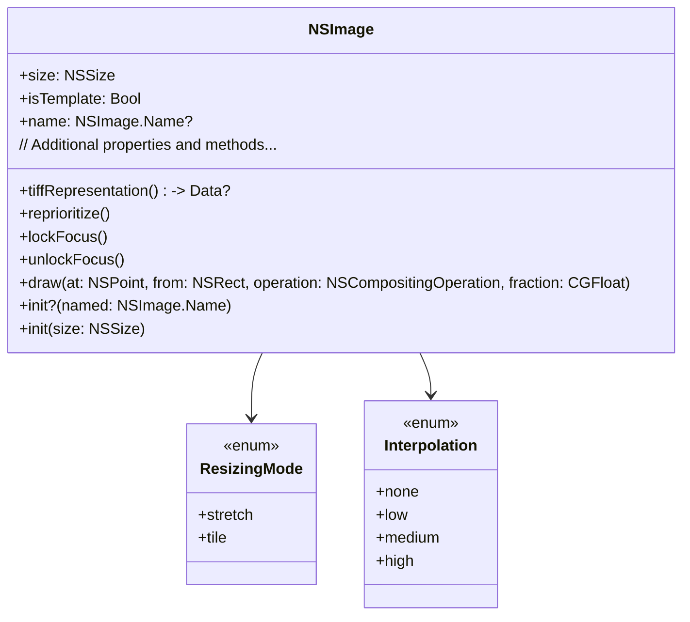

---

## **2. Initializers Overview**

### **a. Initialization Methods Diagram**
- **Purpose**: Break down the various ways to instantiate `NSImage`.
- **Diagram Type**: `flowchart LR`
- **Contents**:
  - **Asset-Based Initializers**: `init?(named:)`
  - **Size-Based Initializers**: `init(size:)`
  - **Data-Based Initializers**: `init(data:)`
  - **File-Based Initializers**: `init(contentsOf:)`
  - **Copy Initializers**: `init(byReferencing:)`, `init(byCopying:)`

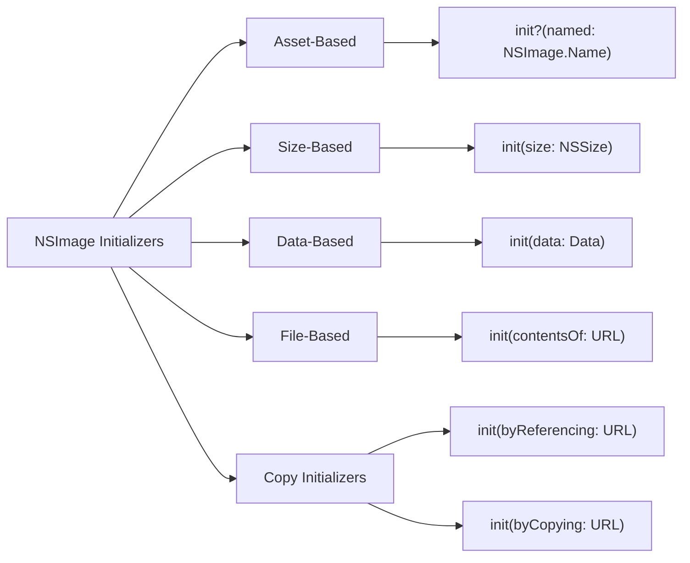

---

## **3. Properties Breakdown**

### **a. Key Properties Diagram**
- **Purpose**: Detail the main properties of `NSImage`.
- **Diagram Type**: `classDiagram`
- **Contents**:
  - **Image Data**: `size`, `isTemplate`, `name`
  - **Rendering Attributes**: `resizingMode`, `interpolation`
  - **Caching and Optimization**: `cacheMode`, `resizingHandler`
  - **Asset Management**: `representations`, `bestRepresentation(for:)`

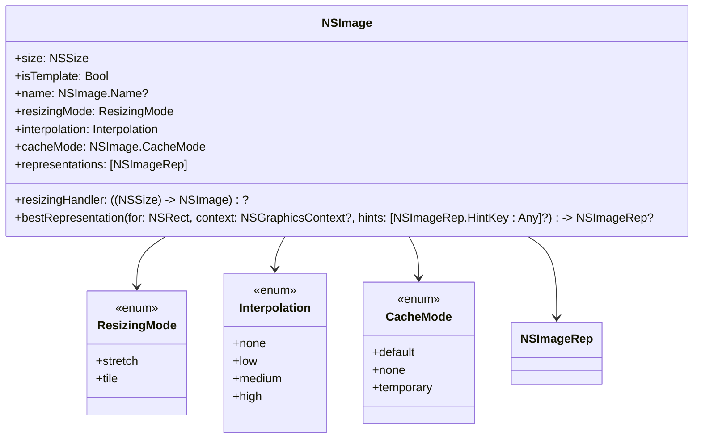

---

## **4. Methods Grouped by Functionality**

### **a. Image Manipulation Methods**
- **Purpose**: Categorize methods based on their roles in image manipulation.
- **Diagram Type**: `flowchart TD`
- **Contents**:
  - **Drawing Methods**: `draw(at:from:operation:fraction:)`, `draw(in:from:operation:fraction:respectFlipped:hints:)`
  - **Resizing & Scaling**: `resized(to:)`, `scale(by:)`
  - **Rendering Modes**: `lockFocus()`, `unlockFocus()`
  - **Image Representations**: `addRepresentation(_:)`, `removeRepresentation(_:)`
  - **Tiff Representations**: `tiffRepresentation()`, `tiffRepresentation(using:factor:)`

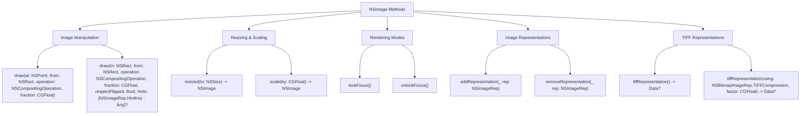

---

## **5. Enumerations and Configurations**

### **a. Enumerations Diagram**
- **Purpose**: Highlight the enums used within `NSImage` and their possible values.
- **Diagram Type**: `classDiagram`
- **Contents**:
  - **ResizingMode**
  - **Interpolation**
  - **CacheMode**
  - **TIFFCompression**

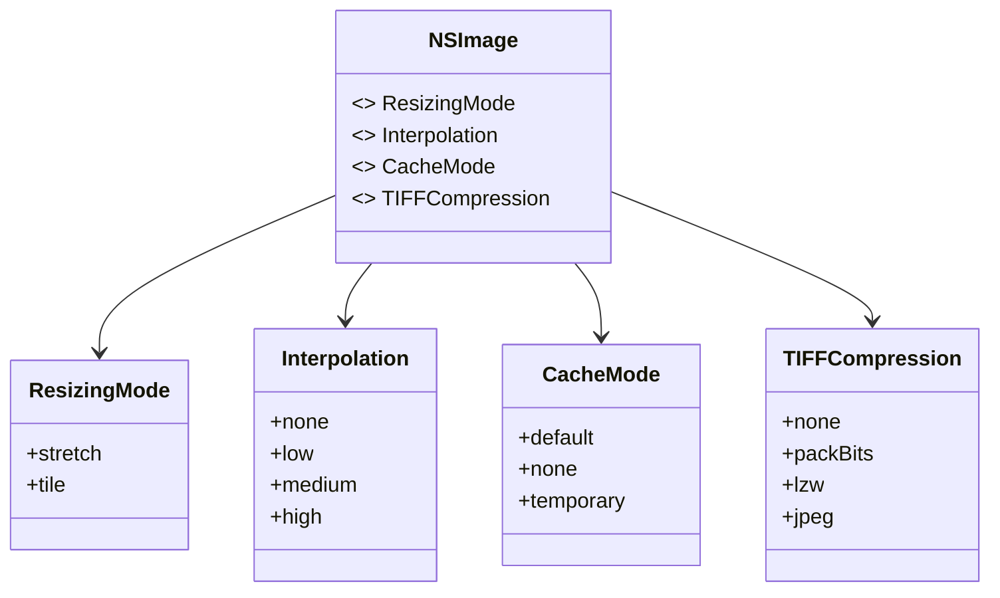

### **b. Configuration Classes Diagram**
- **Purpose**: Show the relationship between `NSImage` and its configuration classes.
- **Diagram Type**: `classDiagram`
- **Contents**:
  - **NSImageRep**
  - **NSBitmapImageRep**

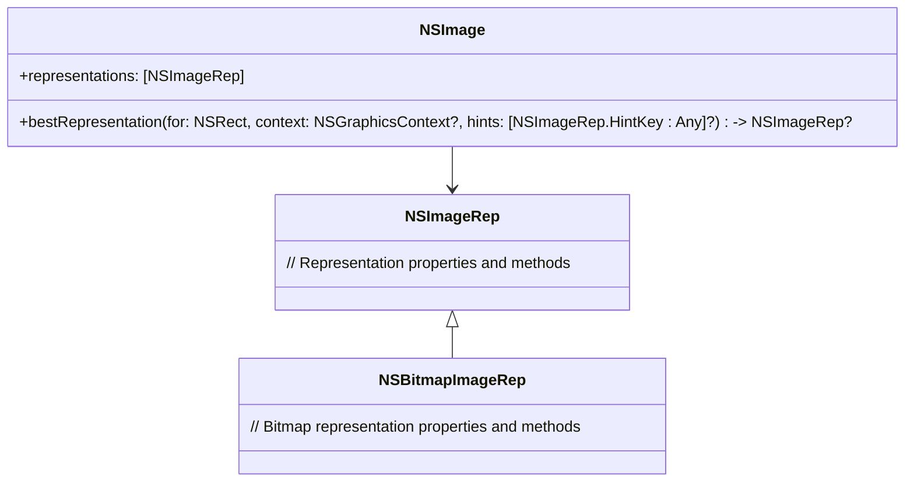

---

## **6. Protocol Conformances**

### **a. Protocols Diagram**
- **Purpose**: Display the protocols that `NSImage` conforms to and their impact.
- **Diagram Type**: `classDiagram`
- **Contents**:
  - **NSSecureCoding**
  - **NSCopying**
  - **NSItemProviderReading**
  - **NSItemProviderWriting**
  - **Sendable**

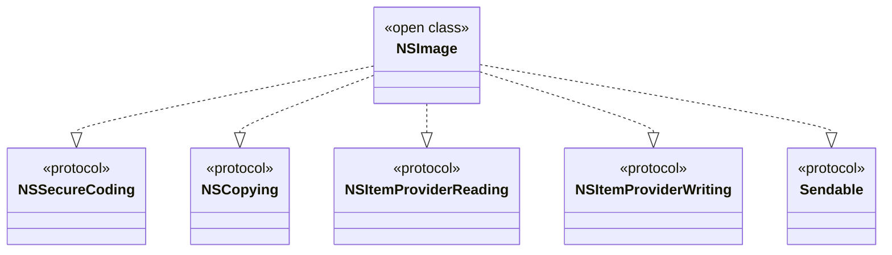

---

## **7. Relationships with Other Classes**

### **a. Related Classes Diagram**
- **Purpose**: Illustrate how `NSImage` interacts with other AppKit classes and frameworks.
- **Diagram Type**: `flowchart TD`
- **Contents**:
  - **NSImageView**: Displays `NSImage`.
  - **NSTextAttachment**: Embeds `NSImage` within text.
  - **NSBitmapImageRep & NSCIImageRep**: Image representations.
  - **NSGraphicsContext**: Drawing context.
  - **NSURL**: Resource loading.
  - **NSWorkspace**: Handling image resources.
  - **NSUserDefaults**: Caching preferences.
  - **NSPasteboard**: Drag-and-drop or copy-paste functionalities.

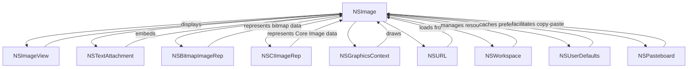

---

## **8. Extensions and Additional Functionalities**

### **a. NSImage Extensions Diagram**
- **Purpose**: Showcase the additional functionalities provided through extensions.
- **Diagram Type**: `classDiagram`
- **Contents**:
  - **Resizing Extensions**
  - **Tinting Extensions**
  - **Symbol Image Extensions**
  - **Helper Functions**

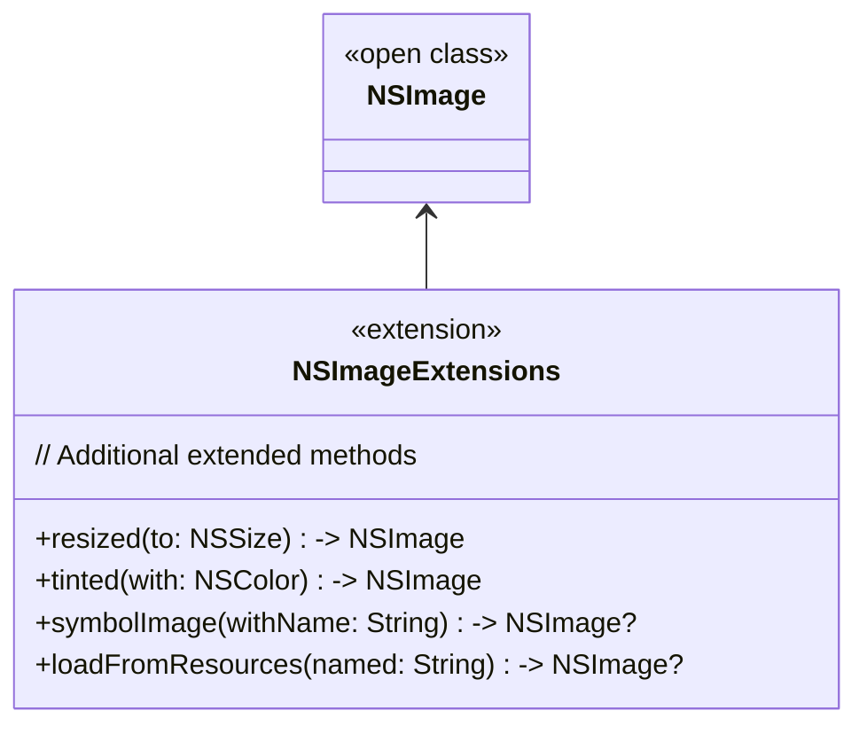

### **b. Extensions Functionalities Flowchart**
- **Purpose**: Detail specific extended methods and their purposes.
- **Diagram Type**: `flowchart LR`
- **Contents**:
  - **Resizing Images**
  - **Tinting Images**
  - **Creating Symbol Images**
  - **Loading from Resources**

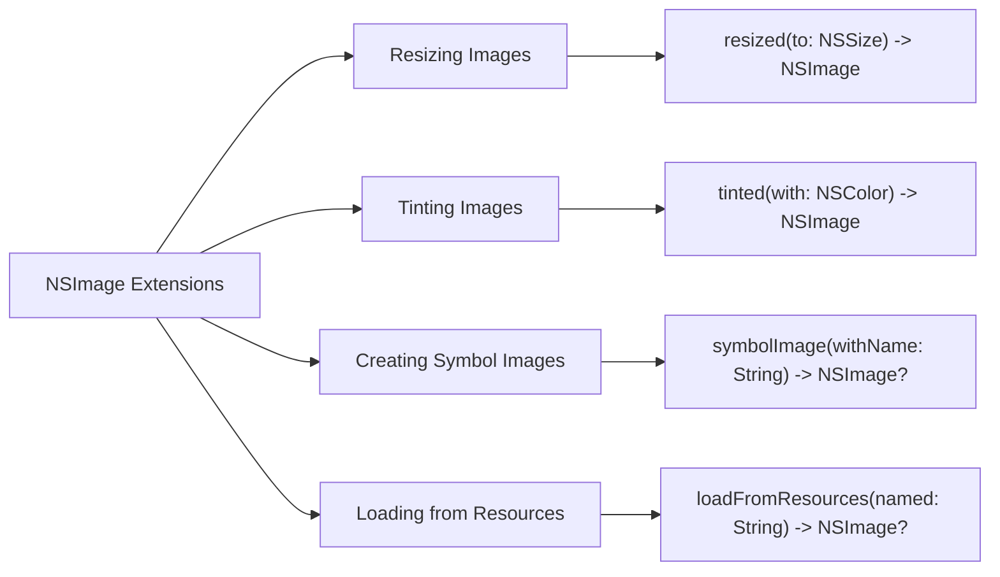

---

## **9. Lifecycle and Use Cases**

### **a. Lifecycle Flowchart**
- **Purpose**: Demonstrate the typical lifecycle of an `NSImage` within an application.
- **Diagram Type**: `flowchart TD`
- **Contents**:
  - **Initialization**
  - **Manipulation**
  - **Rendering**
  - **Encoding & Storage**
  - **Caching**
  - **Display**
  - **Release**

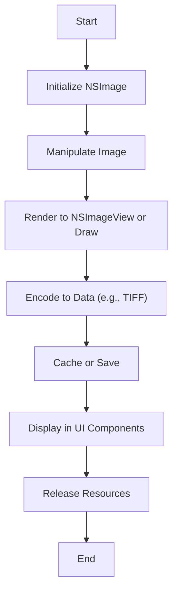

### **b. Common Use Cases Diagram**
- **Purpose**: Outline the typical scenarios where `NSImage` is utilized.
- **Diagram Type**: `flowchart TD`
- **Contents**:
  - **Displaying Static Images**
  - **Displaying Animated Images**
  - **Image Processing**
  - **Creating Custom Icons**
  - **Drag-and-Drop Operations**
  - **Copy-Paste Functionality**
  - **Thumbnail Generation**

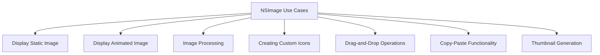

---

## **10. Feature Availability Timeline**

### **a. Feature Availability Gantt Chart**
- **Purpose**: Show when various `NSImage` features were introduced across macOS versions.
- **Diagram Type**: `gantt`
- **Contents**:
  - **macOS Versions**: 10.0, 10.5, 10.7, 10.10, 10.13, 10.15, 11.0, 12.0, 13.0
  - **Features Introduced**: Basic initialization, image representations, symbol images, tinting, Core Image integration, high-resolution support, animated images, symbol configurations, HDR support.

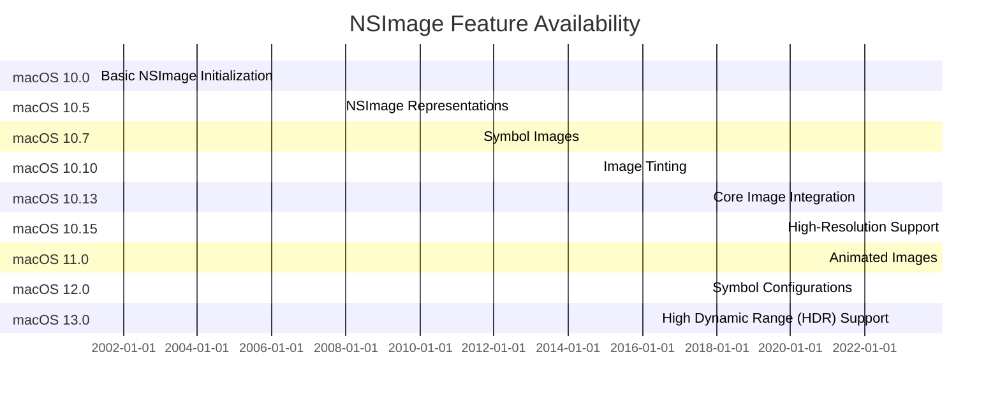

---

## **11. Data Handling and Formats**

### **a. Image Format Handling Diagram**
- **Purpose**: Explain how `NSImage` handles different image data formats.
- **Diagram Type**: `graph LR`
- **Contents**:
  - **TIFF**: `tiffRepresentation()`
  - **PNG**: `pngRepresentation()`
  - **JPEG**: `jpegRepresentation(compressionFactor:)`
  - **HEIF**: `heifRepresentation()`

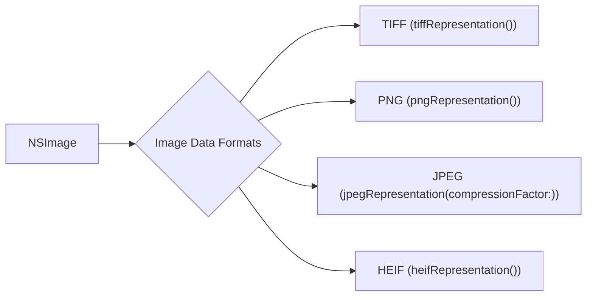

---

## **12. Integration with Drawing Contexts**

### **a. Drawing Methods Usage Diagram**
- **Purpose**: Show how `NSImage` methods are used within drawing contexts.
- **Diagram Type**: `flowchart TD`
- **Contents**:
  - **Drawing at Point**
  - **Drawing with Compositing Operation**
  - **Drawing in Rectangle**
  - **Drawing as Pattern**

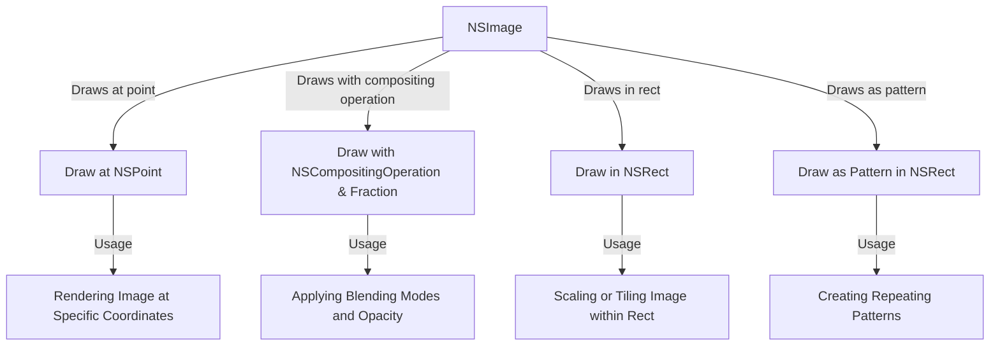

---

## **13. Summary and Best Practices**

### **a. Summary Diagram**
- **Purpose**: Provide a high-level overview of `NSImage`'s key characteristics and functionalities.
- **Diagram Type**: `graph LR`
- **Contents**:
  - **Versatile Initialization**
  - **Advanced Rendering Options**
  - **Performance Optimizations**
  - **High Dynamic Range Support**
  - **Seamless Integration with AppKit**

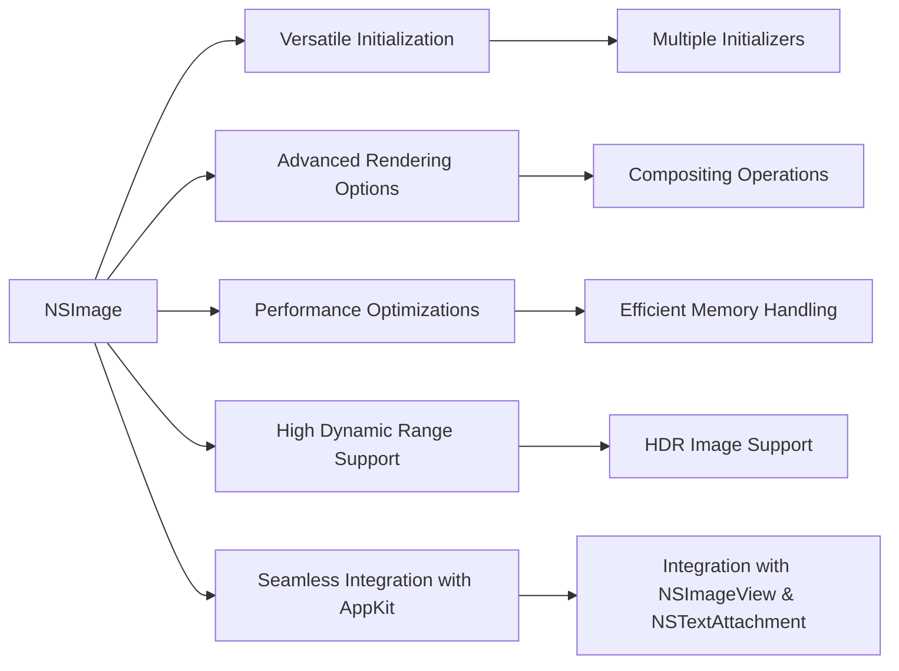

---

## **Additional Diagrams for AppKit Framework**

Given the breadth of the AppKit framework, below are additional diagrams covering other essential classes and their interactions. These diagrams provide a deeper insight into the AppKit ecosystem, enhancing understanding and facilitating better architectural decisions.

### **14. AppKit Framework Overview**

#### **a. AppKit Core Classes Diagram**
- **Purpose**: Showcase the core classes within the AppKit framework and their primary relationships.
- **Diagram Type**: `classDiagram`
- **Contents**:
  - **NSWindow**
  - **NSView**
  - **NSViewController**
  - **NSTextField**
  - **NSButton**
  - **NSImage**
  - **NSApplication**
  - **NSMenu**

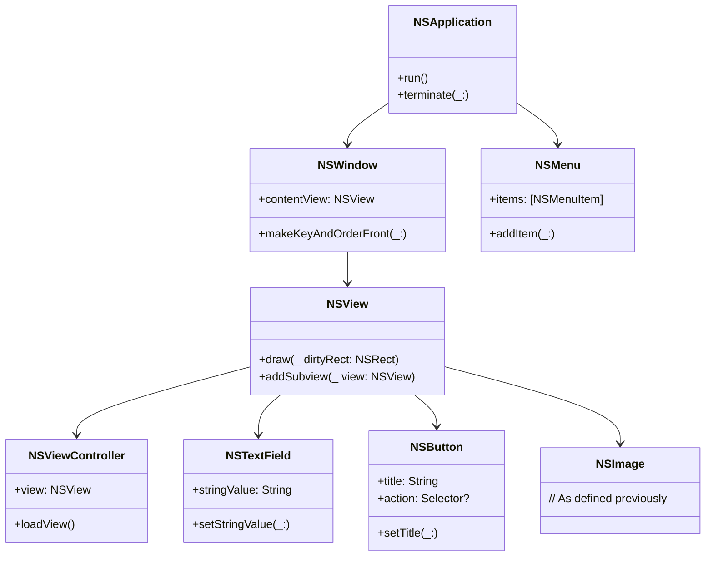

### **15. Event Handling in AppKit**

#### **a. Event Handling Flowchart**
- **Purpose**: Illustrate how user events are handled within the AppKit framework.
- **Diagram Type**: `flowchart TD`
- **Contents**:
  - **Event Generation**
  - **NSApplication Event Loop**
  - **Responder Chain**
  - **Event Handling by NSView/NSViewController**

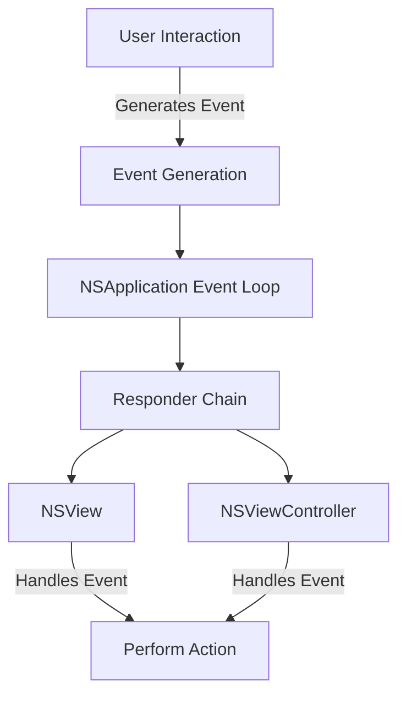

### **16. Drawing and Graphics**

#### **a. Drawing Pipeline Diagram**
- **Purpose**: Explain the drawing pipeline within AppKit and how `NSImage` integrates into it.
- **Diagram Type**: `flowchart LR`
- **Contents**:
  - **NSView**: Triggering draw
  - **NSGraphicsContext**: Current graphics context
  - **NSImage Rendering**
  - **Low-Level Drawing Operations**

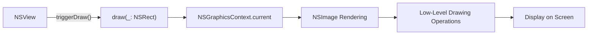

---

## **Best Practices for Using NSImage in AppKit**

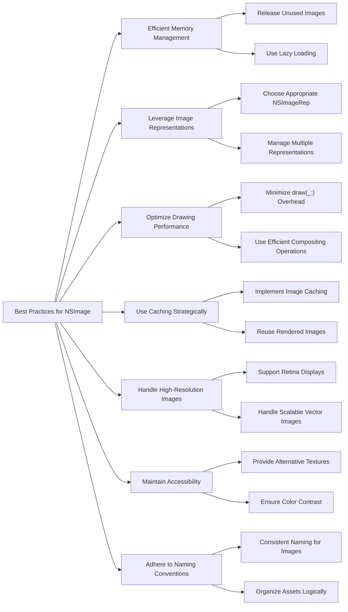

---
**Licenses:**

- **MIT License:**   - Full text in [LICENSE](LICENSE) file.
- **Creative Commons Attribution 4.0 International:**  - Legal details in [LICENSE-CC-BY](LICENSE-CC-BY) and at [Creative Commons official site](http://creativecommons.org/licenses/by/4.0/).

---