# NSIndexPath
> This content is dual-licensed under your choice of the following licenses:
> 1.  **MIT License:** For the code implementations in Swift and Mermaid provided in this document.
> 2.  **Creative Commons Attribution 4.0 International License (CC BY 4.0):** For all other content, including the text, explanations, and the Mermaid diagrams and illustrations.

---

Below is a comprehensive and organized set of Mermaid diagrams for the `NSIndexPath` class. This documentation covers various aspects of `NSIndexPath`, including its structure, initializers, properties, methods, protocol conformances, relationships, extensions, lifecycle, feature availability, data handling, and best practices.

---

## **1. Class Structure and Hierarchy**

### **a. Core Class Diagram**
- **Purpose**: Illustrate the primary structure of `NSIndexPath`, including its properties, methods, and enumerations.
- **Diagram Type**: `classDiagram`
- **Contents**:
  - **Properties**: Key attributes like `indexPath`, `row`, `section`, etc.
  - **Methods**: Essential functions like initializers, `compare()`, `isEqual()`, etc.
  - **Enumerations**: While `NSIndexPath` doesn't have nested enums, we can include related enumerations if applicable.

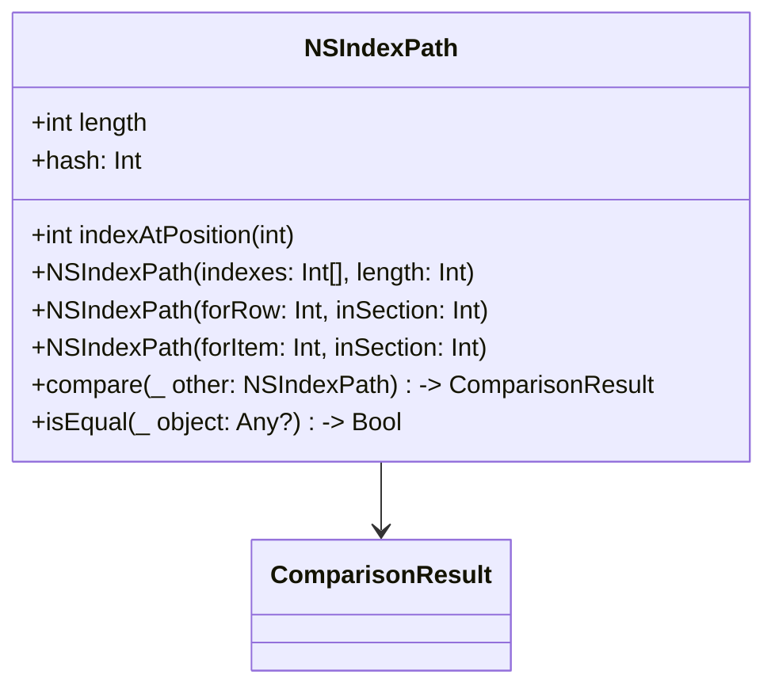

---

## **2. Initializers Overview**

### **a. Initialization Methods Diagram**
- **Purpose**: Break down the various ways to instantiate `NSIndexPath`.
- **Diagram Type**: `flowchart` or `graph LR`
- **Contents**:
  - **Direct Initializers**: `init(indexes:length:)`, `init(forRow:inSection:)`, `init(forItem:inSection:)`
  - **Convenience Initializers**: Factory methods like `indexPath(forRow:inSection:)`, `indexPath(forItem:inSection:)`

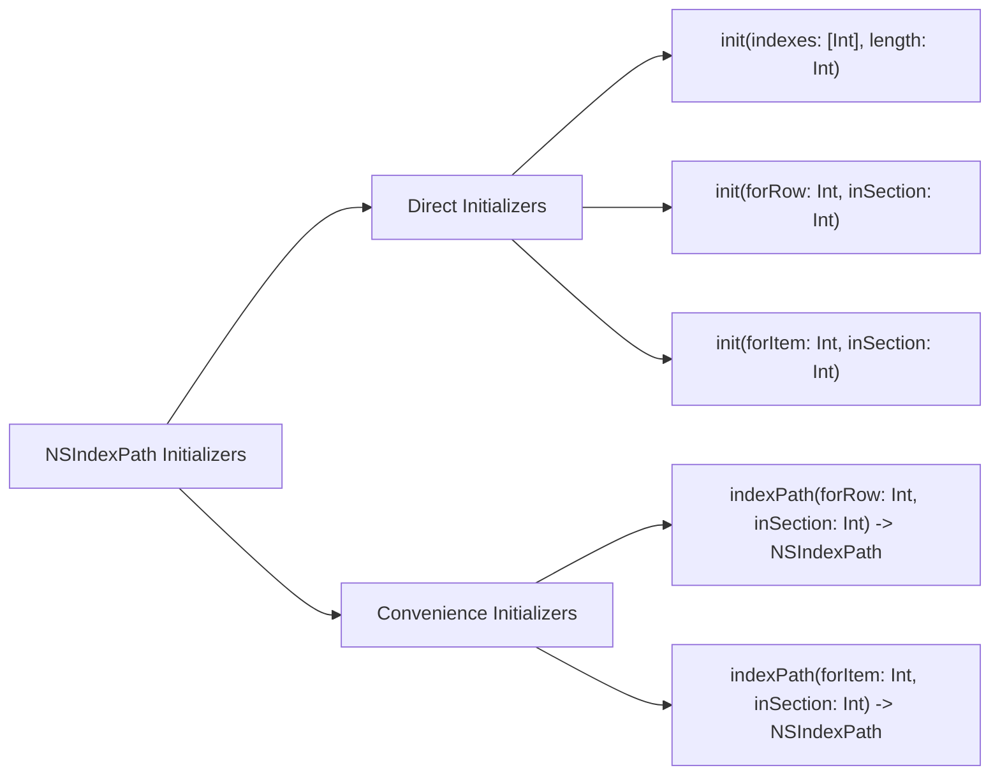

---

## **3. Properties Breakdown**

### **a. Key Properties Diagram**
- **Purpose**: Detail the main properties of `NSIndexPath`.
- **Diagram Type**: `classDiagram` or `graph LR`
- **Contents**:
  - **Path Information**: `length`, `indexAtPosition(_:)`
  - **Convenience Properties**: `row`, `section`, `item`

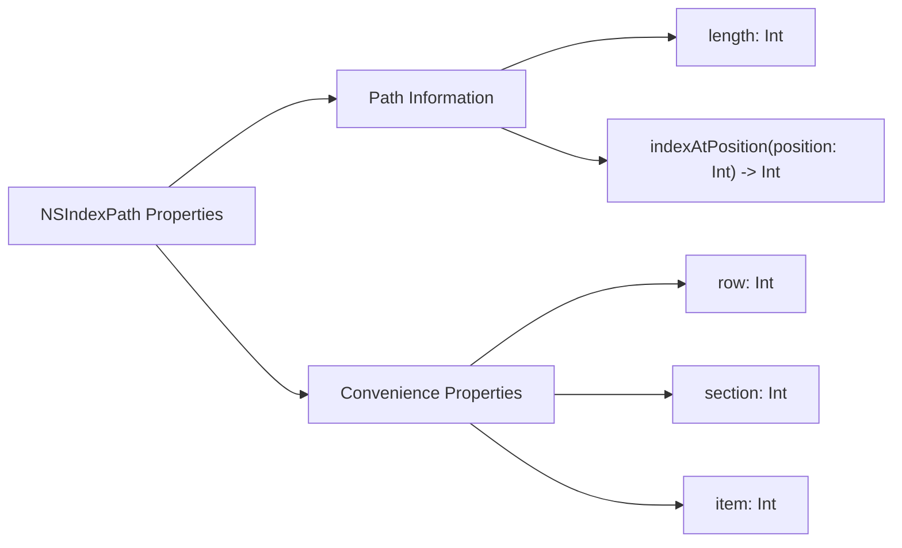


---

## **4. Methods Grouped by Functionality**

### **a. Comparison Methods**
- **Purpose**: Categorize methods based on their roles in comparing index paths.
- **Diagram Type**: `flowchart TD`
- **Contents**:
  - **Comparison**: `compare(_:)`, `isEqual(_:)`
  - **Hashing**: `hash`

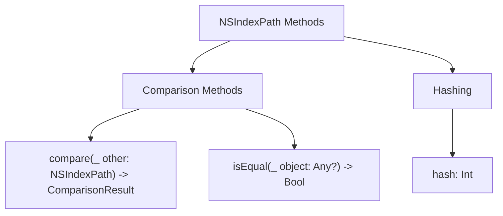

---

## **5. Enumerations and Configurations**

### **a. Enumerations Diagram**
- **Purpose**: Highlight the enums related to `NSIndexPath` and their possible values.
- **Diagram Type**: `classDiagram`
- **Contents**:
  - **ComparisonResult**: The result of a comparison operation.

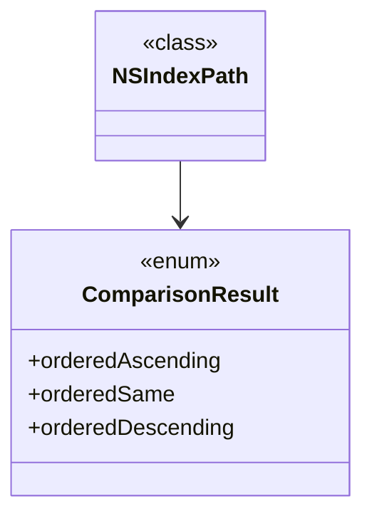

---

## **6. Protocol Conformances**

### **a. Protocols Diagram**
- **Purpose**: Display the protocols that `NSIndexPath` conforms to and their impact.
- **Diagram Type**: `classDiagram`
- **Contents**:
  - **NSCopying**
  - **NSSecureCoding**
  - **Equatable**
  - **Hashable**
  - **Codable**

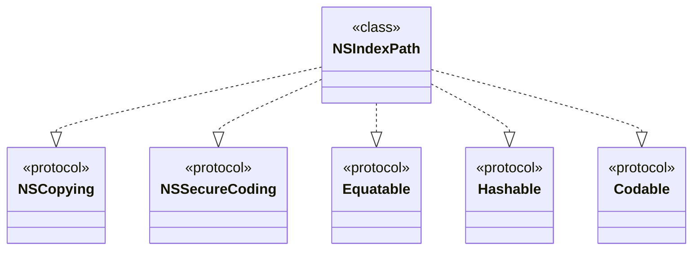

---

## **7. Relationships with Other Classes**

### **a. Related Classes Diagram**
- **Purpose**: Illustrate how `NSIndexPath` interacts with other UIKit classes and frameworks.
- **Diagram Type**: `flowchart TD`
- **Contents**:
  - **UITableView**: Uses `NSIndexPath` for cell identification.
  - **UICollectionView**: Uses `NSIndexPath` for item identification.
  - **NSCoder**: Utilized in encoding and decoding index paths.
  - **NSString/NSNumber**: For representing index components.
  - **NSArray**: To manage multiple indices.
  - **Foundation Classes**: General interactions.

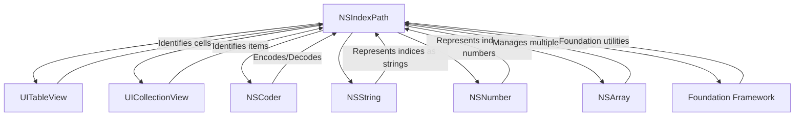

---

## **8. Extensions and Additional Functionalities**

### **a. NSIndexPath Extensions Diagram**
- **Purpose**: Showcase the additional functionalities provided through extensions.
- **Diagram Type**: `classDiagram`
- **Contents**:
  - **Convenience Initializers**
  - **Utility Methods**

## TODO: Fix diagram syntax error

```mermaid
classDiagram
    class NSIndexPath {
        <<class>>
    }

    class NSIndexPathExtensions {
        <<extension>>
        +static func indexPath(forRow row: Int, inSection section: Int) -> NSIndexPath
        +static func indexPath(forItem item: Int, inSection section: Int) -> NSIndexPath
        +var row: Int { get }
        +var section: Int { get }
        +var item: Int { get }
    }

    NSIndexPath <-- NSIndexPathExtensions
    
```

### **b. Extensions Functionalities Flowchart**
- **Purpose**: Detail specific extended methods and their purposes.
- **Diagram Type**: `flowchart LR`
- **Contents**:
  - **Convenience Initializers**
  - **Computed Properties**

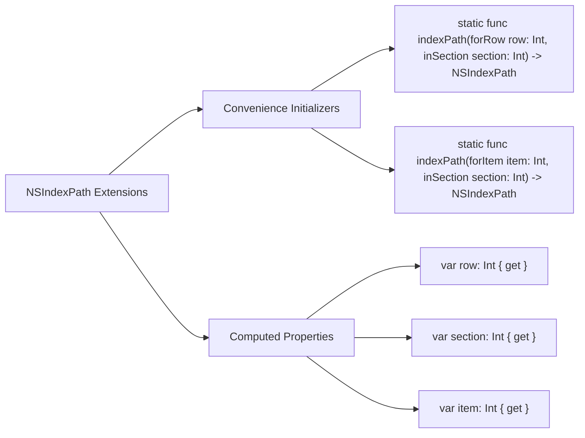

---

## **9. Lifecycle and Use Cases**

### **a. Lifecycle Flowchart**
- **Purpose**: Demonstrate the typical lifecycle of an `NSIndexPath` within an application.
- **Diagram Type**: `flowchart TD`
- **Contents**:
  - **Initialization**
  - **Usage in Data Sources**
  - **Cell Configuration**
  - **User Interaction Handling**
  - **Deallocation**

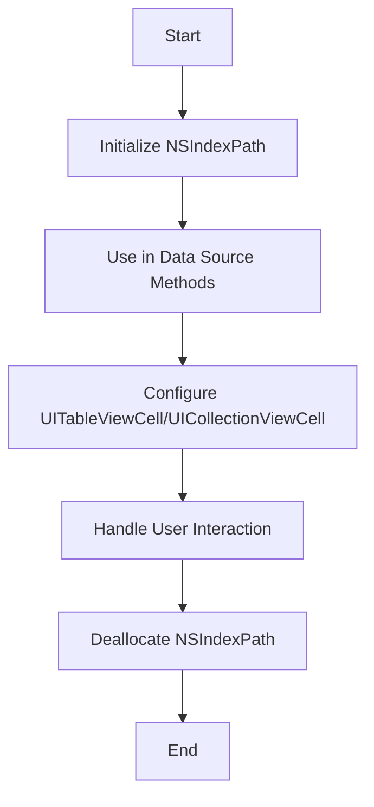

### **b. Common Use Cases Diagram**
- **Purpose**: Outline the typical scenarios where `NSIndexPath` is utilized.
- **Diagram Type**: `flowchart TD`
- **Contents**:
  - **UITableView Data Source**
  - **UICollectionView Data Source**
  - **Navigating Nested Data Structures**
  - **Managing Selections**
  - **Batch Updates**
  - **Animated Transitions**

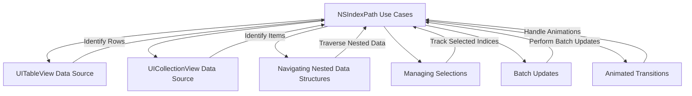

---

## **10. Feature Availability Timeline**

### **a. Feature Availability Gantt Chart**
- **Purpose**: Show when various `NSIndexPath` features were introduced across iOS versions.
- **Diagram Type**: `gantt`
- **Contents**:
  - **iOS Versions**: 2.0, 3.0, 4.0, 5.0, 6.0, 7.0, 8.0, 9.0, 10.0, 11.0, 12.0, 13.0, 14.0, 15.0, 16.0, 17.0
  - **Features Introduced**: Initializers, convenience methods, support for UICollectionView, indexing optimizations, etc.

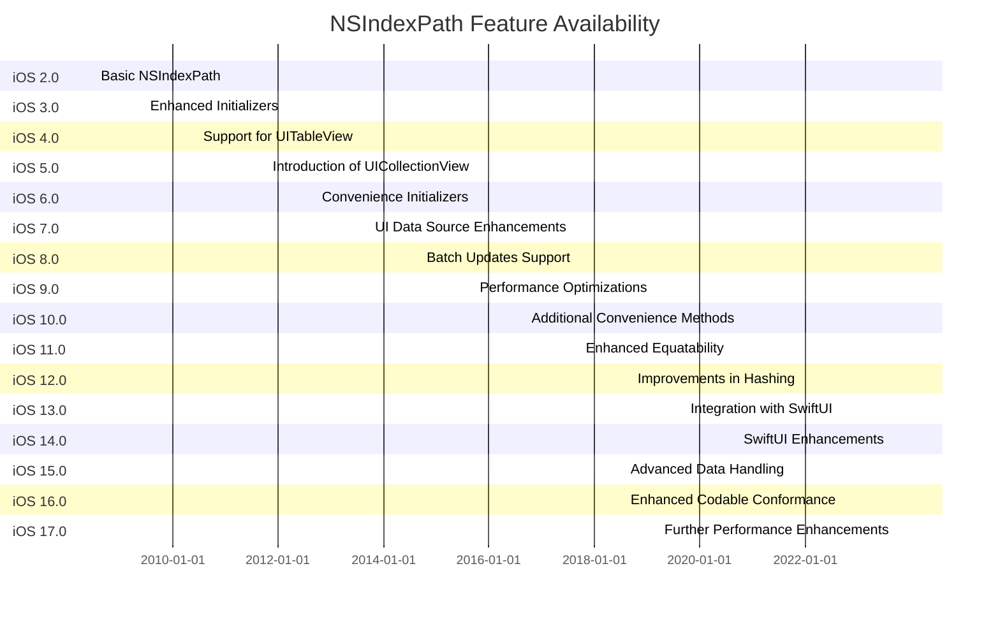

---

## **11. Data Handling and Formats**

### **a. Index Path Handling Diagram**
- **Purpose**: Explain how `NSIndexPath` manages different index data.
- **Diagram Type**: `graph LR`
- **Contents**:
  - **Single-Level Indexing**: `row`, `section`
  - **Multi-Level Indexing**: Extending beyond tables and collections
  - **Encoding & Decoding**: Serialization for persistence

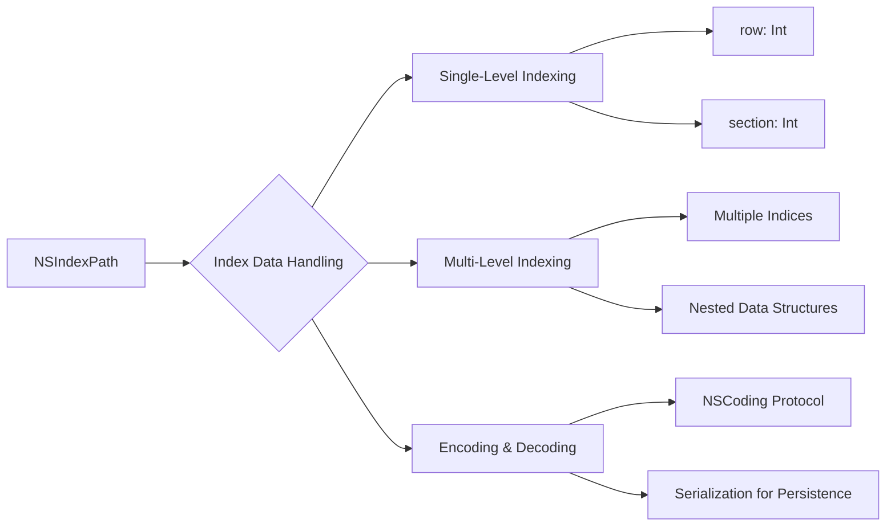

---

## **12. Integration with UIKit Components**

### **a. UITableView and UICollectionView Integration Diagram**
- **Purpose**: Show how `NSIndexPath` integrates with key UIKit components.
- **Diagram Type**: `flowchart TD`
- **Contents**:
  - **UITableView**
  - **UICollectionView**
  - **Data Source Methods**
  - **Delegate Methods**

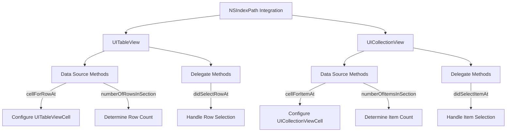

---

## **13. Summary and Best Practices**

### **a. Summary Diagram**
- **Purpose**: Provide a high-level overview of `NSIndexPath`'s key characteristics and functionalities.
- **Diagram Type**: `graph LR`
- **Contents**:
  - **Versatile Indexing**
  - **Seamless UIKit Integration**
  - **Efficient Data Handling**
  - **Protocol Conformances**
  - **Performance Optimizations**

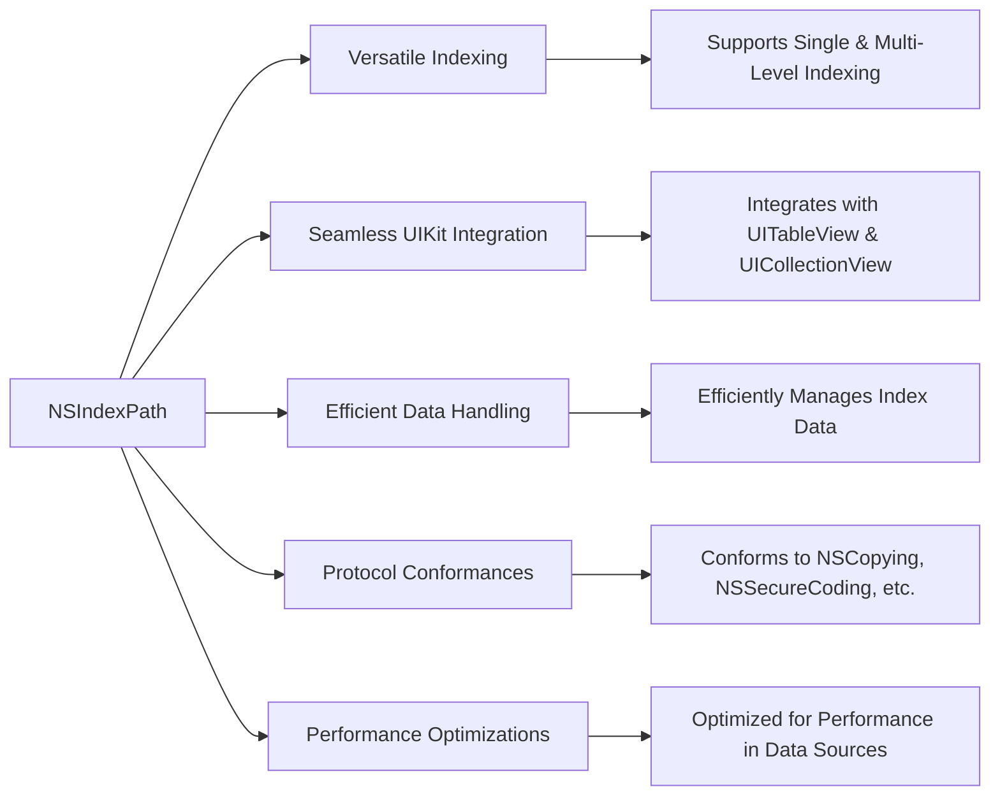

---

## **Best Practices for Using NSIndexPath**

- **Reuse Index Paths**: Avoid creating new `NSIndexPath` instances unnecessarily. Reuse existing index paths when possible to optimize performance.
  
- **Thread Safety**: Ensure that `NSIndexPath` instances are accessed on the main thread when interacting with UIKit components.
  
- **Immutable Usage**: Treat `NSIndexPath` instances as immutable. Do not attempt to modify their indices after creation.
  
- **Utilize Convenience Initializers**: Use provided convenience initializers for creating index paths, which enhance code readability and reduce errors.
  
- **Leverage Protocol Conformances**: Utilize `Equatable` and `Hashable` conformances for comparing and storing index paths in collections like dictionaries or sets.

---

## **Conclusion**

The `NSIndexPath` class is a fundamental component in iOS development, particularly when working with `UITableView` and `UICollectionView`. Understanding its structure, methods, and integrations is essential for efficient and effective UI development. The diagrams provided offer a visual representation of `NSIndexPath`'s functionalities, aiding in better comprehension and utilization within your projects.

---
