# Passkeys
> This content is dual-licensed under your choice of the following licenses:
> 1.  **MIT License:** For the code implementations in Swift and Mermaid provided in this document.
> 2.  **Creative Commons Attribution 4.0 International License (CC BY 4.0):** For all other content, including the text, explanations, and the Mermaid diagrams and illustrations.

---

Below is a comprehensive and organized set of Mermaid diagrams for the **`Passkeys`** framework. These diagrams cover various aspects of the `Passkeys` framework, including class structures, initializers, properties, methods, enumerations, protocol conformances, relationships with other classes, extensions, lifecycle, feature availability, data handling, integration with contexts, and best practices.

---

## **1. Class Structure and Hierarchy**

### **a. Core Class Diagram**
- **Purpose**: Illustrate the primary structure of the `Passkeys` framework, including its key classes, properties, methods, and enumerations.
- **Diagram Type**: `classDiagram`
- **Contents**:
  - **Classes**: `ASAuthorizationController`, `ASAuthorizationPasskeyCredential`, `ASAuthorizationProvider`, etc.
  - **Properties**: Key attributes like `delegate`, `presentationContextProvider`, etc.
  - **Methods**: Essential functions like `performRequests()`, `cancel()`, etc.
  - **Enumerations**: Nested enums such as `ASAuthorizationError.Code`, `ASAuthorizationPasswordProviderAuthorizationStatus`, etc.

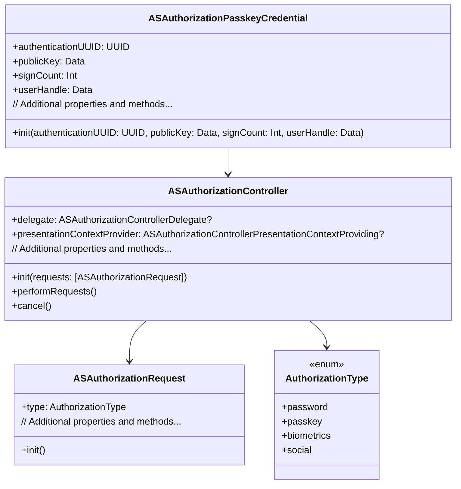

---

## **2. Initializers Overview**

### **a. Initialization Methods Diagram**
- **Purpose**: Break down the various ways to instantiate key classes within the `Passkeys` framework.
- **Diagram Type**: `flowchart LR`
- **Contents**:
  - **ASAuthorizationController Initializers**
  - **ASAuthorizationPasskeyCredential Initializers**
  - **ASAuthorizationProvider Initializers**

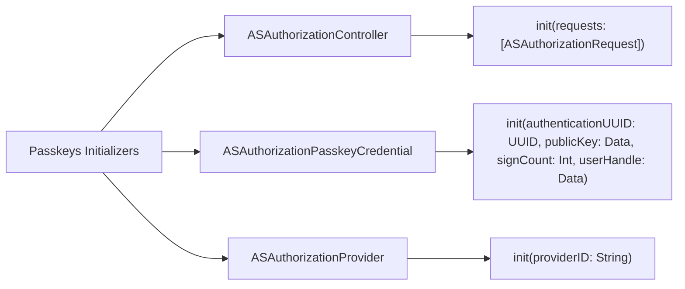

---

## **3. Properties Breakdown**

### **a. Key Properties Diagram**
- **Purpose**: Detail the main properties of key classes within the `Passkeys` framework.
- **Diagram Type**: `graph LR`
- **Contents**:
  - **ASAuthorizationController Properties**
  - **ASAuthorizationPasskeyCredential Properties**
  - **ASAuthorizationRequest Properties**

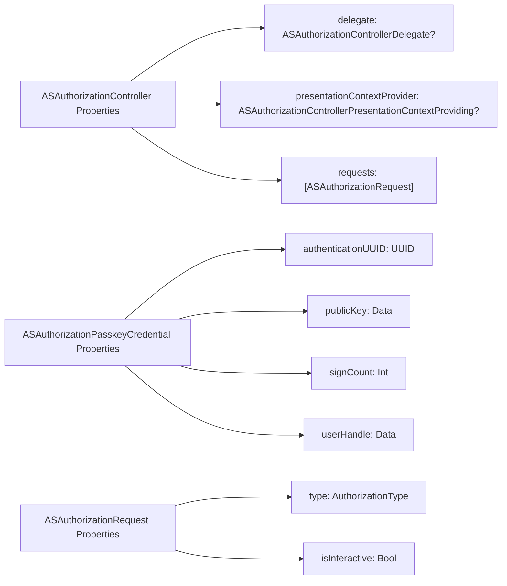

---

## **4. Methods Grouped by Functionality**

### **a. Authorization Methods**
- **Purpose**: Categorize methods based on their roles in the authorization process.
- **Diagram Type**: `flowchart TD`
- **Contents**:
  - **Managing Requests**
  - **Handling Responses**
  - **Cancellation**

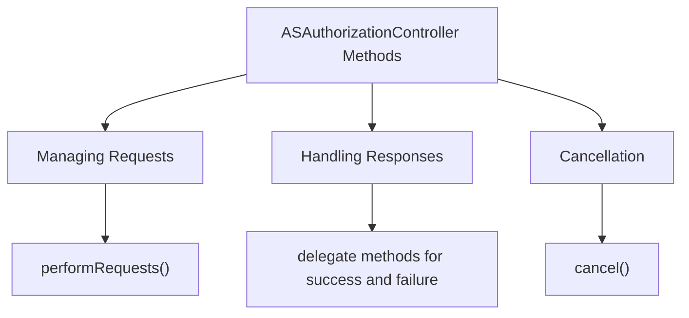

---

## **5. Enumerations and Configurations**

### **a. Enumerations Diagram**
- **Purpose**: Highlight the enums used within the `Passkeys` framework and their possible values.
- **Diagram Type**: `classDiagram`
- **Contents**:
  - **AuthorizationType**
  - **ASAuthorizationError.Code**
  - **ASAuthorizationPasswordProviderAuthorizationStatus**

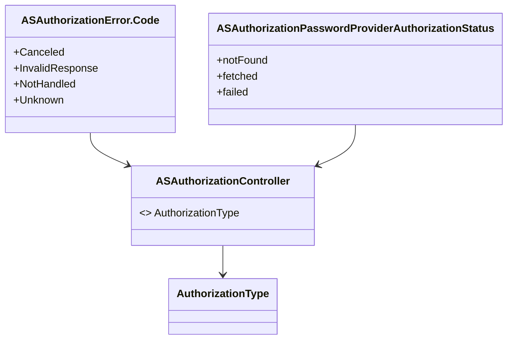

### **b. Configuration Classes Diagram**
- **Purpose**: Show the relationship between key classes and their configuration setups.
- **Diagram Type**: `classDiagram`
- **Contents**:
  - **ASAuthorizationController Configuration**
  - **ASAuthorizationProvider Configuration**

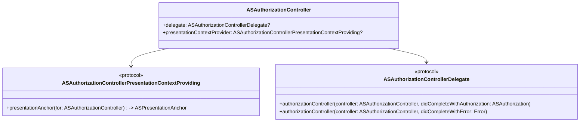

---

## **6. Protocol Conformances**

### **a. Protocols Diagram**
- **Purpose**: Display the protocols that key classes conform to and their impact.
- **Diagram Type**: `classDiagram`
- **Contents**:
  - **ASAuthorizationControllerPresentationContextProviding**
  - **ASAuthorizationControllerDelegate**
  - **NSSecureCoding**
  - **NSItemProviderReading**
  - **NSItemProviderWriting**

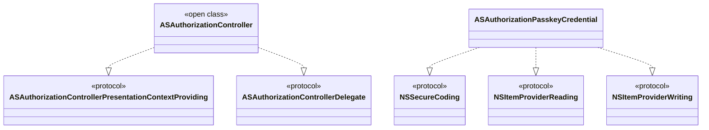

---

## **7. Relationships with Other Classes**

### **a. Related Classes Diagram**
- **Purpose**: Illustrate how `Passkeys` classes interact with other iOS frameworks and classes.
- **Diagram Type**: `flowchart TD`
- **Contents**:
  - **ASAuthorizationController**: Interfaces with `UIViewController` for presentation.
  - **ASAuthorizationPasskeyCredential**: Works with `NSURLSession` for network requests.
  - **AuthenticationServices Framework**: Integrates with `Keychain` for secure storage.
  - **CryptoKit**: Utilizes for cryptographic operations.
  - **SwiftUI**: Can be used within SwiftUI views.

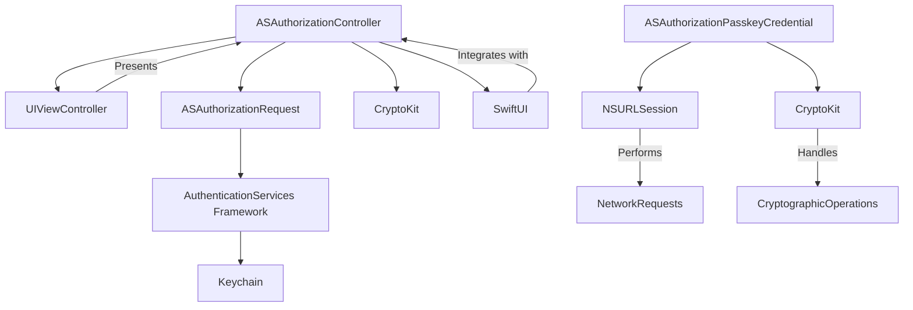

---

## **8. Extensions and Additional Functionalities**

### **a. Passkeys Extensions Diagram**
- **Purpose**: Showcase the additional functionalities provided through extensions in the `Passkeys` framework.
- **Diagram Type**: `classDiagram`
- **Contents**:
  - **ASAuthorizationController Extensions**
  - **ASAuthorizationPasskeyCredential Extensions**
  - **Utility Extensions**

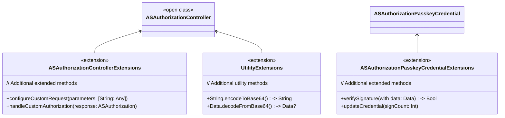

### **b. Extensions Functionalities Flowchart**
- **Purpose**: Detail specific extended methods and their purposes within the `Passkeys` framework.
- **Diagram Type**: `flowchart LR`
- **Contents**:
  - **Custom Request Configuration**
  - **Authorization Handling**
  - **Credential Verification**
  - **Utility Functions**

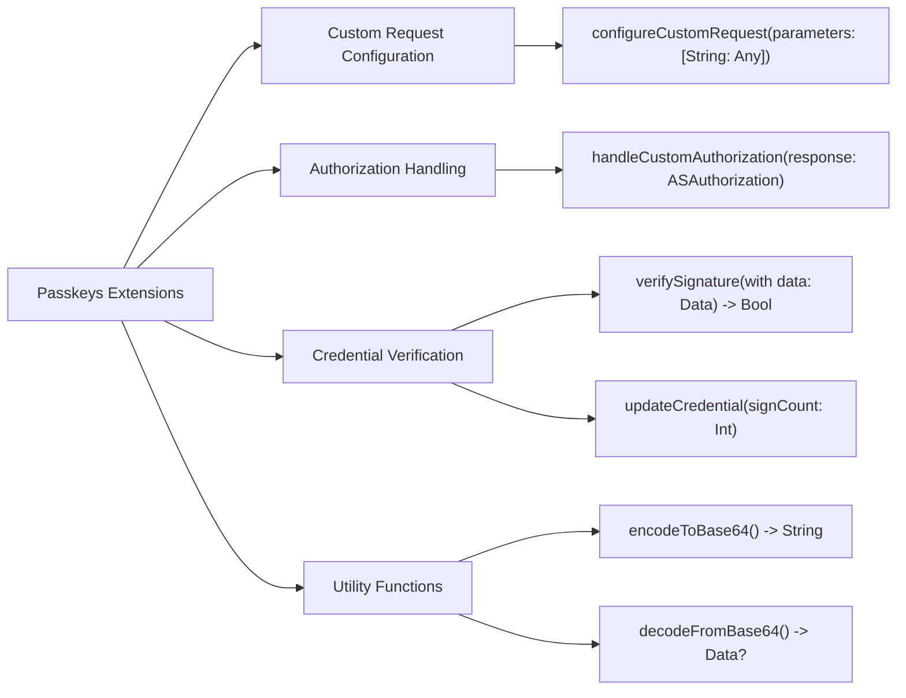

---

## **9. Lifecycle and Use Cases**

### **a. Lifecycle Flowchart**
- **Purpose**: Demonstrate the typical lifecycle of a `Passkeys` authorization flow within an application.
- **Diagram Type**: `flowchart TD`
- **Contents**:
  - **Initialization**
  - **Request Authorization**
  - **User Interaction**
  - **Authorization Success/Failure**
  - **Credential Handling**
  - **Completion**

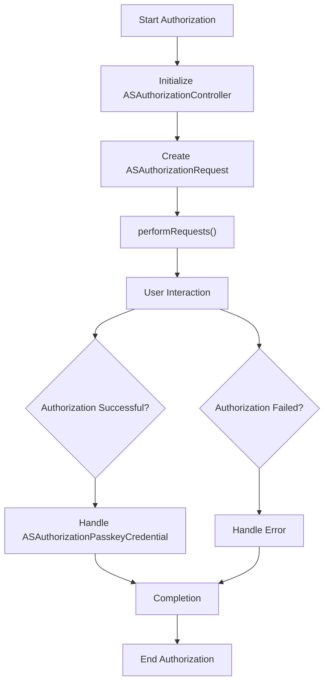

### **b. Common Use Cases Diagram**
- **Purpose**: Outline the typical scenarios where the `Passkeys` framework is utilized.
- **Diagram Type**: `flowchart TD`
- **Contents**:
  - **User Login**
  - **Account Creation**
  - **Password Recovery**
  - **Multi-Factor Authentication**
  - **Session Management**

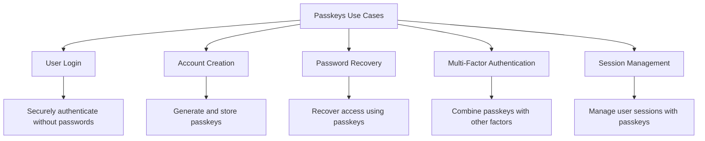

---

## **10. Feature Availability Timeline**

### **a. Feature Availability Gantt Chart**
- **Purpose**: Show when various `Passkeys` features were introduced across iOS versions.
- **Diagram Type**: `gantt`
- **Contents**:
  - **iOS Versions**: 15.0, 16.0, 17.0
  - **Features Introduced**: Basic Passkeys support, Enhanced Security Features, Integration with SwiftUI, Biometric Enhancements.

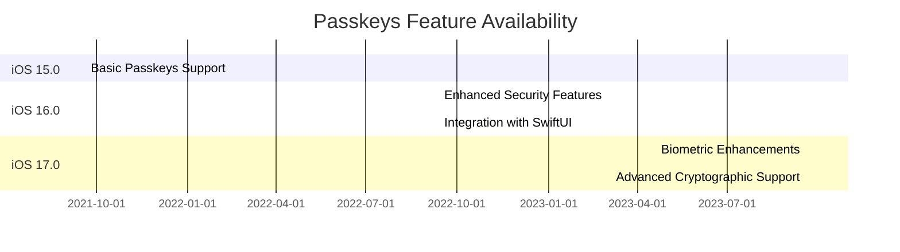

---

## **11. Data Handling and Formats**

### **a. Authorization Data Handling Diagram**
- **Purpose**: Explain how the `Passkeys` framework handles different types of authorization data.
- **Diagram Type**: `graph LR`
- **Contents**:
  - **Credential Data**: `authenticationUUID`, `publicKey`, `signCount`, `userHandle`
  - **Error Handling**: `ASAuthorizationError`
  - **Secure Storage**: Integration with `Keychain`

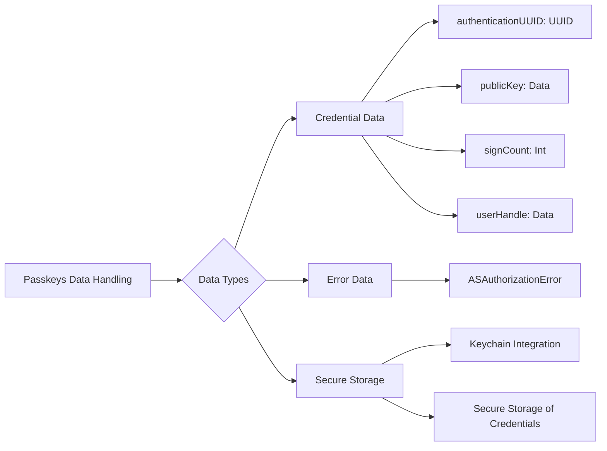

---

## **12. Integration with Authentication Contexts**

### **a. Authorization Flow Integration Diagram**
- **Purpose**: Show how the `Passkeys` framework integrates with various authentication contexts within an application.
- **Diagram Type**: `flowchart TD`
- **Contents**:
  - **Login Screen**
  - **Signup Screen**
  - **Settings Screen**
  - **Third-Party Authentication**

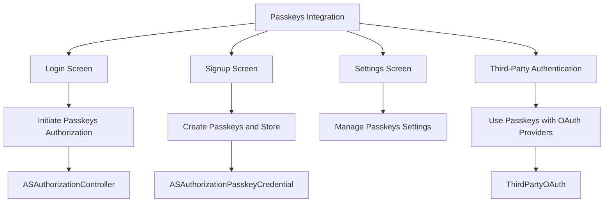

---

## **13. Summary and Best Practices**

### **a. Summary Diagram**
- **Purpose**: Provide a high-level overview of the `Passkeys` framework's key characteristics and functionalities.
- **Diagram Type**: `graph LR`
- **Contents**:
  - **Secure Authentication**
  - **Passwordless Experience**
  - **Seamless Integration**
  - **Enhanced Security**
  - **User-Friendly**

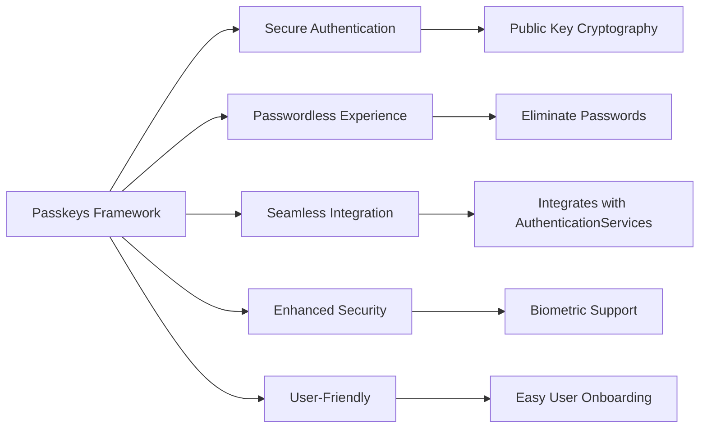

### **b. Best Practices Diagram**
- **Purpose**: Outline best practices when implementing the `Passkeys` framework.
- **Diagram Type**: `flowchart LR`
- **Contents**:
  - **Security Considerations**
  - **User Experience Enhancements**
  - **Performance Optimization**
  - **Error Handling**
  - **Compliance and Privacy**

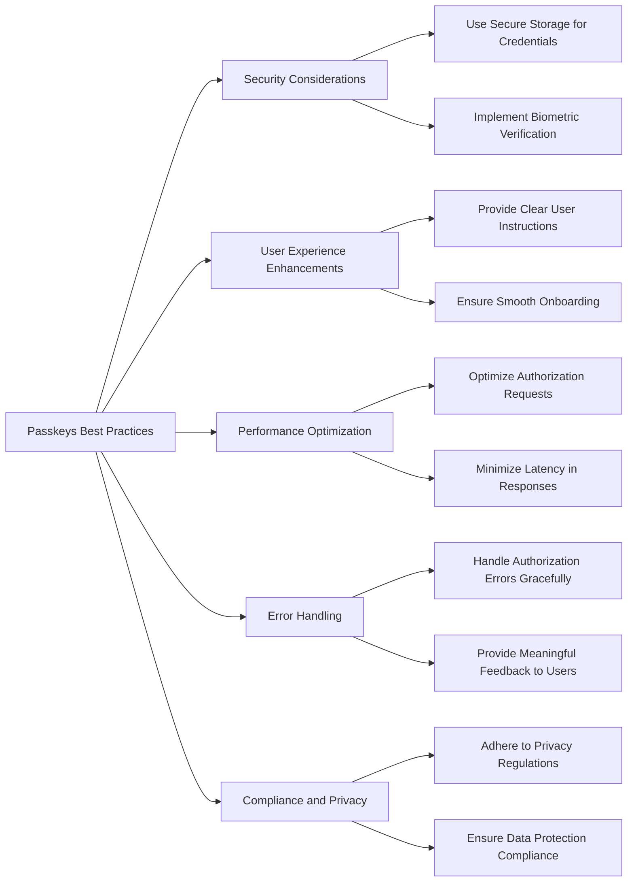

---

## **14. Security Architecture Overview**

### **a. Security Layers Diagram**
- **Purpose**: Illustrate the security architecture underpinning the `Passkeys` framework.
- **Diagram Type**: `flowchart TD`
- **Contents**:
  - **Device Security**
  - **Data Encryption**
  - **Tokenization**
  - **Biometric Integration**

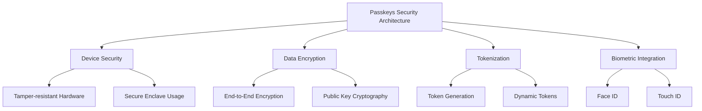

---

## **15. Extensibility and Customization**

### **a. Customization Options Diagram**
- **Purpose**: Showcase how developers can extend and customize the `Passkeys` framework to fit specific application needs.
- **Diagram Type**: `classDiagram`
- **Contents**:
  - **Custom Providers**
  - **Delegate Methods**
  - **Custom UI Components**

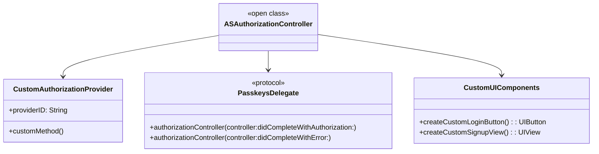

---

## **16. Error Handling and Recovery**

### **a. Error Handling Flowchart**
- **Purpose**: Detail the process of handling and recovering from errors within the `Passkeys` framework.
- **Diagram Type**: `flowchart TD`
- **Contents**:
  - **Error Types**
  - **Handling Mechanisms**
  - **User Feedback**
  - **Recovery Strategies**

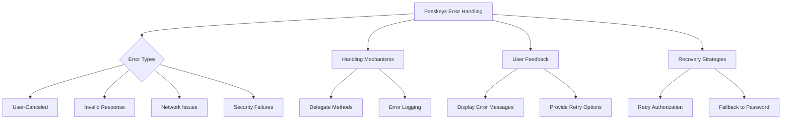

---

## **17. Testing and Debugging**

### **a. Testing Flowchart**
- **Purpose**: Outline the testing strategies for the `Passkeys` framework implementation.
- **Diagram Type**: `flowchart TD`
- **Contents**:
  - **Unit Testing**
  - **UI Testing**
  - **Integration Testing**
  - **Security Testing**

```mermaid
flowchart TD
    A[Passkeys Testing Strategies] --> B[Unit Testing]
    A --> C[UI Testing]
    A --> D[Integration Testing]
    A --> E[Security Testing]

    B --> B1[Test Authorization Requests]
    B --> B2[Test Credential Handling]
    
    C --> C1[Test Custom UI Components]
    C --> C2[Test User Interactions]
    
    D --> D1[Test Passkeys with Backend]
    D --> D2[Test Third-Party Integrations]
    
    E --> E1[Test Encryption Integrity]
    E --> E2[Test Biometric Security]
```

---

## **18. Compatibility and Migration**

### **a. Compatibility Diagram**
- **Purpose**: Show the compatibility of the `Passkeys` framework with different iOS versions and migration paths.
- **Diagram Type**: `flowchart LR`
- **Contents**:
  - **Supported iOS Versions**
  - **Migration Steps**
  - **Backward Compatibility**

```mermaid
flowchart LR
    A[Passkeys Compatibility] --> B[iOS Versions]
    A --> C[Migration Steps]
    A --> D[Backward Compatibility]

    B --> B1[iOS 15.0 and above]

    C --> C1[Upgrade AuthenticationServices Framework]
    C --> C2[Update Authorization Requests]

    D --> D1[Fallback to Password Authentication]
    D --> D2[Support Older Devices with Passkeys]
```

---

## **19. Internationalization and Localization**

### **a. Internationalization Flowchart**
- **Purpose**: Detail how the `Passkeys` framework supports internationalization and localization.
- **Diagram Type**: `flowchart TD`
- **Contents**:
  - **Localized Error Messages**
  - **Support for Multiple Languages**
  - **Cultural Adaptations**

```mermaid
flowchart TD
    A[Passkeys Internationalization] --> B[Localized Error Messages]
    A --> C[Support for Multiple Languages]
    A --> D[Cultural Adaptations]

    B --> B1[Provide Translated Error Text]
    B --> B2[Adapt Error Handling to Locale]

    C --> C1[Use Localized Strings for UI]
    C --> C2[Support Right-to-Left Languages]

    D --> D1[Adapt Authentication Flows]
    D --> D2[Respect Regional Privacy Laws]
```

---

## **20. Performance Considerations**

### **a. Performance Optimization Diagram**
- **Purpose**: Highlight performance optimization techniques when implementing the `Passkeys` framework.
- **Diagram Type**: `flowchart TD`
- **Contents**:
  - **Asynchronous Operations**
  - **Caching Credentials**
  - **Efficient Network Requests**
  - **Minimizing Latency**

```mermaid
flowchart TD
    A[Passkeys Performance Optimization] --> B[Asynchronous Operations]
    A --> C[Caching Credentials]
    A --> D[Efficient Network Requests]
    A --> E[Minimizing Latency]

    B --> B1[Use Async/Await for Authorization]
    B --> B2[Non-blocking UI Updates]

    C --> C1[Store Credentials Securely]
    C --> C2[Reuse Cached Data]

    D --> D1[Optimize API Calls]
    D --> D2[Use HTTP/2 for Networking]

    E --> E1[Reduce Round-Trips]
    E --> E2[Optimize Server Responses]
```

---

## **21. Documentation and Resources**

### **a. Documentation Structure Diagram**
- **Purpose**: Organize the documentation and resources available for the `Passkeys` framework.
- **Diagram Type**: `flowchart LR`
- **Contents**:
  - **Official Documentation**
  - **Sample Code**
  - **Community Tutorials**
  - **API References**
  - **Support Channels**

```mermaid
flowchart LR
    A[Passkeys Documentation] --> B[Official Documentation]
    A --> C[Sample Code]
    A --> D[Community Tutorials]
    A --> E[API References]
    A --> F[Support Channels]

    B --> B1[Apple Developer Documentation]
    C --> C1[GitHub Repositories]
    D --> D1[Online Tutorials and Articles]
    E --> E1[API Reference Guides]
    F --> F1[Developer Forums]
    F --> F2[Apple Support]
```

---

## **22. Security Compliance and Standards**

### **a. Compliance Diagram**
- **Purpose**: Show how the `Passkeys` framework adheres to various security standards and compliance requirements.
- **Diagram Type**: `flowchart TD`
- **Contents**:
  - **FIDO2 Standard**
  - **WebAuthn Compliance**
  - **GDPR**
  - **HIPAA**

```mermaid
flowchart TD
    A[Passkeys Security Compliance] --> B[FIDO2 Standard]
    A --> C[WebAuthn Compliance]
    A --> D[GDPR]
    A --> E[HIPAA]

    B --> B1[Public Key Infrastructure]
    B --> B2[Strong Authentication]

    C --> C1[Standardized Protocols]
    C --> C2[Interoperability]

    D --> D1[Data Protection]
    D --> D2[User Consent]

    E --> E1[Health Data Security]
    E --> E2[Secure Data Handling]
```

---

## **23. Advanced Features and Extensions**

### **a. Advanced Features Diagram**
- **Purpose**: Highlight advanced functionalities and extensions available within the `Passkeys` framework.
- **Diagram Type**: `flowchart LR`
- **Contents**:
  - **Biometric Integration**
  - **Multi-Device Synchronization**
  - **Custom Authentication Flows**
  - **Third-Party Integrations**

```mermaid
flowchart LR
    A[Passkeys Advanced Features] --> B[Biometric Integration]
    A --> C[Multi-Device Synchronization]
    A --> D[Custom Authentication Flows]
    A --> E[Third-Party Integrations]

    B --> B1[Face ID Integration]
    B --> B2[Touch ID Integration]

    C --> C1[Sync Across Devices via iCloud]
    C --> C2[Consistent User Experience]

    D --> D1[Custom Authorization Requests]
    D --> D2[Flexible Response Handling]

    E --> E1[OAuth Providers]
    E --> E2[Third-Party APIs]
```

---

## **24. Best Practices for Developers**

### **a. Best Practices Flowchart**
- **Purpose**: Outline recommended best practices for developers implementing the `Passkeys` framework.
- **Diagram Type**: `flowchart TD`
- **Contents**:
  - **Secure Storage**
  - **User Privacy**
  - **Efficient Coding**
  - **Thorough Testing**
  - **Continuous Updates**

```mermaid
flowchart TD
    A[Passkeys Best Practices] --> B[Secure Storage]
    A --> C[User Privacy]
    A --> D[Efficient Coding]
    A --> E[Thorough Testing]
    A --> F[Continuous Updates]

    B --> B1[Use Keychain for Credentials]
    B --> B2[Encrypt Sensitive Data]

    C --> C1[Respect User Consent]
    C --> C2[Minimize Data Collection]

    D --> D1[Optimize Authorization Requests]
    D --> D2[Use Efficient Data Structures]

    E --> E1[Unit and UI Tests]
    E --> E2[Security Audits]

    F --> F1[Stay Updated with iOS Releases]
    F --> F2[Monitor Security Advisories]
```

---

## **25. Troubleshooting Common Issues**

### **a. Troubleshooting Flowchart**
- **Purpose**: Provide guidance on resolving common issues encountered when using the `Passkeys` framework.
- **Diagram Type**: `flowchart TD`
- **Contents**:
  - **Authorization Failures**
  - **Credential Storage Issues**
  - **Network Problems**
  - **Biometric Errors**

```mermaid
flowchart TD
    A[Passkeys Troubleshooting] --> B[Authorization Failures]
    A --> C[Credential Storage Issues]
    A --> D[Network Problems]
    A --> E[Biometric Errors]

    B --> B1[Check Delegate Methods]
    B --> B2[Verify Authorization Requests]

    C --> C1[Ensure Keychain Access]
    C --> C2[Handle Storage Errors]

    D --> D1[Verify Network Connectivity]
    D --> D2[Check API Endpoints]

    E --> E1[Ensure Biometric Setup]
    E --> E2[Handle Biometric Errors Gracefully]
```

---

## **26. Performance Metrics and Monitoring**

### **a. Performance Metrics Diagram**
- **Purpose**: Highlight the key performance metrics to monitor when implementing the `Passkeys` framework.
- **Diagram Type**: `graph LR`
- **Contents**:
  - **Authorization Time**
  - **Success Rate**
  - **Error Rates**
  - **User Engagement**

```mermaid
graph LR
    A[Passkeys Performance Metrics] --> B[Authorization Time]
    A --> C[Success Rate]
    A --> D[Error Rates]
    A --> E[User Engagement]

    B --> B1[Average Time to Authorize]
    B --> B2[Load Times]

    C --> C1[Percentage of Successful Authentications]
    C --> C2[User Adoption Rates]

    D --> D1[Types of Errors Encountered]
    D --> D2[Frequency of Failures]

    E --> E1[User Retention]
    E --> E2[Feedback and Satisfaction]
```

---

## **27. Compliance with Apple Guidelines**

### **a. Compliance Checklist Diagram**
- **Purpose**: Ensure adherence to Apple's guidelines when implementing the `Passkeys` framework.
- **Diagram Type**: `flowchart TD`
- **Contents**:
  - **App Store Review Guidelines**
  - **Privacy Policies**
  - **Data Security Standards**
  - **User Experience Requirements**

```mermaid
flowchart TD
    A[Passkeys Compliance] --> B[App Store Review Guidelines]
    A --> C[Privacy Policies]
    A --> D[Data Security Standards]
    A --> E[User Experience Requirements]

    B --> B1[Proper Use of Authentication Services]
    B --> B2[Compliance with API Usage]

    C --> C1[Transparent Data Usage]
    C --> C2[User Consent]

    D --> D1[Secure Data Transmission]
    D --> D2[Encrypted Storage]

    E --> E1[Intuitive Authorization Flows]
    E --> E2[Accessible UI Components]
```

---

## **28. Migration from Traditional Authentication**

### **a. Migration Steps Diagram**
- **Purpose**: Provide a step-by-step guide for migrating from traditional password-based authentication to the `Passkeys` framework.
- **Diagram Type**: `flowchart TD`
- **Contents**:
  - **Assessment**
  - **Planning**
  - **Implementation**
  - **Testing**
  - **Deployment**

```mermaid
flowchart TD
    A[Migration to Passkeys] --> B[Assessment]
    A --> C[Planning]
    A --> D[Implementation]
    A --> E[Testing]
    A --> F[Deployment]

    B --> B1[Evaluate Current Authentication]
    B --> B2[Identify Required Changes]

    C --> C1[Define Migration Strategy]
    C --> C2[Set Milestones]

    D --> D1[Integrate Passkeys Framework]
    D --> D2[Update Backend Services]

    E --> E1[Conduct Thorough Testing]
    E --> E2[Address Issues]

    F --> F1[Roll Out to Users]
    F --> F2[Monitor Adoption]
```

---

## **29. Integration with Backend Services**

### **a. Backend Integration Diagram**
- **Purpose**: Illustrate how the `Passkeys` framework interacts with backend services for authentication and user management.
- **Diagram Type**: `flowchart LR`
- **Contents**:
  - **API Endpoints**
  - **Token Management**
  - **User Database**
  - **Session Handling**

```mermaid
flowchart LR
    A[Passkeys Integration] --> B[Backend API]
    A --> C[User Database]
    A --> D[Session Management]
    A --> E[Token Management]

    B --> B1[Authorization Endpoint]
    B --> B2[Credential Verification]

    C --> C1[Store Public Keys]
    C --> C2[Manage User Profiles]

    D --> D1[Create User Sessions]
    D --> D2[Track Session Activity]

    E --> E1[Generate Authentication Tokens]
    E --> E2[Validate Tokens]
```

---

## **30. Security Best Practices**

### **a. Security Best Practices Diagram**
- **Purpose**: Outline recommended security practices when using the `Passkeys` framework.
- **Diagram Type**: `flowchart TD`
- **Contents**:
  - **Use Secure Enclave**
  - **Encrypt Sensitive Data**
  - **Regular Security Audits**
  - **Stay Updated with Security Patches**
  - **Implement Biometric Fallbacks**

```mermaid
flowchart TD
    A[Passkeys Security Best Practices] --> B[Use Secure Enclave]
    A --> C[Encrypt Sensitive Data]
    A --> D[Regular Security Audits]
    A --> E[Stay Updated with Security Patches]
    A --> F[Implement Biometric Fallbacks]

    B --> B1[Store Credentials in Secure Enclave]
    B --> B2[Leverage Hardware Security]

    C --> C1[Encrypt Data at Rest and in Transit]
    C --> C2[Use Strong Encryption Algorithms]

    D --> D1[Conduct Penetration Testing]
    D --> D2[Review Security Policies]

    E --> E1[Monitor for Vulnerabilities]
    E --> E2[Apply Updates Promptly]

    F --> F1[Provide Alternative Authentication Methods]
    F --> F2[Ensure Access in Case of Biometric Failure]
```

---

## **31. Conclusion**

### **a. Comprehensive Overview Diagram**
- **Purpose**: Summarize the key components and interactions within the `Passkeys` framework.
- **Diagram Type**: `graph LR`
- **Contents**:
  - **Core Classes**
  - **Authorization Flow**
  - **Security Layers**
  - **Integration Points**

```mermaid
graph LR
    A[Passkeys Framework] --> B[Core Classes]
    A --> C[Authorization Flow]
    A --> D[Security Layers]
    A --> E[Integration Points]

    B --> B1[ASAuthorizationController]
    B --> B2[ASAuthorizationPasskeyCredential]

    C --> C1[Initialize Controller]
    C --> C2[Perform Requests]
    C --> C3[Handle Responses]

    D --> D1[Secure Enclave]
    D --> D2[Public Key Cryptography]

    E --> E1[Backend Services]
    E --> E2[SwiftUI Integration]
    E --> E3[Third-Party APIs]

    B1 --> C
    B2 --> D
    C --> E
```

---

## **32. Additional Resources**

### **a. Resource Links Diagram**
- **Purpose**: Provide links to essential resources for further understanding and implementing the `Passkeys` framework.
- **Diagram Type**: `flowchart LR`
- **Contents**:
  - **Apple Developer Documentation**
  - **WWDC Sessions**
  - **Sample Projects**
  - **Community Forums**
  - **Third-Party Libraries**

```mermaid
flowchart LR
    A[Passkeys Resources] --> B[Apple Developer Documentation]
    A --> C[WWDC Sessions]
    A --> D[Sample Projects]
    A --> E[Community Forums]
    A --> F[Third-Party Libraries]

    B --> B1[Authentication Services Docs]
    C --> C1[WWDC 2023: Passkeys Introduction]
    D --> D1[GitHub Repositories]
    E --> E1[Stack Overflow]
    E --> E2[Apple Developer Forums]
    F --> F1[Open-Source Libraries for Passkeys]
```

---

## **33. Glossary**

### **a. Glossary Diagram**
- **Purpose**: Define key terms and concepts related to the `Passkeys` framework.
- **Diagram Type**: `graph LR`
- **Contents**:
  - **Passkeys**
  - **ASAuthorizationController**
  - **Public Key Cryptography**
  - **Secure Enclave**
  - **Biometric Verification**

```mermaid
graph LR
    A[Passkeys Glossary] --> B[Passkeys]
    A --> C[ASAuthorizationController]
    A --> D[Public Key Cryptography]
    A --> E[Secure Enclave]
    A --> F[Biometric Verification]

    B --> B1[Passwordless Authentication Method]
    C --> C1[Manages Authorization Requests and Responses]
    D --> D1[Cryptographic System Using Public and Private Keys]
    E --> E1[Hardware-Based Security Module on Apple Devices]
    F --> F1[Authentication Using Biometrics Like Face ID or Touch ID]
```

---

## **34. References and Standards**

### **a. References Diagram**
- **Purpose**: List the standards and references that the `Passkeys` framework adheres to.
- **Diagram Type**: `flowchart LR`
- **Contents**:
  - **FIDO2**
  - **WebAuthn**
  - **OAuth 2.0**
  - **OpenID Connect**

```mermaid
flowchart LR
    A[Passkeys References] --> B[FIDO2]
    A --> C[WebAuthn]
    A --> D[OAuth 2.0]
    A --> E[OpenID Connect]

    B --> B1[Strong Authentication Protocol]
    C --> C1[Web Authentication Standard]
    D --> D1[Authorization Framework]
    E --> E1[Authentication Layer on OAuth 2.0]
```

---

## **35. Future Enhancements**

### **a. Future Enhancements Diagram**
- **Purpose**: Highlight potential future enhancements and directions for the `Passkeys` framework.
- **Diagram Type**: `flowchart TD`
- **Contents**:
  - **Enhanced Biometric Support**
  - **AI-Powered Security Features**
  - **Cross-Platform Compatibility**
  - **Integration with Emerging Technologies**

```mermaid
flowchart TD
    A[Passkeys Future Enhancements] --> B[Enhanced Biometric Support]
    A --> C[AI-Powered Security Features]
    A --> D[Cross-Platform Compatibility]
    A --> E[Integration with Emerging Technologies]

    B --> B1[Support for More Biometrics]
    B --> B2[Improved Accuracy and Speed]

    C --> C1[AI-Based Anomaly Detection]
    C --> C2[Adaptive Security Measures]

    D --> D1[Support for macOS, watchOS, tvOS]
    D --> D2[Interoperability with Android and Web]

    E --> E1[Augmented Reality Authentication]
    E --> E2[Blockchain Integration for Decentralized Identity]
```

---

## **36. Comprehensive Interaction Diagram**

### **a. Interaction Diagram**
- **Purpose**: Provide a comprehensive view of how different components within the `Passkeys` framework interact with each other and external systems.
- **Diagram Type**: `sequenceDiagram`
- **Contents**:
  - **User**
  - **App Interface**
  - **ASAuthorizationController**
  - **Backend Server**
  - **Keychain**
  - **Biometric Sensor**

```mermaid
sequenceDiagram
    participant User
    participant AppInterface
    participant ASAuthorizationController
    participant BackendServer
    participant Keychain
    participant BiometricSensor

    User->>AppInterface: Initiate Login
    AppInterface->>ASAuthorizationController: Create Authorization Request
    ASAuthorizationController->>BiometricSensor: Prompt for Biometric Verification
    BiometricSensor-->>ASAuthorizationController: Biometric Result
    ASAuthorizationController->>BackendServer: Send Public Key Credential
    BackendServer-->>Keychain: Store Credential
    BackendServer-->>ASAuthorizationController: Authorization Success
    ASAuthorizationController-->>AppInterface: Notify Success
    AppInterface-->>User: Access Granted
```


---
**Licenses:**

- **MIT License:**  [](LICENSE) - Full text in [LICENSE](LICENSE) file.
- **Creative Commons Attribution 4.0 International:** [](LICENSE-CC-BY) - Legal details in [LICENSE-CC-BY](LICENSE-CC-BY) and at [Creative Commons official site](http://creativecommons.org/licenses/by/4.0/).

---