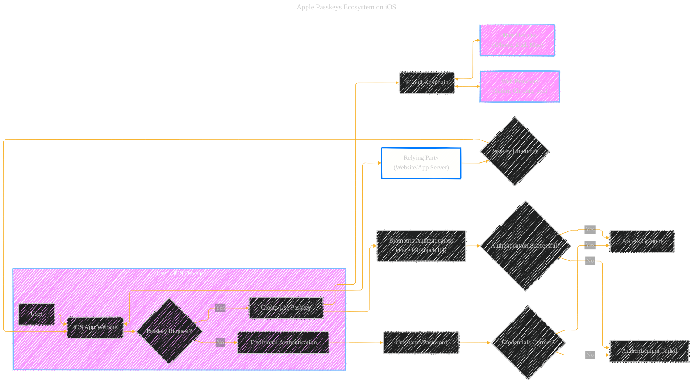
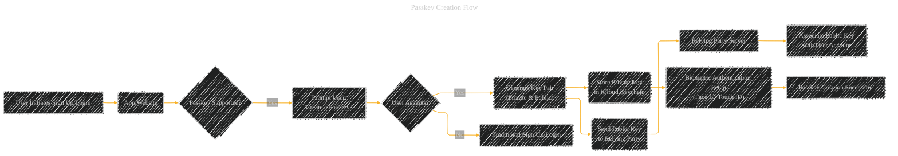
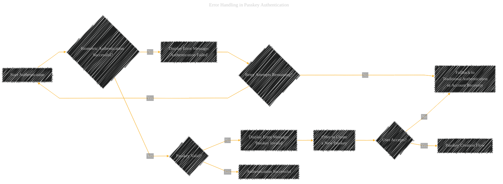

# Apple Passkeys on iOS: A Diagrammatic Overview
> **Disclaimer:**
>
> This document contains my personal notes on the topic,
> compiled from publicly available documentation and various cited sources.
> The materials are intended for educational purposes, personal study, and reference.
> The content is dual-licensed:
> 1. **MIT License:** Applies to all code implementations (Swift, Mermaid, and other programming languages).
> 2. **Creative Commons Attribution 4.0 International License (CC BY 4.0):** Applies to all non-code content, including text, explanations, diagrams, and illustrations.
---

Here's a consolidated view of the Passkey ecosystem on iOS, followed by more detailed diagrams.

**Key Concepts Illustrated:**

*   **User Interaction:**  The user initiates the process through an app or website.
*   **Passkey Request:** The app/website determines if Passkeys are supported.
*   **iCloud Keychain:**  The central, secure storage for Passkeys, synchronized across Apple devices.
*   **Cross-Device Compatibility:** Passkeys can be used on other Apple devices and even compatible web browsers.
*   **Relying Party:** The server-side component of the website or app that handles the Passkey challenge.
*   **Biometric Authentication:**  Face ID or Touch ID is used to authorize the use of a Passkey.
*   **Fallback Mechanism:** Traditional username/password authentication is still available as a fallback.

---

## 1. Passkey Creation Flow

**Unique Features:**

*   **Key Pair Generation:**  The iOS device generates a cryptographic key pair (private and public).  The private key *never* leaves the device and is protected by iCloud Keychain.
*   **iCloud Keychain Integration:**  Seamless storage and synchronization of the private key.
*   **Biometric Prompt:**  The user is prompted to use Face ID or Touch ID to authorize the creation and use of the Passkey.
*   **Relying Party Registration:** The public key is sent to the website/app server (relying party) and associated with the user's account.

---

## 2. Passkey Authentication Flow

```mermaid
---
title: "Passkey Authentication Flow"
author: "Cong Le"
version: "1.0"
license(s): "MIT, CC BY 4.0"
copyright: "Copyright (c) 2025 Cong Le. All Rights Reserved."
config:
  layout: elk
  look: handDrawn
  theme: dark
---
%%%%%%%% Mermaid version v11.4.1-b.14
%%%%%%%% Toggle theme value to `base` to activate the initilization below for the customized theme version.
%%%%%%%% Available curve styles include the following keywords:
%% basis, bumpX, bumpY, cardinal, catmullRom, linear, monotoneX, monotoneY, natural, step, stepAfter, stepBefore.
%%{
  init: {
    "flowchart": { "htmlLabels": false, 'curve': 'linear' },
    'fontFamily': 'Fantasy',
    'themeVariables': {
      'primaryColor': '#ffff',
      'primaryTextColor': '#55ff',
      'primaryBorderColor': '#7c2',
      'lineColor': '#F8B229',
      'secondaryColor': '#006100',
      'tertiaryColor': '#fff'
    }
  }
}%%
graph LR
    A["User Initiates Login"] --> B("App/Website")
    B --> C{"Passkey Available?"}
    C -- Yes --> D["Relying Party Sends Challenge"]
    D --> E("iOS Device")
    E --> F["Prompt User for<br>Biometric Authentication"]
    F --> G{"Authentication Successful?"}
    G -- Yes --> H["Use Private Key<br>to Sign Challenge"]
    H --> I("Send Signed Challenge<br>to Relying Party")
    I --> J["Relying Party Server"]
    J --> K["Verify Signature<br>with Public Key"]
    K --> L{"Verification Successful?"}
    L -- Yes --> M["Access Granted"]
    L -- No --> N["Authentication Failed"]
    C -- No --> O["Fallback to<br>Traditional Login"]
```

**Unique Features:**

*   **Challenge-Response:** The relying party sends a cryptographic challenge to the iOS device.
*   **Biometric Authorization:** The user must authenticate with Face ID or Touch ID *before* the private key can be used.
*   **Private Key Usage:** The private key is used to digitally sign the challenge.  This proves possession of the private key without revealing it.
*   **Signature Verification:** The relying party uses the stored public key to verify the signature, confirming the user's identity.
* **Autofill Integration**: Offers to fill in the user's saved Passkeys for the app or the website.

---

## 3. Passkey Synchronization and Recovery

**Unique Features:**

*   **iCloud Keychain Synchronization:** Passkeys are automatically and securely synchronized across the user's Apple devices.
*   **Recovery Mechanism:** If a device is lost or damaged, Passkeys can be recovered from iCloud Keychain on a new device.
*   **Cross-Platform (Limited):**  On compatible non-Apple devices, a QR code can be used with an iPhone or iPad to complete the passkey authentication. This uses the FIDO standard for cross-platform compatibility.

---

## 4. Passkey vs. Traditional Authentication

**Comparison:**

*   **Security:** Passkeys are significantly more secure than traditional passwords, as they are resistant to phishing, password reuse, and server breaches (since the private key never leaves the device).
*   **Usability:** Passkeys are generally easier to use, relying on biometrics instead of memorized passwords.
* **Convenience**: With iCloud Keychain, the user's Passkeys are synced across the devices.

---

## 5. Error Handling in Passkey Authentication

**Error Scenarios:**

*   **Biometric Failure:** If Face ID or Touch ID fails repeatedly, the user may be offered a fallback authentication method (if available) or account recovery options.
*   **Passkey Invalid:** If the Passkey is invalid (e.g., revoked or corrupted), the user may be prompted to create a new one.
*   **Network Issues:**  If there are network connectivity problems, the app/website should handle this gracefully and provide appropriate error messages.

---

## 6.  Passkey and WebAuthn/FIDO2 Standards

**Standards Compliance:**

* **WebAuthn:** Passkeys are built on the WebAuthn (Web Authentication) standard, a W3C specification. This ensures interoperability with websites and services that support WebAuthn.
*   **FIDO2:**  Passkeys utilize FIDO2 (Fast IDentity Online 2) authenticators, which are hardware or software components that securely manage cryptographic keys.  On iOS devices, this is typically the Secure Enclave or a Trusted Platform Module (TPM).

---
**Licenses:**

- **MIT License:**   - Full text in [LICENSE](LICENSE) file.
- **Creative Commons Attribution 4.0 International:**  - Legal details in [LICENSE-CC-BY](LICENSE-CC-BY) and at [Creative Commons official site](http://creativecommons.org/licenses/by/4.0/).

---