# PhotoTypes in PhotoKit framework
 
Below is a set of Mermaid diagrams to visually represent the relationships and structures of the enums and structs within the `PhotoKit` framework. These diagrams should help developers better understand the concepts and serve as a future reference.

---

## 1. Overview of Photos Framework Enums and Structures

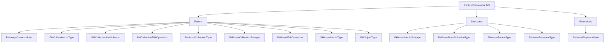

---

## 2. PHImageContentMode Enum

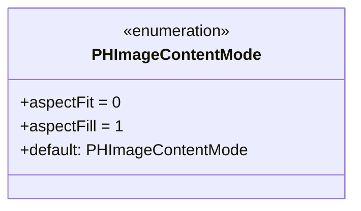

**Description:**
Defines how an image should be resized or scaled within a given space.

---

## 3. PHCollectionListType Enum

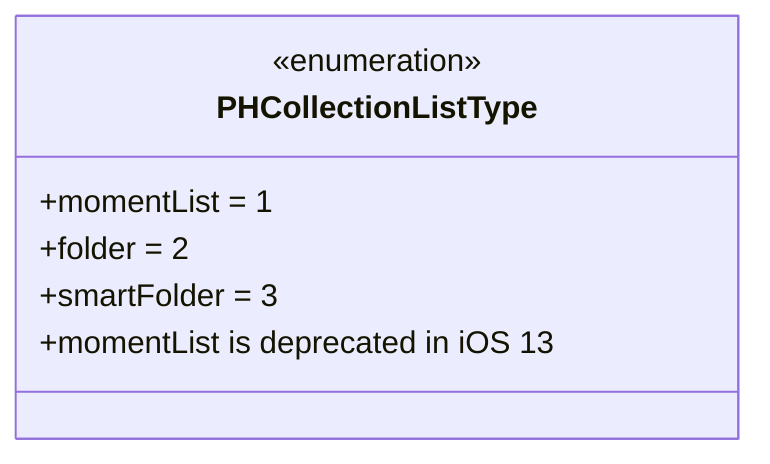

**Description:**
Specifies the type of a collection list, such as moments, folders, or smart folders.

---

## 4. PHCollectionListSubtype Enum

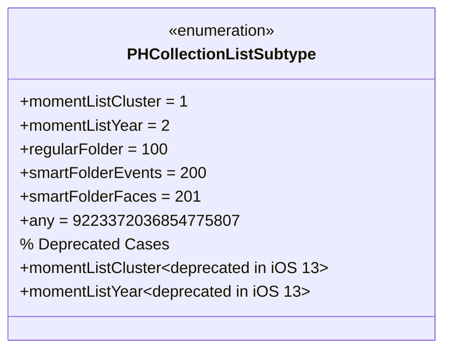

**Description:**
Further categorizes collection lists with specific subtypes, including deprecated moment list types and various folder types.


## PHCollectionListType and PHCollectionListSubtype Enumerations

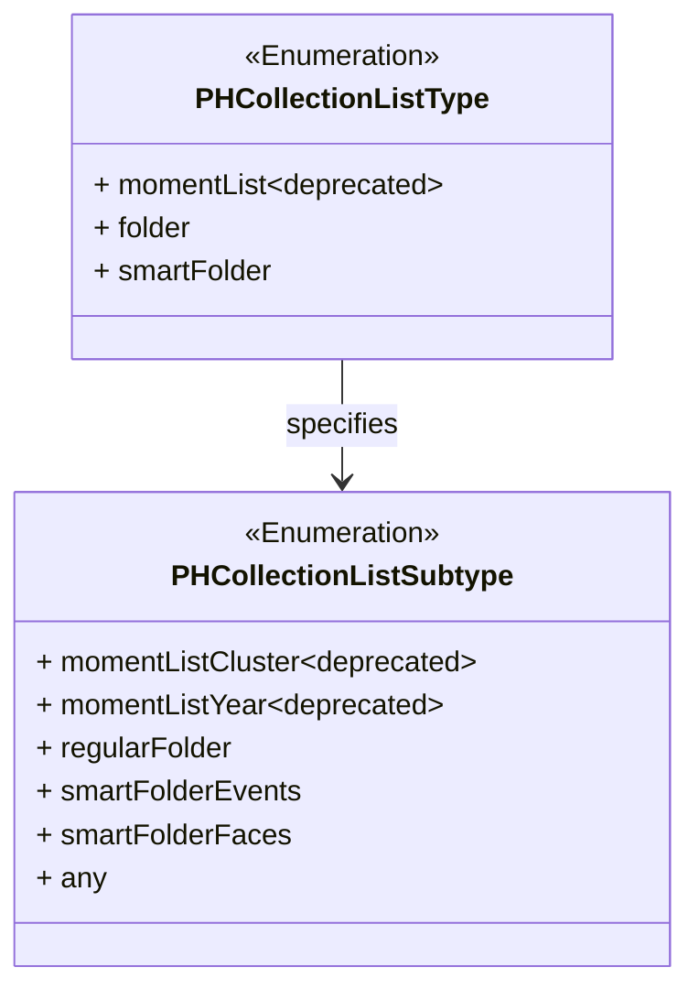

---

## 5. PHCollectionEditOperation Enum

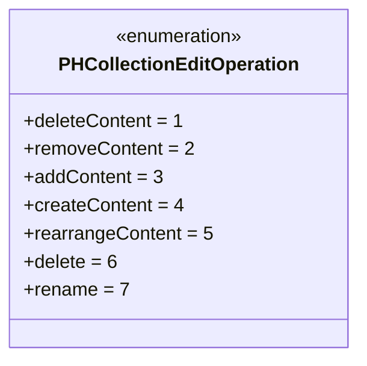

**Description:**
Enumerates the possible edit operations that can be performed on a photo collection.

---

## 6. PHAssetCollectionType Enum

```
classDiagram
    class PHAssetCollectionType {
        <<enumeration>>
        +album = 1
        +smartAlbum = 2
        +moment = 3
    }

    PHAssetCollectionType : +moment is deprecated in iOS 13
}
```

**Description:**
Defines the type of an asset collection, such as albums, smart albums, or moments (deprecated).

---

## 7. PHAssetCollectionSubtype Enum

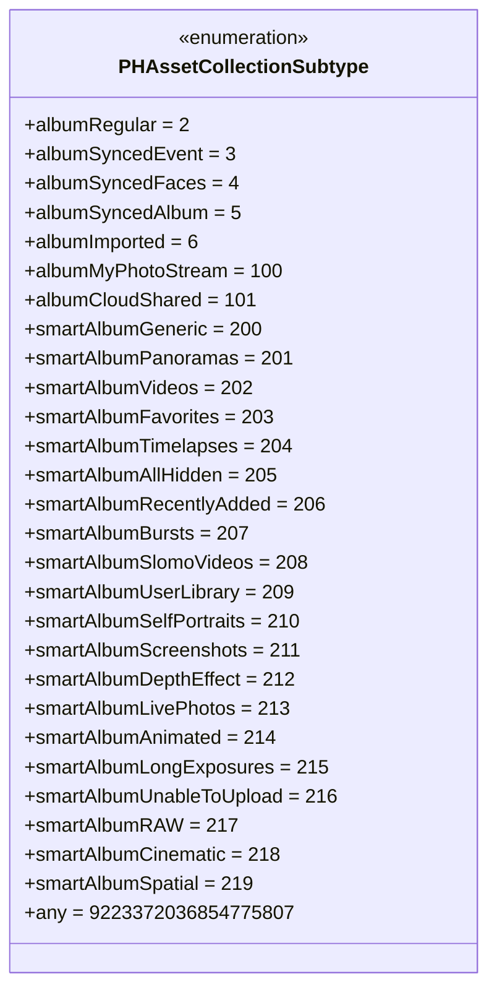

**Description:**
Provides detailed subtypes for asset collections, including various album types and smart album categories, with support for modern features like Live Photos and Cinematic.


## PHAssetCollectionType and PHAssetCollectionSubtype Enumerations

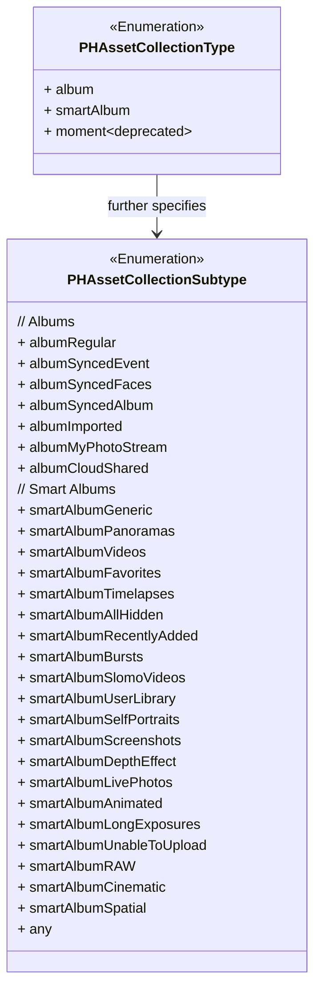


**Description:**

- **PHAssetCollectionType** defines the types of asset collections (e.g., album, smart album).
- **PHAssetCollectionSubtype** provides detailed subtypes, categorized into Albums and Smart Albums.
- Deprecated items are marked with `~deprecated~`.


---

## 8. PHAssetEditOperation Enum

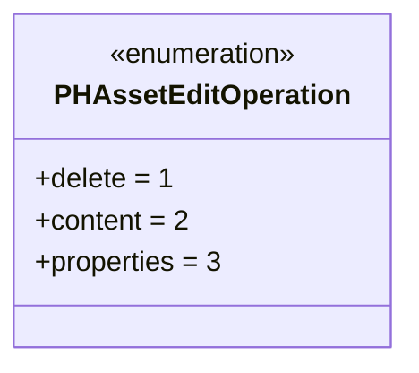

**Description:**
Enumerates the types of edit operations applicable to individual assets.

---

## 9. PHAssetMediaType Enum

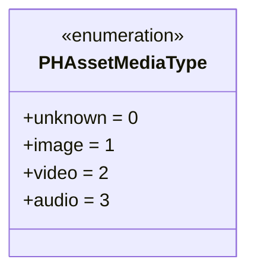

**Description:**
Defines the media type of an asset, such as image, video, or audio.

---

## 10. PHObjectType Enum

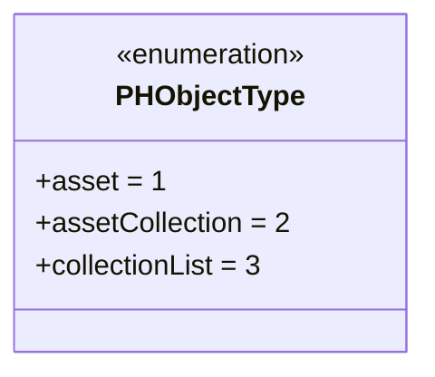

**Description:**
Specifies the type of a `PHObject`, indicating whether it’s an asset, asset collection, or collection list.

---

## 11. PHAssetMediaSubtype OptionSet

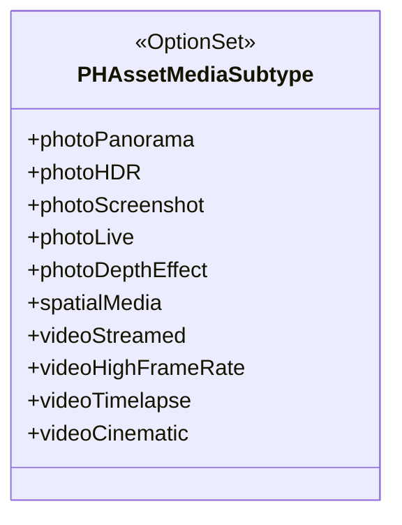

Another diagram representation: 

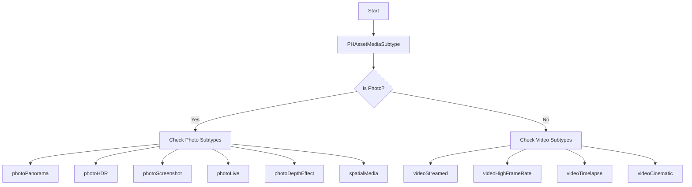


**Description:**
Represents advanced media subtypes for assets, allowing combination of multiple attributes such as HDR, Panoramas, Live Photos, and various video enhancements.

---

## 12. PHAssetBurstSelectionType OptionSet

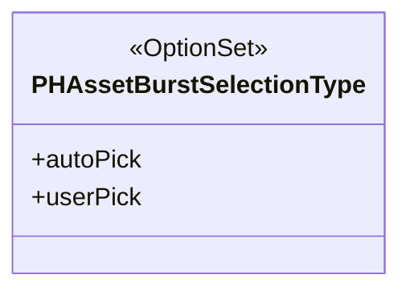

**Description:**
Indicates the selection type for burst photos, distinguishing between automatic and user-selected picks.

---

## 13. PHAssetSourceType OptionSet

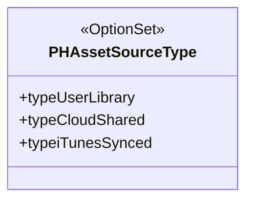

**Description:**
Specifies the source of an asset, such as the user’s library, cloud-shared albums, or iTunes-synced content.

---

## 14. PHAssetResourceType Enum


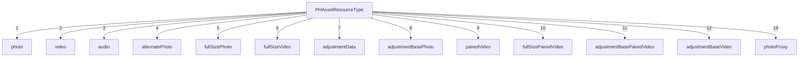


**Description:**

- Enumerates all possible resource types associated with a PHAsset.
- Each node represents a resource type with its corresponding enum value.
- photoProxy is available in iOS 17

---

## TODO: Fix diagram syntax error

## 15. PHAsset Extension: PlaybackStyle Enum

```
classDiagram
    class PHAsset.PlaybackStyle {
        <<enumeration>>
        +unsupported = 0
        +image = 1
        +imageAnimated = 2
        +livePhoto = 3
        +video = 4
        +videoLooping = 5
    }
```

**Description:**
Defines how an asset should be played back, distinguishing between static images, animated images, Live Photos, and various video styles.

---

## 16. Relationships and Dependencies

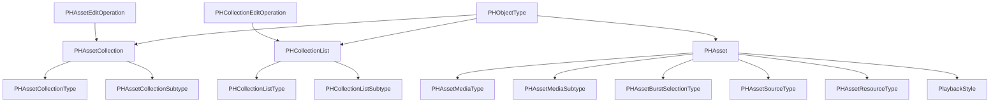

**Description:**
Illustrates the relationships and dependencies between different enums and structures within the `Photos` framework, highlighting how assets, collections, and their respective types and subtypes interrelate.

---

## 17. Deprecated Elements


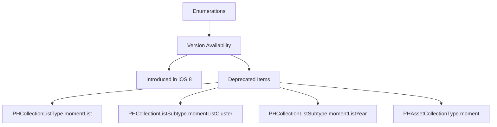

Another way to represent this section: 

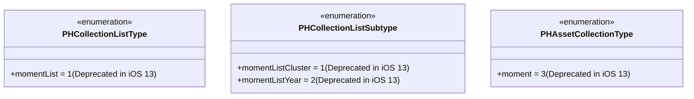

**Description:**
- Highlights the importance of checking the availability and deprecation status.
- Developers should be aware of deprecated items to maintain forward compatibility.


---
