# RealityKit
> This content is dual-licensed under your choice of the following licenses:
> 1.  **MIT License:** For the code implementations in Swift and Mermaid provided in this document.
> 2.  **Creative Commons Attribution 4.0 International License (CC BY 4.0):** For all other content, including the text, explanations, and the Mermaid diagrams and illustrations.

---

Below is a comprehensive and organized set of Mermaid diagrams for the `RealityKit` framework. These diagrams cover various aspects of RealityKit, including class structures, initializers, properties, methods, enumerations, protocol conformances, relationships, extensions, lifecycle, feature timelines, data handling, integration with drawing contexts, and best practices.

---

## **1. Class Structure and Hierarchy**

### **a. Core Class Diagram**
- **Purpose**: Illustrate the primary structure of `RealityKit`, including its main classes, properties, methods, and enumerations.
- **Diagram Type**: `classDiagram`
- **Contents**:
  - **Classes**: Key classes like `ARView`, `Entity`, `ModelEntity`, `AnchorEntity`, `Scene`, etc.
  - **Properties**: Core attributes such as `scene`, `camera`, `environment`, etc.
  - **Methods**: Essential functions like `addAnchor()`, `removeAnchor()`, `loadModel()`, etc.
  - **Enumerations**: Nested enums such as `PhysicsShapeResource`, `CollisionComponent.Shape`, etc.

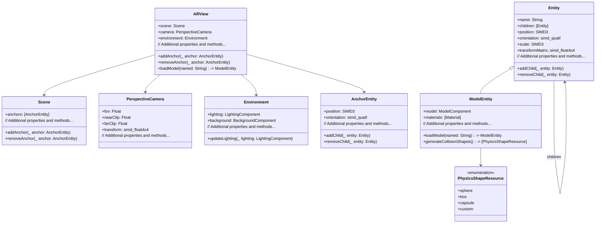

---

## **2. Initializers Overview**

### **a. Initialization Methods Diagram**
- **Purpose**: Break down the various ways to instantiate key classes in `RealityKit`.
- **Diagram Type**: `flowchart LR`
- **Contents**:
  - **ARView Initialization**: `init(frame: CGRect, cameraMode: ARView.CameraMode, automaticallyConfigureSession: Bool)`
  - **Entity Initialization**: `init()`, `init(name: String)`
  - **ModelEntity Initialization**: `init(mesh: MeshResource, materials: [Material])`, `loadModel(named:)`
  - **AnchorEntity Initialization**: `init(anchor: ARAnchor)`, `init()`

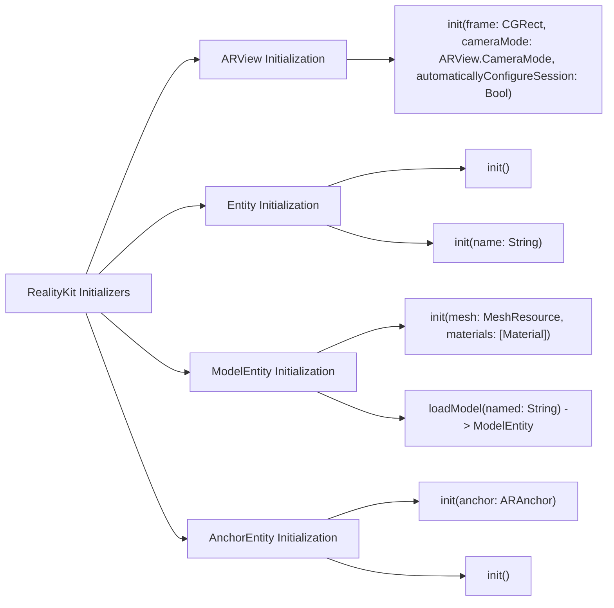

---

## **3. Properties Breakdown**

### **a. Key Properties Diagram**
- **Purpose**: Detail the main properties of `RealityKit`'s core classes.
- **Diagram Type**: `graph LR`
- **Contents**:
  - **ARView Properties**: `scene`, `camera`, `environment`, `session`
  - **Entity Properties**: `name`, `children`, `position`, `orientation`, `scale`
  - **ModelEntity Properties**: `model`, `materials`
  - **AnchorEntity Properties**: `position`, `orientation`
  - **Scene Properties**: `anchors`
  - **PerspectiveCamera Properties**: `fov`, `nearClip`, `farClip`
  - **Environment Properties**: `lighting`, `background`

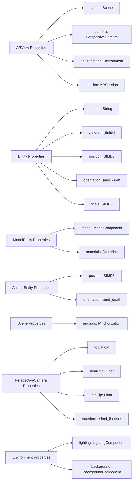


---

## **4. Methods Grouped by Functionality**

### **a. Entity Manipulation Methods**
- **Purpose**: Categorize methods based on their roles in manipulating entities within RealityKit.
- **Diagram Type**: `flowchart TD`
- **Contents**:
  - **Adding & Removing**: `addChild()`, `removeChild()`
  - **Transformations**: `move(to:relativeTo:duration:)`, `rotate(by:around:relativeTo:duration:)`
  - **Animations**: `move(to:relativeTo:duration:timingFunction:)`, `scale(to:relativeTo:duration:timingFunction:)`
  - **Hierarchy Management**: `children`, `parent`

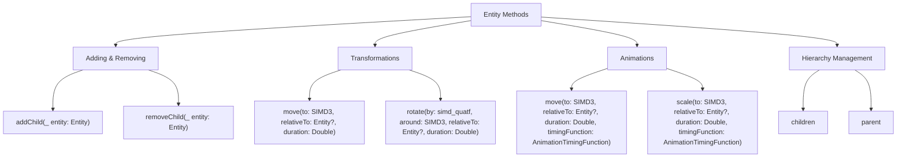

---

## **5. Enumerations and Configurations**

### **a. Enumerations Diagram**
- **Purpose**: Highlight the enums used within `RealityKit` and their possible values.
- **Diagram Type**: `classDiagram`
- **Contents**:
  - **PhysicsShapeResource.Shape**
  - **AnimationTimingFunction**
  - **CameraMode**
  - **AnchorEntity.Component**


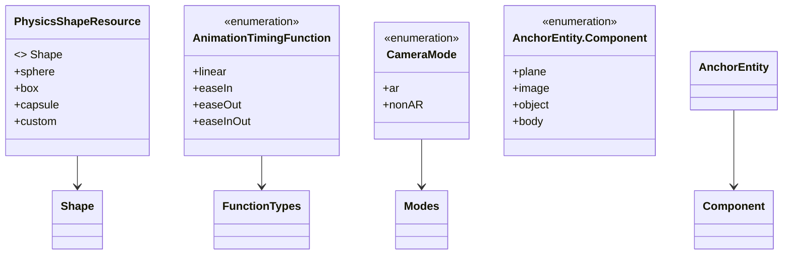

### **b. Configuration Classes Diagram**
- **Purpose**: Show the relationship between `RealityKit` classes and their configuration classes.
- **Diagram Type**: `classDiagram`
- **Contents**:
  - **LightingComponent**
  - **BackgroundComponent**
  - **ModelComponent**
  - **PhysicsBodyComponent**

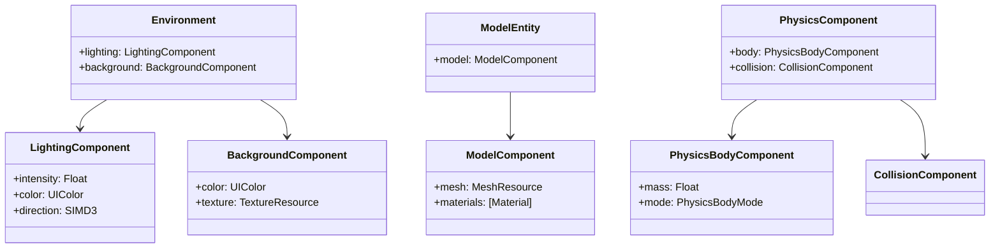

---

## **6. Protocol Conformances**

### **a. Protocols Diagram**
- **Purpose**: Display the protocols that `RealityKit` classes conform to and their implications.
- **Diagram Type**: `classDiagram`
- **Contents**:
  - **Animatable**
  - **HasPhysicsBody**
  - **HasCollision**
  - **HasModel**
  - **HasMaterial**
  - **HasAnchoring**

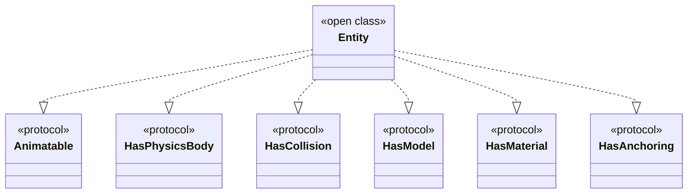

---

## **7. Relationships with Other Classes**

### **a. Related Classes Diagram**
- **Purpose**: Illustrate how `RealityKit` interacts with other Apple frameworks and classes.
- **Diagram Type**: `flowchart TD`
- **Contents**:
  - **ARSession**: Manages augmented reality sessions.
  - **SceneKit**: Interoperability with SceneKit for legacy projects.
  - **Metal**: Utilizes Metal for rendering.
  - **SwiftUI**: Integrates with SwiftUI for UI components.
  - **Combine**: Uses Combine for reactive programming.
  - **UIKit**: Integrates with UIKit for traditional UI elements.

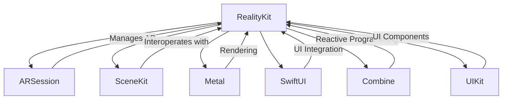

---

## **8. Extensions and Additional Functionalities**

### **a. RealityKit Extensions Diagram**
- **Purpose**: Showcase the additional functionalities provided through extensions in RealityKit.
- **Diagram Type**: `classDiagram`
- **Contents**:
  - **Entity Extensions**
  - **ModelEntity Extensions**
  - **AnchorEntity Extensions**

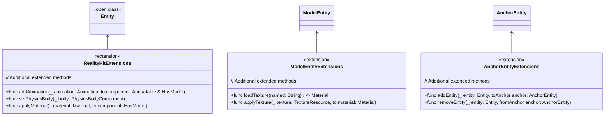

### **b. Extensions Functionalities Flowchart**
- **Purpose**: Detail specific extended methods and their purposes.
- **Diagram Type**: `flowchart LR`
- **Contents**:
  - **Animation Management**
  - **Physics Configuration**
  - **Material Application**

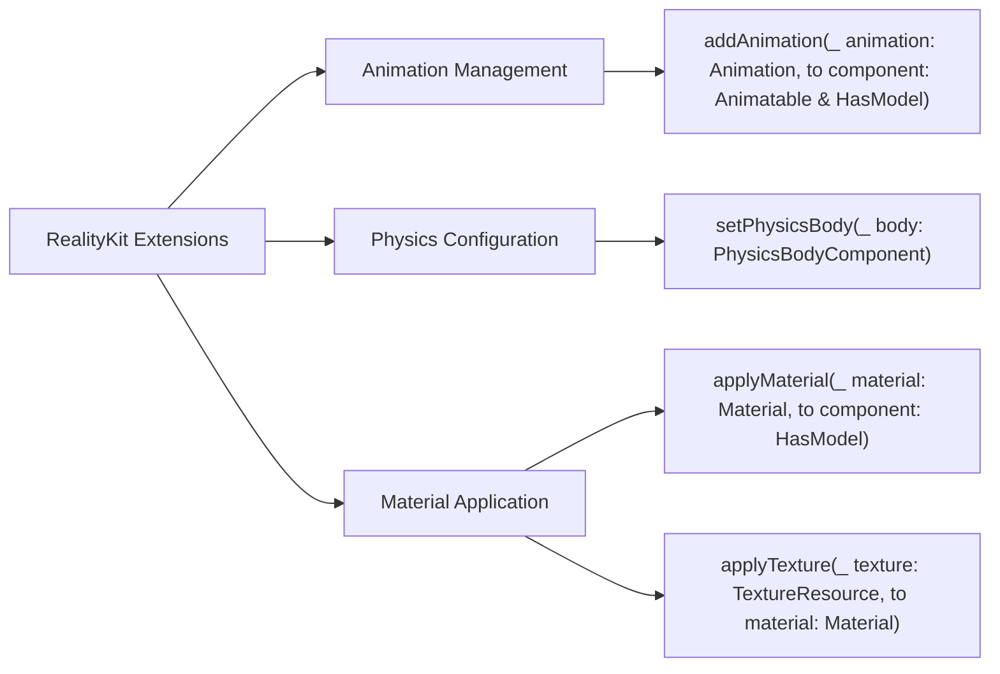

---

## **9. Lifecycle and Use Cases**

### **a. Lifecycle Flowchart**
- **Purpose**: Demonstrate the typical lifecycle of a `RealityKit` session within an application.
- **Diagram Type**: `flowchart TD`
- **Contents**:
  - **Session Setup**
  - **Entities Creation**
  - **Rendering Loop**
  - **User Interaction**
  - **Session Cleanup**

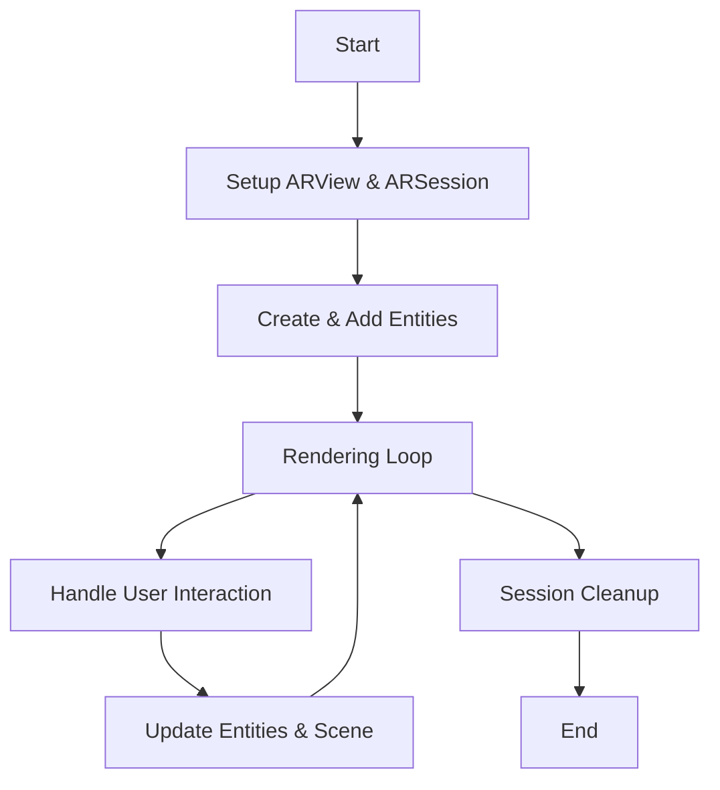

### **b. Common Use Cases Diagram**
- **Purpose**: Outline the typical scenarios where `RealityKit` is utilized.
- **Diagram Type**: `flowchart TD`
- **Contents**:
  - **Augmented Reality Experiences**
  - **3D Model Visualization**
  - **Interactive Games**
  - **Industrial Simulations**
  - **Educational Applications**
  - **Retail & E-commerce**
  - **Architectural Visualization**

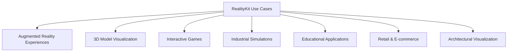

---

## **10. Feature Availability Timeline**

### **a. Feature Availability Gantt Chart**
- **Purpose**: Show when various `RealityKit` features were introduced across iOS versions.
- **Diagram Type**: `gantt`
- **Contents**:
  - **iOS Versions**: 13.0, 14.0, 15.0, 16.0, 17.0
  - **Features Introduced**: Basic AR capabilities, collaborative sessions, RealityKit 2 with advanced rendering, SwiftUI integration, physics simulation enhancements, RealityKit 3 with photorealistic rendering.

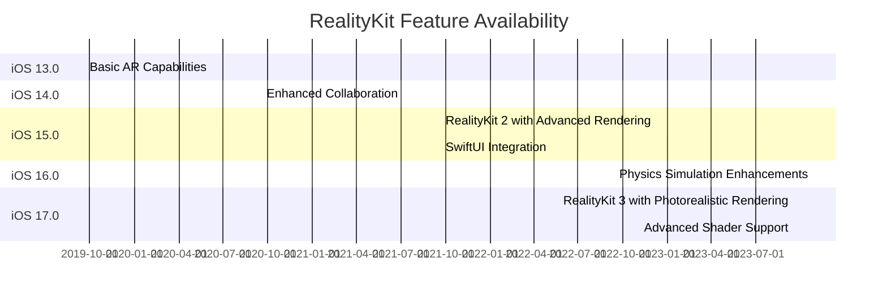

---

## **11. Data Handling and Formats**

### **a. Asset Format Handling Diagram**
- **Purpose**: Explain how `RealityKit` handles different 3D asset data formats.
- **Diagram Type**: `graph LR`
- **Contents**:
  - **USDZ**: Primary format for 3D models.
  - **USD**: Universal Scene Description for complex scenes.
  - **OBJ**: Legacy support for 3D models.
  - **scn**: SceneKit interoperability.
  - **Textures**: Handling of various texture formats (PNG, JPEG, etc.)

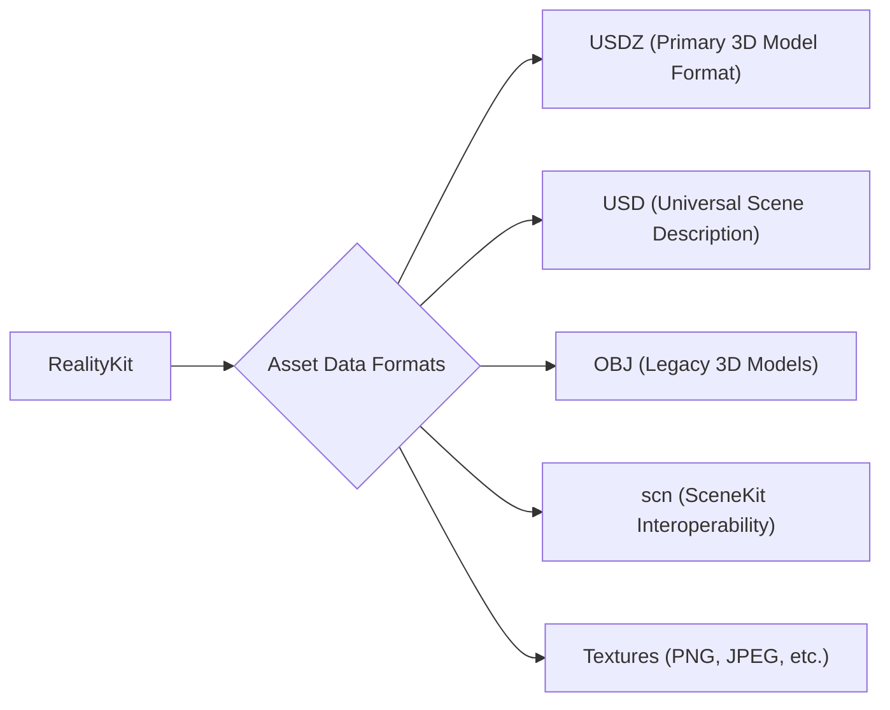

---

## **12. Integration with Drawing Contexts**

### **a. Rendering Pipeline Integration Diagram**
- **Purpose**: Show how `RealityKit` integrates with lower-level rendering contexts like Metal and SwiftUI.
- **Diagram Type**: `flowchart TD`
- **Contents**:
  - **Metal Integration**: Custom shaders, graphics rendering.
  - **SwiftUI Integration**: Embedding ARView within SwiftUI views.
  - **UIKit Integration**: Using ARView within UIKit-based interfaces.
  - **Combine Integration**: Reactive data streams for real-time updates.

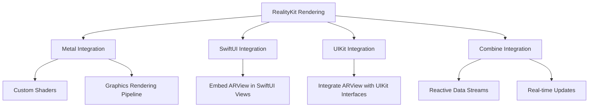

---

## **13. Summary and Best Practices**

### **a. Summary Diagram**
- **Purpose**: Provide a high-level overview of `RealityKit`'s key characteristics and functionalities.
- **Diagram Type**: `graph LR`
- **Contents**:
  - **Seamless AR Integration**
  - **Advanced Rendering Capabilities**
  - **Physics Simulation**
  - **Collaborative Experiences**
  - **SwiftUI Support**
  - **Scalability and Performance**

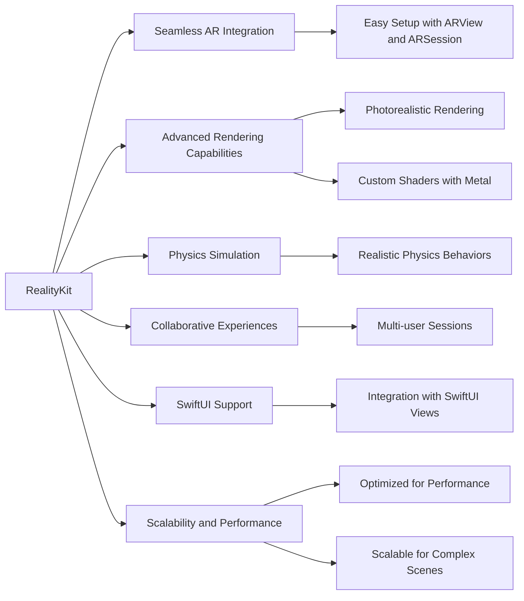

### **b. Best Practices Diagram**
- **Purpose**: Outline recommended practices for using `RealityKit` effectively.
- **Diagram Type**: `graph LR`
- **Contents**:
  - **Optimizing Performance**: Level of detail (LOD), efficient resource management.
  - **Modular Design**: Structuring code with entities and components.
  - **Asset Management**: Using optimized asset formats, minimizing file sizes.
  - **User Experience**: Ensuring smooth interactions, intuitive controls.
  - **Testing and Debugging**: Utilizing RealityKit's debugging tools, thorough testing.

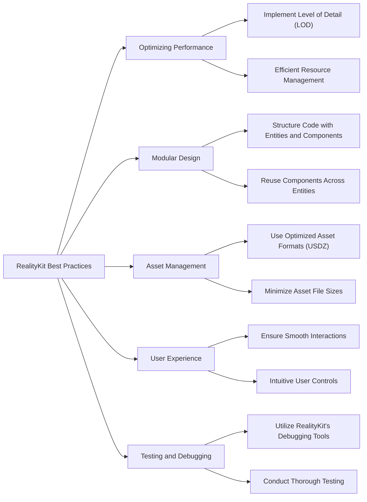


---

## **14. Additional Diagrams**

### **a. Entity-Component System Overview**

- **Purpose**: Illustrate the core architecture of RealityKit's Entity-Component System (ECS), showcasing how entities interact with various components to define behavior and appearance.
- **Diagram Type**: `classDiagram`
- **Contents**:
  - **Entities**: Fundamental objects within the scene.
  - **Components**: Modules that add specific functionalities or properties to entities.
  - **Systems**: Processes that operate on entities with specific components (optional, as RealityKit abstracts systems).
  - **Relationships**: How entities aggregate components and interact within the ECS.

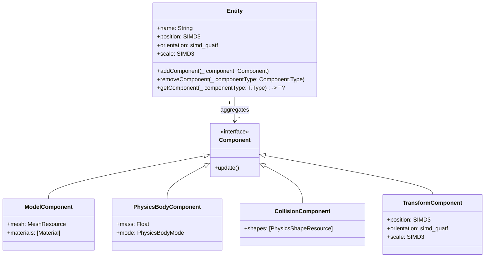

---

### **b. Animation Workflow in RealityKit**

- **Purpose**: Detail the process of creating, configuring, and applying animations to entities within RealityKit.
- **Diagram Type**: `flowchart TD`
- **Contents**:
  - **Animation Creation**: Defining keyframes, durations, and timing functions.
  - **Animation Configuration**: Setting properties like repeat count, autoreverse, etc.
  - **Applying Animation**: Assigning the animation to specific components of an entity.
  - **Playback Management**: Controlling the start, pause, resume, and stop of animations.

```mermaid
flowchart TD
    A[Animation Workflow] --> B[Create Animation]
    B --> C{Define Keyframes}
    C --> C1[Set Start and End Values]
    C --> C2[Specify Duration]
    C --> C3[Choose Timing Function]

    B --> D[Configure Animation]
    D --> D1[Set Repeat Count]
    D --> D2[Enable Autoreverse]
    D --> D3[Define Delay]

    A --> E[Apply Animation]
    E --> E1[Select Target Component]
    E --> E2[Assign Animation to Component]

    A --> F[Manage Playback]
    F --> F1[Start Animation]
    F --> F2[Pause Animation]
    F --> F3[Resume Animation]
    F --> F4[Stop Animation]

    style C fill:#312,stroke:#33,stroke-width:2px
    style D fill:#13f,stroke:#33,stroke-width:2px
    style E fill:#c4c,stroke:#33,stroke-width:2px
    style F fill:#229f,stroke:#33,stroke-width:2px
```

---

### **c. Collision Detection and Physics Interaction Diagram**

- **Purpose**: Showcase how RealityKit handles collision detection and physics interactions between entities, including the roles of various components.
- **Diagram Type**: `classDiagram`
- **Contents**:
  - **Entities**: Objects that can participate in physics simulations.
  - **Physics Components**: Components that define physical properties.
  - **Collision Components**: Define collision shapes and behaviors.
  - **Physics Engine**: Handles the simulation and interaction logic.

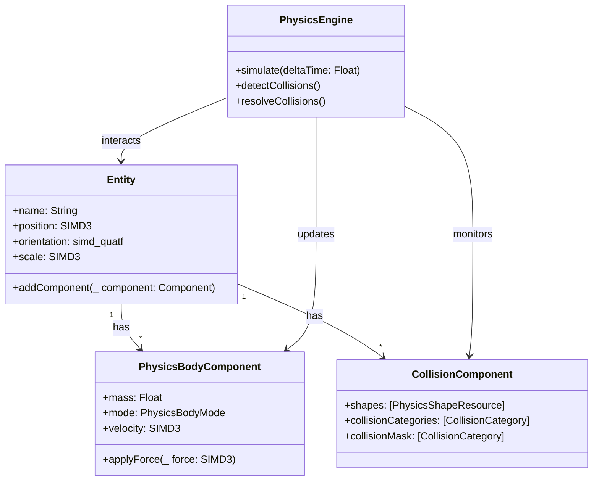

---

### **d. Multi-User Collaborative Sessions Data Flow**

- **Purpose**: Illustrate the data flow and synchronization mechanisms involved in enabling multi-user collaborative AR sessions using RealityKit.
- **Diagram Type**: `sequenceDiagram`
- **Contents**:
  - **Participants**: Multiple users/devices, ARSession, Network Layer, Entity Updates.
  - **Processes**: Data synchronization, entity state broadcasting, receiving and applying updates.

```mermaid
sequenceDiagram
    participant UserA as User A Device
    participant Network as Network Layer
    participant UserB as User B Device
    participant ARSessionA as ARSession A
    participant ARSessionB as ARSession B

    UserA->>ARSessionA: Moves Entity X
    ARSessionA->>Network: Send Entity X Update
    Network-->>UserB: Broadcast Entity X Update
    UserB->>ARSessionB: Receive Entity X Update
    ARSessionB->>EntityX: Apply Update to Entity X

    UserB->>ARSessionB: Rotates Entity Y
    ARSessionB->>Network: Send Entity Y Update
    Network-->>UserA: Broadcast Entity Y Update
    UserA->>ARSessionA: Receive Entity Y Update
    ARSessionA->>EntityY: Apply Update to Entity Y
```

---

### **e. Rendering Pipeline Integration with Metal and SwiftUI**

- **Purpose**: Demonstrate how RealityKit integrates with Metal for low-level rendering and with SwiftUI for user interface components.
- **Diagram Type**: `flowchart LR`
- **Contents**:
  - **RealityKit Rendering**: Core rendering process.
  - **Metal Integration**: Custom shaders and graphics pipeline.
  - **SwiftUI Integration**: Embedding ARView within SwiftUI views.
  - **Data Flow**: How data moves between RealityKit, Metal, and SwiftUI.

```mermaid
flowchart LR
    A[RealityKit Rendering Pipeline] --> B[Metal Integration]
    A --> C[SwiftUI Integration]
    B --> B1[Custom Shaders]
    B --> B2[Graphics Pipeline Management]
    C --> C1[Embed ARView in SwiftUI]
    C1 --> C2[SwiftUI Views Interaction]
    B2 --> D[Render Output]
    C2 --> D
    B1 --> D
```

---

### **f. Event Handling and User Interaction Flowchart**

- **Purpose**: Outline how RealityKit handles user interactions and events, such as gestures and collisions, and how these events propagate through the system.
- **Diagram Type**: `flowchart TD`
- **Contents**:
  - **User Input**: Gestures (tap, swipe, etc.)
  - **Event Recognition**: Detecting and interpreting gestures.
  - **Event Handling**: Triggering responses in entities.
  - **Event Propagation**: How events flow through the entity hierarchy.

```mermaid
flowchart TD
    A[User Interaction] --> B[Gesture Recognition]
    B --> C{Gesture Type}
    C --> |Tap| D[Handle Tap Event]
    C --> |Swipe| E[Handle Swipe Event]
    C --> |Pinch| F[Handle Pinch Event]
    
    D --> G[Trigger Entity Action]
    E --> G
    F --> G
    
    G --> H[Update Entity State]
    H --> I[Render Updated Scene]
    
    style A fill:#f19f,stroke:#131f,stroke-width:2px
    style B fill:#c2cf,stroke:#131f,stroke-width:2px
    style C fill:#c4fc,stroke:#131f,stroke-width:2px
    style D fill:#f5cf,stroke:#131f,stroke-width:2px
    style E fill:#f5cf,stroke:#131f,stroke-width:2px
    style F fill:#f5cf,stroke:#131f,stroke-width:2px
    style G fill:#c14f,stroke:#131f,stroke-width:2px
    style H fill:#f8fc,stroke:#131f,stroke-width:2px
    style I fill:#c599,stroke:#131f,stroke-width:2px
```

---

### **g. Data Flow Diagram for Asset Loading and Management**

- **Purpose**: Visualize the process of loading, managing, and utilizing 3D assets within RealityKit applications.
- **Diagram Type**: `flowchart LR`
- **Contents**:
  - **Asset Sources**: Local Bundle, Remote URLs.
  - **Loading Process**: Fetching, decoding, and preparing assets.
  - **Asset Management**: Caching, referencing, and updating assets.
  - **Usage in Scene**: Integrating assets into the AR scene.

```mermaid
flowchart LR
    A[Asset Sources] --> B[Local Bundle]
    A --> C[Remote URLs]

    B --> D[Load Asset]
    C --> D

    D --> E["Decode Asset (USDZ, OBJ, etc.)"]
    E --> F[Prepare Asset for Use]

    F --> G[Cache Asset]
    F --> H[Reference Asset in Entities]

    G --> I[Manage Asset Lifecycle]
    H --> J[Integrate into AR Scene]

    style A fill:#f29f,stroke:#432,stroke-width:2px
    style B fill:#c2cf,stroke:#432,stroke-width:2px
    style C fill:#c2cf,stroke:#432,stroke-width:2px
    style D fill:#291f,stroke:#432,stroke-width:2px
    style E fill:#291f,stroke:#432,stroke-width:2px
    style F fill:#291f,stroke:#432,stroke-width:2px
    style G fill:#f23c,stroke:#432,stroke-width:2px
    style H fill:#c29f,stroke:#432,stroke-width:2px
    style I fill:#f23c,stroke:#432,stroke-width:2px
    style J fill:#c929,stroke:#432,stroke-width:2px
```

---

### **h. System Interaction Diagram with Combine for Reactive Programming**

- **Purpose**: Display how RealityKit leverages Combine for handling asynchronous events and data streams within AR sessions.
- **Diagram Type**: `sequenceDiagram`
- **Contents**:
  - **Participants**: RealityKit Components, Combine Publishers, Subscribers.
  - **Processes**: Data emission, transformation, and subscription handling.

```mermaid
sequenceDiagram
    participant ARView as RealityKit.ARView
    participant Publisher as Combine.Publisher
    participant Subscriber as Combine.Subscriber

    ARView->>Publisher: Emit ARSession State Changes
    Publisher->>Subscriber: Send Updated Data
    Subscriber->>ARView: Handle State Updates
    Subscriber->>UI: Update User Interface
```

---

### **i. Dependency Graph: RealityKit and Associated Frameworks**

- **Purpose**: Visualize the dependencies between RealityKit and other Apple frameworks, highlighting integration points and shared functionalities.
- **Diagram Type**: `graph LR`
- **Contents**:
  - **RealityKit**: Central node.
  - **Related Frameworks**: ARKit, Metal, SwiftUI, Combine, SceneKit, etc.
  - **Dependencies**: How RealityKit relies on or interacts with each framework.

```mermaid
graph LR
    A[RealityKit] --> B[ARKit]
    A --> C[Metal]
    A --> D[SwiftUI]
    A --> E[Combine]
    A --> F[SceneKit]
    A --> G[UIKit]
    A --> H[CoreML]
    A --> I[CoreAnimation]

    B --> |Provides AR Functionality| A
    C --> |Rendering Engine| A
    D --> |UI Integration| A
    E --> |Reactive Programming| A
    F --> |Legacy AR Support| A
    G --> |Traditional UI Elements| A
    H --> |Machine Learning Integration| A
    I --> |Advanced Animations| A
```

---

### **j. Component Interaction Diagram in an AR Scene**

- **Purpose**: Demonstrate how different components interact within an AR scene, such as lighting, physics, and rendering.
- **Diagram Type**: `classDiagram`
- **Contents**:
  - **Entity**: Fundamental object.
  - **ModelComponent**: Defines visual appearance.
  - **PhysicsBodyComponent**: Defines physical properties.
  - **CollisionComponent**: Manages collision behaviors.
  - **LightingComponent**: Defines lighting properties.
  - **RenderingEngine**: Handles rendering of components.

```mermaid
classDiagram
    class Entity {
        +name: String
        +position: SIMD3<Float>
        +addComponent(_ component: Component)
    }

    class ModelComponent {
        +mesh: MeshResource
        +materials: [Material]
    }

    class PhysicsBodyComponent {
        +mass: Float
        +mode: PhysicsBodyMode
    }

    class CollisionComponent {
        +shapes: [PhysicsShapeResource]
    }

    class LightingComponent {
        +intensity: Float
        +color: UIColor
    }

    class RenderingEngine {
        +render(entity: Entity)
    }

    Entity --> ModelComponent
    Entity --> PhysicsBodyComponent
    Entity --> CollisionComponent
    Entity --> LightingComponent
    RenderingEngine --> ModelComponent
    RenderingEngine --> LightingComponent
```

---

### **k. Data Flow Diagram for Real-Time Synchronization in Multi-User AR**

- **Purpose**: Illustrate the data synchronization process for maintaining consistency across multiple users in a shared AR environment.
- **Diagram Type**: `flowchart LR`
- **Contents**:
  - **User Devices**: Multiple participants.
  - **Server/Cloud**: Central hub for data synchronization.
  - **Data Streams**: Entity states, transformations, events.
  - **Synchronization Mechanisms**: Conflict resolution, latency handling.

```mermaid
flowchart LR
    A[User Device A] -->|Send Entity State| C[Server/Cloud]
    B[User Device B] -->|Send Entity State| C
    C -->|Broadcast Updates| A
    C -->|Broadcast Updates| B

    A --> D[Render Updated Scene]
    B --> D
    
    C --> E[Conflict Resolution]
    E --> C
```


---
**Licenses:**

- **MIT License:**  [](LICENSE) - Full text in [LICENSE](LICENSE) file.
- **Creative Commons Attribution 4.0 International:** [](LICENSE-CC-BY) - Legal details in [LICENSE-CC-BY](LICENSE-CC-BY) and at [Creative Commons official site](http://creativecommons.org/licenses/by/4.0/).

---