# Room Plan

Below is a comprehensive and organized set of Mermaid diagrams for the **Room Plan** framework. Each section includes a description, the appropriate diagram type, contents, and the corresponding Mermaid syntax.

---

## **1. Class Structure and Hierarchy**

### **a. Core Class Diagram**
- **Purpose**: Illustrate the primary structure of the `RoomPlan` framework, including its main classes, properties, methods, and enumerations.
- **Diagram Type**: `classDiagram`
- **Contents**:
  - **Classes**: `RoomPlanSession`, `RPVisualizer`, `RPRoom`, `RPScanResult`
  - **Properties**: Key attributes like `delegate`, `isScanning`, `currentScan`, etc.
  - **Methods**: Essential functions like `startScanning()`, `stopScanning()`, `resetSession()`, etc.
  - **Enumerations**: Nested enums such as `RPScanningState`, `RPError`

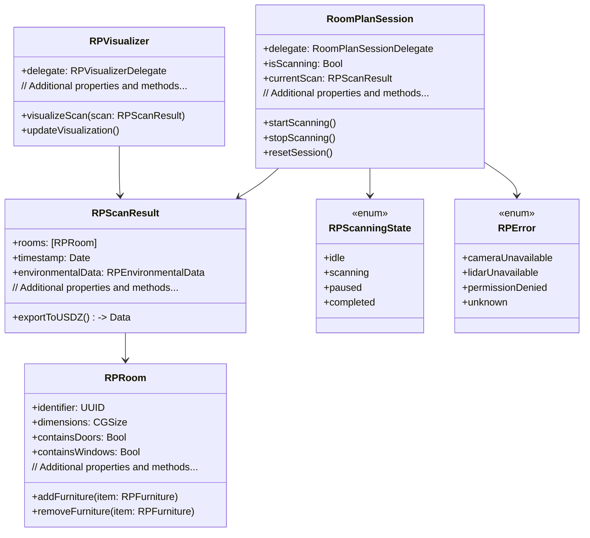
```mermaid
classDiagram
    class RoomPlanSession {
        +delegate: RoomPlanSessionDelegate
        +isScanning: Bool
        +currentScan: RPScanResult
        +startScanning()
        +stopScanning()
        +resetSession()
        // Additional properties and methods...
    }

    class RPVisualizer {
        +delegate: RPVisualizerDelegate
        +visualizeScan(scan: RPScanResult)
        +updateVisualization()
        // Additional properties and methods...
    }

    class RPRoom {
        +identifier: UUID
        +dimensions: CGSize
        +containsDoors: Bool
        +containsWindows: Bool
        +addFurniture(item: RPFurniture)
        +removeFurniture(item: RPFurniture)
        // Additional properties and methods...
    }

    class RPScanResult {
        +rooms: [RPRoom]
        +timestamp: Date
        +environmentalData: RPEnvironmentalData
        +exportToUSDZ() -> Data
        // Additional properties and methods...
    }

    class RPScanningState {
        <<enum>>
        +idle
        +scanning
        +paused
        +completed
    }

    class RPError {
        <<enum>>
        +cameraUnavailable
        +lidarUnavailable
        +permissionDenied
        +unknown
    }

    RoomPlanSession --> RPScanningState
    RoomPlanSession --> RPError
    RoomPlanSession --> RPScanResult
    RPVisualizer --> RPScanResult
    RPScanResult --> RPRoom
```

---

## **2. Initializers Overview**

### **a. Initialization Methods Diagram**
- **Purpose**: Break down the various ways to instantiate `RoomPlanSession` and `RPVisualizer`.
- **Diagram Type**: `flowchart LR`
- **Contents**:
  - **Session Initialization**: `init(delegate:)`, `init(configuration:)`
  - **Visualizer Initialization**: `init(delegate:)`, `init(configuration:)`
  - **Configuration Setup**: `RPSessionConfiguration`, `RPVisualizerConfiguration`
  - **Error Handling**: `handleInitializationError()`

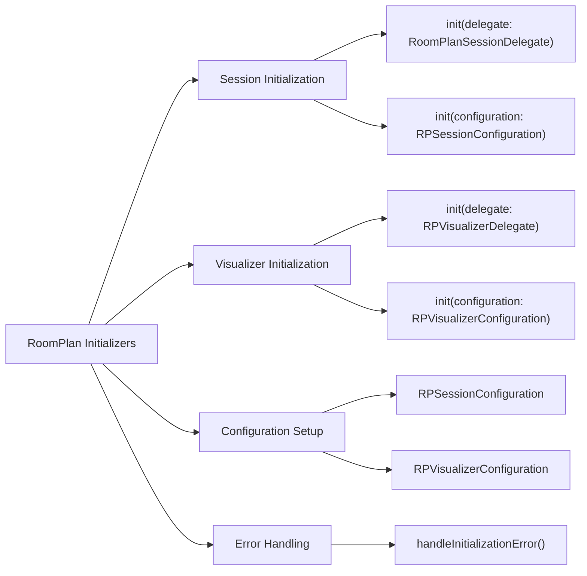
```mermaid
graph LR
    A[RoomPlan Initializers] --> B[Session Initialization]
    A --> C[Visualizer Initialization]
    A --> D[Configuration Setup]
    A --> E[Error Handling]

    B --> B1["init(delegate: RoomPlanSessionDelegate)"]
    B --> B2["init(configuration: RPSessionConfiguration)"]

    C --> C1["init(delegate: RPVisualizerDelegate)"]
    C --> C2["init(configuration: RPVisualizerConfiguration)"]

    D --> D1["RPSessionConfiguration"]
    D --> D2["RPVisualizerConfiguration"]

    E --> E1["handleInitializationError()"]
```

---

## **3. Properties Breakdown**

### **a. Key Properties Diagram**
- **Purpose**: Detail the main properties of `RoomPlanSession` and related classes.
- **Diagram Type**: `classDiagram`
- **Contents**:
  - **Session Properties**: `delegate`, `isScanning`, `currentScan`
  - **Visualizer Properties**: `delegate`, `visualizationMode`
  - **Scan Result Properties**: `rooms`, `timestamp`, `environmentalData`
  - **Room Properties**: `identifier`, `dimensions`, `containsDoors`, `containsWindows`

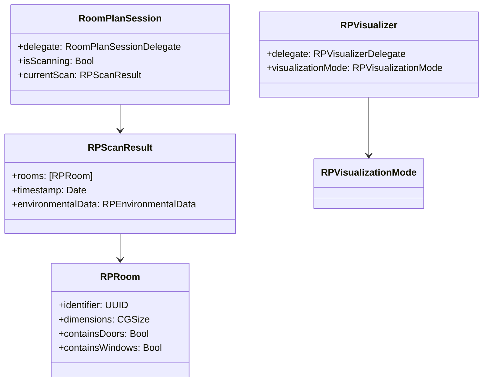
```mermaid
classDiagram
    class RoomPlanSession {
        +delegate: RoomPlanSessionDelegate
        +isScanning: Bool
        +currentScan: RPScanResult
    }

    class RPVisualizer {
        +delegate: RPVisualizerDelegate
        +visualizationMode: RPVisualizationMode
    }

    class RPScanResult {
        +rooms: [RPRoom]
        +timestamp: Date
        +environmentalData: RPEnvironmentalData
    }

    class RPRoom {
        +identifier: UUID
        +dimensions: CGSize
        +containsDoors: Bool
        +containsWindows: Bool
    }

    RoomPlanSession --> RPScanResult
    RPScanResult --> RPRoom
    RPVisualizer --> RPVisualizationMode
```

---

## **4. Methods Grouped by Functionality**

### **a. Scanning Methods**
- **Purpose**: Categorize methods based on their roles in managing scanning sessions.
- **Diagram Type**: `flowchart TD`
- **Contents**:
  - **Session Control**: `startScanning()`, `stopScanning()`, `pauseScanning()`
  - **Session Management**: `resetSession()`, `updateConfiguration(_:)`
  - **Data Handling**: `exportScanData()`, `importScanData()`
  - **Error Handling**: `handleScanError(_:)`

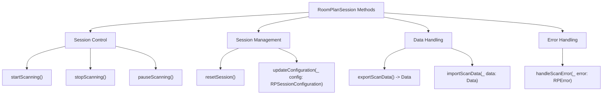
```mermaid
flowchart TD
    A[RoomPlanSession Methods] --> B[Session Control]
    A --> C[Session Management]
    A --> D[Data Handling]
    A --> E[Error Handling]

    B --> B1["startScanning()"]
    B --> B2["stopScanning()"]
    B --> B3["pauseScanning()"]

    C --> C1["resetSession()"]
    C --> C2["updateConfiguration(_ config: RPSessionConfiguration)"]

    D --> D1["exportScanData() -> Data"]
    D --> D2["importScanData(_ data: Data)"]

    E --> E1["handleScanError(_ error: RPError)"]
```

---

## **5. Enumerations and Configurations**

### **a. Enumerations Diagram**
- **Purpose**: Highlight the enums used within `RoomPlan` and their possible values.
- **Diagram Type**: `classDiagram`
- **Contents**:
  - **RPScanningState**
  - **RPVisualizationMode**
  - **RPError**

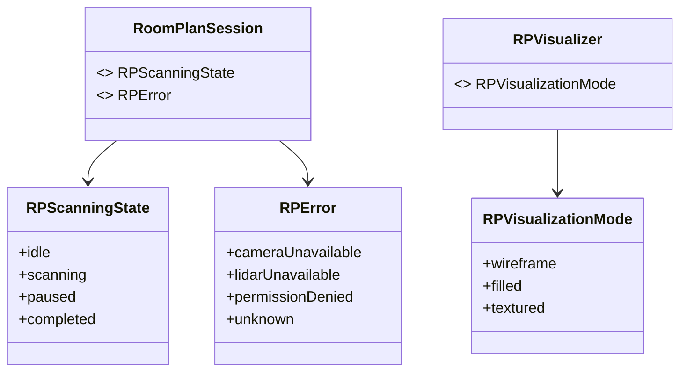
```mermaid
classDiagram
    class RoomPlanSession {
        <<enumeration>> RPScanningState
        <<enumeration>> RPError
    }

    class RPVisualizer {
        <<enumeration>> RPVisualizationMode
    }

    class RPScanningState {
        +idle
        +scanning
        +paused
        +completed
    }

    class RPVisualizationMode {
        +wireframe
        +filled
        +textured
    }

    class RPError {
        +cameraUnavailable
        +lidarUnavailable
        +permissionDenied
        +unknown
    }

    RoomPlanSession --> RPScanningState
    RoomPlanSession --> RPError
    RPVisualizer --> RPVisualizationMode
```

### **b. Configuration Classes Diagram**
- **Purpose**: Show the relationship between `RoomPlanSession`, `RPVisualizer`, and their configuration classes.
- **Diagram Type**: `classDiagram`
- **Contents**:
  - **RPSessionConfiguration**
  - **RPVisualizerConfiguration**

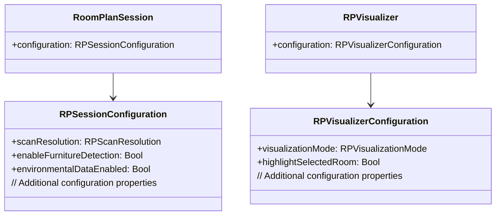
```mermaid
classDiagram
    class RoomPlanSession {
        +configuration: RPSessionConfiguration
    }

    class RPVisualizer {
        +configuration: RPVisualizerConfiguration
    }

    class RPSessionConfiguration {
        +scanResolution: RPScanResolution
        +enableFurnitureDetection: Bool
        +environmentalDataEnabled: Bool
        // Additional configuration properties
    }

    class RPVisualizerConfiguration {
        +visualizationMode: RPVisualizationMode
        +highlightSelectedRoom: Bool
        // Additional configuration properties
    }

    RoomPlanSession --> RPSessionConfiguration
    RPVisualizer --> RPVisualizerConfiguration
```

---

## **6. Protocol Conformances**

### **a. Protocols Diagram**
- **Purpose**: Display the protocols that `RoomPlanSession` and `RPVisualizer` conform to and their impact.
- **Diagram Type**: `classDiagram`
- **Contents**:
  - **RoomPlanSessionDelegate**
  - **RPVisualizerDelegate**
  - **NSSecureCoding**
  - **Sendable**

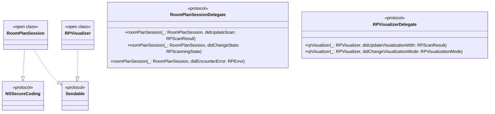
```mermaid
classDiagram
    class RoomPlanSession {
        <<open class>>
    }

    class RPVisualizer {
        <<open class>>
    }

    class RoomPlanSessionDelegate {
        <<protocol>>
        +roomPlanSession(_: RoomPlanSession, didUpdateScan: RPScanResult)
        +roomPlanSession(_: RoomPlanSession, didChangeState: RPScanningState)
        +roomPlanSession(_: RoomPlanSession, didEncounterError: RPError)
    }

    class RPVisualizerDelegate {
        <<protocol>>
        +rpVisualizer(_: RPVisualizer, didUpdateVisualizationWith: RPScanResult)
        +rpVisualizer(_: RPVisualizer, didChangeVisualizationMode: RPVisualizationMode)
    }

    class NSSecureCoding {
        <<protocol>>
    }

    class Sendable {
        <<protocol>>
    }

    RoomPlanSession ..|> NSSecureCoding
    RoomPlanSession ..|> Sendable
    RPVisualizer ..|> Sendable
```

---

## **7. Relationships with Other Classes**

### **a. Related Classes Diagram**
- **Purpose**: Illustrate how `RoomPlan` interacts with other Apple frameworks and classes.
- **Diagram Type**: `flowchart TD`
- **Contents**:
  - **ARKit**: Integration with augmented reality sessions.
  - **SceneKit**: 3D rendering of scanned rooms.
  - **Metal**: GPU-accelerated rendering for visualizations.
  - **CoreLocation**: Incorporating location data into room scans.
  - **UIKit**: Displaying visualizations within UI components.
  - **SwiftUI**: Integrating with SwiftUI views for real-time updates.
  - **Combine**: Reactive data handling and state management.

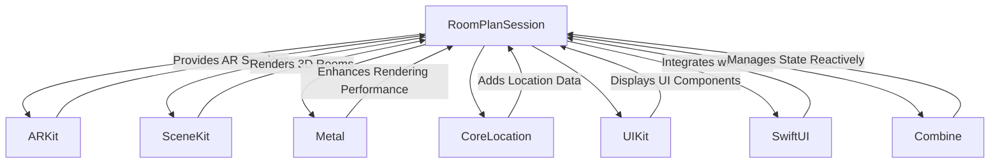
```mermaid
flowchart TD
    A[RoomPlanSession] --> B[ARKit]
    A --> C[SceneKit]
    A --> D[Metal]
    A --> E[CoreLocation]
    A --> F[UIKit]
    A --> G[SwiftUI]
    A --> H[Combine]

    B --> |Provides AR Sessions| A
    C --> |Renders 3D Rooms| A
    D --> |Enhances Rendering Performance| A
    E --> |Adds Location Data| A
    F --> |Displays UI Components| A
    G --> |Integrates with Views| A
    H --> |Manages State Reactively| A
```

---

## **8. Extensions and Additional Functionalities**

### **a. RoomPlan Extensions Diagram**
- **Purpose**: Showcase the additional functionalities provided through extensions.
- **Diagram Type**: `classDiagram`
- **Contents**:
  - **RPRoom Extensions**
  - **RPScanResult Extensions**
  - **RPVisualizer Extensions**

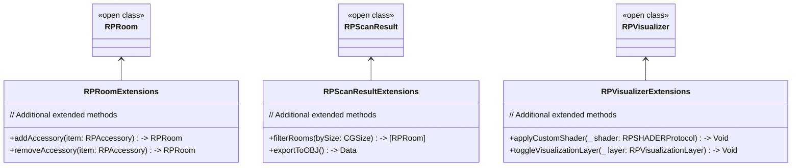
```mermaid
classDiagram
    class RPRoom {
        <<open class>>
    }

    class RPScanResult {
        <<open class>>
    }

    class RPVisualizer {
        <<open class>>
    }

    class RPRoomExtensions {
        +addAccessory(item: RPAccessory) -> RPRoom
        +removeAccessory(item: RPAccessory) -> RPRoom
        // Additional extended methods
    }

    class RPScanResultExtensions {
        +filterRooms(bySize: CGSize) -> [RPRoom]
        +exportToOBJ() -> Data
        // Additional extended methods
    }

    class RPVisualizerExtensions {
        +applyCustomShader(_ shader: RPSHADERProtocol) -> Void
        +toggleVisualizationLayer(_ layer: RPVisualizationLayer) -> Void
        // Additional extended methods
    }

    RPRoom <-- RPRoomExtensions
    RPScanResult <-- RPScanResultExtensions
    RPVisualizer <-- RPVisualizerExtensions
```

### **b. Extensions Functionalities Flowchart**
- **Purpose**: Detail specific extended methods and their purposes.
- **Diagram Type**: `flowchart LR`
- **Contents**:
  - **Accessory Management**
  - **Room Filtering**
  - **Visualization Customization**

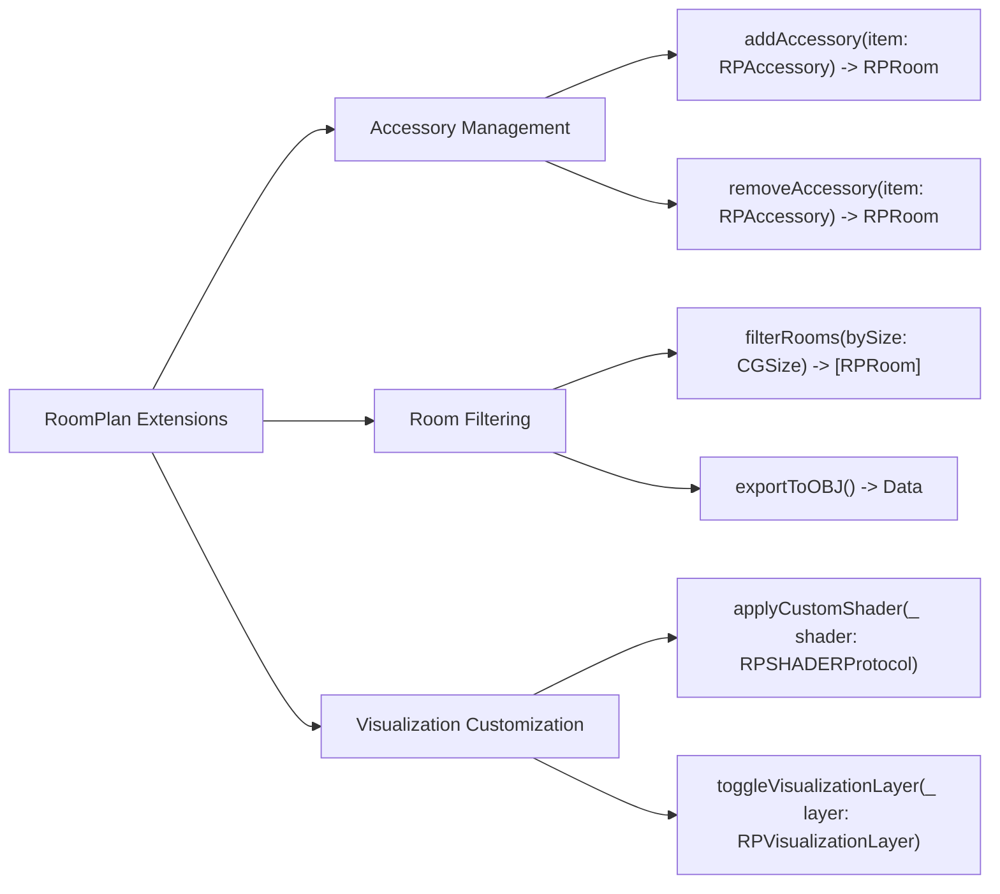
```mermaid
flowchart LR
    A[RoomPlan Extensions] --> B[Accessory Management]
    A --> C[Room Filtering]
    A --> D[Visualization Customization]

    B --> B1["addAccessory(item: RPAccessory) -> RPRoom"]
    B --> B2["removeAccessory(item: RPAccessory) -> RPRoom"]

    C --> C1["filterRooms(bySize: CGSize) -> [RPRoom]"]
    C --> C2["exportToOBJ() -> Data"]

    D --> D1["applyCustomShader(_ shader: RPSHADERProtocol)"]
    D --> D2["toggleVisualizationLayer(_ layer: RPVisualizationLayer)"]
```

---

## **9. Lifecycle and Use Cases**

### **a. Lifecycle Flowchart**
- **Purpose**: Demonstrate the typical lifecycle of a `RoomPlanSession` within an application.
- **Diagram Type**: `flowchart TD`
- **Contents**:
  - **Initialization**
  - **Starting Scan**
  - **Real-time Data Capture**
  - **Visualization Update**
  - **Stopping Scan**
  - **Data Export**
  - **Session Termination**

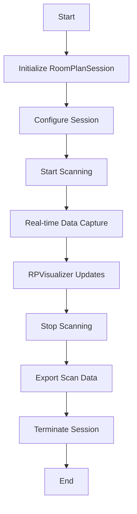
```mermaid
flowchart TD
    Start[Start] --> Init[Initialize RoomPlanSession]
    Init --> Configure[Configure Session]
    Configure --> StartScan[Start Scanning]
    StartScan --> Capture[Real-time Data Capture]
    Capture --> Visualize[RPVisualizer Updates]
    Visualize --> StopScan[Stop Scanning]
    StopScan --> Export[Export Scan Data]
    Export --> Terminate[Terminate Session]
    Terminate --> End[End]
```

### **b. Common Use Cases Diagram**
- **Purpose**: Outline the typical scenarios where `RoomPlan` is utilized.
- **Diagram Type**: `flowchart TD`
- **Contents**:
  - **Augmented Reality Home Design**
  - **Interior Mapping for Real Estate**
  - **Space Planning and Furniture Layout**
  - **Virtual Tours and Interactive Experiences**
  - **Facility Management and Maintenance**
  - **Game Development with Real-world Environments**

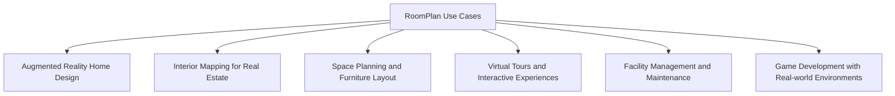
```mermaid
flowchart TD
    A[RoomPlan Use Cases] --> B[Augmented Reality Home Design]
    A --> C[Interior Mapping for Real Estate]
    A --> D[Space Planning and Furniture Layout]
    A --> E[Virtual Tours and Interactive Experiences]
    A --> F[Facility Management and Maintenance]
    A --> G[Game Development with Real-world Environments]
```

---

## **10. Feature Availability Timeline**

### **a. Feature Availability Gantt Chart**
- **Purpose**: Show when various `RoomPlan` features were introduced across iOS versions.
- **Diagram Type**: `gantt`
- **Contents**:
  - **iOS Versions**: 16.0, 16.1, 16.2, 17.0
  - **Features Introduced**: Basic scanning, furniture detection, advanced visualization modes, export formats, enhanced error handling, real-time collaboration.

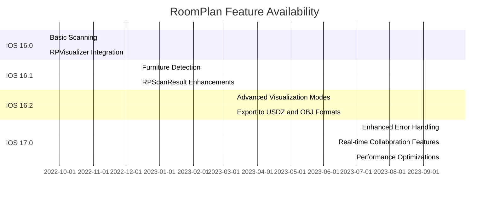
```mermaid
gantt
    dateFormat  YYYY-MM-DD
    title RoomPlan Feature Availability

    section iOS 16.0
    Basic Scanning                       :done, des1, 2022-09-19, 2022-09-19
    RPVisualizer Integration             :done, des2, 2022-09-19, 2022-09-19

    section iOS 16.1
    Furniture Detection                  :done, des3, 2022-12-13, 2022-12-13
    RPScanResult Enhancements            :done, des4, 2022-12-13, 2022-12-13

    section iOS 16.2
    Advanced Visualization Modes         :done, des5, 2023-03-10, 2023-03-10
    Export to USDZ and OBJ Formats        :done, des6, 2023-03-10, 2023-03-10

    section iOS 17.0
    Enhanced Error Handling              :done, des7, 2023-09-18, 2023-09-18
    Real-time Collaboration Features     :done, des8, 2023-09-18, 2023-09-18
    Performance Optimizations            :done, des9, 2023-09-18, 2023-09-18
```

---

## **11. Data Handling and Formats**

### **a. Image and Scan Data Format Handling Diagram**
- **Purpose**: Explain how `RoomPlan` handles different data formats for scans and visualizations.
- **Diagram Type**: `graph LR`
- **Contents**:
  - **Scan Data Formats**: `JSON`, `USDZ`, `OBJ`
  - **Image Formats**: `PNG`, `JPEG`, `HEIC`
  - **Export Methods**: `exportToUSDZ()`, `exportToOBJ()`, `exportToJSON()`

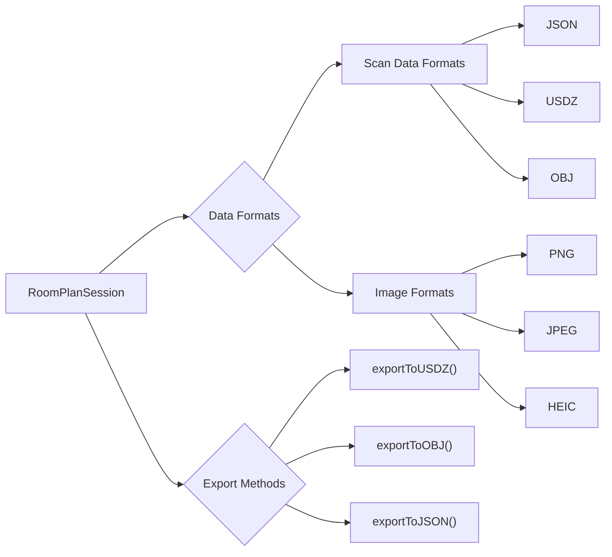
```mermaid
graph LR
    A[RoomPlanSession] --> B{Data Formats}
    B --> C["Scan Data Formats"]
    B --> D["Image Formats"]

    C --> C1["JSON"]
    C --> C2["USDZ"]
    C --> C3["OBJ"]

    D --> D1["PNG"]
    D --> D2["JPEG"]
    D --> D3["HEIC"]

    A --> E{Export Methods}
    E --> E1["exportToUSDZ()"]
    E --> E2["exportToOBJ()"]
    E --> E3["exportToJSON()"]
```

---

## **12. Integration with Drawing Contexts**

### **a. Visualization Methods Usage Diagram**
- **Purpose**: Show how `RPVisualizer` methods are used within different drawing and rendering contexts.
- **Diagram Type**: `flowchart TD`
- **Contents**:
  - **3D Rendering**
  - **Layer Management**
  - **Shader Applications**
  - **User Interaction Handling**
  
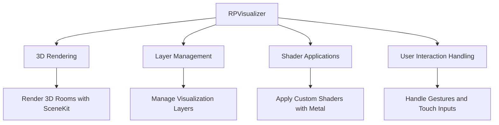
```mermaid
flowchart TD
    RPVisualizer --> A[3D Rendering]
    RPVisualizer --> B[Layer Management]
    RPVisualizer --> C[Shader Applications]
    RPVisualizer --> D[User Interaction Handling]

    A --> A1["Render 3D Rooms with SceneKit"]
    B --> B1["Manage Visualization Layers"]
    C --> C1["Apply Custom Shaders with Metal"]
    D --> D1["Handle Gestures and Touch Inputs"]
```

---

## **13. Summary and Best Practices**

### **a. Summary Diagram**
- **Purpose**: Provide a high-level overview of `RoomPlan`'s key characteristics and functionalities.
- **Diagram Type**: `graph LR`
- **Contents**:
  - **Comprehensive Scanning**
  - **Advanced Visualization**
  - **Seamless Integration**
  - **Robust Data Handling**
  - **Performance Optimizations**
  - **Extensibility**

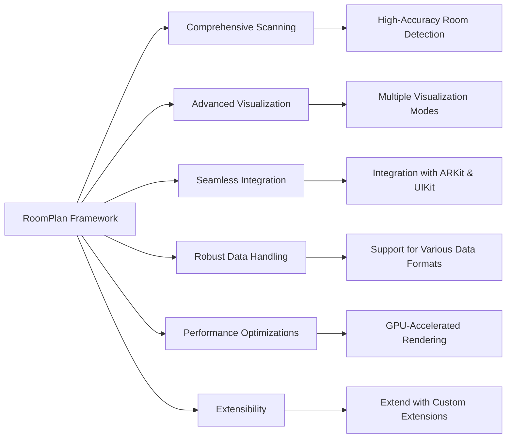
```mermaid
graph LR
    A[RoomPlan Framework] --> B[Comprehensive Scanning]
    A --> C[Advanced Visualization]
    A --> D[Seamless Integration]
    A --> E[Robust Data Handling]
    A --> F[Performance Optimizations]
    A --> G[Extensibility]

    B --> B1[High-Accuracy Room Detection]
    C --> C1[Multiple Visualization Modes]
    D --> D1[Integration with ARKit & UIKit]
    E --> E1[Support for Various Data Formats]
    F --> F1[GPU-Accelerated Rendering]
    G --> G1[Extend with Custom Extensions]
```

---

## **14. Best Practices and Recommendations**

### **a. Best Practices Diagram**
- **Purpose**: Outline recommended practices for utilizing the `RoomPlan` framework effectively.
- **Diagram Type**: `mindmap`
- **Contents**:
  - **Session Management**
  - **Performance Optimization**
  - **Error Handling**
  - **Data Security**
  - **User Experience**
  - **Extensibility**

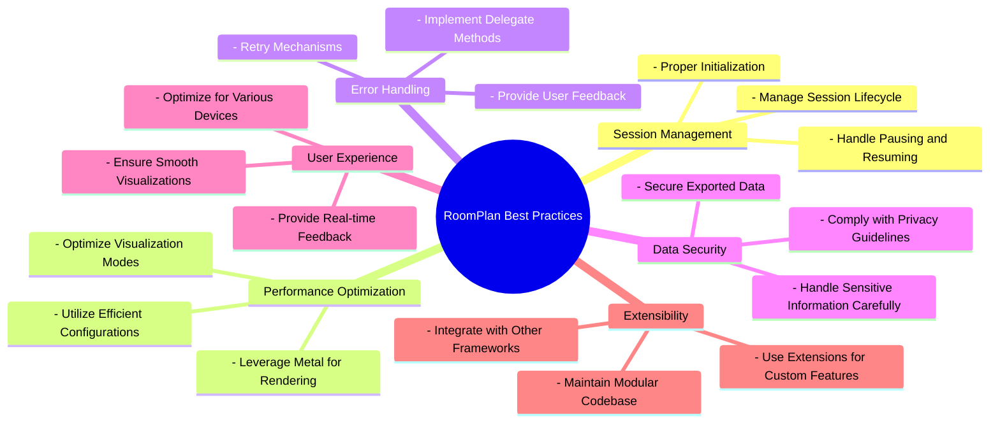
```mermaid
mindmap
  root((RoomPlan Best Practices))
    Session Management
      - Proper Initialization
      - Manage Session Lifecycle
      - Handle Pausing and Resuming
    Performance Optimization
      - Utilize Efficient Configurations
      - Optimize Visualization Modes
      - Leverage Metal for Rendering
    Error Handling
      - Implement Delegate Methods
      - Provide User Feedback
      - Retry Mechanisms
    Data Security
      - Secure Exported Data
      - Handle Sensitive Information Carefully
      - Comply with Privacy Guidelines
    User Experience
      - Provide Real-time Feedback
      - Ensure Smooth Visualizations
      - Optimize for Various Devices
    Extensibility
      - Use Extensions for Custom Features
      - Integrate with Other Frameworks
      - Maintain Modular Codebase
    
```

---

## **15. Advanced Features and Customizations**

### **a. Advanced Features Diagram**
- **Purpose**: Highlight the advanced capabilities and customization options available within the `RoomPlan` framework.
- **Diagram Type**: `graph LR`
- **Contents**:
  - **Furniture Detection**
  - **Environmental Data Integration**
  - **Real-time Collaboration**
  - **Custom Shader Integration**
  - **Multi-Floor Mapping**
  - **Augmented Reality Annotations**

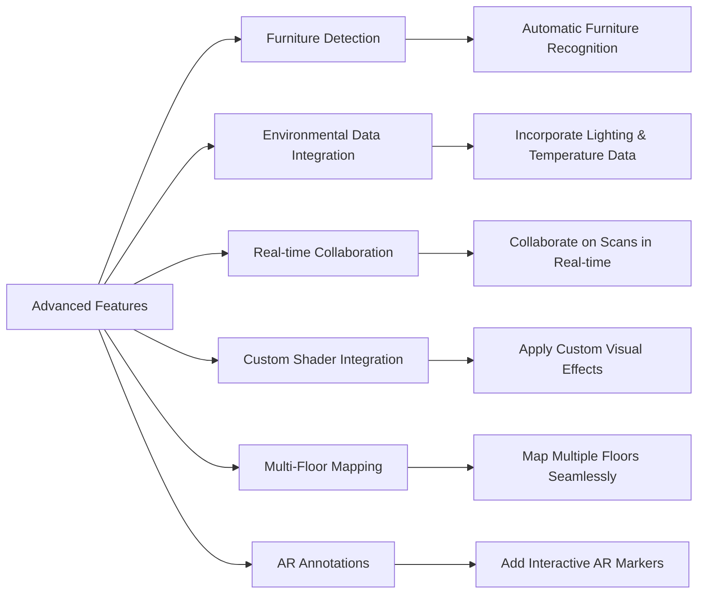
```mermaid
graph LR
    A[Advanced Features] --> B[Furniture Detection]
    A --> C[Environmental Data Integration]
    A --> D[Real-time Collaboration]
    A --> E[Custom Shader Integration]
    A --> F[Multi-Floor Mapping]
    A --> G[AR Annotations]

    B --> B1["Automatic Furniture Recognition"]
    C --> C1["Incorporate Lighting & Temperature Data"]
    D --> D1["Collaborate on Scans in Real-time"]
    E --> E1["Apply Custom Visual Effects"]
    F --> F1["Map Multiple Floors Seamlessly"]
    G --> G1["Add Interactive AR Markers"]
    
```

---

## **16. Integration with Other Apple Frameworks**

### **a. Integration Diagram**
- **Purpose**: Show how `RoomPlan` integrates with other Apple frameworks to enhance functionality.
- **Diagram Type**: `flowchart LR`
- **Contents**:
  - **ARKit**
  - **SceneKit**
  - **Metal**
  - **CoreLocation**
  - **UIKit**
  - **SwiftUI**
  - **Combine**

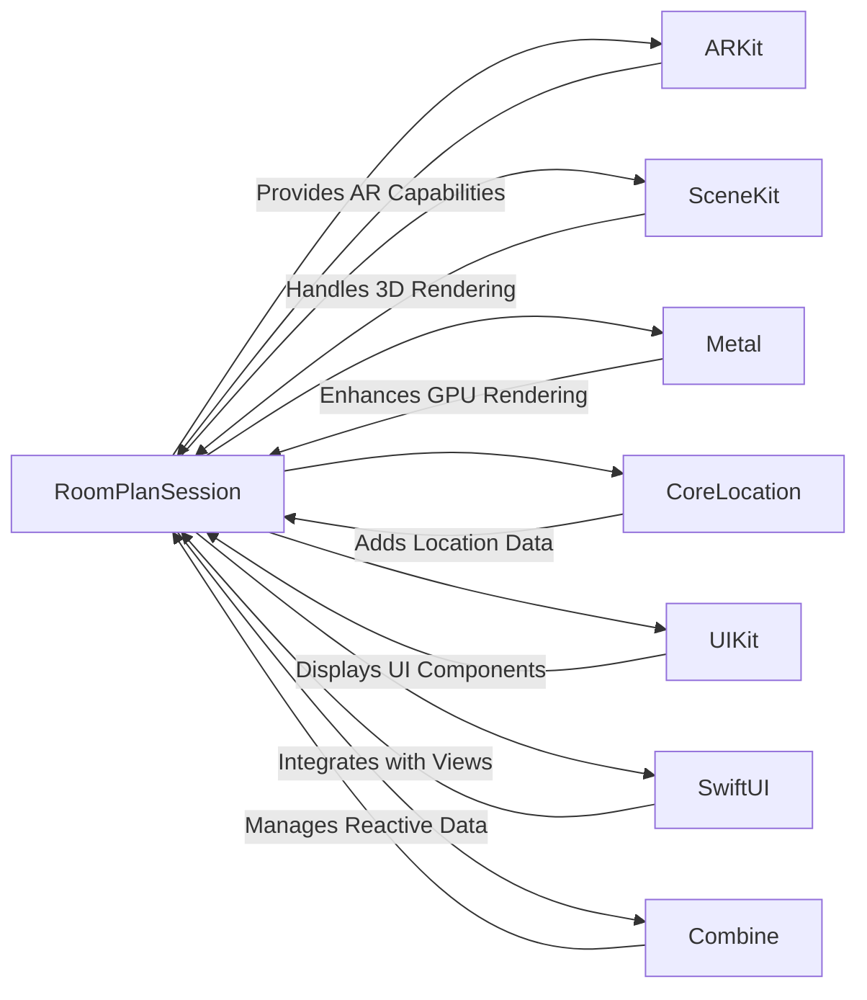
```mermaid
flowchart LR
    RoomPlanSession --> ARKit
    RoomPlanSession --> SceneKit
    RoomPlanSession --> Metal
    RoomPlanSession --> CoreLocation
    RoomPlanSession --> UIKit
    RoomPlanSession --> SwiftUI
    RoomPlanSession --> Combine

    ARKit --> |Provides AR Capabilities| RoomPlanSession
    SceneKit --> |Handles 3D Rendering| RoomPlanSession
    Metal --> |Enhances GPU Rendering| RoomPlanSession
    CoreLocation --> |Adds Location Data| RoomPlanSession
    UIKit --> |Displays UI Components| RoomPlanSession
    SwiftUI --> |Integrates with Views| RoomPlanSession
    Combine --> |Manages Reactive Data| RoomPlanSession
```

---

## **17. Error Handling and Recovery**

### **a. Error Handling Flowchart**
- **Purpose**: Illustrate how `RoomPlan` handles different error scenarios and recovery strategies.
- **Diagram Type**: `flowchart TD`
- **Contents**:
  - **Error Types**: `cameraUnavailable`, `lidarUnavailable`, `permissionDenied`, `unknown`
  - **Delegation**: `RoomPlanSessionDelegate` methods for error reporting
  - **Recovery Strategies**: `Request Permissions`, `Retry Scanning`, `Provide User Feedback`
  
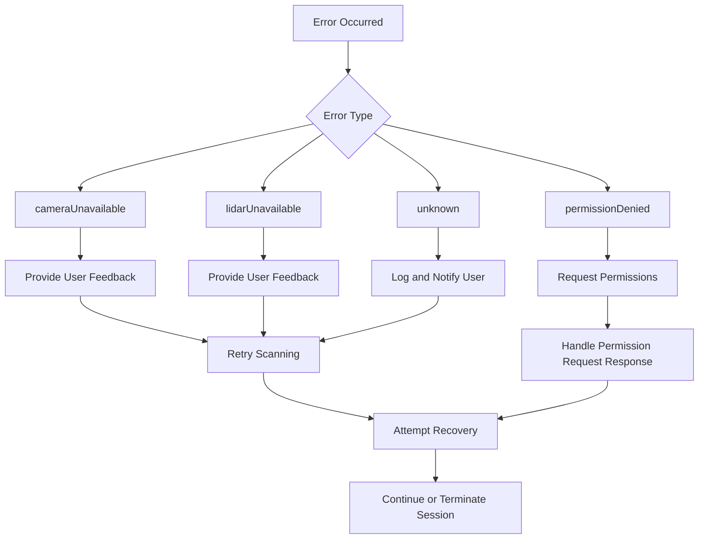
```mermaid
flowchart TD
    A[Error Occurred] --> B{Error Type}
    B --> C[cameraUnavailable]
    B --> D[lidarUnavailable]
    B --> E[permissionDenied]
    B --> F[unknown]

    C --> G[Provide User Feedback]
    D --> H[Provide User Feedback]
    E --> I[Request Permissions]
    F --> J[Log and Notify User]

    G --> K[Retry Scanning]
    H --> K[Retry Scanning]
    I --> L[Handle Permission Request Response]
    J --> K[Retry Scanning]

    K --> M[Attempt Recovery]
    L --> M[Attempt Recovery]
    M --> N[Continue or Terminate Session]
```

---

## **18. Security Considerations**

### **a. Security Best Practices Diagram**
- **Purpose**: Outline the security measures and best practices when using the `RoomPlan` framework.
- **Diagram Type**: `flowchart LR`
- **Contents**:
  - **Data Encryption**
  - **Privacy Compliance**
  - **Secure Data Storage**
  - **Access Control**
  - **User Consent**
  - **Regular Updates**

```mermaid
flowchart LR
    A[Security Best Practices] --> B[Data Encryption]
    A --> C[Privacy Compliance]
    A --> D[Secure Data Storage]
    A --> E[Access Control]
    A --> F[User Consent]
    A --> G[Regular Updates]

    B --> B1["Encrypt Exported Data"]
    C --> C1["Comply with GDPR & CCPA"]
    D --> D1["Use Secure Storage Solutions"]
    E --> E1["Restrict Access to Sensitive Data"]
    F --> F1["Obtain User Permissions"]
    G --> G1["Update Framework Regularly"]
```

---

## **19. Testing and Validation**

### **a. Testing Strategies Diagram**
- **Purpose**: Describe the recommended testing strategies for applications utilizing the `RoomPlan` framework.
- **Diagram Type**: `flowchart TD`
- **Contents**:
  - **Unit Testing**
  - **Integration Testing**
  - **UI Testing**
  - **Performance Testing**
  - **Automated Testing with Xcode**
  - **User Testing**

```mermaid
flowchart TD
    A[Testing Strategies] --> B[Unit Testing]
    A --> C[Integration Testing]
    A --> D[UI Testing]
    A --> E[Performance Testing]
    A --> F[Automated Testing with Xcode]
    A --> G[User Testing]

    B --> B1[Test Individual Components]
    C --> C1[Test Interactions Between Classes]
    D --> D1[Test UI Components and Visualizations]
    E --> E1[Test Scanning Performance]
    F --> F1[Implement CI/CD Pipelines]
    G --> G1[Gather User Feedback]
```

---

## **20. Documentation and Resources**

### **a. Documentation Overview Diagram**
- **Purpose**: Provide an overview of the available documentation and resources for the `RoomPlan` framework.
- **Diagram Type**: `flowchart LR`
- **Contents**:
  - **Official Apple Documentation**
  - **WWDC Sessions**
  - **Sample Code**
  - **Developer Forums**
  - **Third-Party Tutorials**
  - **API References**

```mermaid
flowchart LR
    A[RoomPlan Documentation] --> B[Official Apple Documentation]
    A --> C[WWDC Sessions]
    A --> D[Sample Code]
    A --> E[Developer Forums]
    A --> F[Third-Party Tutorials]
    A --> G[API References]

    B --> B1["Explore Class Structures"]
    C --> C1["Watch Feature Introductions"]
    D --> D1["Implement Sample Projects"]
    E --> E1["Seek Community Support"]
    F --> F1["Learn from Tutorials"]
    G --> G1["Detailed API Descriptions"]
```

---

## **21. Troubleshooting Common Issues**

### **a. Troubleshooting Flowchart**
- **Purpose**: Provide solutions to common issues encountered when using the `RoomPlan` framework.
- **Diagram Type**: `flowchart TD`
- **Contents**:
  - **Issue**: Scanning Not Starting
    - **Solution**: Check Permissions, Ensure LiDAR Availability
  - **Issue**: Inaccurate Room Detection
    - **Solution**: Improve Lighting Conditions, Recalibrate Device
  - **Issue**: Visualization Lagging
    - **Solution**: Optimize Visualization Settings, Update Device Software
  - **Issue**: Export Data Failure
    - **Solution**: Verify Export Formats, Check Data Integrity

```mermaid
flowchart TD
    A[Common Issues] --> B[Scanning Not Starting]
    A --> C[Inaccurate Room Detection]
    A --> D[Visualization Lagging]
    A --> E[Export Data Failure]

    B --> B1[Check Camera and LiDAR Permissions]
    B --> B2[Ensure Device Supports LiDAR]

    C --> C1[Improve Lighting Conditions]
    C --> C2[Recalibrate Device Sensors]

    D --> D1[Optimize Visualization Settings]
    D --> D2[Update Device Software]

    E --> E1[Verify Supported Export Formats]
    E --> E2[Check Data Integrity and Permissions]
```

---

## **22. Integration with External Tools**

### **a. External Tools Integration Diagram**
- **Purpose**: Show how `RoomPlan` can integrate with external tools and services for enhanced functionality.
- **Diagram Type**: `flowchart LR`
- **Contents**:
  - **Cloud Services**: `iCloud`, `Firebase`
  - **3D Modeling Tools**: `Blender`, `Maya`
  - **Collaboration Platforms**: `Slack`, `Trello`
  - **Analytics Tools**: `Firebase Analytics`, `Google Analytics`
  
```mermaid
flowchart LR
    RoomPlanSession --> A[Cloud Services]
    RoomPlanSession --> B[3D Modeling Tools]
    RoomPlanSession --> C[Collaboration Platforms]
    RoomPlanSession --> D[Analytics Tools]

    A --> A1[iCloud]
    A --> A2[Firebase]

    B --> B1[Blender]
    B --> B2[Maya]

    C --> C1[Slack]
    C --> C2[Trello]

    D --> D1[Firebase Analytics]
    D --> D2[Google Analytics]
```

---

## **23. Localization and Internationalization**

### **a. Localization Strategies Diagram**
- **Purpose**: Outline strategies for localizing and internationalizing applications using the `RoomPlan` framework.
- **Diagram Type**: `flowchart TD`
- **Contents**:
  - **String Localization**
  - **Region-Based Settings**
  - **Data Formatting**
  - **Locale-Aware Visualizations**
  
```mermaid
flowchart TD
    A[Localization Strategies] --> B[String Localization]
    A --> C[Region-Based Settings]
    A --> D[Data Formatting]
    A --> E[Locale-Aware Visualizations]

    B --> B1["Use NSLocalizedString"]
    C --> C1["Adjust Units Based on Region"]
    D --> D1["Format Dates and Numbers Appropriately"]
    E --> E1["Adapt Visual Elements to Cultural Preferences"]
```

---

## **24. Accessibility Features**

### **a. Accessibility Diagram**
- **Purpose**: Highlight the accessibility features and best practices when implementing `RoomPlan`-based applications.
- **Diagram Type**: `flowchart LR`
- **Contents**:
  - **VoiceOver Support**
  - **Dynamic Type**
  - **Color Contrast**
  - **Haptic Feedback**
  - **Accessible Controls**
  
```mermaid
flowchart LR
    A[Accessibility Features] --> B[VoiceOver Support]
    A --> C[Dynamic Type]
    A --> D[Color Contrast]
    A --> E[Haptic Feedback]
    A --> F[Accessible Controls]

    B --> B1["Provide Descriptive Labels"]
    C --> C1["Support Adjustable Font Sizes"]
    D --> D1["Ensure Sufficient Color Contrast"]
    E --> E1["Use Haptics for Feedback"]
    F --> F1["Implement Accessible Buttons and Sliders"]
```

---

## **25. Performance Optimization Techniques**

### **a. Performance Optimization Diagram**
- **Purpose**: Outline techniques to optimize the performance of applications using the `RoomPlan` framework.
- **Diagram Type**: `flowchart TD`
- **Contents**:
  - **Efficient Data Handling**
  - **GPU Acceleration with Metal**
  - **Asynchronous Processing**
  - **Memory Management**
  - **Profiling and Monitoring**

```mermaid
flowchart TD
    A[Performance Optimization] --> B[Efficient Data Handling]
    A --> C[GPU Acceleration with Metal]
    A --> D[Asynchronous Processing]
    A --> E[Memory Management]
    A --> F[Profiling and Monitoring]

    B --> B1["Optimize Data Structures"]
    C --> C1["Leverage Metal for Heavy Rendering Tasks"]
    D --> D1["Perform Data Processing Off the Main Thread"]
    E --> E1["Manage Memory Usage Effectively"]
    F --> F1["Use Instruments for Profiling"]
```

---

## **26. Versioning and Compatibility**

### **a. Versioning Strategy Diagram**
- **Purpose**: Describe strategies for managing versioning and ensuring compatibility when using the `RoomPlan` framework.
- **Diagram Type**: `flowchart LR`
- **Contents**:
  - **Semantic Versioning**
  - **Deprecation Policies**
  - **Backward Compatibility**
  - **Forward Compatibility**
  - **Testing Across Versions**

```mermaid
flowchart LR
    A[Versioning Strategy] --> B[Semantic Versioning]
    A --> C[Deprecation Policies]
    A --> D[Backward Compatibility]
    A --> E[Forward Compatibility]
    A --> F[Testing Across Versions]

    B --> B1["Use MAJOR.MINOR.PATCH Format"]
    C --> C1["Deprecate Features Gracefully"]
    D --> D1["Maintain Support for Older iOS Versions"]
    E --> E1["Ensure Forward Compatibility with Future Releases"]
    F --> F1["Test on Multiple iOS Versions"]
```

---

## **27. Deployment and Distribution**

### **a. Deployment Workflow Diagram**
- **Purpose**: Outline the workflow for deploying and distributing applications that utilize the `RoomPlan` framework.
- **Diagram Type**: `flowchart LR`
- **Contents**:
  - **Development**
  - **Testing**
  - **App Store Submission**
  - **Continuous Integration/Continuous Deployment (CI/CD)**
  - **Monitoring Post-Deployment**

```mermaid
flowchart LR
    A[Deployment Workflow] --> B[Development]
    A --> C[Testing]
    A --> D[App Store Submission]
    A --> E[CI/CD]
    A --> F[Monitoring Post-Deployment]

    B --> B1["Implement Features with RoomPlan"]
    C --> C1["Conduct Unit and UI Tests"]
    D --> D1["Prepare App Store Metadata"]
    D --> D2["Submit for Review"]
    E --> E1["Automate Build and Deployment"]
    F --> F1["Monitor Performance and Crashes"]
```

---

## **28. Conclusion**

### **a. Final Summary Diagram**
- **Purpose**: Reiterate the key aspects and capabilities of the `RoomPlan` framework.
- **Diagram Type**: `graph LR`
- **Contents**:
  - **Comprehensive Scanning**
  - **Advanced Visualizations**
  - **Seamless Integration**
  - **Robust Data Handling**
  - **Extensibility**
  - **Best Practices Adherence**

```mermaid
graph LR
    A[RoomPlan Framework] --> B[Comprehensive Scanning]
    A --> C[Advanced Visualizations]
    A --> D[Seamless Integration]
    A --> E[Robust Data Handling]
    A --> F[Extensibility]
    A --> G[Best Practices Adherence]

    B --> B1[High-Accuracy Room Detection]
    C --> C1[Multiple Visualization Modes]
    D --> D1[Integration with ARKit & UIKit]
    E --> E1[Support for Various Data Formats]
    F --> F1[Extend with Custom Extensions]
    G --> G1[Follow Security and Performance Best Practices]
```

---

## **29. Additional Resources**

### **a. Resource Links Diagram**
- **Purpose**: Provide links to additional resources for learning and maximizing the use of the `RoomPlan` framework.
- **Diagram Type**: `flowchart LR`
- **Contents**:
  - **Official Documentation**
  - **WWDC Videos**
  - **Sample Projects**
  - **Developer Forums**
  - **Third-Party Tutorials**
  - **API Reference Guides**

```mermaid
flowchart LR
    A[Additional Resources] --> B[Official Documentation]
    A --> C[WWDC Videos]
    A --> D[Sample Projects]
    A --> E[Developer Forums]
    A --> F[Third-Party Tutorials]
    A --> G[API Reference Guides]

    B --> B1["https://developer.apple.com/documentation/roomplan"]
    C --> C1["WWDC Session: RoomPlan Overview"]
    D --> D1["Sample RoomPlan Projects on GitHub"]
    E --> E1["Apple Developer Forums"]
    F --> F1["Tutorials on raywenderlich.com"]
    G --> G1["RoomPlan API Reference"]
```

---

## **30. Q&A and Community Support**

### **a. Community Engagement Diagram**
- **Purpose**: Encourage engagement with the developer community for support and knowledge sharing.
- **Diagram Type**: `flowchart TD`
- **Contents**:
  - **Forums**
  - **Meetups**
  - **Contributions**
  - **Feedback Channels**
  
```mermaid
flowchart TD
    A[Community Engagement] --> B[Forums]
    A --> C[Meetups]
    A --> D[Contributions]
    A --> E[Feedback Channels]

    B --> B1["Join Apple Developer Forums"]
    C --> C1["Attend Local Developer Meetups"]
    D --> D1["Contribute to Open Source Projects"]
    E --> E1["Provide Feedback via Apple Feedback"]
```

---
