# SFSafariViewController

Below is a comprehensive and organized set of Mermaid diagrams for the `Safari` framework. These diagrams aim to illustrate the primary structure, functionalities, and interactions within the Safari framework, facilitating a deeper understanding of its components and their relationships.

---

## **1. Class Structure and Hierarchy**

### **a. Core Class Diagram**
- **Purpose**: Illustrate the primary structure of `SFSafariViewController`, including its properties, methods, and enumerations.
- **Diagram Type**: `classDiagram`
- **Contents**:
  - **Properties**: Key attributes like `delegate`, `dismissButtonStyle`, etc.
  - **Methods**: Essential functions like initializers, `dismiss()`, etc.
  - **Enumerations**: Nested enums such as `DismissButtonStyle`, `PreferredBarTintColor`.

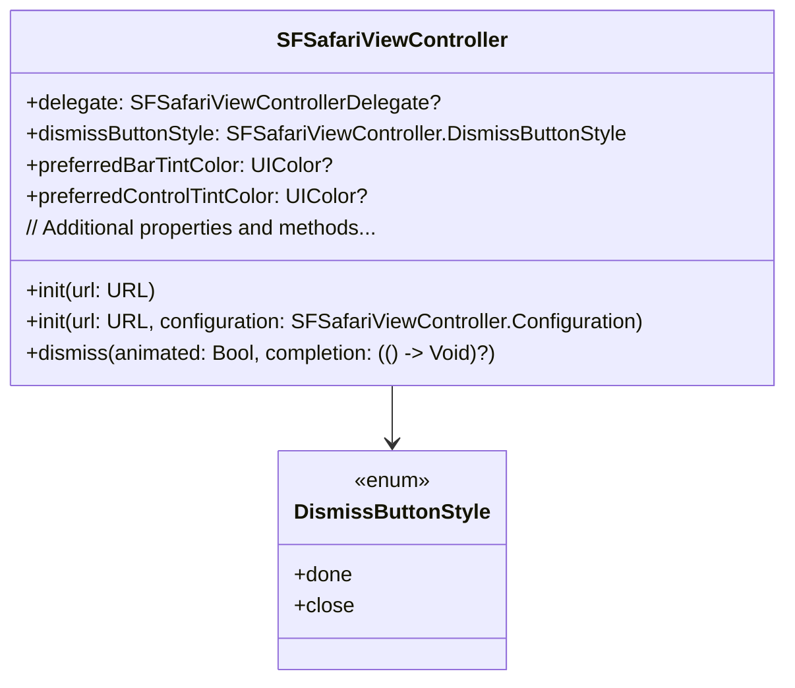

---

## **2. Initializers Overview**

### **a. Initialization Methods Diagram**
- **Purpose**: Break down the various ways to instantiate `SFSafariViewController`.
- **Diagram Type**: `flowchart LR`
- **Contents**:
  - **Basic Initializers**: `init(url:)`
  - **Configuration-Based Initializers**: `init(url:configuration:)`

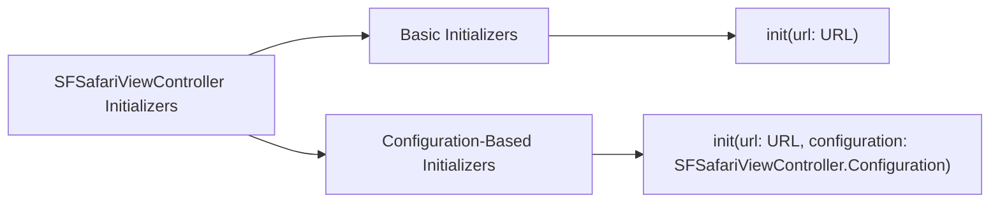

---

## **3. Properties Breakdown**

### **a. Key Properties Diagram**
- **Purpose**: Detail the main properties of `SFSafariViewController`.
- **Diagram Type**: `graph LR`
- **Contents**:
  - **Appearance Attributes**: `preferredBarTintColor`, `preferredControlTintColor`
  - **Behavior Attributes**: `delegate`, `dismissButtonStyle`
  - **Configuration Attributes**: `configuration`

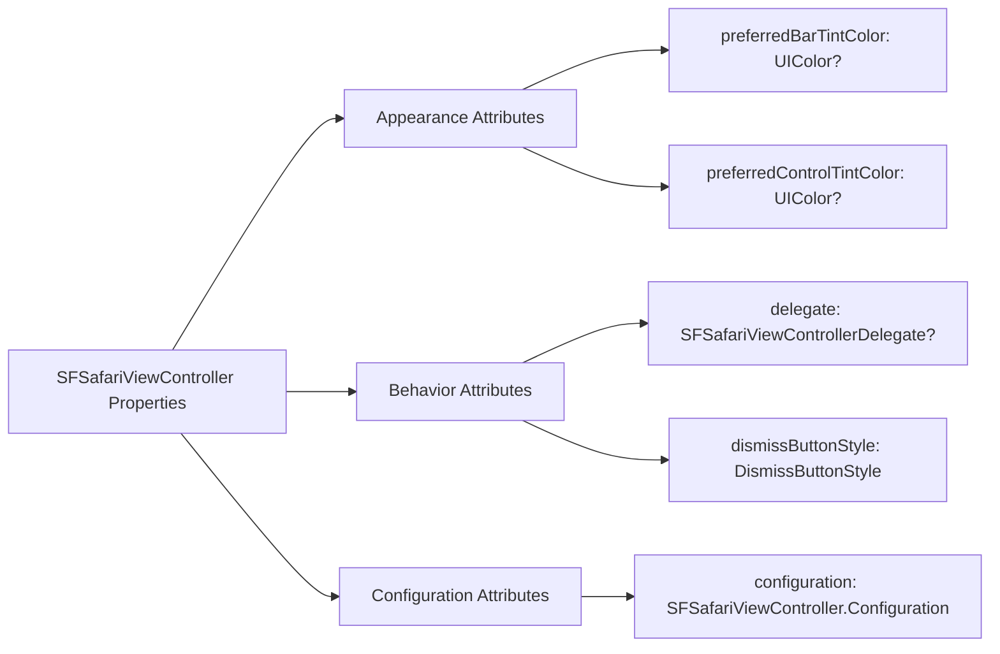

---

## **4. Methods Grouped by Functionality**

### **a. Presentation Methods**
- **Purpose**: Categorize methods based on their roles in presenting and dismissing the Safari view controller.
- **Diagram Type**: `flowchart TD`
- **Contents**:
  - **Presentation Methods**: `present(_:animated:completion:)`
  - **Dismissal Methods**: `dismiss(animated:completion:)`

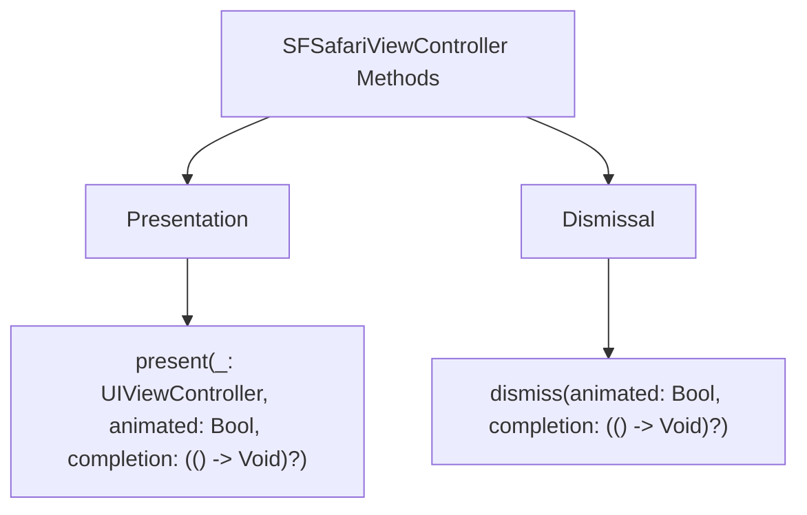

---

## **5. Enumerations and Configurations**

### **a. Enumerations Diagram**
- **Purpose**: Highlight the enums used within `SFSafariViewController` and their possible values.
- **Diagram Type**: `classDiagram`
- **Contents**:
  - **DismissButtonStyle**
  - **PreferredBarTintColor**
  - **PreferredControlTintColor**

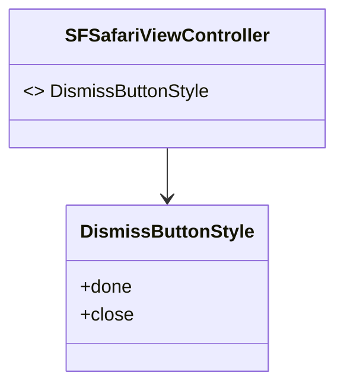

### **b. Configuration Classes Diagram**
- **Purpose**: Show the relationship between `SFSafariViewController` and its configuration classes.
- **Diagram Type**: `classDiagram`
- **Contents**:
  - **Configuration**

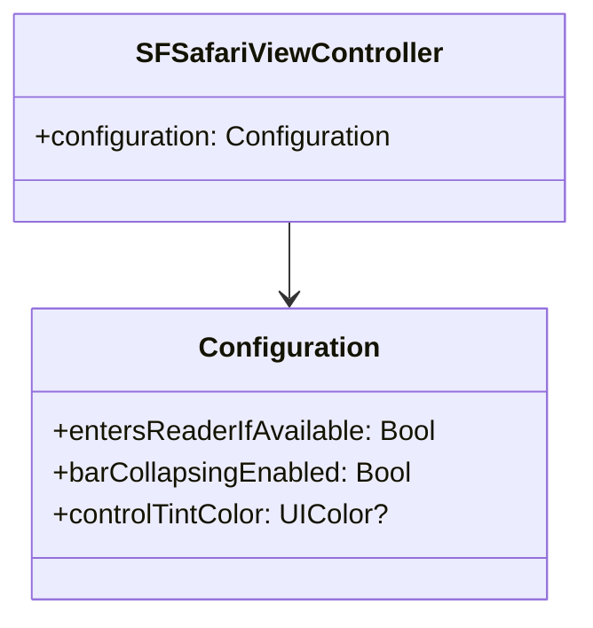

---

## **6. Protocol Conformances**

### **a. Protocols Diagram**
- **Purpose**: Display the protocols that `SFSafariViewController` conforms to and their impact.
- **Diagram Type**: `classDiagram`
- **Contents**:
  - **SFSafariViewControllerDelegate**
  - **UIViewController**

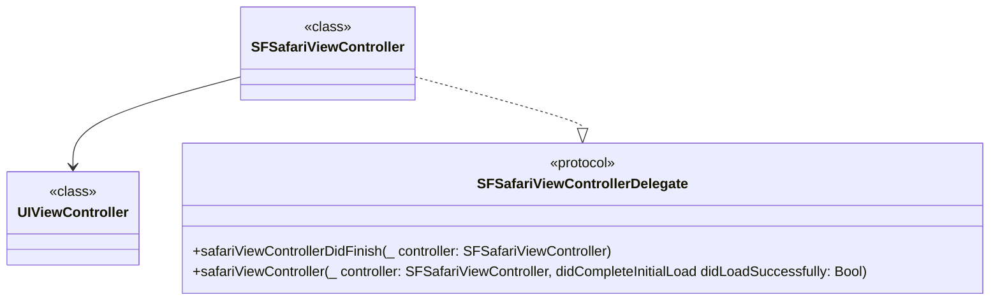

---

## **7. Relationships with Other Classes**

### **a. Related Classes Diagram**
- **Purpose**: Illustrate how `SFSafariViewController` interacts with other UIKit classes and frameworks.
- **Diagram Type**: `flowchart TD`
- **Contents**:
  - **UIViewController**: Parent class.
  - **URL**: Represents the web address to be loaded.
  - **UIColor**: Customizes appearance.
  - **SFSafariViewControllerDelegate**: Handles delegate callbacks.
  - **WKWebView**: Underlying web view component.

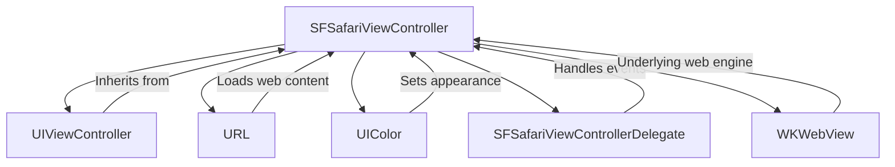

---

## **8. Extensions and Additional Functionalities**

### **a. SFSafariViewController Extensions Diagram**
- **Purpose**: Showcase the additional functionalities provided through extensions.
- **Diagram Type**: `classDiagram`
- **Contents**:
  - **Configuration Enhancements**
  - **Delegate Methods Extensions**

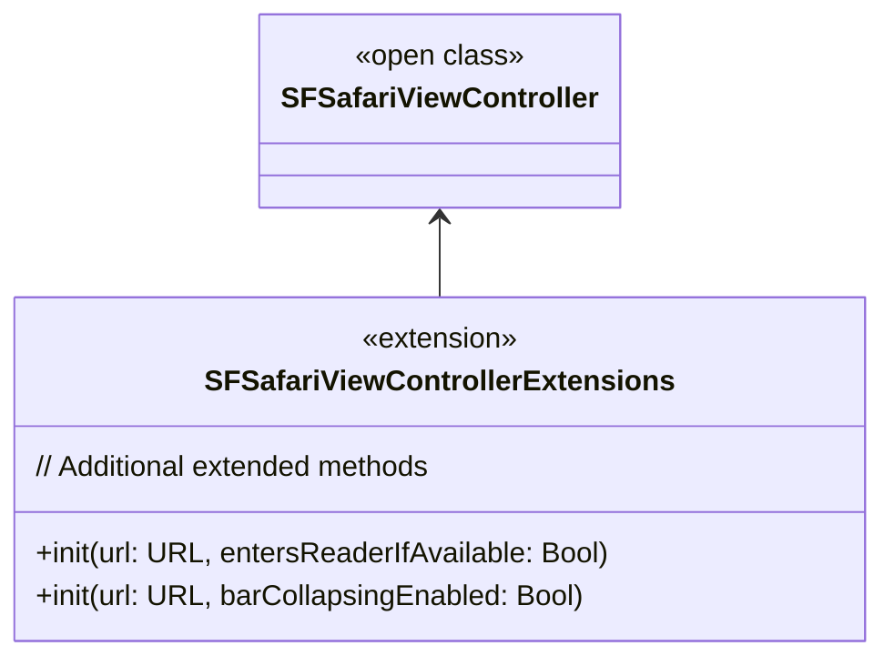

### **b. Extensions Functionalities Flowchart**
- **Purpose**: Detail specific extended methods and their purposes.
- **Diagram Type**: `flowchart LR`
- **Contents**:
  - **Configuration Initialization**
  - **Appearance Customizations**

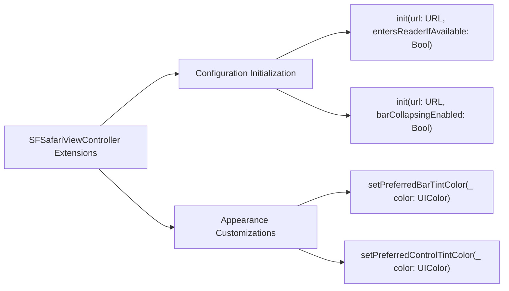

---

## **9. Lifecycle and Use Cases**

### **a. Lifecycle Flowchart**
- **Purpose**: Demonstrate the typical lifecycle of a `SFSafariViewController` within an application.
- **Diagram Type**: `flowchart TD`
- **Contents**:
  - **Initialization**
  - **Presentation**
  - **User Interaction**
  - **Dismissal**
  - **Cleanup**

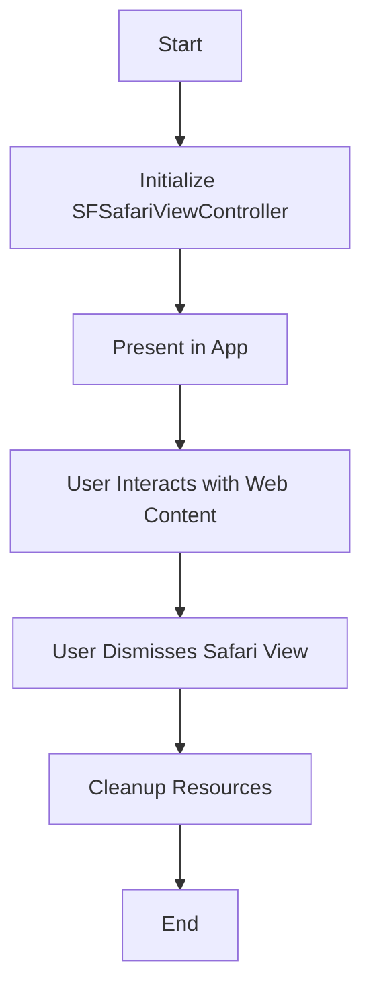

### **b. Common Use Cases Diagram**
- **Purpose**: Outline the typical scenarios where `SFSafariViewController` is utilized.
- **Diagram Type**: `flowchart TD`
- **Contents**:
  - **Opening Web Links**
  - **Authenticating Users**
  - **Displaying Web Content Securely**
  - **Handling OAuth Flows**
  - **Providing In-App Browsing Experience**

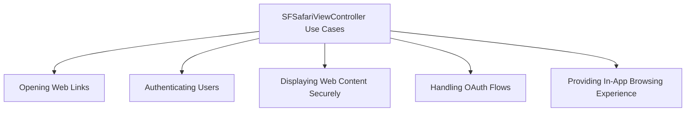

---

## **10. Feature Availability Timeline**

### **a. Feature Availability Gantt Chart**
- **Purpose**: Show when various `SFSafariViewController` features were introduced across iOS versions.
- **Diagram Type**: `gantt`
- **Contents**:
  - **iOS Versions**: 9.0, 10.0, 11.0, 12.0, 13.0, 14.0, 15.0, 16.0, 17.0
  - **Features Introduced**: Basic initialization, Customization options, Reader Mode, Content Blocking, Dark Mode support, Enhanced Configuration, Enhanced Delegate Methods.

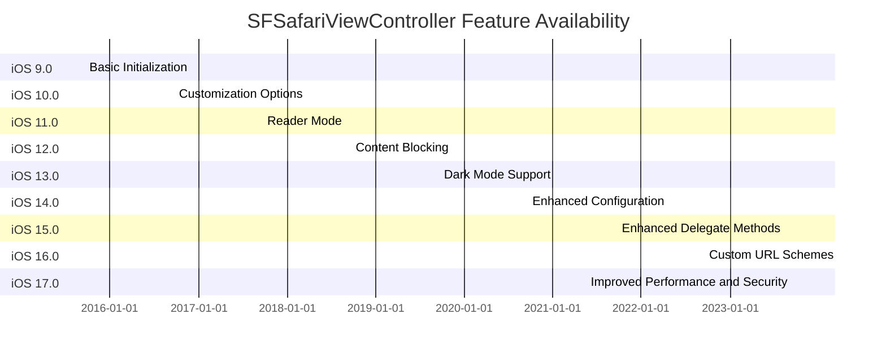

---

## **11. Data Handling and Formats**

### **a. URL Handling Diagram**
- **Purpose**: Explain how `SFSafariViewController` handles different URL schemes and data formats.
- **Diagram Type**: `graph LR`
- **Contents**:
  - **HTTP/HTTPS**: Standard web URLs.
  - **App Links**: Deep links to other apps.
  - **OAuth Redirects**: Handling authentication URLs.

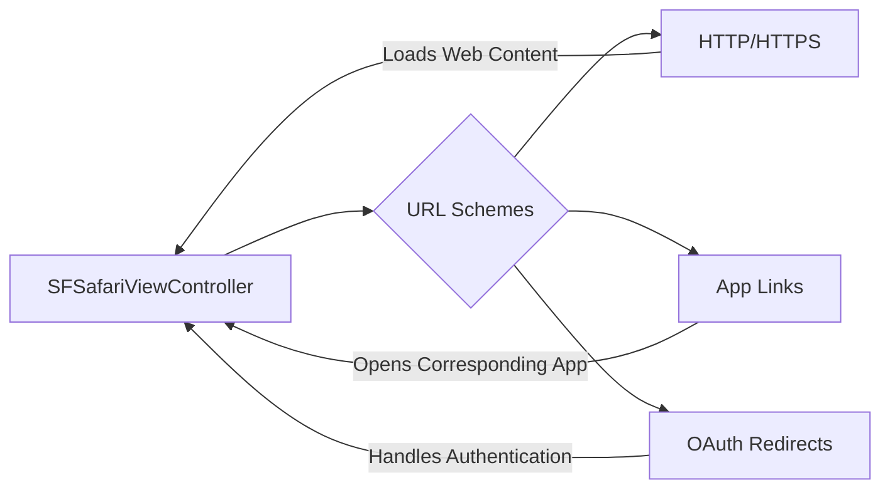

---

## **12. Integration with Other Frameworks**

### **a. WebKit Integration Diagram**
- **Purpose**: Show how `SFSafariViewController` interacts with the WebKit framework for rendering web content.
- **Diagram Type**: `flowchart TD`
- **Contents**:
  - **WebKit**: Underlying framework for web content rendering.
  - **WKWebView**: Web view component utilized by `SFSafariViewController`.

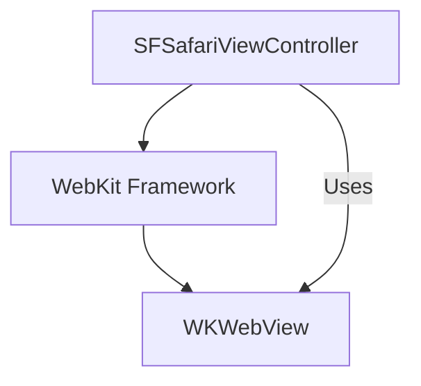

---

## **13. Summary and Best Practices**

### **a. Summary Diagram**
- **Purpose**: Provide a high-level overview of `SFSafariViewController`'s key characteristics and functionalities.
- **Diagram Type**: `graph LR`
- **Contents**:
  - **Secure Web Content Display**
  - **User-Friendly Interface**
  - **Customization Options**
  - **Seamless Integration**
  - **Enhanced Security Features**

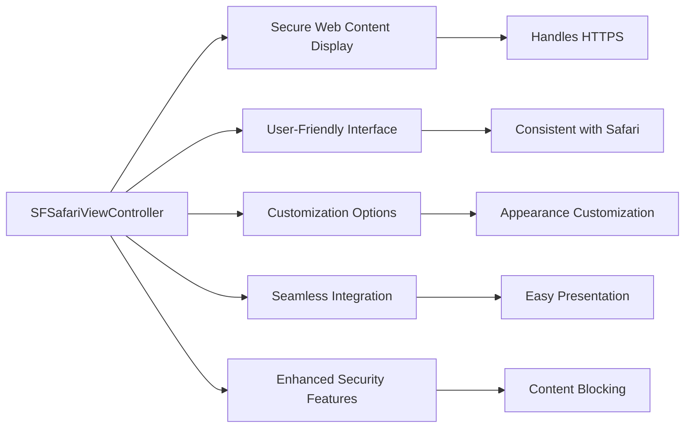

---

## **14. Error Handling and Delegation**

### **a. Delegate Methods Diagram**
- **Purpose**: Illustrate how `SFSafariViewController` delegates handle various events and errors.
- **Diagram Type**: `flowchart LR`
- **Contents**:
  - **Did Finish Loading**
  - **Did Complete Initial Load**
  - **Did Encounter Error**

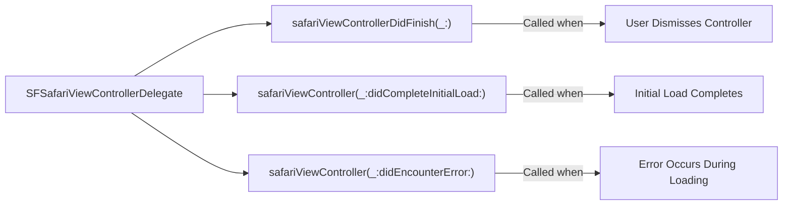

---

## **15. Security and Privacy Considerations**

### **a. Security Features Diagram**
- **Purpose**: Highlight the security and privacy features provided by `SFSafariViewController`.
- **Diagram Type**: `graph LR`
- **Contents**:
  - **Isolation from App**
  - **Automatic Handling of Cookies and Data**
  - **Secure Authentication**
  - **Content Blocking**

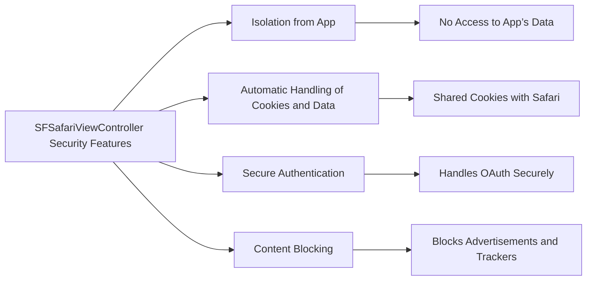

---

## **16. Accessibility Support**

### **a. Accessibility Features Diagram**
- **Purpose**: Showcase the accessibility support provided by `SFSafariViewController`.
- **Diagram Type**: `graph LR`
- **Contents**:
  - **VoiceOver Support**
  - **Dynamic Type**
  - **Color Contrast**
  - **AssistiveTouch Compatibility**

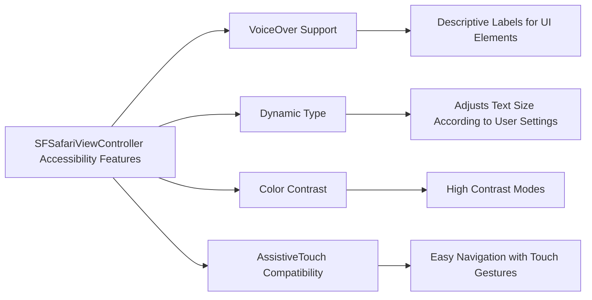

---

## **17. Localization and Internationalization**

### **a. Localization Support Diagram**
- **Purpose**: Explain how `SFSafariViewController` supports multiple languages and regional settings.
- **Diagram Type**: `flowchart TD`
- **Contents**:
  - **Automatic Language Detection**
  - **Right-to-Left Language Support**
  - **Date and Time Formats**
  - **Internationalized URLs**

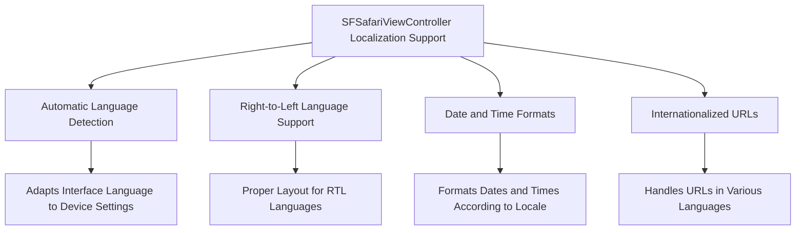

---

## **18. Performance Optimization**

### **a. Performance Enhancements Diagram**
- **Purpose**: Detail the performance optimization strategies employed by `SFSafariViewController`.
- **Diagram Type**: `flowchart LR`
- **Contents**:
  - **Efficient Resource Loading**
  - **Caching Mechanisms**
  - **Asynchronous Loading**
  - **Memory Management**

```mermaid
flowchart LR
    A[SFSafariViewController Performance Optimizations] --> B[Efficient Resource Loading]
    A --> C[Caching Mechanisms]
    A --> D[Asynchronous Loading]
    A --> E[Memory Management]

    B --> B1[Prioritizes Critical Resources]
    C --> C1[Caches Frequently Accessed Data]
    D --> D1[Non-Blocking Content Loading]
    E --> E1[Optimizes Memory Usage to Prevent Leaks]
```

---

## **19. Testing and Debugging**

### **a. Testing Strategies Diagram**
- **Purpose**: Outline the testing and debugging approaches for `SFSafariViewController`.
- **Diagram Type**: `flowchart TD`
- **Contents**:
  - **Unit Testing**
  - **UI Testing**
  - **Performance Profiling**
  - **Crash Reporting**

```mermaid
flowchart TD
    A[SFSafariViewController Testing Strategies] --> B[Unit Testing]
    A --> C[UI Testing]
    A --> D[Performance Profiling]
    A --> E[Crash Reporting]

    B --> B1[Test Initialization Methods]
    B --> B2[Test Delegate Callbacks]

    C --> C1[Test User Interactions]
    C --> C2[Test Presentation and Dismissal]

    D --> D1[Profile Loading Times]
    D --> D2[Monitor Memory Usage]

    E --> E1[Integrate with Crashlytics]
    E --> E2[Analyze Crash Reports]
```

---

## **20. Best Practices**

### **a. Best Practices Diagram**
- **Purpose**: Provide guidelines for effectively utilizing `SFSafariViewController`.
- **Diagram Type**: `graph LR`
- **Contents**:
  - **Use for External Links**
  - **Customize Appearance Thoughtfully**
  - **Handle Delegate Callbacks Appropriately**
  - **Ensure Security and Privacy**
  - **Optimize Performance**

```mermaid
graph LR
    A[SFSafariViewController Best Practices] --> B[Use for External Links]
    A --> C[Customize Appearance Thoughtfully]
    A --> D[Handle Delegate Callbacks Appropriately]
    A --> E[Ensure Security and Privacy]
    A --> F[Optimize Performance]

    B --> B1[Avoid In-App Browser for Internal Content]
    C --> C1[Match App’s Branding]
    D --> D1[Handle Dismissal Properly]
    E --> E1[Respect User Privacy Settings]
    F --> F1[Minimize Loading Times]
```

---
