# SceneKit

Below is a comprehensive and organized set of Mermaid diagrams for the **Scene Kit** framework. These diagrams are structured to capture the key components, relationships, and functionalities of Scene Kit. Each section includes a purpose, diagram type, contents, and the corresponding Mermaid code.

---

## **1. Class Structure and Hierarchy**

### **a. Core Class Diagram**
- **Purpose**: Illustrate the primary structure of `SceneKit`, including its key classes, properties, methods, and enumerations.
- **Diagram Type**: `classDiagram`
- **Contents**:
  - **Properties**: Key attributes like `rootNode`, `scene`, `delegate`, etc.
  - **Methods**: Essential functions like `addChildNode()`, `removeFromParentNode()`, `SCNScene(named:)`, etc.
  - **Enumerations**: Nested enums such as `SCNBlendMode`, `SCNCameraProjectionDirection`, `SCNPhysicsBodyType`, etc.

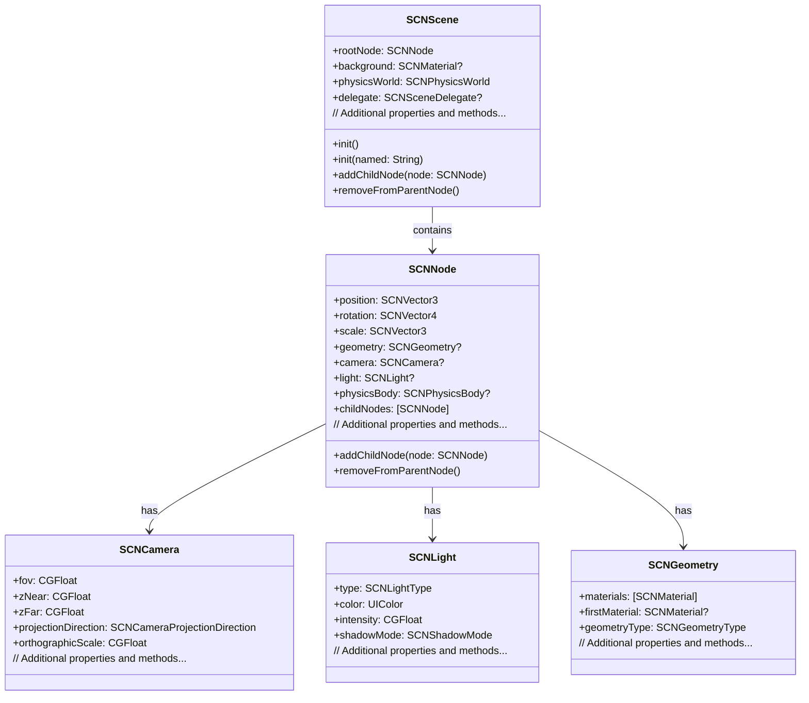

---

## **2. Initializers Overview**

### **a. Initialization Methods Diagram**
- **Purpose**: Break down the various ways to instantiate core `SceneKit` classes.
- **Diagram Type**: `flowchart LR`
- **Contents**:
  - **Scene Initialization**: `init()`, `init(named:)`, `init(url:)`
  - **Node Initialization**: `init()`, `init(geometry:)`, `init(camera:)`
  - **Geometry Initialization**: `SCNSphere(radius:)`, `SCNBox(width:height:length:chamferRadius:)`, etc.
  - **Camera and Light Initialization**: `SCNCamera()`, `SCNLight()`, etc.

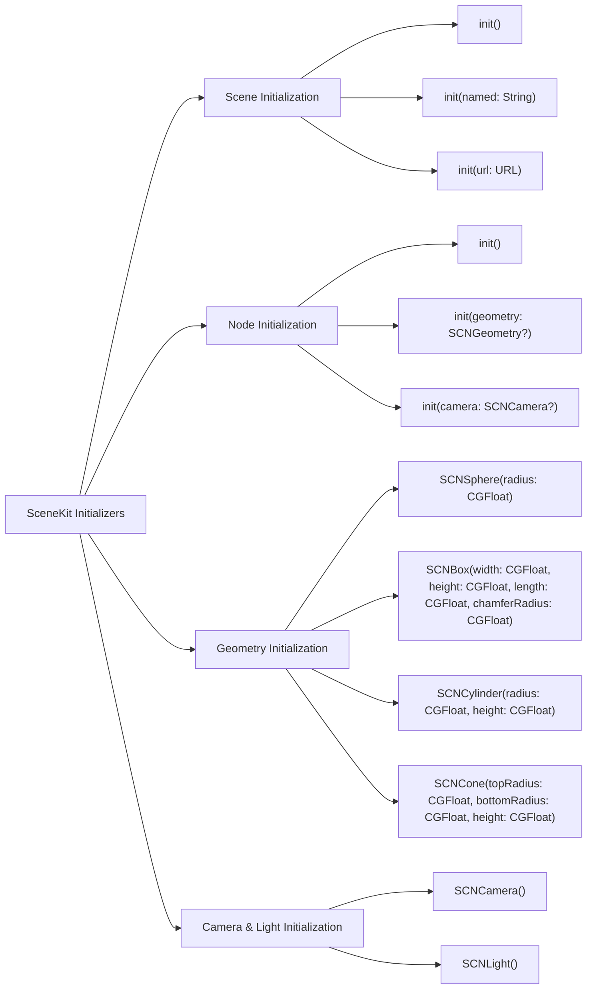

---

## **3. Properties Breakdown**

### **a. Key Properties Diagram**
- **Purpose**: Detail the main properties of essential `SceneKit` classes.
- **Diagram Type**: `graph LR`
- **Contents**:
  - **SCNScene Properties**: `rootNode`, `background`, `physicsWorld`, `delegate`
  - **SCNNode Properties**: `position`, `rotation`, `scale`, `geometry`, `camera`, `light`, `physicsBody`, `childNodes`
  - **SCNCamera Properties**: `fov`, `zNear`, `zFar`, `projectionDirection`, `orthographicScale`
  - **SCNLight Properties**: `type`, `color`, `intensity`, `shadowMode`
  - **SCNGeometry Properties**: `materials`, `firstMaterial`, `geometryType`

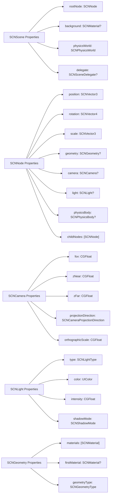

---

## **4. Methods Grouped by Functionality**

### **a. Node Manipulation Methods**
- **Purpose**: Categorize methods based on their roles in node manipulation within a scene.
- **Diagram Type**: `flowchart TD`
- **Contents**:
  - **Adding & Removing Nodes**: `addChildNode()`, `removeFromParentNode()`
  - **Transformations**: `translate()`, `rotate()`, `scale()`, `lookAt()`
  - **Animations**: `runAction()`, `removeAllActions()`
  - **Physics Interactions**: `physicsBody`, `physicsField()`

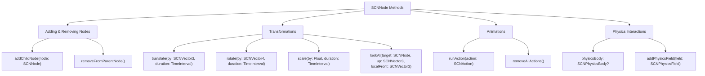

---

## **5. Enumerations and Configurations**

### **a. Enumerations Diagram**
- **Purpose**: Highlight the enums used within `SceneKit` and their possible values.
- **Diagram Type**: `classDiagram`
- **Contents**:
  - **SCNLightType**
  - **SCNCameraProjectionDirection**
  - **SCNShadowMode**
  - **SCNCollisionCategory**
  - **SCNBlendMode**

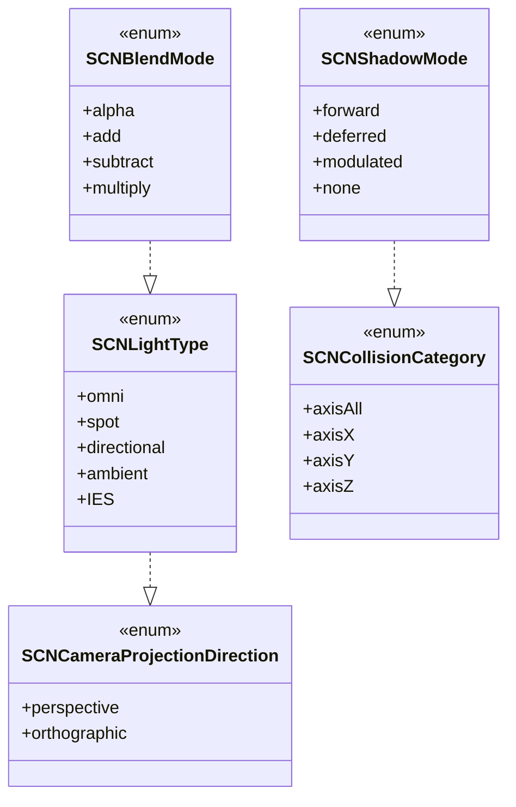

### **b. Configuration Classes Diagram**
- **Purpose**: Show the relationship between `SceneKit` classes and their configuration classes.
- **Diagram Type**: `classDiagram`
- **Contents**:
  - **SCNPhysicsBody**
  - **SCNPhysicsShape**
  - **SCNPhysicsField**
  - **SCNAction**

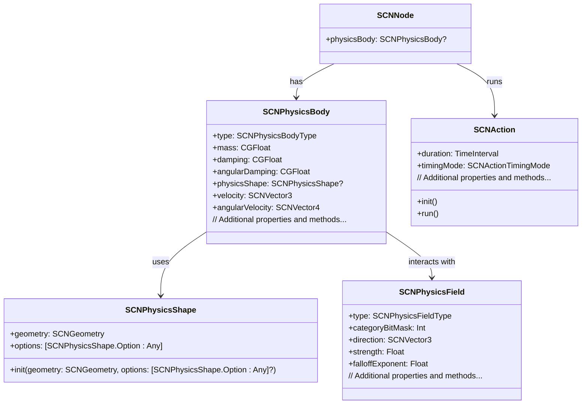

---

## **6. Protocol Conformances**

### **a. Protocols Diagram**
- **Purpose**: Display the protocols that key `SceneKit` classes conform to and their impact.
- **Diagram Type**: `classDiagram`
- **Contents**:
  - **SCNSceneRendererDelegate**
  - **SCNPhysicsContactDelegate**
  - **SCNAnimatable**
  - **SCNActionable**
  - **ScnShaderModifierProviding**

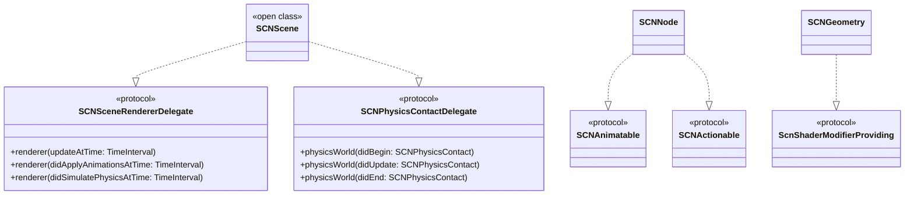

---

## **7. Relationships with Other Classes**

### **a. Related Classes Diagram**
- **Purpose**: Illustrate how `SceneKit` classes interact with other UIKit and Core Framework classes.
- **Diagram Type**: `flowchart TD`
- **Contents**:
  - **UIKit Integration**: Interaction with `UIView`, `UIViewController`
  - **Core Animation**: Integration with `CAAnimation`, `CABasicAnimation`
  - **Metal**: Interoperability with `MTLDevice`, `MTLCommandQueue`
  - **Core Motion**: Utilization of `CMMotionManager`
  - **ARKit**: Integration for augmented reality features
  - **Physics Engine**: Interaction with `Bullet Physics` (if applicable)

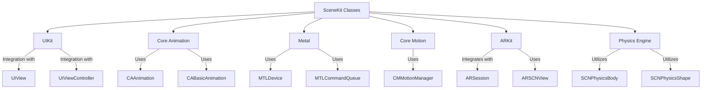

---

## **8. Extensions and Additional Functionalities**

### **a. SceneKit Extensions Diagram**
- **Purpose**: Showcase the additional functionalities provided through extensions in `SceneKit`.
- **Diagram Type**: `classDiagram`
- **Contents**:
  - **SCNNode Extensions**
  - **SCNGeometry Extensions**
  - **SCNAction Extensions**

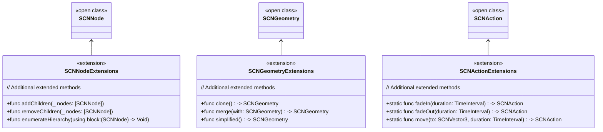

### **b. Extensions Functionalities Flowchart**
- **Purpose**: Detail specific extended methods and their purposes within `SceneKit`.
- **Diagram Type**: `flowchart LR`
- **Contents**:
  - **Node Management**
  - **Geometry Manipulations**
  - **Custom Actions**

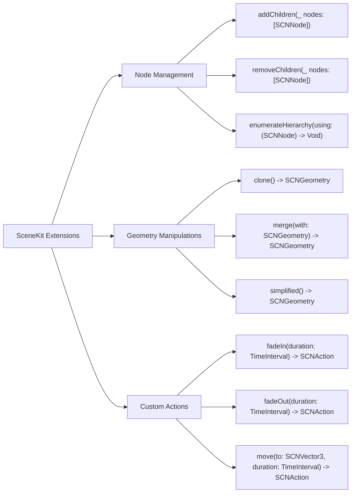

---

## **9. Lifecycle and Use Cases**

### **a. Lifecycle Flowchart**
- **Purpose**: Demonstrate the typical lifecycle of a `SceneKit` scene within an application.
- **Diagram Type**: `flowchart TD`
- **Contents**:
  - **Initialization**
  - **Loading Assets**
  - **Scene Setup**
  - **Rendering Loop**
  - **User Interactions**
  - **Cleanup**

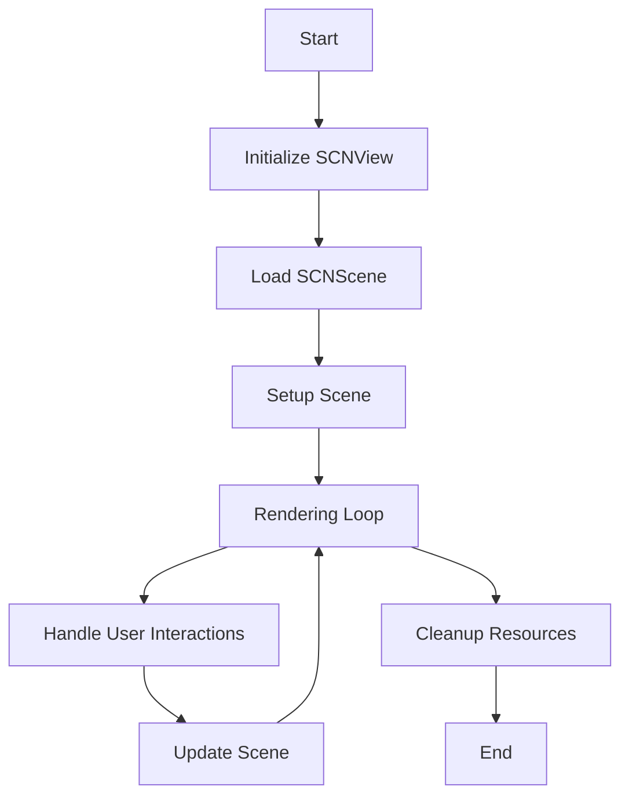

### **b. Common Use Cases Diagram**
- **Purpose**: Outline the typical scenarios where `SceneKit` is utilized.
- **Diagram Type**: `flowchart TD`
- **Contents**:
  - **3D Game Development**
  - **Augmented Reality (AR) Experiences**
  - **Visualization and Simulations**
  - **Interactive Storytelling**
  - **Educational Applications**
  - **Architectural Visualization**

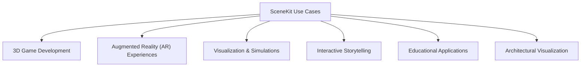

---

## **10. Feature Availability Timeline**

### **a. Feature Availability Gantt Chart**
- **Purpose**: Show when various `SceneKit` features were introduced across iOS versions.
- **Diagram Type**: `gantt`
- **Contents**:
  - **iOS Versions**: 8.0, 9.0, 10.0, 11.0, 12.0, 13.0, 14.0, 15.0, 16.0, 17.0
  - **Features Introduced**: Initial SceneKit release, ARKit integration, new geometries, physics enhancements, Metal integration, RealityKit interoperability, SwiftUI support, SceneKit animation improvements, enhanced performance optimizations, latest rendering features.

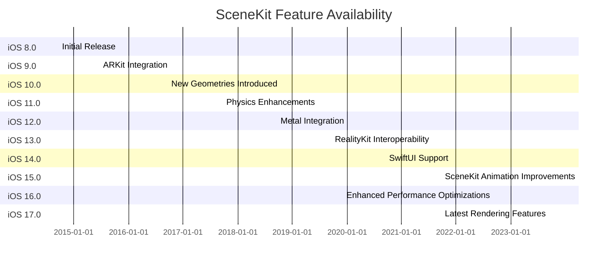

---

## **11. Data Handling and Formats**

### **a. Geometry Data Handling Diagram**
- **Purpose**: Explain how `SceneKit` handles different geometry data formats.
- **Diagram Type**: `graph LR`
- **Contents**:
  - **Standard Geometries**: `SCNSphere`, `SCNBox`, `SCNTorus`, etc.
  - **Custom Geometries**: `SCNGeometrySource`, `SCNGeometryElement`
  - **External Model Loading**: `SCNSceneSource`, `SCNModelIO`
  - **Serialization**: `SCNScene` export and import methods

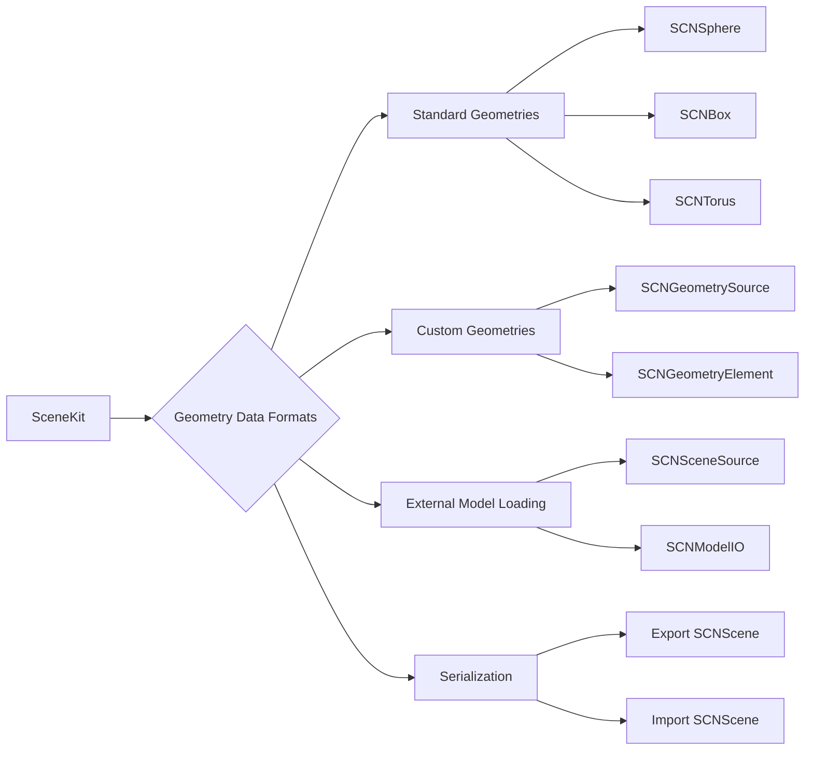

---

## **12. Integration with Drawing Contexts**

### **a. Rendering Pipeline Diagram**
- **Purpose**: Show how `SceneKit` integrates with drawing contexts and rendering pipelines.
- **Diagram Type**: `flowchart TD`
- **Contents**:
  - **SCNView Lifecycle**
  - **Render Loop**
  - **Metal Integration**
  - **Shader Modifiers**
  - **Post-Processing Effects**

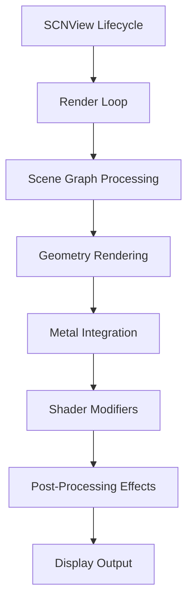

---

## **13. Summary and Best Practices**

### **a. Summary Diagram**
- **Purpose**: Provide a high-level overview of `SceneKit`'s key characteristics and functionalities.
- **Diagram Type**: `graph LR`
- **Contents**:
  - **Robust 3D Rendering**
  - **Physics Simulation**
  - **Animation Capabilities**
  - **AR and VR Support**
  - **Integration with Other Frameworks**
  - **Performance Optimizations**

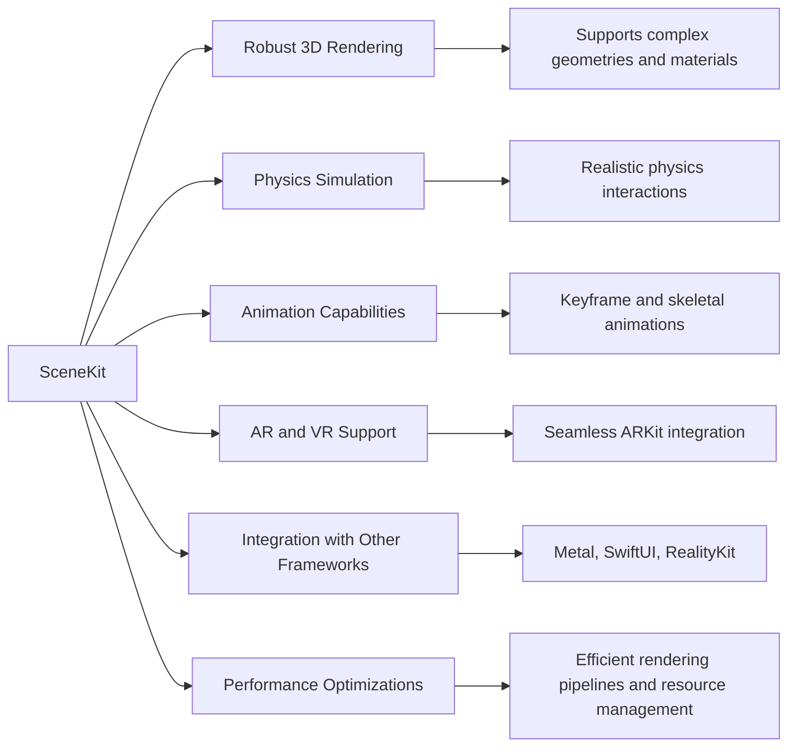

---

## **Best Practices for Using Scene Kit**

1. **Optimize Scene Graph**: Minimize the number of nodes and levels in the scene graph to enhance performance.
2. **Efficient Geometry Usage**: Use instanced geometries for repeated objects and simplify geometry complexity where possible.
3. **Leverage Physics Simulation Wisely**: Utilize physics bodies and fields judiciously to balance realism and performance.
4. **Utilize Animations Effectively**: Use SceneKit's animation capabilities to create dynamic and engaging experiences while avoiding unnecessary complexity.
5. **Integrate with Metal for Advanced Rendering**: For custom rendering effects, integrate SceneKit with Metal to harness low-level GPU capabilities.
6. **Employ Shader Modifiers**: Customize materials and effects using shader modifiers to achieve desired visual outcomes.
7. **Handle Resource Management**: Load and unload assets as needed to manage memory usage effectively, especially in resource-constrained environments.
8. **Implement LOD (Level of Detail)**: Use multiple levels of detail for models to maintain performance across different device capabilities.
9. **Profile and Optimize**: Regularly use profiling tools to identify and address performance bottlenecks in the scene rendering and interactions.
10. **Stay Updated with Latest Features**: Keep abreast of new SceneKit updates and features introduced in the latest iOS versions to leverage improvements and optimizations.

---
