# Security

Below is a comprehensive and organized set of Mermaid diagrams for the `Security` framework. These diagrams cover various aspects of the `Security` framework, including class structures, initializers, properties, methods, enumerations, protocol conformances, relationships, extensions, lifecycle, feature availability, data handling, integration, and best practices.

---

## **1. Class Structure and Hierarchy**

### **a. Core Class Diagram**
- **Purpose**: Illustrate the primary structure of key classes within the `Security` framework, including their properties and methods.
- **Diagram Type**: `classDiagram`
- **Contents**:
  - **Classes**: `SecKey`, `SecCertificate`, `SecIdentity`, `SecTrust`, `SecPolicy`, `SecAccessControl`.
  - **Properties & Methods**: Core attributes and essential functions.
  - **Relationships**: Inheritance and associations between classes.

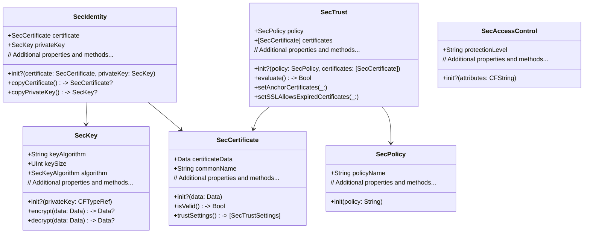

---

## **2. Initializers Overview**

### **a. Initialization Methods Diagram**
- **Purpose**: Break down the various ways to instantiate key classes within the `Security` framework.
- **Diagram Type**: `flowchart`
- **Contents**:
  - **Key Initialization**: `SecKeyCreateRandomKey`, `SecKeyCreateWithData`
  - **Certificate Initialization**: `SecCertificateCreateWithData`
  - **Identity Initialization**: `SecIdentityCreate`
  - **Trust Initialization**: `SecTrustCreateWithCertificates`
  - **Policy Initialization**: `SecPolicyCreateSSL`, `SecPolicyCreateBasicX509`
  - **Access Control Initialization**: `SecAccessControlCreate`

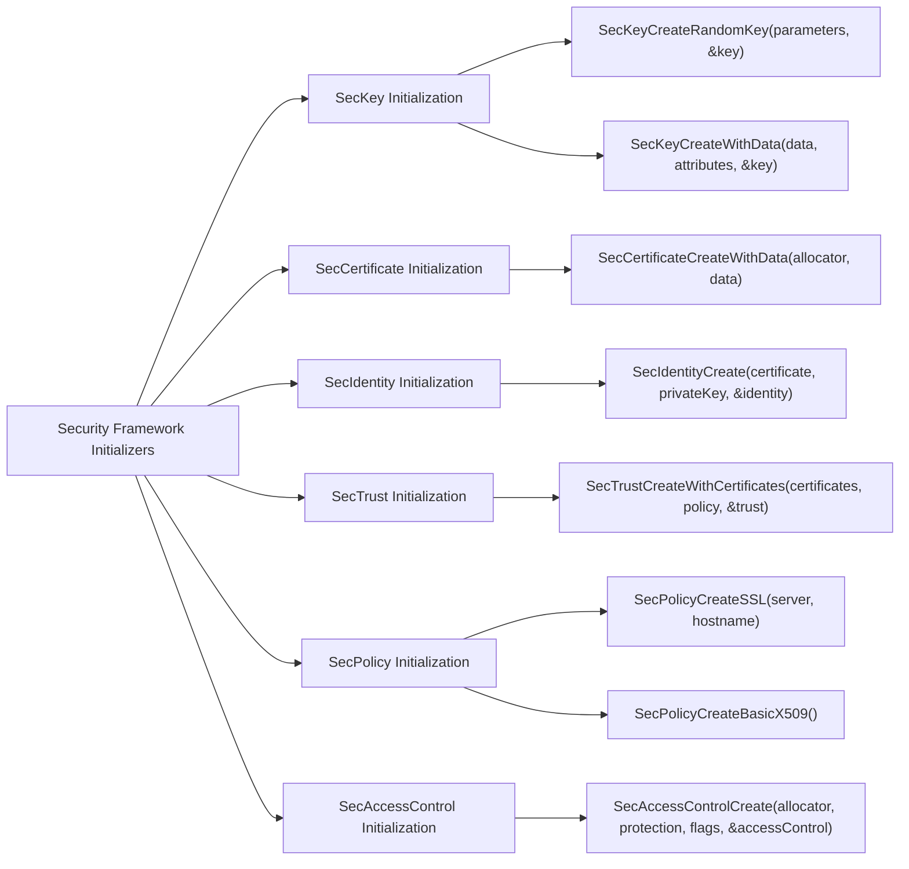

---

## **3. Properties Breakdown**

### **a. Key Classes Properties Diagram**
- **Purpose**: Detail the main properties of key classes within the `Security` framework.
- **Diagram Type**: `graph LR`
- **Contents**:
  - **SecKey**: `keyAlgorithm`, `keySize`, `algorithm`
  - **SecCertificate**: `certificateData`, `commonName`
  - **SecIdentity**: `certificate`, `privateKey`
  - **SecTrust**: `policy`, `certificates`
  - **SecPolicy**: `policyName`
  - **SecAccessControl**: `protectionLevel`

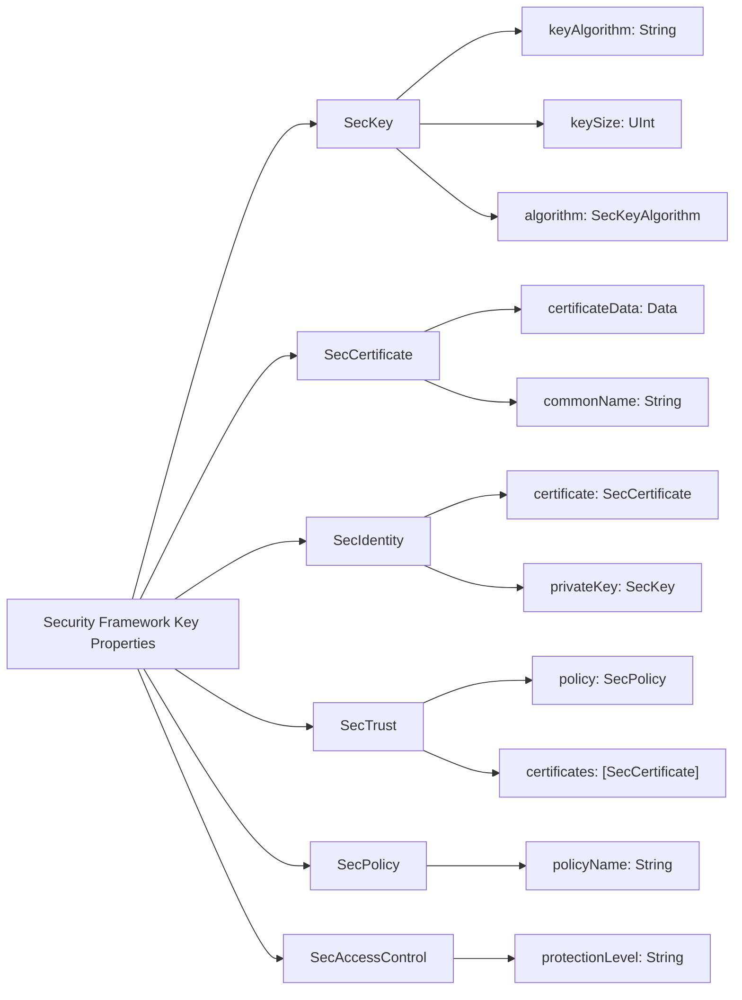


---

## **4. Methods Grouped by Functionality**

### **a. Cryptographic Operations Methods**
- **Purpose**: Categorize methods based on their roles in cryptographic operations.
- **Diagram Type**: `flowchart TD`
- **Contents**:
  - **Key Generation & Management**: `SecKeyCreateRandomKey`, `SecKeyCopyPublicKey`
  - **Encryption & Decryption**: `SecKeyEncrypt`, `SecKeyDecrypt`
  - **Signing & Verification**: `SecKeyCreateSignature`, `SecKeyVerifySignature`
  - **Certificate Handling**: `SecCertificateCopyValues`, `SecCertificateValidate`
  - **Trust Evaluation**: `SecTrustEvaluate`, `SecTrustGetCertificateCount`
  - **Policy Management**: `SecPolicyCreateSSL`, `SecPolicyCreateBasicX509`

```mermaid
flowchart TD
    A[Security Framework Methods] --> B[Key Generation & Management]
    A --> C[Encryption & Decryption]
    A --> D[Signing & Verification]
    A --> E[Certificate Handling]
    A --> F[Trust Evaluation]
    A --> G[Policy Management]

    B --> B1["SecKeyCreateRandomKey(parameters, &key)"]
    B --> B2["SecKeyCopyPublicKey(privateKey)"]

    C --> C1["SecKeyEncrypt(key, padding, data, dataLen, &cipherText, &cipherTextLen)"]
    C --> C2["SecKeyDecrypt(key, padding, cipherText, cipherTextLen, &plainText, &plainTextLen)"]

    D --> D1["SecKeyCreateSignature(key, algorithm, data, dataLen, &signature, &signatureLen)"]
    D --> D2["SecKeyVerifySignature(key, algorithm, data, dataLen, signature, signatureLen)"]

    E --> E1["SecCertificateCopyValues(cert, keys, &values)"]
    E --> E2["SecCertificateValidate(cert, &status)"]

    F --> F1["SecTrustEvaluate(trust, &result)"]
    F --> F2["SecTrustGetCertificateCount(trust)"]

    G --> G1["SecPolicyCreateSSL(server, hostname)"]
    G --> G2["SecPolicyCreateBasicX509()"]
```

---

## **5. Enumerations and Configurations**

### **a. Enumerations Diagram**
- **Purpose**: Highlight the enums and constants used within the `Security` framework and their possible values.
- **Diagram Type**: `classDiagram`
- **Contents**:
  - **SecKeyAlgorithm**
  - **SecPadding**
  - **SecTrustResultType**
  - **SecAccessControlCreateFlags**
  - **SecACLFlags**

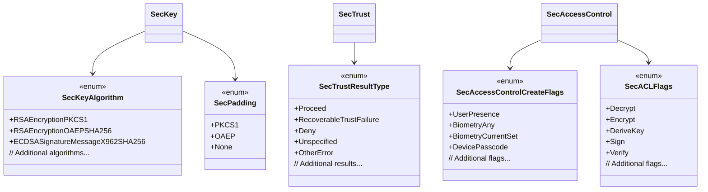

### **b. Configuration Classes Diagram**
- **Purpose**: Show the relationship between key classes and their configuration or policy classes.
- **Diagram Type**: `classDiagram`
- **Contents**:
  - **SecPolicy**
  - **SecAccessControl**

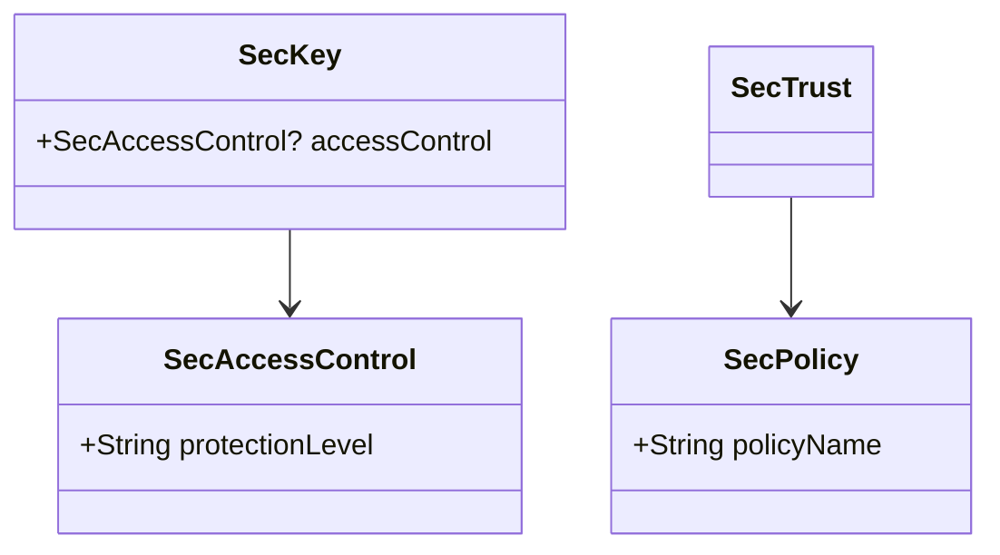

---

## **6. Protocol Conformances**

### **a. Protocols Diagram**
- **Purpose**: Display the protocols that key classes in the `Security` framework conform to and their impact.
- **Diagram Type**: `classDiagram`
- **Contents**:
  - **NSSecureCoding**
  - **NSCopying**
  - **NSObjectProtocol**
  - **Codable** (where applicable)

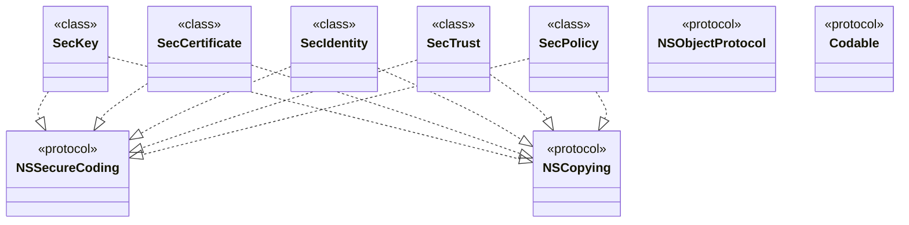

---

## **7. Relationships with Other Classes**

### **a. Related Classes Diagram**
- **Purpose**: Illustrate how `Security` framework classes interact with other iOS/macOS classes and frameworks.
- **Diagram Type**: `flowchart`
- **Contents**:
  - **UIKit & AppKit**: Integration with UI for authentication prompts.
  - **CoreFoundation**: Interoperability with CF types.
  - **Foundation**: Data handling and serialization.
  - **LocalAuthentication**: Biometric authentication.
  - **Keychain Services**: Secure storage integration.

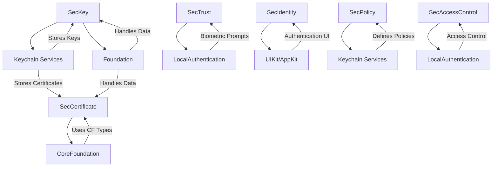

---

## **8. Extensions and Additional Functionalities**

### **a. Security Framework Extensions Diagram**
- **Purpose**: Showcase the additional functionalities provided through extensions and helper classes.
- **Diagram Type**: `classDiagram`
- **Contents**:
  - **Swift Extensions**: Convenience initializers, utility methods.
  - **Helper Classes**: `KeychainWrapper`, `CertificateManager`
  - **Protocols Extensions**: Conformance to Codable, CustomStringConvertible

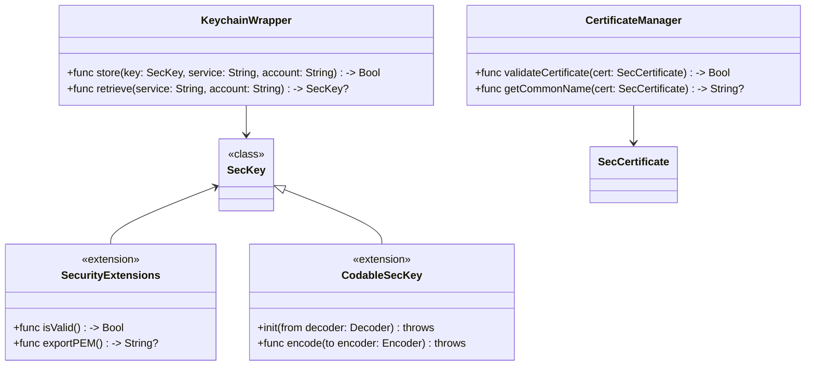

### **b. Extensions Functionalities Flowchart**
- **Purpose**: Detail specific extended methods and their purposes.
- **Diagram Type**: `flowchart`
- **Contents**:
  - **Key Validation**
  - **PEM Export**
  - **Keychain Storage**
  - **Certificate Validation**

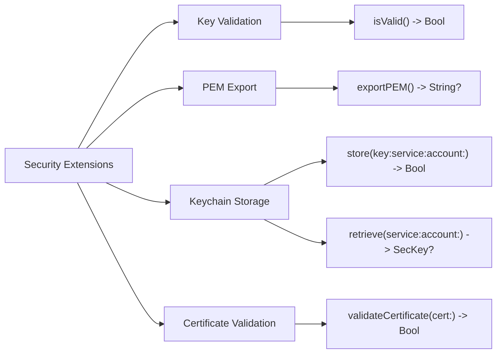

---

## **9. Lifecycle and Use Cases**

### **a. Lifecycle Flowchart**
- **Purpose**: Demonstrate the typical lifecycle of security objects within an application.
- **Diagram Type**: `flowchart TD`
- **Contents**:
  - **Key Generation**
  - **Certificate Enrollment**
  - **Key Storage**
  - **Authentication**
  - **Trust Evaluation**
  - **Key Usage**
  - **Key Revocation**

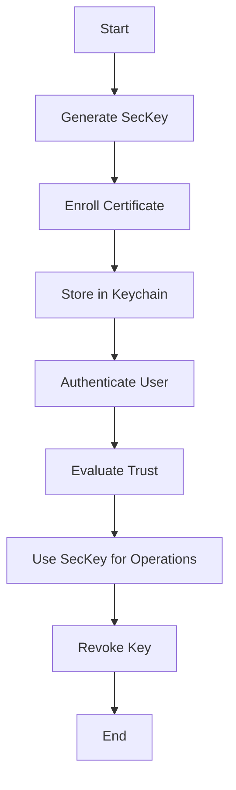

### **b. Common Use Cases Diagram**
- **Purpose**: Outline the typical scenarios where the `Security` framework is utilized.
- **Diagram Type**: `flowchart`
- **Contents**:
  - **User Authentication**
  - **Secure Data Storage**
  - **Data Encryption & Decryption**
  - **Digital Signing & Verification**
  - **Certificate Management**
  - **Secure Network Communications**
  - **Biometric Authentication**

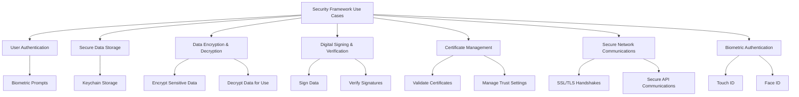

---

## **10. Feature Availability Timeline**

### **a. Feature Availability Gantt Chart**
- **Purpose**: Show when various `Security` framework features were introduced across iOS versions.
- **Diagram Type**: `gantt`
- **Contents**:
  - **iOS Versions**: 2.0, 3.0, 4.0, 5.0, 6.0, 7.0, 8.0, 10.0, 12.0, 14.0, 15.0, 16.0, 17.0
  - **Features Introduced**: Keychain Services, Biometric Authentication, Secure Enclave Integration, Modern Cryptography APIs, TLS 1.3 Support, etc.

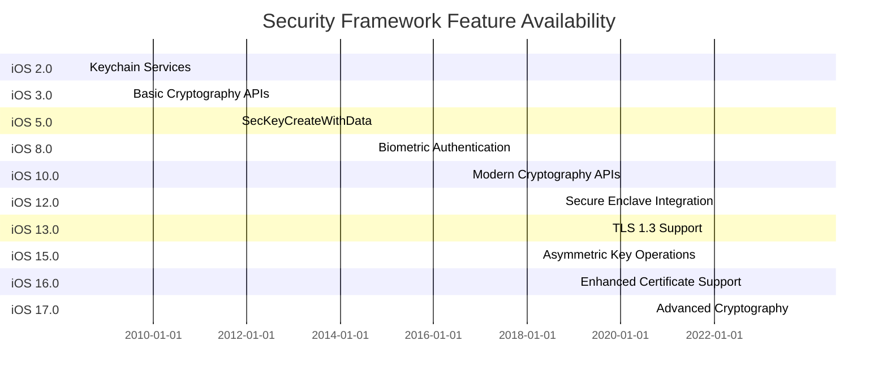

---

## **11. Data Handling and Formats**

### **a. Data Format Handling Diagram**
- **Purpose**: Explain how the `Security` framework handles different data formats.
- **Diagram Type**: `graph LR`
- **Contents**:
  - **Certificates**: DER, PEM
  - **Keys**: RSA, EC, Symmetric
  - **Data Formats**: PKCS#1, PKCS#12, PKCS#8
  - **Encryption Standards**: AES, DES, TripleDES

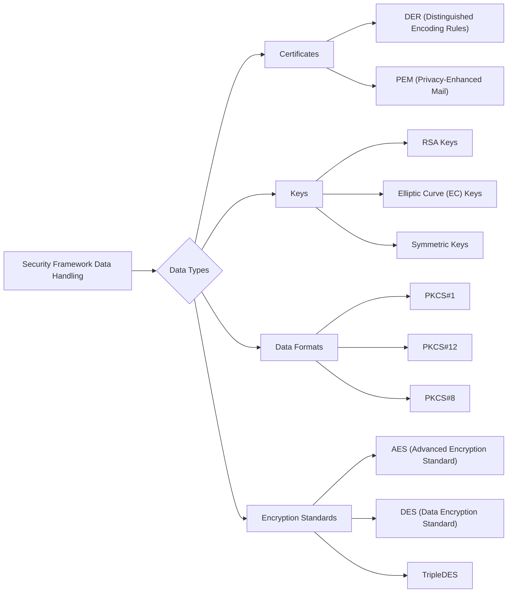

---

## **12. Integration with Other Frameworks**

### **a. Integration Diagram**
- **Purpose**: Show how the `Security` framework integrates with other iOS/macOS frameworks and services.
- **Diagram Type**: `flowchart`
- **Contents**:
  - **LocalAuthentication**: Biometric prompts
  - **NetworkExtension**: Secure networking
  - **CoreFoundation**: CFType interoperability
  - **Foundation**: Data manipulation
  - **UIKit/AppKit**: UI integration for authentication
  - **CloudKit**: Secure data storage in cloud

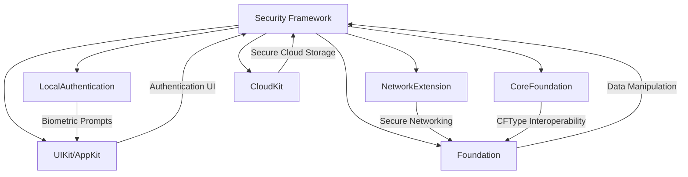

---

## **13. Summary and Best Practices**

### **a. Summary Diagram**
- **Purpose**: Provide a high-level overview of the `Security` framework's key characteristics and functionalities.
- **Diagram Type**: `graph LR`
- **Contents**:
  - **Secure Key Management**
  - **Robust Certificate Handling**
  - **Advanced Cryptographic Operations**
  - **Seamless Integration with iOS/macOS**
  - **Biometric Authentication Support**
  - **Comprehensive Trust Evaluation**

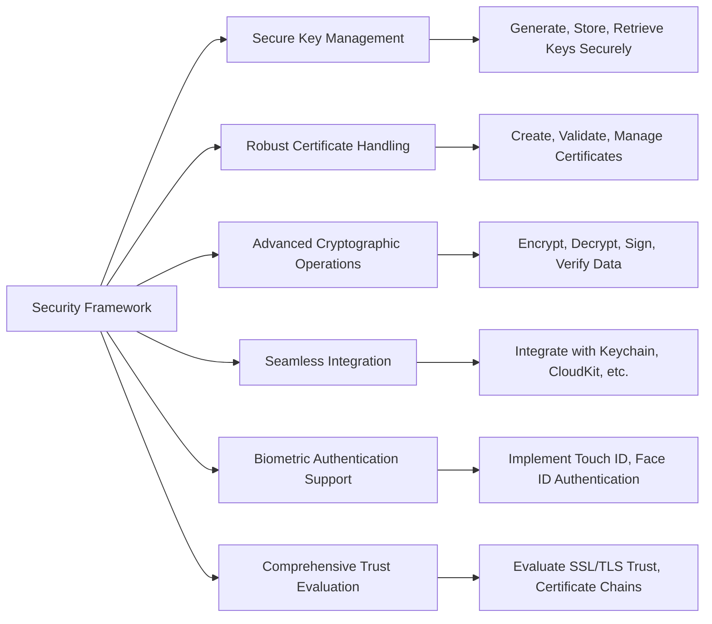

### **b. Best Practices Diagram**
- **Purpose**: Highlight best practices for using the `Security` framework effectively and securely.
- **Diagram Type**: `flowchart`
- **Contents**:
  - **Key Generation Security**
  - **Proper Certificate Validation**
  - **Secure Storage Practices**
  - **Regular Trust Evaluation**
  - **Least Privilege Principle**
  - **Error Handling and Logging**

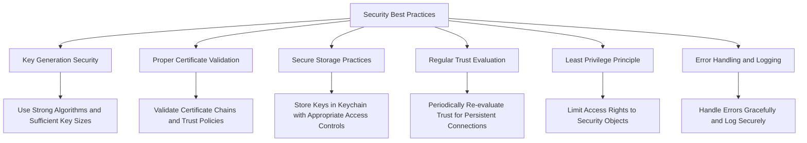

---

## **14. Security Considerations**

### **a. Security Considerations Diagram**
- **Purpose**: Outline critical security considerations when using the `Security` framework.
- **Diagram Type**: `graph LR`
- **Contents**:
  - **Data Protection**
  - **Access Control**
  - **Key Management**
  - **Secure Coding Practices**
  - **Regular Audits**

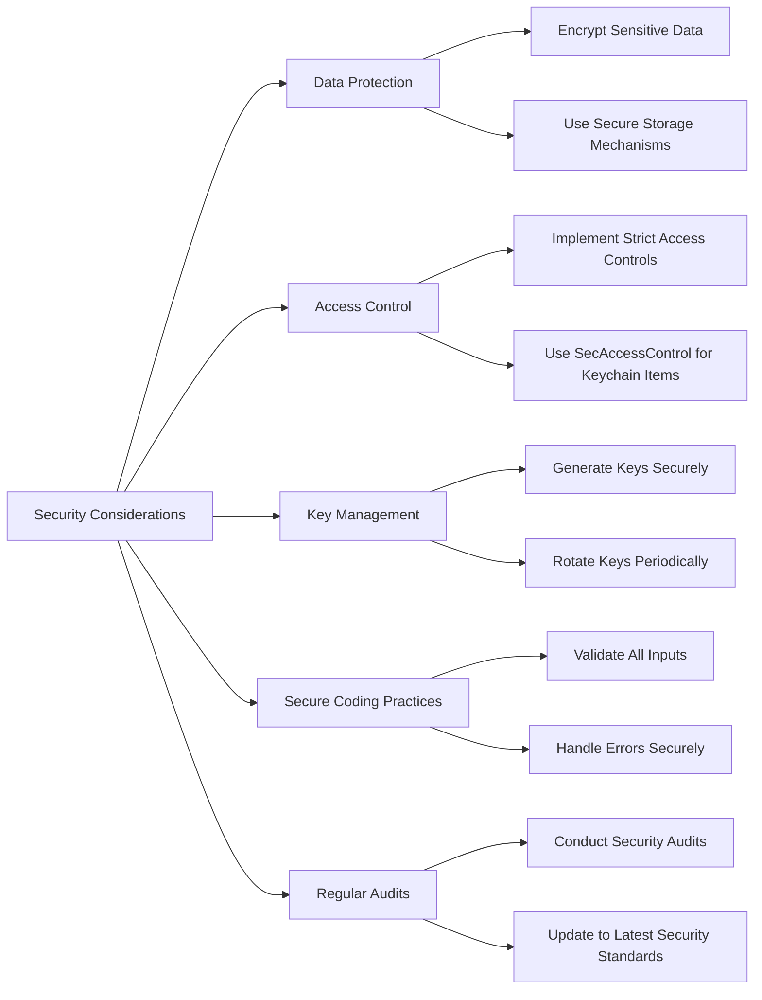

---

## **15. Common Pitfalls and Troubleshooting**

### **a. Common Pitfalls Diagram**
- **Purpose**: Identify common mistakes when implementing the `Security` framework and provide troubleshooting steps.
- **Diagram Type**: `flowchart`
- **Contents**:
  - **Improper Key Storage**
  - **Incorrect Certificate Validation**
  - **Misconfigured Policies**
  - **Ignoring Security Best Practices**
  - **Troubleshooting Steps**

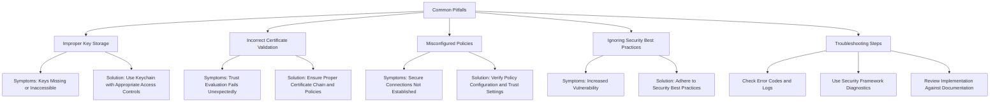

---

## **16. Sample Code Snippets**

### **a. Key Generation and Storage Diagram**
- **Purpose**: Provide a visual representation of key generation and storage process.
- **Diagram Type**: `flowchart`
- **Contents**:
  - **Generate SecKey**
  - **Store in Keychain**
  - **Retrieve SecKey**
  - **Use SecKey for Encryption**

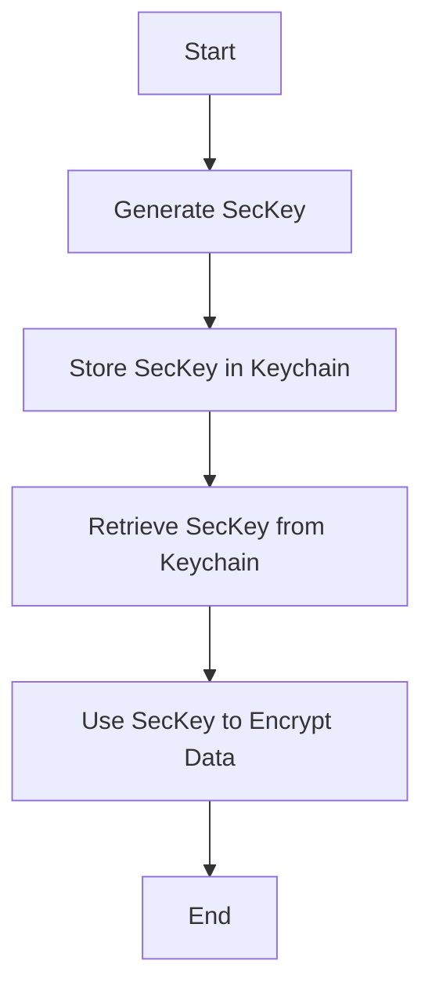

---

## **17. Advanced Topics**

### **a. Secure Enclave Integration Diagram**
- **Purpose**: Illustrate how to integrate `Security` framework with the Secure Enclave for enhanced security.
- **Diagram Type**: `flowchart`
- **Contents**:
  - **Generate Key in Secure Enclave**
  - **Perform Cryptographic Operations**
  - **Access Control with Biometrics**
  - **Key Usage Restrictions**

```mermaid
flowchart LR
    A[Integrate with Secure Enclave] --> B[Generate SecKey in Secure Enclave]
    B --> C[Perform Cryptographic Operations]
    C --> D[Access Control with Biometrics]
    D --> E[Restrict Key Usage]
    E --> F[Use Key for Sensitive Operations]

    B --> |Attributes| C
    D --> |Biometric Prompt| E
```

---

## **18. Testing and Validation**

### **a. Testing Workflow Diagram**
- **Purpose**: Outline the workflow for testing security functionalities.
- **Diagram Type**: `flowchart`
- **Contents**:
  - **Unit Testing**
  - **Integration Testing**
  - **Security Audits**
  - **Penetration Testing**
  - **Validation of Encryption/Decryption**

```mermaid
flowchart TD
    A[Testing Security Framework] --> B[Unit Testing]
    A --> C[Integration Testing]
    A --> D[Security Audits]
    A --> E[Penetration Testing]
    A --> F[Validation of Encryption/Decryption]

    B --> B1[Test Individual Methods]
    C --> C1[Test Integration with Keychain]
    D --> D1[Review Code for Vulnerabilities]
    E --> E1[Simulate Attacks]
    F --> F1[Encrypt Data and Decrypt to Verify]
```

---

## **19. Performance Considerations**

### **a. Performance Optimizations Diagram**
- **Purpose**: Highlight strategies to optimize performance when using the `Security` framework.
- **Diagram Type**: `graph LR`
- **Contents**:
  - **Efficient Key Management**
  - **Minimize Cryptographic Operations**
  - **Asynchronous Processing**
  - **Caching Certificates**
  - **Reuse SecTrust Objects**

```mermaid
graph LR
    A[Performance Optimizations] --> B[Efficient Key Management]
    A --> C[Minimize Cryptographic Operations]
    A --> D[Asynchronous Processing]
    A --> E[Caching Certificates]
    A --> F[Reuse SecTrust Objects]

    B --> B1[Store Keys Securely for Reuse]
    C --> C1[Avoid Unnecessary Encrypt/Decrypt]
    D --> D1[Perform Operations on Background Threads]
    E --> E1[Cache Validated Certificates]
    F --> F1[Reuse Trust Objects for Multiple Evaluations]
```

---

## **20. Compliance and Privacy**

### **a. Compliance and Privacy Diagram**
- **Purpose**: Illustrate how to ensure compliance and maintain privacy using the `Security` framework.
- **Diagram Type**: `flowchart`
- **Contents**:
  - **Data Encryption**
  - **Access Controls**
  - **User Consent for Biometric Data**
  - **Regulatory Compliance (e.g., GDPR, HIPAA)**
  - **Secure Data Transmission**

```mermaid
flowchart TD
    A[Compliance and Privacy] --> B[Data Encryption]
    A --> C[Access Controls]
    A --> D[User Consent for Biometric Data]
    A --> E[Regulatory Compliance]
    A --> F[Secure Data Transmission]

    B --> B1[Encrypt Sensitive Data at Rest and in Transit]
    C --> C1[Implement Strict Access Controls]
    D --> D1[Obtain Explicit User Consent]
    E --> E1[Adhere to GDPR, HIPAA, etc.]
    F --> F1[Use TLS for Data Transmission]
```

---

## **21. Migration and Upgrading**

### **a. Migration Strategy Diagram**
- **Purpose**: Provide a strategy for migrating existing security implementations to newer APIs or practices.
- **Diagram Type**: `flowchart`
- **Contents**:
  - **Assess Current Implementation**
  - **Identify Deprecated APIs**
  - **Update to Modern APIs**
  - **Test Updated Implementation**
  - **Deploy Changes**

```mermaid
flowchart TD
    A[Migration Strategy] --> B[Assess Current Implementation]
    B --> C[Identify Deprecated APIs]
    C --> D[Update to Modern APIs]
    D --> E[Test Updated Implementation]
    E --> F[Deploy Changes]
```

---

## **22. Resources and References**

### **a. Resources Diagram**
- **Purpose**: Provide a visual guide to essential resources and references for the `Security` framework.
- **Diagram Type**: `flowchart`
- **Contents**:
  - **Apple Documentation**
  - **WWDC Sessions**
  - **Security Best Practices Guides**
  - **Community Forums and Discussions**
  - **Sample Code Repositories**

```mermaid
flowchart LR
    A[Security Framework Resources] --> B[Apple Documentation]
    A --> C[WWDC Sessions]
    A --> D[Security Best Practices Guides]
    A --> E[Community Forums and Discussions]
    A --> F[Sample Code Repositories]

    B --> B1[Developer Documentation]
    C --> C1[WWDC 2023: Advanced Security]
    D --> D1[OWASP Mobile Security Guidelines]
    E --> E1[Apple Developer Forums]
    F --> F1[GitHub Security Samples]
```

---
