# SpriteKit

Below is a comprehensive and organized set of Mermaid diagrams for the `SpriteKit` framework. These diagrams cover various aspects of `SpriteKit`, including class structure, initializers, properties, methods, enumerations, protocol conformances, relationships with other classes, extensions, lifecycle, feature availability, data handling, integration with drawing contexts, and best practices.

---

## **1. Class Structure and Hierarchy**

### **a. Core Class Diagram**
- **Purpose**: Illustrate the primary structure of `SKSpriteNode`, including its properties, methods, and enumerations.
- **Diagram Type**: `classDiagram`
- **Contents**:
  - **Properties**: Key attributes like `size`, `texture`, `color`, `blendMode`, etc.
  - **Methods**: Essential functions like initializers, `run()`, `removeAllActions()`, etc.
  - **Enumerations**: Nested enums such as `BlendMode`, `FilterBlendMode`.

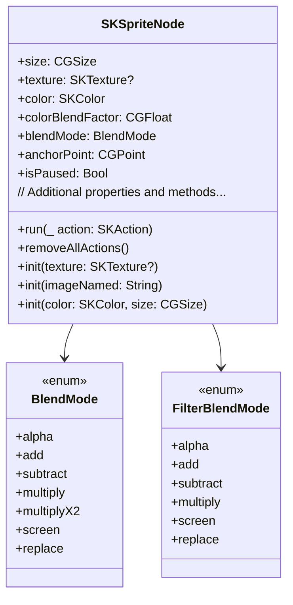
```mermaid
classDiagram
    class SKSpriteNode {
        +size: CGSize
        +texture: SKTexture?
        +color: SKColor
        +colorBlendFactor: CGFloat
        +blendMode: BlendMode
        +anchorPoint: CGPoint
        +isPaused: Bool
        +run(_ action: SKAction)
        +removeAllActions()
        +init(texture: SKTexture?)
        +init(imageNamed: String)
        +init(color: SKColor, size: CGSize)
        // Additional properties and methods...
    }

    class BlendMode {
        <<enum>>
        +alpha
        +add
        +subtract
        +multiply
        +multiplyX2
        +screen
        +replace
    }

    class FilterBlendMode {
        <<enum>>
        +alpha
        +add
        +subtract
        +multiply
        +screen
        +replace
    }

    SKSpriteNode --> BlendMode
    SKSpriteNode --> FilterBlendMode
```

---

## **2. Initializers Overview**

### **a. Initialization Methods Diagram**
- **Purpose**: Break down the various ways to instantiate `SKSpriteNode`.
- **Diagram Type**: `flowchart LR`
- **Contents**:
  - **Texture-Based Initializers**: `init(texture:)`, `init(texture:color:size:)`
  - **Image-Based Initializers**: `init(imageNamed:)`, `init(image:)`
  - **Color-Based Initializers**: `init(color:size:)`
  - **Copying Initializers**: `copy()`, `init(copy:)`

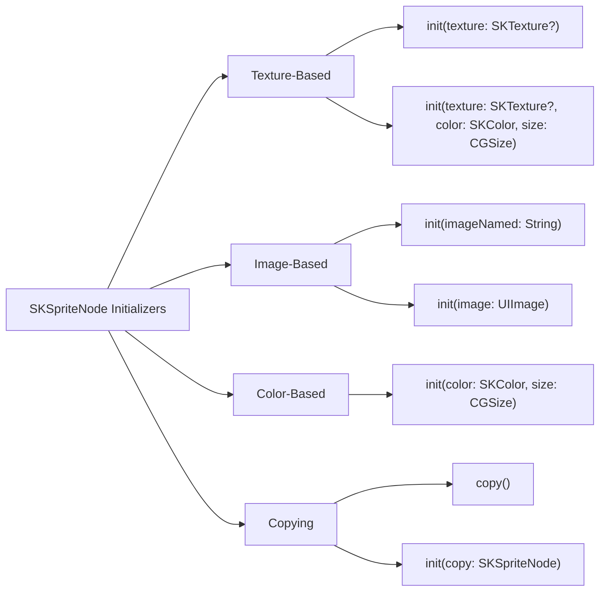
```mermaid
graph LR
    A[SKSpriteNode Initializers] --> B[Texture-Based]
    A --> C[Image-Based]
    A --> D[Color-Based]
    A --> E[Copying]

    B --> B1["init(texture: SKTexture?)"]
    B --> B2["init(texture: SKTexture?, color: SKColor, size: CGSize)"]

    C --> C1["init(imageNamed: String)"]
    C --> C2["init(image: UIImage)"]

    D --> D1["init(color: SKColor, size: CGSize)"]

    E --> E1["copy()"]
    E --> E2["init(copy: SKSpriteNode)"]
```

---

## **3. Properties Breakdown**

### **a. Key Properties Diagram**
- **Purpose**: Detail the main properties of `SKSpriteNode`.
- **Diagram Type**: `graph LR`
- **Contents**:
  - **Visual Attributes**: `size`, `texture`, `color`, `blendMode`, `alpha`
  - **Positioning Attributes**: `position`, `anchorPoint`, `zPosition`
  - **Physics Properties**: `physicsBody`, `isDynamic`, `affectedByGravity`
  - **Rendering Attributes**: `hidden`, `isPaused`

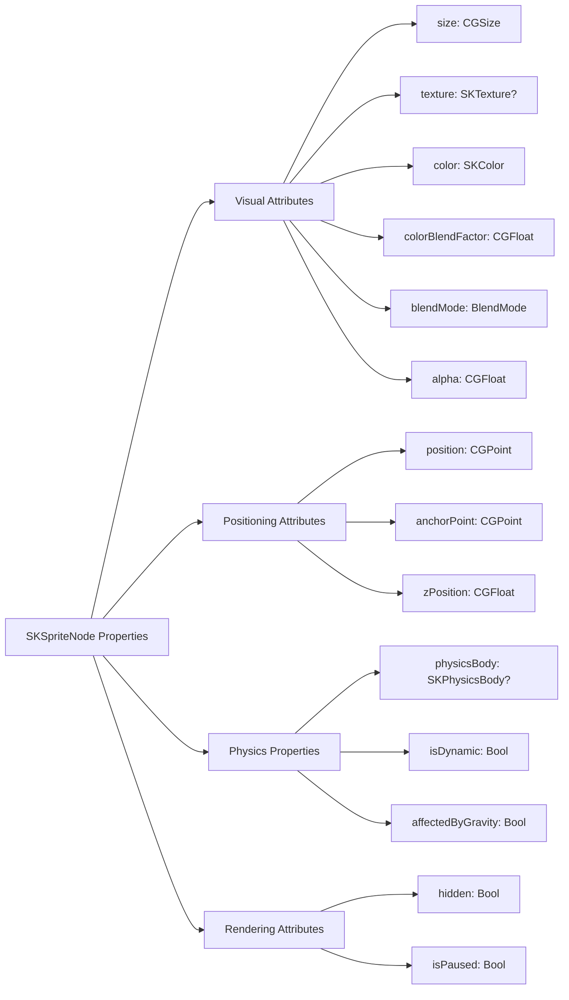
```mermaid
graph LR
    A[SKSpriteNode Properties] --> B[Visual Attributes]
    A --> C[Positioning Attributes]
    A --> D[Physics Properties]
    A --> E[Rendering Attributes]

    B --> B1[size: CGSize]
    B --> B2[texture: SKTexture?]
    B --> B3[color: SKColor]
    B --> B4[colorBlendFactor: CGFloat]
    B --> B5[blendMode: BlendMode]
    B --> B6[alpha: CGFloat]

    C --> C1[position: CGPoint]
    C --> C2[anchorPoint: CGPoint]
    C --> C3[zPosition: CGFloat]

    D --> D1[physicsBody: SKPhysicsBody?]
    D --> D2[isDynamic: Bool]
    D --> D3[affectedByGravity: Bool]

    E --> E1[hidden: Bool]
    E --> E2[isPaused: Bool]
```

---

## **4. Methods Grouped by Functionality**

### **a. Action Management Methods**
- **Purpose**: Categorize methods based on their roles in managing actions.
- **Diagram Type**: `flowchart TD`
- **Contents**:
  - **Running Actions**: `run(_:)`, `run(_:completion:)`
  - **Sequencing Actions**: `run(SKAction.sequence(_:)`
  - **Repeating Actions**: `run(SKAction.repeat(_:, count:)`
  - **Removing Actions**: `removeAllActions()`, `removeAction(forKey:)`

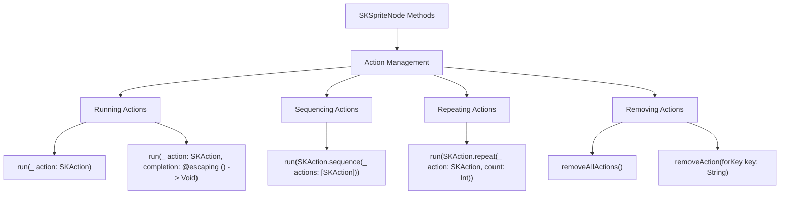
```mermaid
flowchart TD
    A[SKSpriteNode Methods] --> B[Action Management]
    B --> C[Running Actions]
    B --> D[Sequencing Actions]
    B --> E[Repeating Actions]
    B --> F[Removing Actions]

    C --> C1["run(_ action: SKAction)"]
    C --> C2["run(_ action: SKAction, completion: @escaping () -> Void)"]

    D --> D1["run(SKAction.sequence(_ actions: [SKAction]))"]

    E --> E1["run(SKAction.repeat(_ action: SKAction, count: Int))"]

    F --> F1["removeAllActions()"]
    F --> F2["removeAction(forKey key: String)"]
```

---

## **5. Enumerations and Configurations**

### **a. Enumerations Diagram**
- **Purpose**: Highlight the enums used within `SKSpriteNode` and their possible values.
- **Diagram Type**: `classDiagram`
- **Contents**:
  - **BlendMode**
  - **FilterBlendMode**
  - **AnchorPoint**

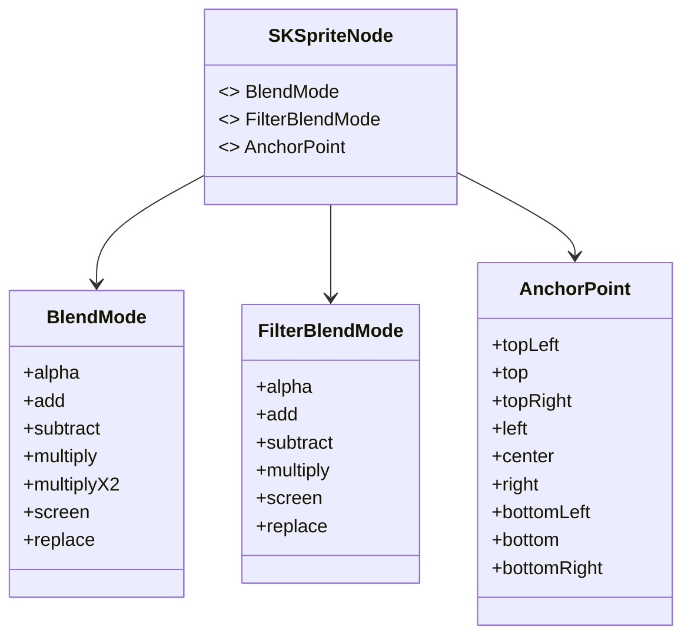
```mermaid
classDiagram
    class SKSpriteNode {
        <<enumeration>> BlendMode
        <<enumeration>> FilterBlendMode
        <<enumeration>> AnchorPoint
    }

    class BlendMode {
        +alpha
        +add
        +subtract
        +multiply
        +multiplyX2
        +screen
        +replace
    }

    class FilterBlendMode {
        +alpha
        +add
        +subtract
        +multiply
        +screen
        +replace
    }

    class AnchorPoint {
        +topLeft
        +top
        +topRight
        +left
        +center
        +right
        +bottomLeft
        +bottom
        +bottomRight
    }

    SKSpriteNode --> BlendMode
    SKSpriteNode --> FilterBlendMode
    SKSpriteNode --> AnchorPoint
```

### **b. Configuration Classes Diagram**
- **Purpose**: Show the relationship between `SKSpriteNode` and its configuration classes.
- **Diagram Type**: `classDiagram`
- **Contents**:
  - **SKColorBlendFactor**
  - **SKPhysicsBody**

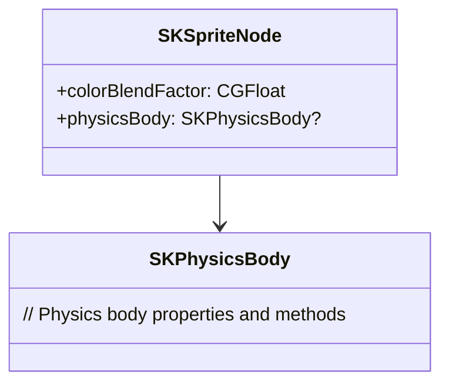
```mermaid
classDiagram
    class SKSpriteNode {
        +colorBlendFactor: CGFloat
        +physicsBody: SKPhysicsBody?
    }

    class SKPhysicsBody {
        // Physics body properties and methods
    }

    SKSpriteNode --> SKPhysicsBody
```

---

## **6. Protocol Conformances**

### **a. Protocols Diagram**
- **Purpose**: Display the protocols that `SKSpriteNode` conforms to and their impact.
- **Diagram Type**: `classDiagram`
- **Contents**:
  - **NSCopying**
  - **NSSecureCoding**
    - **Codable**
  - **Sendable**

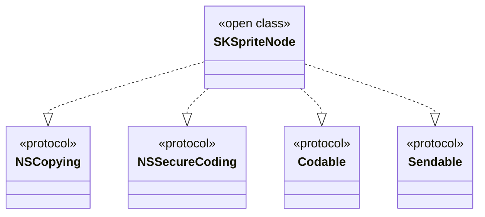
```mermaid
classDiagram
    class SKSpriteNode {
        <<open class>>
    }

    class NSCopying {
        <<protocol>>
    }

    class NSSecureCoding {
        <<protocol>>
    }

    class Codable {
        <<protocol>>
    }

    class Sendable {
        <<protocol>>
    }

    SKSpriteNode ..|> NSCopying
    SKSpriteNode ..|> NSSecureCoding
    SKSpriteNode ..|> Codable
    SKSpriteNode ..|> Sendable
```

---

## **7. Relationships with Other Classes**

### **a. Related Classes Diagram**
- **Purpose**: Illustrate how `SKSpriteNode` interacts with other SpriteKit and UIKit classes.
- **Diagram Type**: `flowchart TD`
- **Contents**:
  - **SKScene**: Parent scene of `SKSpriteNode`.
  - **SKAction**: Actions applied to `SKSpriteNode`.
  - **SKTexture**: Textures used by `SKSpriteNode`.
  - **SKPhysicsBody**: Physics bodies associated with `SKSpriteNode`.
  - **SKLabelNode**: Often siblings within the same scene.
  - **UIViewController**: Hosts `SKView` which presents `SKScene`.
  - **SKView**: Renders `SKScene` containing `SKSpriteNode`.

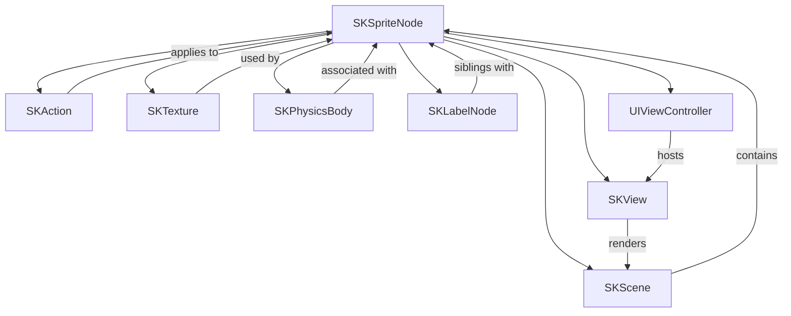
```mermaid
flowchart TD
    A[SKSpriteNode] --> B[SKScene]
    A --> C[SKAction]
    A --> D[SKTexture]
    A --> E[SKPhysicsBody]
    A --> F[SKLabelNode]
    A --> G[SKView]
    A --> H[UIViewController]

    B --> |contains| A
    C --> |applies to| A
    D --> |used by| A
    E --> |associated with| A
    F --> |siblings with| A
    G --> |renders| B
    H --> |hosts| G
```

---

## **8. Extensions and Additional Functionalities**

### **a. SKSpriteNode Extensions Diagram**
- **Purpose**: Showcase the additional functionalities provided through extensions.
- **Diagram Type**: `classDiagram`
- **Contents**:
  - **Physics Extensions**
  - **Animation Helpers**
  - **Collision Handling**

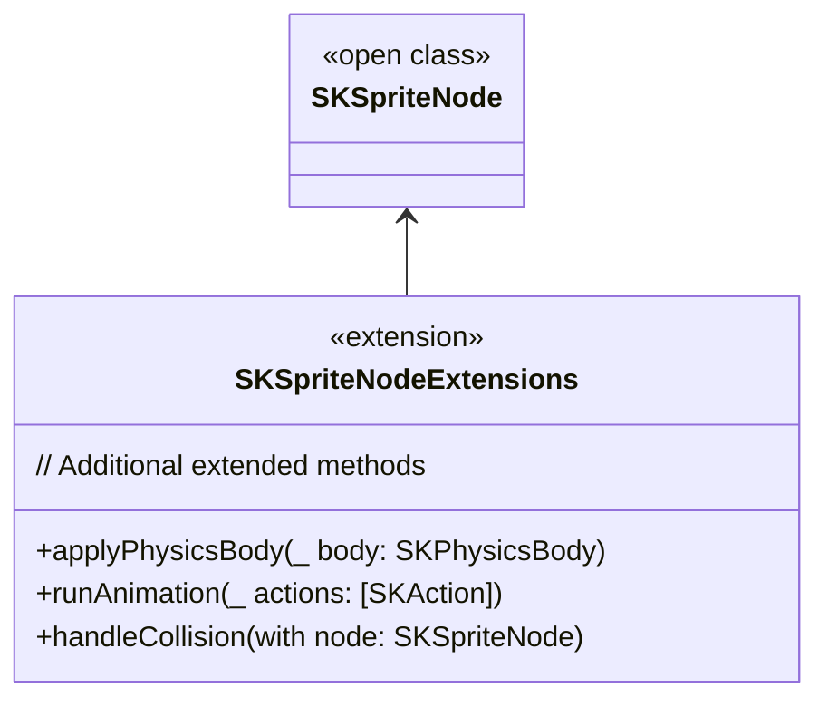
```mermaid
classDiagram
    class SKSpriteNode {
        <<open class>>
    }

    class SKSpriteNodeExtensions {
        <<extension>>
        +applyPhysicsBody(_ body: SKPhysicsBody)
        +runAnimation(_ actions: [SKAction])
        +handleCollision(with node: SKSpriteNode)
        // Additional extended methods
    }

    SKSpriteNode <-- SKSpriteNodeExtensions
```

### **b. Extensions Functionalities Flowchart**
- **Purpose**: Detail specific extended methods and their purposes.
- **Diagram Type**: `flowchart LR`
- **Contents**:
  - **Physics Extensions**
  - **Animation Helpers**
  - **Collision Handling**

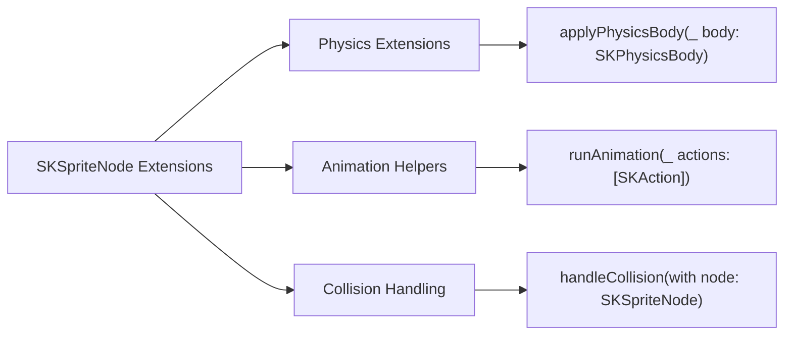
```mermaid
flowchart LR
    A[SKSpriteNode Extensions] --> B[Physics Extensions]
    A --> C[Animation Helpers]
    A --> D[Collision Handling]

    B --> B1["applyPhysicsBody(_ body: SKPhysicsBody)"]
    
    C --> C1["runAnimation(_ actions: [SKAction])"]

    D --> D1["handleCollision(with node: SKSpriteNode)"]
```

---

## **9. Lifecycle and Use Cases**

### **a. Lifecycle Flowchart**
- **Purpose**: Demonstrate the typical lifecycle of an `SKSpriteNode` within a game.
- **Diagram Type**: `flowchart TD`
- **Contents**:
  - **Initialization**
  - **Adding to Scene**
  - **Running Actions**
  - **Collision Detection**
  - **Removal from Scene**

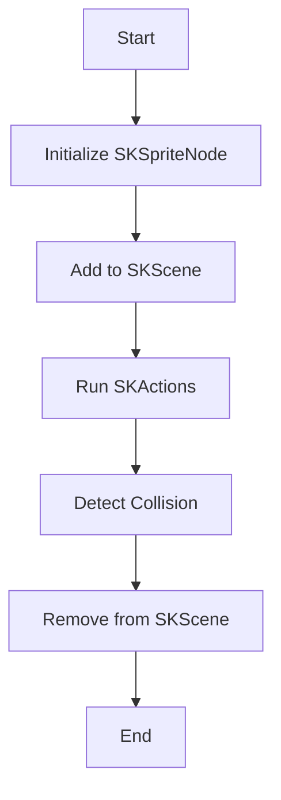
```mermaid
flowchart TD
    Start[Start] --> Init[Initialize SKSpriteNode]
    Init --> Add[Add to SKScene]
    Add --> Run[Run SKActions]
    Run --> Collision[Detect Collision]
    Collision --> Remove[Remove from SKScene]
    Remove --> End[End]
```

### **b. Common Use Cases Diagram**
- **Purpose**: Outline the typical scenarios where `SKSpriteNode` is utilized.
- **Diagram Type**: `flowchart TD`
- **Contents**:
  - **Character Representation**
  - **Background Elements**
  - **Interactive Objects**
  - **UI Elements within Game**
  - **Particle Systems**
  - **Animated Sprites**

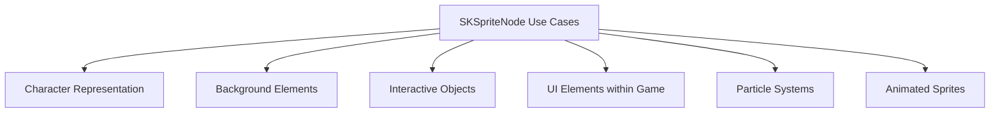
```mermaid
flowchart TD
    A[SKSpriteNode Use Cases] --> B[Character Representation]
    A --> C[Background Elements]
    A --> D[Interactive Objects]
    A --> E[UI Elements within Game]
    A --> F[Particle Systems]
    A --> G[Animated Sprites]
```

---

## **10. Feature Availability Timeline**

### **a. Feature Availability Gantt Chart**
- **Purpose**: Show when various `SKSpriteNode` features were introduced across iOS versions.
- **Diagram Type**: `gantt`
- **Contents**:
  - **iOS Versions**: 7.0, 8.0, 9.0, 10.0, 11.0, 12.0, 13.0, 14.0, 15.0, 16.0, 17.0
  - **Features Introduced**: Physics Bodies, Action Sequences, Advanced Texturing, Blend Modes, Collision Detection, Animated Textures, Shader Support, Particle Emitters, Procedural Animations, Sprite Kit Particle Effects, Enhanced Performance Optimizations.

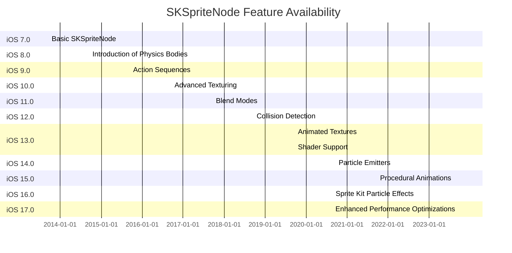
```mermaid
gantt
    dateFormat  YYYY-MM-DD
    title SKSpriteNode Feature Availability

    section iOS 7.0
    Basic SKSpriteNode                   :done, des1, 2013-09-18, 2013-09-18

    section iOS 8.0
    Introduction of Physics Bodies       :done, des2, 2014-09-17, 2014-09-17

    section iOS 9.0
    Action Sequences                     :done, des3, 2015-09-16, 2015-09-16

    section iOS 10.0
    Advanced Texturing                   :done, des4, 2016-09-19, 2016-09-19

    section iOS 11.0
    Blend Modes                          :done, des5, 2017-09-19, 2017-09-19

    section iOS 12.0
    Collision Detection                  :done, des6, 2018-09-17, 2018-09-17

    section iOS 13.0
    Animated Textures                    :done, des7, 2019-09-19, 2019-09-19
    Shader Support                       :done, des8, 2019-09-19, 2019-09-19

    section iOS 14.0
    Particle Emitters                    :done, des9, 2020-09-16, 2020-09-16

    section iOS 15.0
    Procedural Animations                :done, des10, 2021-09-20, 2021-09-20

    section iOS 16.0
    Sprite Kit Particle Effects          :done, des11, 2022-09-12, 2022-09-12

    section iOS 17.0
    Enhanced Performance Optimizations   :done, des12, 2023-09-18, 2023-09-18
```

---

## **11. Data Handling and Formats**

### **a. Texture Management Diagram**
- **Purpose**: Explain how `SKSpriteNode` handles different texture data formats.
- **Diagram Type**: `graph LR`
- **Contents**:
  - **SKTexture**: Primary texture format.
  - **Image Formats**: PNG, JPEG, HEIF.
  - **Texture Loading**: From image files, atlases, or programmatically.
  - **Dynamic Textures**: Procedurally generated or updated textures.

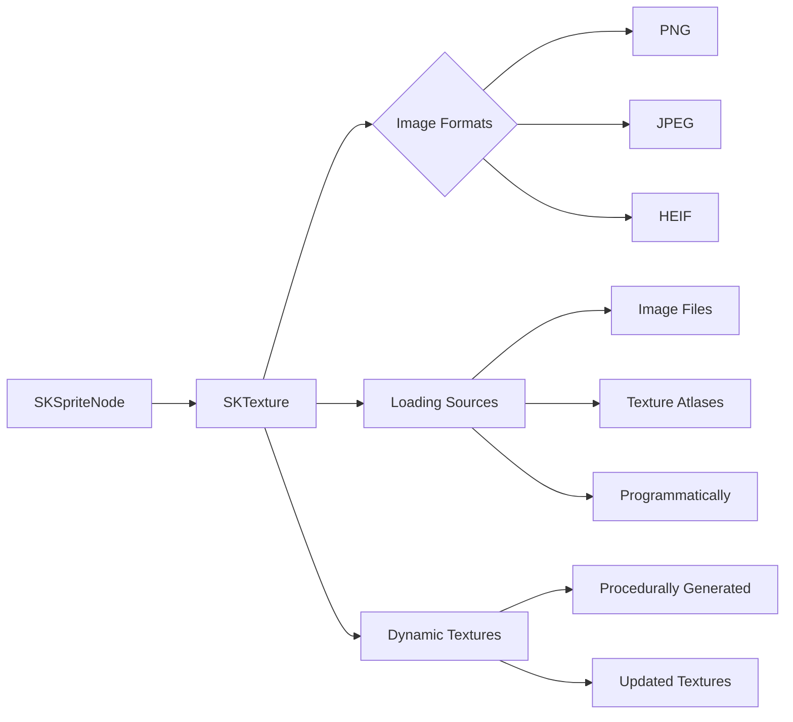
```mermaid
graph LR
    A[SKSpriteNode] --> B[SKTexture]
    B --> C{Image Formats}
    C --> D["PNG"]
    C --> E["JPEG"]
    C --> F["HEIF"]
    B --> G[Loading Sources]
    G --> G1["Image Files"]
    G --> G2["Texture Atlases"]
    G --> G3["Programmatically"]
    B --> H[Dynamic Textures]
    H --> H1["Procedurally Generated"]
    H --> H2["Updated Textures"]
```

---

## **12. Integration with Drawing Contexts**

### **a. Rendering Methods Usage Diagram**
- **Purpose**: Show how `SKSpriteNode` interacts within rendering contexts.
- **Diagram Type**: `flowchart TD`
- **Contents**:
  - **Rendering Pipeline**
  - **Shader Applications**
  - **Blend Modes**
  - **Particle Effects Integration**

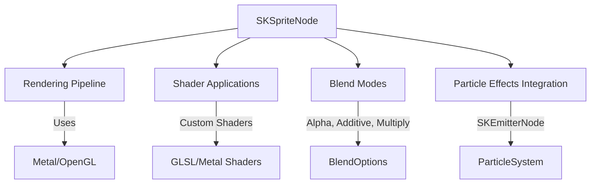
```mermaid
flowchart TD
    SKSpriteNode --> RenderingPipeline[Rendering Pipeline]
    SKSpriteNode --> Shaders[Shader Applications]
    SKSpriteNode --> BlendModes[Blend Modes]
    SKSpriteNode --> ParticleEffects[Particle Effects Integration]

    RenderingPipeline --> |Uses| GraphicsAPI[Metal/OpenGL]
    Shaders --> |Custom Shaders| ShaderLanguage[GLSL/Metal Shaders]
    BlendModes --> |Alpha, Additive, Multiply| BlendOptions
    ParticleEffects --> |SKEmitterNode| ParticleSystem
```

---

## **13. Summary and Best Practices**

### **a. Summary Diagram**
- **Purpose**: Provide a high-level overview of `SKSpriteNode`'s key characteristics and functionalities.
- **Diagram Type**: `graph LR`
- **Contents**:
  - **Versatile Initialization**
  - **Advanced Rendering Options**
  - **Physics Integration**
  - **Performance Optimizations**
  - **Seamless Integration with SpriteKit Components**

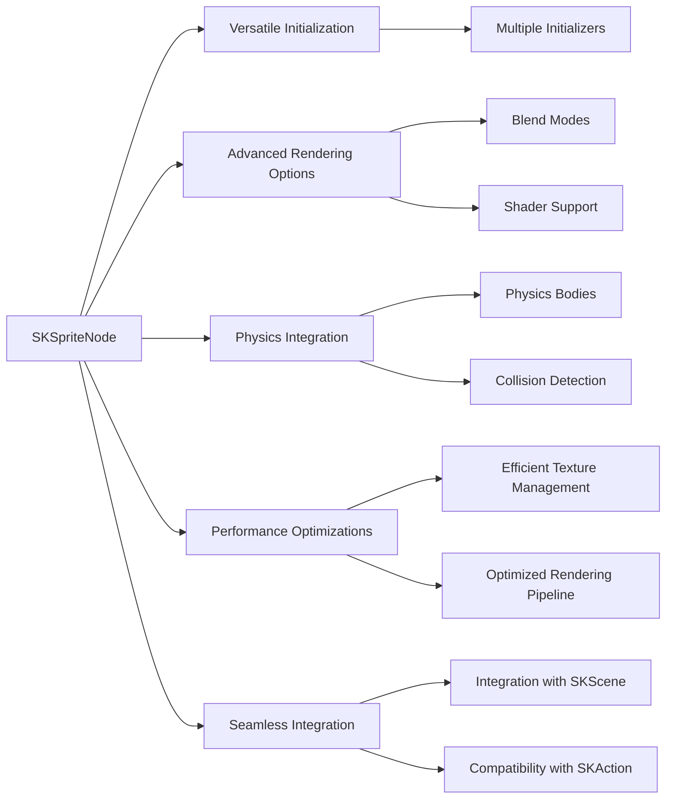
```mermaid
graph LR
    A[SKSpriteNode] --> B[Versatile Initialization]
    A --> C[Advanced Rendering Options]
    A --> D[Physics Integration]
    A --> E[Performance Optimizations]
    A --> F[Seamless Integration]

    B --> B1[Multiple Initializers]
    C --> C1[Blend Modes]
    C --> C2[Shader Support]
    D --> D1[Physics Bodies]
    D --> D2[Collision Detection]
    E --> E1[Efficient Texture Management]
    E --> E2[Optimized Rendering Pipeline]
    F --> F1[Integration with SKScene]
    F --> F2[Compatibility with SKAction]
```

### **b. Best Practices Diagram**
- **Purpose**: Highlight best practices when using `SKSpriteNode`.
- **Diagram Type**: `graph TD`
- **Contents**:
  - **Texture Optimization**
  - **Efficient Use of Actions**
  - **Proper Physics Configuration**
  - **Memory Management**
  - **Performance Profiling**

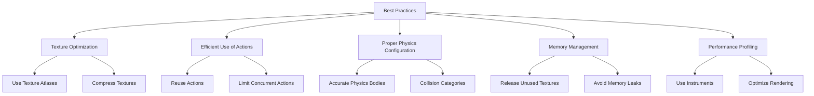
```mermaid
graph TD
    A[Best Practices] --> B[Texture Optimization]
    A --> C[Efficient Use of Actions]
    A --> D[Proper Physics Configuration]
    A --> E[Memory Management]
    A --> F[Performance Profiling]

    B --> B1[Use Texture Atlases]
    B --> B2[Compress Textures]
    C --> C1[Reuse Actions]
    C --> C2[Limit Concurrent Actions]
    D --> D1[Accurate Physics Bodies]
    D --> D2[Collision Categories]
    E --> E1[Release Unused Textures]
    E --> E2[Avoid Memory Leaks]
    F --> F1[Use Instruments]
    F --> F2[Optimize Rendering]
```

---

## **14. Additional Diagrams (Optional)**

Depending on the complexity and specific areas of the `SpriteKit` framework you wish to explore further, additional diagrams such as sequence diagrams for action execution, state diagrams for game states, or component diagrams for integrating with other game systems can be created. Below are several detailed diagrams to enhance your understanding and implementation of `SpriteKit` in various scenarios.

---

### **a. Sequence Diagram for Action Execution**

#### **Purpose**
Illustrate the sequence of interactions involved when executing an action on an `SKSpriteNode`. This diagram helps in understanding the flow from user input to action completion within a `SpriteKit` scene.

#### **Diagram Type**
`sequenceDiagram`

#### **Contents**
- **Participants**: User, SKScene, SKSpriteNode, SKAction, ActionQueue
- **Flow**:
  1. User triggers an action (e.g., touch event).
  2. SKScene receives the input and identifies the target `SKSpriteNode`.
  3. SKScene instructs the `SKSpriteNode` to run a specific `SKAction`.
  4. `SKSpriteNode` sends the action to the `ActionQueue`.
  5. `SKAction` is executed, modifying the node's properties.
  6. Upon completion, a callback is triggered.

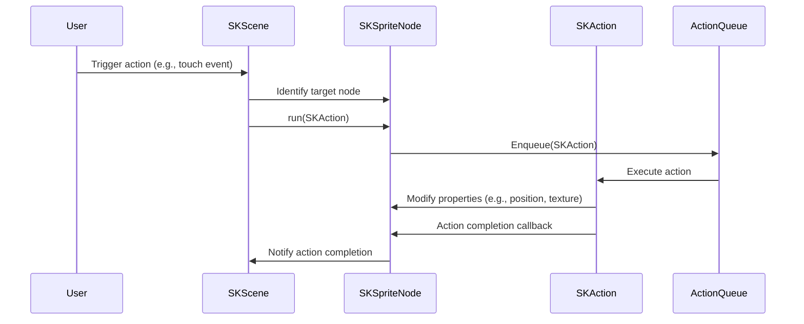
```mermaid
sequenceDiagram
    participant User
    participant SKScene
    participant SKSpriteNode
    participant SKAction
    participant ActionQueue

    User->>SKScene: Trigger action (e.g., touch event)
    SKScene->>SKSpriteNode: Identify target node
    SKScene->>SKSpriteNode: run(SKAction)
    SKSpriteNode->>ActionQueue: Enqueue(SKAction)
    ActionQueue->>SKAction: Execute action
    SKAction->>SKSpriteNode: Modify properties (e.g., position, texture)
    SKAction->>SKSpriteNode: Action completion callback
    SKSpriteNode->>SKScene: Notify action completion
```

---

### **b. State Diagram for Game States**

#### **Purpose**
Display the various states a game can transition through using `SpriteKit` and how these transitions occur. This diagram is crucial for managing game flow and ensuring a smooth user experience.

#### **Diagram Type**
`stateDiagram`

#### **Contents**
- **States**: Booting, Main Menu, Playing, Paused, Game Over, High Scores
- **Transitions**: Initialization, Start Game, Pause Game, Resume Game, End Game, View High Scores

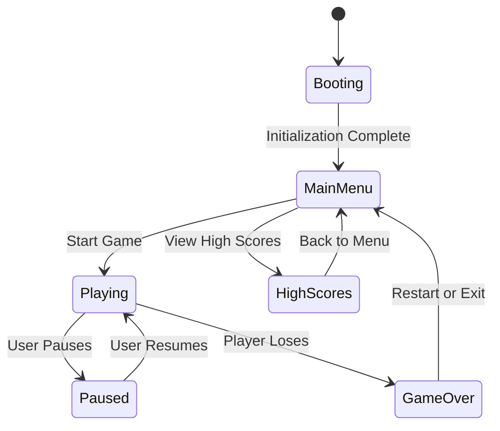
```mermaid
stateDiagram
    [*] --> Booting
    Booting --> MainMenu: Initialization Complete
    MainMenu --> Playing: Start Game
    Playing --> Paused: User Pauses
    Paused --> Playing: User Resumes
    Playing --> GameOver: Player Loses
    GameOver --> MainMenu: Restart or Exit
    MainMenu --> HighScores: View High Scores
    HighScores --> MainMenu: Back to Menu
```

---

### **c. Component Diagram for Integrating Game Systems**

#### **Purpose**
Show how `SpriteKit` integrates with other game systems such as physics, audio, input handling, and networking. This diagram aids in understanding the interdependencies and communication flow between different components.

#### **Diagram Type**
`graph TD`

#### **Contents**
- **Components**: SKScene, SKSpriteNode, Physics Engine, Audio Manager, Input Handler, Networking Module, UI Layer
- **Relationships**:
  - SKScene utilizes Physics Engine and Audio Manager.
  - Input Handler feeds user interactions to SKScene.
  - Networking Module communicates with external servers.
  - UI Layer interfaces with SKScene for displaying menus and HUD elements.

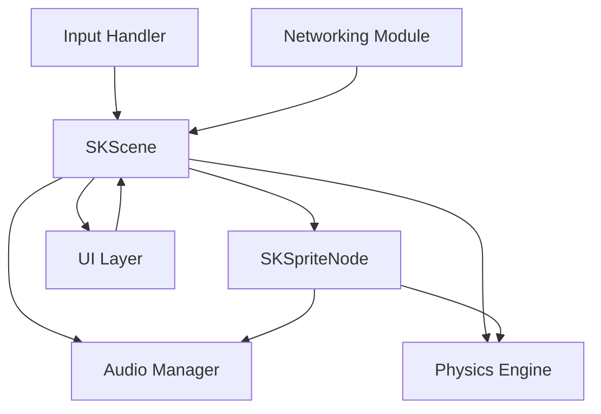
```mermaid
graph TD
    SKScene --> SKSpriteNode
    SKScene --> PhysicsEngine[Physics Engine]
    SKScene --> AudioManager[Audio Manager]
    SKScene --> UI_Layer[UI Layer]
    InputHandler[Input Handler] --> SKScene
    NetworkingModule[Networking Module] --> SKScene
    SKSpriteNode --> AudioManager
    SKSpriteNode --> PhysicsEngine
    UI_Layer --> SKScene
```

---

### **d. Rendering Pipeline Interaction Diagram**

#### **Purpose**
Detail how different components interact within the `SpriteKit` rendering pipeline. Understanding this flow is essential for optimizing rendering performance and implementing custom rendering techniques.

#### **Diagram Type**
`sequenceDiagram`

#### **Contents**
- **Components**: SKView, SKScene, SKSpriteNode, Rendering Engine, Graphics API (Metal/OpenGL), GPU
- **Flow**:
  1. SKScene contains multiple `SKSpriteNode` instances.
  2. SKView renders the SKScene using the Rendering Engine.
  3. Rendering Engine communicates with the Graphics API.
  4. Graphics API sends commands to the GPU for rendering.

```mermaid
sequenceDiagram
    participant SKView
    participant SKScene
    participant SKSpriteNode
    participant RenderingEngine
    participant GraphicsAPI
    participant GPU

    SKScene->>SKView: Present SKScene
    SKView->>RenderingEngine: Render SKScene
    RenderingEngine->>GraphicsAPI: Send rendering commands
    GraphicsAPI->>GPU: Execute rendering
    GPU-->>GraphicsAPI: Rendered frame
    GraphicsAPI-->>RenderingEngine: Frame rendered
    RenderingEngine-->>SKView: Display frame
```

---

### **e. Activity Diagram for Collision Handling**

#### **Purpose**
Depict the steps involved in handling collisions between `SKSpriteNode` objects. This diagram is useful for ensuring accurate and efficient collision detection and response mechanisms within the game.

#### **Diagram Type**
`flowchart TD`

#### **Contents**
- **Steps**:
  1. Detect collision between nodes.
  2. Determine collision response based on node types and properties.
  3. Execute response actions (e.g., bounce, destroy, score points).
  4. Update physics bodies and game state accordingly.

```mermaid
flowchart TD
    Start[Start Collision Handling] --> Detect[Detect Collision]
    Detect -- Collision Detected --> Determine[Determine Collision Response]
    Determine --> Execute[Execute Response Actions]
    Execute --> Update[Update Physics Bodies and Game State]
    Update --> End[End Collision Handling]
    Detect -- No Collision --> End
```

---

### **f. Class Interaction Diagram for Animation System**

#### **Purpose**
Illustrate how classes related to animations interact within `SpriteKit`. This diagram helps in designing a robust animation system by understanding class responsibilities and their relationships.

#### **Diagram Type**
`classDiagram`

#### **Contents**
- **Classes**: SKAction, SKSpriteNode, SKTexture, SKScene, AnimationController
- **Interactions**:
  - `AnimationController` creates and manages `SKAction` instances.
  - `SKAction` modifies properties of `SKSpriteNode`.
  - `SKSpriteNode` utilizes `SKTexture` for visual changes.
  - `SKScene` oversees the overall animation flow.

```mermaid
classDiagram
    class SKScene {
        +AnimationController animationController
        +startAnimations()
    }

    class AnimationController {
        +createActions()
        +runActions(SKSpriteNode)
    }

    class SKAction {
        +execute()
    }

    class SKSpriteNode {
        +run(SKAction)
        +texture: SKTexture
    }

    class SKTexture {
        +imageData
    }

    SKScene --> AnimationController
    AnimationController --> SKAction
    AnimationController --> SKSpriteNode
    SKAction --> SKSpriteNode
    SKSpriteNode --> SKTexture
```

---

### **g. Deployment Diagram for SpriteKit Games**

#### **Purpose**
Outline the deployment structure of a `SpriteKit` game application, including various layers and external services. This diagram provides a high-level view of the application's architecture and its dependencies.

#### **Diagram Type**
`graph TD`

#### **Contents**
- **Components**: User Device, Application Binary, SpriteKit Framework, Game Logic, External Services (Game Center, Analytics)
- **Interactions**:
  - Application Binary depends on SpriteKit Framework.
  - Game Logic interacts with SpriteKit for rendering and physics.
  - External Services communicate with the Application Binary for features like social integration and analytics.

```mermaid
graph TD
    UserDevice[User Device] --> AppBinary[Application Binary]
    AppBinary --> SpriteKit[SpriteKit Framework]
    AppBinary --> GameLogic[Game Logic]
    AppBinary --> ExternalServices[External Services]
    ExternalServices --> GameCenter[Game Center]
    ExternalServices --> Analytics[Analytics Service]
    GameLogic --> SpriteKit
```

---

### **h. Data Flow Diagram for Game Data Management**

#### **Purpose**
Show the flow of data within `SpriteKit` when managing game data, such as player scores, game state, and assets. This diagram helps in designing efficient data handling and storage strategies.

#### **Diagram Type**
`graph TD`

#### **Contents**
- **Entities**: User Input, Game State Manager, Data Storage, SKScene, SKSpriteNode, Renderer
- **Flow**:
  1. User Input influences the Game State Manager.
  2. Game State Manager updates and retrieves data from Data Storage.
  3. SKScene reflects the updated Game State.
  4. `SKSpriteNode` properties are modified based on the Game State.
  5. Renderer draws the updated nodes on the screen.

```mermaid
graph TD
    UserInput[User Input] --> GameStateManager[Game State Manager]
    GameStateManager --> DataStorage[Data Storage]
    GameStateManager --> SKScene
    SKScene --> SKSpriteNode
    SKSpriteNode --> Renderer[Renderer]
    DataStorage --> GameStateManager
```

---

### **i. Component Interaction Diagram for Multiplayer Integration**

#### **Purpose**
Detail how `SpriteKit` interacts with networking components to support multiplayer features. This diagram is essential for developing real-time multiplayer games using `SpriteKit`.

#### **Diagram Type**
`sequenceDiagram`

#### **Contents**
- **Participants**: Player, SKScene, MultiplayerManager, NetworkServer, SKSpriteNode
- **Flow**:
  1. Player performs an action that needs to be synchronized.
  2. SKScene notifies the MultiplayerManager.
  3. MultiplayerManager sends the action data to the NetworkServer.
  4. NetworkServer broadcasts the action to all connected players.
  5. MultiplayerManager receives the action data and updates the corresponding `SKSpriteNode`.

```mermaid
sequenceDiagram
    participant Player
    participant SKScene
    participant MultiplayerManager
    participant NetworkServer
    participant SKSpriteNode

    Player->>SKScene: Perform action (e.g., move)
    SKScene->>MultiplayerManager: Notify action
    MultiplayerManager->>NetworkServer: Send action data
    NetworkServer->>MultiplayerManager: Broadcast action to all players
    MultiplayerManager->>SKScene: Receive action data
    SKScene->>SKSpriteNode: Update sprite based on action
```

---

### **j. Use Case Diagram for Game Features**

#### **Purpose**
Illustrate the various use cases and interactions between actors (e.g., players, system) and the `SpriteKit` game features. This diagram aids in identifying and organizing game functionalities.

#### **Diagram Type**
`graph LR`

#### **Contents**
- **Actors**: Player, System
- **Use Cases**: Launch Game, Navigate Menus, Play Game, Pause Game, View Leaderboards, Receive Notifications
- **Interactions**:
  - Player interacts with the game by launching, navigating, and playing.
  - System manages game states, leaderboards, and notifications.

```mermaid
graph LR
    Player --> LaunchGame[Launch Game]
    Player --> NavigateMenus[Navigate Menus]
    Player --> PlayGame[Play Game]
    Player --> PauseGame[Pause Game]
    Player --> ViewLeaderboards[View Leaderboards]
    System --> ReceiveNotifications[Receive Notifications]
    System --> ManageLeaderboards[Manage Leaderboards]
    System --> HandleGameStates[Handle Game States]
```

---

### **k. Class Responsibility Collaboration (CRC) Card Diagram for Game Entities**

#### **Purpose**
Define the responsibilities and collaborations of key game entity classes within `SpriteKit`. This diagram helps in clarifying class roles and their interactions, ensuring a well-organized codebase.

#### **Diagram Type**
`classDiagram`

#### **Contents**
- **Classes**: Player, Enemy, Projectile, GameController
- **Responsibilities**:
  - **Player**: Handle user input, manage health, perform actions.
  - **Enemy**: Spawn behaviors, AI movements, collision responses.
  - **Projectile**: Movement, collision detection, damage application.
  - **GameController**: Manage game states, score, spawning entities.

```mermaid
classDiagram
    class Player {
        +handleInput()
        +move()
        +shoot()
        +takeDamage()
    }

    class Enemy {
        +spawn()
        +moveAI()
        +attack()
        +takeDamage()
    }

    class Projectile {
        +move()
        +detectCollision()
        +applyDamage()
    }

    class GameController {
        +startGame()
        +endGame()
        +updateScore()
        +spawnEnemies()
    }

    Player --|> GameController : Interacts with
    Enemy --|> GameController : Notifies
    Projectile --|> Enemy : Targets
    Projectile --|> Player : Targets
```

---

### **l. Deployment Pipeline Diagram for Continuous Integration**

#### **Purpose**
Outline the deployment pipeline for a `SpriteKit` game, integrating continuous integration and deployment (CI/CD) practices. This diagram is vital for automating testing, building, and deploying game updates efficiently.

#### **Diagram Type**
`graph LR`

#### **Contents**
- **Stages**: Code Repository, CI Server, Build Process, Automated Testing, Deployment
- **Tools**: GitHub, Jenkins, Xcode Server, Fastlane
- **Flow**:
  1. Developer pushes code to GitHub.
  2. Jenkins triggers the build process.
  3. Xcode Server compiles the game.
  4. Fastlane runs automated tests.
  5. Upon success, the build is deployed to TestFlight or the App Store.

```mermaid
graph LR
    CodeRepo["Code Repository (GitHub)"] --> CI["CI Server (Jenkins)"]
    CI --> Build["Build Process (Xcode Server)"]
    Build --> Tests["Automated Testing (Fastlane)"]
    Tests --> Deployment["Deployment (TestFlight/App Store)"]
    Deployment --> Users[End Users]
    CI -->|Build Success| Build
    Build -->|Tests Passing| Tests
    Tests -->|Deploy| Deployment
```

---

### **m. Component Interaction Diagram for Physics Integration**

#### **Purpose**
Show how `SpriteKit` integrates with its physics engine to simulate realistic physical interactions within the game environment. This diagram is essential for designing games with accurate physics-based behaviors.

#### **Diagram Type**
`graph TD`

#### **Contents**
- **Components**: SKPhysicsBody, SKPhysicsJoint, SKScene, SKSpriteNode, Physics Engine
- **Interactions**:
  - `SKSpriteNode` attaches `SKPhysicsBody` for physical properties.
  - `SKPhysicsJoint` connects multiple physics bodies.
  - `Physics Engine` calculates physics simulations and updates.

```mermaid
graph TD
    SKSpriteNode1[SKSpriteNode A] --> SKPhysicsBody1[SKPhysicsBody]
    SKSpriteNode2[SKSpriteNode B] --> SKPhysicsBody2[SKPhysicsBody]
    SKPhysicsJoint[Joints] --> SKPhysicsBody1
    SKPhysicsJoint --> SKPhysicsBody2
    SKScene --> PhysicsEngine[Physics Engine]
    PhysicsEngine --> SKPhysicsBody1
    PhysicsEngine --> SKPhysicsBody2
    PhysicsEngine --> SKPhysicsJoint
```

---

### **n. Interaction Flow Diagram for User Input Handling**

#### **Purpose**
Illustrate how user inputs (touches, gestures) are handled and translated into actions within a `SpriteKit` game. This diagram is useful for designing intuitive and responsive user interactions.

#### **Diagram Type**
`flowchart TD`

#### **Contents**
- **Steps**:
  1. User performs input gesture (e.g., tap, swipe).
  2. Input Handler detects and interprets the gesture.
  3. Input Handler communicates with SKScene.
  4. SKScene updates `SKSpriteNode` based on the input.
  5. Renderer reflects the changes visually.

```mermaid
flowchart TD
    UserInput["User Input (Tap/Swipe)"] --> InputHandler[Input Handler]
    InputHandler --> SKScene
    SKScene --> SKSpriteNode
    SKSpriteNode --> Renderer[Renderer]
    Renderer --> UserFeedback[Visual Feedback]
```

---

### **o. Data Persistence Workflow Diagram**

#### **Purpose**
Demonstrate the workflow for saving and loading game data using `SpriteKit`. This diagram ensures that game progress and settings are reliably stored and retrieved.

#### **Diagram Type**
`flowchart LR`

#### **Contents**
- **Steps**:
  1. Game State is updated during gameplay.
  2. GameController triggers save operation.
  3. Data is serialized and stored using UserDefaults or Core Data.
  4. On game launch, GameController retrieves and deserializes data.
  5. SKScene initializes with loaded game state.

```mermaid
flowchart LR
    GameState[Game State Updated] --> SaveTrigger[GameController Triggers Save]
    SaveTrigger --> Serialize[Serialize Data]
    Serialize --> Storage["Store Data (UserDefaults/Core Data)"]
    Launch[Game Launch] --> RetrieveTrigger[GameController Retrieves Data]
    RetrieveTrigger --> Deserialize[Deserialize Data]
    Deserialize --> Initialize[SKScene Initializes Game State]
```

---

### **p. Error Handling Flowchart for SpriteKit Applications**

#### **Purpose**
Outline the process for handling errors and exceptions within a `SpriteKit` application. This diagram is critical for building robust games that can gracefully manage unexpected issues.

#### **Diagram Type**
`flowchart TD`

#### **Contents**
- **Steps**:
  1. Error Occurs (e.g., failed asset load).
  2. Error Detected by Error Handler.
  3. Log Error for debugging.
  4. Notify User of the Issue.
  5. Attempt Recovery or Safely Terminate.

```mermaid
flowchart TD
    Error[Error Occurs] --> Detect[Detect by Error Handler]
    Detect --> Log[Log Error Details]
    Log --> Notify[Notify User]
    Notify --> Decide{Can Recovery?}
    Decide -- Yes --> Recover[Attempt Recovery]
    Decide -- No --> Terminate[Safely Terminate]
```

---

### **q. Feature Toggle Mechanism Diagram**

#### **Purpose**
Visualize how feature toggles are implemented within a `SpriteKit` game to enable or disable features dynamically. This is useful for A/B testing, gradual rollouts, or managing feature availability.

#### **Diagram Type**
`graph TD`

#### **Contents**
- **Components**: Feature Toggle Manager, SKScene, SKSpriteNode, User Settings, Remote Config
- **Flow**:
  1. Feature Toggle Manager retrieves feature flags from Remote Config or User Settings.
  2. SKScene queries Feature Toggle Manager before initializing features.
  3. `SKSpriteNode` behaviors adjusted based on feature flags.

```mermaid
graph TD
    FeatureToggleManager[Feature Toggle Manager] --> RemoteConfig[Remote Config]
    FeatureToggleManager --> UserSettings[User Settings]
    SKScene --> FeatureToggleManager
    SKSpriteNode --> FeatureToggleManager
    FeatureToggleManager -->|Enable/Disable| SKSpriteNode
    FeatureToggleManager -->|Enable/Disable| SKScene
```

---

### **r. Localization Process Diagram**

#### **Purpose**
Map out the process of localizing a `SpriteKit` game to support multiple languages. This diagram ensures that all textual elements are properly translated and displayed based on user preferences.

#### **Diagram Type**
`flowchart LR`

#### **Contents**
- **Steps**:
  1. Identify localizable strings within SKScene and SKSpriteNode.
  2. Extract strings into Localization Files (e.g., `.strings`).
  3. Provide translations for each supported language.
  4. Load appropriate localization file based on user settings.
  5. Display localized strings within the game.

```mermaid
flowchart LR
    IdentifyStrings[Identify Localizable Strings] --> Extract[Extract into Localization Files]
    Extract --> Translate[Provide Translations]
    Translate --> Load[Load Localization Based on User Settings]
    Load --> Display[Display Localized Strings in SKScene & SKSpriteNode]
```

---

### **s. Memory Management Workflow Diagram**

#### **Purpose**
Depict how memory is managed within a `SpriteKit` game to prevent leaks and optimize performance. This diagram is essential for maintaining a smooth and efficient gaming experience.

#### **Diagram Type**
`flowchart TD`

#### **Contents**
- **Steps**:
  1. Initialize `SKSpriteNode` and related resources.
  2. Reference Counting ensures objects are retained properly.
  3. Detect and release unused textures and actions.
  4. Use Instruments to profile and identify memory issues.
  5. Optimize by refactoring or using weak references where necessary.

```mermaid
flowchart TD
    Initialize[Initialize SKSpriteNode & Resources] --> Retain[Reference Counting]
    Retain --> Use[Use in SKScene]
    Use --> Release[Release Unused Textures & Actions]
    Release --> Detect[Detect Issues with Instruments]
    Detect --> Optimize[Refactor or Use Weak References]
    Optimize --> Retain
```

---

### **t. Accessibility Features Integration Diagram**

#### **Purpose**
Show how accessibility features are integrated into a `SpriteKit` game to make it usable for players with disabilities. This ensures compliance with accessibility standards and broadens the game's audience.

#### **Diagram Type**
`graph LR`

#### **Contents**
- **Components**: Accessibility Manager, SKScene, SKSpriteNode, VoiceOver, Dynamic Type
- **Interactions**:
  - Accessibility Manager configures accessibility labels and hints.
  - `SKSpriteNode` elements are annotated for VoiceOver.
  - Dynamic Type adjusts text sizes based on user preferences.

```mermaid
graph LR
    AccessibilityManager[Accessibility Manager] --> VoiceOver[VoiceOver]
    AccessibilityManager --> DynamicType[Dynamic Type]
    SKScene --> AccessibilityManager
    SKSpriteNode --> AccessibilityManager
    AccessibilityManager -->|Configure Labels| SKSpriteNode
    AccessibilityManager -->|Adjust Text Sizes| SKScene
```

---

### **u. Modular Architecture Diagram**

#### **Purpose**
Illustrate the modular architecture of a `SpriteKit` game, highlighting how different modules such as Gameplay, UI, Audio, and Networking are organized. This promotes code reusability and maintainability.

#### **Diagram Type**
`graph LR`

#### **Contents**
- **Modules**: Gameplay, UI, Audio, Networking, Data Persistence
- **Interactions**:
  - Gameplay module interacts with UI for displaying game information.
  - Audio module manages sound effects and music.
  - Networking module handles multiplayer and data synchronization.
  - Data Persistence module saves and loads game data.

```mermaid
graph LR
    Gameplay[Gameplay Module] --> UI[UI Module]
    Gameplay --> Audio[Audio Module]
    Gameplay --> Networking[Networking Module]
    Gameplay --> DataPersistence[Data Persistence Module]
    UI --> Audio
    Networking --> DataPersistence
    DataPersistence -->|Save/Load| Gameplay
```

---

### **v. Performance Optimization Workflow Diagram**

#### **Purpose**
Outline the workflow for optimizing performance in a `SpriteKit` game. This diagram is crucial for identifying bottlenecks and implementing strategies to enhance game performance.

#### **Diagram Type**
`flowchart TD`

#### **Contents**
- **Steps**:
  1. Identify Performance Metrics (FPS, Memory Usage).
  2. Profile Game Using Instruments (Time Profiler, Memory Leaks).
  3. Analyze Profile Results to Identify Bottlenecks.
  4. Implement Optimization Techniques (Texture Compression, Efficient Coding Practices).
  5. Re-test to Ensure Improvements.
  6. Iterate as Necessary.

```mermaid
flowchart TD
    IdentifyMetrics[Identify Performance Metrics] --> Profile[Profile Using Instruments]
    Profile --> Analyze[Analyze Profile Results]
    Analyze --> Optimize[Implement Optimization Techniques]
    Optimize --> ReTest[Re-test Performance]
    ReTest -->|Improvement| Iterate[Iterate if Necessary]
    ReTest -->|No Improvement| Analyze
```

---

### **w. Integration Diagram with External Libraries**

#### **Purpose**
Demonstrate how external libraries (e.g., physics engines, analytics SDKs) are integrated into a `SpriteKit` project. This ensures seamless incorporation of third-party tools to extend game functionalities.

#### **Diagram Type**
`graph LR`

#### **Contents**
- **Components**: SKScene, External Libraries (Physics Engine, Analytics SDK), Game Logic, Data Flow
- **Interactions**:
  - SKScene utilizes Physics Engine for advanced simulations.
  - Analytics SDK collects and sends game metrics.
  - Game Logic interacts with both external libraries to perform complex tasks.

```mermaid
graph LR
    SKScene --> GameLogic[Game Logic]
    GameLogic --> PhysicsEngine[External Physics Engine]
    GameLogic --> AnalyticsSDK[Analytics SDK]
    PhysicsEngine --> SKSpriteNode
    AnalyticsSDK --> DataStorage[Data Storage]
    SKSpriteNode --> PhysicsEngine
```

---

### **x. User Interface (UI) Flow Diagram**

#### **Purpose**
Map out the flow of the user interface within a `SpriteKit` game, detailing how users navigate through different UI screens and interact with game elements. This diagram aids in designing intuitive and user-friendly interfaces.

#### **Diagram Type**
`flowchart LR`

#### **Contents**
- **Screens**: Main Menu, Settings, Gameplay, Pause Menu, Game Over, Leaderboards
- **Flow**:
  1. User starts at the Main Menu.
  2. From Main Menu, user can go to Settings, Start Gameplay, or View Leaderboards.
  3. During Gameplay, user can pause the game, leading to the Pause Menu.
  4. Upon game completion, transition to Game Over screen with options to restart or exit.

```mermaid
flowchart LR
    MainMenu[Main Menu] -->|Start Game| Gameplay[Gameplay]
    MainMenu -->|Settings| Settings[Settings]
    MainMenu -->|Leaderboards| Leaderboards[Leaderboards]
    Gameplay -->|Pause| PauseMenu[Pause Menu]
    PauseMenu -->|Resume| Gameplay
    PauseMenu -->|Quit| MainMenu
    Gameplay -->|Game Over| GameOver[Game Over]
    GameOver -->|Restart| Gameplay
    GameOver -->|Exit| MainMenu
```

---

### **y. Resource Management Diagram**

#### **Purpose**
Illustrate how resources such as textures, sounds, and fonts are managed within a `SpriteKit` game. Efficient resource management is key to optimizing performance and reducing load times.

#### **Diagram Type**
`graph TD`

#### **Contents**
- **Resources**: Textures, Sounds, Fonts, Assets
- **Management Components**: Resource Loader, Cache Manager, Asset Catalog
- **Flow**:
  1. Resource Loader fetches resources from Asset Catalog.
  2. Cache Manager stores frequently used resources in memory.
  3. SKScene requests resources from Cache Manager as needed.

```mermaid
graph TD
    ResourceLoader[Resource Loader] --> AssetCatalog[Asset Catalog]
    CacheManager[Cache Manager] --> ResourceLoader
    SKScene --> CacheManager
    SKSpriteNode --> CacheManager
    CacheManager -->|Store/Retrieve| Textures[Textures]
    CacheManager -->|Store/Retrieve| Sounds[Sounds]
    CacheManager -->|Store/Retrieve| Fonts[Fonts]
```

---

### **z. Logging and Monitoring Workflow Diagram**

#### **Purpose**
Depict the process of logging and monitoring within a `SpriteKit` game to track performance, user behavior, and errors. This ensures that the game remains stable and provides insights for future improvements.

#### **Diagram Type**
`flowchart LR`

#### **Contents**
- **Components**: Game Logic, Logger, Monitoring Tools, Data Storage, Developer Dashboard
- **Flow**:
  1. Game Logic generates logs for events, errors, and performance metrics.
  2. Logger captures and formats these logs.
  3. Monitoring Tools aggregate and analyze the logs.
  4. Data is stored for historical analysis.
  5. Developers access the Developer Dashboard to review reports and insights.

```mermaid
graph LR
    GameLogic[Game Logic] --> Logger[Logger]
    Logger --> MonitoringTools[Monitoring Tools]
    MonitoringTools --> DataStorage[Data Storage]
    MonitoringTools --> DeveloperDashboard[Developer Dashboard]
    DeveloperDashboard --> Developers[Developers]
```

---

### **aa. User Progression Flowchart**

#### **Purpose**
Show the flow of user progression within a `SpriteKit` game, including levels, achievements, and rewards. This diagram helps in designing engaging and motivating game progression systems.

#### **Diagram Type**
`flowchart TD`

#### **Contents**
- **Stages**: Level 1, Level 2, Achievement Unlock, Reward Collection, Level Completion
- **Flow**:
  1. User completes Level 1 and unlocks Achievement A.
  2. Achievement A grants Reward R1.
  3. User progresses to Level 2, which may have increased difficulty and new achievements.
  4. The cycle continues with more achievements and rewards.

```mermaid
flowchart TD
    Level1[Level 1] -->|Complete Level| AchievementA[Unlock Achievement A]
    AchievementA --> RewardR1[Grant Reward R1]
    RewardR1 --> Level2[Level 2]
    Level2 -->|Complete Level| AchievementB[Unlock Achievement B]
    AchievementB --> RewardR2[Grant Reward R2]
    RewardR2 --> Level3[Level 3]
    %% Continue as needed
```

---

### **bb. Feature Development Lifecycle Diagram**

#### **Purpose**
Outline the lifecycle of feature development within a `SpriteKit` game, from ideation to deployment. This ensures a structured approach to adding new functionalities and maintaining existing ones.

#### **Diagram Type**
`flowchart LR`

#### **Contents**
- **Stages**: Idea Generation, Design, Implementation, Testing, Deployment, Feedback
- **Flow**:
  1. Generate feature ideas based on user feedback and market research.
  2. Design the feature's architecture and integration points.
  3. Implement the feature within the codebase.
  4. Test the feature for bugs and performance issues.
  5. Deploy the feature through updates.
  6. Collect feedback for future improvements.

```mermaid
flowchart LR
    Idea[Idea Generation] --> Design[Design]
    Design --> Implementation[Implementation]
    Implementation --> Testing[Testing]
    Testing --> Deployment[Deployment]
    Deployment --> Feedback[Feedback]
    Feedback --> Idea
```

---

### **cc. Continuous Deployment Pipeline Diagram**

#### **Purpose**
Visualize the continuous deployment pipeline specifically tailored for `SpriteKit` games. This ensures that updates and new features are consistently and reliably delivered to users.

#### **Diagram Type**
`graph TD`

#### **Contents**
- **Stages**: Code Commit, Automated Build, Automated Tests, Code Review, Approval, Deployment
- **Tools**: GitHub Actions, Jenkins, Fastlane, TestFlight
- **Flow**:
  1. Developer commits code to the repository.
  2. GitHub Actions triggers the automated build process.
  3. Jenkins runs automated tests to ensure code quality.
  4. Code undergoes peer review for additional scrutiny.
  5. Upon approval, Fastlane handles deployment to TestFlight or the App Store.

```mermaid
graph TD
    CodeCommit[Code Commit] --> CI["Automated Build (GitHub Actions)"]
    CI --> AutomatedTests["Automated Tests (Jenkins)"]
    AutomatedTests --> CodeReview[Code Review]
    CodeReview --> Approval[Approval]
    Approval --> Deployment["Deployment (Fastlane to TestFlight/App Store)"]
    Deployment --> Users[End Users]
```

---

### **dd. Feature Flags Implementation Diagram**

#### **Purpose**
Demonstrate how feature flags are implemented within a `SpriteKit` game to control the activation of new features without deploying new code. This allows for dynamic feature management and A/B testing.

#### **Diagram Type**
`graph LR`

#### **Contents**
- **Components**: Feature Flag Manager, SKScene, SKSpriteNode, Remote Config, User Settings
- **Flow**:
  1. Feature Flag Manager retrieves feature flags from Remote Config or User Settings.
  2. SKScene and `SKSpriteNode` check Feature Flag Manager before enabling features.
  3. Features can be toggled on or off based on flag values.

```mermaid
graph LR
    FeatureFlagManager[Feature Flag Manager] --> RemoteConfig[Remote Config]
    FeatureFlagManager --> UserSettings[User Settings]
    SKScene --> FeatureFlagManager
    SKSpriteNode --> FeatureFlagManager
    FeatureFlagManager -->|Enable/Disable| SKSpriteNode
    FeatureFlagManager -->|Enable/Disable| SKScene
```

---
