# Store Kit 2

 Below is a comprehensive and organized set of Mermaid diagrams for the `StoreKit 2` framework. These diagrams aim to encapsulate the core aspects, functionalities, and relationships within the `StoreKit 2` framework, facilitating a deeper understanding of its architecture and usage.

---

## **1. Class Structure and Hierarchy**

### **a. Core Class Diagram**
- **Purpose**: Illustrate the primary structure of `StoreKit 2`, including its key classes, properties, methods, and enumerations.
- **Diagram Type**: `classDiagram`
- **Contents**:
  - **Classes**: `Product`, `Transaction`, `CustomerInfo`, `Storefront`, etc.
  - **Enumerations**: `TransactionState`, `StorefrontRegion`.
  - **Relationships**: Inheritance and associations between classes.

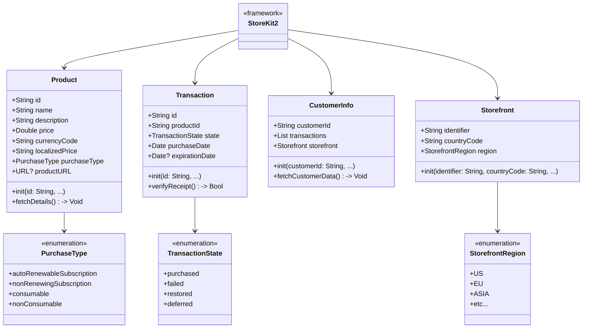

---

## **2. Initialization and Setup**

### **a. Initialization Methods Diagram**
- **Purpose**: Break down the various ways to initialize and configure `StoreKit 2`.
- **Diagram Type**: `flowchart LR`
- **Contents**:
  - **Configuration**: Setting up the environment.
  - **Product Retrieval**: Fetching available products.
  - **Transaction Handling**: Managing purchases and transactions.
  - **Customer Information**: Accessing customer-specific data.

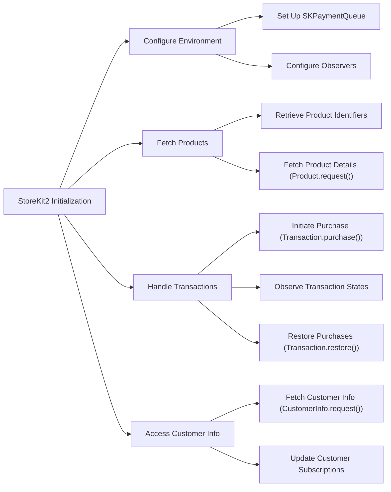

---

## **3. Properties Breakdown**

### **a. Key Properties Diagram**
- **Purpose**: Detail the main properties available within `StoreKit 2` classes.
- **Diagram Type**: `graph LR`
- **Contents**:
  - **Product Attributes**: `id`, `name`, `description`, `price`, `currencyCode`, etc.
  - **Transaction Attributes**: `id`, `productId`, `state`, `purchaseDate`, `expirationDate`, etc.
  - **Customer Attributes**: `customerId`, `transactions`, `storefront`, etc.
  - **Storefront Attributes**: `identifier`, `countryCode`, `region`, etc.

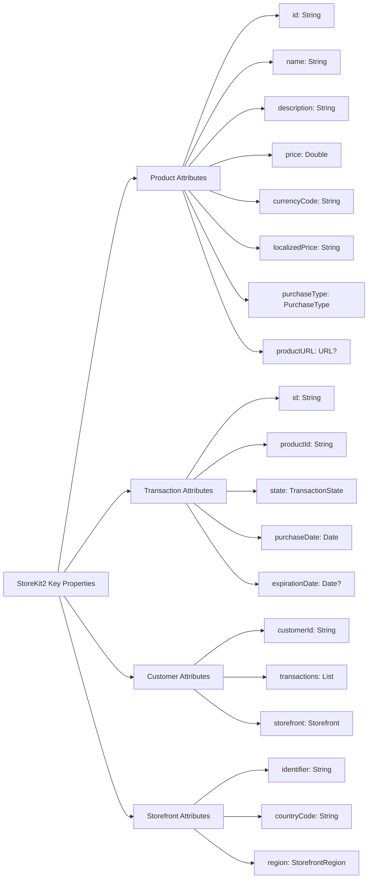

---

## **4. Methods Grouped by Functionality**

### **a. Product Management Methods**
- **Purpose**: Categorize methods related to fetching and managing products.
- **Diagram Type**: `flowchart TD`
- **Contents**:
  - **Fetching Products**: `Product.request()`
  - **Filtering Products**: `Product.filter()`
  - **Subscribing to Updates**: `Product.subscribe()`

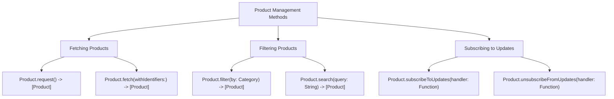

### **b. Transaction Handling Methods**
- **Purpose**: Categorize methods based on their roles in managing transactions.
- **Diagram Type**: `flowchart TD`
- **Contents**:
  - **Initiating Purchases**: `Transaction.purchase()`
  - **Restoring Purchases**: `Transaction.restore()`
  - **Verifying Receipts**: `Transaction.verify()`
  - **Observing Transactions**: `Transaction.observe()`

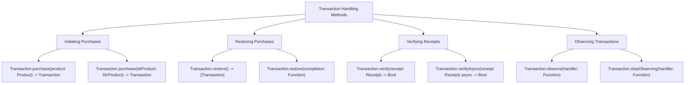

### **c. Customer Information Methods**
- **Purpose**: Categorize methods related to accessing and updating customer information.
- **Diagram Type**: `flowchart TD`
- **Contents**:
  - **Fetching Customer Data**: `CustomerInfo.request()`
  - **Updating Subscriptions**: `CustomerInfo.updateSubscription()`
  - **Managing Entitlements**: `CustomerInfo.manageEntitlements()`

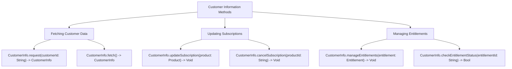

---

## **5. Enumerations and Configurations**

### **a. Enumerations Diagram**
- **Purpose**: Highlight the enums used within `StoreKit 2` and their possible values.
- **Diagram Type**: `classDiagram`
- **Contents**:
  - **TransactionState**
  - **PurchaseType**
  - **StorefrontRegion**
  - **SubscriptionStatus**

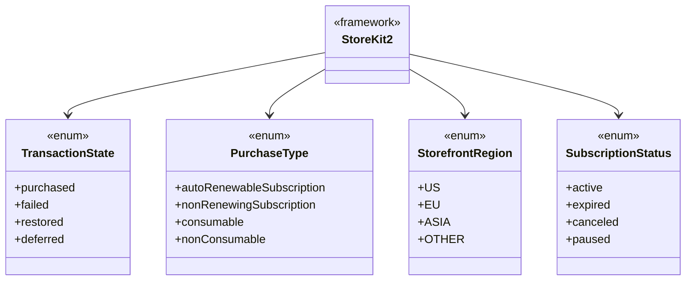

### **b. Configuration Classes Diagram**
- **Purpose**: Show the relationship between `StoreKit 2` and its configuration classes.
- **Diagram Type**: `classDiagram`
- **Contents**:
  - **StoreKitConfiguration**
  - **ReceiptVerificationConfiguration**

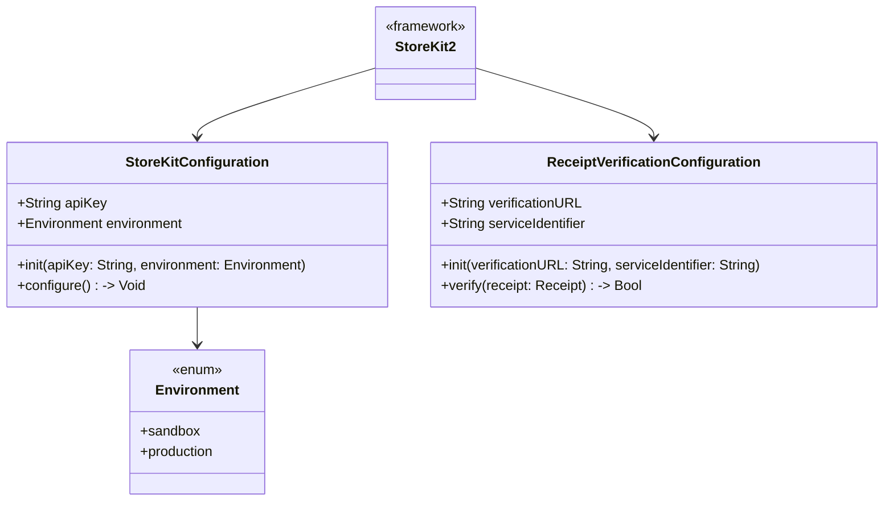

---

## **6. Protocol Conformances**

### **a. Protocols Diagram**
- **Purpose**: Display the protocols that key `StoreKit 2` classes conform to and their impact.
- **Diagram Type**: `classDiagram`
- **Contents**:
  - **SKProductRequestDelegate**
  - **SKPaymentTransactionObserver**
  - **ReceiptVerifier**
  - **StorefrontDelegate**
  - **TransactionObserver**

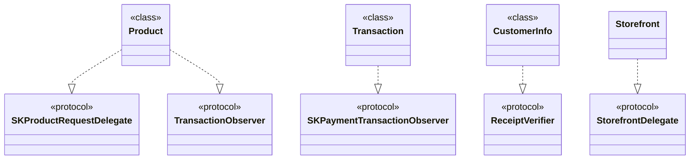

---

## **7. Relationships with Other Classes**

### **a. Related Classes Diagram**
- **Purpose**: Illustrate how `StoreKit 2` interacts with other UIKit classes and frameworks.
- **Diagram Type**: `flowchart TD`
- **Contents**:
  - **UIViewController**: Presenting purchase interfaces.
  - **UITableView**: Displaying product lists.
  - **Core Data**: Storing transaction records.
  - **Combine**: Handling asynchronous events.
  - **SwiftUI**: Integrating purchase flows in SwiftUI views.

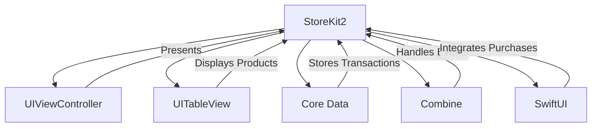

---

## **8. Extensions and Additional Functionalities**

### **a. StoreKit 2 Extensions Diagram**
- **Purpose**: Showcase the additional functionalities provided through extensions.
- **Diagram Type**: `classDiagram`
- **Contents**:
  - **Product Extensions**
  - **Transaction Extensions**
  - **CustomerInfo Extensions**
  - **Storefront Extensions**

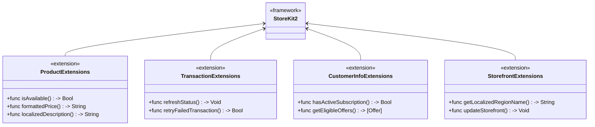

### **b. Extensions Functionalities Flowchart**
- **Purpose**: Detail specific extended methods and their purposes.
- **Diagram Type**: `flowchart LR`
- **Contents**:
  - **Product Enhancements**
  - **Transaction Enhancements**
  - **Customer Information Enhancements**
  - **Storefront Enhancements**

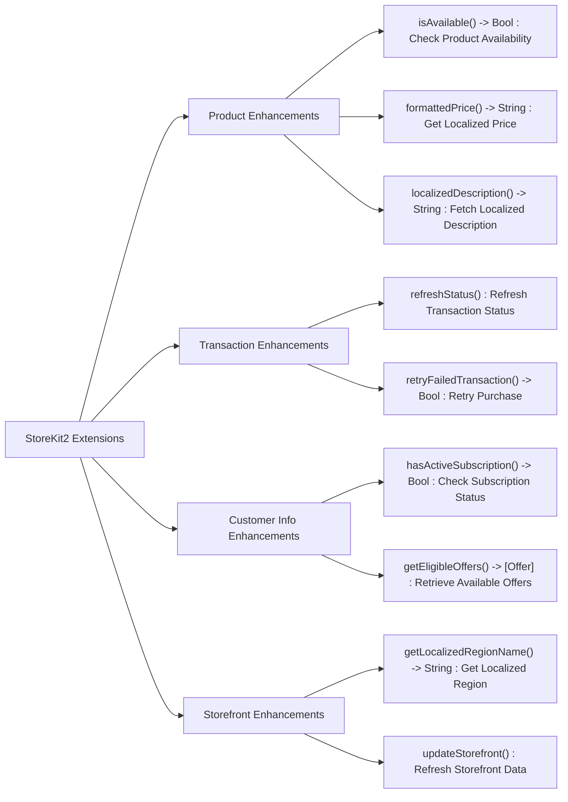

---

## **9. Lifecycle and Use Cases**

### **a. Lifecycle Flowchart**
- **Purpose**: Demonstrate the typical lifecycle of a transaction within an application using `StoreKit 2`.
- **Diagram Type**: `flowchart TD`
- **Contents**:
  - **Initialization**
  - **Product Discovery**
  - **Purchase Initiation**
  - **Transaction Processing**
  - **Receipt Verification**
  - **Content Delivery**
  - **Transaction Completion**

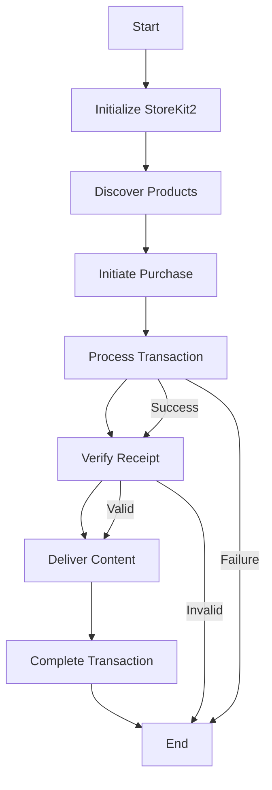

### **b. Common Use Cases Diagram**
- **Purpose**: Outline the typical scenarios where `StoreKit 2` is utilized.
- **Diagram Type**: `flowchart TD`
- **Contents**:
  - **In-App Purchases**
  - **Subscriptions Management**
  - **Promotional Offers**
  - **Family Sharing**
  - **Restoring Purchases**
  - **Receipt Verification**

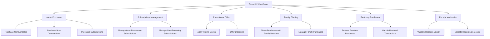

---

## **10. Feature Availability Timeline**

### **a. Feature Availability Gantt Chart**
- **Purpose**: Show when various `StoreKit 2` features were introduced across iOS versions.
- **Diagram Type**: `gantt`
- **Contents**:
  - **iOS Versions**: 14.0, 15.0, 16.0, 17.0
  - **Features Introduced**: Enhanced Subscriptions, Promotional Offers, Storefront Customization, etc.

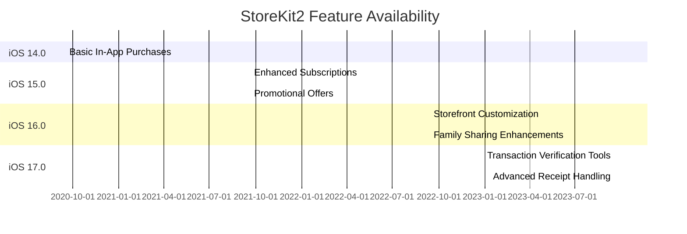

---

## **11. Data Handling and Formats**

### **a. Transaction Data Flow Diagram**
- **Purpose**: Explain how `StoreKit 2` handles different transaction data formats.
- **Diagram Type**: `graph LR`
- **Contents**:
  - **JSON Receipts**
  - **Encrypted Data**
  - **Verification Responses**

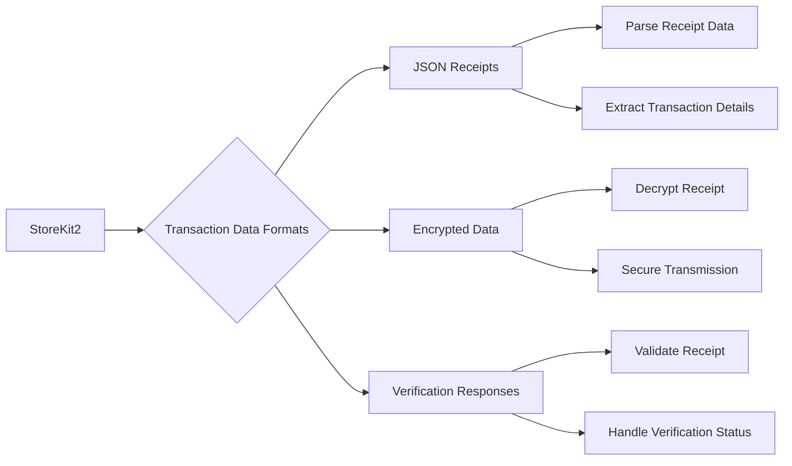

### **b. Data Storage and Retrieval Diagram**
- **Purpose**: Illustrate how transaction and customer data are stored and retrieved.
- **Diagram Type**: `flowchart LR`
- **Contents**:
  - **Local Storage**: Core Data, UserDefaults.
  - **Remote Storage**: Server Databases.
  - **Data Retrieval**: Fetching stored data for app usage.

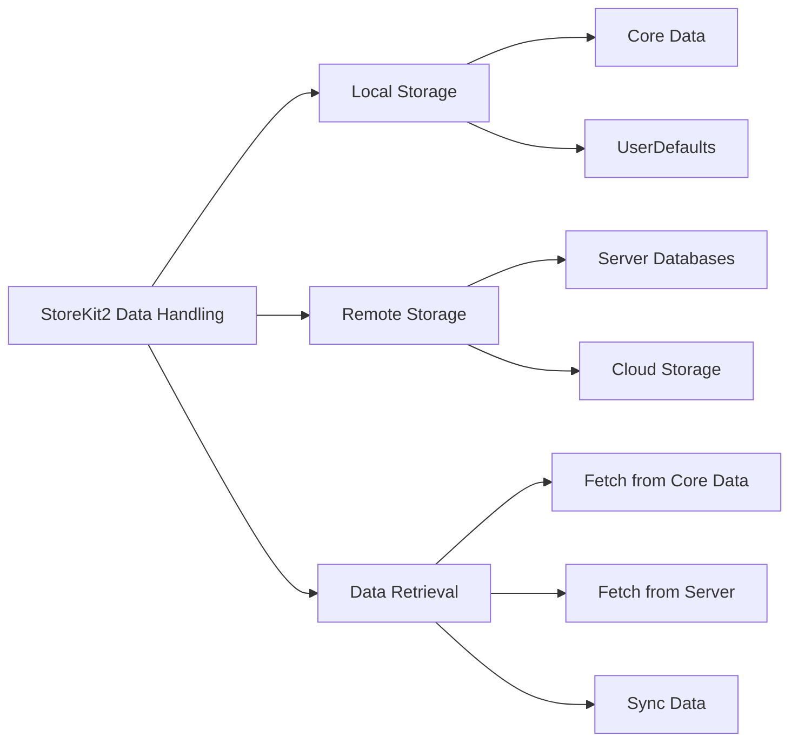

---

## **12. Integration with Other Frameworks**

### **a. Integration Diagram**
- **Purpose**: Show how `StoreKit 2` integrates with other iOS frameworks and services.
- **Diagram Type**: `flowchart TD`
- **Contents**:
  - **UIKit**: UI Components for Purchase Flows.
  - **SwiftUI**: SwiftUI Views for Purchases.
  - **Combine**: Reactive Programming.
  - **Core Data**: Data Persistence.
  - **CloudKit**: Cloud-Based Data Synchronization.
  - **App Store Connect**: Backend Services.

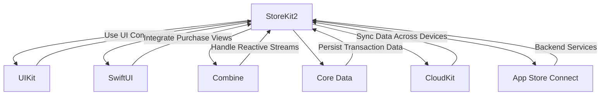

---

## **13. Summary and Best Practices**

### **a. Summary Diagram**
- **Purpose**: Provide a high-level overview of `StoreKit 2`'s key characteristics and functionalities.
- **Diagram Type**: `graph LR`
- **Contents**:
  - **Comprehensive Purchase Management**
  - **Robust Transaction Handling**
  - **Seamless UI Integration**
  - **Enhanced Security Features**
  - **Scalable Data Handling**
  - **Future-Proof Framework**

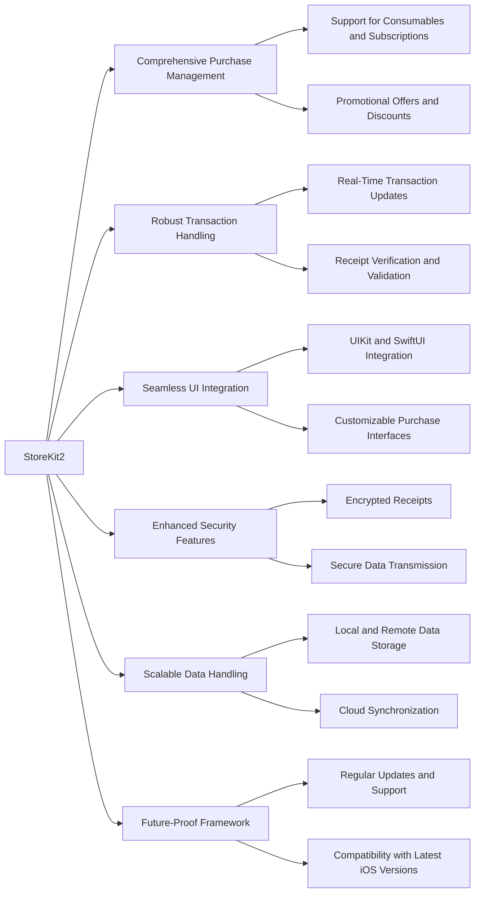

### **b. Best Practices Diagram**
- **Purpose**: Highlight best practices for effectively utilizing `StoreKit 2`.
- **Diagram Type**: `flowchart TD`
- **Contents**:
  - **Secure Receipt Handling**
  - **Efficient Data Management**
  - **Responsive UI Design**
  - **Comprehensive Testing**
  - **User Experience Optimization**
  - **Compliance with App Store Guidelines**

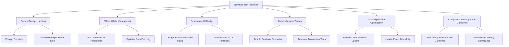

---

## **14. Error Handling and Debugging**

### **a. Error Handling Flowchart**
- **Purpose**: Illustrate effective strategies for handling errors within `StoreKit 2`.
- **Diagram Type**: `flowchart TD`
- **Contents**:
  - **Error Detection**
  - **Error Classification**
  - **Error Resolution**
  - **User Feedback**

```mermaid
flowchart TD
    A[Error Handling in StoreKit2] --> B[Error Detection]
    A --> C[Error Classification]
    A --> D[Error Resolution]
    A --> E[User Feedback]

    B --> B1["Monitor Transaction States"]
    B --> B2["Catch Exceptions and Failures"]

    C --> C1["Network Errors"]
    C --> C2["Payment Processing Errors"]
    C --> C3["Receipt Validation Errors"]
    C --> C4["Server-Side Errors"]

    D --> D1["Retry Mechanisms for Transient Errors"]
    D --> D2["Provide Alternative Purchase Options"]
    D --> D3["Notify Backend for Critical Failures"]

    E --> E1["Display Clear Error Messages"]
    E --> E2["Guide Users Through Recovery Steps"]
    E --> E3["Log Errors for Analytics"]
```

### **b. Debugging Tools and Techniques Diagram**
- **Purpose**: Detail the tools and techniques for debugging issues related to `StoreKit 2`.
- **Diagram Type**: `flowchart LR`
- **Contents**:
  - **Xcode Debugger**
  - **Console Logging**
  - **Transaction Observers**
  - **Receipt Verification Logs**
  - **Server Logs**

```mermaid
flowchart LR
    A[StoreKit2 Debugging] --> B[Xcode Debugger]
    A --> C[Console Logging]
    A --> D[Transaction Observers]
    A --> E[Receipt Verification Logs]
    A --> F[Server Logs]

    B --> B1["Set Breakpoints in Purchase Flow"]
    B --> B2["Inspect Variable States"]

    C --> C1["Log Purchase Initiations"]
    C --> C2["Log Transaction States"]

    D --> D1["Observe Real-Time Transactions"]
    D --> D2["Handle Transaction Callbacks"]

    E --> E1["Log Receipt Validation Results"]
    E --> E2["Track Verification Errors"]

    F --> F1["Monitor Server-Side Validations"]
    F --> F2["Analyze Server Response Times"]
```

---

## **15. Security Considerations**

### **a. Security Best Practices Diagram**
- **Purpose**: Outline the best practices for ensuring security within `StoreKit 2` implementations.
- **Diagram Type**: `flowchart TD`
- **Contents**:
  - **Secure Data Transmission**
  - **Encrypted Receipts**
  - **Server-Side Verification**
  - **Data Privacy Compliance**
  - **Regular Security Audits**

```mermaid
flowchart TD
    A[StoreKit2 Security Best Practices] --> B[Secure Data Transmission]
    A --> C[Encrypted Receipts]
    A --> D[Server-Side Verification]
    A --> E[Data Privacy Compliance]
    A --> F[Regular Security Audits]

    B --> B1["Use HTTPS for All Communications"]
    B --> B2["Implement SSL Pinning"]

    C --> C1["Encrypt Receipt Data"]
    C --> C2["Store Receipts Securely"]

    D --> D1["Validate Receipts on Server"]
    D --> D2["Use Secure APIs for Verification"]

    E --> E1["Comply with GDPR and CCPA"]
    E --> E2["Minimize Data Collection"]

    F --> F1["Conduct Penetration Testing"]
    F --> F2["Review Code for Vulnerabilities"]
```

### **b. Common Security Threats and Mitigations Diagram**
- **Purpose**: Highlight common security threats related to in-app purchases and their mitigations.
- **Diagram Type**: `flowchart LR`
- **Contents**:
  - **Receipt Forgery**
  - **Man-in-the-Middle Attacks**
  - **Data Leakage**
  - **Unauthorized Access**
  - **Mitigation Strategies**

```mermaid
flowchart LR
    A[StoreKit2 Security Threats] --> B[Receipt Forgery]
    A --> C[Man-in-the-Middle Attacks]
    A --> D[Data Leakage]
    A --> E[Unauthorized Access]

    B --> B1["Implement Server-Side Receipt Validation"]
    B --> B2["Use Encrypted Receipts"]

    C --> C1["Enforce HTTPS and SSL Pinning"]
    C --> C2["Monitor Suspicious Network Activity"]

    D --> D1["Encrypt Sensitive Data"]
    D --> D2["Implement Access Controls"]

    E --> E1["Use Strong Authentication Mechanisms"]
    E --> E2["Restrict Access to Sensitive Endpoints"]

    B --> F[Mitigations]
    C --> F
    D --> F
    E --> F

    F --> F1["Regularly Update Security Protocols"]
    F --> F2["Conduct Security Audits and Reviews"]
```

---

## **16. Localization and Internationalization**

### **a. Localization Flowchart**
- **Purpose**: Illustrate how `StoreKit 2` handles localization for different regions and languages.
- **Diagram Type**: `flowchart TD`
- **Contents**:
  - **Localized Product Information**
  - **Currency Formatting**
  - **Region-Specific Storefronts**
  - **Language Selection**

```mermaid
flowchart TD
    A[StoreKit2 Localization] --> B[Localized Product Information]
    A --> C[Currency Formatting]
    A --> D[Region-Specific Storefronts]
    A --> E[Language Selection]

    B --> B1["Fetch Product Names in User's Language"]
    B --> B2["Fetch Product Descriptions in User's Language"]

    C --> C1["Display Prices in Local Currency"]
    C --> C2["Handle Currency Conversion Rates"]

    D --> D1["Select Appropriate Storefront Based on Region"]
    D --> D2["Customize Offerings per Storefront"]

    E --> E1["Detect Device Language Settings"]
    E --> E2["Allow Manual Language Overrides"]
```

### **b. Internationalization Best Practices Diagram**
- **Purpose**: Highlight best practices for internationalizing in-app purchases.
- **Diagram Type**: `flowchart TD`
- **Contents**:
  - **Dynamic Content Loading**
  - **Proper Currency Handling**
  - **Cultural Sensitivity in Descriptions**
  - **Testing Across Regions**
  - **Compliance with Local Regulations**

```mermaid
flowchart TD
    A[StoreKit2 Internationalization Best Practices] --> B[Dynamic Content Loading]
    A --> C[Proper Currency Handling]
    A --> D[Cultural Sensitivity in Descriptions]
    A --> E[Testing Across Regions]
    A --> F[Compliance with Local Regulations]

    B --> B1["Load Localized Product Names and Descriptions"]
    B --> B2["Adjust UI Layout for Different Languages"]

    C --> C1["Display Prices in User's Local Currency"]
    C --> C2["Handle Multiple Currency Formats"]

    D --> D1["Use Culturally Appropriate Language"]
    D --> D2["Avoid Cultural Insensitive Content"]

    E --> E1["Test Purchase Flows in Various Regions"]
    E --> E2["Ensure Compatibility with Regional Storefronts"]

    F --> F1["Adhere to Local Tax Laws"]
    F --> F2["Comply with Regional Data Privacy Regulations"]
```

---

## **17. Analytics and Reporting**

### **a. Analytics Integration Diagram**
- **Purpose**: Show how `StoreKit 2` integrates with analytics tools for tracking purchases and user behavior.
- **Diagram Type**: `flowchart TD`
- **Contents**:
  - **Event Tracking**
  - **Conversion Metrics**
  - **Revenue Reporting**
  - **User Behavior Analysis**
  - **Integration with Analytics Services**

```mermaid
flowchart TD
    A[StoreKit2 Analytics Integration] --> B[Event Tracking]
    A --> C[Conversion Metrics]
    A --> D[Revenue Reporting]
    A --> E[User Behavior Analysis]
    A --> F[Integration with Analytics Services]

    B --> B1["Track Purchase Initiations"]
    B --> B2["Track Transaction Completion"]

    C --> C1["Calculate Conversion Rates"]
    C --> C2["Analyze Purchase Funnel"]

    D --> D1["Aggregate Revenue Data"]
    D --> D2["Generate Sales Reports"]

    E --> E1["Analyze User Purchase Patterns"]
    E --> E2["Identify Popular Products"]

    F --> F1["Integrate with Firebase Analytics"]
    F --> F2["Integrate with Apple Analytics"]
```

### **b. Reporting Tools Diagram**
- **Purpose**: Detail the tools and methods for generating reports based on `StoreKit 2` data.
- **Diagram Type**: `flowchart LR`
- **Contents**:
  - **Dashboards**
  - **Automated Reports**
  - **Custom Queries**
  - **Data Visualization**

```mermaid
flowchart LR
    A[StoreKit2 Reporting Tools] --> B[Dashboards]
    A --> C[Automated Reports]
    A --> D[Custom Queries]
    A --> E[Data Visualization]

    B --> B1["Real-Time Sales Dashboards"]
    B --> B2["Subscription Status Dashboards"]

    C --> C1["Daily Revenue Reports"]
    C --> C2["Weekly Purchase Summaries"]

    D --> D1["SQL Queries for Data Analysis"]
    D --> D2["Custom Scripts for Data Extraction"]

    E --> E1["Graphs and Charts for Revenue Trends"]
    E --> E2["Heatmaps for User Purchase Behavior"]
```

---

## **18. Performance Optimization**

### **a. Performance Best Practices Diagram**
- **Purpose**: Outline strategies for optimizing the performance of `StoreKit 2` integrations.
- **Diagram Type**: `flowchart TD`
- **Contents**:
  - **Asynchronous Operations**
  - **Efficient Data Handling**
  - **Minimizing Network Requests**
  - **Caching Strategies**
  - **Profiling and Monitoring**

```mermaid
flowchart TD
    A[StoreKit2 Performance Optimization] --> B[Asynchronous Operations]
    A --> C[Efficient Data Handling]
    A --> D[Minimizing Network Requests]
    A --> E[Caching Strategies]
    A --> F[Profiling and Monitoring]

    B --> B1["Use Async/Await for Network Calls"]
    B --> B2["Handle Transactions in Background Threads"]

    C --> C1["Optimize Data Parsing"]
    C --> C2["Use Efficient Data Structures"]

    D --> D1["Batch API Requests"]
    D --> D2["Implement Rate Limiting"]

    E --> E1["Cache Product Information Locally"]
    E --> E2["Use Memory and Disk Caching"]

    F --> F1["Profile with Instruments"]
    F --> F2["Monitor App Performance Metrics"]
```

### **b. Memory Management Diagram**
- **Purpose**: Describe how to manage memory effectively when using `StoreKit 2`.
- **Diagram Type**: `flowchart LR`
- **Contents**:
  - **Avoid Memory Leaks**
  - **Efficient Resource Allocation**
  - **Lazy Loading**
  - **Deallocate Unused Resources**

```mermaid
flowchart LR
    A[StoreKit2 Memory Management] --> B[Avoid Memory Leaks]
    A --> C[Efficient Resource Allocation]
    A --> D[Lazy Loading]
    A --> E[Deallocate Unused Resources]

    B --> B1["Use Weak References for Delegates"]
    B --> B2["Avoid Retain Cycles in Closures"]

    C --> C1["Allocate Resources Only When Needed"]
    C --> C2["Reuse Existing Objects"]

    D --> D1["Load Product Data On Demand"]
    D --> D2["Fetch User Info When Necessary"]

    E --> E1["Release Memory for Unused Transactions"]
    E --> E2["Clear Cached Data Periodically"]
```

---

## **19. Accessibility Considerations**

### **a. Accessibility Features Diagram**
- **Purpose**: Highlight how to ensure `StoreKit 2` integrations are accessible to all users.
- **Diagram Type**: `flowchart TD`
- **Contents**:
  - **VoiceOver Support**
  - **Dynamic Type Compatibility**
  - **Accessible Purchase Interfaces**
  - **Color Contrast Compliance**
  - **Keyboard Navigation**

```mermaid
flowchart TD
    A[StoreKit2 Accessibility] --> B[VoiceOver Support]
    A --> C[Dynamic Type Compatibility]
    A --> D[Accessible Purchase Interfaces]
    A --> E[Color Contrast Compliance]
    A --> F[Keyboard Navigation]

    B --> B1["Provide Descriptive Labels for Buttons"]
    B --> B2["Ensure Proper Element Order"]

    C --> C1["Support Adjustable Text Sizes"]
    C --> C2["Adapt Layouts for Larger Text"]

    D --> D1["Design Intuitive UI for Purchases"]
    D --> D2["Ensure Elements are Reachable"]

    E --> E1["Use High Contrast Colors"]
    E --> E2["Avoid Color-Only Indicators"]

    F --> F1["Enable Navigation via Keyboard"]
    F --> F2["Provide Visible Focus Indicators"]
```

### **b. Testing for Accessibility Diagram**
- **Purpose**: Describe the methods for testing accessibility in `StoreKit 2` implementations.
- **Diagram Type**: `flowchart LR`
- **Contents**:
  - **VoiceOver Testing**
  - **Dynamic Type Testing**
  - **Contrast Checking**
  - **Automated Accessibility Audits**
  - **User Testing with Assistive Technologies**

```mermaid
flowchart LR
    A[StoreKit2 Accessibility Testing] --> B[VoiceOver Testing]
    A --> C[Dynamic Type Testing]
    A --> D[Contrast Checking]
    A --> E[Automated Accessibility Audits]
    A --> F[User Testing with Assistive Technologies]

    B --> B1["Navigate Purchase Flow with VoiceOver"]
    B --> B2["Ensure All Elements are Announced Properly"]

    C --> C1["Increase Text Size and Verify Layout"]
    C --> C2["Test Readability with Larger Fonts"]

    D --> D1["Use Accessibility Inspector for Contrast"]
    D --> D2["Ensure Text is Legible Against Backgrounds"]

    E --> E1["Run Xcode's Accessibility Audit"]
    E --> E2["Validate Accessibility Labels and Traits"]

    F --> F1["Gather Feedback from Users with Disabilities"]
    F --> F2["Iterate Based on User Insights"]
```

---

## **20. Version Control and Migration**

### **a. Versioning Strategy Diagram**
- **Purpose**: Outline strategies for managing different versions of `StoreKit 2` within an application.
- **Diagram Type**: `flowchart TD`
- **Contents**:
  - **API Versioning**
  - **Backward Compatibility**
  - **Migration Paths**
  - **Deprecation Handling**
  - **Testing Across Versions**

```mermaid
flowchart TD
    A[StoreKit2 Versioning Strategy] --> B[API Versioning]
    A --> C[Backward Compatibility]
    A --> D[Migration Paths]
    A --> E[Deprecation Handling]
    A --> F[Testing Across Versions]

    B --> B1["Maintain Multiple API Versions"]
    B --> B2["Use Feature Flags for New APIs"]

    C --> C1["Ensure Old APIs Still Function"]
    C --> C2["Provide Adapters for Legacy Code"]

    D --> D1["Map Old APIs to New Ones"]
    D --> D2["Provide Migration Guides"]

    E --> E1["Mark Deprecated APIs Clearly"]
    E --> E2["Provide Alternatives and Timelines"]

    F --> F1["Test App with Different StoreKit2 Versions"]
    F --> F2["Automate Version-Specific Testing"]
```

### **b. Migration Process Diagram**
- **Purpose**: Detail the steps involved in migrating from an older version of `StoreKit` to `StoreKit 2`.
- **Diagram Type**: `flowchart LR`
- **Contents**:
  - **Assessment**
  - **Planning**
  - **Implementation**
  - **Testing**
  - **Deployment**

```mermaid
flowchart LR
    A[Migration to StoreKit2] --> B[Assessment]
    A --> C[Planning]
    A --> D[Implementation]
    A --> E[Testing]
    A --> F[Deployment]

    B --> B1["Identify Existing StoreKit Integrations"]
    B --> B2["Evaluate Compatibility Issues"]

    C --> C1["Define Migration Objectives"]
    C --> C2["Create Migration Timeline"]

    D --> D1["Update Codebase to Use StoreKit2 APIs"]
    D --> D2["Refactor Transaction Handling"]

    E --> E1["Test All Purchase Scenarios"]
    E --> E2["Ensure Data Integrity and Security"]

    F --> F1["Deploy Updated App to App Store"]
    F --> F2["Monitor Post-Deployment Performance"]
```

---

## **21. Advanced Features and Customizations**

### **a. Advanced Purchase Options Diagram**
- **Purpose**: Highlight advanced purchase options available in `StoreKit 2`.
- **Diagram Type**: `flowchart TD`
- **Contents**:
  - **Promotional Offers**
  - **Introductory Pricing**
  - **Family Sharing Discounts**
  - **Offer Codes**
  - **Subscription Groups**

```mermaid
flowchart TD
    A[StoreKit2 Advanced Features] --> B[Promotional Offers]
    A --> C[Introductory Pricing]
    A --> D[Family Sharing Discounts]
    A --> E[Offer Codes]
    A --> F[Subscription Groups]

    B --> B1["Limited-Time Discounts"]
    B --> B2["Targeted Promotions"]

    C --> C1["Introductory Rates for Subscriptions"]
    C --> C2["Free Trial Periods"]

    D --> D1["Shared Purchases Across Family Members"]
    D --> D2["Discounted Subscription Rates for Families"]

    E --> E1["Generate and Distribute Offer Codes"]
    E --> E2["Redeem Offer Codes for Discounts"]

    F --> F1["Group Subscriptions for Tiered Offerings"]
    F --> F2["Manage Subscription Upgrades and Downgrades"]
```

### **b. Custom UI Components Diagram**
- **Purpose**: Describe how to create and integrate custom UI components for `StoreKit 2` purchase flows.
- **Diagram Type**: `flowchart LR`
- **Contents**:
  - **Custom Purchase Buttons**
  - **Product Display Views**
  - **Subscription Management Interfaces**
  - **Error and Success Alerts**
  - **Theming and Styling**

```mermaid
flowchart LR
    A[StoreKit2 Custom UI Components] --> B[Custom Purchase Buttons]
    A --> C[Product Display Views]
    A --> D[Subscription Management Interfaces]
    A --> E[Error and Success Alerts]
    A --> F[Theming and Styling]

    B --> B1["Design Unique Button Styles"]
    B --> B2["Integrate with Purchase Handlers"]

    C --> C1["Create Dynamic Product Views"]
    C --> C2["Display Product Information Responsively"]

    D --> D1["Manage Subscription Plans"]
    D --> D2["Handle Subscription Upgrades/Downgrades"]

    E --> E1["Display Custom Alerts for Transactions"]
    E --> E2["Provide Feedback on Purchase Status"]

    F --> F1["Apply App-Wide Themes"]
    F --> F2["Ensure UI Consistency Across Components"]
```

---

## **22. Automation and Continuous Integration**

### **a. CI/CD Pipeline Diagram**
- **Purpose**: Illustrate how to integrate `StoreKit 2` testing within a Continuous Integration/Continuous Deployment pipeline.
- **Diagram Type**: `flowchart TD`
- **Contents**:
  - **Code Commit**
  - **Automated Testing**
  - **Build Process**
  - **Deployment**
  - **Monitoring**

```mermaid
flowchart TD
    A[CI/CD Pipeline for StoreKit2] --> B[Code Commit]
    A --> C[Automated Testing]
    A --> D[Build Process]
    A --> E[Deployment]
    A --> F[Monitoring]

    B --> B1["Use Git for Version Control"]
    B --> B2["Trigger CI Pipelines on Commit"]

    C --> C1["Run Unit Tests for Purchase Flows"]
    C --> C2["Execute Integration Tests with StoreKit2"]

    D --> D1["Build App with StoreKit2 Integrations"]
    D --> D2["Run Static Code Analysis"]

    E --> E1["Deploy to TestFlight"]
    E --> E2["Release to App Store"]

    F --> F1["Monitor Purchase Metrics"]
    F --> F2["Track and Address Issues Post-Deployment"]
```

### **b. Automated Testing Strategies Diagram**
- **Purpose**: Detail the strategies for automating tests related to `StoreKit 2`.
- **Diagram Type**: `flowchart LR`
- **Contents**:
  - **Unit Testing**
  - **Integration Testing**
  - **UI Testing**
  - **Mocking StoreKit2 APIs**
  - **Continuous Feedback**

```mermaid
flowchart LR
    A[StoreKit2 Automated Testing Strategies] --> B[Unit Testing]
    A --> C[Integration Testing]
    A --> D[UI Testing]
    A --> E[Mocking StoreKit2 APIs]
    A --> F[Continuous Feedback]

    B --> B1["Test Individual Purchase Methods"]
    B --> B2["Validate Transaction Handling Logic"]

    C --> C1["Test End-to-End Purchase Flows"]
    C --> C2["Ensure Proper Receipt Verification"]

    D --> D1["Automate UI Interactions for Purchases"]
    D --> D2["Verify UI Responses to Transactions"]

    E --> E1["Use Mocks for StoreKit2 Responses"]
    E --> E2["Simulate Different Transaction States"]

    F --> F1["Integrate with CI Pipelines"]
    F --> F2["Provide Immediate Test Results"]
```

---

## **23. Documentation and Support**

### **a. Documentation Structure Diagram**
- **Purpose**: Outline the structure of documentation for `StoreKit 2` integrations.
- **Diagram Type**: `flowchart TD`
- **Contents**:
  - **API Reference**
  - **Guides and Tutorials**
  - **Sample Projects**
  - **FAQs**
  - **Community Support**

```mermaid
flowchart TD
    A[StoreKit2 Documentation] --> B[API Reference]
    A --> C[Guides and Tutorials]
    A --> D[Sample Projects]
    A --> E[FAQs]
    A --> F[Community Support]

    B --> B1["Detailed Class and Method Descriptions"]
    B --> B2["Enumerations and Constants"]

    C --> C1["Step-by-Step Integration Guides"]
    C --> C2["Best Practices Tutorials"]

    D --> D1["Example Projects with StoreKit2"]
    D --> D2["Sample Code Snippets"]

    E --> E1["Common Issues and Solutions"]
    E --> E2["Usage Questions"]

    F --> F1["Developer Forums"]
    F --> F2["Stack Overflow Discussions"]
```

### **b. Support Channels Diagram**
- **Purpose**: Describe the available support channels for issues related to `StoreKit 2`.
- **Diagram Type**: `flowchart LR`
- **Contents**:
  - **Apple Developer Support**
  - **Community Forums**
  - **Third-Party Tutorials**
  - **Professional Consultation**

```mermaid
flowchart LR
    A[StoreKit2 Support Channels] --> B[Apple Developer Support]
    A --> C[Community Forums]
    A --> D[Third-Party Tutorials]
    A --> E[Professional Consultation]

    B --> B1["Contact Apple Support"]
    B --> B2["Access Official Documentation"]

    C --> C1["Apple Developer Forums"]
    C --> C2["Stack Overflow"]

    D --> D1["Online Courses and Blogs"]
    D --> D2["YouTube Tutorials"]

    E --> E1["Hire iOS Development Experts"]
    E --> E2["Consult with Apple Certified Professionals"]
```

---

## **24. Compliance and Legal Considerations**

### **a. Compliance Requirements Diagram**
- **Purpose**: Highlight the compliance aspects relevant to `StoreKit 2` and in-app purchases.
- **Diagram Type**: `flowchart TD`
- **Contents**:
  - **App Store Guidelines**
  - **Data Privacy Laws**
  - **Tax Regulations**
  - **Subscription Billing Laws**
  - **International Trade Compliance**

```mermaid
flowchart TD
    A[StoreKit2 Compliance] --> B[App Store Guidelines]
    A --> C[Data Privacy Laws]
    A --> D[Tax Regulations]
    A --> E[Subscription Billing Laws]
    A --> F[International Trade Compliance]

    B --> B1["Adhere to In-App Purchase Policies"]
    B --> B2["Ensure Transparent Pricing"]

    C --> C1["Comply with GDPR and CCPA"]
    C --> C2["Handle User Data Responsibly"]

    D --> D1["Apply Appropriate Sales Tax"]
    D --> D2["Understand VAT Requirements"]

    E --> E1["Accurate Subscription Terms"]
    E --> E2["Clear Cancellation Policies"]

    F --> F1["Understand Import/Export Restrictions"]
    F --> F2["Comply with Local Regulations in Target Markets"]
```

### **b. Legal Best Practices Diagram**
- **Purpose**: Outline best practices to ensure legal compliance when implementing `StoreKit 2`.
- **Diagram Type**: `flowchart LR`
- **Contents**:
  - **Transparent Pricing**
  - **Clear Terms of Service**
  - **User Consent for Data**
  - **Accurate Tax Calculation**
  - **Regular Compliance Audits**

```mermaid
flowchart LR
    A[StoreKit2 Legal Best Practices] --> B[Transparent Pricing]
    A --> C[Clear Terms of Service]
    A --> D[User Consent for Data]
    A --> E[Accurate Tax Calculation]
    A --> F[Regular Compliance Audits]

    B --> B1["Display Prices Clearly"]
    B --> B2["Avoid Hidden Fees"]

    C --> C1["Provide Accessible Terms and Conditions"]
    C --> C2["Include Subscription Details"]

    D --> D1["Obtain Explicit User Consent"]
    D --> D2["Provide Privacy Policies"]

    E --> E1["Implement Dynamic Tax Calculations"]
    E --> E2["Stay Updated with Tax Laws"]

    F --> F1["Conduct Internal Compliance Reviews"]
    F --> F2["Engage External Auditors for Assessments"]
```

---

## **25. Future Enhancements and Roadmap**

### **a. Roadmap Diagram**
- **Purpose**: Outline potential future enhancements and the roadmap for `StoreKit 2`.
- **Diagram Type**: `gantt`
- **Contents**:
  - **Upcoming Features**
  - **Planned Integrations**
  - **Deprecations**
  - **Community-Driven Improvements**

```mermaid
gantt
    dateFormat  YYYY-MM-DD
    title StoreKit2 Future Roadmap

    section Upcoming Features
    Advanced Subscription Management       :active, des1, 2024-01-01, 2024-06-30
    Enhanced Receipt Encryption           :des2, 2024-03-01, 2024-09-30

    section Planned Integrations
    Integration with Apple Pay             :des3, 2024-05-01, 2024-12-31
    Support for New Payment Methods       :des4, 2024-07-01, 2025-01-31

    section Deprecations
    Deprecated Legacy APIs                :des5, 2024-02-01, 2024-08-31

    section Community-Driven Improvements
    Feature Requests Implementation        :des6, 2024-04-01, 2024-10-31
    Bug Fixes and Stability Enhancements   :des7, 2024-01-01, 2024-12-31
```

### **b. Innovation Opportunities Diagram**
- **Purpose**: Identify areas where developers can innovate using `StoreKit 2`.
- **Diagram Type**: `flowchart TD`
- **Contents**:
  - **Personalized Offers**
  - **Gamified Purchases**
  - **AI-Driven Recommendations**
  - **Augmented Reality Purchases**
  - **Blockchain Integration**

```mermaid
flowchart TD
    A[StoreKit2 Innovation Opportunities] --> B[Personalized Offers]
    A --> C[Gamified Purchases]
    A --> D[AI-Driven Recommendations]
    A --> E[Augmented Reality Purchases]
    A --> F[Blockchain Integration]

    B --> B1["Tailor Promotions Based on User Behavior"]
    B --> B2["Dynamic Pricing Strategies"]

    C --> C1["Incorporate Rewards and Achievements"]
    C --> C2["Create Interactive Purchase Experiences"]

    D --> D1["Use Machine Learning for Product Suggestions"]
    D --> D2["Analyze User Data for Targeted Offers"]

    E --> E1["Enable AR-Based Purchase Interactions"]
    E --> E2["Integrate with ARKit for Immersive Experiences"]

    F --> F1["Implement Blockchain for Transparent Transactions"]
    F --> F2["Use Smart Contracts for Automated Purchases"]
```

---