# SwiftData
> This content is dual-licensed under your choice of the following licenses:
> 1.  **MIT License:** For the code implementations in Swift and Mermaid provided in this document.
> 2.  **Creative Commons Attribution 4.0 International License (CC BY 4.0):** For all other content, including the text, explanations, and the Mermaid diagrams and illustrations.

---

## **1. Class Structure and Hierarchy**

### **a. Core Class Diagram**
- **Purpose**: Illustrate the primary structure of `SwiftData`, including its main classes, properties, methods, and enumerations.
- **Diagram Type**: `classDiagram`
- **Contents**:
  - **Main Classes**: `DataStore`, `Entity`, `FetchRequest`, `Relationship`
  - **Properties**: Key attributes like `context`, `entities`, `predicates`, etc.
  - **Methods**: Essential functions like `save()`, `fetch()`, `delete()`, etc.
  - **Enumerations**: Nested enums such as `SortDescriptor`, `BatchSize`

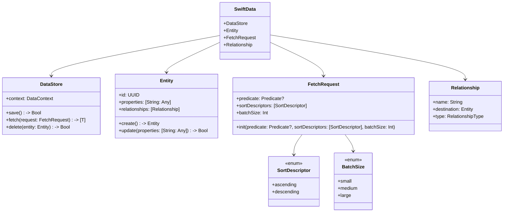

---

## **2. Initializers Overview**

### **a. Initialization Methods Diagram**
- **Purpose**: Break down the various ways to instantiate `SwiftData` components.
- **Diagram Type**: `flowchart LR`
- **Contents**:
  - **DataStore Initialization**: `init(configuration:)`
  - **Entity Initialization**: `init(id:)`, `init(properties:)`
  - **FetchRequest Initialization**: `init(predicate:sortDescriptors:batchSize:)`
  - **Relationship Initialization**: `init(name:destination:type:)`

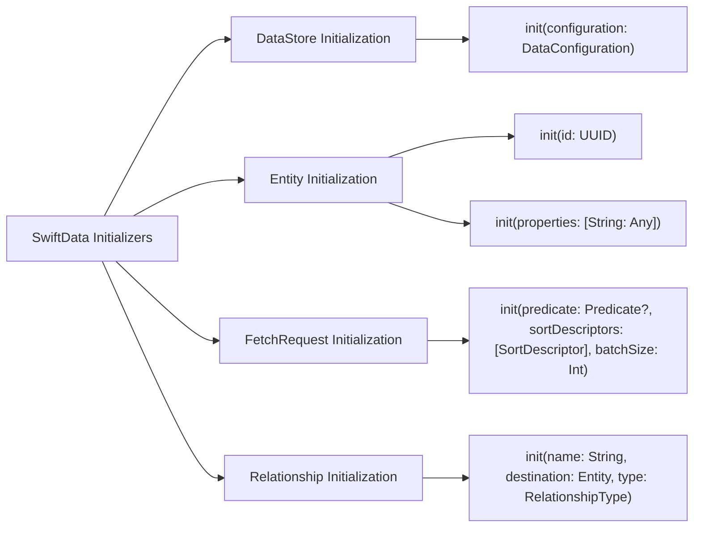

---

## **3. Properties Breakdown**

### **a. Key Properties Diagram**
- **Purpose**: Detail the main properties of `SwiftData` components.
- **Diagram Type**: `graph LR`
- **Contents**:
  - **DataStore Properties**: `context`, `entities`
  - **Entity Properties**: `id`, `properties`, `relationships`
  - **FetchRequest Properties**: `predicate`, `sortDescriptors`, `batchSize`
  - **Relationship Properties**: `name`, `destination`, `type`

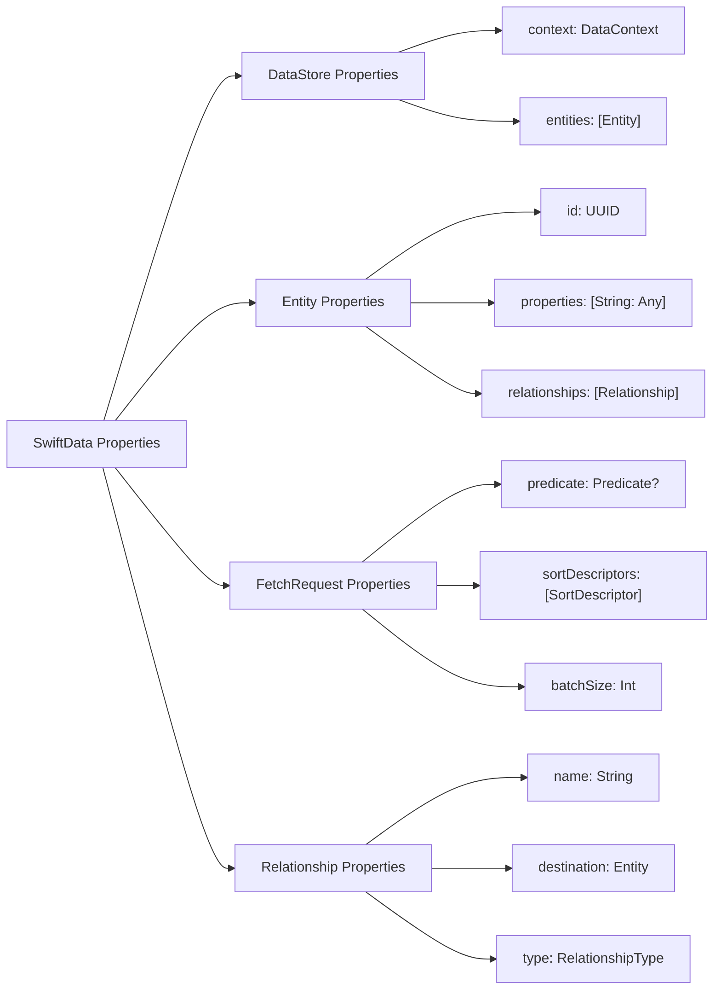

---

## **4. Methods Grouped by Functionality**

### **a. Data Manipulation Methods**
- **Purpose**: Categorize methods based on their roles in data manipulation.
- **Diagram Type**: `flowchart TD`
- **Contents**:
  - **CRUD Operations**: `create()`, `read()`, `update()`, `delete()`
  - **Persistence Methods**: `save()`, `rollback()`
  - **Fetching Methods**: `fetch()`, `fetchAll()`
  - **Relationship Management**: `addRelationship()`, `removeRelationship()`

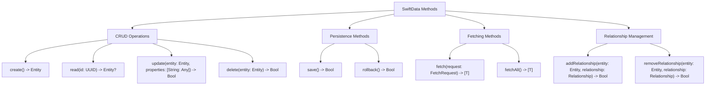

---

## **5. Enumerations and Configurations**

### **a. Enumerations Diagram**
- **Purpose**: Highlight the enums used within `SwiftData` and their possible values.
- **Diagram Type**: `classDiagram`
- **Contents**:
  - **SortOrder**
  - **RelationshipType**
  - **DataType**
  - **BatchSizeOption**

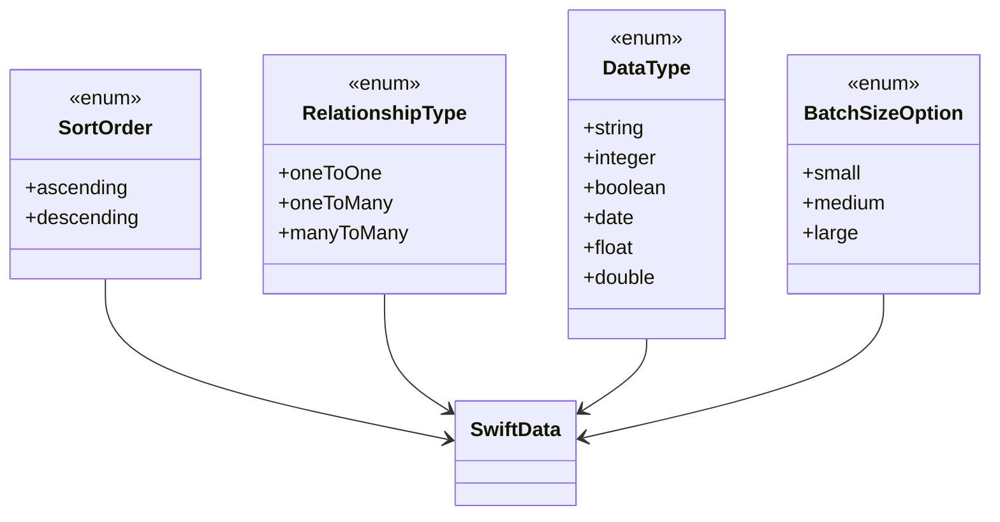

### **b. Configuration Classes Diagram**
- **Purpose**: Show the relationship between `SwiftData` and its configuration classes.
- **Diagram Type**: `classDiagram`
- **Contents**:
  - **DataConfiguration**
  - **MigrationConfiguration**

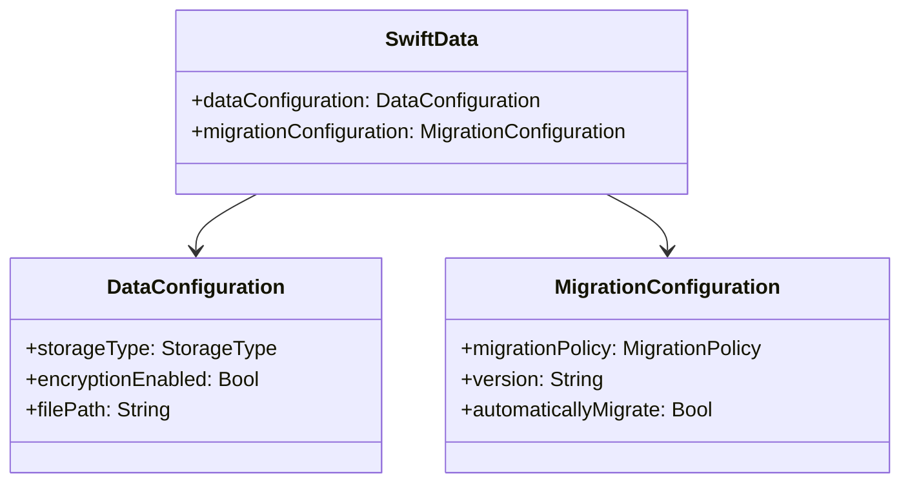

---

## **6. Protocol Conformances**

### **a. Protocols Diagram**
- **Purpose**: Display the protocols that `SwiftData` conforms to and their impact.
- **Diagram Type**: `classDiagram`
- **Contents**:
  - **Codable**
  - **ObservableObject**
  - **Persistable**
  - **Fetchable**

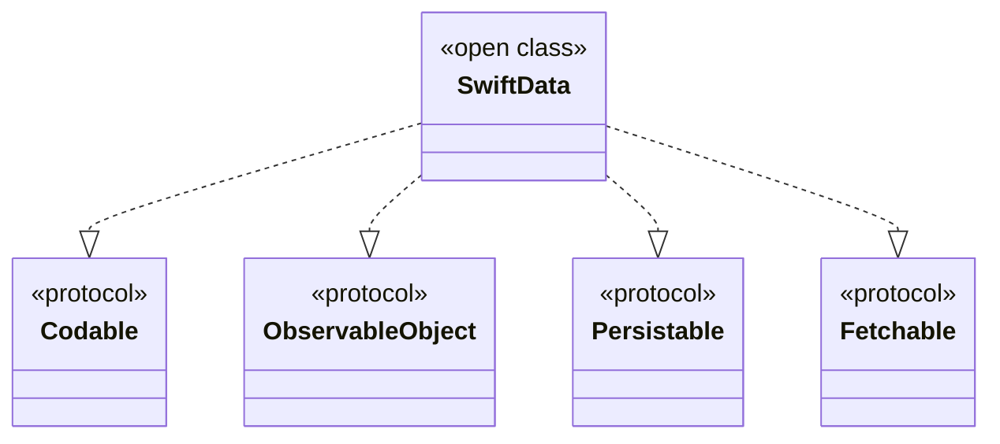

---

## **7. Relationships with Other Classes**

### **a. Related Classes Diagram**
- **Purpose**: Illustrate how `SwiftData` interacts with other frameworks and classes.
- **Diagram Type**: `flowchart TD`
- **Contents**:
  - **UIKit**: Integration for UI updates based on data changes.
  - **Combine**: Reactive data handling.
  - **CoreLocation**: Location-based data management.
  - **Networking**: Handling data from APIs.
  - **CloudKit**: Cloud synchronization.
  - **SwiftUI**: Seamless UI and data binding.

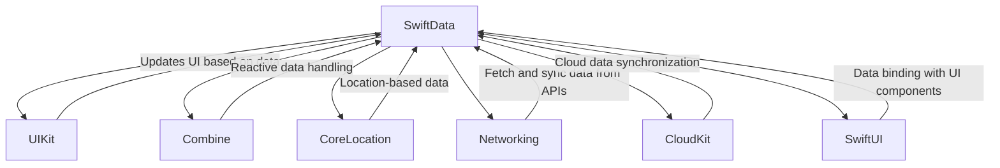

---

## **8. Extensions and Additional Functionalities**

### **a. SwiftData Extensions Diagram**
- **Purpose**: Showcase the additional functionalities provided through extensions.
- **Diagram Type**: `classDiagram`
- **Contents**:
  - **DataStoreExtensions**
  - **EntityExtensions**
  - **FetchRequestExtensions**

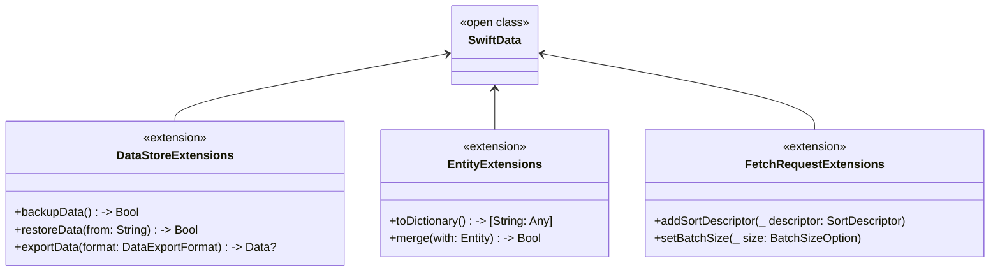

### **b. Extensions Functionalities Flowchart**
- **Purpose**: Detail specific extended methods and their purposes.
- **Diagram Type**: `flowchart LR`
- **Contents**:
  - **Data Backup**
  - **Data Restoration**
  - **Data Export**
  - **Entity Conversion**
  - **Request Customization**

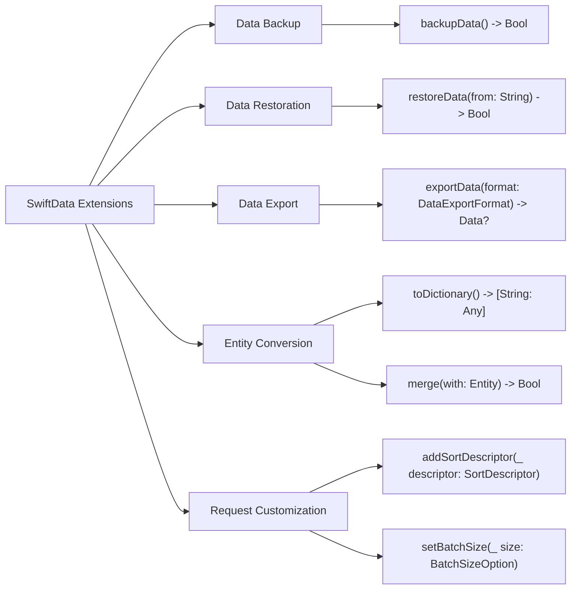

---

## **9. Lifecycle and Use Cases**

### **a. Lifecycle Flowchart**
- **Purpose**: Demonstrate the typical lifecycle of `SwiftData` within an application.
- **Diagram Type**: `flowchart TD`
- **Contents**:
  - **Initialization**
  - **Data Operations**
  - **Persistence**
  - **Synchronization**
  - **Termination**

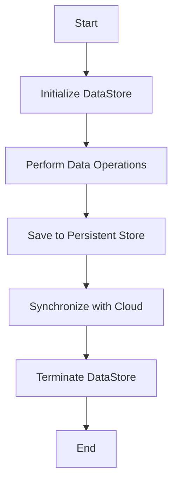

### **b. Common Use Cases Diagram**
- **Purpose**: Outline the typical scenarios where `SwiftData` is utilized.
- **Diagram Type**: `flowchart TD`
- **Contents**:
  - **User Authentication**
  - **Data Synchronization**
  - **Offline Support**
  - **Real-Time Updates**
  - **Data Analytics**
  - **Backup and Recovery**

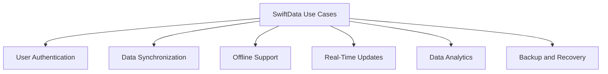

---

## **10. Feature Availability Timeline**

### **a. Feature Availability Gantt Chart**
- **Purpose**: Show when various `SwiftData` features were introduced across iOS versions.
- **Diagram Type**: `gantt`
- **Contents**:
  - **iOS Versions**: 14.0, 15.0, 16.0, 17.0
  - **Features Introduced**: Core Data Integration, Reactive Fetching, Cloud Sync, Offline Support, Enhanced Security, Migration Tools

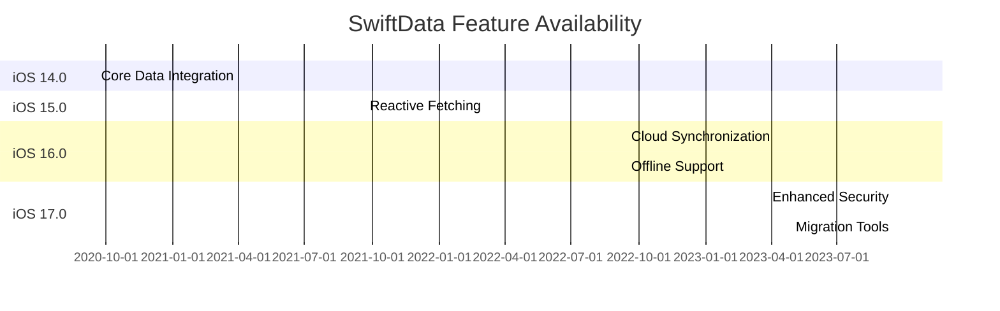

---

## **11. Data Handling and Formats**

### **a. Data Format Handling Diagram**
- **Purpose**: Explain how `SwiftData` handles different data formats.
- **Diagram Type**: `graph LR`
- **Contents**:
  - **JSON**: `encodeToJSON()`, `decodeFromJSON()`
  - **XML**: `encodeToXML()`, `decodeFromXML()`
  - **Binary**: `encodeToBinary()`, `decodeFromBinary()`
  - **Custom Formats**: `encodeToCustomFormat()`, `decodeFromCustomFormat()`

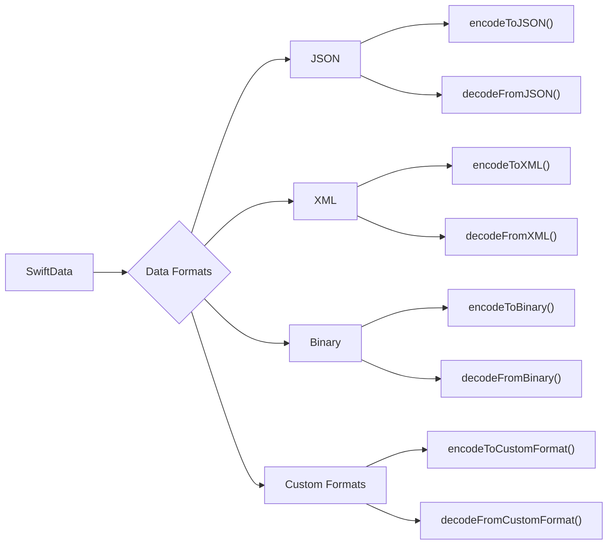

---

## **12. Integration with Other Frameworks**

### **a. Integration Diagram**
- **Purpose**: Show how `SwiftData` integrates with other Apple frameworks and third-party libraries.
- **Diagram Type**: `flowchart TD`
- **Contents**:
  - **UIKit**: UI updates based on data changes.
  - **SwiftUI**: Seamless data binding.
  - **Combine**: Reactive programming.
  - **CloudKit**: Cloud data synchronization.
  - **CoreLocation**: Location-based data handling.
  - **Third-Party Libraries**: Alamofire for networking, Realm for alternative data storage.

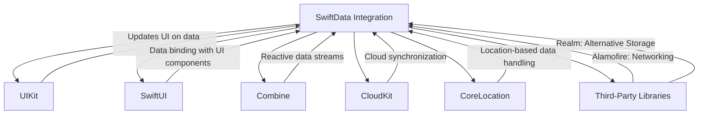

---

## **13. Summary and Best Practices**

### **a. Summary Diagram**
- **Purpose**: Provide a high-level overview of `SwiftData`'s key characteristics and functionalities.
- **Diagram Type**: `graph LR`
- **Contents**:
  - **Robust Data Management**
  - **Seamless Integration**
  - **Reactive Programming Support**
  - **Scalable Architecture**
  - **Enhanced Security**
  - **Efficient Data Handling**

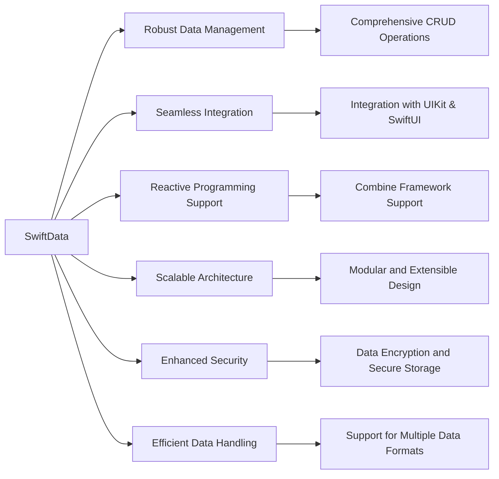

---

## **Best Practices for Using SwiftData**

1. **Follow the MVC/MVVM Architectural Patterns**: Structure your application logic to separate concerns, making your codebase more maintainable and testable.

2. **Utilize FetchRequest Wisely**: Optimize your data fetching by using appropriate predicates and sort descriptors to minimize performance overhead.

3. **Handle Relationships Carefully**: Define clear relationship types (`oneToOne`, `oneToMany`, `manyToMany`) to maintain data integrity and avoid conflicts.

4. **Leverage Reactive Programming**: Integrate with Combine to create responsive and dynamic data-driven interfaces.

5. **Implement Error Handling**: Always handle potential errors during data operations to ensure application stability.

6. **Optimize Performance**: Use batch fetching and indexing where necessary to improve data retrieval speeds.

7. **Secure Your Data**: Enable encryption and follow best security practices to protect sensitive information.

8. **Regularly Backup Data**: Utilize backup and recovery methods to prevent data loss.

9. **Stay Updated with SwiftData Releases**: Keep track of framework updates and new features to enhance your application's capabilities.

10. **Write Unit Tests**: Ensure the reliability of your data operations by writing comprehensive tests.

By adhering to these best practices, you can effectively leverage the `SwiftData` framework to build robust, scalable, and high-performance iOS applications.

---
