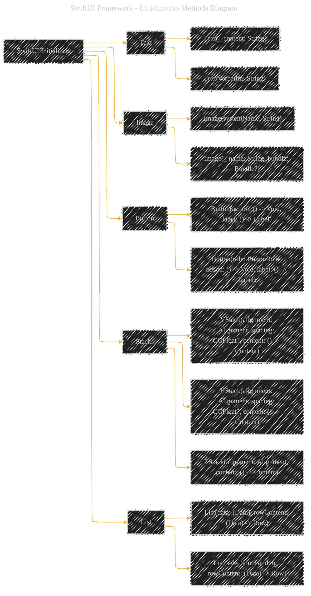
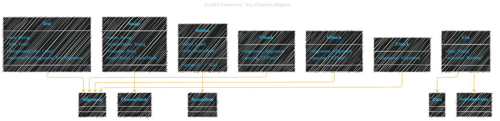
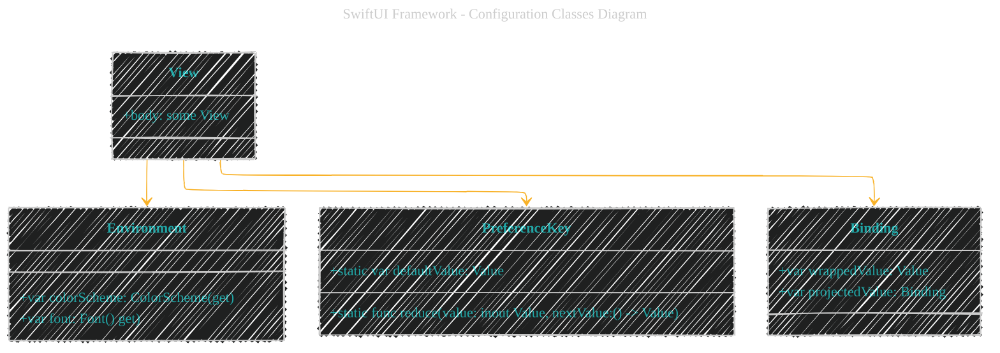
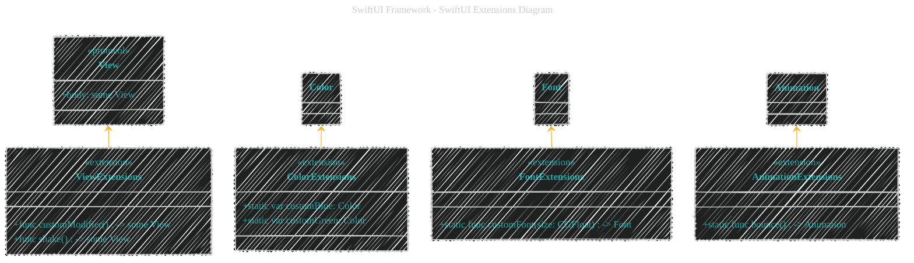
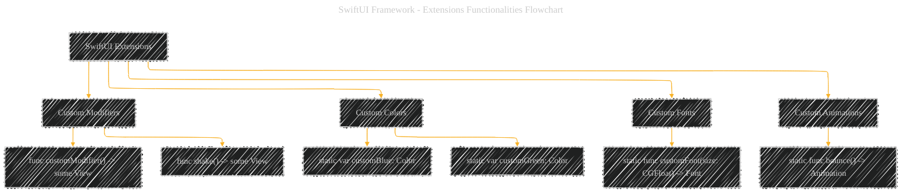
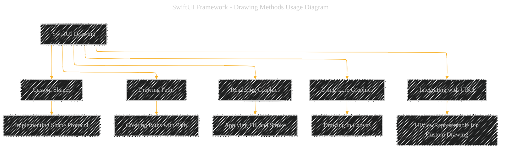

# SwiftUI
> This content is dual-licensed under your choice of the following licenses:
> 1.  **MIT License:** For the code implementations in Swift and Mermaid provided in this document.
> 2.  **Creative Commons Attribution 4.0 International License (CC BY 4.0):** For all other content, including the text, explanations, and the Mermaid diagrams and illustrations.

---

Below is a comprehensive and organized set of Mermaid diagrams for the `SwiftUI` framework. These diagrams cover various aspects of `SwiftUI`, including its class structure, initializers, properties, methods, enumerations, protocol conformances, relationships, extensions, lifecycle, feature availability, data handling, drawing contexts, and a summary of best practices.

---


## **1. Class Structure and Hierarchy**

### **a. Core Class Diagram**
- **Purpose**: Illustrate the primary structure of `SwiftUI` components, including their properties, methods, and enumerations.
- **Diagram Type**: `classDiagram`
- **Contents**:
  - **Core Protocols**: `View`, `Shape`, `Animatable`
  - **Common Views**: `Text`, `Image`, `Button`, `VStack`, `HStack`, `ZStack`, `List`, `NavigationView`
  - **Modifiers**: Common view modifiers like `padding`, `background`, `foregroundColor`
  - **Enumerations**: Nested enums such as `Alignment`, `Animation`, `ColorScheme`

```mermaid
---
title: "SwiftUI Framework - Class Structure and Hierarchy - Core Class Diagram"
author: "Cong Le"
version: "1.0"
license(s): "MIT, CC BY 4.0"
copyright: "Copyright (c) 2025 Cong Le. All Rights Reserved."
config:
  layout: elk
  look: handDrawn
  theme: dark
---
%%%%%%%% Mermaid version v11.4.1-b.14
%%%%%%%% Toggle theme value to `base` to activate the initilization below for the customized theme version.
%%%%%%%% Available curve styles include the following keywords:
%% basis, bumpX, bumpY, cardinal, catmullRom, linear, monotoneX, monotoneY, natural, step, stepAfter, stepBefore.
%%{
  init: {
    'classDiagram': { 'htmlLabels': false, 'curve': 'linear' },
    'fontFamily': 'Fantasy',
    'themeVariables': {
      'primaryColor': '#ffff',
      'primaryTextColor': '#2ff9',
      'primaryBorderColor': '#7c2',
      'lineColor': '#F8B229',
      'secondaryColor': '#006100',
      'tertiaryColor': '#fff'
    }
  }
}%%
classDiagram
    %% Core Protocols
    class View {
        <<protocol>>
        +body: some View
    }
    
    class Shape {
        <<protocol>>
        +path(in rect: CGRect) -> Path
    }
    
    class Animatable {
        <<protocol>>
        +var animatableData: AnimatableData (get set)
    }
    
    %% Common Views
    class Text {
        +init(_ content: String)
        +text: String
    }
    
    class Image {
        +init(systemName: String)
        +init(_ name: String)
        +systemName: String
        +name: String
    }
    
    class Button {
        +init(action: () -> Void, label: () -> Label)
        +action: () -> Void
    }
    
    class VStack {
        +init(alignment: Alignment, spacing: CGFloat?, content: () -> Content)
    }
    
    class HStack {
        +init(alignment: Alignment, spacing: CGFloat?, content: () -> Content)
    }
    
    class ZStack {
        +init(alignment: Alignment, content: () -> Content)
    }
    
    class List {
        +init(data: [Data], rowContent: (Data) -> Row)
    }
    
    class NavigationView {
        +init(@ViewBuilder content: () -> Content)
    }
    
    %% Modifiers
    class ViewModifiers {
        +padding(_ edges: Edge.Set?, _ length: CGFloat?)
        +background(_ view: some View)
        +foregroundColor(_ color: Color)
    }
    
    %% Enumerations
    class Alignment {
        <<enum>>
        +leading
        +center
        +trailing
        +top
        +bottom
    }
    
    class Animation {
        <<enum>>
        +default
        +linear
        +easeIn
        +easeOut
        +spring
    }
    
    class ColorScheme {
        <<enum>>
        +light
        +dark
    }
    
    %% Relationships
    View <|-- Text
    View <|-- Image
    View <|-- Button
    View <|-- VStack
    View <|-- HStack
    View <|-- ZStack
    View <|-- List
    View <|-- NavigationView
    Text o-- ViewModifiers
    Image o-- ViewModifiers
    Button o-- ViewModifiers
    Alignment --> ViewModifiers
    Animation --> ViewModifiers
    ColorScheme --> ViewModifiers
    
```



---

## **2. Initializers Overview**

### **a. Initialization Methods Diagram**
- **Purpose**: Break down the various ways to instantiate common `SwiftUI` views.
- **Diagram Type**: `flowchart LR`
- **Contents**:
  - **Text Initializers**: `init(_:)`, `init(verbatim:)`
  - **Image Initializers**: `init(systemName:)`, `init(_: Bundle?)`
  - **Button Initializers**: `init(action:label:)`, `init(role:action:label:)`
  - **Stack Initializers**: `init(alignment:spacing:content:)`
  - **List Initializers**: `init(data:rowContent:)`, `init(selection:rowContent:)`



---

## **3. Properties Breakdown**

### **a. Key Properties Diagram**
- **Purpose**: Detail the main properties of key `SwiftUI` views.
- **Diagram Type**: `classDiagram`
- **Contents**:
  - **Text Properties**: `text`, `font`, `foregroundColor`, `multilineTextAlignment`
  - **Image Properties**: `name`, `systemName`, `resizable`, `aspectRatio`
  - **Button Properties**: `action`, `label`, `role`
  - **Stack Properties**: `alignment`, `spacing`
  - **List Properties**: `data`, `selection`



---

## **4. Methods Grouped by Functionality**

### **a. View Modifier Methods**
- **Purpose**: Categorize methods based on their roles in modifying `SwiftUI` views.
- **Diagram Type**: `flowchart TD`
- **Contents**:
  - **Layout Modifiers**: `padding()`, `frame()`, `background()`
  - **Style Modifiers**: `foregroundColor()`, `font()`, `opacity()`
  - **Behavior Modifiers**: `onTapGesture()`, `onAppear()`, `onDisappear()`
  - **Animation Modifiers**: `animation()`, `transition()`
  - **Accessibility Modifiers**: `accessibilityLabel()`, `accessibilityHidden()`

```mermaid
---
title: "SwiftUI Framework - View Modifier Methods"
author: "Cong Le"
version: "1.0"
license(s): "MIT, CC BY 4.0"
copyright: "Copyright (c) 2025 Cong Le. All Rights Reserved."
config:
  layout: elk
  look: handDrawn
  theme: dark
---
%%%%%%%% Mermaid version v11.4.1-b.14
%%%%%%%% Toggle theme value to `base` to activate the initilization below for the customized theme version.
%%%%%%%% Available curve styles include the following keywords:
%% basis, bumpX, bumpY, cardinal, catmullRom, linear, monotoneX, monotoneY, natural, step, stepAfter, stepBefore.
%%{
  init: {
    'flowchart': {'htmlLabels': true, 'curve': 'basis' },
    'fontFamily': 'Fantasy',
    'themeVariables': {
      'lineColor': '#F8B229'
    }
  }
}%%
flowchart TD
    A[SwiftUI View Modifiers] --> B[Layout Modifiers]
    A --> C[Style Modifiers]
    A --> D[Behavior Modifiers]
    A --> E[Animation Modifiers]
    A --> F[Accessibility Modifiers]
    
    B --> B1["padding(_: Edge.Set, _ length: CGFloat)"]
    B --> B2["frame(width: CGFloat?, height: CGFloat?, alignment: Alignment?)"]
    B --> B3["background(_ view: some View)"]
    
    C --> C1["foregroundColor(_ color: Color)"]
    C --> C2["font(_ font: Font)"]
    C --> C3["opacity(_ opacity: Double)"]
    
    D --> D1["onTapGesture(count: Int, perform: () -> Void)"]
    D --> D2["onAppear(perform: () -> Void)"]
    D --> D3["onDisappear(perform: () -> Void)"]
    
    E --> E1["animation(_ animation: Animation?, value: Any?)"]
    E --> E2["transition(_ transition: AnyTransition)"]
    
    F --> F1["accessibilityLabel(_ label: Text)"]
    F --> F2["accessibilityHidden(_ hidden: Bool)"]
```



---

## **5. Enumerations and Configurations**

### **a. Enumerations Diagram**
- **Purpose**: Highlight the enums used within `SwiftUI` and their possible values.
- **Diagram Type**: `classDiagram`
- **Contents**:
  - **Alignment**
  - **ContentMode**
  - **ButtonRole**
  - **TextAlignment**
  - **Animation**
  - **ColorScheme**


### **b. Configuration Classes Diagram**
- **Purpose**: Show the relationship between `SwiftUI` views and their configuration classes.
- **Diagram Type**: `classDiagram`
- **Contents**:
  - **View Configuration**
  - **Environment**
  - **PreferenceKey**
  - **Binding**



---

## **6. Protocol Conformances**

### **a. Protocols Diagram**
- **Purpose**: Display the protocols that key `SwiftUI` views conform to and their impact.
- **Diagram Type**: `classDiagram`
- **Contents**:
  - **View**
  - **Animatable**
  - **Identifiable**
  - **Equatable**
  - **Hashable**
  - **ObservableObject**


---

## **7. Relationships with Other Classes**

### **a. Related Classes Diagram**
- **Purpose**: Illustrate how `SwiftUI` interacts with other frameworks and classes.
- **Diagram Type**: `flowchart TD`
- **Contents**:
  - **Combine Framework**: Publishers, Subscribers
  - **UIKit Integration**: UIViewRepresentable, UIViewControllerRepresentable
  - **Foundation Framework**: Data handling, Networking
  - **Core Data Integration**: @FetchRequest, ManagedObjectContext
  - **Accessibility**: VoiceOver, Dynamic Type

```mermaid
---
title: "SwiftUI Framework - Related Classes Diagram"
author: "Cong Le"
version: "1.0"
license(s): "MIT, CC BY 4.0"
copyright: "Copyright (c) 2025 Cong Le. All Rights Reserved."
config:
  layout: elk
  look: handDrawn
  theme: dark
---
%%%%%%%% Mermaid version v11.4.1-b.14
%%%%%%%% Toggle theme value to `base` to activate the initilization below for the customized theme version.
%%%%%%%% Available curve styles include the following keywords:
%% basis, bumpX, bumpY, cardinal, catmullRom, linear, monotoneX, monotoneY, natural, step, stepAfter, stepBefore.
%%{
  init: {
    'flowchart': {'htmlLabels': true, 'curve': 'basis' },
    'fontFamily': 'Fantasy',
    'themeVariables': {
      'lineColor': '#F8B229'
    }
  }
}%%
flowchart TD
    A[SwiftUI] --> B[Combine Framework]
    A --> C[UIKit Integration]
    A --> D[Foundation Framework]
    A --> E[Core Data Integration]
    A --> F[Accessibility]
    
    B --> B1[Publishers]
    B --> B2[Subscribers]
    
    C --> C1[UIViewRepresentable]
    C --> C2[UIViewControllerRepresentable]
    
    D --> D1[Data Handling]
    D --> D2[Networking]
    
    E --> E1[@FetchRequest]
    E --> E2[ManagedObjectContext]
    
    F --> F1[VoiceOver]
    F --> F2[Dynamic Type]
```

---

## **8. Extensions and Additional Functionalities**

### **a. SwiftUI Extensions Diagram**
- **Purpose**: Showcase the additional functionalities provided through extensions in `SwiftUI`.
- **Diagram Type**: `classDiagram`
- **Contents**:
  - **View Extensions**: Custom modifiers, helper functions
  - **Color Extensions**: Custom color palettes
  - **Font Extensions**: Custom fonts and styles
  - **Animation Extensions**: Additional animation options



### **b. Extensions Functionalities Flowchart**
- **Purpose**: Detail specific extended methods and their purposes.
- **Diagram Type**: `flowchart LR`
- **Contents**:
  - **Custom Modifiers**
  - **Custom Colors**
  - **Custom Fonts**
  - **Custom Animations**



---

## **9. Lifecycle and Use Cases**

### **a. Lifecycle Flowchart**
- **Purpose**: Demonstrate the typical lifecycle of a `SwiftUI` view within an application.
- **Diagram Type**: `flowchart TD`
- **Contents**:
  - **Initialization**
  - **Configuration**
  - **Rendering**
  - **State Changes**
  - **Re-rendering**
  - **Disposal**


### **b. Common Use Cases Diagram**
- **Purpose**: Outline the typical scenarios where `SwiftUI` is utilized.
- **Diagram Type**: `flowchart TD`
- **Contents**:
  - **Building User Interfaces**
  - **Handling User Input**
  - **Data Binding and State Management**
  - **Animations and Transitions**
  - **Accessibility Support**
  - **Integration with APIs and Services**

```mermaid
---
title: "SwiftUI Framework - Common Use Cases Diagram"
author: "Cong Le"
version: "1.0"
license(s): "MIT, CC BY 4.0"
copyright: "Copyright (c) 2025 Cong Le. All Rights Reserved."
config:
  layout: elk
  look: handDrawn
  theme: dark
---
%%%%%%%% Mermaid version v11.4.1-b.14
%%%%%%%% Toggle theme value to `base` to activate the initilization below for the customized theme version.
%%%%%%%% Available curve styles include the following keywords:
%% basis, bumpX, bumpY, cardinal, catmullRom, linear, monotoneX, monotoneY, natural, step, stepAfter, stepBefore.
%%{
  init: {
    'flowchart': {'htmlLabels': true, 'curve': 'basis' },
    'fontFamily': 'Fantasy',
    'themeVariables': {
      'primaryColor': '#ffff',
      'primaryTextColor': '#2ff9',
      'primaryBorderColor': '#7c2',
      'lineColor': '#F8B229',
      'secondaryColor': '#006100',
      'tertiaryColor': '#fff'
    }
  }
}%%
flowchart TD
    A[SwiftUI Use Cases] --> B[Building User Interfaces]
    A --> C[Handling User Input]
    A --> D[Data Binding and State Management]
    A --> E[Animations and Transitions]
    A --> F[Accessibility Support]
    A --> G[Integration with APIs and Services]
    
    B --> B1[Creating Responsive Layouts]
    B --> B2[Reusable Components]
    
    C --> C1[Buttons and Gestures]
    C --> C2[Form Inputs]
    
    D --> D1[@State, @Binding]
    D --> D2[ObservableObject]
    
    E --> E1[Implicit Animations]
    E --> E2[Custom Transitions]
    
    F --> F1[VoiceOver Integration]
    F --> F2[Dynamic Type Support]
    
    G --> G1[Networking with Combine]
    G --> G2[Core Data Integration]
```

---

## **10. Feature Availability Timeline**

### **a. Feature Availability Gantt Chart**
- **Purpose**: Show when various `SwiftUI` features were introduced across iOS versions.
- **Diagram Type**: `gantt`
- **Contents**:
  - **iOS Versions**: 13.0, 14.0, 15.0, 16.0, 17.0
  - **Features Introduced**: Basic Views, Dark Mode Support, AsyncImage, Asynchronous Programming, Improved Navigation APIs, Advanced Animation Techniques


---

## **11. Data Handling and Formats**

### **a. Data Binding and State Management Diagram**
- **Purpose**: Explain how `SwiftUI` handles data binding and state management.
- **Diagram Type**: `graph LR`
- **Contents**:
  - **@State**
  - **@Binding**
  - **@ObservedObject**
  - **@EnvironmentObject**
  - **@StateObject**
  - **@Published**

```mermaid
---
title: "SwiftUI Framework - Data Binding and State Management Diagram"
author: "Cong Le"
version: "1.0"
license(s): "MIT, CC BY 4.0"
copyright: "Copyright (c) 2025 Cong Le. All Rights Reserved."
config:
  layout: elk
  look: handDrawn
  theme: dark
---
%%%%%%%% Mermaid version v11.4.1-b.14
%%%%%%%% Toggle theme value to `base` to activate the initilization below for the customized theme version.
%%%%%%%% Available curve styles include the following keywords:
%% basis, bumpX, bumpY, cardinal, catmullRom, linear, monotoneX, monotoneY, natural, step, stepAfter, stepBefore.
%%{
  init: {
    'graph': { 'htmlLabels': false, 'curve': 'linear' },
    'fontFamily': 'Fantasy',
    'themeVariables': {
      'primaryColor': '#ffff',
      'primaryTextColor': '#55ff',
      'primaryBorderColor': '#7c2',
      'lineColor': '#F8B229',
      'secondaryColor': '#006100',
      'tertiaryColor': '#fff'
    }
  }
}%%
graph LR
    A[SwiftUI Data Handling] --> B[@State]
    A --> C[@Binding]
    A --> D[@ObservedObject]
    A --> E[@EnvironmentObject]
    A --> F[@StateObject]
    A --> G[@Published]
    
    B --> B1["Local State Management"]
    C --> C1["Parent-Child Communication"]
    D --> D1["External Data Sources"]
    E --> E1["Shared Data Across Views"]
    F --> F1["Object Lifecycle Management"]
    G --> G1["Automatic View Updates"]
```

---

## **12. Integration with Drawing Contexts**

### **a. Drawing Methods Usage Diagram**
- **Purpose**: Show how `SwiftUI` integrates with drawing contexts and custom rendering.
- **Diagram Type**: `flowchart TD`
- **Contents**:
  - **Custom Shapes**
  - **Drawing Paths**
  - **Rendering Graphics**
  - **Using Core Graphics**
  - **Integrating with UIKit**



---

## **13. Summary and Best Practices**

### **a. Summary Diagram**
- **Purpose**: Provide a high-level overview of `SwiftUI`'s key characteristics and functionalities.
- **Diagram Type**: `graph LR`
- **Contents**:
  - **Declarative Syntax**
  - **State-Driven UI Updates**
  - **Composable Views**
  - **Integration with Combine**
  - **Accessibility and Localization**
  - **Performance Optimizations**

```mermaid
---
title: "SwiftUI Framework - Summary Diagram"
config:
  layout: elk
  look: handDrawn
  theme: dark
---
%%%%%%%% Mermaid version v11.4.1-b.14
%%%%%%%% Available curve styles include the following keywords:
%% basis, bumpX, bumpY, cardinal, catmullRom, linear, monotoneX, monotoneY, natural, step, stepAfter, stepBefore.
%%{
  init: {
    'graph': { 'htmlLabels': false, 'curve': 'linear' },
    'fontFamily': 'Fantasy',
    'themeVariables': {
      'primaryColor': '#BB2528',
      'primaryTextColor': '#f529',
      'primaryBorderColor': '#7C0000',
      'lineColor': '#F8B229',
      'secondaryColor': '#006100',
      'tertiaryColor': '#fff'
    }
  }
}%%
graph LR
    A[SwiftUI] --> B[Declarative Syntax]
    A --> C[State-Driven UI Updates]
    A --> D[Composable Views]
    A --> E[Integration with Combine]
    A --> F[Accessibility and Localization]
    A --> G[Performance Optimizations]
    
    B --> B1[Simplified UI Code]
    C --> C1[@State, @Binding, @ObservedObject]
    D --> D1[Reusable Components]
    E --> E1[Reactive Programming]
    F --> F1[VoiceOver Support]
    F --> F2[Dynamic Type]
    G --> G1[Efficient Rendering]
    G --> G2[Lazy Loading]
```

### **b. Best Practices Diagram**
- **Purpose**: Highlight best practices for using `SwiftUI` effectively.
- **Diagram Type**: `flowchart TD`
- **Contents**:
  - **Use State Appropriately**
  - **Leverage Composability**
  - **Optimize for Performance**
  - **Ensure Accessibility**
  - **Adopt Responsive Design**
  - **Test Thoroughly**

```mermaid
---
title: "SwiftUI Framework - Best Practices Diagram"
config:
  layout: elk
  look: handDrawn
  theme: base
---
%%%%%%%% Mermaid version v11.4.1-b.14
%%%%%%%% Available curve styles include the following keywords:
%% basis, bumpX, bumpY, cardinal, catmullRom, linear, monotoneX, monotoneY, natural, step, stepAfter, stepBefore.
%%{
  init: {
    'flowchart': { 'htmlLabels': false, 'curve': 'linear' },
    'fontFamily': 'Fantasy',
    'themeVariables': {
      'primaryColor': '#BB28',
      'primaryTextColor': '#299',
      'primaryBorderColor': '#7c2',
      'lineColor': '#F8B229',
      'secondaryColor': '#006100',
      'tertiaryColor': '#fff'
    }
  }
}%%
flowchart TD
    A[SwiftUI Best Practices] --> B[Use State Appropriately]
    A --> C[Leverage Composability]
    A --> D[Optimize for Performance]
    A --> E[Ensure Accessibility]
    A --> F[Adopt Responsive Design]
    A --> G[Test Thoroughly]
    
    B --> B1["Minimize @State Usage"]
    B --> B2["Use @Binding for Child Views"]
    
    C --> C1["Create Reusable Components"]
    C --> C2["Compose Complex Views"]
    
    D --> D1["Use Lazy Containers"]
    D --> D2["Avoid Unnecessary Re-renders"]
    
    E --> E1["Support Dynamic Type"]
    E --> E2["Provide VoiceOver Labels"]
    
    F --> F1["Use Adaptive Layouts"]
    F --> F2["Handle Different Screen Sizes"]
    
    G --> G1["Unit Testing"]
    G --> G2["UI Testing"]
```




---
**Licenses:**

- **MIT License:**  [](LICENSE) - Full text in [LICENSE](LICENSE) file.
- **Creative Commons Attribution 4.0 International:** [](LICENSE-CC-BY) - Legal details in [LICENSE-CC-BY](LICENSE-CC-BY) and at [Creative Commons official site](http://creativecommons.org/licenses/by/4.0/).

---