```mermaid
---
title: "SwiftUI Feature Availability Timeline"
author: "Cong Le"
version: "1.0"
license(s): "MIT, CC BY 4.0"
copyright: "Copyright (c) 2025 Cong Le. All Rights Reserved."
config:
  theme: dark
---
%%%%%%%% Mermaid version v11.4.1-b.14
%%%%%%%% Toggle theme value to `base` to activate the initilization below for the customized theme version.
%%%%%%%% Available curve styles include the following keywords:
%% basis, bumpX, bumpY, cardinal, catmullRom, linear, monotoneX, monotoneY, natural, step, stepAfter, stepBefore.
%%{
  init: {
    'flowchart': {'htmlLabels': true, 'curve': 'basis' },
    'fontFamily': 'Fantasy',
    'themeVariables': {
      'lineColor': '#F8B229'
    }
  }
}%%
gantt
    title SwiftUI Feature Availability Timeline (Based on Documentation)
    dateFormat  YYYY-MM-DD
    axisFormat  %Y

    %% Approximate Release Dates for Version Mapping:
    %% 13 -> 2019-09-19
    %% 14 -> 2020-09-16
    %% 15 -> 2021-09-20
    %% 16 -> 2022-09-12
    %% 17 -> 2023-09-18
    %% 18 -> 2024-09-16 (Placeholder)

    section Core_Views_&_Structure
        View_Protocol        : milestone, v13_milestone, 2019-09-19, 0d
        Text_View            : active, v13_text, 2019-09-19, todate
        Image_View           : active, v13_image, 2019-09-19, todate
        Spacer               : active, v13_spacer, 2019-09-19, todate
        Group                : active, v13_group, 2019-09-19, todate
        TupleView            : active, v13_tupleview, 2019-09-19, todate
        EmptyView            : active, v13_emptyview, 2019-09-19, todate
        AnyView              : active, v13_anyview, 2019-09-19, todate
        ViewModifier_Protocol: milestone, v13_vm_proto, 2019-09-19, 0d
        EmptyModifier        : active, v13_emptymod, 2019-09-19, todate
        ModifiedContent      : active, v13_modcontent, 2019-09-19, todate

    section Layout_Containers
        HStack               : active, v13_hstack, 2019-09-19, todate
        VStack               : active, v13_vstack, 2019-09-19, todate
        ZStack               : active, v13_zstack, 2019-09-19, todate
        ForEach_Identifiable : active, v13_foreach_id, 2019-09-19, todate
        ForEach_id_KeyPath : active, v13_foreach_kp, 2019-09-19, todate
        ForEach_RangeInt   : active, v13_foreach_range, 2019-09-19, todate
        ForEach_BindingC   : active, v13_foreach_bind, 2019-09-19, todate
        GeometryReader       : active, v13_georeader, 2019-09-19, todate
        ScrollView           : active, v13_scrollview, 2019-09-19, todate
        Section_Basic        : active, v13_section, 2019-09-19, todate
        List_Basic           : active, v13_list, 2019-09-19, todate
        Grid                 : active, v16_grid, 2022-09-12, todate
        HStackLayout         : active, v16_hstacklayout, 2022-09-12, todate
        VStackLayout         : active, v16_vstacklayout, 2022-09-12, todate
        ZStackLayout         : active, v16_zstacklayout, 2022-09-12, todate
        AnyLayout            : active, v16_anylayout, 2022-09-12, todate
        Layout_Protocol      : milestone, v16_layout_proto, 2022-09-12, 0d
        Group_subviews       : active, v18_group_subviews, 2024-09-16, todate
        Group_sections       : active, v18_group_sections, 2024-09-16, todate

    section State_&_Data_Flow
        State_Prop           : active, v13_state, 2019-09-19, todate
        Binding_Prop         : active, v13_binding, 2019-09-19, todate
        ObservedObject_Prop  : active, v13_observedobj, 2019-09-19, todate
        EnvironmentObject_Prop: active, v13_envobj, 2019-09-19, todate
        Environment_Prop     : active, v13_env, 2019-09-19, todate
        EnvironmentValues    : active, v13_envvalues, 2019-09-19, todate
        EnvironmentKey_Proto : milestone, v13_envkey_proto, 2019-09-19, 0d
        StateObject_Prop     : active, v14_stateobj, 2020-09-16, todate
        ScaledMetric_Prop    : active, v14_scaledmetric, 2020-09-16, todate
        ObservableObject_Proto: milestone, v13_obs_obj_proto, 2019-09-19, 0d
        DynamicProperty_Proto: milestone, v13_dynprop_proto, 2019-09-19, 0d
        PreferenceKey_Proto: milestone, v13_prefkey_proto, 2019-09-19, 0d
        Transaction          : active, v13_transaction, 2019-09-19, todate
        Namespace_Prop       : active, v14_namespace, 2020-09-16, todate
        MatchedGeometryEffect: active, v14_matchedgeo, 2020-09-16, todate
        Bindable_Prop        : active, v17_bindable, 2023-09-18, todate
        ContainerValues      : active, v18_containervalues, 2024-09-16, todate
        ContainerValueKey_Proto: milestone, v18_contvalkey_proto, 2024-09-16, 0d

    section Drawing_&_Shapes
        Shape_Protocol       : milestone, v13_shape_proto, 2019-09-19, 0d
        InsettableShape_Proto: milestone, v13_insetshape_proto, 2019-09-19, 0d
        Path_Struct          : active, v13_path, 2019-09-19, todate
        Rectangle            : active, v13_rectangle, 2019-09-19, todate
        Circle               : active, v13_circle, 2019-09-19, todate
        Ellipse              : active, v13_ellipse, 2019-09-19, todate
        Capsule              : active, v13_capsule, 2019-09-19, todate
        RoundedRectangle     : active, v13_roundrect, 2019-09-19, todate
        OffsetShape          : active, v13_offsetshape, 2019-09-19, todate
        RotatedShape         : active, v13_rotatedshape, 2019-09-19, todate
        ScaledShape          : active, v13_scaledshape, 2019-09-19, todate
        TransformedShape     : active, v13_transformedshape, 2019-09-19, todate
        StrokeStyle          : active, v13_strokestyle, 2019-09-19, todate
        FillStyle            : active, v13_fillstyle, 2019-09-19, todate
        ContainerRelativeShape: active, v14_containerrelshape, 2020-09-16, todate
        UnevenRoundedRectangle: active, v16_unevenroundrect, 2022-09-12, todate
        AnyShape             : active, v16_anyshape, 2022-09-12, todate
        ShapeView_Protocol   : milestone, v17_shapeview_proto, 2023-09-18, 0d
        FillShapeView        : active, v17_fillshapeview, 2023-09-18, todate
        StrokeShapeView      : active, v17_strokeshapeview, 2023-09-18, todate
        StrokeBorderShapeView: active, v17_strokebordershapeview, 2023-09-18, todate

    section Styles_&_Appearance
        Color_Struct         : active, v13_color, 2019-09-19, todate
        ShapeStyle_Protocol  : milestone, v13_shapestyle_proto, 2019-09-19, 0d
        LinearGradient       : active, v13_lineargrad, 2019-09-19, todate
        RadialGradient       : active, v13_radialgrad, 2019-09-19, todate
        AngularGradient      : active, v13_angulargrad, 2019-09-19, todate
        ImagePaint           : active, v13_imagepaint, 2019-09-19, todate
        ForegroundStyle      : active, v13_fgstyle, 2019-09-19, todate
        BackgroundStyle      : active, v14_bgstyle, 2020-09-16, todate
        Material             : active, v15_material, 2021-09-20, todate
        HierarchicalShapeStyle: active, v15_hierarchicalstyle, 2021-09-20, todate
        TintShapeStyle       : active, v15_tintstyle, 2021-09-20, todate
        AnyShapeStyle        : active, v15_anyshapestyle, 2021-09-20, todate
        EllipticalGradient   : active, v15_ellipticalgrad, 2021-09-20, todate
        Gradient_Struct      : active, v13_gradient, 2019-09-19, todate
        AnyGradient          : active, v16_anygradient, 2022-09-12, todate
        ShadowStyle          : active, v16_shadowstyle, 2022-09-12, todate
        SeparatorShapeStyle  : active, v17_separatorstyle, 2023-09-18, todate
        Shader               : active, v17_shader, 2023-09-18, todate
        ShaderFunction       : active, v17_shaderfunc, 2023-09-18, todate
        ShaderLibrary        : active, v17_shaderlib, 2023-09-18, todate
        MeshGradient         : active, v18_meshgradient, 2024-09-16, todate

    section Animation_&_Transitions
        Animatable_Protocol  : milestone, v13_anim_proto, 2019-09-19, 0d
        VectorArithmetic_Proto: milestone, v13_vector_proto, 2019-09-19, 0d
        AnimatablePair       : active, v13_animpair, 2019-09-19, todate
        EmptyAnimatableData  : active, v13_emptyanimdata, 2019-09-19, todate
        Animation_Struct     : active, v13_animation, 2019-09-19, todate
        withAnimation        : active, v13_withanim, 2019-09-19, todate
        withTransaction      : active, v13_withtrans, 2019-09-19, todate
        GeometryEffect_Proto : milestone, v13_geoeffect_proto, 2019-09-19, 0d
        ProjectionTransform  : active, v13_projtransform, 2019-09-19, todate
        AnyTransition        : active, v13_anytransition, 2019-09-19, todate
        ContentTransition    : active, v16_contenttrans, 2022-09-12, todate
        Transition_Protocol  : milestone, v17_trans_proto, 2023-09-18, 0d
        TransitionPhase      : active, v17_transphase, 2023-09-18, todate
        TransitionProperties : active, v17_transprops, 2023-09-18, todate
        Spring_Struct        : active, v17_spring, 2023-09-18, todate
        CustomAnimation_Proto: milestone, v17_customanim_proto, 2023-09-18, 0d
        Keyframes_Proto      : milestone, v17_keyframes_proto, 2023-09-18, 0d
        KeyframeAnimator     : active, v17_keyframeanimator, 2023-09-18, todate
        KeyframeTimeline     : active, v17_keyframetimeline, 2023-09-18, todate
        CubicKeyframe        : active, v17_cubickeyframe, 2023-09-18, todate
        LinearKeyframe       : active, v17_linearkeyframe, 2023-09-18, todate
        SpringKeyframe       : active, v17_springkeyframe, 2023-09-18, todate
        MoveKeyframe         : active, v17_movekeyframe, 2023-09-18, todate

    section Gestures
        Gesture_Protocol     : milestone, v13_gesture_proto, 2019-09-19, 0d
        AnyGesture           : active, v13_anygesture, 2019-09-19, todate
        TapGesture           : active, v13_tapgesture, 2019-09-19, todate
        LongPressGesture     : active, v13_longpress, 2019-09-19, todate
        DragGesture          : active, v13_draggesture, 2019-09-19, todate
        MagnificationGesture : active, v13_magnify, 2019-09-19, todate
        RotationGesture      : active, v13_rotate, 2019-09-19, todate
        SimultaneousGesture  : active, v13_simultgesture, 2019-09-19, todate
        ExclusiveGesture     : active, v13_exclgesture, 2019-09-19, todate
        SequenceGesture      : active, v13_seqgesture, 2019-09-19, todate
        GestureMask          : active, v13_gesturemask, 2019-09-19, todate
        EventModifiers       : active, v13_eventmods, 2019-09-19, todate

    section Other_Components
        LocalizedStringKey   : active, v13_locstrkey, 2019-09-19, todate
        Font                 : active, v13_font, 2019-09-19, todate
        Angle                : active, v13_angle, 2019-09-19, todate
        UnitPoint            : active, v13_unitpoint, 2019-09-19, todate
        Edge                 : active, v13_edge, 2019-09-19, todate
        EdgeInsets           : active, v13_edgeinsets, 2019-09-19, todate
        Axis                 : active, v13_axis, 2019-09-19, todate
        Anchor               : active, v13_anchor, 2019-09-19, todate
        TimelineView         : active, v15_timelineview, 2021-09-20, todate
        TimelineSchedule_Proto: milestone, v15_timesched_proto, 2021-09-20, 0d
        ImageRenderer        : active, v16_imagerenderer, 2022-09-12, todate
        TextRenderer_Proto   : milestone, v17_textrenderer_proto, 2023-09-18, 0d
        VisualEffect_Proto   : milestone, v17_visualeffect_proto, 2023-09-18, 0d
        HoverEffect_Proto    : milestone, v18_hovereffect_proto, 2024-09-16, 0d

    section Accessibility
        AXChartDescRep_Proto : active, v15_axchart_proto, 2021-09-20, todate
        AccCustomContentKey  : active, v15_acccustomkey, 2021-09-20, todate
        AccHeadingLevel      : active, v15_accheading, 2021-09-20, todate
        AccTextContentType   : active, v15_acctexttype, 2021-09-20, todate
        AccTraits            : active, v13_acctraits, 2019-09-19, todate
        TextSelectability_Proto: milestone, v15_textselect_proto, 2021-09-20, 0d
```

# SwiftUI Feature Availability Timeline (Based on Documentation) - A Diagrammatic Guide 
> **Disclaimer:**
>
> This document contains my personal notes on the topic,
> compiled from publicly available documentation and various cited sources.
> The materials are intended for educational purposes, personal study, and reference.
> The content is dual-licensed:
> 1. **MIT License:** Applies to all code implementations (Swift, Mermaid, and other programming languages).
> 2. **Creative Commons Attribution 4.0 International License (CC BY 4.0):** Applies to all non-code content, including text, explanations, diagrams, and illustrations.
---

----

## Explaination

### 1. Purpose of the Chart

The primary goal of this Gantt chart is to provide a **visual timeline** of when major SwiftUI features, as represented in the documentation you provided, became available across different major OS versions (iOS, macOS, tvOS, watchOS, visionOS). It helps you understand:

*   **Feature Introduction:** Which version introduced specific concepts, protocols, views, modifiers, etc.
*   **Framework Evolution:** How SwiftUI has grown and added capabilities over time since its initial release.
*   **Availability Context:** Roughly associate features with their corresponding OS era (e.g., features introduced with iOS 15/macOS 12).

----

### 2. How the Chart is Structured

*   **Chart Type:** It's a **Gantt chart**, typically used for project timelines, but adapted here to show feature availability over versions.
*   **`dateFormat YYYY-MM-DD`:** This tells the Mermaid renderer how to interpret the date strings used internally (`2019-09-19`, `2020-09-16`, etc.). These specific dates are approximate release dates chosen primarily to map to the version numbers.
*   **`axisFormat %Y`:** This controls how the dates are *displayed* on the horizontal time axis. Even though we use `YYYY-MM-DD` internally, this format was chosen during debugging to ensure rendering. **Crucially, you should mentally map the years displayed on the axis to the corresponding OS versions as commented in the chart:**
    *   `2019` represents **v13** (iOS 13, macOS 10.15, ...)
    *   `2020` represents **v14** (iOS 14, macOS 11, ...)
    *   `2021` represents **v15** (iOS 15, macOS 12, ...)
    *   `2022` represents **v16** (iOS 16, macOS 13, ...)
    *   `2023` represents **v17** (iOS 17, macOS 14, ...)
    *   `2024` represents **v18** (iOS 18, macOS 15, ...) (Placeholder date)
*   **`section Name_With_Underscores`**: Features are grouped into logical categories (like `Layout_Containers`, `State_&_Data_Flow`, `Drawing_&_Shapes`) for better organization. Underscores are used instead of spaces in section names and IDs for better compatibility with the Mermaid parser.
*   **`Feature_Name : status, id, start_date, duration/end_date`**: This is the definition for each feature listed:
    *   **`Feature_Name`**: The name of the SwiftUI feature, view, protocol, or concept. Underscores replace spaces for compatibility. IDs like `State_Prop` are used to clarify that `@State` is a property wrapper.
    *   **`status`**:
        *   `active`: Indicates the feature is available *from* the `start_date` onwards. Represented by a bar extending to the end (`todate`).
        *   `milestone`: Represents the introduction point of a foundational concept, often a protocol (like `View_Protocol` or `Shape_Protocol`). Represented by a diamond shape at a specific point in time (`0d` duration).
    *   **`id`**: A unique identifier for the task within the Mermaid definition (e.g., `v13_text`, `v16_layout_proto`). Primarily for Mermaid's internal use.
    *   **`start_date`**: The date marker corresponding to the *first version* the feature became available according to the documentation provided (e.g., `2019-09-19` for v13 features).
    *   **`duration/end_date`**:
        *   `todate`: Makes the bar for `active` features extend to the end of the chart, signifying ongoing availability.
        *   `0d`: Used for `milestone` tasks, making them appear as a single point marker.

----

### 3. How to Read It

*   Look at the **Sections** on the left to find categories of features.
*   Find the **Feature Name** you are interested in.
*   Look at the **Bar** or **Milestone Diamond** associated with it.
*   The **Starting Point** of the bar (or the position of the diamond) on the horizontal axis indicates the version (mapped from the year shown) when the feature was introduced.
*   If it's a **Bar (`active`)** extending `todate`, the feature remains available in subsequent versions shown on the chart.
*   If it's a **Diamond (`milestone`)**, it marks the specific version that protocol or concept was introduced.

----

### 4. Key Observations from the Chart (Examples)

*   **Foundation (v13/2019):** Core elements like `View`, `Text`, `Image`, basic Stacks (`HStack`, `VStack`, `ZStack`), state management (`@State`, `@Binding`, `@ObservedObject`, `@EnvironmentObject`, `@Environment`), basic Shapes (`Path`, `Rectangle`, `Circle`), basic Styles (`Color`, basic Gradients), Gestures (`TapGesture`, `DragGesture`), and core modifiers were present from the beginning.
*   **Refinement (v14/2020):** Introduced `@StateObject` for better lifecycle management, `@Namespace` and `matchedGeometryEffect` for advanced animations, `ScaledMetric`, `ContainerRelativeShape`, and `BackgroundStyle`.
*   **UI Polish & Advanced Drawing (v15/2021):** Added `Material` backgrounds, `HierarchicalShapeStyle`, `TintShapeStyle`, `Accessibility` features like `AXChartDescriptor`, `TextSelectability`, and `TimelineView` (though its definition wasn't in the provided docs).
*   **Layout & More Styles (v16/2022):** A major update with the `Layout` protocol (`HStackLayout`, etc.), `AnyLayout`, `Grid`, `ContentTransition`, `ImageRenderer`, `AnyShape`, `UnevenRoundedRectangle`, and `ShadowStyle`.
*   **Animation, Graphics, Observation (v17/2023):** Significant additions with the `Transition` protocol, `KeyframeAnimator`, `Shaders`, `@Bindable` for the newer Observation framework, `VisualEffect`, `SeparatorShapeStyle`.
*   **Advanced Layout & Graphics (v18/2024):** Introduced `Group(subviews:)` and `Group(sections:)` for deeper layout introspection, `MeshGradient`, and `HoverEffect`.

----

### 5. Important Considerations

*   **Source Limitation:** This chart *only* reflects features explicitly mentioned or clearly inferable from the scapshot of the original Swift source code. It's not an exhaustive list of every SwiftUI feature ever released.
*   **Earliest Version:** The chart generally marks the *earliest* version a feature appeared based on the availability annotations (`@available`). Some features might have received updates or become available on *more* platforms in later versions.
*   **Date/Version Mapping:** Remember the dates (`YYYY-MM-DD`) are internal placeholders; the crucial information is the OS version they represent (v13, v14, etc.), which you need to map mentally using the commented guide or approximate release years.
*   **Platform Nuances:** While trying to capture general availability, some minor platform differences (like `TapGesture` on tvOS, or visionOS specific details) might not be fully detailed in this high-level chart.

---
**Licenses:**

- **MIT License:**   - Full text in [LICENSE](LICENSE) file.
- **Creative Commons Attribution 4.0 International:**  - Legal details in [LICENSE-CC-BY](LICENSE-CC-BY) and at [Creative Commons official site](http://creativecommons.org/licenses/by/4.0/).

---