# SwiftUI Feature iOS Availability Timeline - A Diagrammatic Guide 
> **Disclaimer:**
>
> This document contains my personal notes on the topic,
> compiled from publicly available documentation and various cited sources.
> The materials are intended for educational purposes, personal study, and reference.
> The content is dual-licensed:
> 1. **MIT License:** Applies to all code implementations (Swift, Mermaid, and other programming languages).
> 2. **Creative Commons Attribution 4.0 International License (CC BY 4.0):** Applies to all non-code content, including text, explanations, diagrams, and illustrations.
---

This chart focuses only on when features became available *on iOS*. Features introduced solely on other platforms (macOS, watchOS, etc.) without an iOS counterpart in the specified version won't be listed or will start from their respective iOS introduction version.

```mermaid
gantt
    title SwiftUI Feature iOS Availability Timeline (Based on Documentation)
    dateFormat  YYYY-MM-DD
    axisFormat  %Y  -- Displaying Year (Map Year to iOS Version mentally or via comment)

    %% iOS Version Mapping:
    %% 2019 -> iOS 13
    %% 2020 -> iOS 14
    %% 2021 -> iOS 15
    %% 2022 -> iOS 16
    %% 2023 -> iOS 17
    %% 2024 -> iOS 18 (Approx. based on typical cycle)

    section Core_Views_&_Structure
        View_Protocol        : milestone, v13_milestone, 2019-09-19, 0d
        Text_View            : active, v13_text, 2019-09-19, todate
        Image_View           : active, v13_image, 2019-09-19, todate
        Spacer               : active, v13_spacer, 2019-09-19, todate
        Group                : active, v13_group, 2019-09-19, todate
        TupleView            : active, v13_tupleview, 2019-09-19, todate
        EmptyView            : active, v13_emptyview, 2019-09-19, todate
        AnyView              : active, v13_anyview, 2019-09-19, todate
        ViewModifier_Protocol: milestone, v13_vm_proto, 2019-09-19, 0d
        EmptyModifier        : active, v13_emptymod, 2019-09-19, todate
        ModifiedContent      : active, v13_modcontent, 2019-09-19, todate

    section Layout_Containers
        HStack               : active, v13_hstack, 2019-09-19, todate
        VStack               : active, v13_vstack, 2019-09-19, todate
        ZStack               : active, v13_zstack, 2019-09-19, todate
        ForEach_Identifiable : active, v13_foreach_id, 2019-09-19, todate
        ForEach_id_KeyPath : active, v13_foreach_kp, 2019-09-19, todate
        ForEach_RangeInt   : active, v13_foreach_range, 2019-09-19, todate
        ForEach_BindingC   : active, v13_foreach_bind, 2019-09-19, todate
        GeometryReader       : active, v13_georeader, 2019-09-19, todate
        ScrollView           : active, v13_scrollview, 2019-09-19, todate
        Section_Basic        : active, v13_section, 2019-09-19, todate
        List_Basic           : active, v13_list, 2019-09-19, todate
        Grid                 : active, v16_grid, 2022-09-12, todate  -- iOS 16+
        HStackLayout         : active, v16_hstacklayout, 2022-09-12, todate  -- iOS 16+
        VStackLayout         : active, v16_vstacklayout, 2022-09-12, todate  -- iOS 16+
        ZStackLayout         : active, v16_zstacklayout, 2022-09-12, todate  -- iOS 16+
        AnyLayout            : active, v16_anylayout, 2022-09-12, todate  -- iOS 16+
        Layout_Protocol      : milestone, v16_layout_proto, 2022-09-12, 0d  -- iOS 16+
        Group_subviews       : active, v18_group_subviews, 2024-09-16, todate -- iOS 18+ (Predicted)
        Group_sections       : active, v18_group_sections, 2024-09-16, todate -- iOS 18+ (Predicted)

    section State_&_Data_Flow
        State_Prop           : active, v13_state, 2019-09-19, todate
        Binding_Prop         : active, v13_binding, 2019-09-19, todate
        ObservedObject_Prop  : active, v13_observedobj, 2019-09-19, todate
        EnvironmentObject_Prop: active, v13_envobj, 2019-09-19, todate
        Environment_Prop     : active, v13_env, 2019-09-19, todate
        EnvironmentValues    : active, v13_envvalues, 2019-09-19, todate
        EnvironmentKey_Proto : milestone, v13_envkey_proto, 2019-09-19, 0d
        StateObject_Prop     : active, v14_stateobj, 2020-09-16, todate  -- iOS 14+
        ScaledMetric_Prop    : active, v14_scaledmetric, 2020-09-16, todate  -- iOS 14+
        ObservableObject_Proto: milestone, v13_obs_obj_proto, 2019-09-19, 0d
        DynamicProperty_Proto: milestone, v13_dynprop_proto, 2019-09-19, 0d
        PreferenceKey_Proto: milestone, v13_prefkey_proto, 2019-09-19, 0d
        Transaction          : active, v13_transaction, 2019-09-19, todate
        Namespace_Prop       : active, v14_namespace, 2020-09-16, todate  -- iOS 14+
        MatchedGeometryEffect: active, v14_matchedgeo, 2020-09-16, todate  -- iOS 14+
        Bindable_Prop        : active, v17_bindable, 2023-09-18, todate  -- iOS 17+
        ContainerValues      : active, v18_containervalues, 2024-09-16, todate -- iOS 18+ (Predicted)
        ContainerValueKey_Proto: milestone, v18_contvalkey_proto, 2024-09-16, 0d -- iOS 18+ (Predicted)

    section Drawing_&_Shapes
        Shape_Protocol       : milestone, v13_shape_proto, 2019-09-19, 0d
        InsettableShape_Proto: milestone, v13_insetshape_proto, 2019-09-19, 0d
        Path_Struct          : active, v13_path, 2019-09-19, todate
        Rectangle            : active, v13_rectangle, 2019-09-19, todate
        Circle               : active, v13_circle, 2019-09-19, todate
        Ellipse              : active, v13_ellipse, 2019-09-19, todate
        Capsule              : active, v13_capsule, 2019-09-19, todate
        RoundedRectangle     : active, v13_roundrect, 2019-09-19, todate
        OffsetShape          : active, v13_offsetshape, 2019-09-19, todate
        RotatedShape         : active, v13_rotatedshape, 2019-09-19, todate
        ScaledShape          : active, v13_scaledshape, 2019-09-19, todate
        TransformedShape     : active, v13_transformedshape, 2019-09-19, todate
        StrokeStyle          : active, v13_strokestyle, 2019-09-19, todate
        FillStyle            : active, v13_fillstyle, 2019-09-19, todate
        ContainerRelativeShape: active, v14_containerrelshape, 2020-09-16, todate  -- iOS 14+
        UnevenRoundedRectangle: active, v16_unevenroundrect, 2022-09-12, todate  -- iOS 16+
        AnyShape             : active, v16_anyshape, 2022-09-12, todate  -- iOS 16+
        ShapeView_Protocol   : milestone, v17_shapeview_proto, 2023-09-18, 0d  -- iOS 17+
        FillShapeView        : active, v17_fillshapeview, 2023-09-18, todate  -- iOS 17+
        StrokeShapeView      : active, v17_strokeshapeview, 2023-09-18, todate  -- iOS 17+
        StrokeBorderShapeView: active, v17_strokebordershapeview, 2023-09-18, todate  -- iOS 17+

    section Styles_&_Appearance
        Color_Struct         : active, v13_color, 2019-09-19, todate
        ShapeStyle_Protocol  : milestone, v13_shapestyle_proto, 2019-09-19, 0d
        LinearGradient       : active, v13_lineargrad, 2019-09-19, todate
        RadialGradient       : active, v13_radialgrad, 2019-09-19, todate
        AngularGradient      : active, v13_angulargrad, 2019-09-19, todate
        ImagePaint           : active, v13_imagepaint, 2019-09-19, todate
        ForegroundStyle      : active, v13_fgstyle, 2019-09-19, todate
        BackgroundStyle      : active, v14_bgstyle, 2020-09-16, todate  -- iOS 14+
        Material             : active, v15_material, 2021-09-20, todate  -- iOS 15+
        HierarchicalShapeStyle: active, v15_hierarchicalstyle, 2021-09-20, todate  -- iOS 15+
        TintShapeStyle       : active, v15_tintstyle, 2021-09-20, todate  -- iOS 15+
        AnyShapeStyle        : active, v15_anyshapestyle, 2021-09-20, todate  -- iOS 15+
        EllipticalGradient   : active, v15_ellipticalgrad, 2021-09-20, todate  -- iOS 15+
        Gradient_Struct      : active, v13_gradient, 2019-09-19, todate
        AnyGradient          : active, v16_anygradient, 2022-09-12, todate  -- iOS 16+
        ShadowStyle          : active, v16_shadowstyle, 2022-09-12, todate  -- iOS 16+
        SeparatorShapeStyle  : active, v17_separatorstyle, 2023-09-18, todate  -- iOS 17+
        Shader               : active, v17_shader, 2023-09-18, todate  -- iOS 17+
        ShaderFunction       : active, v17_shaderfunc, 2023-09-18, todate  -- iOS 17+
        ShaderLibrary        : active, v17_shaderlib, 2023-09-18, todate  -- iOS 17+
        MeshGradient         : active, v18_meshgradient, 2024-09-16, todate -- iOS 18+ (Predicted)

    section Animation_&_Transitions
        Animatable_Protocol  : milestone, v13_anim_proto, 2019-09-19, 0d
        VectorArithmetic_Proto: milestone, v13_vector_proto, 2019-09-19, 0d
        AnimatablePair       : active, v13_animpair, 2019-09-19, todate
        EmptyAnimatableData  : active, v13_emptyanimdata, 2019-09-19, todate
        Animation_Struct     : active, v13_animation, 2019-09-19, todate
        withAnimation        : active, v13_withanim, 2019-09-19, todate
        withTransaction      : active, v13_withtrans, 2019-09-19, todate
        GeometryEffect_Proto : milestone, v13_geoeffect_proto, 2019-09-19, 0d
        ProjectionTransform  : active, v13_projtransform, 2019-09-19, todate
        AnyTransition        : active, v13_anytransition, 2019-09-19, todate
        ContentTransition    : active, v16_contenttrans, 2022-09-12, todate  -- iOS 16+
        Transition_Protocol  : milestone, v17_trans_proto, 2023-09-18, 0d  -- iOS 17+
        TransitionPhase      : active, v17_transphase, 2023-09-18, todate  -- iOS 17+
        TransitionProperties : active, v17_transprops, 2023-09-18, todate  -- iOS 17+
        Spring_Struct        : active, v17_spring, 2023-09-18, todate  -- iOS 17+
        CustomAnimation_Proto: milestone, v17_customanim_proto, 2023-09-18, 0d  -- iOS 17+
        Keyframes_Proto      : milestone, v17_keyframes_proto, 2023-09-18, 0d  -- iOS 17+
        KeyframeAnimator     : active, v17_keyframeanimator, 2023-09-18, todate  -- iOS 17+
        KeyframeTimeline     : active, v17_keyframetimeline, 2023-09-18, todate  -- iOS 17+
        CubicKeyframe        : active, v17_cubickeyframe, 2023-09-18, todate  -- iOS 17+
        LinearKeyframe       : active, v17_linearkeyframe, 2023-09-18, todate  -- iOS 17+
        SpringKeyframe       : active, v17_springkeyframe, 2023-09-18, todate  -- iOS 17+
        MoveKeyframe         : active, v17_movekeyframe, 2023-09-18, todate  -- iOS 17+

    section Gestures
        Gesture_Protocol     : milestone, v13_gesture_proto, 2019-09-19, 0d
        AnyGesture           : active, v13_anygesture, 2019-09-19, todate
        TapGesture           : active, v13_tapgesture, 2019-09-19, todate
        LongPressGesture     : active, v13_longpress, 2019-09-19, todate
        DragGesture          : active, v13_draggesture, 2019-09-19, todate
        MagnificationGesture : active, v13_magnify, 2019-09-19, todate
        RotationGesture      : active, v13_rotate, 2019-09-19, todate
        SimultaneousGesture  : active, v13_simultgesture, 2019-09-19, todate
        ExclusiveGesture     : active, v13_exclgesture, 2019-09-19, todate
        SequenceGesture      : active, v13_seqgesture, 2019-09-19, todate
        GestureMask          : active, v13_gesturemask, 2019-09-19, todate
        EventModifiers       : active, v13_eventmods, 2019-09-19, todate

    section Other_Components
        LocalizedStringKey   : active, v13_locstrkey, 2019-09-19, todate
        Font                 : active, v13_font, 2019-09-19, todate
        Angle                : active, v13_angle, 2019-09-19, todate
        UnitPoint            : active, v13_unitpoint, 2019-09-19, todate
        Edge                 : active, v13_edge, 2019-09-19, todate
        EdgeInsets           : active, v13_edgeinsets, 2019-09-19, todate
        Axis                 : active, v13_axis, 2019-09-19, todate
        Anchor               : active, v13_anchor, 2019-09-19, todate
        TimelineView         : active, v15_timelineview, 2021-09-20, todate  -- iOS 15+
        TimelineSchedule_Proto: milestone, v15_timesched_proto, 2021-09-20, 0d  -- iOS 15+
        ImageRenderer        : active, v16_imagerenderer, 2022-09-12, todate  -- iOS 16+
        TextRenderer_Proto   : milestone, v17_textrenderer_proto, 2023-09-18, 0d  -- iOS 17+
        VisualEffect_Proto   : milestone, v17_visualeffect_proto, 2023-09-18, 0d  -- iOS 17+
        HoverEffect_Proto    : milestone, v18_hovereffect_proto, 2024-09-16, 0d  -- iOS 18+ (Predicted)

    section Accessibility
        AXChartDescRep_Proto : active, v15_axchart_proto, 2021-09-20, todate  -- iOS 15+
        AccCustomContentKey  : active, v15_acccustomkey, 2021-09-20, todate  -- iOS 15+
        AccHeadingLevel      : active, v15_accheading, 2021-09-20, todate  -- iOS 15+
        AccTextContentType   : active, v15_acctexttype, 2021-09-20, todate  -- iOS 15+
        AccTraits            : active, v13_acctraits, 2019-09-19, todate
        TextSelectability_Proto: milestone, v15_textselect_proto, 2021-09-20, 0d  -- iOS 15+
```

----

**Explanation of Changes and Focus:**

1.  **iOS Version Mapping:** The core change is interpreting the start dates based *only* on the `@available(iOS ...)` annotations from the source documentation. The comment at the top clarifies the mapping between the years shown on the axis and the corresponding major iOS versions.
2.  **Filtered Features:** Any feature whose documentation *only* indicated availability on macOS, watchOS, tvOS, or visionOS *without* an equivalent or later iOS version annotation has been implicitly excluded from this chart. (In this specific feature set derived previously, most core features were available on iOS from the start or added later).
3.  **Start Dates Adjusted:** The start date (`YYYY-MM-DD` format) for each feature now reflects its *iOS introduction year*. For example:
    *   `StateObject_Prop` starts at `2020-09-16` (representing iOS 14).
    *   `Grid` starts at `2022-09-12` (representing iOS 16).
    *   `Bindable_Prop` starts at `2023-09-18` (representing iOS 17).
4.  **`todate` Status:** Features marked `active` still extend `todate`, indicating they continue to be available in subsequent iOS versions shown on the chart.
5.  **Milestones:** Protocols (`milestone`) are marked at the iOS version they were introduced.
6.  **Axis Format:** Kept as `%Y` for reliable rendering. Remember to mentally map `2019` to iOS 13, `2020` to iOS 14, and so on, as indicated in the comment.

---
**Licenses:**

- **MIT License:**   - Full text in [LICENSE](LICENSE) file.
- **Creative Commons Attribution 4.0 International:**  - Legal details in [LICENSE-CC-BY](LICENSE-CC-BY) and at [Creative Commons official site](http://creativecommons.org/licenses/by/4.0/).

---