# UICollectionView
> This content is dual-licensed under your choice of the following licenses:
> 1.  **MIT License:** For the code implementations in Swift and Mermaid provided in this document.
> 2.  **Creative Commons Attribution 4.0 International License (CC BY 4.0):** For all other content, including the text, explanations, and the Mermaid diagrams and illustrations.

---

Below is a comprehensive and organized set of Mermaid diagrams for the `UICollectionView` framework. These diagrams cover various aspects of `UICollectionView`, including its class hierarchy, initializers, properties, methods, enumerations, protocol conformances, relationships with other classes, extensions, lifecycle, feature availability, data handling, integration with drawing contexts, and best practices.

---

## **1. Class Structure and Hierarchy**

### **a. Core Class Diagram**
- **Purpose**: Illustrate the primary structure of `UICollectionView`, including its properties, methods, and related classes.
- **Diagram Type**: `classDiagram`
- **Contents**:
  - **Properties**: Key attributes like `delegate`, `dataSource`, `collectionViewLayout`, etc.
  - **Methods**: Essential functions like initializers, `reloadData()`, `performBatchUpdates(_:completion:)`, etc.
  - **Related Classes**: `UICollectionViewCell`, `UICollectionViewLayout`, `UICollectionViewFlowLayout`.

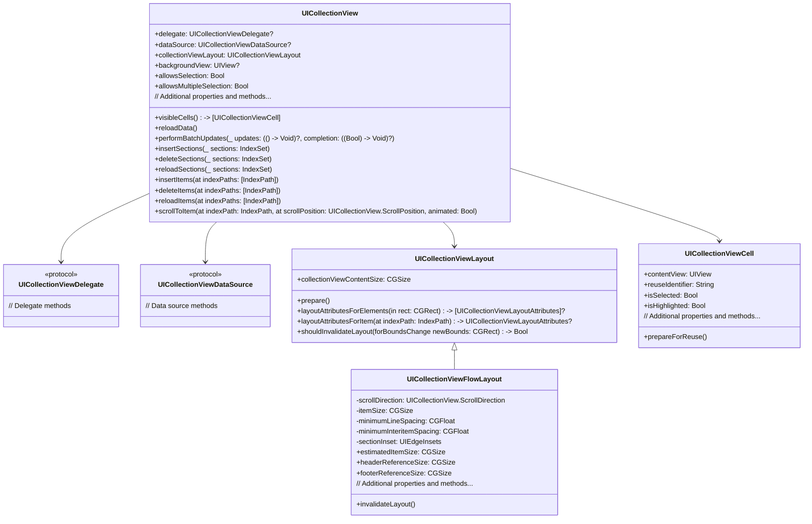

---

## **2. Initializers Overview**

### **a. Initialization Methods Diagram**
- **Purpose**: Break down the various ways to instantiate `UICollectionView`.
- **Diagram Type**: `flowchart` or `graph LR`
- **Contents**:
  - **Frame-Based Initializers**: `init(frame:collectionViewLayout:)`
  - **Coder-Based Initializers**: `required init?(coder:)`
  - **Layout Configurations**: Using different layouts like `UICollectionViewFlowLayout`, custom layouts.

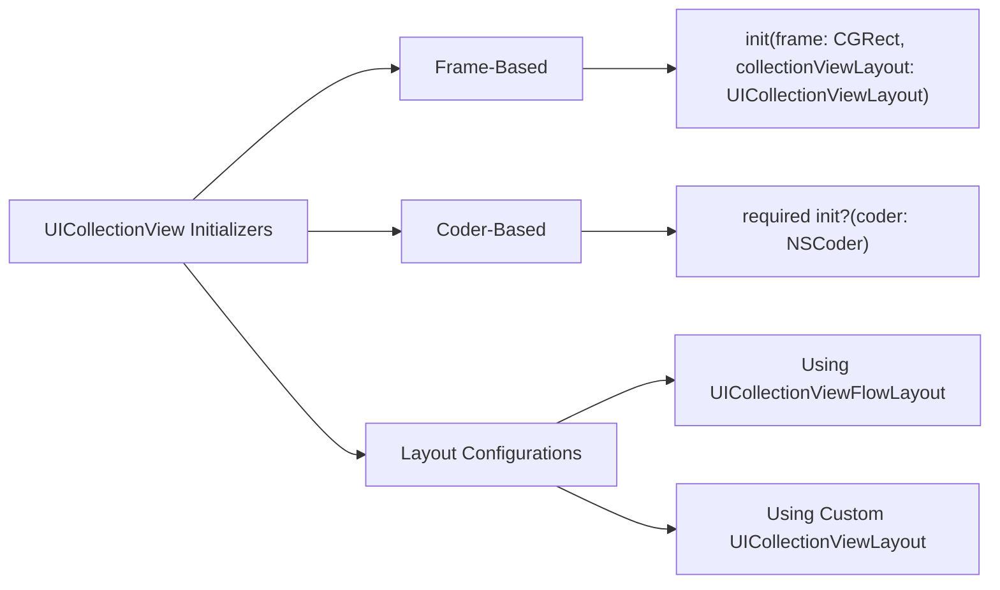

---

## **3. Properties Breakdown**

### **a. Key Properties Diagram**
- **Purpose**: Detail the main properties of `UICollectionView`.
- **Diagram Type**: `graph LR` or `classDiagram`
- **Contents**:
  - **Data Management**: `delegate`, `dataSource`, `collectionViewLayout`
  - **Appearance**: `backgroundView`, `isScrollEnabled`, `showsVerticalScrollIndicator`, `showsHorizontalScrollIndicator`
  - **Selection**: `allowsSelection`, `allowsMultipleSelection`
  - **Scrolling**: `contentOffset`, `contentSize`, `scrollIndicatorInsets`
  - **Reusable Views**: `registeredCells`, `registeredSupplementaryViews`

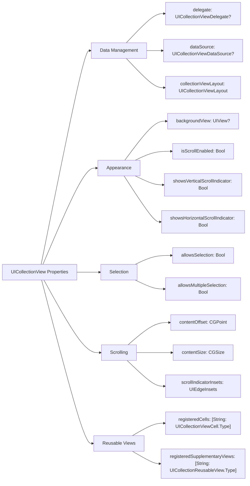


---

## **4. Methods Grouped by Functionality**

### **a. Data Management Methods**
- **Purpose**: Categorize methods based on their roles in data management.
- **Diagram Type**: `flowchart TD`
- **Contents**:
  - **Reloading Data**: `reloadData()`
  - **Batch Updates**: `performBatchUpdates(_:completion:)`
  - **Inserting/Deleting/Reloading Sections and Items**: `insertSections(_:)`, `deleteSections(_:)`, `reloadSections(_:)`, `insertItems(at:)`, `deleteItems(at:)`, `reloadItems(at:)`
  - **Moving Items and Sections**: `moveItem(at:to:)`, `moveSection(_:toSection:)`

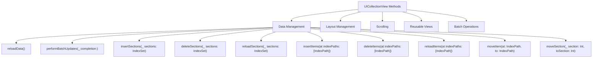

### **b. Layout Management Methods**
- **Purpose**: Categorize methods related to layout customization and management.
- **Diagram Type**: `flowchart TD`
- **Contents**:
  - **Registering Layouts**: `setCollectionViewLayout(_:animated:)`, `transitionLayout(forNewLayout:)`
  - **Invalidating Layout**: `invalidateLayout()`
  - **Layout Attributes**: `layoutAttributesForItem(at:)`, `layoutAttributesForSupplementaryView(ofKind:at:)`

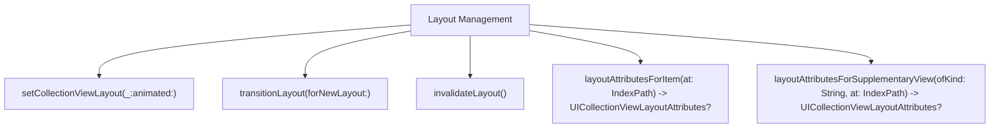

### **c. Scrolling Methods**
- **Purpose**: Categorize methods related to scrolling behavior.
- **Diagram Type**: `flowchart TD`
- **Contents**:
  - **Scrolling to Item**: `scrollToItem(at:at:animated:)`
  - **Content Offset**: `setContentOffset(_:animated:)`, `contentOffset`
  - **Scrolling Indicators**: `flashScrollIndicators()`

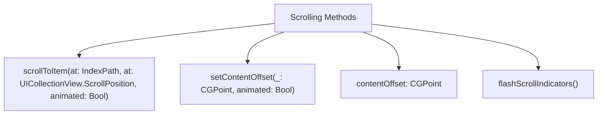

### **d. Reusable Views Methods**
- **Purpose**: Categorize methods for managing reusable cells and supplementary views.
- **Diagram Type**: `flowchart TD`
- **Contents**:
  - **Registering Cells and Views**: `register(_:forCellWithReuseIdentifier:)`, `register(_:forSupplementaryViewOfKind:withReuseIdentifier:)`
  - **Dequeuing Cells and Views**: `dequeueReusableCell(withReuseIdentifier:for:)`, `dequeueReusableSupplementaryView(ofKind:withReuseIdentifier:for:)`

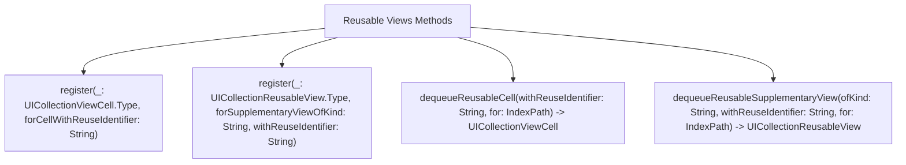

### **e. Selection and Highlighting Methods**
- **Purpose**: Categorize methods related to item selection and highlighting.
- **Diagram Type**: `flowchart TD`
- **Contents**:
  - **Selecting Items**: `selectItem(at:animated:scrollPosition:)`, `deselectItem(at:animated:)`
  - **Retrieving Selected Items**: `indexPathsForSelectedItems() -> [IndexPath]?`

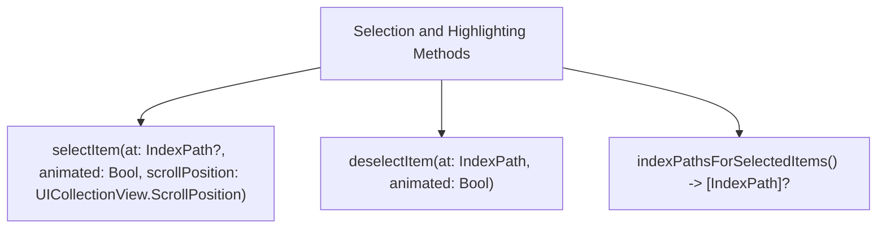

---

## **5. Enumerations and Configurations**

### **a. Enumerations Diagram**
- **Purpose**: Highlight the enums used within `UICollectionView` and their possible values.
- **Diagram Type**: `classDiagram`
- **Contents**:
  - **Scroll Direction**
  - **Scroll Position**
  - **Supplementary View Kind**
  - **Layout Attributes**

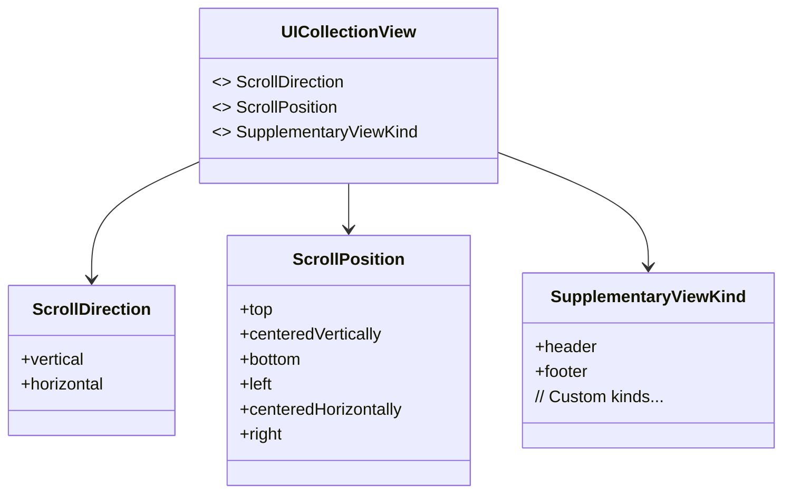

### **b. Configuration Classes Diagram**
- **Purpose**: Show the relationship between `UICollectionView` and its configuration classes.
- **Diagram Type**: `classDiagram`
- **Contents**:
  - **UICollectionViewFlowLayout**
  - **Custom UICollectionViewLayout**

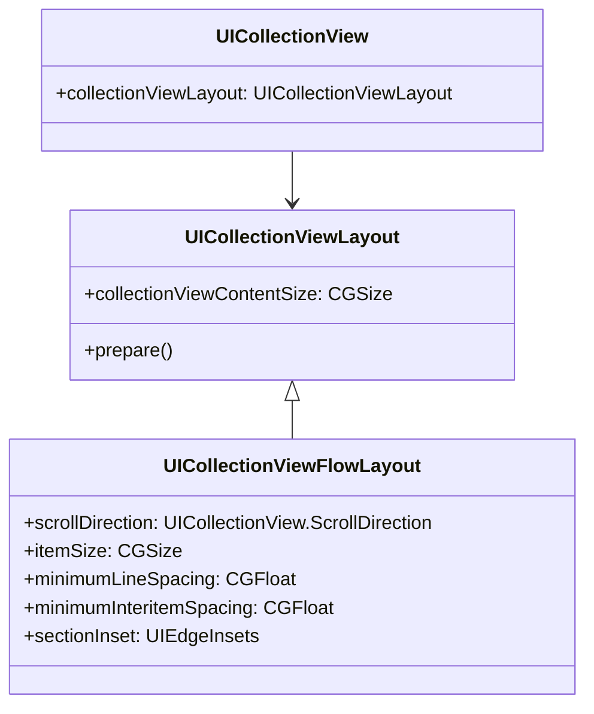

---

## **6. Protocol Conformances**

### **a. Protocols Diagram**
- **Purpose**: Display the protocols that `UICollectionView` conforms to and their impact.
- **Diagram Type**: `classDiagram`
- **Contents**:
  - **UIScrollViewDelegate**
  - **UIDataSourceModelAssociation**

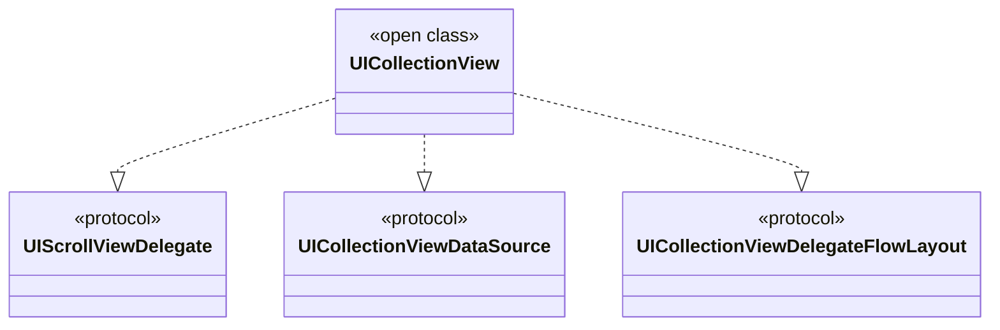

---

## **7. Relationships with Other Classes**

### **a. Related Classes Diagram**
- **Purpose**: Illustrate how `UICollectionView` interacts with other UIKit classes and frameworks.
- **Diagram Type**: `flowchart TD`
- **Contents**:
  - **UICollectionViewCell**: Represents individual items.
  - **UICollectionViewLayout**: Manages layout information.
  - **UICollectionViewFlowLayout**: A specific layout type.
  - **UICollectionViewController**: Manages a collection view.
  - **UIScrollView**: Inherits scrolling behavior.
  - **UIView**: `UICollectionView` is a subclass.
  - **NSIndexPath**: Identifies items.
  - **UIEdgeInsets**: Defines layout margins.
  - **CGSize**: Represents sizes.
  - **CGRect**: Represents frames.

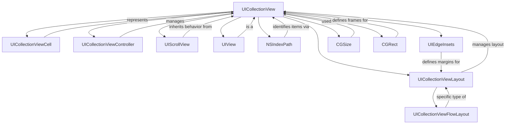

---

## **8. Extensions and Additional Functionalities**

### **a. UICollectionView Extensions Diagram**
- **Purpose**: Showcase the additional functionalities provided through extensions.
- **Diagram Type**: `classDiagram`
- **Contents**:
  - **Batch Updates**
  - **Prefetching**
  - **Drag and Drop Support**
  - **Diffable Data Source**

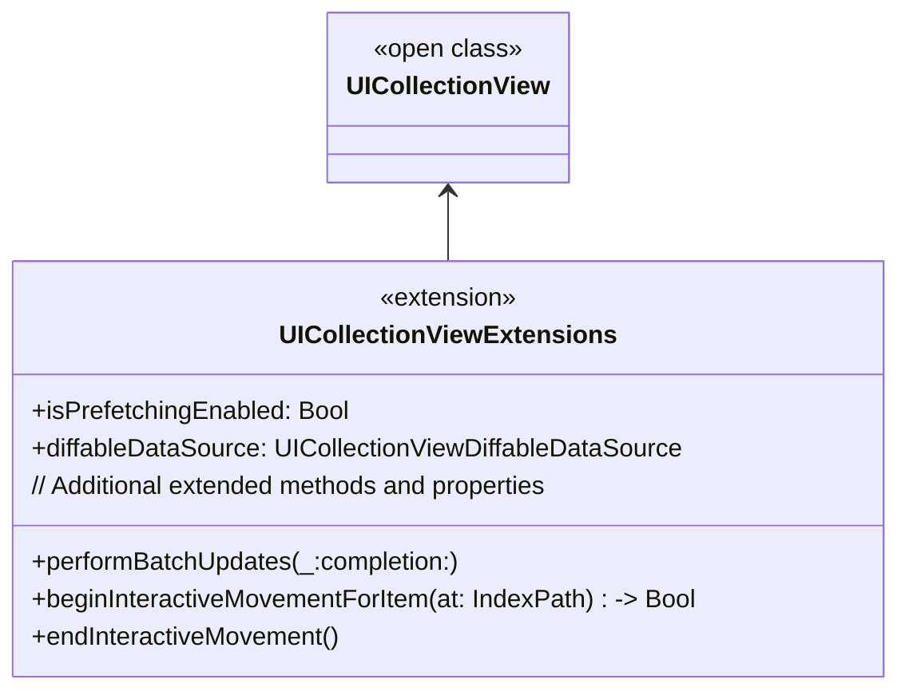

### **b. Extensions Functionalities Flowchart**
- **Purpose**: Detail specific extended methods and their purposes.
- **Diagram Type**: `flowchart LR`
- **Contents**:
  - **Batch Updates**
  - **Prefetching**
  - **Drag and Drop**
  - **Diffable Data Source**

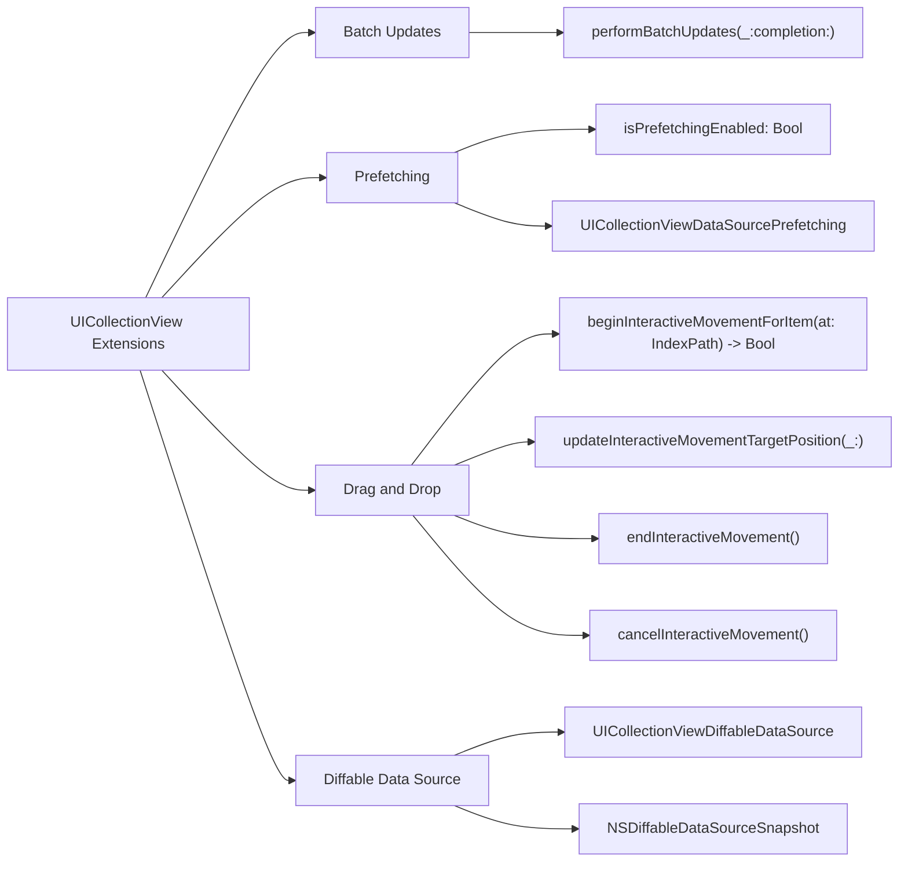

---

## **9. Lifecycle and Use Cases**

### **a. Lifecycle Flowchart**
- **Purpose**: Demonstrate the typical lifecycle of a `UICollectionView` within an application.
- **Diagram Type**: `flowchart TD`
- **Contents**:
  - **Initialization**
  - **Data Loading**
  - **Displaying Cells**
  - **Interacting with Items**
  - **Updating Data**
  - **Reusing Cells**
  - **Deallocation**

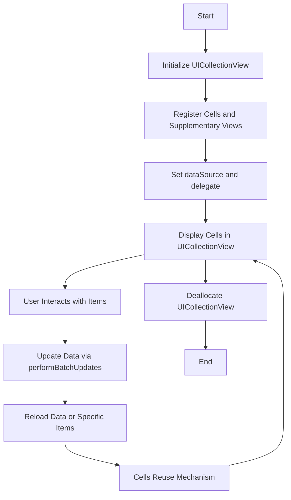

### **b. Common Use Cases Diagram**
- **Purpose**: Outline the typical scenarios where `UICollectionView` is utilized.
- **Diagram Type**: `flowchart TD`
- **Contents**:
  - **Displaying Grids and Lists**
  - **Photo Galleries**
  - **Custom Layouts**
  - **Interactive Interfaces**
  - **Compositional Layouts**
  - **Infinite Scrolling**
  - **Drag and Drop Interfaces**

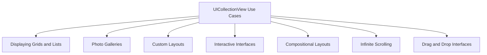

---

## **10. Feature Availability Timeline**

### **a. Feature Availability Gantt Chart**
- **Purpose**: Show when various `UICollectionView` features were introduced across iOS versions.
- **Diagram Type**: `gantt`
- **Contents**:
  - **iOS Versions**: 6.0, 7.0, 8.0, 9.0, 10.0, 11.0, 12.0, 13.0, 14.0, 15.0, 16.0, 17.0
  - **Features Introduced**: Flow Layout enhancements, automatic cell sizing, self-sizing cells, interactive reordering, compositional layouts, diffable data sources, drag and drop, etc.

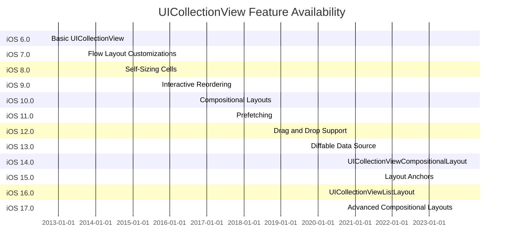

---

## **11. Data Handling and Formats**

### **a. Data Source Methods Diagram**
- **Purpose**: Explain how `UICollectionView` handles data through its data source.
- **Diagram Type**: `flowchart LR`
- **Contents**:
  - **Number of Sections**: `numberOfSections(in:)`
  - **Number of Items**: `collectionView(_:numberOfItemsInSection:)`
  - **Cell Configuration**: `collectionView(_:cellForItemAt:)`
  - **Supplementary Views**: `collectionView(_:viewForSupplementaryElementOfKind:at:)`

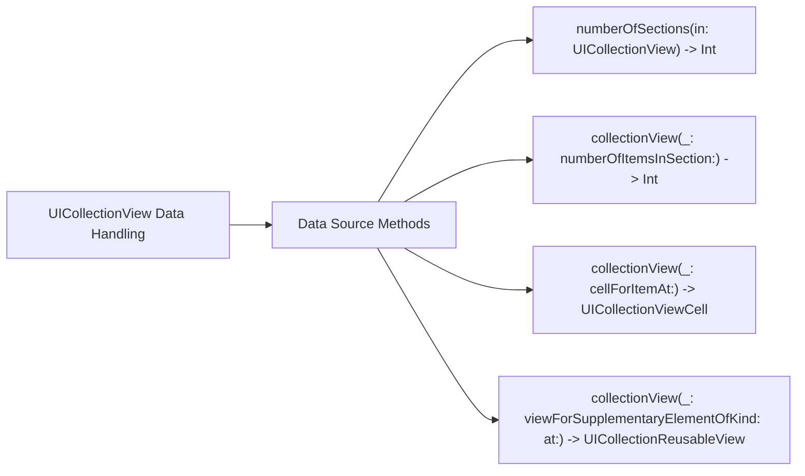

### **b. Data Representation Diagram**
- **Purpose**: Show how data maps to `UICollectionView` items and sections.
- **Diagram Type**: `graph LR`
- **Contents**:
  - **Data Model**: Represents underlying data structures.
  - **Sections and Items**: How data is divided into sections and items.
  - **IndexPath Mapping**: Connecting data to specific `IndexPath` instances.

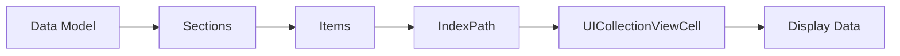

---

## **12. Integration with Drawing Contexts**

### **a. Custom Cell Drawing Diagram**
- **Purpose**: Show how `UICollectionView` integrates with custom drawing within cells.
- **Diagram Type**: `flowchart TD`
- **Contents**:
  - **UICollectionViewCell Subclass**
  - **Custom Drawing in contentView**
  - **Using Core Graphics or SwiftUI in Cells**

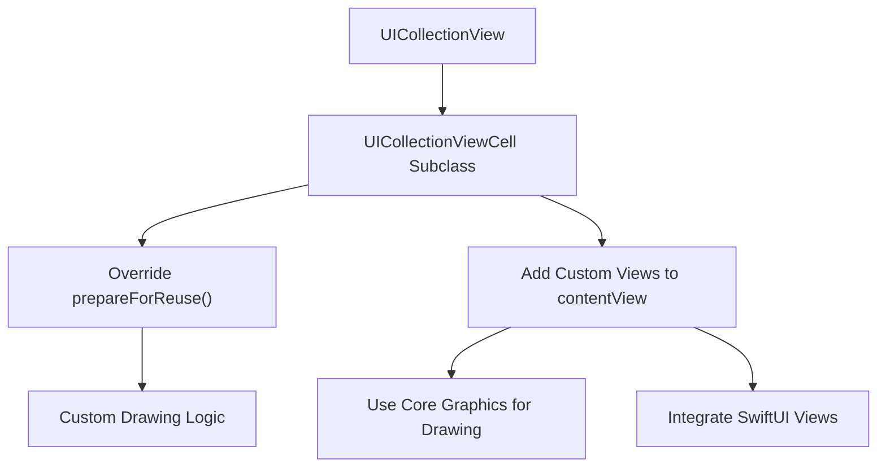

### **b. Supplementary Views Drawing Diagram**
- **Purpose**: Illustrate how supplementary views like headers and footers are integrated with drawing contexts.
- **Diagram Type**: `flowchart LR`
- **Contents**:
  - **UICollectionReusableView Subclass**
  - **Custom Drawing in Supplementary Views**
  - **Layout Integration**

```mermaid
flowchart LR
    A[UICollectionView] --> B[UICollectionReusableView Subclass]
    B --> C["Override draw(_:)"]
    C --> D[Custom Drawing Code]
    B --> E[Configure Layout Attributes]
    E --> F[UICollectionViewLayout]
    
```

---

## **13. Summary and Best Practices**

### **a. Summary Diagram**
- **Purpose**: Provide a high-level overview of `UICollectionView`'s key characteristics and functionalities.
- **Diagram Type**: `graph LR` or `mindmap`
- **Contents**:
  - **Versatile Layouts**
  - **Efficient Data Handling**
  - **Reusable Components**
  - **Interactive Features**
  - **Performance Optimizations**
  - **Seamless Integration with UIKit**

```mermaid
graph LR
    A[UICollectionView] --> B[Versatile Layouts]
    A --> C[Efficient Data Handling]
    A --> D[Reusable Components]
    A --> E[Interactive Features]
    A --> F[Performance Optimizations]
    A --> G[Seamless Integration with UIKit]

    B --> B1[Custom Layouts]
    B --> B2[Compositional Layouts]
    B --> B3[Flow Layout]

    C --> C1[Data Source Methods]
    C --> C2[Diffable Data Source]
    C --> C3[Prefetching]

    D --> D1[Reusable Cells]
    D --> D2[Supplementary Views]
    D --> D3[Reusable Identifiers]

    E --> E1[Selection Handling]
    E --> E2[Drag and Drop]
    E --> E3[Interactive Reordering]

    F --> F1[Batch Updates]
    F --> F2[Prefetching Data]
    F --> F3[Efficient Layout Invalidation]

    G --> G1[UIKit Integration]
    G --> G2[Storyboard & XIB Support]
    G --> G3[Autolayout Compatibility]
```

### **b. Best Practices Diagram**
- **Purpose**: Outline best practices for using `UICollectionView` effectively.
- **Diagram Type**: `graph LR`
- **Contents**:
  - **Reuse Identifiers**
  - **Efficient Layouts**
  - **Prefetching Data**
  - **State Management**
  - **Accessibility**
  - **Performance Optimization**
  - **Modular Design**

```mermaid
graph LR
    A[UICollectionView Best Practices] --> B[Reuse Identifiers]
    A --> C[Efficient Layouts]
    A --> D[Prefetching Data]
    A --> E[State Management]
    A --> F[Accessibility]
    A --> G[Performance Optimization]
    A --> H[Modular Design]

    B --> B1[Register Cells Properly]
    B --> B2[Dequeue Reusable Cells Correctly]

    C --> C1[Use Compositional Layouts]
    C --> C2[Optimize Flow Layout Parameters]

    D --> D1[Implement UICollectionViewDataSourcePrefetching]
    D --> D2[Load Data Asynchronously]

    E --> E1[Manage Selection State]
    E --> E2[Handle Data Updates Gracefully]

    F --> F1[Ensure UI Elements are Accessible]
    F --> F2[Support VoiceOver]

    G --> G1[Use Batch Updates]
    G --> G2[Minimize Layout Passes]
    G --> G3[Optimize Cell Rendering]

    H --> H1[Separate Data Logic from UI]
    H --> H2[Use MVVM or MVC Patterns]
```

---

## **14. Additional Diagrams**

### **a. UICollectionView Flow Diagram**
- **Purpose**: Illustrate the flow of data and actions within `UICollectionView`.
- **Diagram Type**: `flowchart TD`
- **Contents**:
  - **Data Source Interaction**
  - **Layout Process**
  - **Cell Configuration**
  - **User Interaction**

```mermaid
flowchart TD
    A[Data Source] -->|Provide Sections and Items| B[UICollectionView]
    B -->|Request Cell Configuration| C["collectionView(_:cellForItemAt:)"]
    C --> D[Configure UICollectionViewCell]
    D --> E[Display Cell]
    E --> F[User Interaction]
    F -->|Select/Deselect| G[Update Selection State]
    G --> H[Delegate Methods Called]
    H --> F
    B -->|Layout Request| I[UICollectionViewLayout]
    I -->|Provide Layout Attributes| B
    
```

### **b. UICollectionView Interaction Diagram**
- **Purpose**: Show how users interact with `UICollectionView` and how it responds.
- **Diagram Type**: `flowchart LR`
- **Contents**:
  - **User Taps an Item**
  - **Selection Handling**
  - **Delegate Callbacks**
  - **UI Updates**

```mermaid
flowchart LR
    A[User] --> B[Taps on UICollectionViewItem]
    B --> C[UICollectionView Detects Selection]
    C --> D[Updates Selection State]
    D --> E["Calls Delegate Method collectionView(_:didSelectItemAt:)"]
    E --> F[App Executes Selection Logic]
    F --> G[UI Updates Accordingly]
    
```


---

