# UIContextualAction
> This content is dual-licensed under your choice of the following licenses:
> 1.  **MIT License:** For the code implementations in Swift and Mermaid provided in this document.
> 2.  **Creative Commons Attribution 4.0 International License (CC BY 4.0):** For all other content, including the text, explanations, and the Mermaid diagrams and illustrations.

---

Below is a comprehensive and organized set of Mermaid diagrams for the `UIContextualAction` framework. These diagrams cover various aspects of `UIContextualAction`, including its class structure, initializers, properties, methods, enumerations, protocol conformances, relationships with other classes, extensions, lifecycle, use cases, feature availability, data handling, integration with other components, and best practices.

---

## **1. Class Structure and Hierarchy**

### **a. Core Class Diagram**
- **Purpose**: Illustrate the primary structure of `UIContextualAction`, including its properties, methods, and enumerations.
- **Diagram Type**: `classDiagram`
- **Contents**:
  - **Properties**: Key attributes like `style`, `title`, `backgroundColor`, `image`, etc.
  - **Methods**: Essential functions like `handler`.
  - **Enumerations**: Nested enums such as `Style`.

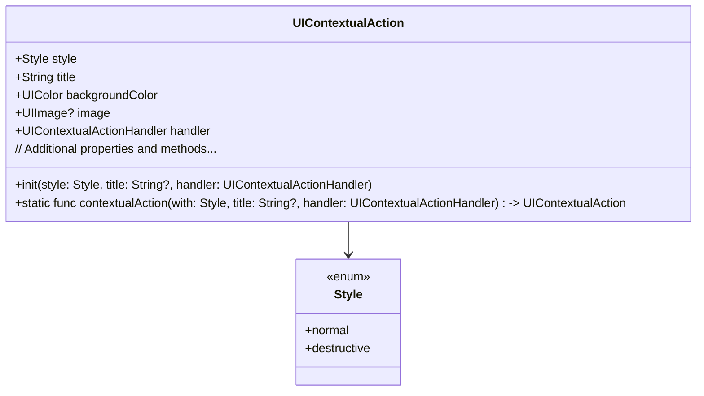
```mermaid
classDiagram
    class UIContextualAction {
        +Style style
        +String title
        +UIColor backgroundColor
        +UIImage? image
        +UIContextualActionHandler handler
        +init(style: Style, title: String?, handler: UIContextualActionHandler)
        +static func contextualAction(with: Style, title: String?, handler: UIContextualActionHandler) -> UIContextualAction
        // Additional properties and methods...
    }

    class Style {
        <<enum>>
        +normal
        +destructive
    }

    UIContextualAction --> Style
```

---

## **2. Initializers Overview**

### **a. Initialization Methods Diagram**
- **Purpose**: Break down the various ways to instantiate `UIContextualAction`.
- **Diagram Type**: `flowchart LR`
- **Contents**:
  - **Designated Initializer**: `init(style:title:handler:)`
  - **Convenience Initializer**: `contextualAction(with:title:handler:)`

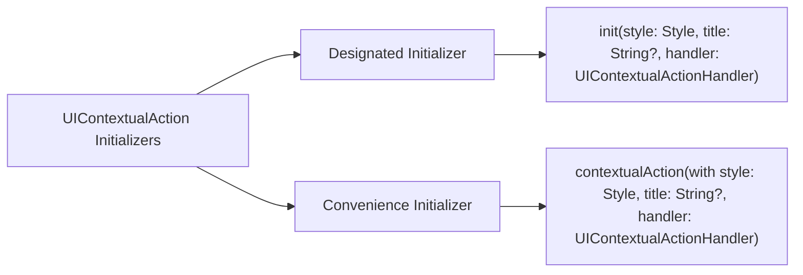
```mermaid
graph LR
    A[UIContextualAction Initializers] --> B[Designated Initializer]
    A --> C[Convenience Initializer]

    B --> B1["init(style: Style, title: String?, handler: UIContextualActionHandler)"]
    C --> C1["contextualAction(with style: Style, title: String?, handler: UIContextualActionHandler)"]
```

---

## **3. Properties Breakdown**

### **a. Key Properties Diagram**
- **Purpose**: Detail the main properties of `UIContextualAction`.
- **Diagram Type**: `graph LR`
- **Contents**:
  - **Action Attributes**: `style`, `title`, `handler`
  - **Appearance**: `backgroundColor`, `image`, `titleTextAttributes`
  - **State Management**: `isEnabled`

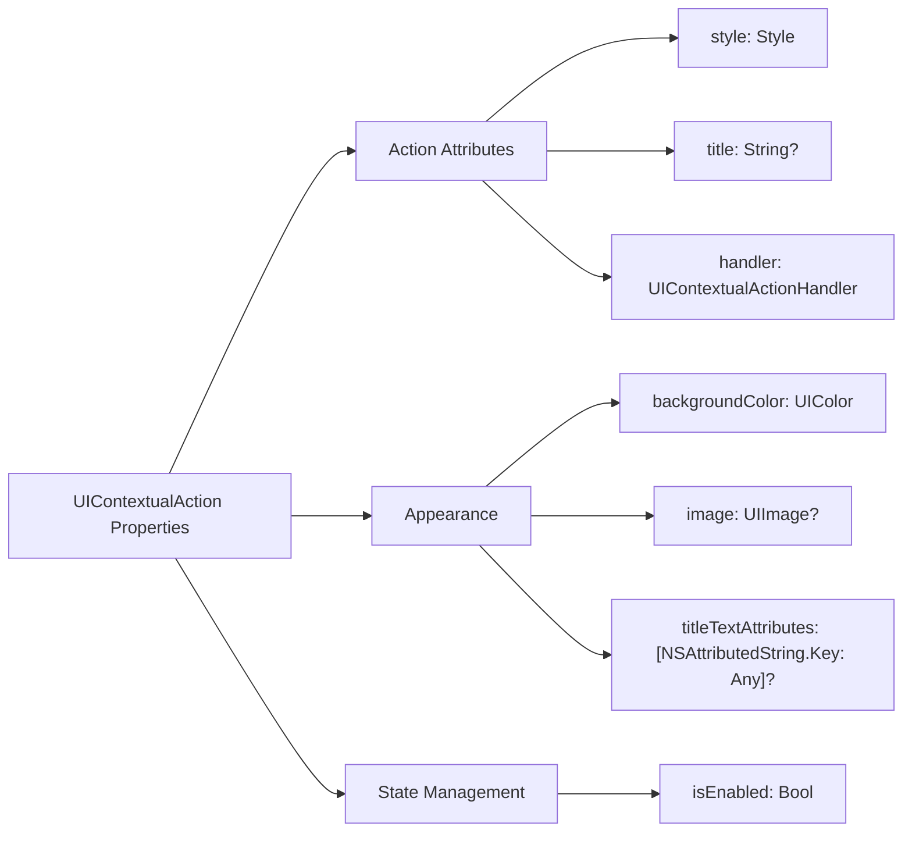
```mermaid
graph LR
    A[UIContextualAction Properties] --> B[Action Attributes]
    A --> C[Appearance]
    A --> D[State Management]

    B --> B1[style: Style]
    B --> B2[title: String?]
    B --> B3[handler: UIContextualActionHandler]

    C --> C1[backgroundColor: UIColor]
    C --> C2[image: UIImage?]
    C --> C3["titleTextAttributes: [NSAttributedString.Key: Any]?"]

    D --> D1[isEnabled: Bool]
```

---

## **4. Methods Grouped by Functionality**

### **a. Action Handling Methods**
- **Purpose**: Categorize methods based on their roles in handling actions.
- **Diagram Type**: `flowchart TD`
- **Contents**:
  - **Initialization Methods**: `init(style:title:handler:)`, `contextualAction(with:title:handler:)`
  - **Configuration Methods**: `configure(with:)`, `setTitle(_:for:)`
  - **Execution Methods**: `handler`

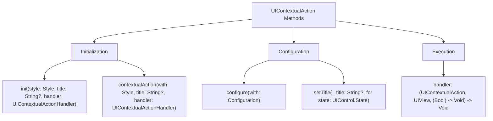
```mermaid
flowchart TD
    A[UIContextualAction Methods] --> B[Initialization]
    A --> C[Configuration]
    A --> D[Execution]

    B --> B1["init(style: Style, title: String?, handler: UIContextualActionHandler)"]
    B --> B2["contextualAction(with: Style, title: String?, handler: UIContextualActionHandler)"]

    C --> C1["configure(with: Configuration)"]
    C --> C2["setTitle(_ title: String?, for state: UIControl.State)"]

    D --> D1["handler: (UIContextualAction, UIView, (Bool) -> Void) -> Void"]
```

---

## **5. Enumerations and Configurations**

### **a. Enumerations Diagram**
- **Purpose**: Highlight the enums used within `UIContextualAction` and their possible values.
- **Diagram Type**: `classDiagram`
- **Contents**:
  - **Style**

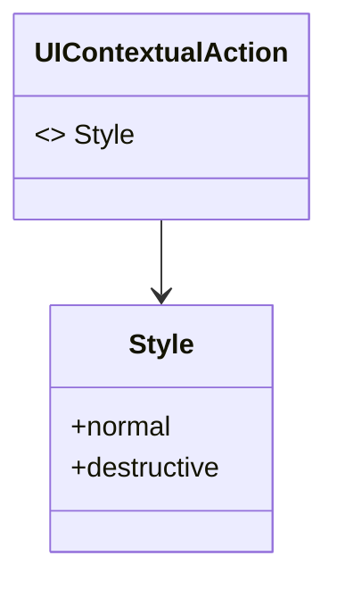
```mermaid
classDiagram
    class UIContextualAction {
        <<enumeration>> Style
    }

    class Style {
        +normal
        +destructive
    }

    UIContextualAction --> Style
```

### **b. Configuration Classes Diagram**
- **Purpose**: Show the relationship between `UIContextualAction` and its configuration classes.
- **Diagram Type**: `classDiagram`
- **Contents**:
  - **UIContextualActionConfiguration**

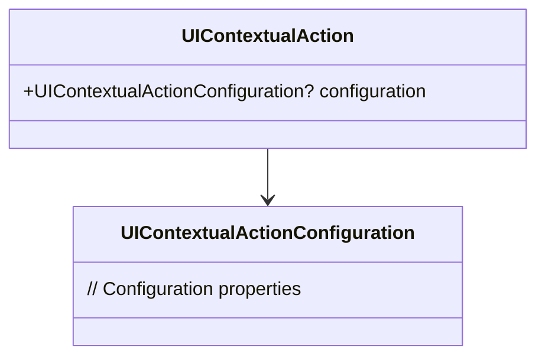
```mermaid
classDiagram
    class UIContextualAction {
        +UIContextualActionConfiguration? configuration
    }

    class UIContextualActionConfiguration {
        // Configuration properties
    }

    UIContextualAction --> UIContextualActionConfiguration
```

---

## **6. Protocol Conformances**

### **a. Protocols Diagram**
- **Purpose**: Display the protocols that `UIContextualAction` conforms to and their impact.
- **Diagram Type**: `classDiagram`
- **Contents**:
  - **NSObjectProtocol**
  - **NSCopying**
  - **UIActionItem**

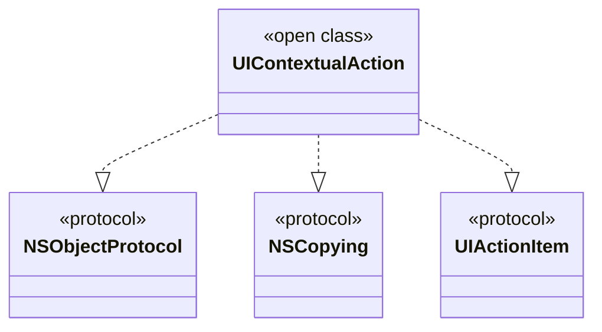
```mermaid
classDiagram
    class UIContextualAction {
        <<open class>>
    }

    class NSObjectProtocol {
        <<protocol>>
    }

    class NSCopying {
        <<protocol>>
    }

    class UIActionItem {
        <<protocol>>
    }

    UIContextualAction ..|> NSObjectProtocol
    UIContextualAction ..|> NSCopying
    UIContextualAction ..|> UIActionItem
```

---

## **7. Relationships with Other Classes**

### **a. Related Classes Diagram**
- **Purpose**: Illustrate how `UIContextualAction` interacts with other UIKit classes and frameworks.
- **Diagram Type**: `flowchart TD`
- **Contents**:
  - **UITableViewRowAction**: Deprecated alternative for actions in UITableView.
  - **UISwipeActionsConfiguration**: Configuration object that holds multiple actions.
  - **UITableView**: Hosts `UIContextualAction` within its delegate methods.
  - **UICollectionView**: Hosts `UIContextualAction` within its delegate methods.
  - **UIContextualActionHandler**: Closure type used as action handlers.

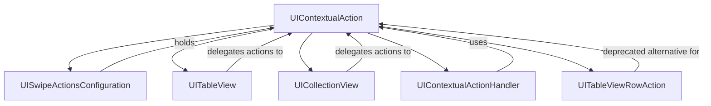
```mermaid
flowchart TD
    A[UIContextualAction] --> B[UISwipeActionsConfiguration]
    A --> C[UITableView]
    A --> D[UICollectionView]
    A --> E[UIContextualActionHandler]
    A --> F[UITableViewRowAction]

    B --> |holds| A
    C --> |delegates actions to| A
    D --> |delegates actions to| A
    E --> |uses| A
    F --> |deprecated alternative for| A
```

---

## **8. Extensions and Additional Functionalities**

### **a. UIContextualAction Extensions Diagram**
- **Purpose**: Showcase the additional functionalities provided through extensions.
- **Diagram Type**: `classDiagram`
- **Contents**:
  - **UIContextualAction+Styling**
  - **UIContextualAction+Accessibility**

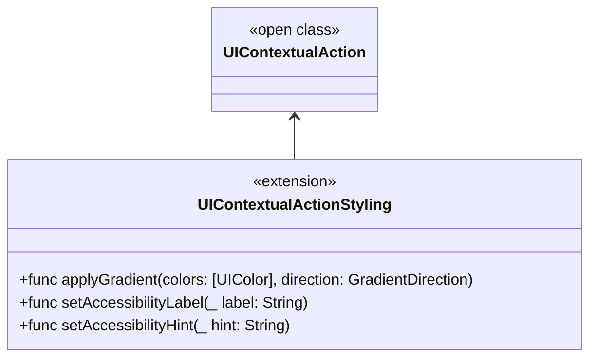
```mermaid
classDiagram
    class UIContextualAction {
        <<open class>>
    }

    class UIContextualActionStyling {
        <<extension>>
        +func applyGradient(colors: [UIColor], direction: GradientDirection)
        +func setAccessibilityLabel(_ label: String)
        +func setAccessibilityHint(_ hint: String)
    }

    UIContextualAction <-- UIContextualActionStyling
```

### **b. Extensions Functionalities Flowchart**
- **Purpose**: Detail specific extended methods and their purposes.
- **Diagram Type**: `flowchart LR`
- **Contents**:
  - **Styling Enhancements**
  - **Accessibility Improvements**
  - **Advanced Configuration**

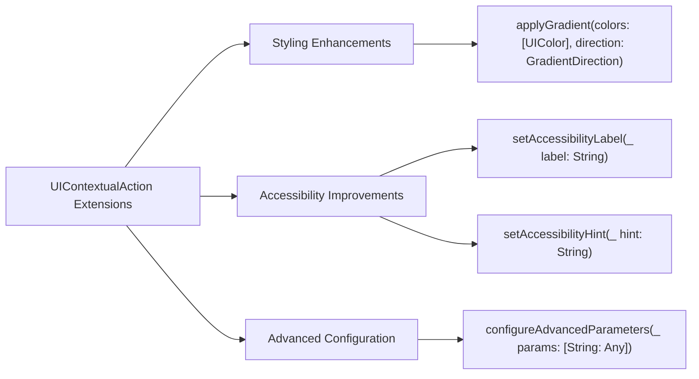
```mermaid
flowchart LR
    A[UIContextualAction Extensions] --> B[Styling Enhancements]
    A --> C[Accessibility Improvements]
    A --> D[Advanced Configuration]

    B --> B1["applyGradient(colors: [UIColor], direction: GradientDirection)"]
    C --> C1["setAccessibilityLabel(_ label: String)"]
    C --> C2["setAccessibilityHint(_ hint: String)"]
    D --> D1["configureAdvancedParameters(_ params: [String: Any])"]
```

---

## **9. Lifecycle and Use Cases**

### **a. Lifecycle Flowchart**
- **Purpose**: Demonstrate the typical lifecycle of a `UIContextualAction` within an application.
- **Diagram Type**: `flowchart TD`
- **Contents**:
  - **Creation**
  - **Configuration**
  - **Integration**
  - **Execution**
  - **Destruction**

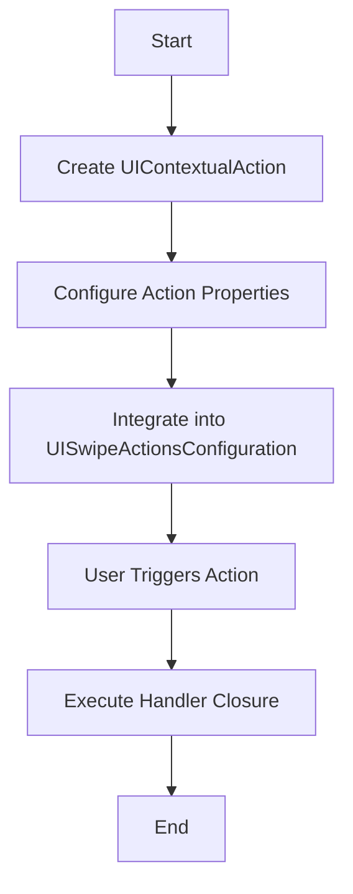
```mermaid
flowchart TD
    Start[Start] --> Create[Create UIContextualAction]
    Create --> Configure[Configure Action Properties]
    Configure --> Integrate[Integrate into UISwipeActionsConfiguration]
    Integrate --> Execute[User Triggers Action]
    Execute --> Handle[Execute Handler Closure]
    Handle --> End[End]
```

### **b. Common Use Cases Diagram**
- **Purpose**: Outline the typical scenarios where `UIContextualAction` is utilized.
- **Diagram Type**: `flowchart TD`
- **Contents**:
  - **Delete Item**
  - **Mark as Favorite**
  - **Share Content**
  - **Custom Actions**
  - **Undo Actions**
  - **Archive Items**

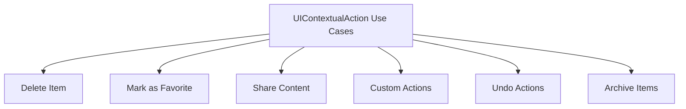
```mermaid
flowchart TD
    A[UIContextualAction Use Cases] --> B[Delete Item]
    A --> C[Mark as Favorite]
    A --> D[Share Content]
    A --> E[Custom Actions]
    A --> F[Undo Actions]
    A --> G[Archive Items]
```

---

## **10. Feature Availability Timeline**

### **a. Feature Availability Gantt Chart**
- **Purpose**: Show when various `UIContextualAction` features were introduced across iOS versions.
- **Diagram Type**: `gantt`
- **Contents**:
  - **iOS Versions**: 11.0, 13.0, 14.0, 15.0, 16.0, 17.0
  - **Features Introduced**: Basic actions, multiple actions support, styling enhancements, accessibility improvements, integration with UICollectionView, contextual menus.

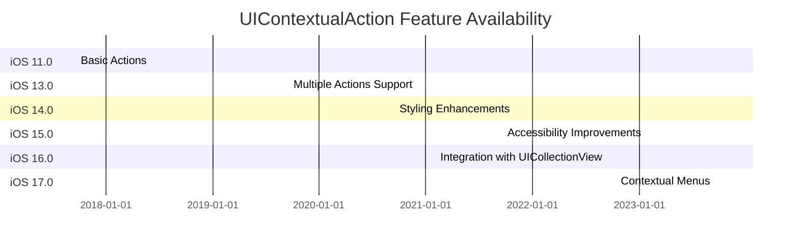
```mermaid
gantt
    dateFormat  YYYY-MM-DD
    title UIContextualAction Feature Availability

    section iOS 11.0
    Basic Actions                      :done, des1, 2017-09-19, 2017-09-19

    section iOS 13.0
    Multiple Actions Support           :done, des2, 2019-09-19, 2019-09-19

    section iOS 14.0
    Styling Enhancements               :done, des3, 2020-09-16, 2020-09-16

    section iOS 15.0
    Accessibility Improvements        :done, des4, 2021-09-20, 2021-09-20

    section iOS 16.0
    Integration with UICollectionView :done, des5, 2022-09-12, 2022-09-12

    section iOS 17.0
    Contextual Menus                  :done, des6, 2023-09-18, 2023-09-18
```

---

## **11. Data Handling and Formats**

### **a. Action Configuration Handling Diagram**
- **Purpose**: Explain how `UIContextualAction` handles different configurations and data formats.
- **Diagram Type**: `graph LR`
- **Contents**:
  - **Basic Configuration**: `style`, `title`, `handler`
  - **Advanced Styling**: `backgroundColor`, `image`
  - **Accessibility Data**: `accessibilityLabel`, `accessibilityHint`

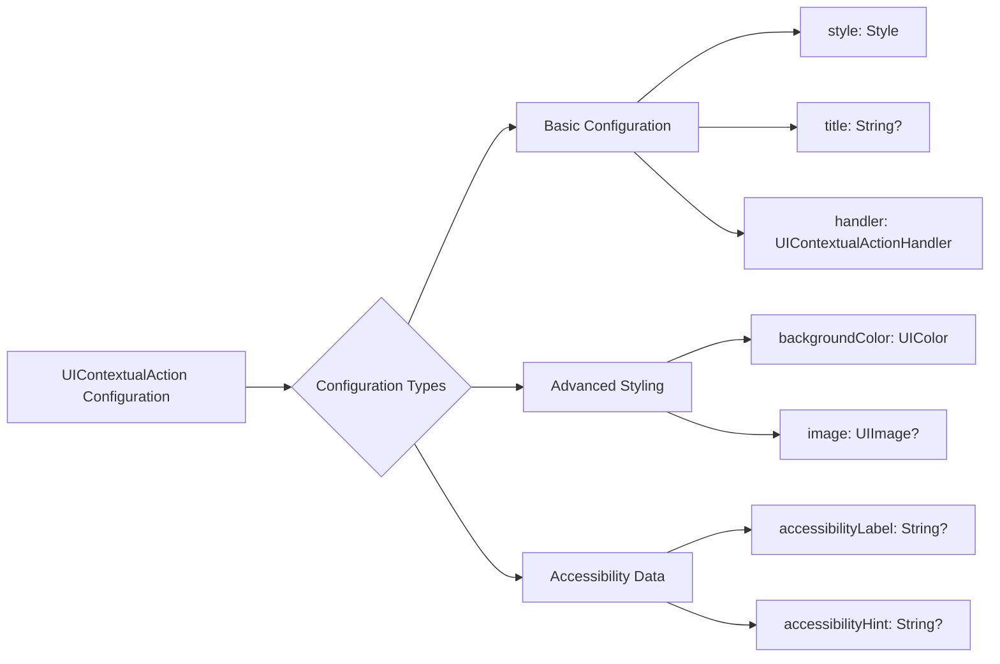
```mermaid
graph LR
    A[UIContextualAction Configuration] --> B{Configuration Types}
    B --> C[Basic Configuration]
    B --> D[Advanced Styling]
    B --> E[Accessibility Data]

    C --> C1[style: Style]
    C --> C2[title: String?]
    C --> C3[handler: UIContextualActionHandler]

    D --> D1[backgroundColor: UIColor]
    D --> D2[image: UIImage?]

    E --> E1[accessibilityLabel: String?]
    E --> E2[accessibilityHint: String?]
```

---

## **12. Integration with Drawing Contexts**

### **a. Action Presentation Methods Diagram**
- **Purpose**: Show how `UIContextualAction` methods are used within table and collection view contexts.
- **Diagram Type**: `flowchart TD`
- **Contents**:
  - **UITableView**
  - **UICollectionView**
  - **Delegate Methods**
  - **Action Execution**

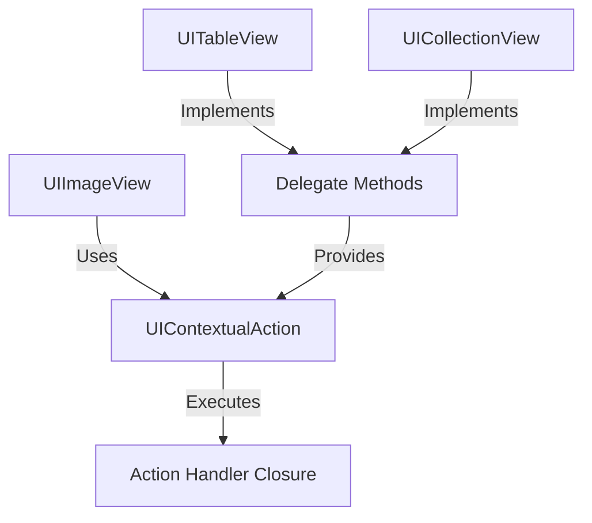
```mermaid
flowchart TD
    UIImageView -->|Uses| UIContextualAction
    UITableView -->|Implements| DelegateMethods[Delegate Methods]
    UICollectionView -->|Implements| DelegateMethods

    DelegateMethods -->|Provides| UIContextualAction
    UIContextualAction -->|Executes| ActionHandler[Action Handler Closure]
```

---

## **13. Summary and Best Practices**

### **a. Summary Diagram**
- **Purpose**: Provide a high-level overview of `UIContextualAction`'s key characteristics and functionalities.
- **Diagram Type**: `graph LR`
- **Contents**:
  - **Action Customization**
  - **User Interaction**
  - **Integration Flexibility**
  - **Accessibility Support**
  - **Performance Considerations**

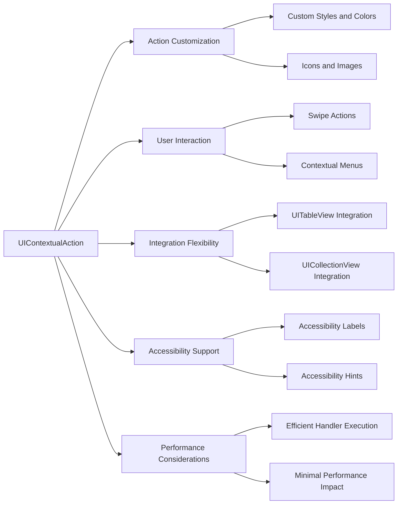
```mermaid
graph LR
    A[UIContextualAction] --> B[Action Customization]
    A --> C[User Interaction]
    A --> D[Integration Flexibility]
    A --> E[Accessibility Support]
    A --> F[Performance Considerations]

    B --> B1[Custom Styles and Colors]
    B --> B2[Icons and Images]

    C --> C1[Swipe Actions]
    C --> C2[Contextual Menus]

    D --> D1[UITableView Integration]
    D --> D2[UICollectionView Integration]

    E --> E1[Accessibility Labels]
    E --> E2[Accessibility Hints]

    F --> F1[Efficient Handler Execution]
    F --> F2[Minimal Performance Impact]
```

---

## **14. Best Practices and Recommendations**

### **a. Best Practices Diagram**
- **Purpose**: Highlight best practices when using `UIContextualAction`.
- **Diagram Type**: `graph LR`
- **Contents**:
  - **Consistent Styling**
  - **Accessible Actions**
  - **Efficient Handlers**
  - **User Feedback**
  - **Testing and Validation**

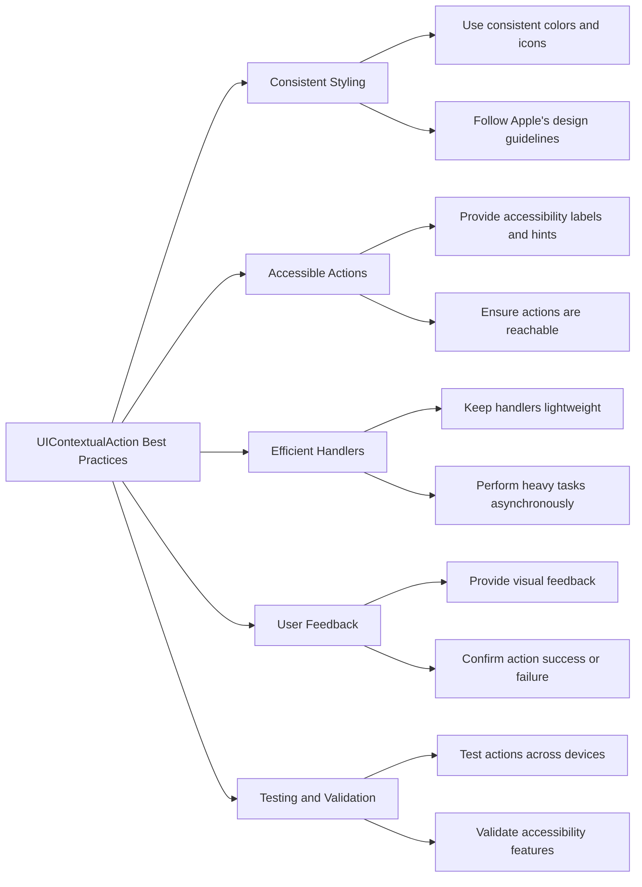
```mermaid
graph LR
    A[UIContextualAction Best Practices] --> B[Consistent Styling]
    A --> C[Accessible Actions]
    A --> D[Efficient Handlers]
    A --> E[User Feedback]
    A --> F[Testing and Validation]

    B --> B1[Use consistent colors and icons]
    B --> B2[Follow Apple's design guidelines]

    C --> C1[Provide accessibility labels and hints]
    C --> C2[Ensure actions are reachable]

    D --> D1[Keep handlers lightweight]
    D --> D2[Perform heavy tasks asynchronously]

    E --> E1[Provide visual feedback]
    E --> E2[Confirm action success or failure]

    F --> F1[Test actions across devices]
    F --> F2[Validate accessibility features]
```

---

## **15. Error Handling and Troubleshooting**

### **a. Common Issues and Solutions Diagram**
- **Purpose**: Identify common issues when using `UIContextualAction` and their solutions.
- **Diagram Type**: `flowchart TD`
- **Contents**:
  - **Action Not Displaying**
  - **Handler Not Triggering**
  - **Styling Issues**
  - **Accessibility Problems**
  - **Performance Bottlenecks**

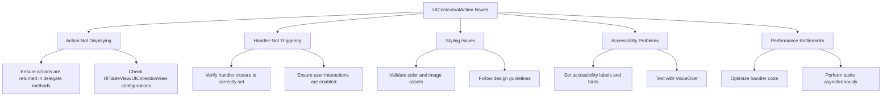
```mermaid
flowchart TD
    A[UIContextualAction Issues] --> B[Action Not Displaying]
    A --> C[Handler Not Triggering]
    A --> D[Styling Issues]
    A --> E[Accessibility Problems]
    A --> F[Performance Bottlenecks]

    B --> B1["Ensure actions are returned in delegate methods"]
    B --> B2["Check UITableView/UICollectionView configurations"]

    C --> C1["Verify handler closure is correctly set"]
    C --> C2["Ensure user interactions are enabled"]

    D --> D1["Validate color and image assets"]
    D --> D2["Follow design guidelines"]

    E --> E1["Set accessibility labels and hints"]
    E --> E2["Test with VoiceOver"]

    F --> F1["Optimize handler code"]
    F --> F2["Perform tasks asynchronously"]
```

---

## **16. Advanced Features and Customizations**

### **a. Advanced Customizations Diagram**
- **Purpose**: Showcase advanced customization options available with `UIContextualAction`.
- **Diagram Type**: `graph LR`
- **Contents**:
  - **Dynamic Action Configuration**
  - **Custom Animation**
  - **Conditional Actions**
  - **Rich Content Integration**

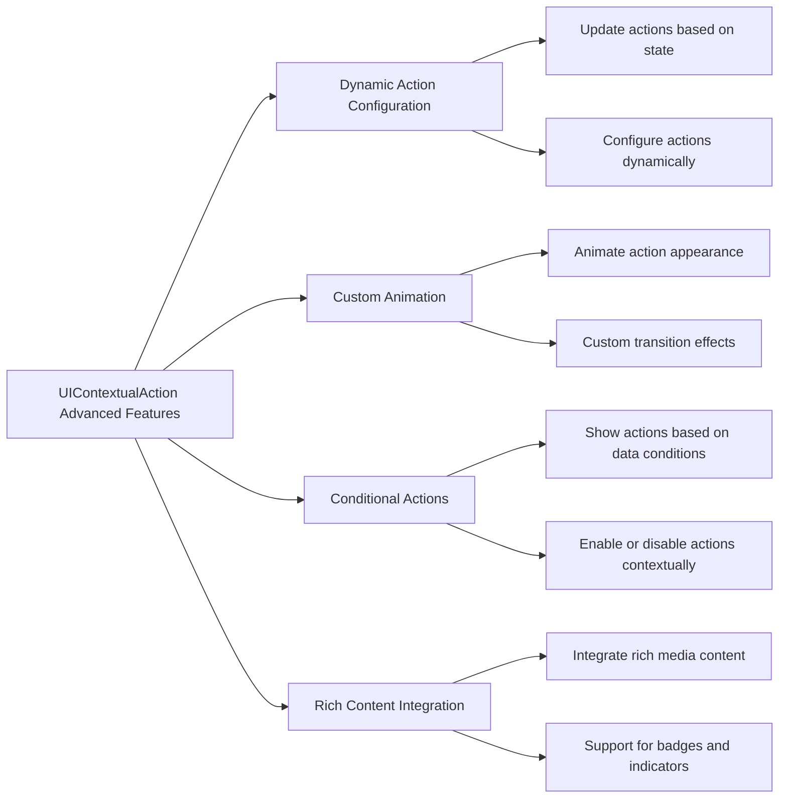
```mermaid
graph LR
    A[UIContextualAction Advanced Features] --> B[Dynamic Action Configuration]
    A --> C[Custom Animation]
    A --> D[Conditional Actions]
    A --> E[Rich Content Integration]

    B --> B1["Update actions based on state"]
    B --> B2["Configure actions dynamically"]

    C --> C1["Animate action appearance"]
    C --> C2["Custom transition effects"]

    D --> D1["Show actions based on data conditions"]
    D --> D2["Enable or disable actions contextually"]

    E --> E1["Integrate rich media content"]
    E --> E2["Support for badges and indicators"]
```

---

## **17. Security Considerations**

### **a. Security Best Practices Diagram**
- **Purpose**: Highlight security best practices when implementing `UIContextualAction`.
- **Diagram Type**: `graph LR`
- **Contents**:
  - **Data Validation**
  - **Secure Handlers**
  - **User Permissions**
  - **Error Handling**

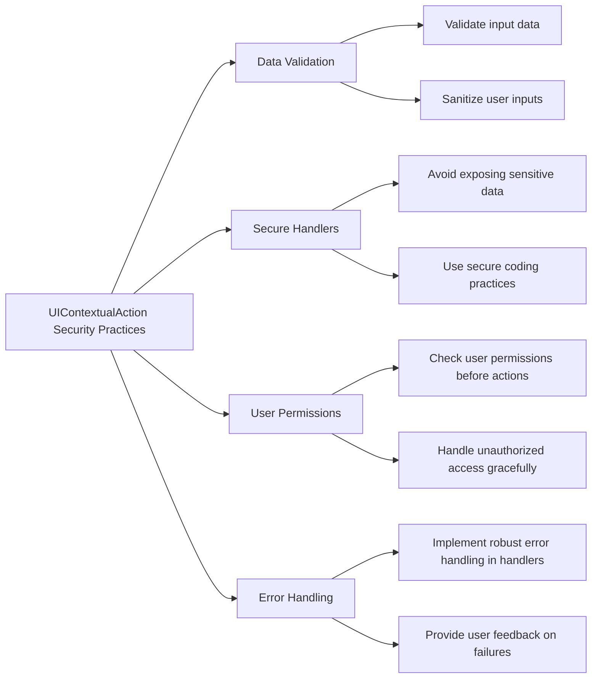
```mermaid
graph LR
    A[UIContextualAction Security Practices] --> B[Data Validation]
    A --> C[Secure Handlers]
    A --> D[User Permissions]
    A --> E[Error Handling]

    B --> B1["Validate input data"]
    B --> B2["Sanitize user inputs"]

    C --> C1["Avoid exposing sensitive data"]
    C --> C2["Use secure coding practices"]

    D --> D1["Check user permissions before actions"]
    D --> D2["Handle unauthorized access gracefully"]

    E --> E1["Implement robust error handling in handlers"]
    E --> E2["Provide user feedback on failures"]
```

---

## **18. Performance Optimization**

### **a. Performance Tips Diagram**
- **Purpose**: Provide tips to optimize the performance when using `UIContextualAction`.
- **Diagram Type**: `flowchart LR`
- **Contents**:
  - **Efficient Handler Implementation**
  - **Lazy Loading Resources**
  - **Minimize UI Updates**
  - **Asynchronous Operations**

```mermaid
flowchart LR
    A[UIContextualAction Performance Optimization] --> B[Efficient Handler Implementation]
    A --> C[Lazy Loading Resources]
    A --> D[Minimize UI Updates]
    A --> E[Asynchronous Operations]

    B --> B1["Keep handlers lightweight"]
    B --> B2["Avoid blocking the main thread"]

    C --> C1["Load images and resources on demand"]
    C --> C2["Use caching mechanisms"]

    D --> D1["Batch UI updates"]
    D --> D2["Reduce the number of view redraws"]

    E --> E1["Perform heavy tasks asynchronously"]
    E --> E2["Use background queues for processing"]
```

---

## **19. Testing and Quality Assurance**

### **a. Testing Strategies Diagram**
- **Purpose**: Outline testing strategies to ensure the reliability of `UIContextualAction`.
- **Diagram Type**: `flowchart TD`
- **Contents**:
  - **Unit Testing**
  - **UI Testing**
  - **Accessibility Testing**
  - **Performance Testing**

```mermaid
flowchart TD
    A[UIContextualAction Testing Strategies] --> B[Unit Testing]
    A --> C[UI Testing]
    A --> D[Accessibility Testing]
    A --> E[Performance Testing]

    B --> B1["Test action initialization"]
    B --> B2["Verify handler execution"]

    C --> C1["Automate swipe gestures"]
    C --> C2["Validate UI response"]

    D --> D1["Ensure accessibility labels are set"]
    D --> D2["Test with VoiceOver"]

    E --> E1["Measure handler execution time"]
    E --> E2["Monitor memory usage"]
```

---

## **20. Integration with Other Frameworks**

### **a. Integration Diagram**
- **Purpose**: Show how `UIContextualAction` integrates with other iOS frameworks and components.
- **Diagram Type**: `flowchart TD`
- **Contents**:
  - **Core Data**
  - **CloudKit**
  - **Networking Frameworks**
  - **Third-Party Libraries**

```mermaid
flowchart TD
    A[UIContextualAction Integration] --> B[Core Data]
    A --> C[CloudKit]
    A --> D[Networking Frameworks]
    A --> E[Third-Party Libraries]

    B --> |Handle Data Deletion| F[NSManagedObjectContext]
    C --> |Sync Actions| G[CKDatabase]
    D --> |Perform Network Requests| H[URLSession]
    E --> |Enhance Functionality| I[Custom Libraries]
```

---

## **21. Real-World Examples**

### **a. Use Case Diagrams**
- **Purpose**: Provide real-world examples of `UIContextualAction` usage.
- **Diagram Type**: `flowchart LR`
- **Contents**:
  - **Email App**: Swipe to delete or archive emails.
  - **Tasks App**: Swipe to mark tasks as completed or edit.
  - **Photos App**: Swipe to share or delete photos.

```mermaid
flowchart LR
    A[Real-World UIContextualAction Examples] --> B[Email App]
    A --> C[Tasks App]
    A --> D[Photos App]

    B --> B1["Swipe to Delete Email"]
    B --> B2["Swipe to Archive Email"]

    C --> C1["Swipe to Mark Task as Completed"]
    C --> C2["Swipe to Edit Task"]

    D --> D1["Swipe to Share Photo"]
    D --> D2["Swipe to Delete Photo"]
```

---

## **22. Comparison with Alternatives**

### **a. Comparison Diagram**
- **Purpose**: Compare `UIContextualAction` with alternative approaches for implementing actions.
- **Diagram Type**: `graph LR`
- **Contents**:
  - **UIContextualAction**
  - **UITableViewRowAction** (Deprecated)
  - **Custom Swipe Gestures**
  - **Context Menus**

```mermaid
graph LR
    A[Action Implementation Methods] --> B[UIContextualAction]
    A --> C[UITableViewRowAction]
    A --> D[Custom Swipe Gestures]
    A --> E[Context Menus]

    B --> |Modern and flexible| F[Preferred]
    C --> |Deprecated since iOS 11| G[Not Recommended]
    D --> |Requires manual handling| H[More Control]
    E --> |Rich interactions| I[Currently Recommended]
```

---

## **23. Documentation and Resources**

### **a. Resources Diagram**
- **Purpose**: Provide links to official documentation and helpful resources.
- **Diagram Type**: `flowchart TD`
- **Contents**:
  - **Apple Documentation**
  - **Tutorials**
  - **Community Forums**
  - **Sample Code**

```mermaid
flowchart TD
    A[UIContextualAction Resources] --> B[Apple Documentation]
    A --> C[Tutorials]
    A --> D[Community Forums]
    A --> E[Sample Code]

    B --> B1["https://developer.apple.com/documentation/uikit/uicontextualaction"]
    C --> C1["Ray Wenderlich Tutorials"]
    C --> C2["Apple Developer Tutorials"]
    D --> D1["Stack Overflow"]
    D --> D2["Apple Developer Forums"]
    E --> E1["GitHub Repositories"]
    E --> E2["Apple Sample Projects"]
```

---

## **24. Future Directions**

### **a. Upcoming Features Diagram**
- **Purpose**: Highlight potential future enhancements and features for `UIContextualAction`.
- **Diagram Type**: `flowchart LR`
- **Contents**:
  - **Enhanced Customization**
  - **Integration with SwiftUI**
  - **More Interactive Actions**
  - **Improved Accessibility Features**

```mermaid
flowchart LR
    A[Future Directions for UIContextualAction] --> B[Enhanced Customization]
    A --> C[Integration with SwiftUI]
    A --> D[More Interactive Actions]
    A --> E[Improved Accessibility Features]

    B --> B1["Advanced styling options"]
    B --> B2["Gradient backgrounds"]

    C --> C1["Seamless SwiftUI integration"]
    C --> C2["Declarative action definitions"]

    D --> D1["Interactive animations"]
    D --> D2["Rich media support"]

    E --> E1["Better VoiceOver support"]
    E --> E2["Custom accessibility actions"]
```

---

## **25. Summary and Best Practices**

### **a. Summary Diagram**
- **Purpose**: Provide a high-level overview of `UIContextualAction`'s key characteristics and functionalities.
- **Diagram Type**: `graph LR`
- **Contents**:
  - **Flexible Action Creation**
  - **Seamless Integration**
  - **Customizable Appearance**
  - **Accessibility Support**
  - **Performance Optimizations**

```mermaid
graph LR
    A[UIContextualAction Overview] --> B[Flexible Action Creation]
    A --> C[Seamless Integration]
    A --> D[Customizable Appearance]
    A --> E[Accessibility Support]
    A --> F[Performance Optimizations]

    B --> B1[Multiple initializer options]
    B --> B2[Dynamic action configurations]

    C --> C1[Works with UITableView and UICollectionView]
    C --> C2[Supports multiple actions per item]

    D --> D1[Custom colors and images]
    D --> D2[Styling extensions]

    E --> E1[Accessible labels and hints]
    E --> E2[Support for VoiceOver]

    F --> F1[Efficient handler execution]
    F --> F2[Asynchronous operations]
```

---
**Licenses:**

- **MIT License:**   - Full text in [LICENSE](LICENSE) file.
- **Creative Commons Attribution 4.0 International:**  - Legal details in [LICENSE-CC-BY](LICENSE-CC-BY) and at [Creative Commons official site](http://creativecommons.org/licenses/by/4.0/).

---